# 0801 Answer｜位置关系：从结点地址到压缩数组

> [原题 13 题](0801.md) · [0731 已教的复杂度动作](0731-route.md) · [全链学习规则](answer-quality/learning-system.md)
>
> 这组题目前没有完整的首次作答记录。下文是已核过原图与答案的教学稿，不能据此推断你做过、错过或已经掌握。每题先给能动笔的路径；真正需要看数据怎样变化时，展开紧贴该题的折叠层。答案是复习核对，首次训练先在题单看原图。

<strong>复习时先打开：13 题的考场动作与卡住时的退路</strong>

每行只供**学过本题后**快速调用；第一次不会就跳到相应题的原图和展开层，不硬背这张表。

| 题 | 首个动作 | 卡住时至少守住什么 |
| --- | --- | --- |
| [01](#q01) | 两条升序链各取较小者，接结果头部 | 全部 `m+n` 结点须进入结果，不能只算 `min` |
| [02](#q02) | 标出“头元素”和“尾后空位” | 空位绕一格碰头才满；取模是数组长度 `M` |
| [03](#q03) | 从表头地址沿链接字段追到逻辑链 | 先画 `a→f→e`，再填存储地址 |
| [04](#q04) | 遮掉 `p`，让左邻和右邻互指 | 等号左边才是被改写的字段 |
| [05](#q05) | 数前面各行实际存入的格子 | 带外零不占 `N`；矩阵从 1、数组从 0 |
| [06](#q06) | 问怎样保存非零元坐标 | 三元组、十字链表才只为非零元建记录 |
| [07](#q07) | 上三角行长 `12,11,…` | 不能用完整矩阵行长 12 跳到第 6 行 |
| [08](#q08) | `m7,2` 先映为 `m2,7`，按列数 | 本题列优先，旧题的行优先路线须换单位 |
| [09](#q09) | 先存被删首元，再断链 | 单元素时 `p` 尾指针也指向它 |
| [10](#q10) | 地址差扣掉本行列偏移 | 三整行的跨度可反推每行列数 |
| [11](#q11) | 每做一句赋值就更新 `p→s→R` | 此时 `p->next` 已是 `s`，旧邻居要经 `s->next` 找 |
| [12](#q12) | 从三元组推不出的信息找起 | 全零的末尾行列不会出现在表里 |
| [13](#q13) | 第一行先把 `q` 改指向 `p` 后继 | 原来的 `q` 已不决定被移动的结点 |

限时熟练尚未验证；复习时记录题号、耗时、是否独立和动用的保底动作，不把看完这张表算成通关。

## 01｜2013-01：升序输入怎样接出降序

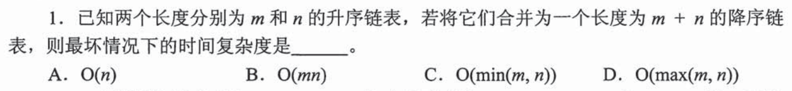

这题曾在 0731-03 出现。上次建立了“每个结点只处理一次”的复杂度判断；这次要补的是**具体怎么接**：两条升序链表各看当前结点，取较小者，从原链摘下并接到结果表最前面。取出顺序是从小到大，头部接入后的结果从大到小。两个游标各自只向前，故 `m+n=Θ(max(m,n))`，选 **D**。

如果“接到最前面”还只是一个词

例如原链为 `1→3` 和 `2→4`。先取 1，结果 `1`；再取 2，结果 `2→1`；取 3、4 后变成 `4→3→2→1`。每次只改少量链接，不在结果中重新寻找位置。这里使用的是**已有结点**，不是逐个创建新结点再排序。即使暂时写不出完整指针代码，也可先排除 `O(min(m,n))`：短链用完，长链的剩余结点仍在最终链表中；`O(mn)` 则需要重复扫描另一条链，本过程没有。

考场压缩成一句：**已排序的两个当前结点作比较，取走一个并前移；输出反向时接到结果头部，再数总共取走多少个。**

## 02｜2014-03：空位指针使空、满只差一步

题目没有把 `end1`、`end2` 都定义成“队头和队尾元素”：`end1` 指队头元素，`end2` 指队尾**后一个空位**。空队列两者重合；留一个槽不存元素，队满时从 `end2` 再向前绕一步就碰到 `end1`。所以 `end1==end2` 判空，`end1==(end2+1)%M` 判满，选 **A**。

拿五格数组实际放一遍

数组格子是 `0,1,2,3,4`。若队头在 4，依次占用 `4,0,1,2`，尾后空位就是 3；`(3+1)%5=4` 回到队头，四个元素已满。容量是 `M−1`，但环绕时取模的是**物理数组长度 `M`**，不是容量 `M−1`。题干说“两端均可操作”，不会改变这里对两个位置的定义；选项 B、D 把模数偷换了，C 把空队列误认成相差一步。

若一时想不起公式，画 `M=5` 的五格环，把“头元素”和“尾后空格”标出来再推进一格；比背 `head/tail` 的另一套约定可靠。

## 03｜2016-01：表格的行是存储地址，箭头靠链接地址决定

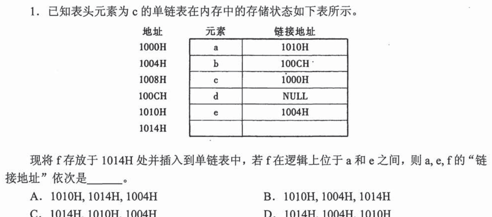

先不要按表格从上到下读成 `a,b,c,d,e`。以头结点 `c` 的地址 `1008H` 为起点，读它的链接地址 `1000H`，才到 `a`；再沿链接得到 `e→b→d`。逻辑链是 `c→a→e→b→d`，与内存表格的排列不同。把新结点 `f` 放在地址 `1014H` 并插在 `a`、`e` 中间，必须让 `a` 指向 `f`、`f` 指向 `e`；`e` 原来指向 `b`，无需改变。因此 `a,e,f` 的链接地址依次为 `1014H,1004H,1010H`，选 **D**。

把“指向谁”和“字段里写什么”接起来

一个结点有自身存放地址，也有链接字段里的地址。`a` 存在 `1000H`，其旧链接 `1010H` 指的是 `e`；新结点 `f` 存在 `1014H`。插入后，向 `a` 的链接字段写入 `1014H`，向 `f` 的链接字段写入 `1010H`；`e` 的链接字段仍是 `1004H`。题目问**链接地址**，不是问 `a,e,f` 自身存放的地址。这也是 A/B/C 一类交换数字的诱因：数字本身都出现过，但分别写进哪个结点的字段要沿箭头判断。

保底先画 `a→f→e` 三个结点，只回答“两条新箭头从谁发出、指到谁”；最后才把结点名替换成内存地址。

## 04｜2016-02：删除 p，是让左右邻居彼此认对方

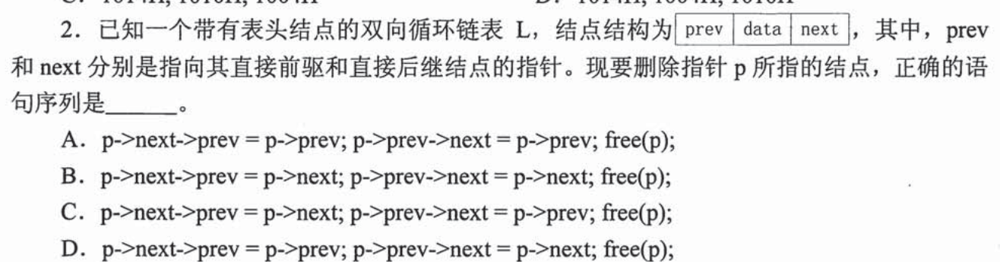

设左邻居为 `L=p->prev`，右邻居为 `R=p->next`。删除后要得到 `L.next=R` 和 `R.prev=L`；翻回原表达式便是 `p->prev->next=p->next`、`p->next->prev=p->prev`，最后才 `free(p)`。选 **D**。这道题真正新增的是双向的两条链接都要改；只改一边，会留下经过已释放结点的反向路线。

<code>prev/next</code> 何时是对象，何时发生动作

`p->next` 是**读取** `p` 的 `next` 字段，得到右邻居的地址；`p->next->prev` 则是右邻居结点内部的 `prev` 字段。等号左边指定要改写的字段，等号右边提供要写进去的地址。`p->next->prev=p->prev` 才把“右邻居的前驱”改为左邻居；单独写出 `p->prev` 不会改变任何箭头。A 的第二句把 `L.next` 写成 `L`，B/C 把邻居的字段指向自身，均不能形成 `L⇄R`。

因为题目明确是**带表头的双向循环链表**，即使 `p` 是唯一的数据结点，其左右邻居也可以是表头结点，不必在本题额外假定 `NULL`；这里的边界信息有用。

考场上不必先背四个长表达式：**遮掉 `p`，画 `L⇄R`，把左右两条箭头各写一次，最后释放 `p`。**

## 05｜2016-04：三对角矩阵实际写进数组的是什么

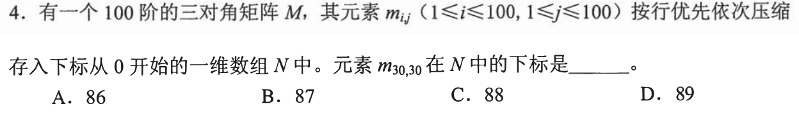

原矩阵的行列编号是 `1…100`，压缩数组 `N` 的下标是 `0…`。三对角只存 `j=i−1,i,i+1` 范围内的元素，其余零元**没有**数组格子。按行写：第 1 行 2 个元素，第 2 到第 29 行各 3 个；第 30 行的 `m30,29` 先写，`m30,30` 后写。前 29 行共 `2+28×3=86` 个，故这两个格子分别是 `N[86]`、`N[87]`，选 **B**。

从一张小矩阵到一维数组，不先背公式

四阶时，依次写入 `m11,m12｜m21,m22,m23｜m32,m33,m34｜m43,m44`；竖线只是显示行的边界，真实的 `N` 是从 `N[0]` 开始的一段连续格子。比如 `m24` 在带外，原矩阵中是零，却没有对应的 `N[k]`。要读取 `m32`，先数前两行 `2+3=5` 格，再知第 3 行第一个是它，所以在 `N[5]`。回到一百阶，也先数前面完整的行，再数目标在本行前有几个元素。矩阵的 `m30,30` 是第 30 行第 30 列，不意味着 `N` 也从 1 编号；题干已经分别给出两个编号起点。

保底即使一时推不出通式，也能用“前面有多少**实际存入的**元素 + 本行内偏移”来检查四个相邻下标。

## 06｜2017-03：稀疏，不等于把所有二维结构都算进去

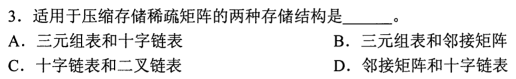

稀疏矩阵的大量位置是零，压缩时要保存非零元的**行、列、值**，以便恢复它原来的位置；三元组表直接列出这三项，十字链表还能按行和列串起非零元。所以选 **A**。邻接矩阵仍按行列位置留格，不能因为零很多就把它当作此题问的两种压缩结构；二叉链表是树结点的两条孩子链接，不表达矩阵的行列交叉关系。

这两种压缩结构为什么不完全一样

三元组表可想成记录 `(2,4,7)`，表示第 2 行第 4 列的值为 7；没有出现的坐标就是零。十字链表给每个非零元保留同一行的后继、同一列的后继两条链接，便于沿某行或某列访问。先认清它们都**只为非零元建立记录**，本题就足够；何时选用、怎样做转置可等真正考到操作时再展开。

这里对第 05 题只新增一层：三对角有固定带状位置，稀疏矩阵的非零位置不固定，光存值不够，还得记坐标。

## 07｜2018-03：对称矩阵上三角，行优先数整行

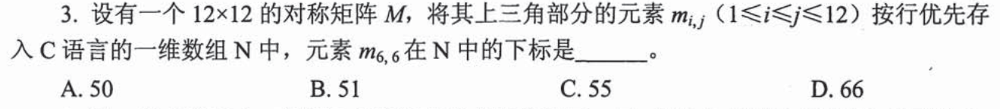

题目只把 `i≤j` 的上三角存到 C 数组。前五行依次存 `12,11,10,9,8` 个，共 50 个；第 6 行从 `m6,6` 开始，所以它正落在下标 **50，选 A**。第 05 题教过“先数前面的实际格子，再数本行偏移”；这次新东西是每行长度从 12 逐行减 1，而不是三对角的多数行固定 3 格。

为什么不是第 6 行第 6 列就算 6×12+6

下三角根本没有存一份，不能按完整 `12×12` 的行长跳地址。上三角第 1 行存 `m11…m1,12`，第 2 行从 `m22` 起只有 11 个，依次缩短。C 数组从 `N[0]` 起：前 50 个格子占下标 `0…49`，下一个才是 `N[50]`。对角线元素并没有被删除，它是本行第一个。

## 08｜2020-01：下三角的 m7,2，先映射再按列数

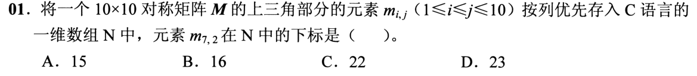

只存对称矩阵的上三角，题目却问 `m7,2`。由对称性先换成真正存储的 `m2,7`。这次是**列优先**：前六列的上三角分别有 `1,2,3,4,5,6` 个，共 21 个；第 7 列从 `m1,7` 的下标 21 开始，`m2,7` 是下标 **22，选 C**。沿用第 07 题“先数前面完整单位、再加内部偏移”，但单位由行换成列。

把写入顺序展开两列，确认没有按完整矩阵存

第 1 列只存 `m1,1`；第 2 列存 `m1,2,m2,2`；第 3 列存 `m1,3,m2,3,m3,3`。第 7 列同理有 7 个，起点由前六列 `1+…+6=21` 决定。`m7,2` 与 `m2,7` 数值相同，压缩数组只留后一位置的一份。不能直接在第 7 行找 `m7,2`，也不能把第 07 题的行优先公式换个数字照抄。

即使没算出下标，先用“对称⇒只存一份”和“列优先⇒前面完整列的长度递增”也能挡住把 `7,2` 当成完整矩阵下标的路线。

## 09｜2021-01：删除首元时，尾指针可能也要改

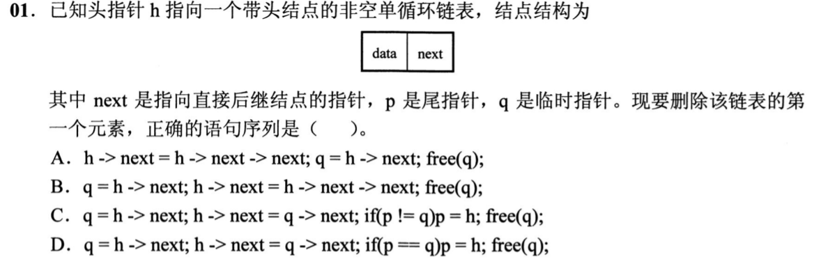

`h` 指表头，`h->next` 是第一个数据结点；先用 `q=h->next` 保存它，再令 `h->next=q->next` 跳过它。若原表只有一个数据结点，`p` 尾指针也指向这个 `q`，释放前须把 `p` 改指向表头 `h`。故条件应是 `if(p==q) p=h`，选 **D**。

四个选项错在操作顺序还是边界

A 先改 `h->next`，再用 `q=h->next`，拿到的已是第二个结点，随后释放错人。B 的前两步会删首元，但单元素时尾指针仍悬在被释放的地址。C 在 `p!=q` 的多元素情况反倒把尾指针改成 `h`，失去真正的尾结点。D 先保留被删结点，再断链；只有被删结点恰是尾结点时才改尾指针，最后释放 `q`。头结点并不算数据元素，删光后 `p=h` 是这里的约定。

第 03 题学过“存储位置与逻辑位置不同”；这里进一步要保住**释放前的地址**和另一根可能指向同一结点的尾指针。考场先画“一元素／多元素”两种情况，比只验普通链表可靠。

## 10｜2021-03：由两个地址反推出每行多长

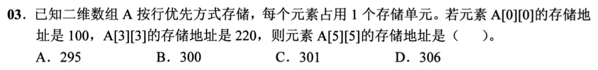

题面写 `A[0][0]`，所以行列下标从 0 开始；每元素占 1 存储单位，首地址 100。设每行有 `c` 列，按行优先存储时 `A[3][3]` 前面有 `3c+3` 个元素。地址差 `220−100=120`，故 `3c+3=120`、`c=39`。`A[5][5]` 的地址是 `100+5×39+5=300`，选 **B**。

为什么可以从 A[3][3] 推出列数

一维内存从 `A[0][0], A[0][1], …, A[1][0], …` 连续写入。到第 3 行之前已经跳过编号为 0、1、2 的三整行，每行 `c` 个；本行从列 0 再走到列 3，多 3 个。题目没给矩阵共有多少**行**，也不需要；地址跨度控制的是每行的**列数**。如果每元素占 2 个单位，先除以 2 才能得到元素偏移，本题明确给 1，不能忽略这个条件。

保底先不写通式：`A[3][3]` 比首元素远 120 格，其中 3 格是在该行内走的，剩余 117 格平分给前三行，每行 39 格。

## 11｜2023-02：两句前置赋值后，p->next 已经是 s

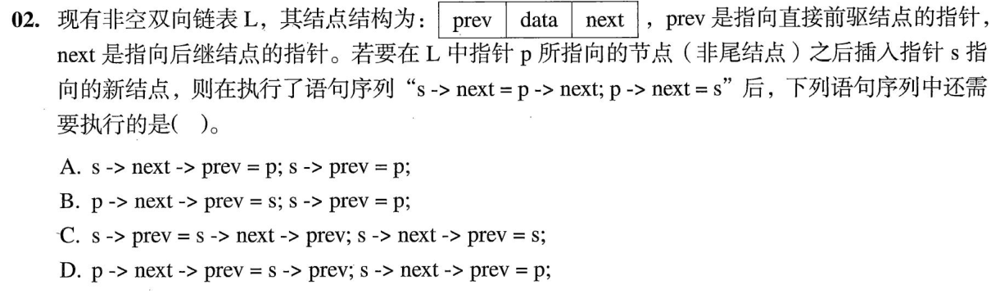

已执行 `s->next=p->next; p->next=s`。此时 `s->next` 仍指原来的右邻居，但 `p->next` **已经指向 `s`**。还缺 `s.prev=p`、原右邻居的 `prev=s`。C 的第一句 `s->prev=s->next->prev` 从右邻居保存的旧前驱取回 `p`，第二句 `s->next->prev=s` 才让右邻居反指 `s`，故选 **C**。

用状态图读表达式，而不是按字符猜 prev/next

插入前 `p⇄R`。执行题干两句后，正向是 `p→s→R`，反向仍是 `R.prev=p`，而 `s.prev` 未设置。于是第一句取 `R.prev` 的地址放进 `s.prev`，得到 `s.prev=p`；第二句向 `R.prev` 写 `s`。选项 B 看似出现 `p->next->prev`，但此时 `p->next` 是 `s`，所以它把 `s.prev` 写成 `s` 自己，不是在改 `R`。其余选项也要按**已执行两句后的当前指向**逐次判，不能拿插入前的图读到结尾。

题干只说 `p` 非头结点，没有明说不是尾结点。若 `p` 恰是尾结点，`s->next` 为 `NULL`，选项 C 的解引用并不安全；标准答案 C 按存在后继 `R` 的情形给出。真实实现应先令 `s.prev=p`，有后继才更新其 `prev`，而考试选项没有提供完整的尾结点处理。知道这个边界，不应反过来把 B 误选成“更安全”。

这题正好检验第 04 题的两条链接动作：**每做一次赋值就更新草图，再读下一句的 `->`。**

## 12｜2023-03：三元组告诉你坐标，却不能告诉你矩阵边界

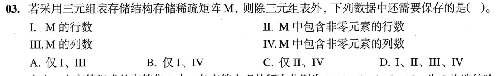

一条三元组 `(行号,列号,值)` 可以恢复一个非零元，却无法从出现过的最大行列号推出原矩阵的总行数和总列数：最后几行、几列可能全为零。因此仍需保存 **I 行数、III 列数，选 A**。非零元的个数由实际三元组条目数取得；含非零元的列数也可扫描列号去重，不必另存 IV 才能恢复矩阵。

一个会击穿“最大下标就是大小”的例子

假设表中仅有 `(2,3,7)`。原矩阵既可能是 `2×3`，也可能是 `100×100`；那些全零的末尾行列不会留下一条三元组。所以维度是表以外必须补的元信息。这里的“非零元素个数”指表中真正的记录数，不是事先分配的数组容量；若某种具体实现只给一块容量固定、末尾未用的裸数组，仍需另有长度标记，但题目按可识别条目数的三元组表提问，标准答案只要求行数与列数。

这题接第 06 题的三元组：它已保存**出现在哪里**，但矩阵的**完整边界**可能完全没有非零元作证。

## 13｜2024-01：q 被重新赋值，随后搬的是 p 的后继

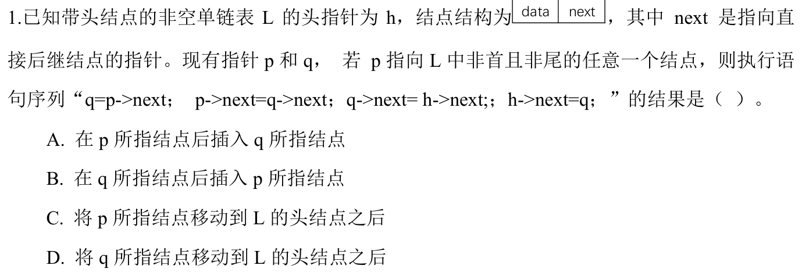

不要从“现有指针 p 和 q”猜操作目标；第一句 `q=p->next` 已让 `q` 指向 `p` 的后继。第二句 `p->next=q->next` 把这个后继从原处摘下；随后 `q->next=h->next; h->next=q` 把它接在表头后。故移动到首元位置的是 **q 此刻所指结点，选 D**。

每句执行后，谁还指向谁

取 `h→a→p→b→c…`，第一句使 `q=b`；第二句变成原链 `h→a→p→c…`，`b` 被摘下但还由 `q` 保存。第三句令 `b.next=a`，第四句令 `h.next=b`，结果 `h→b→a→p→c…`。题干规定 `p` 非首也非尾，保证有后继且操作的目标不是空指针。A 说“在 p 后插入”只看第一句，C 说搬 `p` 则混淆了保存位置的 `p` 和被移动的 `q`。

保底即使看不出整个链，也先执行**第一句重赋值**：旧 `q` 指谁对后面已经没有约束；这足以排除那些把原 `q` 当操作对象的读法。

## 本组真正接通的能力

复杂度线的“数真实动作”在链表里变成**看结点字段里的地址如何改写**，在矩阵里变成**看哪些元素实际写进连续数组以及写入顺序**。做 0801 的下一遍时，先遮住答案，在纸上只留链表小图或数组前几格；算出原题后再改变一个关键条件（例如矩阵由行优先改列优先、链表结点是尾结点），看自己从哪一步需要重新判断。尚无你的独立限时数据，本组只能标为“已讲解”，不能标“已熟练”。
