[« 0801-answer](0801-answer.md)　　[0803-answer »](0803-answer.md)

# 0802 Answer｜栈与队列：每一步操作改变了什么

> [20 道原题](0802.md) · [0801 的位置约定与指针](0801-answer.md) · [能力账本](answer-quality/learning-ledger.md)
>
> 本节点没有完整的首次作答记录。下面的“保底”是尚不能完整解题时可由题面可靠推出的部分，不是推测你当时怎样想；讲解完成也不等于已能限时完成。先对原图动手，再按卡住的地方展开。

<strong>复习速查：20 题各自第一笔与保底</strong>

首次训练先看原题；这张表供复习时从长推演压缩到考场动作。卡住时的推断也须由题目条件支持。

| 题 | 第一笔 | 卡住时守住 |
| --- | --- | --- |
| [01](#q01) | 写入顺序与取出顺序是否相同 | “缓冲”本身不指定结构 |
| [02](#q02) | 只记栈内元素与峰值 | `a,c,d` 同时在栈，容量不能小于 3 |
| [03](#q03) | 输出前缀对应 Push/Pop | `f,e,d` 连续三弹无处打断 |
| [04](#q04) | 从 `a` 起只在两端添新元素 | 目标中后来的 `c` 不能插到中间 |
| [05](#q05) | `d` 首弹锁定旧栈 `a,b,c` | `e` 尚未入栈，只能插四个缝隙 |
| [06](#q06) | 圈出头尾指针各指什么 | 队头是 0，队尾从 `n−1` 推进到 0 |
| [07](#q07) | 在最深括号前缀数符号栈 | 操作数不入栈，已弹出的不再数 |
| [08](#q08) | `p₂=3` 后把 `p₃` 分为 `1,2` 和 `4…n` | 3 已用过，不可能再作第三项 |
| [09](#q09) | 停在扫描 `f` 的瞬间 | 旧 `/` 与旧 `*` 已弹出 |
| [10](#q10) | 复用 0801-02 的指针约定 | 先辨“尾后空位”，再写空满式 |
| [11](#q11) | 写 `main→S(1)→S(0)` | 先返回者在栈顶，不在栈底 |
| [12](#q12) | 找递减的 `8,4,2,1` | 四条只是下界，还需构造上界 |
| [13](#q13) | 逐条反驳“必须／唯一／两端” | 用 `1,2` 两种弹法反驳唯一 |
| [14](#q14) | 每轮写 `a,b,op` 与新栈顶 | 减法按 `b−a`，顺序不可倒 |
| [15](#q15) | 追 `1,2` 暂存后的栈位 | 2 压在 1 上，无法先弹 1 |
| [16](#q16) | 八步逐个写栈状态 | 只有 Pop 记输出，不强求全弹完 |
| [17](#q17) | 标仅入端与可出端 | 出 4、1 后 2 仍挡着 3 |
| [18](#q18) | 构造交替弹、全部压完弹 | 可判断可行性，不等于出栈结果唯一 |
| [19](#q19) | 先写括号内 `zu−` | 每个子块按左、右、运算符拼 |
| [20](#q20) | 数未匹配左括号的峰值 | 四层嵌套超过容量 3 |

下次独立作答要记录耗时与所用保底；表格本身不证明一两分钟可做出。

## 01｜2009-01：打印顺序为什么要用队列

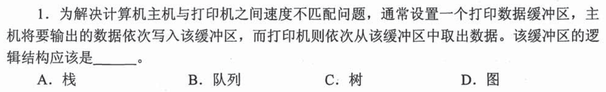

主机先把任务送入缓冲区，打印机慢慢取；两者速度不同，但**先送来的数据必须先打印**。需要保留到达次序的先进先出结构，选 **B，队列**。题干的“速度不匹配”解释为何要缓冲，“依次写入／依次取出”才决定用什么逻辑结构；不能看到“缓冲”就猜任一种能暂存数据的容器。

第一个 i+1：存住与按什么顺序取出是两件事

栈也能暂存，但后写入的会先取出，导致打印顺序倒置；树、图有分支与关系结构，本题没给任何需按分支选择的条件。考场先画 `任务 A 入→B 入→A 出→B 出`，出入顺序相同便是队列。若题目改为处理最近一次未完成的任务，再考虑栈；真正起决定作用的是退出约束，而不是“计算机”这个场景词。

## 02｜2009-02：栈容量看同时压住了多少元素

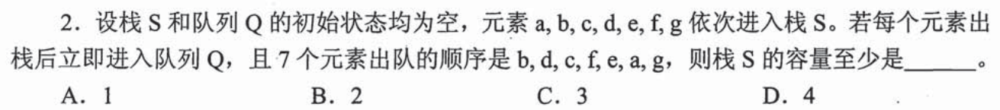

按 `a,b,c,d,e,f,g` 入栈，出栈后立即入队；队列只把**出栈顺序原样保存**。要先得到 `b`，压 `a,b` 后弹 `b`；接着要 `d`，压 `c,d` 后弹 `d`，此时栈内 `a,c`；再弹 `c`。继续压 `e,f` 后弹 `f,e`，最后弹 `a`、压弹 `g`。栈最大同时有 `a,c,d` 或 `a,e,f` 三个元素，故容量至少 **3，选 C**。

为什么 2 不够，4 又没有必要

在输出 `b` 后，`a` 必须留在栈底；为了接下来先出 `d` 再出 `c`，入 `c` 之后还要入 `d`，瞬间同时有 `a,c,d`。所以 2 不可能。上述完整操作从未超过 3，给出了容量 3 可行的构造；必要下界与可行上界相等，才叫“最小”。仅凭看见七个输入就选 7，忽略了中途可以出栈释放空间。

考场在纸上维护“当前栈底→顶”和“目前最大高度”，队列不必另模拟第二遍。

## 03｜2010-01：多了一条“不许连续弹三次”的操作约束

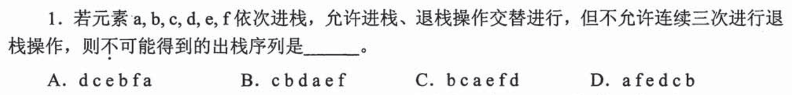

普通栈序列可能合法，本题还须数**连续的 Pop**。D 以 `a` 开头，先压 `a` 并弹出；以后 `f` 紧接其后作为第二个输出，必须把 `b,c,d,e,f` 都压入，弹 `f,e,d` 才能按该选项继续，已经连续弹三次，违反条件。选 **D**。A、B、C 可在需要时插入新的 Push 打断连续 Pop，不能仅凭“有三个相邻输出”判断不可能。

对其余选项给出能执行的见证

A：压 `a,b,c,d`，弹 `d,c`；压 `e`，弹 `e,b`；压 `f`，弹 `f,a`。B：压 `a,b,c`，弹 `c,b`；压 `d`，弹 `d,a`；压弹 `e`，再压弹 `f`。C：压 `a,b` 弹 `b`；压弹 `c`，再弹 `a`；压 `d,e` 弹 `e`，压弹 `f`，再弹 `d`。三者没有连续三个 Pop。D 的 `f,e,d` 之间无法再 Push 一个尚未到达的输入来打断，因为 `f` 已是最后输入。

保底先只抓 D 的前缀 `a,f,e,d`，若这一段已经违反条件，就不用模拟完整六项。

## 04｜2010-02：两端入、一端出，不等于任意排列

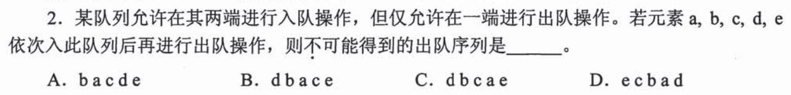

题目让 `a,b,c,d,e` **全部入队后才出队**。每来一个新元素，只能接在当前序列的两端；从固定出队的一端读，想得到 C 的 `d,b,c,a,e`，把最后进入的 `e` 放到另一端、`d` 放到出队端后，剩下 `a,b,c` 必须排成 `b,c,a`。但 `c` 最后进入这三者时只能接两端，无法插在 `b` 与 `a` 之间。所以 C 不可能，选 **C**。

为何排掉 C 后仍要相信其他项可行

把队列从出队端向里看，A 的 `b,a,c,d,e` 可从 `a` 起依次让 `b` 接出队端、`c,d,e` 接另一端；B 的 `d,b,a,c,e` 可让 `b,d` 依次接出队端、`c,e` 接另一端；D 的 `e,c,b,a,d` 可让 `b,c,e` 接出队端、`d` 接另一端。这里只处理题给的操作限制；它既不是普通队列，也不是能从两端任意出队的双端队列。

首笔画 `a`，每读下一个输入只能在纸上序列的左端或右端添它；若目标序列要求一个后来的元素挤到中间，就能直接否定。

## 05｜2011-02：d 先出时，e 可以插在四个位置

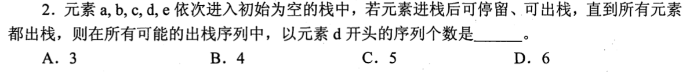

入栈顺序 `a,b,c,d,e`，若第一个出栈是 `d`，此前栈中自底向顶是 `a,b,c,d`，`e` 还不能入栈，否则它会盖住 `d`。弹 `d` 后，剩下 `c,b,a` 必按此顺序弹出；尚未入栈的 `e` 可以在这三者的**前、两两之间或后**入栈并立即弹出，共四个插入位置，选 **B**。

把四种输出写出来，防止只凭公式猜

从 `d` 开始，后半段可以是 `e,c,b,a`、`c,e,b,a`、`c,b,e,a`、`c,b,a,e`。注意“e 在最后”也可行：先弹完旧栈，再压弹 `e`。若 `e` 在 `d` 之前已入栈，首个出栈就不可能是 `d`，因此不用把它再排列到 `d` 前面。

考场先锁死已经压在 `d` 下面的相对次序，再看未到的元素在哪些缝隙插入。

## 06｜2011-03：首元素写在 0，头指针与尾指针怎样初始化

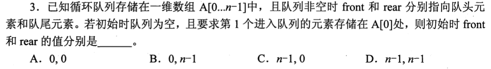

这里 `front` 和 `rear` 在**非空时分别指向队头元素和队尾元素**。第一个元素要写在 `A[0]`：队头 `front` 从一开始就该是 0，而队尾 `rear` 在首次入队时**先推进一格**，所以此前位于 `n−1`。初值为 `(0,n−1)`，选 **B**。空态的两个指针不必相等，题目只定义了它们在非空时各指哪里。

和 0801-02 的约定为什么不同

0801-02 明确 `end2` 指向**队尾后一个空位**；本题非空时 `rear` 指**队尾元素**。第一次入队后要有 `front=rear=0`；若 `rear` 采用 `rear=(rear+1)%n` 后再写入，初态只能是 `front=0,rear=n−1`。题目没有进一步指定一般的空满判定算法，因此不要把这组初值硬套成另一道题的通用空队列公式。考场先圈出“指元素／指空位”，再看首次写入前后各指针该在哪里。

## 07｜2012-02：操作符栈最大深度要在扫描中截住

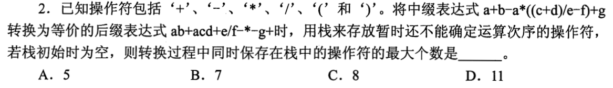

中缀转后缀时，操作数可直接输出，尚不能确定次序的运算符和左括号留在栈中。扫描到 `a+b-a*((c+d)` 内的 `+` 时，外层减号、乘号、两层左括号与内层加号同时在栈，容量达到 **5，选 A**。不能把原式中共有多少运算符当栈深；已遇到的低优先级运算和右括号会让部分符号提前弹出。

只追会出现峰值的前缀

读 `a+b` 时 `+` 暂存；再遇 `-`，先弹同级的 `+`，栈留下 `-`。遇 `a*` 后为 `-,*`；接连遇外、内两层 `(` 后为 `-,*,(,(`；读 `c+d` 的 `+` 时成为 `-,*,(,(,+`，五个。后续右括号关闭内层，不会让这些已经出栈的运算符再次同时堆起。题目提供了等价后缀表达式供核对，但峰值必须按中缀的扫描过程数。

保底先把“操作数不入这个栈”和“右括号出现会清掉对应左括号内的符号”守住，再只查最深括号附近。

## 08｜2013-02：p₂=3，把 p₃ 的可取值分成两边

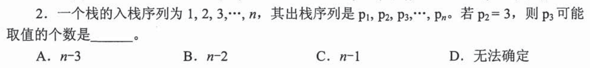

第二个出栈的是 3，所以此前 1、2、3 都已入栈。第一个输出可为 1 或 2；若先出 1，随后出 3，栈里留 2；若先出 2，随后出 3，栈里留 1。于是 `p3` 可取 1 或 2；也可先继续压并弹出任意 `4…n`。唯独 3 已作为 `p2` 使用，故可能值共 `2+(n−3)=n−1` 个，选 **C**。

“任意 4…n”为何每个都有可行序列

先压 1、2 并弹 2，再压弹 3；若想让 `p3=k≥4`，继续把 4 到 k 压入，弹出 k 即可。栈里仍有旧元素，但不阻挡当前栈顶 k。题目只问第 3 个值，不必提前规定剩余所有值的顺序；这个区别能避免把一条构造误当成唯一可能。

## 09｜2014-02：扫到 f 时，只保留还没出栈的符号

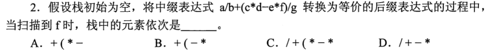

原式 `a/b+(c*d-e*f)/g`。`a/b` 的 `/` 在遇到较低优先级 `+` 时已弹出；括号内 `c*d` 的 `*` 在遇到 `-` 时也已弹出。扫到 `f` 这个**操作数**时，尚未读到关闭括号和后面的 `/g`，栈底到顶是 `+,(,-,*`，选 **B**。

逐个信号决定弹还是留

遇 `+`：先弹旧 `/`，再留 `+`；遇 `(`：留括号；读 `c*d`：`*` 暂留，下一符号 `-` 使 `*` 先出栈，`-` 留下；读 `e*f`：新的 `*` 留在 `-` 上。扫描“到 f”并不等于把 f 后面的 `)` 也处理了。C 把本该已弹的最初 `/` 留着，A 少了括号内的减号，D 少了左括号；用读入时刻即可分辨。

## 10｜2014-03：同一道题再出现，只检验位置约定

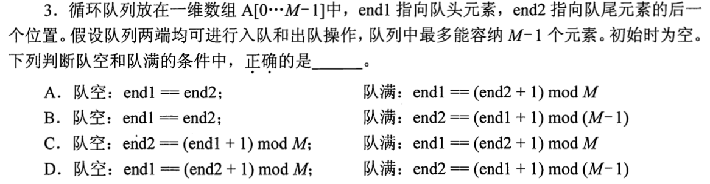

这是 [0801-02](0801-answer.md#q02) 的同一原题，不作为新的刷题配额。先遮住旧答案，读出题干中 `end1` 是**头元素**、`end2` 是**尾后空位**；于是相同位置为空、尾后空位再走一步碰头为满，取模物理长度 `M`，选 **A**。如果此时把第 06 题的 `front/rear` 约定直接套入，就说明尚未建立“先读定义再写公式”的能力，应回到两题对比，而非重复抄一遍答案。

## 11｜2015-01：调用栈底不是最先返回的函数

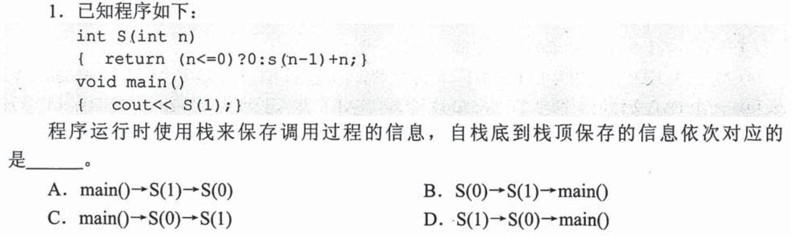

`main()` 执行 `S(1)` 时尚未结束，因此它的调用信息留在栈底；`S(1)` 为求值调用 `S(0)`，后者在最上层。栈底到栈顶是 `main()→S(1)→S(0)`，选 **A**。别把 `S(0)` 最先**返回**误当成它最先**入栈**；两个次序相反。

把代码暂停在 S(0) 的返回语句前

先进入 `main`，执行到 `S(1)` 时保存返回到 `main` 的位置；`S(1)` 又等待 `S(0)`，于是再压一层。此时 `S(0)` 命中 `n≤0` 的基例，随后按 `S(0)→S(1)→main` 的顺序出栈。`S(1)` 的算术值是 1，但本题问的是**调用信息排列**，不需要计算输出。与 0731-02 的单分支递归相连，这里新增的是“栈中保存尚未完成的调用”。

## 12｜2016-03：轨道数由必须分开的逆序列给下界

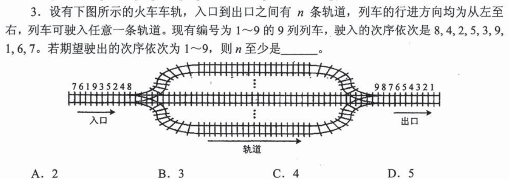

每条轨道从左入右出，同轨道内先进入的车仍先驶出；若目标要按编号 `1…9` 离开，同一轨道上进入的编号必须递增。到达顺序中的 `8,4,2,1` 严格递减，这四辆不能放在同一条轨道的任何一对位置，因此至少 **4 条，选 C**。

只证明“至少四条”还不够，再给四条可行安排

按到达顺序分配：轨道甲放 `8,9`，乙放 `4,5,6,7`，丙放 `2,3`，丁放 `1`。每条轨道内部的编号都递增；出口按需要先取丁的 1，再取丙的 2、3，乙的 4—7，甲的 8、9，就能得到 `1…9`。所以四条既必要又足够。图中的多条轨道并非“栈都可随意倒出”，关键是每条轨道的**行进方向与同轨相对顺序**。

保底先寻找一串按到达次序严格递减的车号，它们两两不能同轨；但只给下界不能直接宣布最小值，还要构造同样数量的轨道。

## 13｜2017-02：四句话分别问“必须”“可以”“唯一”“两端”

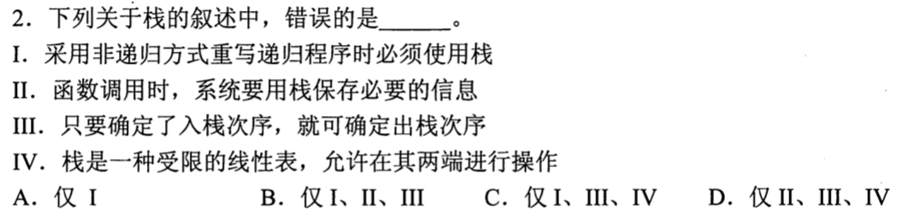

I 错：递归改成非递归可用迭代等方式，不是**必须**显式用栈。II 对：函数调用需保存返回位置等必要信息，通常依赖调用栈。III 错：相同的入栈顺序可边入边出，也可先全部入栈再出，出栈序列并不唯一。IV 错：栈是受限线性表，只能在**同一端**进行入栈和出栈，不能在两端都操作。错误的是 I、III、IV，选 **C**。

用极小例子拆掉两种绝对化说法

输入 `1,2`：`push1,pop1,push2,pop2` 得 `1,2`，而 `push1,push2,pop2,pop1` 得 `2,1`，直接否定 III。某些简单递归计数可改写为循环且仅用计数变量，否定 I 的“必须”；但不能因此否定 II，程序调用本身仍须记住返回到哪里。IV 把第 04 题的两端入队混成了栈定义，二者操作端限制不同。

## 14｜2018-01：弹出顺序决定减法左右，不能只算栈顶两个数

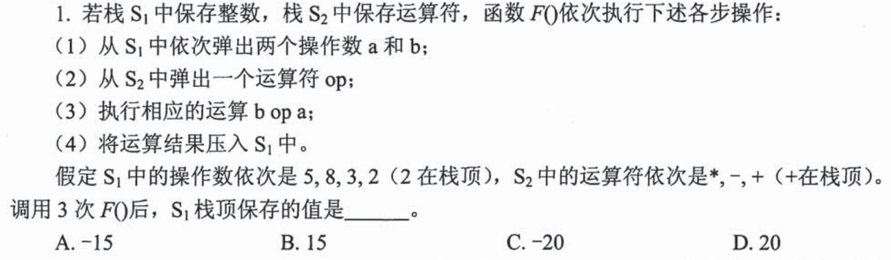

每轮从 `S1` 先弹 `a`、再弹 `b`，实际计算的是 `b op a`；`S2` 从顶依次给 `+,-,*`。第一轮 `3+2=5`，整数栈由底到顶变 `5,8,5`；第二轮 `8−5=3`，变 `5,3`；第三轮 `5×3=15`，选 **B**。

每次只更新一个状态，避免脑中一口气算三轮

初始 `S1=[5,8,3,2]`（右端为顶）、`S2=[*,-,+]`。第一轮先取 `a=2,b=3,op=+`，压回 5；第二轮 `a=5,b=8,op=-`，不是 `5−8`，压回 3；第三轮 `a=3,b=5,op=*`，压回 15。A 的 `−15` 来自把减法方向读反后继续算；D 的 20 可来自错把初始 8 或中间结果沿用。每轮写一小行两栈的新顶，操作符栈也随之少一个。

## 15｜2018-02：队列暂存进栈以后，1 和 2 的顺序为什么难改

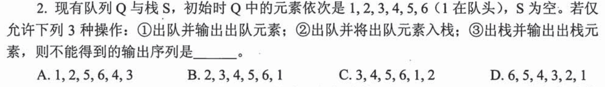

允许队列直接输出、队列元素入栈、栈顶输出。C 想先输出 `3,4,5,6`，就得把先到的 1、2 都暂存栈中；此时 2 压在 1 上，后面却要求 `1,2`，无法先越过 2 取 1，所以 **C 不可能**。A 可先直接输出 1、2，再暂存 3、4，直接输出 5、6 后弹出 4、3；B 暂存 1 后直接输出 2—6，再弹 1；D 暂存 1—5、直接输出 6，再逆序弹栈。

什么时候用直接输出，什么时候用栈

队列未处理部分始终保持 `1→2→…→6` 的到达次序；直接输出可保留这个次序，压栈后再次输出则反转被压入的那段。对某个候选序列，从第一项开始走：若不是当前队头，而后面还未到，就把暂时不需要的队头压栈；一旦目标被压在其他元素下面，便无法跳过上面的元素。这里的“不能”来自具体 `2` 堵在 `1` 上方，而非抽象地说“栈会倒序”。

## 16｜2020-02：把 Push/Pop 真正执行八步

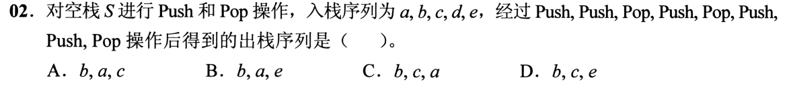

入栈元素按 `a,b,c,d,e` 供给，操作序列是 `Push,Push,Pop,Push,Pop,Push,Push,Pop`。两次压入 `a,b` 后弹 `b`；再压 `c` 弹 `c`；再压 `d,e` 弹 `e`。出栈序列为 `b,c,e`，选 **D**。`a,d` 仍留在栈里，题目只执行给出的八步，不要求五个元素都已弹完。

一行状态就能排除近似选项

按“栈底→顶”写：`[a]→[a,b]→[a]（出 b）→[a,c]→[a]（出 c）→[a,d]→[a,d,e]→[a,d]（出 e）`。只在 Pop 时记一个输出，别把“入栈序列给了五个”误读为“此刻必须输出五个”。

## 17｜2021-02：一端只能入，另一端能入能出

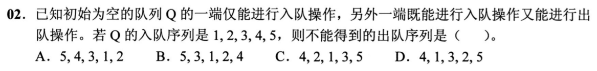

元素 `1…5` 依次到来，一端只进、另一端可进可出。检验 D 的前缀 `4,1,3,2`：要先出 4，且随后能从出队端取 1，输入 2、3 时须把它们接到 1 的另一侧；在 4 出队后，出队端依次面对 `1,2,3`。出 1 后 2 会挡住 3，后到的 5 也不能让 3越过 2。因此 D 不可能，选 **D**。

为什么它既不是普通队列，也不是完全自由的双端队列

这道题的“右端”（取出端）可额外插入新到的元素，所以可以让 5、4 等后到者先出；但左端从不出队，某个元素被右端的另一个旧元素挡住时，不能从左端偷取它。若某个选项看似有逆序，不能仅凭“队列先进先出”排掉，因为允许从右端入；须追到具体哪两个元素的先后被锁死。例如 A 可依次从左入 1、2，从右入 3、4、5，再从右出 5、4、3、1、2；B 可从左入 1、2，从右入 3，从左入 4，从右入 5，再从右出 5、3、1、2、4；C 可从左入 1，从右入 2，从左入 3，从右入 4，从左入 5，再从右出 4、2、1、3、5。D 在上述前缀已无可行状态。

## 18｜2022-02：固定 in，仍有不同 out

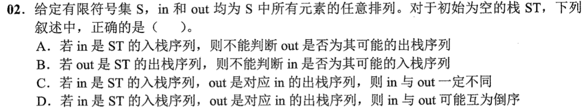

对于任何给定的入栈次序 `in`，都可“每入一个立刻出”得到 `out=in`，也可“全部入完再出”得到逆序 `out`。所以 C 的“一定不同”错，D 的“可能互为倒序”对，选 **D**。A 错在固定入栈序列后可以模拟检验某个候选 `out` 是否可行；B 错在固定完整出栈序列后，也可以用同一模拟判断某个 `in` 是否可行。

“不能判断”与“答案不唯一”不是一回事

给定 `in` 而不指定操作时刻，可能产生不止一种 `out`；但若 `in` 和 `out` 都给定，逐个输出目标：不断把尚未入栈的元素压到目标出现，若目标不在栈顶且再也不能入栈补救，就判不可能。这是可执行的判定算法，不要求先枚举全部序列。`in`、`out` 都是同一组元素的排列，题意已排除了缺失元素。

## 19｜2024-02：后缀表达式按运算树的子块拼

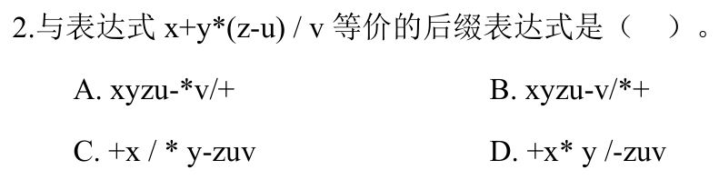

原式 `x+y*(z−u)/v`。先把括号得 `zu−`，乘 `y` 得 `yzu−*`，除 `v` 得 `yzu−*v/`，最后与 `x` 相加得 **`xyzu−*v/+`，选 A**。每个二元运算先写左、右两个操作数的后缀块，最后写运算符；括号在后缀里不再出现。

为什么不能直接按原句从左到右抄符号

`z−u` 必须在乘法前算，`y*(z−u)` 又必须在除 `v` 前算，而 `x+…` 最后才算。画成层级就是 `+(x, /( *(y, −(z,u)), v))`。由最内层向外拼出子块，每一步都保留原式的左右顺序；除法的左右若颠倒会成为 `v/[y*(z−u)]`，无法靠事后交换一个符号补救。题目并未要求把中缀转换算法的每次栈变化全部展示，子表达式足以在考场直接判断。

## 20｜2025-02：容量只受同时未匹配的左括号限制

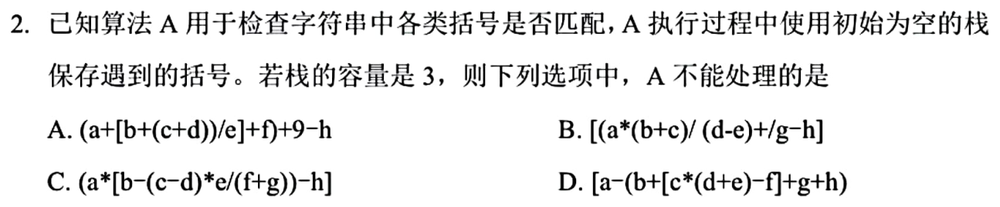

算法的栈只存遇到而尚未配对的括号，容量 3；看的是**扫描某一瞬间的未闭合层数**，不是整串括号总数。D 扫描到 `c*(d+e)` 的内层 `(` 时，外层 `[`、中层 `(`、里面 `[` 已经在栈中，再压这个 `(` 需要第 4 格，因此算法 A 无法处理 D，选 **D**。

只数左括号和右括号如何回退

从 D 的开头 `[a−(b+[c*(d+e)…` 读，栈高依次为 1、2、3、4，第四个左括号一出现便超过容量，后面即便都匹配也来不及补救。A、B、C 的最大同时未闭合深度不超过 3；其中字符与运算符不进本算法的括号栈。若无法完整检查选项，先找到一个候选的四层嵌套即可确定它**至少**不满足容量限制，再检查是否还有别的候选同样超限。

## 这一组留下的考场动作

受限容器题先标**哪端能入、哪端能出、何时允许操作**；序列题用短前缀或被阻挡的元素作证，不必对四项全部盲目穷举；容量题同时给出“不得小于”的状态与“这样操作足够”的构造。表达式与调用栈则先区分**扫描到哪一刻、栈里存什么、已经弹走什么**。第 10 题是跨线旧题接口，只检验约定能否迁移；其余十九题讲解完成，独立限时与混合题表现仍待真实作答。
