[« 0803-answer](0803-answer.md)　　[0805-answer »](0805-answer.md)

# 0804 Answer｜编码代价：由合并过程走到可译码的码字

> [原题 11 题](0804.md) · [0803 的树形、叶子和层次](0803-answer.md) · [能力账本](answer-quality/learning-ledger.md)
>
> 没有完整首次作答记录。下面的保底只写题面能支持的排除或中间结果；讲过不等于已经限时掌握。先看原题图，再从卡住的合并、前缀或权值判断处展开。

<strong>复习速查：第一笔与保底</strong>

| 题 | 第一笔 | 卡住时守住 |
| --- | --- | --- |
| [01](#q01) | 每次把两个最小权值接到同一个新父结点 | “每个内结点双子”不等于完全二叉树 |
| [02](#q02) | 圈“三叉”，先补一个零权叶子 | 六个真叶子不是满三叉树的奇数叶子数 |
| [03](#q03) | 看一个码字是否正好是另一个的开头 | D 中 `110` 会挡住 `1100` |
| [04](#q04) | 父权值＝两个孩子权值之和 | 根 24 的下一层必须凑成 24 |
| [05](#q05) | 从左到右取第一个完整码字 | 不可凭固定三位一组去切 |
| [06](#q06) | 最小的 2、3 合并，比较频次与长度 | 频次高者不应比频次低者码更长 |
| [07](#q07) | `n₀=n₂+1` 与 `n=n₀+n₂` | 115 不能直接除以 2 不看奇偶 |
| [08](#q08) | 两个最小合并，记每次新权值 | WPL 是合并权值之和，不是最终根权值 |
| [09](#q09) | 定长码所有字符码长相同 | 哈夫曼码不承诺不同频次不同层 |
| [10](#q10) | 合并得 WPL，再除总频次 | 平均码长不是 WPL 本身 |
| [11](#q11) | 先补题图漏列的 8，再合并七权 | 长度≥3 数的是叶子，不是内部结点 |

一两分钟能否做出，仍须遮答案独立重做并在隔天混合限时验证。

## 01｜2010-06：严格双分支与“完全”是两种限制

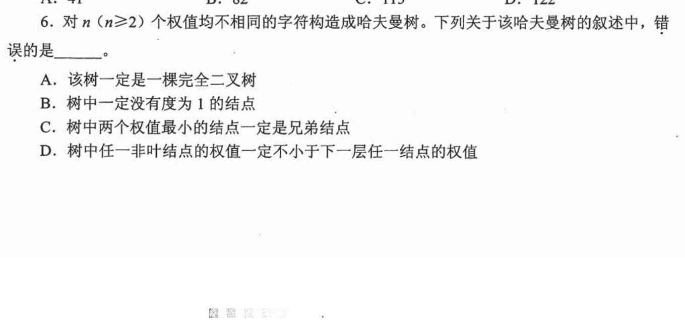

哈夫曼构造反复取**当前两个最小权值**作兄弟，生成权值为两者之和的新父结点。每次只增加一个有两个孩子的内部结点，所以树中无度为 1 的结点，B 对；最初两个最小叶子是兄弟，C 对。它却未必按层从左到右填满：取题设允许的**互不相同**权值 `1,2,4,100`，合并 `1+2=3`、`3+4=7`、`7+100=107`，出现一边很深、另一边较浅。说“一定是完全二叉树”的 **A 错，选 A**。不能用重复权值的例子反驳一道已限定权值互异的题。

D 的“非叶权值不小于下一层结点”从何而来

下一层若是它的孩子，父权等于孩子之和，自然不小于孩子权。若下一层的结点属于另一支，假设上层非叶权更小，交换这两棵子树就会让较大的总权少走一层、较小的总权多走一层，使 WPL 减少，违背哈夫曼树的最优性；所以 D 的“下一层任意结点”也成立。考场可先用 A 的互异四权反例否定“完全”：100 在根下成为浅叶，另侧三个小权形成深链。无度 1 只限制每个分支有两子，不推出完全二叉树的逐层占位条件。

## 02｜2013-04：三叉树要先补一个零，再每轮合并三个

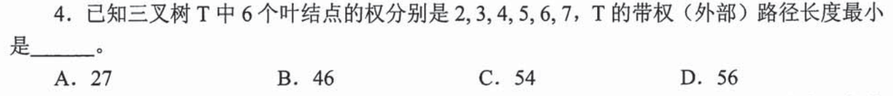

题目是**三叉树**，六个真实叶权 `2,3,4,5,6,7`。为了让每个内部结点按三个孩子合并，可加一个不计代价的零权虚叶，凑成七叶；依次合并 `0+2+3=5`，再把现有最小的 `4+5+5=14`，最后 `6+7+14=27`。每次合并让这些叶子路径各长一条边，故 WPL 为合并权值之和 `5+14+27=46`，选 **B**。

为何二叉树式“两两合并”会给出选项外的数

满三叉树每增加一个三孩子分支，叶子净增加两个，因此真叶数若为 6，需补一个零权虚叶使总数成为 7。零没有贡献 `权×深度`，却占了一个孩子位置。构造完成后，权 `6,7` 深度 1；`4,5` 深度 2；`2,3` 深度 3，所以也可验算 `(6+7)×1+(4+5)×2+(2+3)×3=46`。若误看成“二叉”，会得到另一套合并树且数值不在四项里；这正说明必须先从题干读出每个分支能有几个孩子。

## 03｜2014-06：前缀冲突只需找一对码字

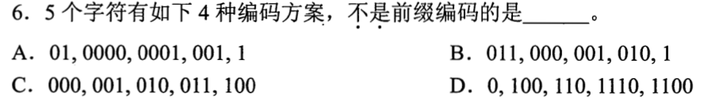

前缀码的可检验条件是：任意一个完整码字不能恰好是另一个码字的**开头**。D 中 `110` 是 `1100` 的前缀，读到 `110` 时无法确定该停还是继续读成 `1100`，故 **D 不是前缀码，选 D**。码长不等无需判错：A、B 有长短码但彼此不构成前缀；C 全为三位，自然不会有不同码字互为前缀。

逐位检查比看“有没有同一开头”更精确

两个码字都以 `0` 开始很正常，只有**短码的所有位与长码开头全部相同**才冲突。A 的 `01` 与以 `00` 起头的三条不同，单独的 `1` 也不是以 0 起头的码字前缀；B 的短码 `1` 与其他以 0 起头的不同。D 虽有 `0` 独占一支，另一支上的 `110` 与 `1100` 同时作为叶码，等价于让一个字符的码字落在另一个字符码字的中途。画二叉判读树时，任一字符只放在叶子，不能占内部结点。

## 04｜2015-03：路径上的数是子树权重，不是自由标签

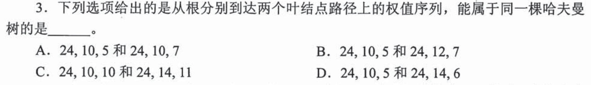

根权 24 是所有叶权之和；每个内结点的数都等于其两个孩子权值之和。A 两条路径都经过权 10，若其两个叶子为 5 与 7，则合成 12，不可能仍为 10；B 下一层两子 10 与 12 仅合 22；C 共同的 10 下出现 10 与 11，更不可能。D 的根下可为 10 与 14；10 下含 5，14 下含 6，可分别补 5 与 8，得到叶权 `5,5,6,8`。先合 `5+5=10`、`6+8=14`、再合 `10+14=24`，故 **D 可行**。

“能把权值加对”之后还要看最小合并

任意带权二叉树都要求父权等于孩子之和，但题问的是同一棵**哈夫曼**树，还要能按小权优先生成。D 补出的四叶 `5,5,6,8`，前两小为 5、5，合 10；剩下 6、8、10 中前两小为 6、8，合 14；再合根 24，完整满足过程。C 不仅没有正确的局部和，根下一层的 `10+14=24` 也不能救回其子层矛盾。保底优先看同一父下两条路径的公共前缀能否与分支之和相容。

## 05｜2017-06：变长码从第一个合法码字起逐段读

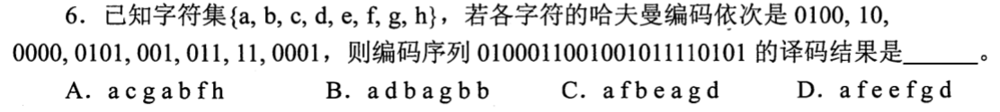

题给 a 到 h 的码依次为 `0100,10,0000,0101,001,011,11,0001`。从编码串首位开始，每积累一位就看是否碰到一条**完整码字**，碰到便输出对应字符、从下一位重来：`0100｜011｜001｜001｜011｜11｜0101`，译为 `a f e e f g d`，选 **D**。第 03 题已保证前缀码能在碰到完整码字时无歧义停下，不能每次机械切两位或四位。

首段为什么不能刚读到 `01` 就停

码表里没有 `01` 这个完整字符，它只是 `0100`、`0101`、`011` 的共同开头；继续读到 `0100` 才确定为 a。读到 `011` 时它自身是 f，表里没有以 `011` 开头的更长码，便可立即停止本段。随后两个 `001` 都对应 e，尽管原编码串连续写在一起，不意味着必须对应两个不同字符。若切分后剩下一段无法匹配，不要强行选最像的一项，回到上一次停码位置检查。

## 06｜2018-05：先排错码，再核频次与码长的对应

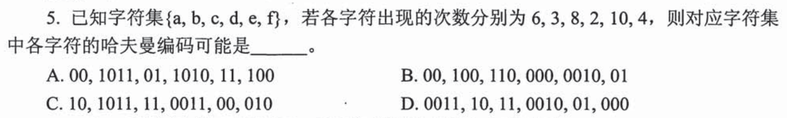

频次按 a 到 f 是 `6,3,8,2,10,4`。两两最小合并：`2+3=5`，`4+5=9`，`6+8=14`，`9+10=19`，最后 `14+19=33`。由此可得频次 `6,8,10` 的码长 2，`4` 的码长 3，`2,3` 的码长 4（左右 0/1 可互换）。A 的六个码长依次为 `2,4,2,4,2,3` 且互不为前缀，选 **A**。

为什么有些选项连算合并都不必做

B 里 `00` 与 `0010` 构成前缀冲突；C 里 `10` 与 `1011` 同样冲突，先由第 03 题可排除。D 虽码字可能能解开，但让频次 6 的 a 占四位，而频次 3 的 b 只占两位：交换这两个字符的叶码会使总成本减少 `(6−3)×(4−2)>0`，所以 D 不可能最优。A 的具体 0/1 字符串不唯一，考场比较的是**前缀合法性和各频次所处深度**，不是强背某一组编码。

## 07｜2019-03：115 个总节点中有多少是真正的符号叶子

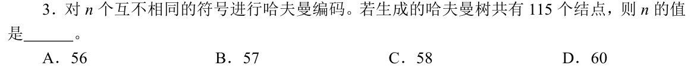

二叉哈夫曼树每个非叶都有两个孩子。设叶子 n 个、分支 i 个；数边得到 `2i=(n+i)−1`，所以 `n=i+1`，总结点 `n+i=2n−1`。代入 115 得 `n=(115+1)/2=58`，选 **C**。这些 n 个叶子对应 n 个要编码的不同符号；合并产生的内部结点不另算字符。

第 0803-17 题的关系为什么能迁移

0803-17 也是“每个非叶都有两子”，结论同为总结点 `2×叶子数−1`；这里新增的是识别**哈夫曼构造必然满足**该条件。若直接把 115 除 2 得 57.5 再四舍五入，没说明为什么多一个叶子；画两叶合一父共三结点、三叶合两父共五结点，就能看到每增加一个叶子也增加一个内部结点。若改成第 02 题的三叉构造，不能照抄二叉公式。

## 08｜2021-05：WPL 等于每轮合并权值的总和

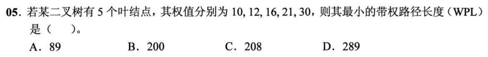

五个权 `10,12,16,21,30`，每轮取当前最小两项：`10+12=22`；`16+21=37`；此时剩 `22,30,37`，合 `22+30=52`；最后 `37+52=89`。每次合并会让其下所有叶子深度同时加 1，因此 **WPL=`22+37+52+89=200`，选 B**。89 是最终根权，即所有叶权之和，只代表这棵树总权，不是每个叶子的“权×路径长度”之和。

第三轮为什么不是看原先的五个权值

合并后的 22、37 要重新放回待选集合，而不是从原始列表消失。第二轮之后剩 `22,30,37`，所以应合 22 与 30，不能把先前已用的 10、12 再拿出来。独立验算可追叶深度：10、12 深 3；16、21 深 2；30 深 2，得 `(10+12)×3+(16+21+30)×2=66+134=200`。这题适合把“合并表”练成可在一分钟内复现的动作。

## 09｜2022-05：哈夫曼码与定长码放在不同层级比较

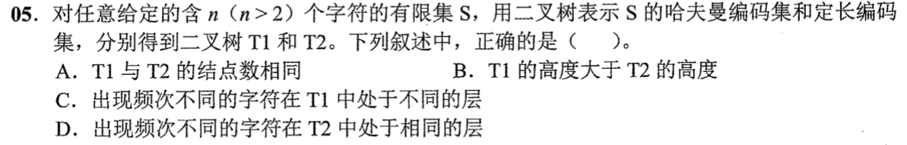

题中 T₁ 是按频次构造的二叉哈夫曼编码树，T₂ 是**定长编码**的二叉树。定长意味着每个真实字符码长相同，即在 T₂ 中都处于相同层次，哪怕字符频次不同；因此 **D 对，选 D**。T₁ 的叶码长可随频次而变，却不保证每个不同频次都在不同层：第 06 题频次 6、8、10 就都能用两位码。

其余三个断言缺的条件

A 说两树结点数相同，但 T₁ 的构造树为严格双分支，结点数 `2n−1`；T₂ 若按完整定长码空间画树，可能含未分配给字符的码位，结点数依具体表示而变。B 说 T₁ 的高度**一定**大于 T₂，频次接近时哈夫曼树也可与最短定长码树同高，不能用“不均匀通常更深”替代“一定”。C 说不同频次在 T₁ 必处不同层，第 06 题已给出反例。此题不用实际编码就能裁决，入口是区分“最小平均代价”与“每字一样长”这两种约束。

## 10｜2023-04：WPL 还要除以总出现次数才是平均码长

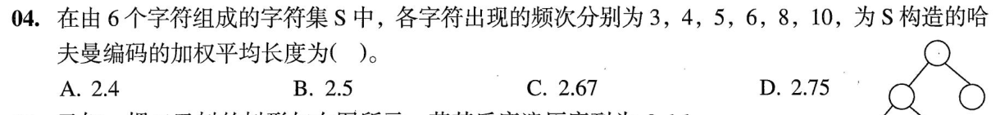

频次 `3,4,5,6,8,10`，合并依次得 `7,11,15,21,36`；合并权值总和即 WPL=`7+11+15+21+36=90`。这道题问**加权平均长度**，总出现次数为 `3+4+5+6+8+10=36`，所以平均 `90/36=2.5`，选 **B**。把根权 36 当 WPL，或算出 90 就停笔，都是把不同的统计量混了。

五轮合并逐轮对应哪些元素

`3+4=7`，余 `5,6,7,8,10`；`5+6=11`，余 `7,8,10,11`；`7+8=15`，余 `10,11,15`；`10+11=21`，余 `15,21`；最后 `15+21=36`。合并权值 90 等于所有出现次数乘对应字符码长的总位数；除以 36 次出现才变成每次平均 2.5 位。保底先看量纲：题问“平均每字符多少位”，结果不能是总位数 90。

## 11｜2025-05：先补全漏印的 8，才能数码长

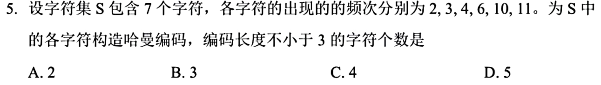

当前题图版本写“7 个字符”，频次却只列六个；完整原题是 **`2,3,4,6,8,10,11`**，[题单已标出原卷核对入口](0804.md)。按七权合并：`2+3=5`，`4+5=9`，`6+8=14`，`9+10=19`，`11+14=25`，`19+25=44`。从合并树追到叶子，码长不小于 3 的是 `2,3,4,6,8` 共 **5 个，选 D**。不能直接用缺数的六权图练习，否则会算出另一题。

每个叶子为何在这一层，不靠画漂亮的树

最后一次合并的左右子树权分别为 19、25；19 包含叶 10（深度 2）与 9，9 再包含叶 4（深度 3）与 5，5 再包含叶 2、3（深度 4）。25 包含叶 11（深度 2）与 14，14 包含叶 6、8（深度 3）。因此只有 10、11 的码长为 2，其余五个至少为 3；左右赋 0/1 的具体方向不改变深度。若题目写七个字符却只给六个权，考场先检查是否印刷或裁图缺失，不能一边承认少数据一边假装可唯一算出答案。

## 本线压缩成考场动作

先辨**二叉还是三叉**，再把当前最小的两个或三个权值合并、将新权值重新放回有序集合。求 WPL 加所有合并权值；求平均码长再除总权；求某个字符码长就沿合并树数从根到叶的边。码字题先查前缀冲突，再按完整码字逐段译码；面对残缺题图必须先修复题面。深层解释是首次学习的支架，限时熟练度要靠独立重做与相邻变式测出。
