# 0805 Answer｜有序树：高度、查找区间与多路结点

> [原题 23 题](0805.md) · [0803 的树形与层次](0803-answer.md) · [能力账本](answer-quality/learning-ledger.md)
>
> 本组 23 题教学稿已完成，没有完整首次作答记录，下文不推断你已经熟练。先看原图尝试落第一笔，卡住才展开相应推演。

<strong>23 题复习速查</strong>

| 题 | 第一笔 | 保底边界 |
| --- | --- | --- |
| [01](#q01) | 从每个结点向下数左右高度 | AVL 平衡检查要逐结点，不只看根 |
| [02](#q02) | 将 B 树与 B+ 树的叶链分开 | 叶子链不是 B 树的必有条件 |
| [03](#q03) | 先按大小把 48 插到 37 右边 | 旋转后重新读 37 的左右孩子 |
| [04](#q04) | 每向左／右收紧查找值区间 | A 的 94 被先前上界 91 拦下 |
| [05](#q05) | 高度 6 的最小结点数逐层递推 | 每个内部差 1，不能画满树 |
| [06](#q06) | 78 所在叶删空，看左兄弟能否借 | 父 65 下移，兄弟 62 上移 |
| [07](#q07) | 插 1—7 时每次在失衡处旋转 | 只数分支 4、2、6 的平衡因子 |
| [08](#q08) | 删除叶后同路径重插 | 非叶原位有孩子，新插结点是叶 |
| [09](#q09) | 根和叶各放允许的最少关键字 | 高度 2 的根仍至少两子 |
| [10](#q10) | 15 个关键字至少每结点一枚 | 结点最多可达 15，不必均匀装满 |
| [11](#q11) | 圈“中序降序”，左大右小 | 最大值无左子树，别沿常见升序方向找 |
| [12](#q12) | 叶层横向链可连续往后查 | B 树与 B+ 树的共同平衡性质不算差别 |
| [13](#q13) | 先补原图，再写中序升序链 | 残图本身无法判断四项 |
| [14](#q14) | 三阶最瘦内部每结点两子 | 五层结点数 1、2、4、8、16 |
| [15](#q15) | 区分“可能”与“一定” | AVL 删除会旋转，不能照搬普通 BST |
| [16](#q16) | 先让子树根 2 占位 | 1 先插后，2 不会在普通 BST 中上升 |
| [17](#q17) | 每遇满三键就分裂，中间键上升 | 根最终为 6、9 |
| [18](#q18) | 先用题单还原根 20 的树 | 插 23 后右左调整使 25 上升 |
| [19](#q19) | 第二层四键尽量拆成三结点 | 三结点产生 3、2、2 个孩子 |
| [20](#q20) | 前驱／后继替换后还须修下溢 | 110 留根且 90 不动无法修复 |
| [21](#q21) | 命中分支键可立即查找成功 | 新键经分裂可最终留在分支 |
| [22](#q22) | 沿 k1 右、k2 左、k3 右缩区间 | 最紧区间是 `(k3,k2)` |
| [23](#q23) | 按高度与根键数分配七键 | 高 2 有八形，高 3 有一形 |

这里的短路只是复习后的取回动作；独立限时稳定性尚待记录。

## 01｜2009-04：平衡要看每个结点的左右高度

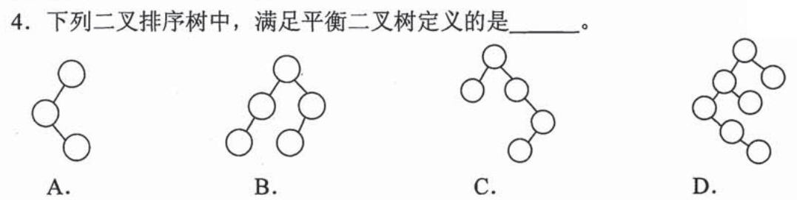

平衡二叉树要求**每个结点**的左右子树高度差至多 1。图 B 的根左右各有一条两层子树，各侧的内部结点又只有一个叶孩子，高度差均为 1，故 **B** 满足。A 的根只有一侧延伸两层、另一侧空，高度差 2；C 的右支在中间结点仍向下延伸，局部差 2；D 的左深链使某个结点两侧差超过 1，均不满足。不要把“看起来左右差不多”替代逐点的高度检查。

从叶向上算，免得被左右画得对称迷惑

给每片叶子记高度 1，空子树记 0；父结点高度是 `1+max(左高,右高)`，同时检查两侧差的绝对值。B 中左右内结点各高 2、根两侧等高；根若等高但某个深处结点单侧高 2、另一侧 0，仍是不平衡。第 0803-02 题的“完全二叉树”检查每层占位，和这题的局部高度差是不同定义；本图下半部印着第 5 题，作答时只看上方四棵树。

## 02｜2009-08：叶子用指针串联属于 B+ 树的额外结构

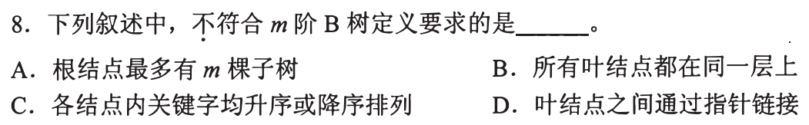

m 阶 B 树的结点至多有 m 棵子树，结点内关键字有序；树的叶子都在同一层。题问**不符合 B 树定义**的叙述，D 说叶结点之间还通过指针链接，这不是 B 树的必有约束，而是常见的 B+ 树叶层组织方式，选 **D**。先把“多路有序结点”与“叶层顺序链”拆开，不因都带 B 就视为同一树。

前三项怎样用局部结点图核对

A 是“最多 m 子树”的阶数上界；B 是所有查找终止处同深，保持多路树的平衡；C 是一个结点内关键字自小到大（或反向）排列，便于把搜索值导向某个孩子区间。D 多了一层横向的叶间关系，不由阶数、结点内部有序或同层自然推出。日后见 B+ 树题，还须看数据或索引具体放在哪里，不能只凭“叶子相连”把两者全部性质混写。

## 03｜2010-04：先插入 48，再修复最早失衡的结点

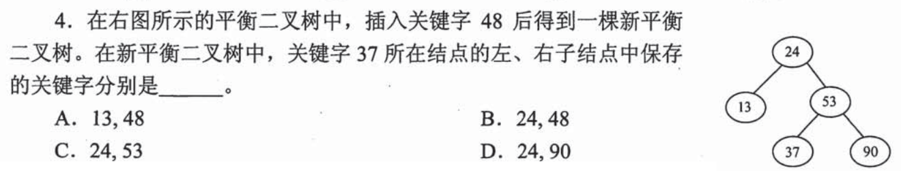

48 比根 24 大、小于 53、大于 37，先接成 **37 的右孩子**。此时 24 左侧仅 13 一层，右侧经 `53→37→48` 长出三层，24 失衡；插入路径对 24 是“先右后左”，做右左型调整：先转 53 的左支，再让中间的 37 升为整棵树的根。最终 37 左孩子 24（其左 13），右孩子 53（其左 48、右 90），所以 **37 的左右孩子为 24、53，选 C**。

为什么不能只转一次或让 48 直接成为根

原结构根 24，右子树根 53，53 左为 37；在 37 右侧插 48。先对 53 作右旋：37 升到这一局部的根，53 下降到其右，原本在 37 右侧的 48 移为 53 的左孩子。再对 24 作左旋：37 升为整棵树的根，24 在左（左孩子仍是 13），53 在右（左孩子是 48、右孩子是 90）。两次旋转只改边不交换键值，故 37 的左右孩子确实是 24、53；不能把“中间的插入值 48”想当然地升为最终根。

## 04｜2011-07：查找路径携带此前所有上、下界

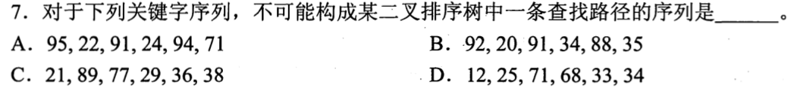

二叉排序树里，查找值比当前结点小便向左、大便向右；但走过的祖先限制仍有效。A 的路径 `95→22→91→24→94→71`，从 95 向左说明目标 `<95`，从 22 向右说明 `>22`，从 91 向左又说明 `<91`；于是从 24 向右后下一结点也必须落在 `(24,91)`，94 却超过上界 91。A **不可能**，选 **A**。

只比较相邻两个数字为何会漏掉错误

`24→94` 单看是“往右值变大”，似乎合法；但 24 整棵子树仍处于 91 的左侧，里面不能放 94。B 从 `92→20→91→34→88→35` 可持续收紧到最后的 `(34,88)`；C 的 `21→89→77→29→36→38`、D 的 `12→25→71→68→33→34` 也能各自维持祖先区间。考场每下降一层只更新一个边界：向左改上界，向右改下界。哪一步新结点撞出区间，就可直接排除。

## 05｜2012-04：每个非叶平衡因子恰为 1，求最少结点

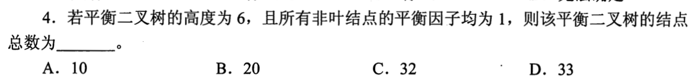

高度为 6，且所有非叶结点两侧高度**恰差 1**，为了使结点最少，每个分支的一边高 `h−1`、另一边高 `h−2`，两边都取符合条件的最小树。记 `F(h)` 为最少结点，`F(1)=1,F(2)=2`，则 `F(h)=1+F(h−1)+F(h−2)`；逐层得 `F(3)=4,F(4)=7,F(5)=12,F(6)=20`，选 **B**。不能用“完全树六层”数满格，因为题设恰好在要求每个内部结点不等高。

“均为 1”与“至多 1”差一个可行形状

平衡树定义允许差 0 或 1；本题附加所有非叶结点的平衡因子均为 1，通常这里按**绝对高度差为 1**理解，不能选左右等高的完美树。高度 2 的最小形状是根和一个叶；高度 3 要把高度 2 和高度 1 的两侧接给根，共 `1+2+1=4`。若题目只要求普通 AVL 的最小结点数，恰好仍可用高差 1 的极瘦合法形状达到同一递推，但“所有内部恰差 1”使每层选取不再有等高自由。

## 06｜2012-09：删空右叶，先看相邻兄弟能否借一个键

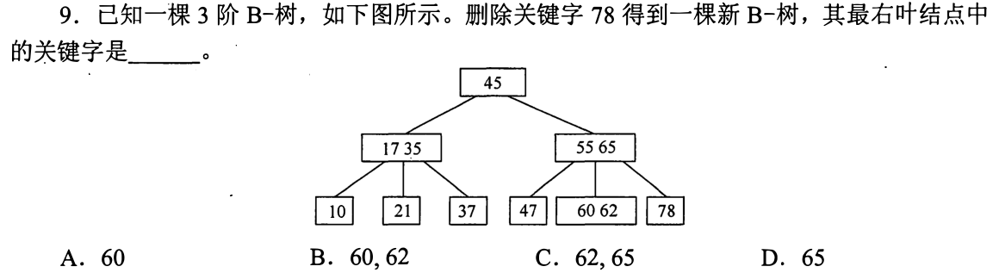

三阶 B 树的非根结点至少有 1 个关键字、至多 2 个。删掉最右叶唯一的 78，该叶变空；左兄弟叶含 `60,62` 两个关键字，可以借出一个。经父结点 `[55,65]` 调整：兄弟最大键 62 上升替换父键 65，原父键 65 下移到空右叶。最右叶最终只含 **65，选 D**。

为什么借位要经过父结点，不能把 62 直接扔过去

右叶原来属于“比父键 65 大”的区间；直接移 62 到右叶会违反这个边界。先让父键 65 降到右叶，左兄弟最大 62 升到父结点作新的分界，左兄弟余 60，三个位置仍按 `60＜62＜65` 排列。若左兄弟只有一个键，借后也会低于下限，才需要考虑合并；本图左兄弟有两个，借位是当前最小改动。第 04 题的祖先区间约束在多路树上仍然有效。

## 07｜2013-03：顺序插入仍会被旋转成三层均衡树

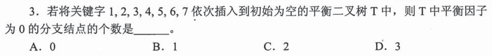

依次插入 `1,2,3` 时形成右右失衡，旋转后以 2 为根、1 与 3 为孩子；继续插 4、5、6、7，在各次首次失衡的子树做局部调整，最终得到根 4，左子树根 2（孩子 1、3），右子树根 6（孩子 5、7）。平衡因子为 0 的**分支结点**是 4、2、6，共 **3，选 D**。四个叶子左右均空、高度差也为 0，但题目明说不数叶子。

一次只修最靠近插入点的失衡处

插 3 后以 2 为局部根；插 5 后右侧以 4 为局部根；插 6 后整树形成以 4 为根的可平衡结构；插 7 后右支整理为 6 的左右孩子 5、7。每次先按二叉排序树规则找到落点，再从落点向根回溯高度，遇到第一个差达到 2 的结点做单或双旋转。题目只问最终计数，不必在考场画七张完整树；最后一幅树能解释三位内部结点左右等高即可。

## 08｜2013-06：重新插入的结点总是叶子

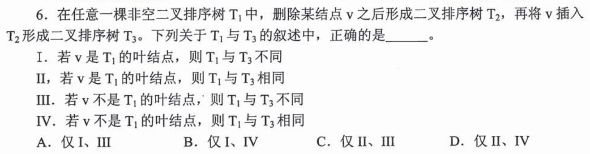

若原结点 v 是叶子，删除只空出原位置，树中其他关键字不动；再按二叉排序树查找规则插入 v，会沿同一路径回到该空位，T₁ 与 T₃ 相同，II 对。若 v 原本非叶，删除后其他结点须接管其子树或关键字位置；重新插入 v 时，它从某个空孩子位置长出，成为**叶子**，无法恢复“原 v 有孩子”的同一结点关系，III 对。正确的是 **II、III，选 C**。

为什么不能把“键集合又一样”当成“树也一样”

例如 `2` 根、左 1、右 3，删根 2 后可用 1 或 3 接管原根位置；再插 2，它落到某个叶位置，根不再是 2。键集合确实重新变成 `{1,2,3}`，但左右指针组成的形状已变。叶子情形则没有孩子要移交，删除再插入只恢复原空链接。题目问 T₁ 与 T₃ 是否相同，不能只对比中序序列：两棵不同 BST 也可能有同一中序。

## 09｜2013-10：五阶 B 树两层的最小容量从根算起

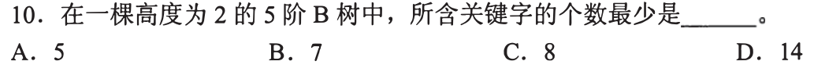

五阶 B 树的非根结点至少 `⌈5/2⌉−1=2` 个关键字；高度为 2 时，根不是叶，至少 1 个关键字和 2 个孩子。让两个叶孩子各放最低的 2 个关键字，就得到总数 `1+2+2=5`，选 **A**。不能把根也强行套成“至少 2 键”，根有单独的最低要求。

由孩子下限反推出关键字下限

结点中有 k 个升序关键字，划出 k+1 个搜索区间，至多有 5 个孩子便至多 4 键；非根内部结点至少 `⌈5/2⌉=3` 个孩子，故至少 2 键，叶虽没有实际孩子也遵守关键字数下限。根只需能把树分为至少两棵子树，最少 1 键。若高度改成 3，还要在每个内部孩子下面继续满足分叉下限，不能简单用上一层的 5 作为答案。

## 10｜2014-09：最大结点数时每个结点尽量少装关键字

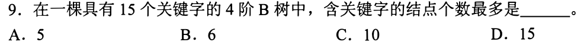

四阶 B 树的每个非根结点至少 `⌈4/2⌉−1=1` 个关键字，根也至少一个。有 15 个关键字，任何结点至少占去一个，所以结点数最多不超过 15；这个上界能达到：画一棵每个结点一个关键字、每个分支两个孩子、所有叶同层的四层二叉形 B 树，结点数 `1+2+4+8=15`。因此 **15，选 D**。四阶给的是**至多**四子、每结点至多三键，不要求每个结点都装三键。

为什么只写 `15÷1` 还缺一步

除以每结点最小键数只得“结点至多 15”的上界；还得证明 15 个单键结点能满足 B 树“所有叶同层”和内部孩子数下限。四阶非根内部至少两个孩子，单键恰分成两个区间，因此 1、2、4、8 层次的结构合法。若给的关键字总数不能正好拼出全单键且叶同层的形状，上界未必可达，不能只靠除法。第 09 题求最少关键字、本题求最多结点，方向相反却都须同时检查结点容量与整树形状。

## 11｜2015-04：中序降序，先翻转“左大右小”的方向

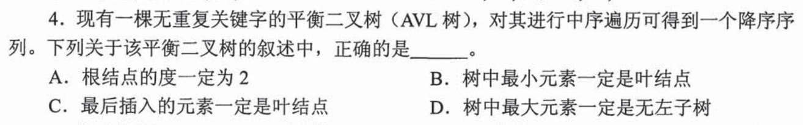

题目不是常见的中序升序，而明确说**中序得到降序**：这棵树每个结点的左侧值更大、右侧值更小。全树最大值沿左孩子走到头，故它**一定无左子树**，D 对，选 **D**。它可以有右子树；若机械套“普通 BST 最大值无右孩子”，就把题干给出的方向忽略了。

另外三条“一定”各自被什么反例击破

A 说根的度必为 2，但只有一个结点或根仅有一个孩子也可平衡；B 说最小值必为叶子，最小值在最右端却可能有左孩子，例如左大右小的根 2，左孩子 3、右孩子 1，结点 1 的左孩子是 1.5；各处高度差至多 1，而最小值 1 并非叶子。C 说最后插入者必为叶，但 AVL 插入后旋转会把刚插入的结点升为内部结点，例如按左大右小次序插 `3,1,2`，双旋后 2 可成为根。题目给“AVL”不是要每项都谈旋转，先用“降序”把最大值所在方向读对。

## 12｜2016-10：顺序查找要能沿叶层往后走

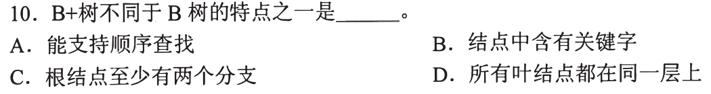

B+ 树的叶层保存按关键字顺序排列的数据入口，叶结点间通常连成链，因此找到区间起点后可**沿叶层顺序访问**；B 树没有这条必有的叶链。题问两者的区别，选 **A**。第 02 题已从反面指出“叶间通过指针链接”不是 B 树定义，这题把同一结构用在“查一段连续关键字”的操作上。

为什么 B、C、D 不构成独有特征

B 的结点有关键字，两类树都要用关键字导引查找，只是数据保存位置的设计不同；C 的非叶根至少两分支，两者都须保证搜索树不是单孩子链；D 的叶处于同一层，两类树都保持平衡。题目问“不同于”，只找共同性质还不能选。若业务要查 20 到 80 的所有键，叶层链可以从 20 所在叶继续顺次移动，不必对每个键从根重新下降，这是 A 的操作含义。

## 13｜2018-06：原图缺失的树先还原，再写中序大小链

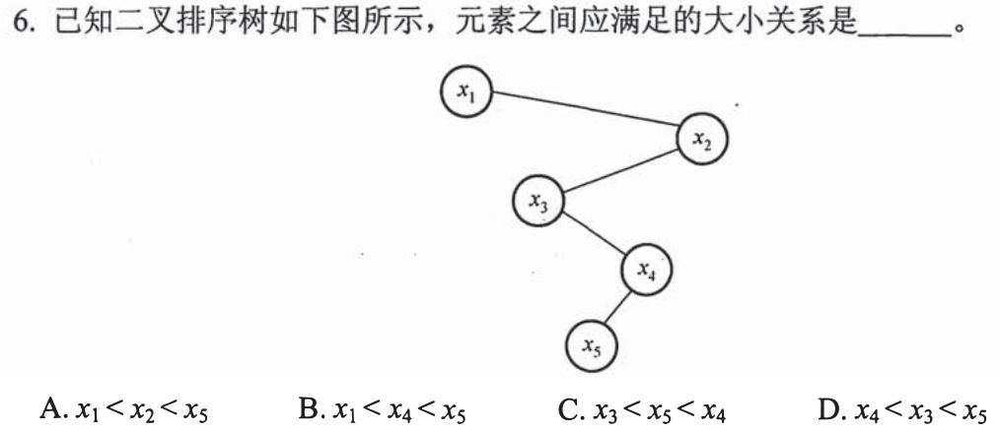

题单给出原卷核对入口及树形文字：`x₁` 右接 `x₂`，`x₂` 左接 `x₃`，`x₃` 右接 `x₄`，`x₄` 左接 `x₅`。二叉排序树的中序必须从小到大，沿“左、根、右”写出 `x₁,x₃,x₅,x₄,x₂`。所以 `x₃<x₅<x₄`，选 **C**。残图只能看见 x₁ 与一截边，若不补完整树，四项的大小关系不能独立判断。

局部大小关系怎样受到祖先区间约束

`x₃` 在 x₂ 左侧所以小于 x₂，但它仍在 x₁ 的右子树，所以大于 x₁；`x₄` 是 x₃ 的右子，x₅ 是 x₄ 的左子，因此夹在 x₃ 与 x₄ 中间。于是全链 `x₁<x₃<x₅<x₄<x₂`。A 把最大值 x₂ 放在 x₅ 前，B 把 x₄ 与 x₅ 的先后倒过来，D 甚至让 x₄ 小于自己的左子 x₅。第 04 题已用区间检查查找路径；这题可以直接通过中序一次性写出全部大小约束。

## 14｜2018-08：三阶 B 树最瘦仍须逐层分两路

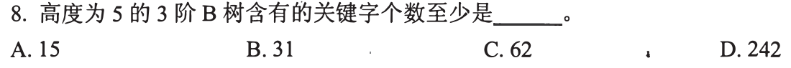

三阶 B 树每个非叶至少有 2 个孩子，每个结点至少 1 个关键字；高度为 5，即根到叶共五层。要让关键字最少，逐层取最少的 `1,2,4,8,16` 个结点且每个只存一键，总共 `1+2+4+8+16=31`，选 **B**。这题跨过第 09 题的高度 2，但基本动作仍是“最少分叉 × 最少键数”，不是用三阶的最大分叉 3 去估算。

“三阶”为什么最少情形每层只乘二

阶数 3 表示最多三个孩子；最低分叉数是 `⌈3/2⌉=2`，根若不是叶也至少两子。一个键正好划出两个搜索区间，因此每个内部结点可取一键、两孩子；五层所有叶同层的结构可实际构造。若把每层按 3 扩展，数到的是较满的树，违背“至少”。高度约定根为第 1 层，本题五项正对应五层实结点。

## 15｜2019-04：AVL 删除再插入，不能把 BST 结论整段搬来

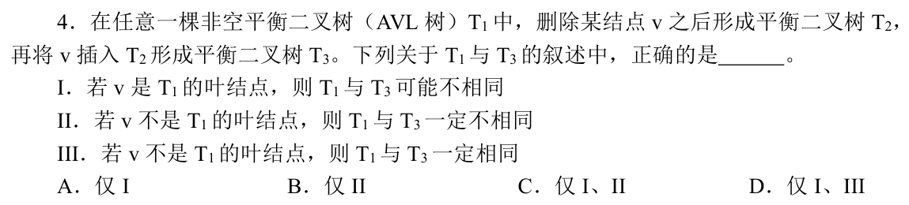

第 08 题的**普通 BST** 中，叶删后重插沿旧路径回原位；本题是 AVL，删叶可能引起祖先失衡并旋转，随后重插未必回到原形，所以 I“可能不同”对。若 v 是非叶，删除会重排，但重插时旋转有时能把 v 再升回原位，有时不能，因此 II“一定不同”和 III“一定相同”都错。只有 **I，选 A**。

一个可以复原的非叶例子，拆掉“一定不同”

非叶可复原：原树根 2，左叶 1、右叶 3。删除根 2，可用后继 3 替到根，树为根 3、左孩子 1；再插 2 落在 1 的右侧，经左—右双旋恢复根 2、左右叶 1、3。叶删后未必复原：原树根 2、左叶 1、右孩子 3（其右孩子为 4），删叶 1 后 2 失衡，对 2 左旋成根 3、左孩子 2、右孩子 4；再插 1 落在 2 左侧，整树仍平衡，根保持 3，已不同于原树。原题只问 I、II、III 哪些能**对任意或可能**成立；“可能”和“一定”的量词不能互换。

## 16｜2020-05：插入次序必须让 2 先于它的孩子 1、3

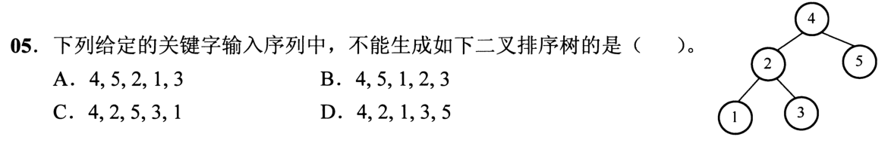

原图树根是 4，左子树根 2（孩子 1、3），右叶是 5；题单补了上一张裁图中的根。普通 BST 插入时，先进入某个空孩子位置的结点先成为该位置的根，不会旋转。B 序列 `4,5,1,2,3` 先把 1 放成 4 的左孩子，随后 2、3 只能在 1 的右侧继续往下长，无法让 2 跃升为左子树根，故 **B 不可能**。

另外三序列为什么可构造同一棵树

A `4,5,2,1,3`，先有根 4，再把 5 放右、2 放左，1、3 分居 2 两侧；C `4,2,5,3,1` 同理先就位 2，再按路径接 3、1；D `4,2,1,3,5` 也能得到相同树。旧题 03、07 的 AVL 插入可旋转，把后来结点升成父亲；本题写的是**二叉排序树**，不许暗加平衡旋转。考场先圈最终图的根和每棵子树根，再检查它们是否在本子树其他元素之前插入。

## 17｜2020-10：四阶 B 树插入时满结点分裂，键升到父结点

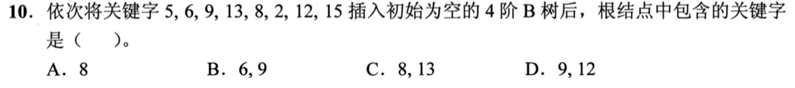

四阶 B 树一个结点最多 3 键。先插 `5,6,9` 填满根；插 13 前分裂，6 升为根，左孩子 `[5]`、右孩子 `[9]`，13 进入右叶得 `[9,13]`。继续插 8 使右叶 `[8,9,13]`，插 2 使左叶 `[2,5]`；再插 12 时右叶已满，分裂使 9 升到根，根成为 `[6,9]`。12、15 落到右侧叶，最终根关键字为 **6、9，选 B**。

只记录触发分裂的两次，别把八次操作都画整棵树

第一次满结点 `[5,6,9]` 的中间键 6 上升，剩两侧叶 `[5]`、`[9]`；第二次满叶 `[8,9,13]` 的中间键 9 上升，原根 `[6]` 扩成 `[6,9]`，三个孩子依次是 `[2,5]`、`[8]`、`[13]`。然后 12 插入最右叶成为 `[12,13]`，15 再使其成 `[12,13,15]`，未超过三键上限。关键字上升的是结点**中间**的分隔键，而不是每插一个值就把它写入根；第 06、20 题删除时方向相反，还须核下限。

## 18｜2021-06：题图缺失，按完整树形重算 23 插入后的根

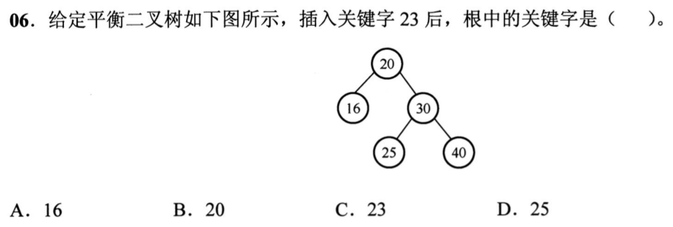

题单补齐原图结构：根 20，左孩子 16，右孩子 30（左 25、右 40）。23 应插在 `20→30→25` 的左侧，导致根 20 的右侧比左侧高两层；路径是先右、再左。先对右子树的 30 右旋，使 25 上移，再对 20 左旋，最终根为 **25，选 D**。只看残图文字和四个选项，不能独立重建原始树；必须先用补全的树形。

旋转后各关键字的位置也要核一遍

开始是 `20` 左 16、右 30；30 左 25、右 40；25 左接新键 23。先右旋 30，25 升到 30 上方，30 在其右，23 仍在 25 左；再左旋 20，25 成整树根，左孩子 20（左 16、右 23），右孩子 30（右 40）。各结点的中序仍是 `16,20,23,25,30,40`，且新树高度差满足 AVL。第 03 题也是右左失衡，但那次插入落在 37 的右侧；判断旋转必须读**这一张图的插入路径**。

## 19｜2021-09：第二层四个键，最多变成几个结点和孩子

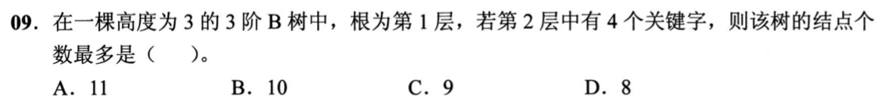

三阶 B 树一个结点至多 2 键、至少 1 键。高度 3 且第二层总共四个关键字，要让结点数最多，第二层尽量分成**三个结点**，由根的两个键分出三路；四键可分配为 `2,1,1`。第二层三个结点分别能带 `3,2,2` 个第三层孩子，共 7 叶，加根 1、第二层 3，总结点 **11，选 A**。

为什么第二层不可能有四个单键结点

根最多 2 键，只能有至多 3 个孩子，因此第二层最多 3 个结点。给定四键后，一结点装 2 键、另两结点各 1 键，刚好满足三阶上下限且三者都能产生对应的孩子；第三层填成 7 个非空单键叶即可构造。若只算 `四键＋根`，漏了第三层的分叉；若一律每个第二层结点生三子，又忽略了单键只分出两个搜索区间。第 09、10、14 题给过下限与上限，这题还额外固定了**某一层的键总数**。

## 20｜2022-08：删根内键后，修复方式会改变哪一个分界键

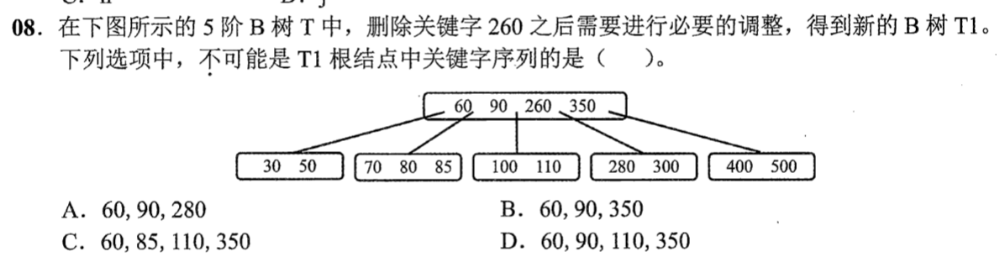

原根 `[60,90,260,350]`；260 左右相邻叶分别是 `[100,110]`、`[280,300]`，都只达到五阶 B 树非根最少两键。若用前驱 110 替掉 260，左叶删 110 后仅剩 `[100]`，出现下溢：向更左的 `[70,80,85]` 借时，85 上升替换父键 90，根变 **`[60,85,110,350]`（C）**；若合并则根减少一键（B）。若用后继 280 替换，也可通过合并得到 A 或 B。**`[60,90,110,350]`（D）不可能**：它既保留 90、350 又把 110 留在根，无法消除不足两键的叶下溢，选 **D**。

把 A、B、C 的可行变化各留一条见证

C：110 上根顶 260，原 `[100,110]` 删后 `[100]`；左邻 `[70,80,85]` 把 85 经父 90 换到根，90 降入 `[100]`，得到 `[90,100]`。B：110 上根后，欠键叶 `[100]` 与右兄弟 `[280,300]` 连同根内分隔 110 合并为 `[100,110,280,300]`，根剩 `[60,90,350]`。A：280 上根顶 260，右叶变 `[300]`；它可与右邻 `[400,500]` 连同根分隔 350 合并，根剩 `[60,90,280]`。D 若想保留 110 在根、90 不动，又不减少根的键数，只能从别处借；可借的左邻恰会把 90 改成 85，故做不到。此题不是问“某种固定删除算法唯一产物”，而是问哪一组**无合法修复见证**。

## 21｜2023-07：B 树查找可能在分支结点就成功

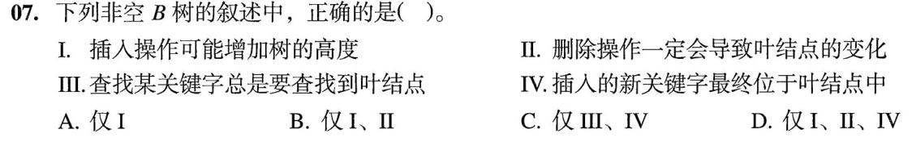

I 对：插入使根溢出并分裂时可增加树高。II 对：删除若在分支结点，最终须由前驱或后继叶中的键替补；若在叶中本来就直接改叶，因此叶层会受影响。III 错：查找目标若恰在根或其他分支结点中，立即成功，无须走到叶。IV 错：新键起初插入叶，叶满时分裂并把中间键**上升到父结点**，新键最终可能在分支结点。正确的是 **I、II，选 B**。

“最初插到叶”为什么不能证明“最终仍在叶”

四阶树的某叶含 `[1,2,3]`，再插一个合适的新键，四键超上限便分裂，选中间键升到父结点。如果新插键正好是被上升的分隔键，它最终就在分支处。查找则从上往下逐结点比较，命中分支键即可停，根键是最小反例。删除时即便先命中内结点，也不能只把它擦掉让两侧区间失去分界；用邻近叶键替代后仍要在叶处完成删除或借并。第 02 题的 B+ 树叶层性质不能误套成 B 树的“查找必到叶”。

## 22｜2024-07：子树 T 的上下界来自三个祖先方向

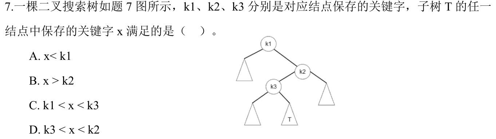

图中根 k1 的右支到 k2，k2 的左支到 k3，而子树 T 是 k3 的**右子树**。因此 T 中任一 x 比 k3 大；又由于整个 k3 子树处在 k2 左侧，x 必小于 k2。最紧约束 **`k3<x<k2`，选 D**。它当然也大于 k1，但只写 k1 作为下界会丢掉更近祖先 k3 提供的限制。

沿路径更新区间，与第 04 题同一个动作

从 k1 向右：下界变 k1；从 k2 向左：上界变 k2；从 k3 向右：下界收紧为 k3（因为 k3 已位于 k1 右侧）。最后是 `(k3,k2)`。A 说 x<k1，与第一条右转相反；B 说 x>k2，与第二条左转相反；C `k1<x<k3` 与最后一条右转相反。画三次区间收缩就能一次裁决四项，不必给三角形子树中的每个结点填具体数。

## 23｜2025-08：七键四阶 B 树，按高度和结点键数分配计形状

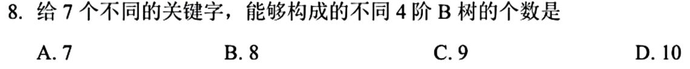

七个有序且不同的键固定后，树形由每个结点装几个键决定。高度 2 时：根装 1 键，两个叶须各装 3 键，**1 种**；根装 2 键，三个叶分五键，可为 `(1,1,3)` 或 `(1,2,2)`，每组有 3 种位置排列，共 **6 种**；根装 3 键，四叶各装 1 键，**1 种**。高度 3 的最瘦合法四阶树恰用 `1 根＋2 内部＋4 叶` 各一键，又 **1 种**。合计 `1+6+1+1=9`，选 **C**。

为什么不是排列七个键的 7! 种

B 树每个结点内部升序，子树区间也按序排好；七个不同键一旦指定“哪层哪结点装几个”，实际填键方式由大小次序固定，不能再自由乱排。四阶结点最多 3 键、非根至少 1 键；高度 1 无法装七键，高度 3 再多一键就超过总数，因此只需枚举高度 2 与唯一的高度 3 最瘦情形。根装 2 键时，五个剩余键分给三个叶且每叶 1—3 键，只有 `(1,1,3)`、`(1,2,2)` 两种数值组合，每种“哪个叶装不同数量”的三种左右位置，都要算进去。计数题先定可行高度，再逐层分配键数。

## 本线留下的考场动作

看到 AVL，先按有序关系插到叶，再从插入点向上查第一个失衡结点，并把旋转后的每条边实写出来；看到普通 BST，沿路径维护上下界，插入不暗自旋转。看到 m 阶 B 树，先写每结点的最少／最多键数，分清“上溢分裂”与“下溢借位或合并”，最后核根和所有叶是否仍合法。图像缺失的题先把原图或题单补充的树形接回来；作者已讲完这一批，用户是否能独立限时调用仍需后续训练证据。
