# 0806 Answer｜图的骨架：表示、遍历与连通

> [原题 15 题](0806.md) · [0805 的树形路径](0805-answer.md) · [能力账本](answer-quality/learning-ledger.md)
>
> 从前一组的树进入图：树只有一条从根到结点的路径，图可能有回边、多条路径或多个分量。先辨边有没有方向，再看题问的是局部度数、全局连通还是一次遍历的次序。下文是已编写并核对原题的教学稿；没有你的独立限时作答记录，不据此宣称通关。

<strong>15 题考场速查：先尝试独立作答，再取回短路</strong>

| 题 | 十秒第一笔 | 快速裁决／保底 |
| --- | --- | --- |
| [01](#q01) | 度数相加等于边数的两倍 | 奇度顶点成对；树与环分别反驳其余断言，A |
| [02](#q02) | 最密的不连通图：六点完全图加孤点 | 15 条仍可不连通，16 条必连通，C |
| [03](#q03) | 分别检查回路、稀疏存储、拓扑先后 | 只有无环才能拓扑排序，C |
| [04](#q04) | 顶点数与各邻接表项各数一次 | `O(n+e)`，C |
| [05](#q05) | 有向矩阵逐行、逐列计 1 | 出度加入度 `(3,4,2,3)`，C；原裁图缺矩阵 |
| [06](#q06) | BFS 起点的全部一层邻居先出现 | D 在 e 前访问二层 c，故不可能 |
| [07](#q07) | DFS 若先去 v₁，会立刻到 v₃ | 首项分支数 `1+2+2=5`，D |
| [08](#q08) | DFS 访问 v₂ 后必须先深入 v₅ | D 在 v₅ 前跳去 v₃，故不可能 |
| [09](#q09) | 总度 `2e=32`，指定顶点已占 24 | 余 8，每点至多 2，至少四点，B |
| [10](#q10) | 相同子式 `x+y` 只建一次 | `x,y,+,/,×` 五个不同结点，A |
| [11](#q11) | 退出递归时输出，边的两端谁先完成 | 边 `u→v` 使 v 先输出：逆拓扑，B |
| [12](#q12) | 连通至少要 `n−1` 条边 | `e<n−1` 必不连通，D |
| [13](#q13) | 所有边权 1 时，最短路只数边数 | BFS 按层，只有 III，B |
| [14](#q14) | 数边结点两端编号，别把指针算成边 | b 两条、d 四条，B |
| [15](#q15) | 最小度至少 2，从一顶点一直走 | 有限图终会遇见旧顶点，形成回路，C |

速查是理解后的提取线索，不替代第一次推演；若一时连第一笔都落不下，展开对应题的局部机制。

## 01｜2009-07：度数总和一定为偶数，其余“必然”找反例

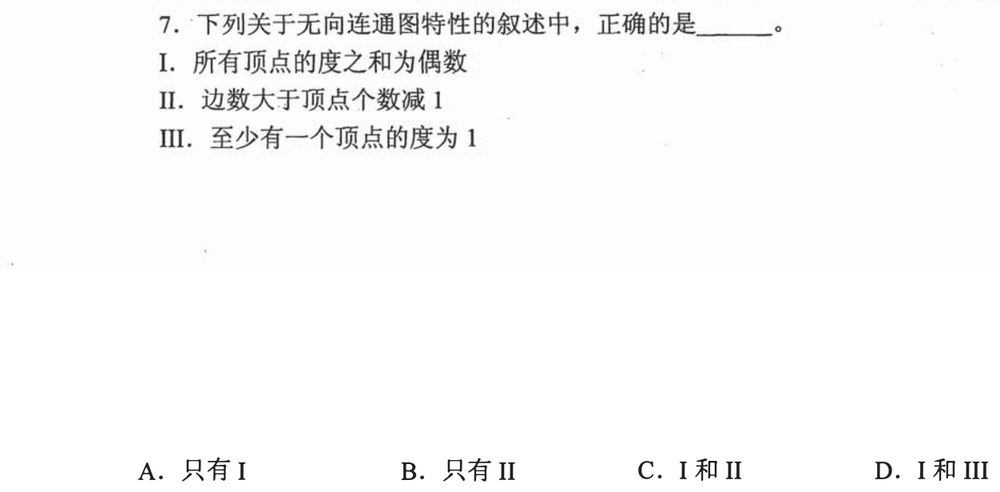

无向图每条边连着两个端点，对度数总和贡献 2，所以 I 一定真。II 声称边数严格大于顶点数减一，但一棵连通树恰有 `e=n−1`；III 声称至少有一位度数为 1，三角形每位度数都是 2。只有 I，选 **A**。题干的“连通”保证顶点之间可达，不保证有环，也不保证有叶。

怎样用两张极小图同时挡住“多边”和“有叶”

先画三个点的一条链：它连通，边数为 2，即 `n−1`，说明 II 的严格大于不成立。再把链两端接起来成为三角形：仍连通，但所有点度数 2，III 不成立。I 则无须画图，一条边的两个端点各记一次。未来再遇“任何图必然”时，一边找最瘦的树，一边找最小的环，往往比罗列所有图快。

## 02｜2010-07：保证连通，先把不连通的边数推到极限

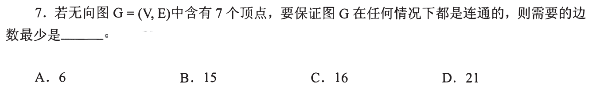

七点图想尽量多边却仍不连通，把六点聚成完全图、留一点孤立，最多 `C(6,2)=15` 条边；只要再多一条，便不可能保持这种不连通。故 **16 条一定连通，选 C**。与 01 的 `n−1` 不矛盾：前者是“存在某个连通图所需的最少边”，这里是“无论边如何分配都保证连通”的门槛。

为什么六加一比五加二更能藏边

若断成大小为 `k` 和 `7−k` 的两块，块内最多 `C(k,2)+C(7−k,2)` 条；`6+1` 得 15，`5+2` 得 11，`4+3` 得 9。任何超过两块的情形，把两块合成一块只会增加可容纳的内部边，所以极端情况确实是六点一块、孤点一块。15 仍有反例，16 才越过边界；不要把“边多于 n−1”误当保证连通。

## 03｜2011-08：同一组选项里的三个术语各有自己的检验对象

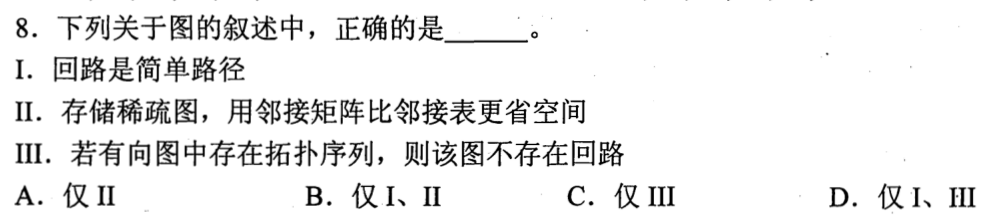

I 把回路说成简单路径，不成立：回路首尾相接，简单路径通常不重复顶点。II 说稀疏图用邻接矩阵比邻接表节省空间，也不成立：矩阵要留 `n²` 格，邻接表只跟顶点和实际边数有关。III 成立：若有向图能排出拓扑序列，每条边都从序列较前顶点指向较后顶点；沿有向环绕一圈便会要求第一个点排在自己之前。故只 III，选 **C**。

局部反驳不必把三个术语扩成完整一章

给 I 画 `a→b→c→a`，起点终点重复就违背简单路径的“不重复顶点”；给 II 画一百点只有一条边，矩阵仍要万格；给 III 假设环 `a→b→c→a`，序列必须 `a<b<c<a`，自相矛盾。第一笔是识别每项问的是“路径定义、存储量、全局先后”，然后各用最小证据裁决。

## 04｜2012-05：邻接表 BFS，顶点与边表项各被处理有限次

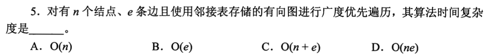

从指定顶点进行广度优先搜索，队列中每个可达顶点只入队、出队一次，扫描其邻接表时每条有向边表项也至多检查一次。若实现按全部 `n` 个顶点准备访问标记，或遍历整图所有分量，成本上界为 **`O(n+e)`，选 C**。题目用邻接表，不需为每个出队顶点逐格扫描整个矩阵行。

把同一张图换成矩阵，哪里改变

邻接表从一个顶点只扫实际存在的出边，所有顶点的表长相加是 `e`；无向边在两条表各出现一次，也是 `2e`，同阶仍为 `O(n+e)`。邻接矩阵则即使没有边，找一个顶点的邻居也要检查一行 `n` 格，全部顶点可达时为 `O(n²)`。若仅从一个起点访问很小的分量，实际遍历量可少于 `n+e`，但四个选项中的标准上界按完整图输入规模表示。

## 05｜2013-07：矩阵的一行数出去、一列数进来

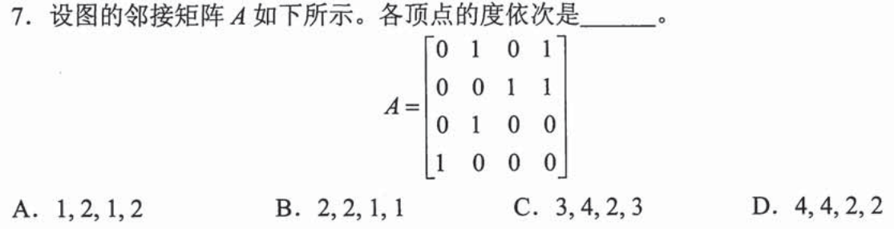

**先补题面**：仓库原裁图遗漏矩阵；[完整试卷第 7 题](https://www.xit.edu.cn/_upload/article/files/c1/ce/26986f79493495bbaacba9738587/1952f795-2b5d-4d17-8f4c-77cc5a6d6ebb.pdf)给出 `A=((0,1,0,1),(0,0,1,1),(0,1,0,0),(1,0,0,0))`。这是有向图的邻接矩阵。逐行数 1 得出度 `(2,2,1,1)`，逐列数 1 得入度 `(1,2,1,2)`，逐项相加为 **`(3,4,2,3)`，选 C**。如果仅看当前残图，任何选项都无法由题面推出，这不是应靠猜答案跳过的条件。

为什么一个 1 要同时进入两个人的“度”

`A[i][j]=1` 表示 `i→j`：它给 i 的出度加 1，给 j 的入度加 1；有向图某个顶点的度是两者之和。用总数复核：矩阵共有 6 个 1，即 6 条有向边；所有顶点的度相加 `3+4+2+3=12=2e`。只数行或只数列时总和会是 6，它们分别是总出度、总入度，并非总度。若对角线上有自环，所在行列各数一次，也符合自环同时贡献一入一出。

## 06｜2013-08：BFS 可以换同层顺序，不可跨层抢先

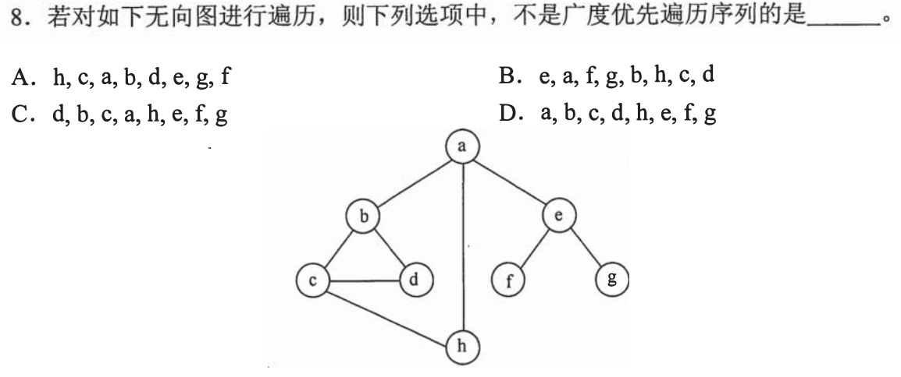

先看**每个选项自己的起点**。D 从 a 开始，a 的直接邻居是 b、e、h；BFS 扫 a 后这三位都已入队，必须先于距离 a 为 2 的 c、d、f、g 被访问。D `a,b,c,d,h,e,f,g` 中 c、d 跑到了 e、h 前面，越过层界，故 **D 不可能**。A 从 h 开始、B 从 e 开始、C 从 d 开始，不能把 a 的层次强加给这三项。

“已经入队”和“已经输出”怎样避免混淆

通常在首次发现时标记并入队，在出队时输出；无论具体把输出放在哪一步，某个起点的一层都先于二层。A 的 h 首先可发现 c、a，随后 c 发现 b、d，a 发现 e；B 的 e 首先可发现 a、f、g；C 的 d 首先可发现 b、c，随后 b 发现 a、c 发现 h。各项的后续同层顺序由邻接扫描顺序决定。考场排除型保底只需抓 D 的不可逆冲突；不能把不同起点的访问序列当成同一层级表。

## 07｜2015-05：数 DFS 序列时，先按第一条出边分叉

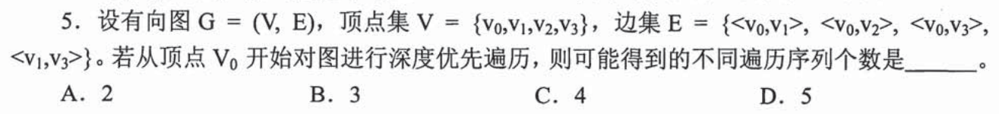

从 `v₀` 有三条出边去 `v₁,v₂,v₃`，但 `v₁→v₃` 会强制“若先访问 v₁，下一位立刻是 v₃”。以 v₁ 为首只有 `0,1,3,2` 一种；先 v₂ 后，余下 v₁、v₃ 可两种；先 v₃ 后，余下 v₁、v₂ 可两种。合计 `1+2+2=5`，选 **D**。不是直接算三邻居的 `3!`，因为深入时不能随意返回根切换分支。

把五个序列真正列出，检查“返回”时机

分别是 `0132`、`0213`、`0231`、`0312`、`0321`（数字代表顶点下标）。`0123` 不合法：到达 v₁ 后还有未访问的 v₃，应先沿这条边下探；`0312` 合法：先从根到 v₃，v₃ 无新顶点可走才退回根去 v₁，届时 v₁ 指向 v₃ 的边已经指向已访问点。以后遇 DFS 排序，优先找“访问某点会立即强迫下一点”的边，而非盲目排列。

## 08｜2016-06：用尚未访问的出边，检验 DFS 是否过早回退

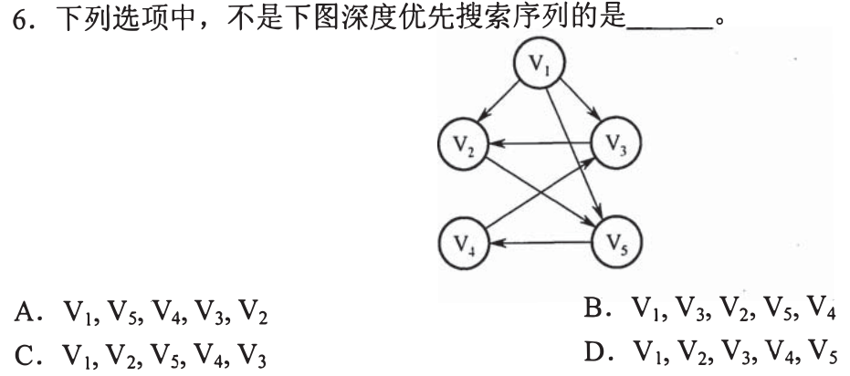

图中 `v₂→v₅`。若按 D 先 `v₁,v₂`，到 v₂ 时 v₅ 尚未访问，DFS 必须先深入 v₅，不能立即退回 v₁ 转去 v₃。因此 `v₁,v₂,v₃,v₄,v₅` **不可能，选 D**。上一题是数所有合法分叉；这题只须找到一个“明明有未访问邻居却换支”的瞬间。

其余序列为何仍有选择余地

图中可走 `v₁→v₅→v₄→v₃→v₂` 支持 A；先走 `v₁→v₃→v₂→v₅→v₄` 支持 B；先走 `v₁→v₂→v₅→v₄→v₃` 支持 C。这里有向边方向不能倒看：一条 `v₃→v₂` 不代表从 v₂ 可直接去 v₃。题干没有规定各顶点的出边访问优先级，所以不能仅凭“不是图上从左到右”判不合法。

## 09｜2017-07：总度数剩余 8，每个未知点最多分担 2

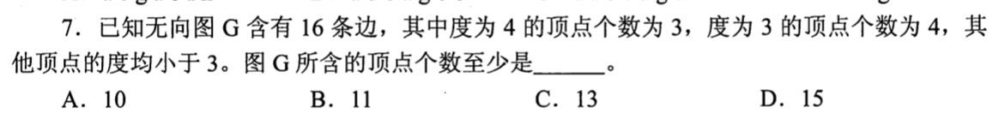

16 条无向边使度数之和为 `32`；已知三个度 4、四个度 3，一共 `3×4+4×3=24`。余下顶点的度数合计须为 8，又都小于 3，单个至多 2，所以至少需要 `ceil(8/2)=4` 位，加上已有 7 位，最少 **11，选 B**。题干的“其他顶点”是未知个数的容量限制，不是说再补一个点就够。

下界能否真的取到

四个其他顶点都取度 2，总度数刚好凑到 32；但单靠度数和仍不足以证明存在对应的简单图。可给十一点编号 0—10，取边 `01,02,03,04,12,15,16,25,26,34,37,47,56,89,8·10,9·10`。逐点数度得到前三位各 4、接下四位各 3、末四位各 2，共 16 条边，所以下界确实可达。考场只求“至少”时先用总度数迅速选 B；若怀疑下界是否可行，再补构造，不必为每个选项都画图。

## 10｜2019-06：DAG 可复用相同子表达式

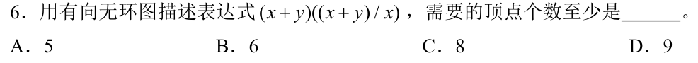

题设的有向无环图用于表达式 `(x+y)((x+y)/x)`。先圈出重复的 `(x+y)`，建一个加法结点，其两个输入是 x、y；除法结点引用这一个加法结果和 x；最外层乘法结点引用加法结果与除法结果。不同结点仅 `x,y,+,/,×`，共 **5，选 A**。若画成普通表达式树，重复出现的子式会重复建结点，数法不同。

为何同一个 x 也不必复制

DAG 允许一个结点连到多个上层运算，所以原子 x 同时进入加法和除法；加法结果也同时进入乘法和除法。按括号一层层拆，再查当前操作数或子式是否已有结点即可。原式出现三次 x、两次 y，不代表必须建五个操作数叶子；“不同顶点的最少数”正是在考共用。

## 11｜2020-06：DFS 退出时打印给出逆拓扑序

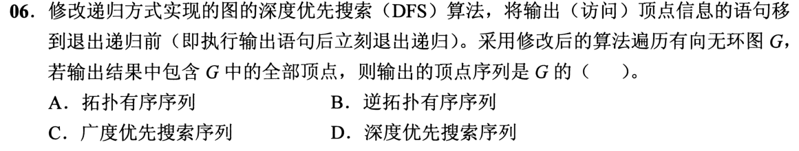

图是有向无环图，修改后的 DFS 在顶点退出递归前打印。若有边 `u→v`，从 u 追到未访问的 v，则 v 的整段递归先结束；若 v 之前已访问，在 DAG 中也不可能仍处于 u 的递归祖先位置而形成回边，所以 v 仍先打印。每条边都要求终点 v 先于起点 u，故全部顶点的输出是 **逆拓扑有序序列，选 B**。

只看到一条边，怎样分清拓扑与逆拓扑

画最小图 `u→v`：递归进入 u、再进入 v，v 没有下一层，先输出 v，回到 u 才输出 u。拓扑序要求 u 在 v 前，因此输出正好相反。若搜索有多个起点，题目已保证输出涵盖全部顶点；对任意跨树边，边的终点必在起点完成之前被访问并完成，否则仍可从起点追过去。若图有环，退出次序依然存在，却不能称为拓扑排序，故“有向无环”不是可丢的修饰。

## 12｜2022-06：边少于 `n−1`，无论怎样放都不能连通

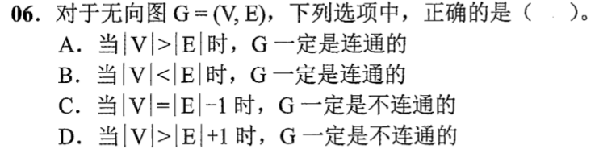

任意 n 点连通无向图都能抽出一棵覆盖所有顶点的树，树已有 `n−1` 条边。因此若 `|V|>|E|+1`，即 `e<n−1`，一定不连通，选 **D**。A 在 `e<n` 时误判：一棵树 `e=n−1` 可连通；B 在边多时误以为必连通：把一位孤立、其余顶点密连仍可能不连通；C 的 `e=n+1` 也可以连通，在一棵树上多加边即可。

同一个 n−1，三个量词不能混

`e≥n−1` 是“可能连通”的必要条件，却不是保证连通的充分条件。01 的连通树展示等号可行，02 的六点完全图加孤点展示边远超过 `n−1` 也能不连通；本题 D 是必要条件的逆否命题。读到“一定”，先问反例能否把边堆在某一块；只有总边数不足覆盖树下界时，才无需检查边的分布。

## 13｜2023-06：所有权重为 1，最短路就是最少经过几条边

BFS 从起点逐层推进，第一次发现的顶点先经过 1 条边、再 2 条边，以此类推，因此在每条边权都为 1 时，首次到达已是最短路。Prim 和 Kruskal 求的是让**全部顶点连成树的边权总和**最小，并不保证某个起点到每个终点各自最短。只有 III，选 **B**。辨识题目问“从一点到其余各点”，便不要把“最小生成树”里的“最小”搬过来。

用三点反例戳破生成树等于最短路

设三角形三条边权都为 1。任意最小生成树只保留两条边，若起点是这棵树两端之一，到另一端沿树要走两条边；原图另有被删去的直连边，只需一步。生成树总权 2 已最小，树上某一对点的距离却非原图最短。题设权重全 1 恰好让 BFS 的层号等于路径长度；若权重不等，不能继续用普通 BFS 的“先到先短”。

## 14｜2024-04：邻接多重表的记录代表边，不要数指针线

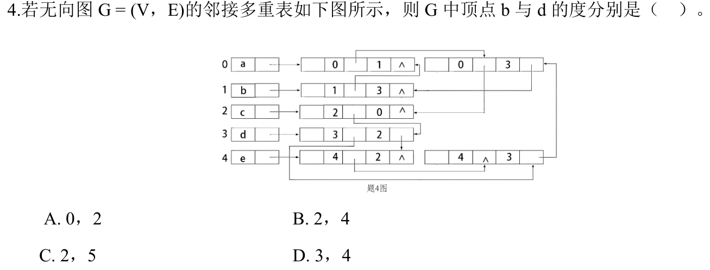

先读顶点编号 `a=0,b=1,c=2,d=3,e=4`，再看每个边结点保存的两个端点编号；一条边结点只算一条边，它的多个指针只是把同一记录挂到两个端点的链上。包含 1 的结点是 `(0,1),(1,3)`，所以 b 的度是 2；包含 3 的结点是 `(0,3),(1,3),(2,3),(4,3)`，所以 d 的度是 4。选 **B**。图里折来折去的箭头只是存储链接，不额外增加图的边。

怎样在拥挤的指针图里稳定数完

从每个长方形中只摘出两个整数端点，暂时遮住两侧的链接域，得到 `(0,1),(0,2),(0,3),(1,3),(2,3),(2,4),(3,4)` 七条无向边。然后对目标编号做一次出现次数统计：1 出现 2 次，3 出现 4 次。若把边结点的两套链接都算作独立的边，会把度数翻倍；邻接多重表恰是让一条无向边只存一份记录，同时供两端沿链接访问。

## 15｜2025-06：每点至少两条边，有限无向图必然有环

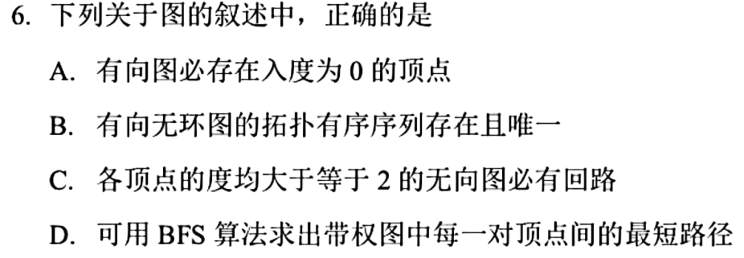

C 的条件是无向图所有顶点度数至少 2。从任一点沿尚未回走的边不断前进：进入一个顶点后，总能选择不同于刚来那条边的另一边；有限个顶点不可能永远只到新顶点，最终重复某点，出现回路。因此 **C 正确**。A 被有向环反驳，环上每点入度均为 1；B 被有两个独立起点可交换的 DAG 反驳；D 的普通 BFS 只按边数分层，权重不同就不能保证最小权值路径。

四项各只抓一个缺失的限定

有向图不等于 DAG，所以 A 不能套“DAG 至少有入度 0 的点”；DAG 可有多个拓扑序，所以 B 的“唯一”不成立。无权 BFS 求最少边数，边权可能使“边数少”反而权值更大，所以 D 也不成立。C 是树的逆向识别：有限无环无向图是森林，只要有边，每个非平凡树分量都存在度数 1 的叶；所有点度数至少 2 就排除了森林，至少有一圈。这可承接 01 用环反驳“连通必有度 1”的动作。

## 这组如何从慢推演压到考场反应

第一次做图题先问三个条件：边有无方向、目标是“存在／一定”还是求具体顺序、题面给的是实际图还是存储表示。度数题落笔计边端点，连通性题分别备一棵最瘦树和一个孤点加密集块，遍历题盯队列层界或 DFS 未访问邻居；每一类只保留这一个可执行动作。遇到不会的选项，先试一个极小图反驳“一定”，或抓第一处越层／过早回退，而不在一题上无限扩展理论。

这 15 题的讲解和速查只提供路径。真正从“看懂”进入“会做”，需遮住讲解独立给出第一笔和判据；从“会做”进入“一两分钟熟练”，还需隔时、打乱题序限时复做，并把错在读题、机制还是速度记到真实作答记录。没有这些记录时，本组状态仍是**已讲、待验证**。
