[« 0806-answer](0806-answer.md)　　[0808-answer »](0808-answer.md)

# 0807 Answer｜图上的推进：拓扑、最短路与关键路径

> [原题 17 题](0807.md) · [0806 的图与遍历](0806-answer.md) · [能力账本](answer-quality/learning-ledger.md)
>
> 0806 已讲图的方向、BFS 层次和 DFS 退出。本组在此基础上给边加上“先后”或“代价”：拓扑问依赖能否先做，最短路问从指定起点到各点的最小代价，生成树问连通全图的总边权，AOE 问并行工程完成的最晚时刻。先认清目标，再动手更新数值。

<strong>17 题考场速查：复做时才展开</strong>

| 题 | 第一笔 | 保底／结论 |
| --- | --- | --- |
| [01](#q01) | 删除 a 后看零入度 b、e | 三种排法，B |
| [02](#q02) | 下三角零使边只由小编号指向大编号 | 编号顺序存在，可能不唯一，C |
| [03](#q03) | 抄 `dist(b)=2,dist(c)=5`，选 b 再松弛 | c→f 得 4，后为 f,d,e，C |
| [04](#q04) | 区分树的总权与具体边集合 | 只有总代价唯一，A |
| [05](#q05) | 列齐三条同长的 27 路径 | f 与 d 分别击中全部最长路，C |
| [06](#q06) | 每条箭头前端须先于后端 | 4 在 2 前、6 在 5 前，D |
| [07](#q07) | Kruskal 看全局、Prim 看从 v₄ 跨界 | `(v₂,v₃)` 可全局第二，不可跨界第二，C |
| [08](#q08) | 入度初始化，再每点每边处理一次 | `O(n+e)`，B |
| [09](#q09) | 写 5:4，2:5，再逐次松弛 | 5、2、3、6、4，B |
| [10](#q10) | 查每条边的先后 | D 把 2 放在其前驱 1 前，D |
| [11](#q11) | d 的起点事件 2 最早 12 | 起始 12、最迟 14，C |
| [12](#q12) | 边权升序，成环就跳 | 5、6、9、10、11，A |
| [13](#q13) | 工期由最长的权值和决定 | 关键路径最长，B |
| [14](#q14) | 每轮查看零入度候选数 | A、B、C、D、E、F 被迫依次，A |
| [15](#q15) | 先定 3，再定 5；各松弛出边 | `dist=(21,3,14,6)`，C |
| [16](#q16) | 先算全工程 12，再逆推最迟事件 | g 余量 6 最大，B |
| [17](#q17) | 调用 0806-13 的单位权 BFS | 只有 III，B |

这些是理解后的取回线索。遇到卡点，展开对应题的局部推演；是否能限时复现须由独立作答记录验证。

## 01｜2010-08：拓扑排序的分叉来自同时可选的零入度点

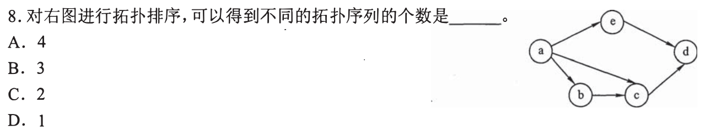

图中只有 a 可以开头；删去 a 的出边后 b、e 均可选。若先 e，再 b、c、d，只得 `a,e,b,c,d`；若先 b，c 与 e 可换位，但 d 要等 c 和 e 均已处理，得到 `a,b,c,e,d`、`a,b,e,c,d`。共 **3 种，选 B**。计数时每选一个点就删掉它的出边，不能把已出现的边约束忘掉。

为何 d 无法在中途穿插成第四种

图有 `e→d`、`c→d`，且 `b→c`。无论 b、e 谁先走，d 始终要等 c 和 e 都结束，因此只占最后一位。先画依赖链 `a→b→c→d` 和 `a→e→d`，数的是两段中间部分合法交错，而非把五点随意排列。下一题会把“至少一条合法顺序”与“唯一顺序”拆开。

## 02｜2012-06：矩阵下三角为零只保住一个方向

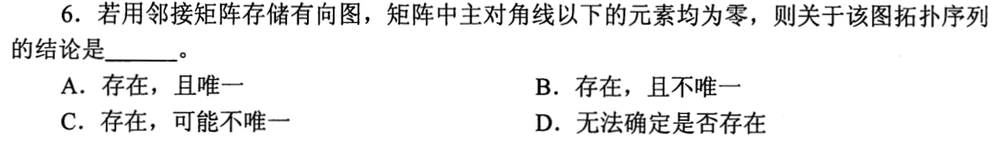

按邻接矩阵通常约定 `A[i][j]` 表示 `i→j`。主对角线以下全零，说明不存在大编号指向小编号的边；按编号从小到大排，必有一个拓扑序。若上三角也缺一些边，互不依赖的点可以交换，可能不唯一；若每对编号之间都被边约束，也可能唯一。故 **存在，可能不唯一，选 C**。题干没有给上三角实际内容，不能选“肯定不唯一”。

两个二点矩阵挡住过强判断

上三角也为零时，两点无边，`1,2` 与 `2,1` 都合法；若 `A[1][2]=1`，只剩 `1,2`。两者都符合下三角零。前题数拓扑排序要看每轮零入度候选数；本题只须用一个固定合法序列证明“存在”，再用两例说明“唯一”无法确定。

## 03｜2012-07：Dijkstra 每轮只确定当前最小的暂定距离

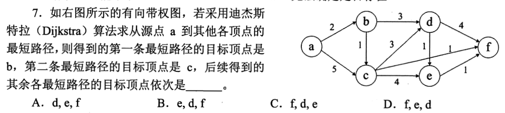

从 a 出发先确定 b 的距离 2；由 `b→c` 权 1，将 c 从直接边权 5 改成 3，第二个确定 c。由 c 松弛得 `f=3+1=4`、`d` 至少 6、`e=7`，于是先定 f；d 可由 `a→b→d` 得 5，接着定 d，并由 `d→e` 权 1 把 e 改到 6。后续次序 **f、d、e，选 C**。第一笔要写暂定距离，别把图上的边权本身当从 a 的路径长度。

为什么先定 f 后不能再被另一条路改小

本题各边权非负；所有未确定点的暂定距离此时都不小于 f 的 4，经它们再走非负边无法得到小于 4 的 a 到 f 路线。这是“确定”的依据。每轮只松弛刚确定点的出边：`d` 的暂定值先由 b 得 5，c 的另一条路为 6，仍取 5；`e` 先 7，再经 d 变 6。考场顺手写 `b2,c3,f4,d5,e6` 即可。

## 04｜2012-08：最小生成树的“总价唯一”不等于“树唯一”

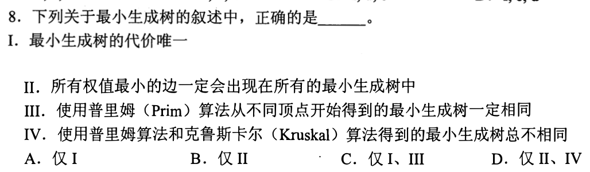

同一张带权无向图的所有最小生成树都达到同一个最小**总代价**，所以 I 真。若等权边可替换，具体树可能不同，Prim 从不同起点也不保证选出同一棵，III 假；三角形三条边都权 1 时每棵树只用两条，“所有最小权边都出现在所有树”II 假；Prim 与 Kruskal 也可能得到同一树，IV 的“总不同”假。只有 I，选 **A**。

用同一个三角形同时核查三项

三边权都是 1，三棵生成树都各含两条边、总价 2；任一具体边可在某一棵树中缺席。起点和同权时的选择顺序可以改变 Prim 得到的边集合，Kruskal 的等权处理也会换边，但两法目标都为最小代价。遇“唯一”先标注它修饰的是数值、路径还是结构，不能把“总代价固定”升级成“每条边固定”。

## 05｜2013-09：要缩短工期，必须照顾每一条并列关键路径

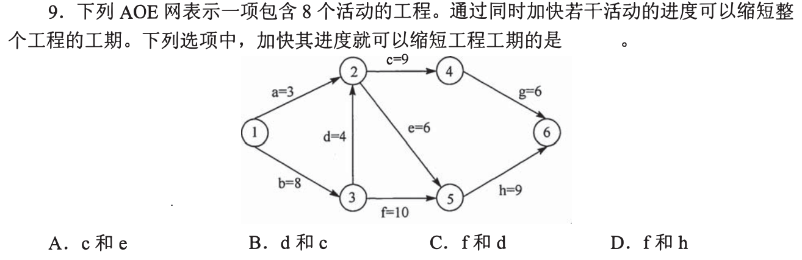

先读图中活动权值，尤其 `d=4,e=6`。原工期为 27，有三条并列最长路：`b,d,c,g` 权和 `8+4+9+6=27`；`b,d,e,h` 为 `8+4+6+9=27`；`b,f,h` 为 `8+10+9=27`。同时加快 **d 与 f**，前两条都含 d，第三条含 f，才使三条最长路都变短，选 **C**。只加快某一条路径上的活动，另一条并列关键路径仍会卡住工期。

怎样用选项快速作“覆盖检查”

A 的 c、e 都不在 `b,f,h` 上；B 的 d、c 也碰不到 `b,f,h`；D 的 f、h 碰不到 `b,d,c,g`。三种只要指出一条未受影响的 27 路径就排除。C 同时碰到三条，是“可缩短”的必要覆盖；若实际减少量非常大，非关键路径也可能变成新瓶颈，因此不能把缩短量简单相加。本题只问能否缩短，并非精确的新工期。

## 06｜2014-07：拓扑候选先查每一条强制箭头

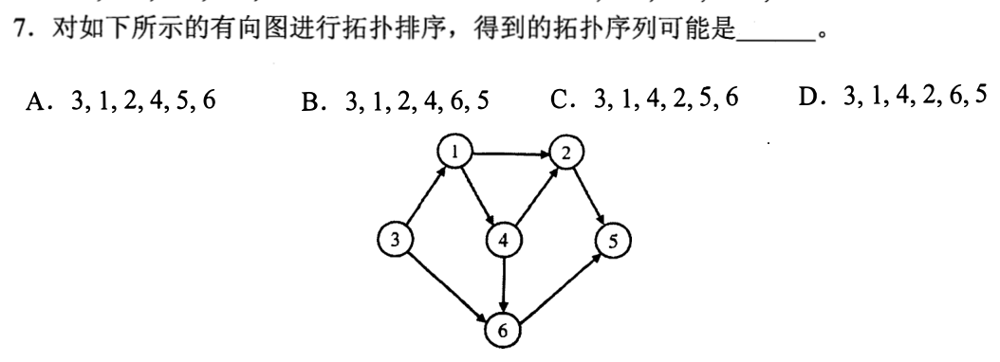

图中 `3→1→4→2→5`，还有 `4→6→5`。因此 3、1、4 必须依次靠前；2 和 6 谁先都可以，但两者必须在 5 前。D `3,1,4,2,6,5` 合法，选 **D**。A、B 将 2 放在前驱 4 前；C 把 5 放在其前驱 6 前。无需逐项完整模拟删边，抓住一条违反的箭头就能排除。

哪些关系可以交换，哪些不能

拓扑序只要求每条有向边的尾端先于头端；没有要求所有顶点编号大小有序。删完 4 后 2 和 6 都可能入度为 0，互换仍可行。但 5 同时等来自 2、6 的边，这两位都结束前不能先出现。承接 01 的零入度候选分叉，这题只要求识别四个序列中那个没有逆边。

## 07｜2015-06：Kruskal 的候选是全图，Prim 的候选要跨已选集合

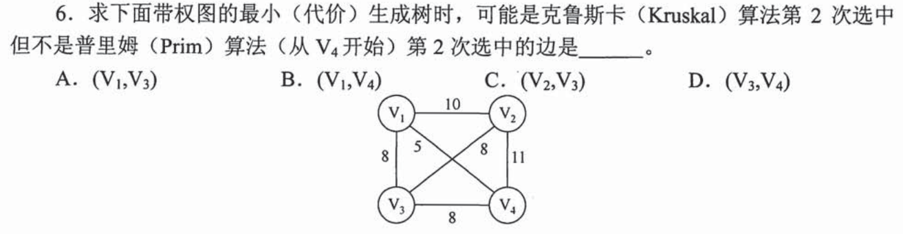

全图最小边 `(v₁,v₄)` 权 5，两法第一步都可选它。Kruskal 第二步可在权 8 的并列边里选 `(v₂,v₃)`，它不成环；Prim 从 v₄ 出发第一步已选顶点集合 `{v₄,v₁}`，第二步只能选一端在集合内、另一端在外的边，`(v₂,v₃)` 两端都在外，不合格。故 **C** 是可能由 Kruskal 第二次选中却不是 Prim 第二次选中的边。

并列权 8 不能让你忽略算法约束

图中 `(v₁,v₃)`、`(v₂,v₃)`、`(v₃,v₄)` 同为 8；Kruskal 从全图升序检查，只要不形成环便能挑其一；Prim 则必须在当前顶点集与外界的割上挑最轻边。权重相同不决定唯一的生成树，却也不允许 Prim 用一条完全在集合外的边。做题先写已选集合，再判断边是否跨界，比记两套伪代码短。

## 08｜2016-07：邻接表拓扑排序的成本是顶点加边

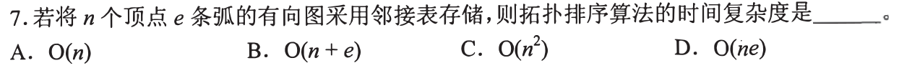

先沿邻接表统计 n 个顶点的入度，再把零入度点逐个取出；每取出一位，就扫描它的出边，把相邻顶点入度减一。每个顶点进入处理队列有限次、每条边在统计与删除时各经过常数次，所以 **`O(n+e)`，选 B**。即使有环导致不能输出全部顶点，仍不需反复扫描一个 `n×n` 的矩阵。

复杂度题沿用 0731 的“数谁”

数的是初始化顶点数组的 n、邻接表总边项的 e，而不是“拓扑序可能有几种”。有向图一条边在出边表中记一次，统计和更新都只作常数工作；队列操作总计不超过 n 次。若题目改用邻接矩阵，寻找和删除出边会扫矩阵行，最坏成本变为 `O(n²)`；本题给的是邻接表。

## 09｜2016-08：每次确认一个点后，只更新能沿出边到达的点

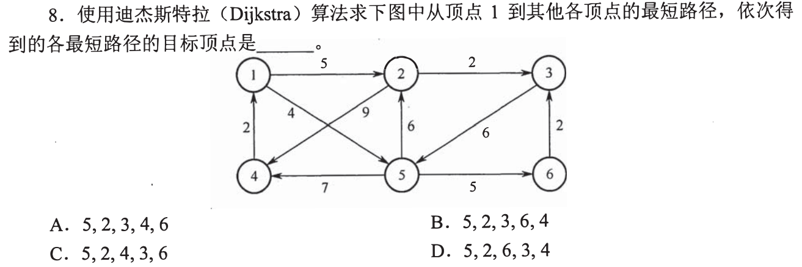

由 1 出发暂定 `5=4,2=5`，先确定 5；5 的出边给 `6=9,4=11`，到 2 的路为 10，不优于 5。再确定 2，从 `2→3` 权 2 得 `3=7`，到 4 的路为 `5+9=14`，仍不优于 11；随后确定 3，再比较 6 的 9 与 4 的 11。目标依次 **5、2、3、6、4，选 B**。

为什么不把图上的反向箭头拿来松弛

这是一张有向图；`4→1` 无法从起点 1 反走到 4，`6→3` 也不能由 3 直接抵达 6。最短路暂定值要累加“已经到达的点的距离＋该点真正的出边权”。若把箭头看反，极易让 4 或 6 提前。保底先记录三个小数 `5:4,2:5,3:7`，剩下再比较 `6:9,4:11`。

## 10｜2018-07：不合法拓扑序只须找一条逆向排列的边

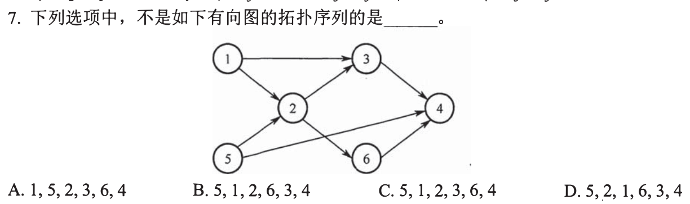

图有 `1→2`，而 D 把 2 放在 1 之前，立即不合法，选 **D**。A、B、C 都让 1、5 先于各自到达的 2，让 2 在 3、6 前，再把 4 放在其全部前驱之后；3、6 相互没有先后强制，可以换位。比起从头做四遍拓扑排序，这类“不是”题先扫描选项里最早出现的前驱倒置。

怎样避免仅凭图形上的左右位置判序

画面上 1 在 5 上方、3 在 2 右上方，位置不等于依赖。只用箭头 `u→v` 推出 u 必先于 v；无箭头的两个源点 1、5 可以交换，3 与 6 也可能交换。D 的 5、2、1 一开头已经违反 1→2，即使后面全排列正确也无法救回。

## 11｜2019-05：活动的最早、最迟开始要从两个方向算

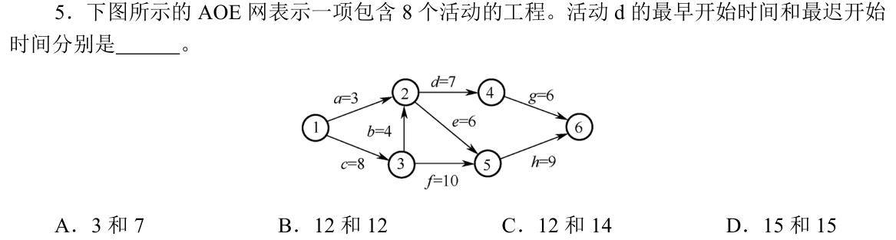

活动 d 是 `2→4`、耗时 7。事件 2 必须等 `1→3` 权 8 和 `3→2` 权 4 完成，最早时刻 `max(3,8+4)=12`，所以 d 最早开始 **12**。工程终点 6 的最早完成是 `1→3→5→6`，权和 `8+10+9=27`；事件 4 到 6 还需 g 的 6，故事件 4 最迟时刻 21，d 最迟开始 `21−7=14`。选 **C，12 和 14**。

最早取 max，最迟取 min 的具体原因

事件须等所有前置活动完成，所以向前推最早时刻取较晚的那条；事件若有多条后续路线，则向后推最迟时刻要满足每条后续期限，取较早的那条。本图 2 的 12 来自经 3 的支路，不能仅看 a 的 3；4 的 21 由终点 27 减 g 的 6 得到。d 的余量 `14−12=2`，不是关键活动，故提前 d 一小段未必减少工期。

## 12｜2020-07：Kruskal 顺着权重走，遇环跳过

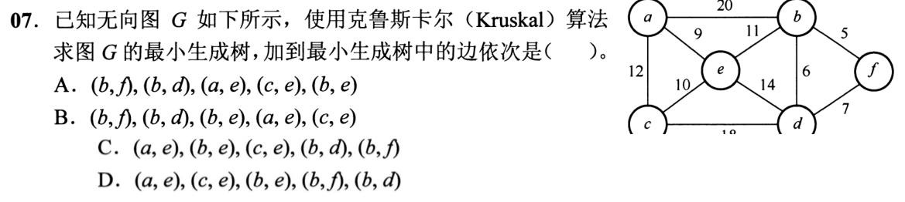

依次选 `(b,f)=5`、`(b,d)=6`；权 7 的 `(d,f)` 会在 b、d、f 间成环，跳过。接着选 `(a,e)=9`、`(c,e)=10`、`(b,e)=11`，六点以五条边接成一棵树。因此边次序是 **A**。选项把权较大的边提前、或者把本该跳过的成环边算进去，都违反这一过程。

只维护连通块，不必每步重画整图

前两条边得到 `{b,d,f}`；权 7 的两端都在同一块，不能选。权 9、10 得到另一块 `{a,c,e}`；权 11 的 b、e 分属两块，选后图连通，立刻停止。先排序再判两端是否已连通，是 Kruskal 的两步；不要混入 07 题 Prim 的“从给定起点跨界”的约束。

## 13｜2020-08：AOE 的关键路径按活动持续时间求最长

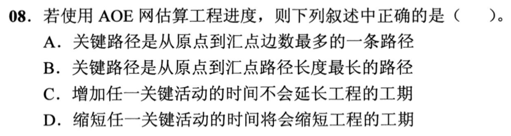

AOE 工程可并行做活动，但后续事件必须等所有前置活动完成，所以总工期由源点到汇点**权值和最大**的路径决定，选 **B**。A 数边条数而不管耗时；C 说延长关键活动不影响工期，与其零余量矛盾；D 说缩短任一关键活动必缩短工程，若存在多条并列关键路径，另一条仍卡住工期。

用 2013-09 已有的三条并列路径检验 D

那里三条关键路径长度都为 27，若单独缩短 c，经过 `b,f,h` 的支路还是 27，工程仍需 27。若增长一条关键路径上的活动，该支路会超过原工期，工程则必延长。关键活动是“处在至少一条最长路径上、没有松弛余量”，但“单独加快就能缩短总工程”还需看是否所有最长路径都受影响。

## 14｜2021-07：每轮只有一个零入度点，拓扑序才被迫唯一

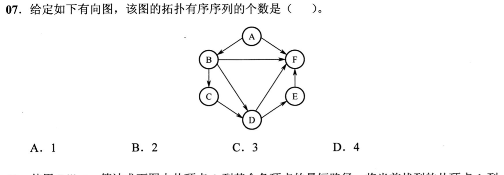

先只有 A 零入度；删 A 后必须取 B（F 还有 B、D、E 等前驱），接着只有 C，再 D，再 E，最后 F。合法序列只有 **`A,B,C,D,E,F` 一条，选 A**。图上看着 A 还直连 F、B 也直连 F，并不会让 F 提前；零入度要等所有指向它的边都删除。

怎样几秒判断数量，不展开阶乘

固定的依赖链 `A→B→C→D→E→F` 已经把六点全部贯穿；其余边只重复强化这一先后，不会创造新顺序。若每轮存在两个零入度点而题目未另有限制，交换这两点通常就能生成不同顺序。与 01 的 b、e 可交换和 02 的上三角未知形成连续判断：这题给出完整图，确实能逐轮断言唯一。

## 15｜2021-08：第二条最短路径确定后，四个 dist 都要更新

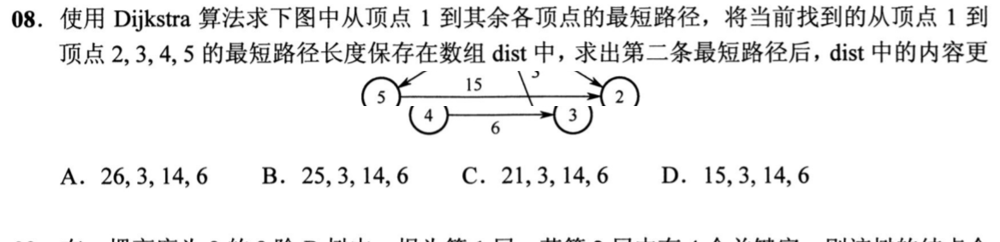

从图中的起点 1 初始化：直接到 `2=26,3=3,5=6`，4 暂不可达。先确定 3（距离 3）；图中权 22 的箭头是 `2→3`，不是 `3→2`，因此不能由 3 把 2 更新为 25，2 的暂定值仍是 26。再确定 5（距离 6），`5→2` 权 15 使 2 更新到 21，`5→4` 权 8 使 4 更新到 14。此时按 2、3、4、5 顺序，**`dist=(21,3,14,6)`，选 C**。不能只把第二个确定的点写进数组，其他暂定值也会随之松弛。

三个阶段的表比默算可靠

起始 `(26,3,∞,6)`；确定 3 后 `(26,3,∞,6)`；确定 5 后 `(21,3,14,6)`。注意 `dist[2]=21` 此刻仍是暂定值，并非已经确定了到 2 的最短路；题目问的是“求出第二条最短路径后数组的内容”，不是最终的完整最短路表。图中的 `4→2` 要等确定 4 后才能用来松弛到 2 的距离；`2→3` 的权 22 也不能反向使用。

## 16｜2022-07：时间余量不是活动耗时，要前推再后推

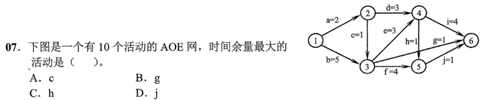

先从图中读取各活动耗时。前推事件最早时刻为 `ve(1..6)=(0,2,5,8,9,12)`；从工程工期 12 后推，得 `vl(1..6)=(0,4,5,8,11,12)`。活动的余量是“终点事件最迟时刻－起点事件最早时刻－本活动耗时”：c（`2→3`，1）余 2；g（`3→6`，1）余 **6**；h（`4→5`，1）余 2；j（`5→6`，1）余 2。故 **g 最大，选 B**。

先只算四个候选，数值怎样落地

图的关键路径是 `1→3→4→6`，耗时 `5+3+4=12`。因 `ve(3)=5,vl(6)=12`，g 可最晚在 11 开始、最早在 5 开始，余 6；h 从最早 8 到最迟 10，余 2；j 从 9 到 11，余 2。c 的终点 3 最迟 5、起点 2 最早 2，扣掉本边 1，余 2。只看“g 自己仅需 1”不能推出余量，要看它前后事件的时间窗口。

## 17｜2023-06：重复题检验单位权最短路能否直接取回

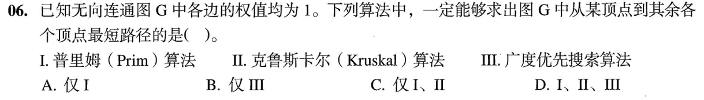

本题与 [0806-13](0806-answer.md#q13) 同一原题。每条边权都为 1，从指定顶点到其余各点的权值最短等于经过边数最少；BFS 按层首次发现便达到这个边数。Prim、Kruskal 求整图连通的总权，不保证指定起点到每个点的最短距离，所以只有 III，选 **B**。重复出现时考的是能否在新能力线中迅速辨目标，而非再次从零讲 BFS。

读题后十五秒的取回动作

圈“某点到其余各点”和“权值均为 1”：前者锁定单源最短路，后者把路径权值化为边数；直接选 BFS。若发现自己又去比较 Prim 与 Kruskal 何者生成的树更短，就回到 0806-13 的三点三角形反例：生成树省总边权，却可能删去起点到终点的一条直连边。

## 慢推演如何缩成考场一两分钟

先用目标给题分流：依赖顺序看零入度，单源最短路列暂定距离，连通总权看跨界或成环，工程工期找最长权路径。第一次训练要能复述“为什么这一步安全”，特别是 Dijkstra 的非负权、Prim 的跨界、AOE 的并列关键路径；之后遮住折叠内容，只拿第一笔和反例快速做。遇到难算的题先保底：排除逆边拓扑序、排除成环生成树边，或用一条未被加速的最长路径否决缩工期方案，不要让全卷时间被单题吞掉。

17 题已形成可复习的讲解，尚无你独立限时复做的结果。看懂推演、遮住推演会做、打乱题序在限时内稳定做对，是三个不同的状态；只有真实复做记录能把后两者写成已经达到。

[« 0806-answer](0806-answer.md)　　[0808-answer »](0808-answer.md)
