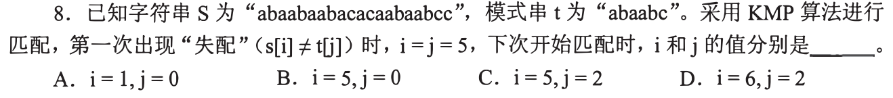
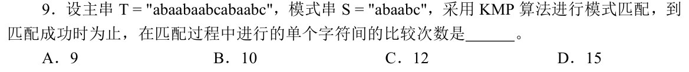
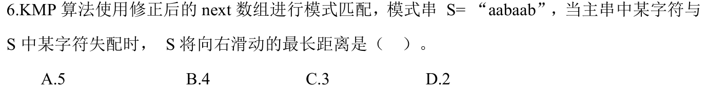

[« 0808-answer](0808-answer.md)　　[0810-answer »](0810-answer.md)

# 0809 Answer｜失配之后：KMP 保留什么

> [原题 3 题](0809.md) · [0808 的比较次数](0808-answer.md) · [能力账本](answer-quality/learning-ledger.md)

**进入本篇时已有**：逐步执行并把状态写在纸上（0802-16）；比较次数按实际比较逐次数（0808-08、09）；最小反例否定“一定”（0802-13）。
**读完新增**：失配后主串 i 不动，j 退到已匹配前缀的最长真首尾相同段（01）· 数比较次数时失配字符会被再比一次（02）· 修正 `nextval`：候选字符与失配字符相同则再退（03）。

<details><summary>本篇速览（起手 · 最易错 → 先看什么）</summary>

| # | 新增台阶 | 起手 | 最易错 → 先看什么 |
|---|---|---|---|
| [01](#q01) | j 退到首尾相同段长 | 抄出 `t[0..4]`，圈首尾相同段 | i 倒回或前进 → 失配字符 `s[5]` 与 `t[2]` 比过没有 |
| [02](#q02) | 同一主串字符再比一次 | 逐行写 (i,j) 与结果 | 只数主串字符 → 失配的 `T[5]` 比了两次 |
| [03](#q03) | `nextval` 跳同字符 | 列 next，逐位比 `t[next]` 与 `t[j]` | 用未修正 next 的最大移动 → 题问修正后 |

跨题信号：主串 i 只前进不后退（01、02、03）；移动距离＝j−新 j（03）。
</details>

<a id="q01"></a>
## 01｜失配后 i 不动，j 退到首尾相同段



**新增 / 起手 → 答案**：新增“j 退到已匹配前缀的最长真首尾相同段”。起手：抄出已匹配的 `t[0..4]=abaab`，找最长的“开头＝结尾”（不含整串）。→ **C**（i=5，j=2）。

```
abaab   首尾长 1：a vs b  ✗
        首尾长 2：ab vs ab ✓
        首尾长 3：aba vs aab ✗
        首尾长 4：abaa vs baab ✗
```

失配在 `s[5]≠t[5]`（`s[5]=a`，`t[5]=c`），说明 `s[0..4]=abaab`。其结尾 `ab`（即 `s[3..4]`）已知等于 `t[0..1]`，故把模式右移 3 格，让 `t[0..1]` 对上它们，下一次比较的是 `s[5]` 与 `t[2]`。

| 选项 | 题面依据 |
|---|---|
| A i=1，j=0 | i 退回到 1，丢掉已比出的 `s[0..4]`，与 `s[0..4]` 已知相等不符 |
| B i=5，j=0 | 丢了已确认的 `ab`，j 比最长相同段小 |
| **C** i=5，j=2 | 同上表，最长相同段长 2 |
| D i=6，j=2 | 失配的是 `s[5]` 与 `t[5]`；`s[5]` 与 `t[2]` 还没比，不能让 i 先加 1 |

<a id="q02"></a>
## 02｜失配字符会被重比一次



**新增 / 起手 → 答案**：沿用 01 的回退；新增点是回退后同一个 `T[5]` 要再比一次，这一次也计数。起手：写 (i,j)。→ **B（10）**。

`T=abaabaabcabaabc`，`S=abaabc`：

```
1-5  (0..4, 0..4)  abaab 全同
6    (5,5)  a≠c    失配；由 01，j 退到 2，i 仍 5
7    (5,2)  a=a    ← T[5] 第二次被比
8    (6,3)  a=a
9    (7,4)  b=b
10   (8,5)  c=c    j 到 6，匹配成功，停
```

| 选项 | 与题面不符之处 |
|---|---|
| A 9 | 数的是 i 走过的 9 个字符（0–8）；`T[5]` 比了两次，漏 1 次 |
| **B** 10 | 上表 |
| C 12 | 逐次表里没有对应的 12 次比较 |
| D 15 | 恰是朴素“失配后从下一个起点重比”的次数（6+1+2+6），不是 KMP；题问 KMP |

<details><summary>朴素次数核对</summary>

起点 0：5 同 1 失＝6；起点 1：1；起点 2：2；起点 3：6 次全同；合计 15。该数与 `T` 长度相同是巧合。
</details>

<a id="q03"></a>
## 03｜修正 next：候选字符与失配字符相同就再退



**新增 / 起手 → 答案**：本题含两件事：先对每个 j 套用 01 的首尾法得 `next`（复用），再新增 `nextval`。起手：写 `t=aabaab` 的 next，再逐位比 `t[next[j]]` 与 `t[j]`。→ **A（5）**。

约定：下标从 0 起，`−1` 表示本字符作废、i 前进。`next[j]` ＝ `t[0..j-1]` 的最长首尾相同段长（01），`next[0]=−1`。右移距离＝j−新 j。

| j | 0 | 1 | 2 | 3 | 4 | 5 |
|---|---|---|---|---|---|---|
| t[j] | a | a | b | a | a | b |
| next | −1 | 0 | 1 | 0 | 1 | 2 |
| t[next] | — | a | a | a | a | b |
| nextval | −1 | −1 | 1 | −1 | −1 | 1 |
| 右移 j−nextval | 1 | 2 | 1 | 4 | 5 | 4 |
| 右移 j−next | 1 | 1 | 1 | 3 | 3 | 3 |

规则：若 `t[next[j]]=t[j]`，退过去仍是同一字符、必再失配，取 `nextval[j]=nextval[next[j]]`；否则 `nextval[j]=next[j]`。例：j=4 失配（`t[4]=a`），候选 `t[1]=a`、再退 `t[0]=a` 都必败，直接 −1，右移 5。j=5：`t[2]=b=t[5]`，取 `nextval[2]=1`，右移 4。

| 选项 | 依据 |
|---|---|
| **A** 5 | j=4 时 4−(−1)；表中最大 |
| B 4 | j=3 与 j=5 能达到，但不是最大 |
| C 3 | 未修正 next 的最大值（表末行）；题问“修正后” |
| D 2 | 只是 j=1 的移动 |

<details><summary>一基记号与第 0 位</summary>

教材若用一基 `nextval`，数组整体加 1，右移距离不变。j=0 失配时按 −1 约定移 1 格；它不影响最大值。
</details>

[« 0808-answer](0808-answer.md)　　[0810-answer »](0810-answer.md)
