[« 0809-answer](0809-answer.md)　　[0811-answer »](0811-answer.md)

# 0810 Answer｜排序过程：34 题完整讲解

> [原题 34 题](0810.md) · [0808 的比较与存储](0808-answer.md) · [能力账本](answer-quality/learning-ledger.md)
>
> 本节点 01—34 已逐题核对和编写，尚待用户独立限时验证。开始一趟排序前先问“这一趟处理完有什么已经确定”：堆是父子大小约束、冒泡把一端极值固定、选择把一端最小项固定、快速排序固定枢轴、归并使一个区间有序。2009 年第 10、11 题在原仓库裁图里错位，下文以图里**实际题号**为准。

<strong>前 10 题复做速查</strong>

| 题 | 十秒第一笔 | 保底／答案 |
| --- | --- | --- |
| [01](#q01) | 新 3 放末尾，沿父结点 19、8、5 上浮 | `3,5,12,8,28,20,15,22,19`，A |
| [02](#q02) | 第二趟后前 3 项 11、12、13 已有序 | 插入排序，B |
| [03](#q03) | 按真实第 11 题读“CPU 区分指令和数据” | 取指与取数的周期阶段，C；本题跨能力线 |
| [04](#q04) | 区分递归总调用数与调用栈深度 | 左右先后不改变总次数，D |
| [05](#q05) | 第一趟 88 到末端、第二趟 16 到倒数第二 | 冒泡排序，A |
| [06](#q06) | 快排要从两端便捷访问与交换 | 顺序存储，A |
| [07](#q07) | 18 加在数组第六位，对父 10 再对父 25 | 比较两次，B |
| [08](#q08) | 看每趟是否至少固定一个最终位置 | 选择、快排、堆排，A |
| [09](#q09) | 折半只改变定位，不改变后移 | 比较次数可能不同，D |
| [10](#q10) | LSD 先个位，再按十位稳定分组 | `007,110,911,114,119,120,122`，C |

首次看题先走可执行动作，再用速查提取；未有独立限时记录，不算已经熟练。

## 01｜2009-09：小根堆插入，新元素只沿自己的祖先上浮

原堆数组 `5,8,12,19,28,20,15,22`，先把 3 追加为第九位。它的父项依次是第 4 位的 19、第 2 位的 8、第 1 位的 5，逐一比较并交换，最终为 **`3,5,12,8,28,20,15,22,19`，选 A**。其他与插入路径无关的结点不应重排；堆只要求每个父不大于自己的孩子，并不要求整张数组升序。

只记录三次交换，比重建整棵树省事

数组从 1 编号，新项位置 9 的父位是 `⌊9/2⌋=4`，换 19；到位置 4 再与位置 2 的 8 换；到位置 2 与根 5 换。最后位置 1 是 3，原 5 落第 2 位、8 落第 4 位、19 落第 9 位。选项若动了 12、28、20、15、22 就可以直接排除。后面 2011-11 的大根堆题仍用“新项与父比较”，只是方向反过来。

## 02｜2009-10：第二趟的局部有序，先识别“前缀”

题给的第二趟结果是 `11,12,13,7,8,9,23,4,5`。直接插入排序每一趟把下一个元素插入已排好的前缀，第二趟后前三项可为 `11,12,13`，剩余部分暂时仍无序，选 **B**。选择排序前两位应是全局最小的 4、5；冒泡排序若从左到右，每趟把最大的项推到末尾，此结果尾部却是 4、5；二路归并第二趟处理后的各段也不符合这张图的局部状态。

“第二趟”不等于整个数组的第二次交换

插入排序的初始第一个元素可视为已排好，第一趟插第二个，第二趟插第三个，故只承诺前三项内部有序、不承诺前三项已经是全局最小。这一题的右侧仍有比 11 小的 4、5，恰恰挡住“选择排序已经固定最小前缀”的判断。考场依次查“前缀有序”“全局极值固定”“分段有序”，比逐项完整模拟更快。

## 03｜2009-11：题单跨入 CPU，按取指和取数的阶段判断

同一串二进制位本身没有“我是指令”或“我是数据”的标签。CPU 在指令周期的**取指阶段**把从程序计数器所指地址取出的位串送去译码；在执行阶段若需操作数，则把相应地址读出的位串当数据使用。区分依据是 **指令周期的不同阶段，选 C**。译码结果是在已当作指令取入后才产生；寻址方式或存储单元位置也不能单独给位串贴永久身份。

为何保留这道离题的题，而不硬接排序概念

原题实际第 11 题确实属于计算机组成原理，题单却将它列入排序能力线。第一次答题时照题意解，后续整理节点可把它归入组成原理的能力线或标为跨线复现；不能为了让当前章节整齐，把 CPU 题讲成排序或干脆漏掉。最低保底是先问“这一次内存读取由哪一阶段发起”，而不是通过 bit 长相猜用途。

## 04｜2010-10：先处理哪侧，不改变快排的递归总调用次数

一次划分把枢轴放到最终位置，左右两侧仍须分别处理。无论先处理左侧还是右侧，待排序的子区间没有变，标准快排会对相同的非空子区间发起递归，因此**递归总次数与处理顺序无关，选 D**。处理较短一侧优先可能影响调用栈峰值，但不能据此声称递归调用的总次数减少。

为什么 C 看起来合理，却答错题问的量

若额外改写算法，让较短一侧递归、较长一侧留给当前调用循环，确实可以把最深调用栈控制在 `O(log n)`；但那引入了**用循环代替一次递归**的新操作，题目并未这样改写。原题只交换两个分区的处理先后，左、右仍各处理一次，递归总调用次数不变。初始数据可能影响划分是否均匀和递归树形，A 的“与排列次序无关”也太强。先圈题问的是“次数”还是“同时在栈里的层数”，便能拦住 C 的诱惑。

## 05｜2010-11：冒泡每趟把右侧一个极值送到最终位

初列 `2,12,16,88,5,10`。第一趟从左到右比较交换相邻逆序项，88 一直被推到尾，得 `2,12,16,5,10,88`；第二趟把余下最大值 16 推到倒数第二位，得 `2,12,5,10,16,88`；第三趟把 12 推到再前一位，得 `2,5,10,12,16,88`。三张状态正合 **冒泡排序，选 A**。题目“可能”不用证明其他算法在任何实现下都不可能，只须抓稳定的一端极值推进并核对三趟。

为什么不能只看最后一行有序

任何正确排序最终都会得到 `2,5,10,12,16,88`。关键证据在过渡：第一趟 88 从原中间跑到末尾，但前面仍有 12、16 在 5、10 之前，说明这一趟没有全局整理前缀；第二趟 16 紧挨 88，恰是“每趟固定尾端一位”的不变量。拿这条不变量去比选项，比记某个算法的每一条交换代码更可迁移。

## 06｜2011-10：快速排序需要有效地定位和交换两端元素

快排在一个待划分区间里频繁按位置读写、交换元素，还要递归处理两段下标范围。顺序存储让第 i 个元素能直接按下标访问，最适合这套划分过程，选 **A**。链式存储或散列存储虽然也能放元素，但不提供相同的按区间两端直接访问能力；索引存储在这里又增加不必要的间接访问。

承接 0808-13 的“能按下标摸到中间”

折半查找要直接取中项，快排划分要不断读左右两端并交换：两者虽目标不同，都依赖按位次快速访问。链表可另设计专门的划分操作，但题目问“为实现快速排序算法，待排序序列宜采用什么存储方式”，应匹配常规原地数组划分的需求，不因链表也能抽象存序列就选链式。

## 07｜2011-11：大根堆插入 18，比较到遇见更大的父结点为止

原堆 `25,13,10,12,9`，末尾追加 18 到第 6 位。它先与父结点第 3 位的 10 比较，18 更大，交换；现在 18 在第 3 位，再与根 25 比较，18 不大于 25，停止。元素间实际进行了 **2 次比较，选 B**。这里的比较次数包括最后那次确定“不用再上浮”的比较，不能只数发生交换的次数。

与 01 的三层上浮只有大小方向不同

小根堆新项更小才上浮；大根堆新项更大才上浮。由尾部位置 6 的父位 `⌊6/2⌋=3`，再由位置 3 的父位 1，恰好两次；原数组其他结点不参与。末尾 18 上浮后的数组是 `25,13,18,12,9,10`，仍满足父不小于孩子。若只算交换一次，会误选 A。

## 08｜2012-10：一趟后至少固定一个“最终位置”的三种排序

简单选择每趟把当前最小值放到未排序段前端；快速排序一趟划分把枢轴放到最终位置；堆排序每趟把根部极值换到未排序段末端并收缩边界。I、III、IV 都符合，选 **A**。希尔排序一趟只在某个步长的子序列里整理，归并一趟使局部段有序，都不能保证某个具体元素已占全局最终位。

“局部有序”与“最终位”差在哪里

第 02 题的插入排序前缀有序，但右边还藏着 4、5，前缀里的 11 尚不在最终下标。归并后某一段内部也可有序，却可能整体还要与另一段合并而移动；希尔分组还要缩小间隔继续处理。相反选择、快排枢轴、堆排尾项各有一位被证明以后不会再动。识别这种不变量，可以迅速排除两项。

## 09｜2012-11：折半插入少比较，元素后移却仍须执行

直接插入排序逐个比较找插入位置；折半插入利用当前已有序的前缀，按中点确定插入位置，可能减少元素间**比较次数，选 D**。但在数组中腾出同一个插入槽时，后面的元素仍需向后移动同样的格数。若把折半定位等同于能跳过移动，就把“找位置”和“搬元素”混成一步。

四项逐个问“定位”还是“搬移”

两者都逐个插入待排元素，趟数相同；常规原地顺序表实现只需一个临时元素，额外空间也同阶。折半查找改变每趟确定插入位置所需的关键字比较，D 不同；在同一稳定插入规则下，最终插入位置相同，后移的元素范围也相同，B 不因改成折半定位而减少。这里的关键是把时间拆成“查到位置”与“搬到位置”两段，承接 0731-08 的动作。

## 10｜2013-11：基数排序第二趟按十位稳定收集

最低位优先的基数排序先看个位：`110,120,911,122,114,007,119`。第二趟看十位，按十位从小到大分桶，同时在同桶保留上一趟已有的顺序：`007` 的十位 0；`110,911,114,119` 的十位 1；`120,122` 的十位 2。得 **`007,110,911,114,119,120,122`，选 C**。位数相同的 `007` 须保留前导零作为三位关键字。

若把第二趟误当完整数值排序会怎样

第二趟只保证十位优先、个位作为同桶的次序，百位还没有分配，因而 `911` 仍排在 `114` 前面（两者十位同为 1，个位 1＜4），并未得到完整数值升序。第一次按个位稳定收集，再按十位稳定收集，逐层继承已有低位次序；写两个短桶比反复比较完整三位数更快。

## 这一批怎样由慢演算压成考场动作

看到“第几趟”先问该算法每趟固定的是一个极值、一个枢轴，还是只产生局部有序；看到堆插入只追新元素的祖先；看到基数排序只按当前位稳定分桶。原题裁图有错位与一题跨学科，做题时必须先核对印在图中的题号。下一组 11—20 切换到希尔间隔、快排枢轴和排序方法取舍；21—34 仍待完成。已讲的题也仍无独立限时证据。

<strong>11—20 题复做速查</strong>

| 题 | 第一笔 | 保底／答案 |
| --- | --- | --- |
| [11](#q11) | 隔 3 取 `9,13,20`、`1,7,23`、`4,8,15` | 三组各有序，B |
| [12](#q12) | 两趟快排至少有两个枢轴已归位 | C 只有 9 可作归位枢轴，C |
| [13](#q13) | 基数每一位都搬所有记录 | 移动次数不看初始顺序，C |
| [14](#q14) | 最末 12 替根，对孩子 15、10，再对 16 | 共三次比较，C |
| [15](#q15) | 希尔每组做插入 | 直接插入排序，A |
| [16](#q16) | 比较归并与插入的时间、空间 | 只效率较高 III，B |
| [17](#q17) | 希尔与堆需按下标跨距访问 | IV、V 效率会下降，D |
| [18](#q18) | 初始与首趟对照跨 5 位，再跨 3 位 | 间隔 5、3，D |
| [19](#q19) | 从最后一个非叶向根依次下沉 | A 的每步遵守局部父子，A |
| [20](#q20) | 除时间外逐项看规模、存储、稳定、初态 | I、II、III、IV 全部，D |

## 11｜2014-10：希尔第一趟先把相隔固定步长的组排好

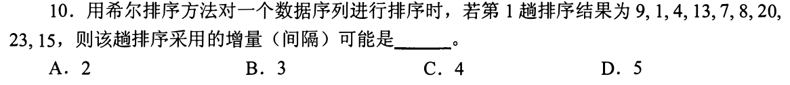

题给第一趟后 `9,1,4,13,7,8,20,23,15`。若间隔 3，分组按位置取出 `9,13,20`、`1,7,23`、`4,8,15`，每组已升序，故可能取 **3，选 B**。间隔 2 时偶数下标组里的 9、4 倒序；间隔 4 时 9、7 倒序；间隔 5 时 9、8 倒序，均不可能是该间隔的一整趟组内升序结果。

不要把第一趟后的整个数组强求有序

希尔排序的“趟”是在若干交错子序列里分别做插入排序；间隔大于 1 时相邻元素仍可能逆序。考场对四个候选间隔逐一只找一对同组逆序便能排除，不需要还原初始序列。第 18 题把这一判断倒过来：给初列和两趟结果，读出每次实际的跨距。

## 12｜2014-11：快排做完两趟，至少两个枢轴应在最终位

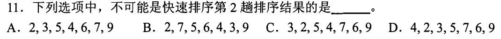

一趟划分结束，枢轴的左边不大于它、右边不小于它，它已占最终位置。第二趟至少又固定一位。C `3,2,5,4,7,6,9` 中，3 左无项但右有 2 更小，2 左有 3 更大，5 右有 4 更小，4 左有 5 更大，7 右有 6 更小，6 左有 7 更大；只有末位 9 满足全局左右约束，不可能已完成两趟，选 **C**。无需猜第一趟枢轴到底选谁。

怎样一分钟检查“某位能不能已经归位”

对候选值 v，只看左边是否有大于 v 的、右边是否有小于 v 的；任一出现，v 就不是某次划分后已固定的枢轴。A、B、D 至少能找出两位符合左右分隔（例如 B 的 2 与 9）；C 除 9 外每个相邻逆序对都把另一位卡在错误侧。这个判据只给“排除”的必要条件，不反推每一种可能的交换细节。

## 13｜2015-09：基数排序按位分配收集，每趟所有元素都移动

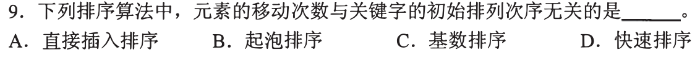

LSD 基数排序不通过关键字之间的大小比较确定顺序，而是每一位都把全部 n 个记录分配到桶，再按桶顺序收集。不管初列已升序、倒序还是乱序，给定最大位数的每趟仍处理每个记录，所以元素移动次数与初始排列无关，选 **C**。直接插入、冒泡、快排的移动或交换均会随初始次序或枢轴划分改变。

与 10 的“第二趟”关联

第 10 题按个位、十位稳定收集，两个过程都要遍历全部七个关键字，即使其中几个在本趟后仍留原位也执行分配收集。这里讨论标准基数排序的元素搬运操作；不同实现若为“已在原槽就不写”做特别优化，写入次数会受实现影响，但试题中的常规算法按每位全量处理。

## 14｜2015-10：删堆顶后，比较孩子与比较替补都要数

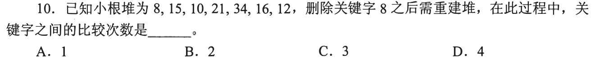

小根堆 `8,15,10,21,34,16,12` 删根 8，用末项 12 暂放根。两个孩子 15、10 先比较一次，选较小的 10；12 与 10 再比较一次，交换。现在 12 在原 10 的位置，下方只剩孩子 16，再比较一次发现 12≤16，停止。关键字间共 **3 次比较，选 C**。若只数交换一次，或漏掉“两个孩子先比大小”，都会少算。

第 07 题与此题方向正相反

插入新项从叶向根上浮，沿祖先链比较；删根用末项补位，从根向叶下沉。某层有两个孩子时先挑更小的孩子，再决定替补是否继续下降；只有一个孩子时仅比较替补与孩子。实际删后可得 `10,15,12,21,34,16`，它仍满足小根堆的每位父子约束。

## 15｜2015-11：希尔排序在每个间隔组内做直接插入

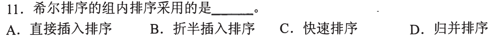

希尔排序先选一个间隔，把相隔该间隔的元素视为同组；每组内部按当前项找插入位置，并移动同组前面较大的项，这就是**直接插入排序**，选 **A**。前面 11 题已经按间隔 3 拆组，本题只追问每组怎样变有序。间隔逐步减到 1 时，最后一次就是对整列做插入整理。

为什么不能因组内有序就选归并

归并从两个已有序段合成更长连续有序段；希尔先将跨间隔位置构成的交错组分别插入调整，原数组相邻位置并未划成两段有序表。第 11 题的 `9,13,20` 在位置 0、3、6，正是这种交错组，按组内插入才与希尔的定义吻合。

## 16｜2017-10：选择归并而非插入，通常是为了大规模效率

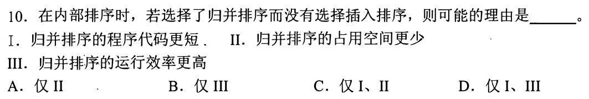

直接插入在一般或逆序输入需约 n² 次比较／移动，归并排序为 `O(n log n)`，对足够大的数据通常效率较高，III 对。代码“更短”不是固定性质；常规归并要辅助数组，额外空间比原地插入多，I、II 不能作为该选择的正当理由。故只 III，选 **B**。

“效率较高”须带输入规模和实现边界

小数组或近乎有序输入时，插入排序可能因常数小、移动少而更快；题目说“可能的理由”，不是宣称归并永远最快。若内存很紧，插入的 `O(1)` 额外空间甚至更有利。这里与第 20 题的算法选型相接：除了渐进时间，还应看规模、初态、存储与稳定性。

## 17｜2017-11：链表保存顺序，但跨距访问会变慢

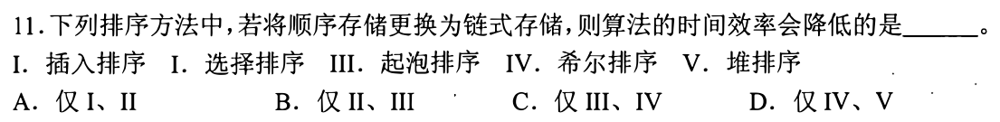

插入排序可沿链找到插入点并改链接，选择、冒泡也能顺序扫描，主要数量级仍与数组版同类；希尔需反复访问相隔某间隔的位置，堆需按编号迅速找到父结点与左右孩子，链表均难以直接取位次，时间效率会下降。只有 **IV、V，选 D**。要看算法操作需要“相邻扫描”还是“按下标跳跃”，不只看最终都能放在链表里。

与 0808-13 的随机访问需求共用一笔

有序静态链表虽然占据数组槽，若逻辑顺序依靠游标，取逻辑中点仍须沿链走；同理堆的第 i 位孩子 `2i`、`2i+1` 和希尔的 `i+d` 在普通链表上都不能常数时间定位。冒泡比较相邻结点，选择扫描未排序后段，直接插入插入当前结点，这些顺链动作可以完成。实现细节会影响常数，题目问的是算法常规时间效率。

## 18｜2018-10：从两趟结果反推希尔的间隔

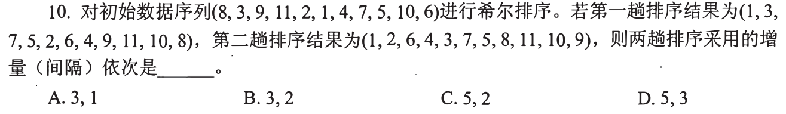

初列 `8,3,9,11,2,1,4,7,5,10,6`，首趟首项 8 被来自第六位的 1 替代；按间隔 5 取 `8,1,6`，组内排序为 `1,6,8`，同样对其他五个交错组处理，恰得题给首趟 `1,3,7,5,2,6,4,9,11,10,8`。再按间隔 3 取位置 0、3、6、9 的 `1,5,4,10`，组内成为 `1,4,5,10`，与第二趟对应位置一致。间隔依次 **5、3，选 D**。

只挑能区分选项的一组来核

候选首间隔有 3 或 5，首位从 8 变成 1，原 1 与 8 相隔五格，直接锁定 5。第二间隔在 1、2、3 中选：位置 3 的 5 变 4、位置 6 的 4 变 5，它们相隔 3，且 0、3、6、9 四项仍在同组，说明第二趟为 3。最后用一两组验证输出，不必抄完全部十一个位置的变动。

## 19｜2018-11：建大根堆，从最后一个非叶往上逐棵调整

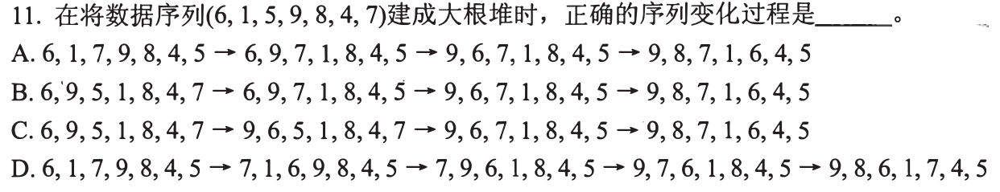

数组 `6,1,5,9,8,4,7` 的最后一个非叶是第 3 位 5，它与孩子 4、7 比较后换成 7，得 `6,1,7,9,8,4,5`；第 2 位 1 与 9、8 调整得 `6,9,7,1,8,4,5`；根 6 与 9 换，再与 8 换，最终 `9,8,7,1,6,4,5`。只有 **A** 完整列出这个自底向上的过程。不能从数组开头遇一处父子违例就随意调，那可能破坏尚未建好的子堆。

先子堆后父堆的必要性

把第 i 位向下调整前，必须保证它的左右孩子各自已经是堆；最后一个非叶向根倒序扫描正好满足这一点。第 3 位处理后是 `7` 接管两叶，第 2 位处理后是 `9` 接管 `1,8`，根最后在两个已有堆之上选较大孩子并向下沉。题目问“变化过程”，所以要检查每一步都对应当前处理的父位，而不能只看末行也是大根堆。

## 20｜2019-07：算法选型同时读规模、存储、稳定性与初态

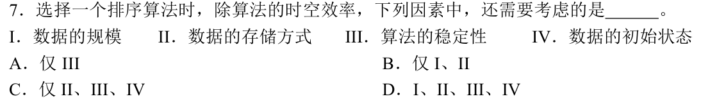

数据规模决定 `O(n²)` 与 `O(n log n)` 的成本差何时明显；存储方式决定能否高效随机访问或沿链修改；稳定性决定相同关键字的原有相对次序需不需要保留；初态影响插入排序、冒泡等在近乎有序时的工作量。四项都要考虑，选 **D**。此题是归纳之前具体题的选择维度，不要求先给四项排一个固定优先级。

把抽象维度接回真题

第 16 题比较规模与时间，第 17 题比较数组／链表，第 13 题显示基数每趟全量处理而插入／冒泡受初态影响；若数据附带次序意义，稳定性还会排除某些实现。考场保底不是默背“四个都对”，而是每项能举出一个改变选择的场景：大表、链表、同关键字有次序、近乎有序，分别对应 I、II、III、IV。

## 0810 当前进度

前 20 题已有讲解、折叠机制与速查；下方继续补 21—27。28—34 尚待处理，整节点并未完成。用户的独立会做与限时熟练状态也仍待实际作答证据。

<strong>21—27 题复做速查</strong>

| 题 | 第一笔 | 保底／答案 |
| --- | --- | --- |
| [21](#q21) | 找第一趟枢轴，再看左右两侧第二趟各自的枢轴 | D 无法同时照顾两个非空分区，D |
| [22](#q22) | 堆是完全树，根次大值在两个孩子之一 | I、II、IV，C |
| [23](#q23) | 近乎有序时数插入比较与选择的全表扫描 | 仅 I，A |
| [24](#q24) | 个位稳定分桶，找 372 的相邻值 | 前 301、后 892，C |
| [25](#q25) | 七项逐个追加并上浮 | `9,8,7,5,6,1,4`，B |
| [26](#q26) | 归并的“一路”指一个已排序输入段 | 两有序段合一，A |
| [27](#q27) | 逐项检查近乎有序、少量、空间、稳定 | 四者都可支持插入，D |

## 21｜2019-10：快排第二趟要同时处理第一趟留下的两块

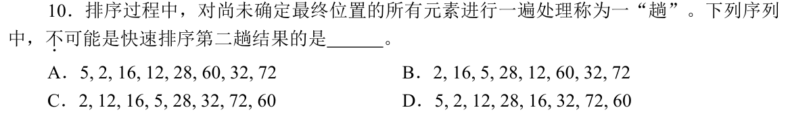

题目明确“一趟”是对**尚未确定最终位置的所有元素**处理一遍。第一趟若枢轴落在中间，第二趟左右两个非空分区都各要产生归位枢轴。D `5,2,12,28,16,32,72,60` 只有 12、32 在全局正确的分隔位置；若第一趟枢轴是 12，则右侧第二趟可让 32 归位，但左边 `5,2` 仍逆序，没处理完；若第一趟是 32，则左边 12 归位，右边 `72,60` 仍逆序。故 **D 不可能**。不能只看“两位已归位”就断言经历了两整趟。

怎样快速排除，又不偷换“趟”的定义

先圈候选枢轴：其左边全比它小、右边全比它大。D 只有 12 和 32 满足；两者都位于中间，因此第一趟一定分出两个非空块，第二趟不能只在其中一块见到变化。A、B、C 可由端点枢轴或两侧可归位的组合构造，题目只需一项不可能；如果题目改成“做了两次划分”，D 的判断条件会不同，故要先读清它自己定义的趟。

## 22｜2020-09：堆的形状、有序范围和根的次大值

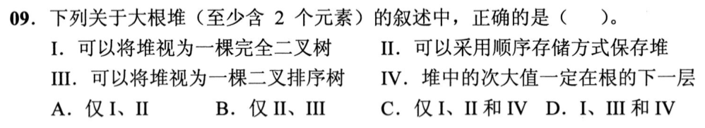

大根堆按完全二叉树的形状占位，可以用数组顺序存储，I、II 对。它只保证每个父结点不小于自己的孩子，不保证左子树所有值小于右子树，不是二叉排序树，III 错。根最大；除根外任何更深结点都不大于其父，因而次大值一定是根的两个孩子之一，IV 对。选 **C：I、II、IV**。

两层反例阻止把“堆有序”当“中序有序”

根 9，左右孩子 6、8，6 的孩子 5、1，8 的孩子 7、4，是合法大根堆；左支可能放 6、右支可能放 8，左右子树并没有二叉排序树的大小分界。次大值仍只能从 6 和 8 中选 8，因为更深位置都受其父的上界压住。第 01、07、14 题用过父子局部约束，今天把它提升到整棵树的性质判断。

## 23｜2020-11：近乎有序使插入少比较，选择仍要扫描

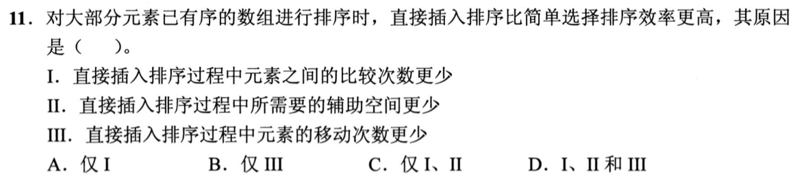

直接插入在前缀已有序且下一项多数已接近正确位置时，只需向前比较少数几次；简单选择每趟仍须扫描未排序的全部元素，找全局最小，比较次数基本由 n 决定，I 可解释效率差异。二者常规实现都只用常数额外空间，II 不能解释；选择排序至多作线性次数的交换，插入在局部乱序时虽也可少移动，却不能把“移动一定更少”作为本题的普遍原因。故 **仅 I，选 A**。

把上一题的“已知条件”真正用上

题干说“大部分已排序”，这对插入的定位特别有利：下一个元素往左走几步就停；选择仍需遍历后面所有候选，不能因前半部看着有序就跳过。若把问题改成“最坏元素移动次数”或“稳定性”，选型理由会另变；此题问的效率差与比较次数最直接相连。近乎有序只是给插入较好情形，不说明每一趟移动次数均少于选择。

## 24｜2021-10：LSD 第一趟只看个位，并在同桶保持原顺序

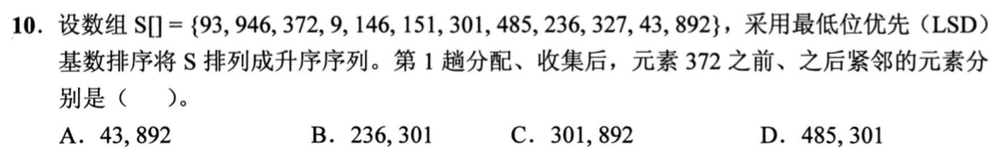

按个位分桶，个位 1 的 `151,301` 先出，个位 2 的 `372,892` 接着出；因此 372 前一位是 **301**，后一位是 **892**，选 **C**。不用把整列十二个三位数排成大小顺序，第一趟只决定个位；百位、十位还没参加。若把 93 与 43 的个位 3 拿来当 372 的邻居，就是把分桶键看错了。

怎样用最少工作保证相邻结论

只列比个位 2 小的最后一个桶（个位 1：151、301），以及个位 2 桶自身（372、892）。原序列中 372 先于 892，稳定收集保留它们的顺序；个位 0 的桶为空，个位 1 桶最后的 301 紧挨个位 2 桶第一项 372。这个局部桶检查承接 0810-10 的两趟 LSD，不必做完整三轮排序。

## 25｜2021-11：逐个建堆与一次自底向上建堆有不同中间态

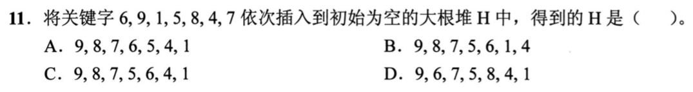

题目明说按 `6,9,1,5,8,4,7` **依次插入**空大根堆。插到 8 时，上浮过 6 得 `9,8,1,5,6`；插 4 后为 `9,8,4,5,6,1`；插 7 时先压过父 4，到第 3 位，最终 **`9,8,7,5,6,1,4`，选 B**。第 19 题给定全部七项后从最后非叶自底向上建堆，算法入口不同，不应直接借那题的中间数组。

第七项只走自己的父链

六项堆中第七位空出；7 放入第 7 位，其父为第 3 位的 4，交换；到第 3 位后父为根 9，7≤9 停止。第 2 位的 8、第 4 位的 5、第 5 位的 6 都不在上浮路径上，不能为追求“数组看起来更有序”而交换它们。选项中 A、C、D 的非路径位置因此可以快速核对。

## 26｜2022-10：二路归并的一路是一个已排好的输入段

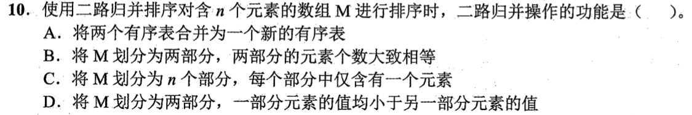

二路归并的核心操作是给出两段**各自有序**的输入，比较两段当前首项，把较小者接到结果，直到合成一段新的有序序列，所以选 **A**。B 只是把数组大致平分的递归准备；C 是初始长度为 1 的有序段状态；D 说两部分之间已经完全有序，那无需通过当前比较合并来决定交错次序。

“合并”时哪些条件已知、哪些还未知

若左段 `3,5`、右段 `6,7`，可以直接接；若右段 `4,8`，必须逐项比较 `3、4、5、8` 的交错。两个段内部有序才允许只看各自首项，段与段之间的相对大小未必已知。第 32 题会用这个操作逐次计关键字比较，不能把划分子数组或按大小分组误算成“一路归并”。

## 27｜2022-11：插入排序为何可能比快排更合题意

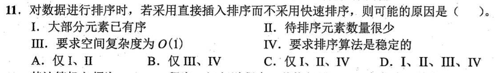

大量元素已有序时插入几乎无需左移；元素很少时它的简单循环与较小常数有利；直接插入只需 `O(1)` 额外空间；标准直接插入把相等键停在原有同键之后，保持稳定。I—IV 都可能成为选择它而不选常规快排的理由，选 **D**。这里问“可能原因”，不是说插入在任意大、任意乱的输入上都快于快排。

把四项作为四个不同约束

I 改善插入的实际比较移动；II 减弱 `O(n²)` 长期劣势并凸显常数；III 是原地辅助空间；IV 是相等关键字的原相对次序。快排平均时间有优势，但其常规实现并非稳定，递归也要额外栈空间。第 23 题只从“近乎有序时比较次数”解释快慢，本题在算法选择时再把规模、空间、稳定性加上，正好继承第 20 题的四维检查。

## 0810 当前进度

前 27 题讲解已完成；下方继续 28—34。已写材料仍须独立复做验证会解及限时速度。

<strong>28—34 题复做速查</strong>

| 题 | 第一笔 | 保底／答案 |
| --- | --- | --- |
| [28](#q28) | 看相等键是否跨组、跨枢轴或跨堆交换 | 希尔、快排、堆排不稳定，C |
| [29](#q29) | 枢轴左全小、右全大 | 只有 81 符合，D |
| [30](#q30) | 一趟划分只定枢轴及两块跨块次序 | P 与 Q 块间有序，A |
| [31](#q31) | 两次都“末项替根，向下调” | `20,19,15,5,8,12`，B |
| [32](#q32) | 先合 2+2 比两次，再与单项合比三次 | 总 5，C |
| [33](#q33) | 最坏情况下数搬移，而非比较 | 选择排序交换至多线性次，D |
| [34](#q34) | 首趟跨 3 位、次趟跨 2 位组内排序 | 希尔排序，A |

## 28｜2023-10：稳定性问相等关键字的先后是否保留

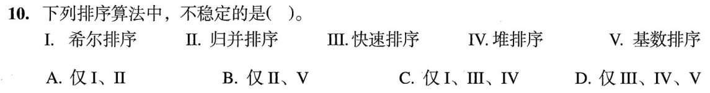

希尔排序分间隔组，相等键可能分处不同组而在后续位置关系反转；快排划分时交换跨过相等键；堆排把根与末端交换并下沉，也可能改变同键相对顺序。I、III、IV 不稳定，选 **C**。常规归并在相等时先取左段，LSD 基数在每个桶内保持先后，II、V 可稳定。这里不拿“最后数值都排对”判断稳定，要给相等项加先后标记。

用两个同值记录判据，而非死记算法表

把相等键标成 `5甲`、`5乙`，最终若乙跑到甲前面即不稳定。希尔各组插入本身可保持同组顺序，跨组移动却可改变两者全局次序；快排为枢轴左右划分进行远距交换，堆排的根尾互换也跨越中间记录。归并若相等时取左即可保持先后；基数每一位稳定分配收集，才可继承低位已经建立的顺序。题目按常规稳定实现判定，若特意修改归并在相等时先取右，稳定性也会丢失。

## 29｜2023-11：一次快排划分后，枢轴应在全局正确的位置

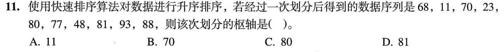

序列 `68,11,70,23,80,77,48,81,93,88` 中，只要候选是本次枢轴，它左边每项须小于它、右边每项须大于它。11 左有 68，70 右有 23，80 右有 77 和 48，均不合。81 左侧七项都小于 81，右侧 93、88 都大于 81，所以 **81，选 D**。无需恢复划分前的整列，也不要求两侧内部已经排序。

跨块有序不等于各块有序

81 左侧的 `68,11,70,23,80,77,48` 显然仍乱序，但这不妨碍枢轴 81 已定最终下标。此题与 30 同一界线：划分只给“左块整体在枢轴左，右块整体在右”，两侧后续仍需递归。保底法是找任一放错侧的元素否掉选项，例如 70 右侧的 23 一眼就够。

## 30｜2024-08：快排一趟保证 P、Q 块间有序

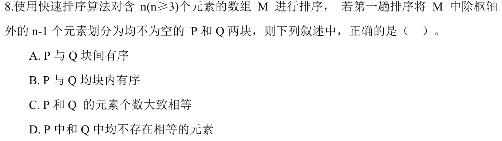

第一次划分以枢轴为界，P 的每项不大于枢轴、Q 的每项不小于枢轴，所以 P 的元素相对 Q **块间有序，选 A**。P、Q 各自内部未必排好，B 错；枢轴选取不一定接近中位，两块大小可严重不均，C 错；相同键可以落在枢轴两侧，题干也没有保证 P、Q 均不含相等元素，D 错。

用极端枢轴阻止“自动平分”的误解

若枢轴是当前最小值，P 可能为空；本题额外说 P、Q 均非空，只是排除了这个极端，并未强制各占约一半。若枢轴大致居中但两边各自仍乱序，A 仍成立、B 仍不成立。真实排序要继续递归，故 29 只检查跨枢轴分界，而不检查各块从左到右递增。

## 31｜2024-09：大根堆连续删两次，每次末项替根再下沉

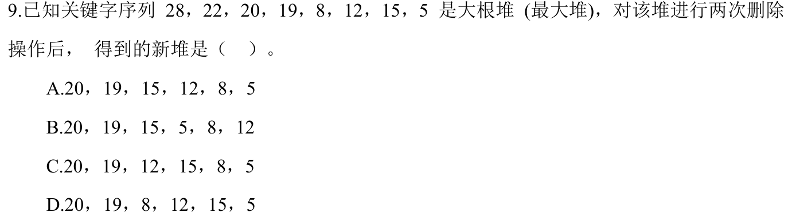

初堆 `28,22,20,19,8,12,15,5`。第一次删 28，末项 5 补根，先与 22 交换、再与 19 交换，剩 `22,19,20,5,8,12,15`。第二次删 22，末项 15 补根，与较大的孩子 20 交换，得到 **`20,19,15,5,8,12`，选 B**。两次删除之间的第七项 15 变成第二次的替补，不能从原堆直接跳算两步。

一行追踪每次的替补和路径

第一次 `5@根→5@位置2→5@位置4`，第二次 `15@根→15@位置3`。第 19 题从末尾非叶向上建堆，第 25 题逐项插入向上浮，此题则两次从根向下沉。三种操作都守父子约束，但工作起点与可改变的路径不同；选择题只要识别哪几位必须保持不变，就能排除乱动子树的选项。

## 32｜2024-10：两路归并按指定次序，一对当前首项算一次

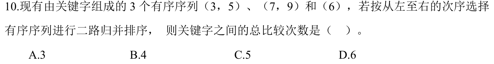

先归并 `(3,5)` 与 `(7,9)`：比 `3:7`、`5:7` 两次，左段耗尽，余下 7、9 直接接，得 `(3,5,7,9)`。再与 `(6)` 归并：比 `3:6`、`5:6`、`7:6` 三次，右段耗尽，余下 7、9 直接接。总共 **`2+3=5` 次，选 C**。题干规定从左到右的归并次序，不能改成先把 6 插到另一段来减少计算。

“一段耗尽就停止比较”的保底边界

合并时仅比较两段尚未取出的首项，选较小者输出；任一段空了，另一段本来有序，可以整段照抄。若把照抄 7、9 也算作关键字比较，会把两次归并都高估。第 26 题刚定义了“一路合并”是两条有序段到一条新段，本题正把该操作展开成五对实际比较。

## 33｜2025-10：最坏移动次数最少，先分开比较和搬移

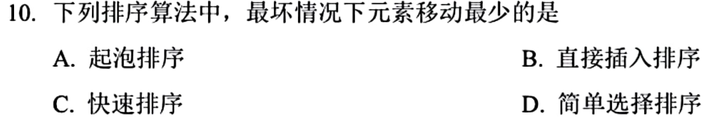

简单选择排序每趟扫描未排序段寻找最小值，可能比较很多次，但只在确定目标后进行至多一次交换；全部 n 趟的元素移动为线性数量。冒泡靠相邻交换，插入靠逐项后移，最坏均可达平方级；快排划分交换也可能大量移动。因此问**最坏情况下元素移动最少**，选 **D**。不能因选择排序比较为 `O(n²)` 就连同移动也记作 `O(n²)`。

一个逆序小例子足以看出“扫描≠移动”

选择每趟即使扫描十几个候选，扫描时只更新“当前最小项的位置”，不必把每个被比较项搬动；结束时交换目标与当前位置。冒泡逆序则每对相邻逆序项都要交换，插入要给较小的新项腾出许多格。第 0731-08 题已把定位与后续移动分开，这里再次用不同成本回答试题指定的那个量。

## 34｜2025-11：每趟让固定间隔的交错组分别变有序

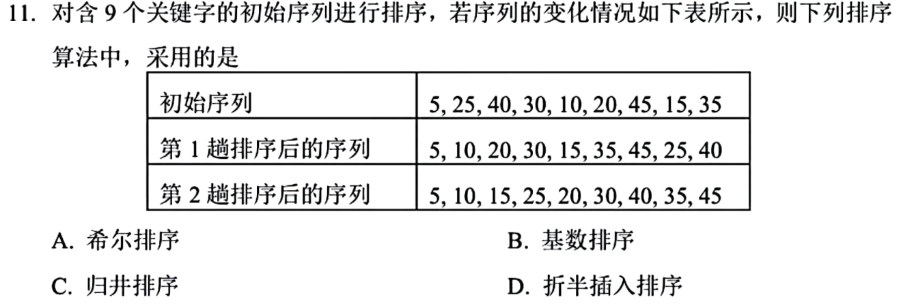

初列 `5,25,40,30,10,20,45,15,35`。第一趟按间隔 3 分组：位置 `1,4,7` 的 `25,10,15` 排成 `10,15,25`，位置 `2,5,8` 的 `40,20,35` 排成 `20,35,40`，恰合第一行结果。第二趟按间隔 2，再把偶数下标组 `5,20,15,45,40` 排为 `5,15,20,40,45` 等，得到题表第二行。这是 **希尔排序，选 A**。两趟后整列仍未完全有序，不能把“每趟都整理了一些项”误作归并结果。

找一组足以锁定间隔，再验证另一组

首趟 25 从第二位移到第八位，10 从第五位来到第二位，15 从第八位来到第五位，三者原位置相差 3，按一组插入才会这样移；其他组也按 3 整理。第二趟第二组跨 2 整理，输出行中 15、20 等位置吻合。第 11、18 题已从一趟状态反推希尔间隔，本题把同一动作迁到新的九项输入，作为复用检验。

## 0810 收束与下一题入口

34 题教学稿已覆盖；原图错位已在题单标注，CPU 跨线题按实际内容讲解。此处给出慢推演与速查两条阅读路径，但是否独立会做、换条件仍能解以及混合限时一两分钟稳定正确，仍须用户真实作答，不能由讲义长度推断。下一节点若转入计算机组成或其他能力线，只调用这批真正已教出的“状态推进、定位与移动分离、目标量辨别”，不把所有排序知识照搬过去。
