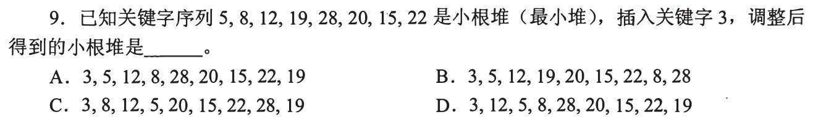
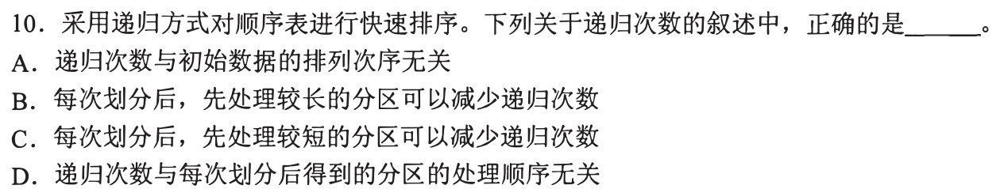
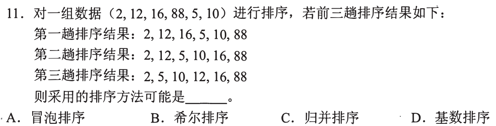
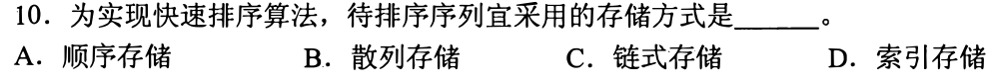
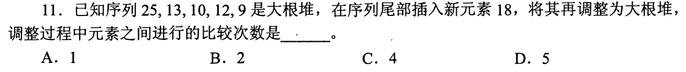
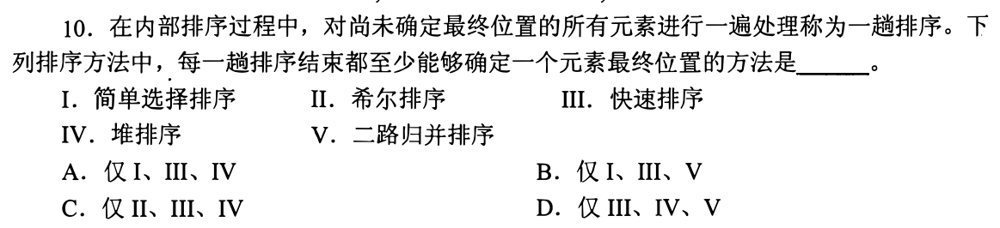
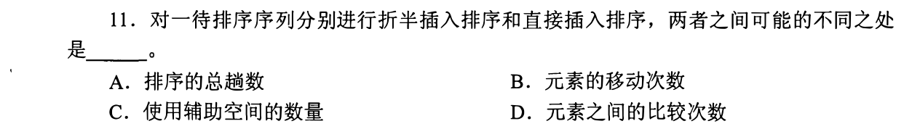
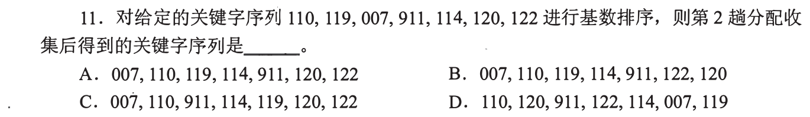

# 0810 Answer｜排序过程：前 10 题（共 34 题）

> [原题 34 题](0810.md) · [0808 的比较与存储](0808-answer.md) · [能力账本](answer-quality/learning-ledger.md)
>
> 本节点先完成 01—10；11—34 仍待逐题核对与编写。开始一趟排序前先问“这一趟处理完有什么已经确定”：堆是父子大小约束、冒泡把一端极值固定、选择把一端最小项固定、快速排序固定枢轴、归并使一个区间有序。2009 年第 10、11 题在原仓库裁图里错位，下文以图里**实际题号**为准。

<strong>前 10 题复做速查</strong>

| 题 | 十秒第一笔 | 保底／答案 |
| --- | --- | --- |
| [01](#q01) | 新 3 放末尾，沿父结点 19、8、5 上浮 | `3,5,12,8,28,20,15,22,19`，A |
| [02](#q02) | 第二趟后前 3 项 11、12、13 已有序 | 插入排序，B |
| [03](#q03) | 按真实第 11 题读“CPU 区分指令和数据” | 取指与取数的周期阶段，C；本题跨能力线 |
| [04](#q04) | 区分递归总调用数与调用栈深度 | 左右先后不改变总次数，D |
| [05](#q05) | 第一趟 88 到末端、第二趟 16 到倒数第二 | 冒泡排序，A |
| [06](#q06) | 快排要从两端便捷访问与交换 | 顺序存储，A |
| [07](#q07) | 18 加在数组第六位，对父 10 再对父 25 | 比较两次，B |
| [08](#q08) | 看每趟是否至少固定一个最终位置 | 选择、快排、堆排，A |
| [09](#q09) | 折半只改变定位，不改变后移 | 比较次数可能不同，D |
| [10](#q10) | LSD 先个位，再按十位稳定分组 | `007,110,911,114,119,120,122`，C |

首次看题先走可执行动作，再用速查提取；未有独立限时记录，不算已经熟练。

## 01｜2009-09：小根堆插入，新元素只沿自己的祖先上浮

原堆数组 `5,8,12,19,28,20,15,22`，先把 3 追加为第九位。它的父项依次是第 4 位的 19、第 2 位的 8、第 1 位的 5，逐一比较并交换，最终为 **`3,5,12,8,28,20,15,22,19`，选 A**。其他与插入路径无关的结点不应重排；堆只要求每个父不大于自己的孩子，并不要求整张数组升序。

只记录三次交换，比重建整棵树省事

数组从 1 编号，新项位置 9 的父位是 `⌊9/2⌋=4`，换 19；到位置 4 再与位置 2 的 8 换；到位置 2 与根 5 换。最后位置 1 是 3，原 5 落第 2 位、8 落第 4 位、19 落第 9 位。选项若动了 12、28、20、15、22 就可以直接排除。后面 2011-11 的大根堆题仍用“新项与父比较”，只是方向反过来。

## 02｜2009-10：第二趟的局部有序，先识别“前缀”

题给的第二趟结果是 `11,12,13,7,8,9,23,4,5`。直接插入排序每一趟把下一个元素插入已排好的前缀，第二趟后前三项可为 `11,12,13`，剩余部分暂时仍无序，选 **B**。选择排序前两位应是全局最小的 4、5；冒泡排序若从左到右，每趟把最大的项推到末尾，此结果尾部却是 4、5；二路归并第二趟处理后的各段也不符合这张图的局部状态。

“第二趟”不等于整个数组的第二次交换

插入排序的初始第一个元素可视为已排好，第一趟插第二个，第二趟插第三个，故只承诺前三项内部有序、不承诺前三项已经是全局最小。这一题的右侧仍有比 11 小的 4、5，恰恰挡住“选择排序已经固定最小前缀”的判断。考场依次查“前缀有序”“全局极值固定”“分段有序”，比逐项完整模拟更快。

## 03｜2009-11：题单跨入 CPU，按取指和取数的阶段判断

同一串二进制位本身没有“我是指令”或“我是数据”的标签。CPU 在指令周期的**取指阶段**把从程序计数器所指地址取出的位串送去译码；在执行阶段若需操作数，则把相应地址读出的位串当数据使用。区分依据是 **指令周期的不同阶段，选 C**。译码结果是在已当作指令取入后才产生；寻址方式或存储单元位置也不能单独给位串贴永久身份。

为何保留这道离题的题，而不硬接排序概念

原题实际第 11 题确实属于计算机组成原理，题单却将它列入排序能力线。第一次答题时照题意解，后续整理节点可把它归入组成原理的能力线或标为跨线复现；不能为了让当前章节整齐，把 CPU 题讲成排序或干脆漏掉。最低保底是先问“这一次内存读取由哪一阶段发起”，而不是通过 bit 长相猜用途。

## 04｜2010-10：先处理哪侧，不改变快排的递归总调用次数

一次划分把枢轴放到最终位置，左右两侧仍须分别处理。无论先处理左侧还是右侧，待排序的子区间没有变，标准快排会对相同的非空子区间发起递归，因此**递归总次数与处理顺序无关，选 D**。处理较短一侧优先可能影响调用栈峰值，但不能据此声称递归调用的总次数减少。

为什么 C 看起来合理，却答错题问的量

若额外改写算法，让较短一侧递归、较长一侧留给当前调用循环，确实可以把最深调用栈控制在 `O(log n)`；但那引入了**用循环代替一次递归**的新操作，题目并未这样改写。原题只交换两个分区的处理先后，左、右仍各处理一次，递归总调用次数不变。初始数据可能影响划分是否均匀和递归树形，A 的“与排列次序无关”也太强。先圈题问的是“次数”还是“同时在栈里的层数”，便能拦住 C 的诱惑。

## 05｜2010-11：冒泡每趟把右侧一个极值送到最终位

初列 `2,12,16,88,5,10`。第一趟从左到右比较交换相邻逆序项，88 一直被推到尾，得 `2,12,16,5,10,88`；第二趟把余下最大值 16 推到倒数第二位，得 `2,12,5,10,16,88`；第三趟把 12 推到再前一位，得 `2,5,10,12,16,88`。三张状态正合 **冒泡排序，选 A**。题目“可能”不用证明其他算法在任何实现下都不可能，只须抓稳定的一端极值推进并核对三趟。

为什么不能只看最后一行有序

任何正确排序最终都会得到 `2,5,10,12,16,88`。关键证据在过渡：第一趟 88 从原中间跑到末尾，但前面仍有 12、16 在 5、10 之前，说明这一趟没有全局整理前缀；第二趟 16 紧挨 88，恰是“每趟固定尾端一位”的不变量。拿这条不变量去比选项，比记某个算法的每一条交换代码更可迁移。

## 06｜2011-10：快速排序需要有效地定位和交换两端元素

快排在一个待划分区间里频繁按位置读写、交换元素，还要递归处理两段下标范围。顺序存储让第 i 个元素能直接按下标访问，最适合这套划分过程，选 **A**。链式存储或散列存储虽然也能放元素，但不提供相同的按区间两端直接访问能力；索引存储在这里又增加不必要的间接访问。

承接 0808-13 的“能按下标摸到中间”

折半查找要直接取中项，快排划分要不断读左右两端并交换：两者虽目标不同，都依赖按位次快速访问。链表可另设计专门的划分操作，但题目问“为实现快速排序算法，待排序序列宜采用什么存储方式”，应匹配常规原地数组划分的需求，不因链表也能抽象存序列就选链式。

## 07｜2011-11：大根堆插入 18，比较到遇见更大的父结点为止

原堆 `25,13,10,12,9`，末尾追加 18 到第 6 位。它先与父结点第 3 位的 10 比较，18 更大，交换；现在 18 在第 3 位，再与根 25 比较，18 不大于 25，停止。元素间实际进行了 **2 次比较，选 B**。这里的比较次数包括最后那次确定“不用再上浮”的比较，不能只数发生交换的次数。

与 01 的三层上浮只有大小方向不同

小根堆新项更小才上浮；大根堆新项更大才上浮。由尾部位置 6 的父位 `⌊6/2⌋=3`，再由位置 3 的父位 1，恰好两次；原数组其他结点不参与。末尾 18 上浮后的数组是 `25,13,18,12,9,10`，仍满足父不小于孩子。若只算交换一次，会误选 A。

## 08｜2012-10：一趟后至少固定一个“最终位置”的三种排序

简单选择每趟把当前最小值放到未排序段前端；快速排序一趟划分把枢轴放到最终位置；堆排序每趟把根部极值换到未排序段末端并收缩边界。I、III、IV 都符合，选 **A**。希尔排序一趟只在某个步长的子序列里整理，归并一趟使局部段有序，都不能保证某个具体元素已占全局最终位。

“局部有序”与“最终位”差在哪里

第 02 题的插入排序前缀有序，但右边还藏着 4、5，前缀里的 11 尚不在最终下标。归并后某一段内部也可有序，却可能整体还要与另一段合并而移动；希尔分组还要缩小间隔继续处理。相反选择、快排枢轴、堆排尾项各有一位被证明以后不会再动。识别这种不变量，可以迅速排除两项。

## 09｜2012-11：折半插入少比较，元素后移却仍须执行

直接插入排序逐个比较找插入位置；折半插入利用当前已有序的前缀，按中点确定插入位置，可能减少元素间**比较次数，选 D**。但在数组中腾出同一个插入槽时，后面的元素仍需向后移动同样的格数。若把折半定位等同于能跳过移动，就把“找位置”和“搬元素”混成一步。

四项逐个问“定位”还是“搬移”

两者都逐个插入待排元素，趟数相同；常规原地顺序表实现只需一个临时元素，额外空间也同阶。折半查找改变每趟确定插入位置所需的关键字比较，D 不同；在同一稳定插入规则下，最终插入位置相同，后移的元素范围也相同，B 不因改成折半定位而减少。这里的关键是把时间拆成“查到位置”与“搬到位置”两段，承接 0731-08 的动作。

## 10｜2013-11：基数排序第二趟按十位稳定收集

最低位优先的基数排序先看个位：`110,120,911,122,114,007,119`。第二趟看十位，按十位从小到大分桶，同时在同桶保留上一趟已有的顺序：`007` 的十位 0；`110,911,114,119` 的十位 1；`120,122` 的十位 2。得 **`007,110,911,114,119,120,122`，选 C**。位数相同的 `007` 须保留前导零作为三位关键字。

若把第二趟误当完整数值排序会怎样

第二趟只保证十位优先、个位作为同桶的次序，百位还没有分配，因而 `911` 仍排在 `114` 前面（两者十位同为 1，个位 1＜4），并未得到完整数值升序。第一次按个位稳定收集，再按十位稳定收集，逐层继承已有低位次序；写两个短桶比反复比较完整三位数更快。

## 这一批怎样由慢演算压成考场动作

看到“第几趟”先问该算法每趟固定的是一个极值、一个枢轴，还是只产生局部有序；看到堆插入只追新元素的祖先；看到基数排序只按当前位稳定分桶。原题裁图有错位与一题跨学科，做题时必须先核对印在图中的题号。11—34 题仍待完成，本批不能当作整个 0810 节点已经通关；已讲的前十题也仍无独立限时证据。
