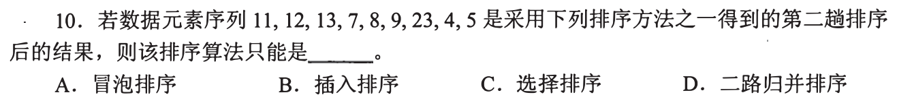
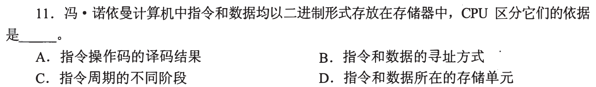

[← 0809](0809.md) · [总索引](README.md) · [0811 →](0811.md)

# 0810｜排序过程：一趟以后什么已经确定

> [34 题完整讲解与考场速查](0810-answer.md)

> 能力线 `11-sort` · 第 11/40 个节点 · 34 道真题引用
>
> [闭卷复盘](../review/main.md#r0810)

## 故事梗概

排序算法的名称很多，真题反复追问的是一次操作改变了哪些相对位置、哪些元素已经到达最终位置，以及初始状态和存储方式怎样改变代价。

这里的日期是链表节点，不是完成期限；是否前进，由这条能力线能否从题干恢复决定。

## 题单

### 01 · 2009-09

### 02 · 2009-10

### 03 · 2009-11

> 本题研究 CPU 区分指令与数据，是本节点中的跨能力线复现；按自身题意作答。

### 04 · 2010-10

### 05 · 2010-11

### 06 · 2011-10

### 07 · 2011-11

### 08 · 2012-10

### 09 · 2012-11

### 10 · 2013-11

### 11 · 2014-10

### 12 · 2014-11

### 13 · 2015-09

### 14 · 2015-10

### 15 · 2015-11

### 16 · 2017-10

### 17 · 2017-11

### 18 · 2018-10

### 19 · 2018-11

### 20 · 2019-07

### 21 · 2019-10

### 22 · 2020-09

### 23 · 2020-11

### 24 · 2021-10

### 25 · 2021-11

### 26 · 2022-10

### 27 · 2022-11

### 28 · 2023-10

### 29 · 2023-11

### 30 · 2024-08

### 31 · 2024-09

### 32 · 2024-10

### 33 · 2025-10

### 34 · 2025-11

[← 0809](0809.md) · [总索引](README.md) · [0811 →](0811.md)

