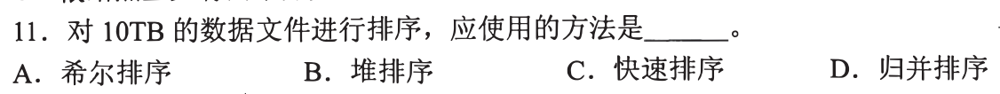
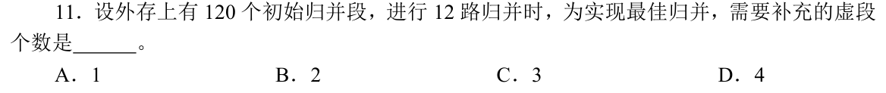
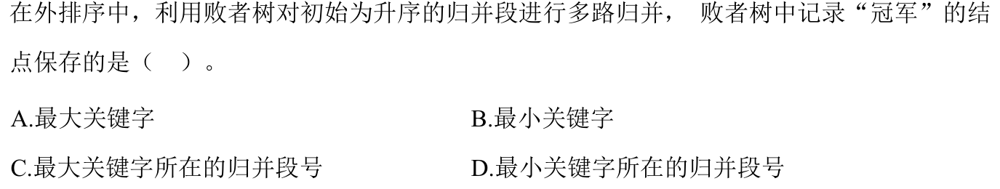

[« 0810-answer](0810-answer.md)　　[0812-answer »](0812-answer.md)

# 0811 Answer｜外存归并：数据放不进内存时

> [原题 3 题](0811.md) · [0810 的两路归并](0810-answer.md#q26) · [能力账本](answer-quality/learning-ledger.md)
>
> 0810 的归并操作假定每个输入段已有序；这里换成 10TB 文件或许多外存段，第一笔要把“内存里能排多少”和“磁盘上还要合并几趟”分开。三题分别考方法选择、多路归并的树形补齐、以及下一条记录来自哪个输入段。

<strong>三题考场速查</strong>

| 题 | 第一笔 | 保底／答案 |
| --- | --- | --- |
| [01](#q01) | 10TB 不能整体常驻内存，先分批排成有序段 | 外存归并，D |
| [02](#q02) | 满 12 路树叶数满足 `(n−1)%11=0` | 120 补 2 个零长虚段，B |
| [03](#q03) | 冠军需告诉系统取哪个归并段的当前首项 | 最小键所在归并段号，D |

复做先遮答案；这一页讲解完成不等于已有独立限时成绩。

## 01｜2016-11：10TB 文件先分段内排，再逐趟外归并

题干给 **10TB 的数据文件**，决定性信息是整个文件远大于通常可同时放入内存的工作区。先分批把能装入内存的部分各自排好，写回磁盘成为初始有序段，再反复把多个有序段合成更长的有序段。因此四项中应选 **归并排序，D**。希尔、堆、快排都可以在内存中处理局部批次，但仅凭它们的原地操作不能直接完成跨全部外存段的整体有序结果。

为何“10TB”不是让你比较四种内排的大 O

如果内存只容纳其中一小批，随机在 10TB 文件各处交换和递归划分会产生大量磁盘读写；外排更关心读写能否按大块顺序进行、需要几趟扫描。每个初始段内可用快排等算法，外层仍要把各段归并。0810-26 已教“两条有序输入段合成一条”，本题把输入段放到外存，要求先生成段、再合并段。

## 02｜2019-11：12 路最佳归并，补虚段使叶数符合满分叉树

12 路归并的每个完整合并结点最多接 12 个输入段。为按最优归并树的满分叉结构组织 120 个初始段，叶子总数 N 需满足 **`(N−1)` 是 `12−1=11` 的倍数**：`120−1=119`，除以 11 余 9，还差 2，故补 **2 个虚段，选 B**。虚段没有真实数据，只是补足初次合并的路数，不增加文件排序内容。

为什么公式是 N−1，而不是 N 本身整除 12

从一片叶开始，每增加一个 12 叉内部结点，相比被它替换的一个位置，净增 `12−1=11` 片叶。因此满树有 `N=1+11I`。120 片叶不是这种形式，最近的不小于 120 的是 122（`122−1=121=11×11`），所以加 2。若机械地把 120 除以 12 得整数 10，就会误以为不用补；那只检查了第一层分组，没检查后续合并树是否也能保持满分叉。

## 03｜2024-11：败者树的冠军标记最小值来自哪个归并段

多路归并时每个输入段拿出当前首项参加比较，最小项应当输出。败者树的内部位置保留每场比较的失败者，而最上方的冠军需要让归并程序知道**哪个段**赢了，好从该段取出首项并读入它的下一项。故冠军记录 **最小关键字所在的归并段号，选 D**。只记“最小关键字”而不记来源，会失去随后更新哪一路的定位信息。

为什么不是最大值、也不是最小值本身

假设三段首项分别为 `(段0:3, 段1:5, 段2:7)`，冠军索引为 0；输出 3 后，只从段0补下一个首项，段1、2 的当前值和比较路径不必重建。若索引改成“最大值所在段号”，输出的就不是全局最小项；若只给数字 3，实际实现仍需另找它在哪一路才能推进。某些实现把关键字缓存在叶结点、在树结点存段号，正好支持沿一条路径更新。这一题关心的是来源位置，延续 0801 对“值与地址／位置”分开的动作。

## 收束

先分段、再多路归并，补虚段解决树形，败者树的冠军段号决定下一次从哪一路取数。这三步解释了大文件为什么能在有限内存中逐批完成排序。真正能否限时做对，仍由遮住讲解后的独立题与相邻变式验证。
