[« 0811-answer](0811-answer.md)　　[0813-answer »](0813-answer.md)

# 0812 Answer｜位模式的解释权

> [原题 29 题](0812.md) · [上一节点](0811-answer.md) · [能力账本](answer-quality/learning-ledger.md)

**进入本篇时已有**：十六进制与二进制互换；顺序存储地址 = 首址 + 偏移 × 单元大小（0801-08）；写变量轨迹（0731）。
**读完新增**：01 值→机器数（负数 `2ⁿ−|值|`）· 02 浮点加法四步与双符号阶码溢出 · 03 float/double 有效位有限 · 04 IEEE 单精度三段 · 05 扩宽＝按原值重写 · 06 阶码全 1 被保留 · 07 小端＋对齐（题问两件事）· 08 反向译码 · 09 同号浮点比阶码 · 10 补码极值构造 · 11 各步骤能触发的溢出 · 12–13 复用 · 14 阶码全 0 被保留 · 15 复用 · 16 同宽重解释 · 17 大端末字节＋基址寻址一句 · 18 一个机器数两种类型 · 19 成员起点＋字节偏移 · 20 有限二进制小数判据 · 21 补码范围 · 22 小于 1 的负指数编码 · 23 十六进制手算补码 · 24 非规格化 · 25 窄化取低位 · 26 范围与间隔分开 · 27 有符号→无符号 · 28 复用 · 29 结构体总长为对齐倍数。

<details><summary>本篇速览（起手 · 最易错 → 先看什么）</summary>

| # | 新增台阶 | 起手 | 最易错 → 先看什么 |
|---|---|---|---|
| [01](#q01) | 值→按目标位宽写机器数 | `2¹⁶−9`；`127−9` | y 只看 FFF9/FFF7 一个就收工 → 先查 y，再查 z |
| [02](#q02) | 双符号阶码判溢出 | 尾数写成 `00.11101` 对阶相加 | 尾数规格化就当结果合法 → 再查阶码符号位 |
| [03](#q03) | 有效位 24/53 | 每式画中间类型链 | 以为 double 总能找回 → 大数＋小数先吞没 |
| [04](#q04) | 单精度三段 | `8.25=1000.01₂` 左移到 `1.xxx×2ⁿ` | 把隐含的 1 写进尾数 → 尾数从小数点后第一位起 |
| [05](#q05) | 按原值扩宽 | `65530=2¹⁶−6` | 看低 16 位 FFFA 就补 F → 先看原类型 |
| [06](#q06) | 阶码 255 保留 | 阶码取 254，尾数全 1 | 用阶码 255 → 它不是普通指数 |
| [07](#q07) | 小端＋对齐 | 把 273 写成 4 个字节 | 4+1 直接接 c → 先看 c 需要偶地址 |
| [08](#q08) | 十六进制→三段 | `C6400000` 写成位串 | 选项都是正数仍硬选 → 先看最高位 |
| [09](#q09) | 同号比阶码 | 两数各拆出阶码 | 阶码大就数大 → 先看符号 |
| [10](#q10) | 补码极值构造 | 先放 `1000 0000`，再放两个 1 | 把 1 放高位 → 低位权重小 |
| [11](#q11) | 步骤与溢出对应 | 逐句问：改的是尾数还是阶码 | 把尾数暂时越界当最终溢出 → 看右规后阶码 |
| [12](#q12) | 复用 07 | 列 8 个字节的地址表 | 从左数第 7 个 → 小端先放最低字节 |
| [13](#q13) | 机器数→值 | `2³²−FFFFFFDF` | 把 0x41 读成 41 → 十六进制 41＝65 |
| [14](#q14) | 阶码 0 被保留 | 写 `规格化 ⇒ 阶码≥1` | 选最小的 2⁻¹⁴⁹ → 看“规格化” |
| [15](#q15) | 复用 07 | 对比两条指令的字节 | 整条指令倒序 → 只有立即数是小端字段 |
| [16](#q16) | 同宽重解释 | 写 FFFF 的位权 | 当成 -65535 → 16 位装不下 |
| [17](#q17) | 先 EA 再字节序 | `FF12` 还原成 −238 | FF12 当正数 → 题面写“补码” |
| [18](#q18) | 一个机器数两种读法 | 写两栏：按 int / 按 float | 按无符号读 → 题设 int 是补码 |
| [19](#q19) | 成员起点＋字节偏移 | 先排 x1、填充、x2 | 在结构体首址上直接加字节 → 先求 x2 起点 |
| [20](#q20) | 二进制有限小数判据 | 把选项写成最简分数 | 十进制短就当有限 → 看分母含不含 5 |
| [21](#q21) | 补码范围 | 数位串总数 | 两端对称 → 零占一个非负编码 |
| [22](#q22) | 负指数编码 | `0.4375=0.0111₂` | 偏置用错 → 指数 −2 要加 127 |
| [23](#q23) | 十六进制补码 | `FFFF−1FFE+1` | 少 +1 → 回算 `E002+1FFE` |
| [24](#q24) | 非规格化译码 | 阶码 0 ⇒ 隐含 0、指数 −126 | 套 `1.xx` → 先看阶码是否全 0 |
| [25](#q25) | 窄化取低位 | `32777=0x8009` | 取负号 → 看第 15 位 |
| [26](#q26) | 范围与间隔 | 找 `2²⁴+1` | “指数够大”就够 → 先问每个整数能否表示 |
| [27](#q27) | 有符号→无符号 | `−32767+2³²` | 零扩展 8001 → 先按原值 |
| [28](#q28) | 复用 08 | 位串拆三段 | 漏隐含 1 → 规格化数补 1 |
| [29](#q29) | 总长是对齐倍数 | 排成员偏移表 | 4+10+4=18 → 填充 |

**跨题信号**：先看最高位和类型（08/09/18）· 目标位宽决定位串写法（01/05/23/25/27）· 阶码全 0/全 1 是特殊域（06/14/24）· 小端先放最低字节，地址先求起点再加字节偏移（07/12/19/29）· 题面限制词（规格化、可能、精确）决定走哪条规则（14/18/20/26）。
</details>

<a id="q01"></a>
## 01｜2009-12：机器数＝值按目标位宽写出的位串

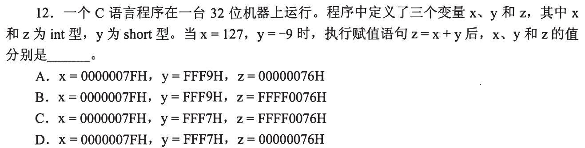

**新增**：机器数按变量自己的位宽写；负数用 `2ⁿ−|值|`。
**起手 → 答案**：`y=−9` 是 16 位：`65536−9=65527=FFF7H`；`z=127−9=118=76H`，z 是 32 位 → `00000076H`。**D**

| 项 | y | z | 与题面 |
| --- | --- | --- | --- |
| A | `FFF9`＝65529＝`2¹⁶−7`，是 −7 | `00000076` | y 不是 −9 |
| B | `FFF9` | `FFFF0076`＝`2³²−65418`，是 −65418 | y、z 都不对 |
| C | `FFF7` | `FFFF0076` | z 不是 118 |
| D | `FFF7` | `00000076` | 符合 |

x 四项都是 `0000007F`（127＝7×16＋15），不能区分。运算只看值：`127+(−9)=118`，不需要先写出 y 的 32 位形式。

<a id="q02"></a>
## 02｜2009-13：浮点加法四步，最后查阶码

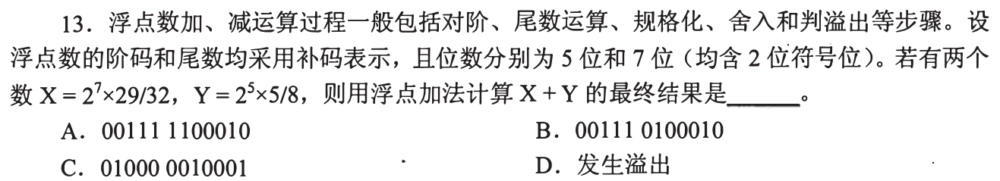

**新增**：对阶（小阶向大阶）→ 尾数相加 → 右规 → 查阶码溢出。这是同一个流程里的四个动作，本题只多出一个判断：双符号位 `01`/`10` 表示溢出。
**起手 → 答案**：把两数写成 `2^阶码 × 00.xxxxx`，对阶后相加 → **D**

读法：尾数 7 位＝2 符号位＋5 位小数；阶码 5 位＝2 符号位＋3 位数值，`00xxx` 才合法（0～7），`01000` 是正溢出。题面写明“均含 2 位符号位”，我据此用双符号读法；若把 5 位当不带溢出检测的普通补码，8 合法，结果会落在 C。

```
X = 2^7 × 00.11101        (29/32)
Y = 2^5 × 00.10100        (5/8)
对阶 Y → 2^7：  00.00101   右移 2 位，无位丢失
相加： 00.11101 + 00.00101 = 01.00010   符号位 01 → 尾数溢出
右规： 00.10001，阶码 7+1 = 8 = 01000   符号位 01 → 阶码溢出
```
验算：`116+20=136=2⁸×17/32`。

| 项 | 内容 | 与流程 |
| --- | --- | --- |
| A `00111 1100010` | 尾数 `11.00010`，符号位 11＝负 | 两个正数相加得负，不可能 |
| B `00111 0100010` | 尾数 `01.00010` | 正是相加后未右规的结果，尾数还在溢出态 |
| C `01000 0010001` | 尾数 `00.10001` 正确 | 阶码 `01000` 符号位 01，不是合法阶码 |
| D 溢出 | | 右规后阶码 8 超出 7 |

> 信号：尾数对了、阶码位串长得合理时，仍要看阶码两个符号位是否相同。

<a id="q03"></a>
## 03｜2010-14：有效位有限——哪一步会丢

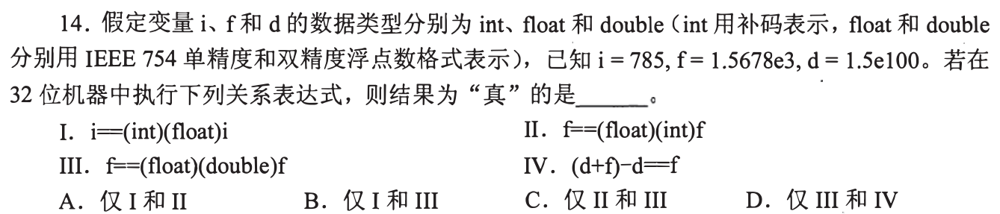

**新增**：float 有效数字最多 24 位二进制，double 53 位（本题先当事实用，来由见 04）；丢精度只发生在“位数不够”或“取整/对阶丢位”。
**起手 → 答案**：每式画中间类型链并问“这一步会不会丢”→ **B（仅 I、III）**

| 式 | 链 | 判断 |
| --- | --- | --- |
| I `i==(int)(float)i` | 785＝`1100010001₂` 共 10 位 ≤ 24 | 无损，真 |
| II `f==(float)(int)f` | `(int)f=1567`，丢掉 .8 | `1567.0≠1567.8`，假 |
| III `f==(float)(double)f` | float→double 53≥24 位 | 无损，真 |
| IV `(d+f)-d==f` | d≈2³³²，double 相邻数间隔 2²⁸⁰；f≈2¹⁰·⁶ | 对阶（02）时 f 右移后全丢，`d+f==d`，差 0≠f，假 |

IV 的信号：大数±小数±大数，先看小数在第一步加法里是否被对阶吞掉；double 精度高也只是把“吞没”的门槛抬高，d=1.5×10¹⁰⁰ 与 f 差的数量级远超 53 位。

<a id="q04"></a>
## 04｜2011-13：单精度三段字段

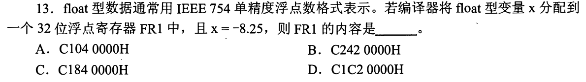

**新增**：单精度 32 位＝符号 1｜阶码 8（真指数＋127）｜尾数 23（只存小数点后，规格化数的前导 1 不存）。
**起手 → 答案**：`8.25=1000.01₂=1.00001₂×2³` → **A `C1040000H`**

```
符号 1
阶码 3+127=130 = 10000010
尾数 00001 后补 0   = 000 0100 0000 ... 0
1 | 10000010 | 00001000000000000000000
重新四位一组： 1100 0001 0000 0100 0000 ... = C1 04 00 00
```
选项只需看阶码段（高位十六进制拼出来）：B `C242…` 的阶码位串为 `10000100`＝132，C `C184…`、D `C1C2…` 都是 `10000011`＝131，而本题需要 130。三项在阶码上就排除，不必解码出数值。

<a id="q05"></a>
## 05｜2012-13：扩宽＝在更宽位数上写同一个值

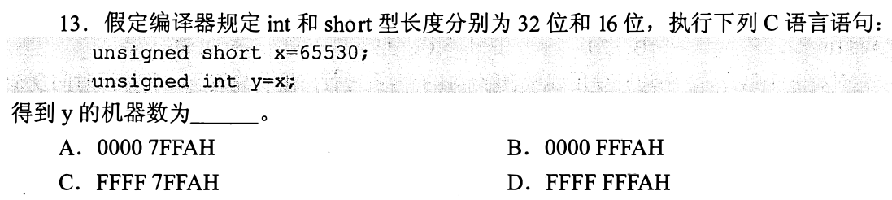

**新增**：扩宽不是“补位”，而是新位宽下写出**原来的值**；`unsigned` 值非负，所以只能补 0。
**起手 → 答案**：`65530=2¹⁶−6=FFFAH` → 32 位写 `0000FFFAH`。**B**

- A、C 的低 16 位是 `7FFA`，已经不是 `FFFA`（`7FFA=32762`）。
- D `FFFFFFFA` 的值是 `2³²−6`，不是 65530。
- 01 的 y 是负数，扩宽后高位是 1；这里值为正，高位只能是 0。

<a id="q06"></a>
## 06｜2012-14：阶码全 1 留给特殊值

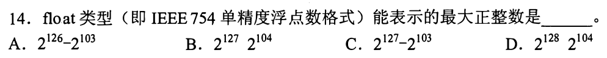

**新增**：单精度阶码 `11111111` 保留（无穷、NaN），最大有限数用阶码 `11111110`＝254，真指数 127。
**起手 → 答案**：尾数全 1，有效数 `2−2⁻²³` → `(2−2⁻²³)×2¹²⁷=2¹²⁸−2¹⁰⁴`。**D**

读法：图上 B、D 的运算符缺失，按 A、C 的格式读作减号。

| 项 | 化为 `(2−2⁻ᵏ)×2ᵉ` | 比较 |
| --- | --- | --- |
| A `2¹²⁶−2¹⁰³` | e=125 | 小于 2¹²⁷ |
| B `2¹²⁷−2¹⁰⁴` | e=126，k=22 | 小于 2¹²⁷ |
| C `2¹²⁷−2¹⁰³` | e=126，k=23 | 小于 2¹²⁷ |
| D `2¹²⁸−2¹⁰⁴` | e=127，k=23 | 大于 2¹²⁷ |

阶码 254 能取到 e=127，所以存在大于 2¹²⁷ 的有限数，只有 D 满足。它也是整数：最低有效位在 2¹⁰⁴。

<a id="q07"></a>
## 07｜2012-15：小端管内容，对齐管地址

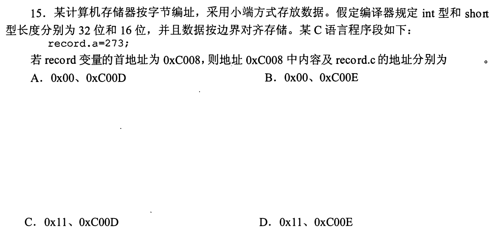

**新增**：本题问两件事，各有一个小台阶：① 小端＝最低有效字节放最低地址；② 对齐＝n 字节成员的起始地址是 n 的倍数。
**起手 → 答案**：

```
273 = 0x00000111 → 字节（高→低）00 00 01 11
小端自 C008：  C008:11  C009:01  C00A:00  C00B:00
b(char)       C00C
c(short,2B)   C00D 是奇数，空；c 起于 C00E
```
首字节 `0x11`，c 在 `0xC00E`，**D**。

| 项 | 内容 | 地址 |
| --- | --- | --- |
| A | `00` 是大端的首字节 ✗ | `C00D` 奇数 ✗ |
| B | `00` ✗ | `C00E` ✓ |
| C | `11` ✓ | `C00D` ✗ |

<a id="q08"></a>
## 08｜2013-13：十六进制反向译码

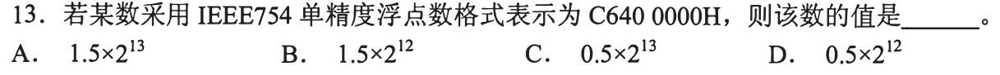

**新增**：04 的反方向：十六进制 → 位串 → 三段 → 值。
**起手**：`C6400000` → `1100 0110 0100 0000 …` → `1 | 10001100 | 1000…`

```
符号 1            → 负
阶码 10001100=140 → 真指数 13
尾数 .1           → 1.1₂ = 1.5
值 = −1.5×2¹³ = −12288
```
**题面问题**：图上四个选项都没有负号（A `1.5×2¹³`、B `1.5×2¹²`、C `0.5×2¹³`、D `0.5×2¹²`），与最高位 1 矛盾。可核对的是：只有 A 的数值部分等于 1.5×2¹³；B 指数 12，C、D 的尾数 0.5 不可能来自规格化的 `1.1`。我不替出题人补符号，也不据此指定字母。

<a id="q09"></a>
## 09｜2014-14：同号比阶码，负数反向

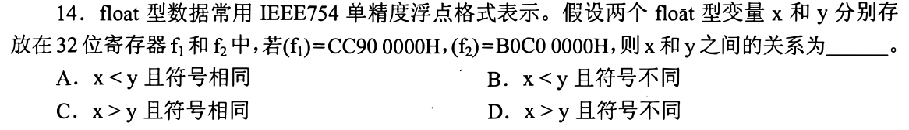

**新增**：符号相同时，规格化浮点数按阶码比较绝对值大小；负数时大小关系反过来。
**起手**：两数写位串，取高 9 位。

```
CC90 0000 = 1 | 10011001 | …   阶码 153
B0C0 0000 = 1 | 01100001 | …   阶码  97
```
符号都是 1 → “符号不同”的 B、D 排除。x 的阶码大 → |x| 更大 → 两个负数里 x 更小 → **A（x<y 且符号相同）**。C 的 x>y 与此相反。

校验：x≈−7.5×10⁷，y≈−1.4×10⁻⁹。

<a id="q10"></a>
## 10｜2015-13：补码极小值的构造

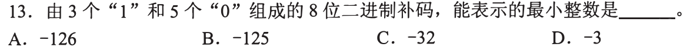

**新增**：8 位补码位权 `−128,64,32,16,8,4,2,1`；要最小就先放负权位，再把剩下的 1 放在权最小处。
**起手 → 答案**：`1000 0000` 起，再放两个 1 到最低两位 → `1000 0011=−128+2+1=−125`。**B**

下界：必须含一个 1 在负权位才能为负且最小；其余两个 1 加起来至少 `1+2=3`，所以 ≥ −125。

| 项 | 位串 | 1 的个数 |
| --- | --- | --- |
| A −126 | `10000010` | 2 ✗ |
| C −32 | `11100000` | 3 ✓，但 −32 > −125 |
| D −3 | `11111101` | 7 ✗ |

> C 的位串合法，被排除是因为不是最小；看到“最小”要找下界，不能只验证“可行”。

<a id="q11"></a>
## 11｜2015-14：每个步骤只可能改一种东西

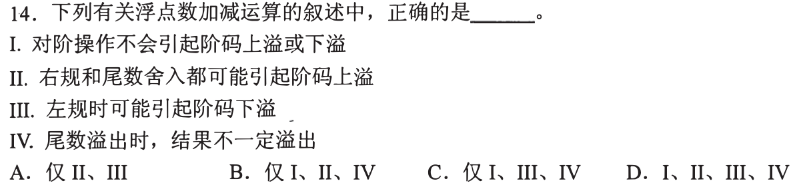

**新增**：把规格化步骤各自能改变什么列出来——对阶改小阶；右规尾数右移、阶码 +1；左规尾数左移、阶码 −1；舍入可使尾数进位。
**起手**：对四句话各问“这一步动的是尾数还是阶码，往哪个方向”→ **D（I、II、III、IV）**

| 句 | 依据（02 的流程） |
| --- | --- |
| I 对阶不会引起阶码上溢或下溢 | 只把小阶抬到已有的大阶，不产生新的极端阶码 ✓ |
| II 右规和舍入都可能引起阶码上溢 | 右规阶码 +1；舍入进位后需右规，阶码也 +1 ✓ |
| III 左规可能阶码下溢 | 左规阶码 −1，已是最小阶时越界 ✓ |
| IV 尾数溢出时结果不一定溢出 | 02 中尾数溢出（`01.xxx`）经右规可恢复，只要阶码还没越界 ✓ |

排除其余：A 少了 I、IV；B 少了 III；C 少了 II，而这三句都成立。

<a id="q12"></a>
## 12｜2016-14：无新台阶——07 的小端，列满 8 个字节

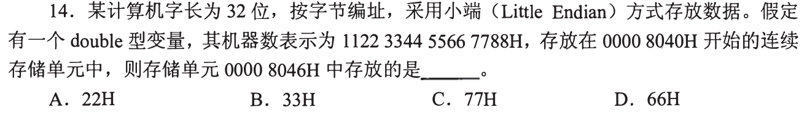

**起手**：把 `11 22 33 44 55 66 77 88` 倒过来写，自 8040 起编址。

| 地址 | 8040 | 8041 | 8042 | 8043 | 8044 | 8045 | **8046** | 8047 |
| --- | --- | --- | --- | --- | --- | --- | --- | --- |
| 内容 | 88 | 77 | 66 | 55 | 44 | 33 | **22** | 11 |

**A（22H）**。其余三项也是表中的字节：B 8045、D 8042、C 8041；C `77` 恰是按大端读出的 8046 内容（8040:11 … 8046:77）。

<a id="q13"></a>
## 13｜2018-13：机器数→值，再按值运算

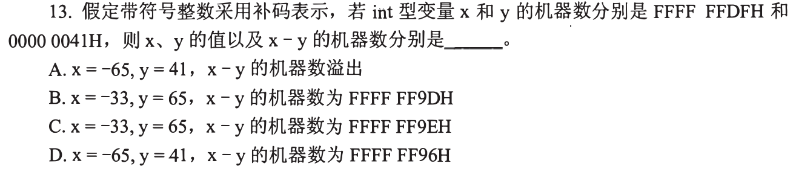

**新增**：01 的逆向——补码 → 值：`值=−(2ⁿ−机器数)`。
**起手 → 答案**：

```
x = FFFFFFDF → 2³² − FFFFFFDF = 0x21 = 33 → x = −33
y = 00000041 = 65
x − y = −98 → 2³² − 98 → 低字节 256−98 = 158 = 9E → FFFFFF9E
```
**C**。A、D 的 `x=−65`、`y=41` 与上面不符（0x41＝65），x 先错就不必判断它们的“溢出”或 `FF96`。B 的 `9D` 对应 −99，差 1。

<a id="q14"></a>
## 14｜2018-14：阶码全 0 也不能当普通指数

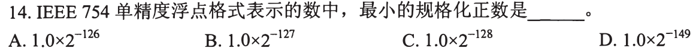

**新增**：阶码 `00000000` 保留给零和非规格化数；规格化数阶码 ≥1。
**起手 → 答案**：规格化 ⇒ 阶码 ≥1，真指数 ≥ `1−127=−126`，尾数全 0 → `1.0×2⁻¹²⁶`。**A**

- B、C 要阶码 0 和 −1 以下，规格化数取不到。
- D `2⁻¹⁴⁹` 是阶码 0、尾数仅最低位为 1 的非规格化数，不在“规格化”范围内。

> 信号：题面这四个字“规格化”。删掉它，答案就是 D。

<a id="q15"></a>
## 15｜2018-15：无新台阶——07 的小端用在立即数字段

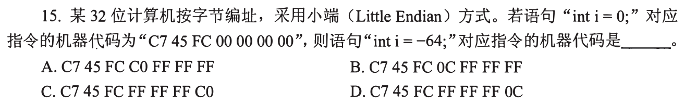

**起手**：并排写已知与目标。

```
int i = 0   : C7 45 FC | 00 00 00 00
int i = -64 : C7 45 FC | ?? ?? ?? ??
```
只有常数变了，前三字节不变。`−64=2³²−64=FFFFFFC0`，小端先放低字节：`C0 FF FF FF`。**A**

| 项 | 立即数字节 | 与题面 |
| --- | --- | --- |
| B | `0C FF FF FF` → `FFFFFF0C`＝−244 | 不是 −64 |
| C | `FF FF FF C0` → `C0FFFFFF`（小端读） | 字节倒了 |
| D | `FF FF FF 0C` | 两处都不对 |

<a id="q16"></a>
## 16｜2019-13：同宽重解释，位不变、权重变

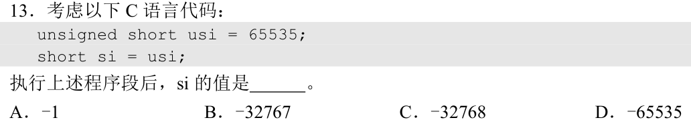

**新增**：`unsigned short`→`short` 同宽，位串不动，只是最高位权由 `+2¹⁵` 变 `−2¹⁵`。
**起手 → 答案**：`65535=FFFF`，全 1：`−32768+32767=−1`。**A**

| 项 | 位串 | 判断 |
| --- | --- | --- |
| B −32767 | `8001` | 位串不是 FFFF |
| C −32768 | `8000` | 同上 |
| D −65535 | — | 16 位补码最负是 −32768，装不下 |

读法：C 标准对“值超出 short 范围”的转换留给实现；这里按补码机器保留位串，只有此读法得到确定选项。

<a id="q17"></a>
## 17｜2019-15：先求首地址，再按大端找最后一个字节


**新增**：大端：最高字节在首地址，LSB 在首址＋3。本题还用到基址寻址的一句：有效地址 EA＝基址寄存器＋形式地址（这一块 0817 才系统讲，这里只用这一句）。
**起手 → 答案**：

```
形式地址 FF12（16 位补码）：2¹⁶−FF12=0xEE=238 → −238
EA = F0000000 − 0xEE = EFFFFF12            ← 操作数首字节
大端： 12@…12  34@…13  FF@…14  00@…15
LSB = 00，在 EFFFFF15
```
**D**。

| 项 | 来源 |
| --- | --- |
| A `F000FF12` | `F0000000+0000FF12`，把 FF12 当正数 65298；题面写“用补码表示” |
| B `F000FF15` | 同上再加 3 |
| C `EFFFFF12` | EA 对，但这是首字节地址，不是 LSB |

<a id="q18"></a>
## 18｜2020-13：一个机器数，按两种类型各读一遍

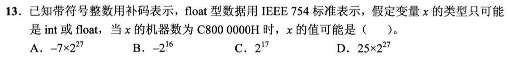

**新增**：题设“类型只可能是 int 或 float”＝对两种读法各算一次，再看哪个选项能被某一读法产生。
**起手**：`C8000000` 写两栏。

| 读法 | 计算 | 值 |
| --- | --- | --- |
| int（补码） | `0xC8000000−2³²=−0x38000000=−56×2²⁴` | `−7×2²⁷` |
| float | 符号 1｜阶码 `10010000`＝144｜尾数 0 | `−1.0×2¹⁷=−2¹⁷` |

| 项 | 裁决 |
| --- | --- |
| A `−7×2²⁷` | int 读法 ✓ |
| B `−2¹⁶` | float 的真指数是 17 不是 16 ✗ |
| C `2¹⁷` | 符号位是 1，不是正数 ✗ |
| D `25×2²⁷` | 恰是把 C8000000 当**无符号**读（3355443200）；题设整数用补码 ✗ |

答案 **A**。

<a id="q19"></a>
## 19｜2020-14：成员起点和字节偏移是两次定位

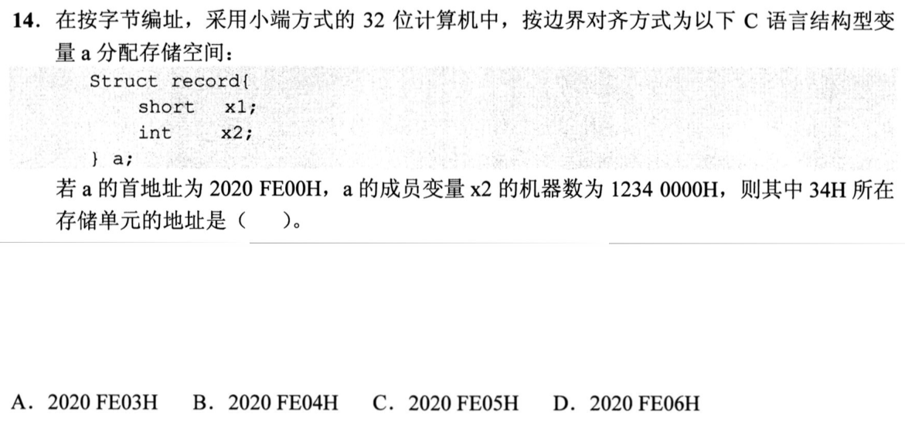

**新增**：先求成员起始地址（int 起于 4 的倍数），再在成员里数字节。
**起手 → 答案**：

```
x1(short)  FE00–FE01
填充       FE02–FE03       ← int 需 4 的倍数
x2(int)    FE04–FE07
1234 0000 小端：  00 00 34 12  → FE04:00 FE05:00 FE06:34 FE07:12
```
**D `2020FE06H`**。

A `FE03` 在填充；B `FE04`、C `FE05` 是 x2 的第 0、1 字节，内容都是 `00`。

<a id="q20"></a>
## 20｜2021-14：有限二进制小数看最简分母

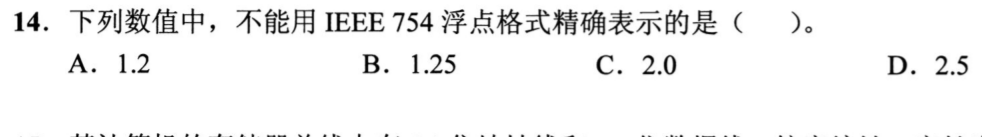

**新增**：能精确表示的小数 `=m/2ᵏ`；写成最简分数，分母只含因子 2 才行。
**起手 → 答案**：把选项化为最简分数——`1.2=6/5`、`1.25=5/4`、`2.0=2`、`2.5=5/2`。只有 `6/5` 含因子 5 → **A**。

手算验证 `0.2`：`0.2→0.4→0.8→1.6→1.2→0.2…`，位串 `0.001100110011…` 循环，无法有限。B、C、D 分别是 `1.01₂`、`10₂`、`10.1₂`，位数极少，远不到 24 位。

<a id="q21"></a>
## 21｜2022-13：补码范围

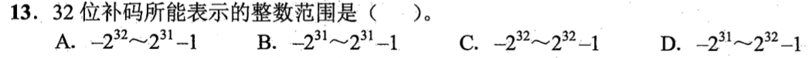

**新增**：n 位补码范围 `−2ⁿ⁻¹ ~ 2ⁿ⁻¹−1`（10 的位权推广：最高位权 `−2ⁿ⁻¹`）。
**起手 → 答案**：n=32：只有负权位为 1 得最小 `−2³¹`；负权位为 0、余位全 1 得最大 `2³¹−1`。**B**

位串共 `2³²` 种，用个数核对各项：

| 项 | 区间长度 | 与 2³² 比较 |
| --- | --- | --- |
| A `−2³²~2³¹−1` | `2³²+2³¹` | 超过 |
| B `−2³¹~2³¹−1` | `2³²` | 相等 ✓ |
| C `−2³²~2³²−1` | `2³³` | 超过 |
| D `−2³¹~2³²−1` | `2³¹+2³²` | 超过；上界属于无符号 |

负端比正端多一个，因为 0 占了一个非负编码。

<a id="q22"></a>
## 22｜2022-14：小于 1 的数，阶码为负指数

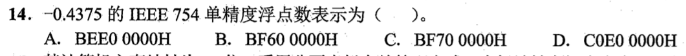

**新增**：04 的规则用在小于 1 的数——真指数为负，仍加 127。
**起手 → 答案**：`0.4375=7/16=0.0111₂=1.11₂×2⁻²` → 符号 1；阶码 `−2+127=125=01111101`；尾数 `11` 后补 0。

```
1 | 01111101 | 11000000000000000000000
= 1011 1110 1110 0000 ... = BEE00000
```
**A**。用 08 的方法解码其他选项：B `BF600000`＝阶码 126、`1.11`→−0.875；C `BF700000`＝阶码 126、`1.111`→−0.9375；D `C0E00000`＝阶码 129→−7。

<a id="q23"></a>
## 23｜2023-13：十六进制手算补码

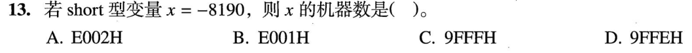

**新增**：十六进制下求 16 位补码——每位用 `F−该位`，再 +1。
**起手 → 答案**：`8190=0x1FFE` → `F−1,F−F,F−F,F−E = E 0 0 1` → `E001+1=E002`。**A**

验算：`E002+1FFE=0x10000`，进位丢掉得 0。

对每个选项还原值（`机器数−65536`）：

| 项 | 值 |
| --- | --- |
| A `E002` | `57346−65536=−8190` ✓ |
| B `E001` | −8191 |
| C `9FFF` | −24577 |
| D `9FFE` | −24578 |

<a id="q24"></a>
## 24｜2023-14：阶码全 0——隐含位变 0，指数固定 −126

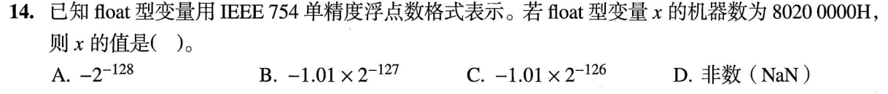

**新增**：阶码 0、尾数非零＝非规格化数：`(−1)ˢ × 0.尾数 × 2⁻¹²⁶`（14 里只说了 0 被保留）。
**起手 → 答案**：`80200000` → `1 | 00000000 | 01000…`。尾数 `0.01₂=1/4` → `−(1/4)×2⁻¹²⁶=−2⁻¹²⁸`。**A**

| 项 | 为什么不成立 |
| --- | --- |
| B `−1.01×2⁻¹²⁷` | 带隐含 1 的写法；指数 −127 对应阶码 0，规格化数用不了 |
| C `−1.01×2⁻¹²⁶` | 对应阶码 1、尾数 `0x200000`，即 `80A00000` |
| D NaN | 需要阶码全 1 |

<a id="q25"></a>
## 25｜2024-12：窄化＝保留低位，再按新位宽读

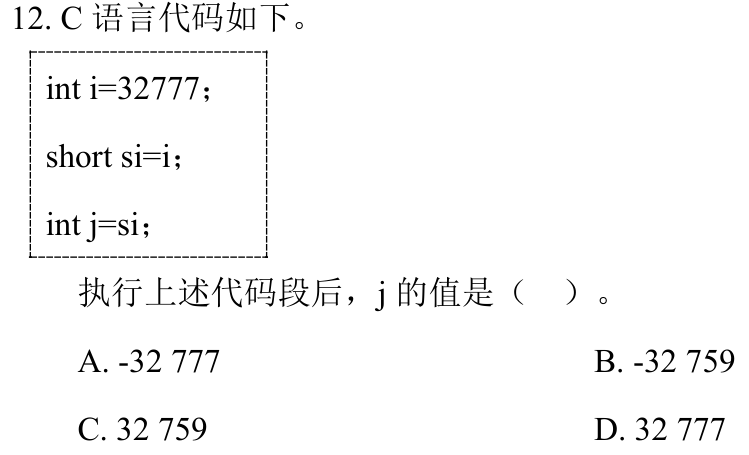

**新增**：宽→窄赋值：保留低位（此处 16 位）；值超出窄类型范围时，值会改变。
**起手 → 答案**：`32777=0x8009`；short 取低 16 位 `8009`，最高位 1 → `8009−65536=−32759`；`j=si` 按值扩宽，仍 −32759。**B**

| 项 | 来源 |
| --- | --- |
| A −32777 | 对 i 取相反数，不是取位 |
| C 32759 | 符号反了 |
| D 32777 | 没有发生窄化；short 最大 32767 < 32777 |

读法：标准 C 把越界转换留给实现，这里按补码机器取低 16 位；与 16 的重解释是同一位串规则。

<a id="q26"></a>
## 26｜2024-14：能到这个范围 ≠ 每个整数都能精确表示

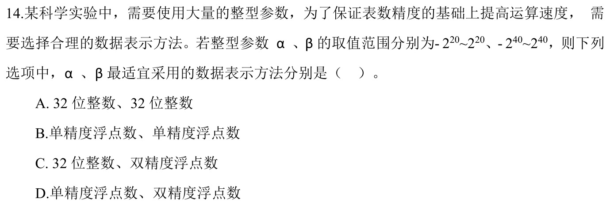

**新增**：浮点的“范围”和“相邻可表示数的间隔”要分开问。
**起手 → 答案**：在 β 的区间里找一个 float 表示不了的整数：`2²⁴+1` 需要 25 位有效位，float 取到 `2²⁴`（≤2⁴⁰，在区间内）。→ β 不能用单精度；32 位整数装不下 2⁴⁰；double 有 53 位 ≥ 41 位，可精确。β＝双精度。

α 的区间 `±2²⁰`：32 位整数能装；float 的 24 位也能精确装下（`2²⁰<2²⁴`），所以精度不能区分 α 的 int 与 float。区分来自题干“提高运算速度”，按整数运算快于浮点的常规理解选 32 位整数——题面未给速度数据，这一步依赖这个约定。

| 选项 | α | β |
| --- | --- | --- |
| A | int ✓ | int：2⁴⁰ 溢出 ✗ |
| B | float，慢 | float：`2²⁴+1` 表示不了 ✗ |
| C | int ✓ | double ✓ |
| D | float，慢 | double ✓ |

答案 **C**。

<a id="q27"></a>
## 27｜2025-12：有符号→无符号，值按 2³² 取模

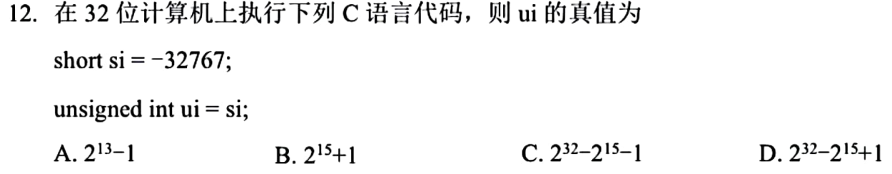

**新增**：负值赋给 `unsigned int`：值 `+2³²`（保持“值模 2³²”）。
**起手 → 答案**：`si=−32767`；short→int 按值扩宽（05）：`FFFF8001`；按 unsigned 读：`2³²−32767=2³²−2¹⁵+1`。**D**

| 项 | 数值 | 来源 |
| --- | --- | --- |
| A `2¹³−1` | 8191 | 无关 |
| B `2¹⁵+1` | 32769＝`8001` 零扩展 | 把 si 当 unsigned short |
| C `2³²−2¹⁵−1` | `FFFF7FFF`＝`2³²−32769` | 对应 si＝−32769 |

<a id="q28"></a>
## 28｜2025-13：无新台阶——08 的译码

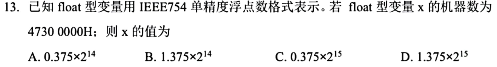

**起手**：`47300000` → `0100 0111 0011 0000 …` → `0 | 10001110 | 0110000…`

- 符号 0；阶码 `10001110=142` → 真指数 15；
- 尾数 `.011=0.375`，规格化补隐含 1 → `1.375`；

**D `1.375×2¹⁵`**（＝45056）。A、C 的 `0.375` 漏了隐含 1；A、B 的指数 14 少一位。

<a id="q29"></a>
## 29｜2025-15：数组步长＝结构体总长，总长是对齐的倍数

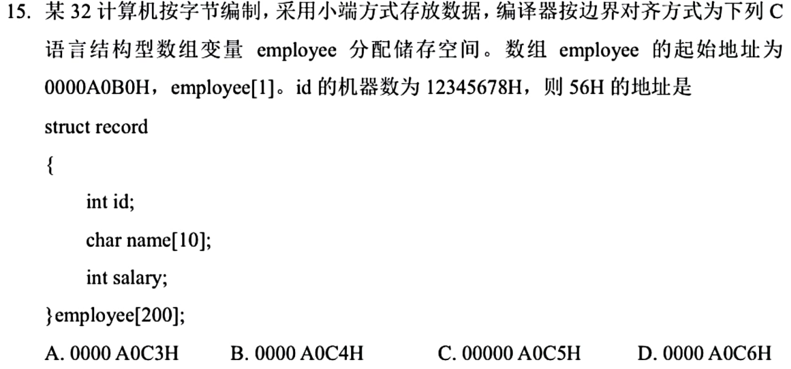

**新增**：结构体总长要补到“最严格成员对齐”的倍数（尾部填充），数组下标乘的是这个总长。
**起手 → 答案**：排偏移表。

| 成员 | 偏移 | 字节 |
| --- | --- | --- |
| id | 0 | 4 |
| name[10] | 4–13 | 10 |
| 填充 | 14–15 | 2（salary 要 4 的倍数） |
| salary | 16–19 | 4 |

总长 20，已是 4 的倍数，无尾部填充。`employee[1]` 起于 `A0B0+0x14=A0C4`；`12345678` 小端：`A0C4:78, A0C5:56, A0C6:34, A0C7:12`。56H 在 **`A0C5`，C**。

| 项 | 实际内容 |
| --- | --- |
| A `A0C3` | `employee[0].salary` 最高字节 |
| B `A0C4` | `78` |
| D `A0C6` | `34` |

读法：题干“employee[1]。id”按 `employee[1].id` 读；选项 C 图上多一个 0（`00000A0C5H`），按 `0000A0C5H` 读。

变式：去掉 salary，则 `4+10=14`，补到 16；步长 16，不是 14。

[« 0811-answer](0811-answer.md)　　[0813-answer »](0813-answer.md)
