# 0813 Answer｜有限位运算：溢出、标志与乘除

> [原题 11 题](0813.md) · [0812 位模式](0812-answer.md) · [能力账本](answer-quality/learning-ledger.md)
>
> 0812 已经能把一串位按有符号或无符号类型读成数。本节点多问一步：**算出的数学结果能否装回指定宽度；标志位对谁说话？** 每题机制折叠，先遮答案限时做，再按真正卡住的一步展开。

<strong>11 题考场速查</strong>

| 题 | 第一笔／保底 | 答案 |
| --- | --- | --- |
| [01](#q01) | 四个补码先读成 -2、-14、-112、-8 | B |
| [02](#q02) | 无符号大于＝无借位且不相等 | C |
| [03](#q03) | -12×2 + (-80)/2 | A |
| [04](#q04) | 四个表达式分别算数学值，界限 -128..127 | C |
| [05](#q05) | `-32767 mod 2¹⁶` | D |
| [06](#q06) | 逻辑补 0，算术复制符号位 | B |
| [07](#q07) | 先算差 15，再分别检查无符号借位与有符号溢出 | A |
| [08](#q08) | FFFD=-3，FFDF=-33，7FFC=32764 | D |
| [09](#q09) | 10−(-20)=30；无符号 10 减巨大值需借位 | B |
| [10](#q10) | 找“无法”：变量乘法可用移位加法循环 | D |
| [11](#q11) | -93−117=-210，8 位回绕为 46 | D |

讲解完成不等于限时独立通关。

## 01｜2010-13：先读补码值，再查八位乘积范围

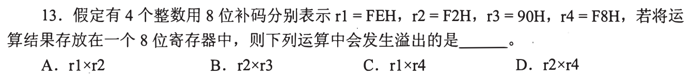

8 位补码给出 `FE=-2`、`F2=-14`、`90=-112`、`F8=-8`。有符号结果要装在 `[-128,127]`。四项依次得 28、**1568**、16、112；只有 `r2×r3` 的 1568 越过 127，**选 B**。计算前若把 `F2` 当 242，所有乘积都会被误判。

为什么两个负数相乘并不保证能装回原宽度

符号只能判定乘积为正，不能保证正数不超过 +127。`(-14)×(-112)=1568`，已经远超八位上界；其余乘积 28、16、112 均可装下。考场只需算到这一项并核查剩余三个是否越界，不必把溢出后的低八位求出。

## 02｜2011-17：无符号大于只看 CF 与 ZF

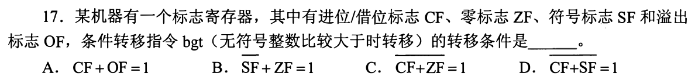

比较指令可视为做一次减法但不保存差值。无符号 `a>b` 需要 `a−b` **没有借位**（`CF=0`），并且 **不相等**（`ZF=0`）。选项 C 在原图中是**整个 `CF+ZF` 上方有横线**，即 `¬(CF∨ZF)=1`，等价于 `CF=0` 且 `ZF=0`，**选 C**。横线覆盖整体和只覆盖其中一个标志会改变逻辑，读题时要把它划清。

从最小反例看两个条件缺一不可

若 `a=b`，没有借位却 ZF=1，不能跳；若 `a<b`，ZF=0 却发生借位，不能跳。SF、OF 服务带符号比较，不能代替无符号条件。机器指令助记符也可能因体系结构不同而异，应以题干“无符号整数比较大于”来定语义。

## 03｜2013-14：带符号除以二先还原数值

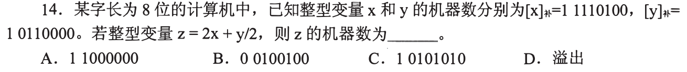

`x=11110100₂` 是 -12，`y=10110000₂` 是 -80。数学式 `2x+y/2=−24−40=−64`，落在八位补码范围内；`−64` 的位图是 **`11000000₂`，选 A**。两数都是偶数，除二不涉及负数舍入方向，避免在此题引入无关细节。

为何看见 x 的首位是 1 不等于“移位必溢出”

`−12×2=−24` 仍可表示；`−80/2=−40` 仍可表示；和 -64 也在范围内。把每个中间结果用数学值核一遍，最后再编码，比直接在位串上移两次、混淆算术/逻辑移位更稳。

## 04｜2014-13：边界 -128 与 +127 不是对称的

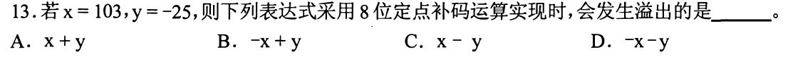

八位定点补码界限 `[-128,127]`。四项算值：`x+y=78`；`−x+y=−128`，**刚好可表示**；`x−y=128`，越过正上界；`−x−y=−78`。故只有 **C** 溢出。它承接 0812-21 的负端多一个可表示值。

为什么 B 看起来危险却仍安全

`−103−25=−128` 正是 `10000000₂`，不是“超出 127 就溢出”，因为负数允许到 -128。把两个界限先写在草稿纸边，再检查每个数学结果，能挡住凭绝对值大小猜答案的路线。

## 05｜2016-13：负 signed short 赋给同宽 unsigned short

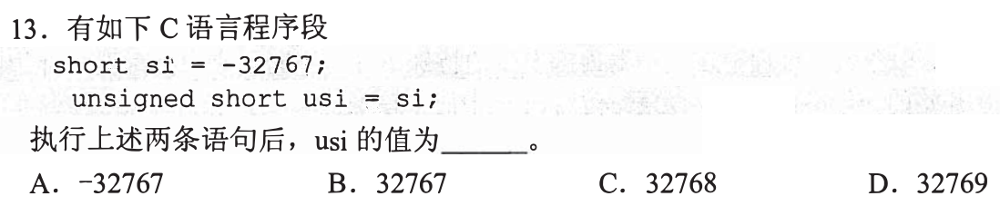

`si=−32767` 赋给 16 位 `unsigned short`，结果按 `2¹⁶` 取模：`65536−32767=32769`，**选 D**。保底笔是先写目标类型范围 `0..65535`，再把负值加 65536；这个转换的数值由无符号模运算明确给出。

对照 0812 的两种转换

0812-16 是 unsigned 65535 改按 signed short 解释，题目依赖常见补码实现；本题是 signed 负数转 unsigned，按模 `2¹⁶` 有确定的数值。0812-27 的目标是 32 位 unsigned int，因此模数换成 `2³²`。先看**目标宽度**，避免把 32769 与 4294934529 混用。

## 06｜2018-16：同一右移方向，空出的最高位由规则决定

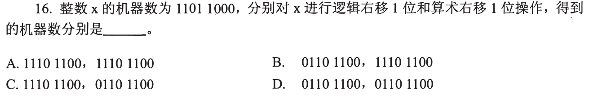

`x=11011000₂`。逻辑右移一位，最高位补 0，得 **`01101100₂`**；算术右移复制原符号位 1，得 **`11101100₂`**。两者配对 **选 B**。先看题目要的两种移位，不必先算 x 的十进制值。

为什么两个结果低七位完全相同

右移都让原第 7..1 位落到新第 6..0 位，区别仅在新最高位。逻辑右移面向位串，总补零；有符号补码的算术右移用符号扩展保持负值量级。即使把 `11011000₂=-40` 算出，仍要知道哪一种填位规则，才不会把两个答案写成一样。

## 07｜2018-19：CF 问无符号借位，OF 问有符号范围

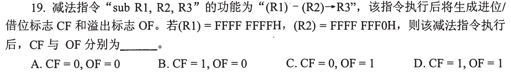

`FFFFFFFFH−FFFFFFF0H=0000000FH`。按无符号解释是 `2³²−1` 减 `2³²−16`，没有借位，**CF=0**；按有符号解释是 `−1−(−16)=15`，不越界，**OF=0**。故 **A**。同一运算允许两套解读，两个标志各自回答不同的问题。

别只看到最高位 1 就宣布溢出

操作数最高位都是 1，但它们的带符号值很接近。溢出检查的是数学结果能否装回 32 位有符号范围，而不是操作数是否为负。无符号借位则比较两串位作为无符号数的大小；`FFFFFFFF` 比 `FFFFFFF0` 大，自然无需借位。

## 08｜2021-13：同一组位在两种排序规则下都先解码

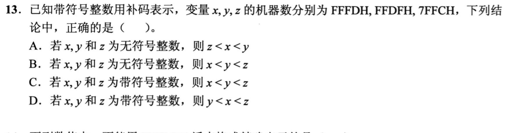

`FFFDH`、`FFDFH`、`7FFCH` 当作 16 位**有符号**补码分别为 `−3`、`−33`、`32764`，所以 **`y<x<z`，选 D**。若当无符号数，`7FFC` 最小，`FFDF` 小于 `FFFD`，顺序 `z<y<x`，并非 A、B。别用十六进制字母顺序直接推有符号大小。

只算两串负数的差也能做

同为 `FF..` 负补码时，`FFDF` 的低位比 `FFFD` 小，按补码解为 -33 与 -3；`7FFC` 最高位为零且很大，仍比两个负数大。这是 0812-09 “先看符号，再比较同号量级”的整数版。

## 09｜2023-16：OF=0 与 CF=1 可以同时成立

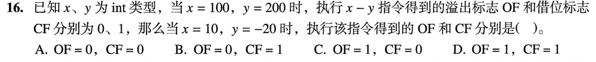

题目用 `100−200` 得 **OF=0、CF=1** 告诉你 CF 采用“减法借位”约定。新输入 `10−(−20)=30` 在 int 有符号范围内，**OF=0**；若把 `−20` 的同一位图按无符号数看，是接近 `2³²` 的大数，从 10 中减它要借位，**CF=1，选 B**。

为什么 30 是正数仍会有借位

OF 看 signed 的数学运算，10 减 -20 得 30；CF 看 unsigned 的位图关系，`10 < 2³²−20`，所以借位。不能用结果的符号倒推 CF。题中先给一组 OF/CF 的例子，正是让你确认这台机器的 CF 约定，避免不同指令文献中的标志位命名分歧。

## 10｜2024-15：变量乘法仍能用加法与移位循环

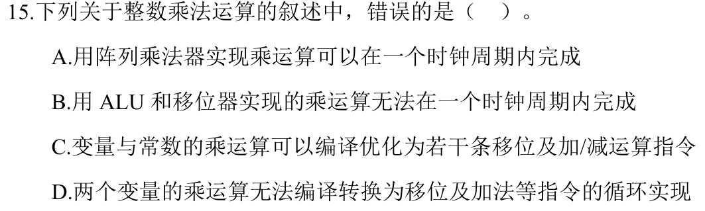

题目问“**错误**”。阵列乘法器可把部分积并行组织在一个时钟周期内完成，是一种可行设计；ALU 与移位器的迭代乘法通常分多轮；乘常数可拆成移位、加减；**两个变量也能**逐位读乘数，在循环中移位并按位加部分积。因此 D 声称“无法”是错的，**选 D**。

拿 13×11 手工做一次就能排除 D

`11=8+2+1`，所以 `13×11=(13<<3)+(13<<1)+13`。编译时若 11 是常数，可提前固定这串操作；若第二个数是变量，运行时逐位检查它的 1 在何处，再循环移位、累加。做得到与是否“通常更快”是两件事。选项 A 的一个周期也取决于时钟周期足够长和具体阵列设计，不等于所有乘法器都只花一个周期。

## 11｜2025-14：真实差 -210 装不进八位，位图回绕成 46

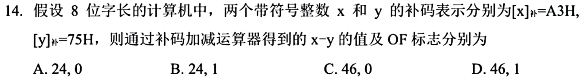

`A3H` 作 8 位补码为 `163−256=−93`；`75H=117`。真实 `x−y=−210` 小于 -128，**OF=1**。运算器只保留低 8 位：`−210 mod 256=46=2EH`，若题问的是运算器得到的 x−y 数值，选 **`46，1`，D**。这题必须同时报告真实值与被截断后的机器结果，不能把 46 当真实数学差。

为何可以不做整串位加法就确定 OF

把有符号输入还原为 -93 和 117，再看差是否处于 [-128,127]；-210 越界。二进制可用 `A3 + (~75+1)` 的低八位核验 `2E`。结果最高位为 0，不说明无溢出：负数减正数却得到正位图，正是符号翻转的警报。

## 收束｜一个运算三份账

先算数学值，检查能否装进目的位宽；再按模 `2^w` 找实际留下的位图；最后分别按 signed 或 unsigned 决定 OF、CF。能完成这三份账，01、04、07、09、11 的速度就来自同一动作，不需要逐题背答案。02 的原图横线覆盖 `CF+ZF` 整体，等价于两个标志均为零。
