[← 0813](0813.md) · [总索引](README.md) · [0815 →](0815.md)

# 0814｜存储器拼装：容量、长宽与片选

> 能力线 `15-memory` · 第 15/40 个节点 · 16 道真题引用
>
> [16 题讲解](0814-answer.md) · [闭卷复盘](../review/main.md#r0814)

## 故事梗概

存储芯片题的核心是把容量拆成长和宽，再决定地址如何选单元、数据一次读出多少。后续年份把引脚、编址、交叉存储和地址空间不断接到这套模型上。

这里的日期是链表节点，不是完成期限；是否前进，由这条能力线能否从题干恢复决定。

## 题单

### 01 · 2009-15

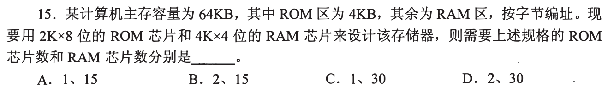

### 02 · 2010-15

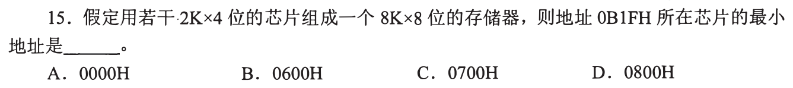

### 03 · 2010-16

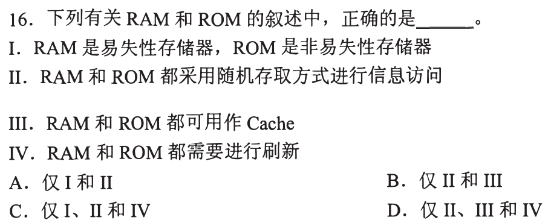

### 04 · 2011-14

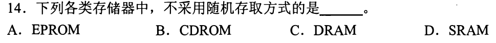

### 05 · 2011-15

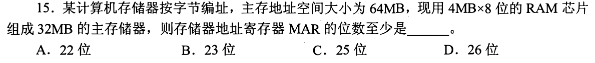

### 06 · 2012-16

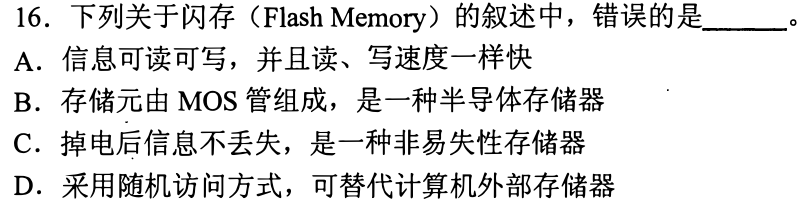

### 07 · 2014-15

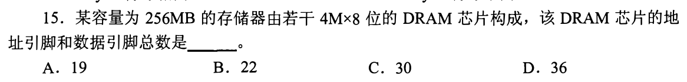

### 08 · 2015-17

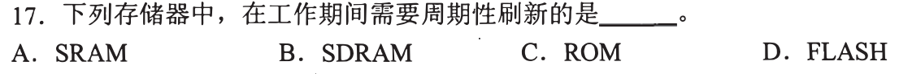

### 09 · 2015-18

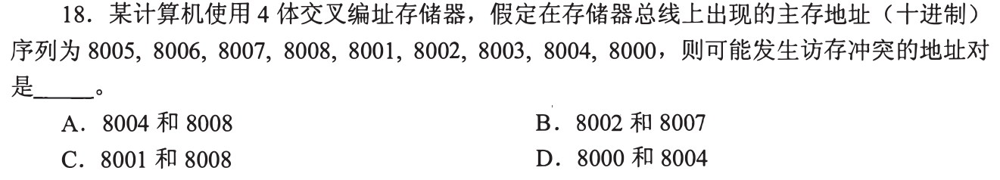

### 10 · 2016-16

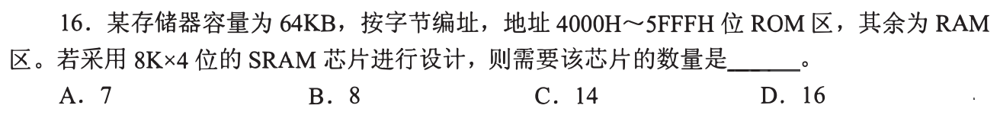

### 11 · 2017-13

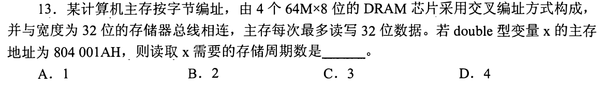

### 12 · 2017-18

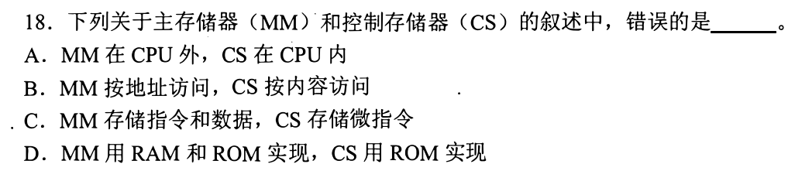

### 13 · 2018-17

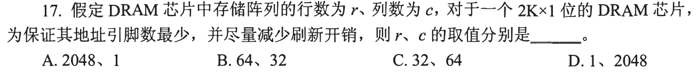

### 14 · 2021-15

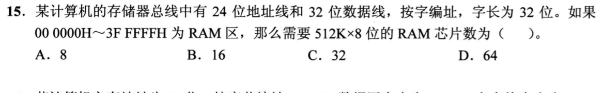

### 15 · 2022-17

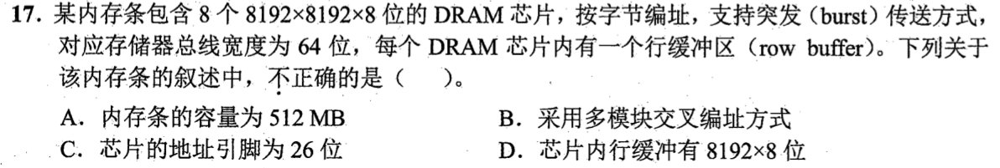

### 16 · 2023-15

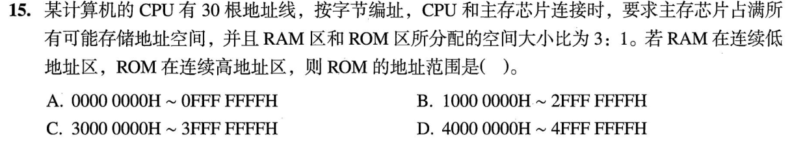

[← 0813](0813.md) · [总索引](README.md) · [0815 →](0815.md)
