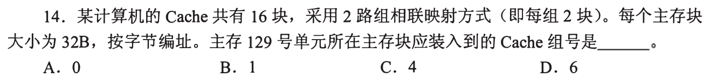
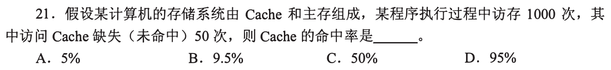
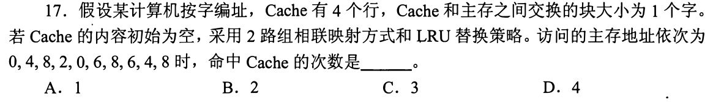
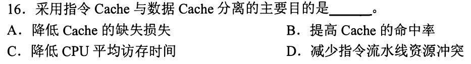
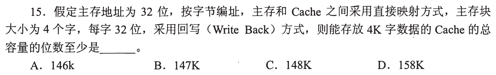
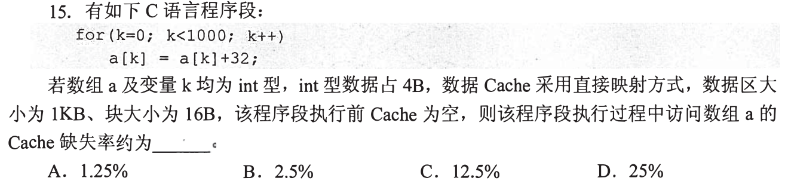
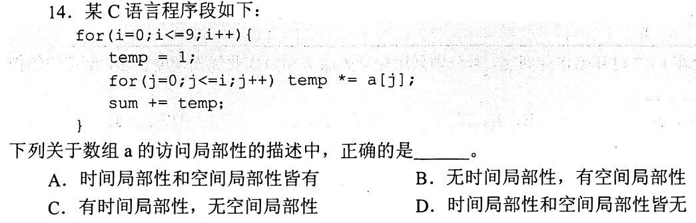
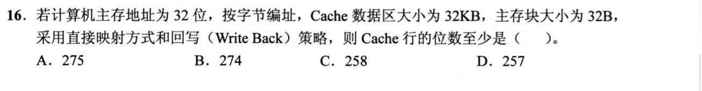
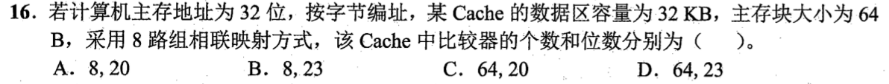

[« 0814-answer](0814-answer.md)　　[0816-answer »](0816-answer.md)

# 0815 Answer｜Cache访问：地址切分、局部性与替换

> [原题 12 题](0815.md) · [0814 存储器](0814-answer.md) · [能力账本](answer-quality/learning-ledger.md)
>
> 先前已会把容量拆成深度与宽度；现在把访问地址逐层拆为**块内偏移、组号、标记**，再用访问序列更新命中与替换。重复引用的 DRAM 原题直接回到 0814 的讲解，不重复教学。以下只代表教学稿，独立限时复做仍待验证。

<strong>12 题考场速查</strong>

| 题 | 第一笔／保底 | 答案 |
| --- | --- | --- |
| [01](#q01) | 129÷32 得块 4，再模 8 组 | C |
| [02](#q02) | `(1000−50)/1000` | D |
| [03](#q03) | 10 次地址全为偶数，只争第 0 组的两路 | A |
| [04](#q04) | 指令与数据分开可同时供给流水线 | D |
| [05](#q05) | 128K 数据 + 1K×(18 标记+2 状态) | C |
| [06](#q06) | 每块 4 个 int，每块首读缺失 | C |
| [07](#q07) | a 的相邻项、前缀重复访问 | A |
| [08](#q08) | 0814-13 的 32 行、64 列 | C |
| [09](#q09) | TLB/Cache 的物理实现不全是 DRAM | D |
| [10](#q10) | 每行数据 256 位+标签 17+状态 2 | A |
| [11](#q11) | 512 行、64 组，tag 20 位，8 路并比 | A |
| [12](#q12) | 虚拟页映射到物理页不固定直映 | D |

## 01｜2009-14：字节地址先除块大小，再模组数

16 个 Cache 块，每组 2 块，因此 **8 组**。主存块 32B、按字节编址，主存地址 129 属于块 `⌊129/32⌋=4`（128—159）；组号 `4 mod 8=4`，**选 C**。别把 129 直接模 8：低五位是块内字节偏移，不参与选组。

直接在二进制地址中看字段

32B 需要低 5 位作块内偏移；8 组需要其上 3 位作组号。`129=128+1`，高于偏移的块号是 4，低位 1 只在块内选第二个字节。组号由块号低 3 位给出，仍是 4。

## 02｜2009-21：命中率分母是总访问次数

1000 次访问有 50 次缺失，命中 `1000−50=950` 次，命中率 `950/1000=95%`，**选 D**。先把“缺失次数”从总数里减掉，别把 50 当作命中数，也别用主存访问次数另设分母。

下一题将把“50 次缺失”展开成具体访问路径

缺失率为 5%，命中率与它相加为 100%。这是一个统计结果，单靠总次数并不能推断哪次命中；03 需要逐地址模拟映射与 LRU，不能再用这一公式直接套出命中次数。

## 03｜2012-17：全偶地址同组，LRU 只模拟两路

块大小 1 字，四行分两组、每组两路。访问序列 `0,4,8,2,0,6,8,6,4,8` 全为偶数，块号模 2 都是组 0；组 1 从未使用。只在组 0 记“最近→最久”两项：访问 8 后 `[8,4]`，访问 2 后 `[2,8]`，依此推进。10 次中仅第二次访问 6 时命中，**1 次，选 A**。

逐笔表：不要把“同组”误作“同块命中”

| 地址 | 0 | 4 | 8 | 2 | 0 | 6 | 8 | 6 | 4 | 8 |
| --- | --- | --- | --- | --- | --- | --- | --- | --- | --- | --- |
| 命中？ | 缺 | 缺 | 缺 | 缺 | 缺 | 缺 | 缺 | **中** | 缺 | 缺 |
| 组 0 最近→最久 | 0 | 4,0 | 8,4 | 2,8 | 0,2 | 6,0 | 8,6 | 6,8 | 4,6 | 8,4 |

同一个组能同时容纳两个**不同块**。遇到第三个不同块要驱逐最久未用的一块，命中时也必须更新最近使用顺序。

## 04｜2014-16：分离指令与数据，消除同时访存的资源争用

指令流水线可能同周期要取下一条指令，同时访存级要读写数据；若共用一处 Cache 端口，两次需求争同一资源。分开的指令 Cache 与数据 Cache 能并行满足这两类请求，主要目的是**减少指令流水线资源冲突，选 D**。平均访问时间和命中率可能受到影响，但题目问“分离的主要目的”，抓同时需求更直接。

为何不能只答“命中率可能提高”

分开也可能把原来可共享的容量隔开，未必单调提高命中率。结构冲突的证据是流水线同一周期中取指与数据访问并发。即使两边都命中，若只用一个端口仍要等待；分离解决的是端口争用，不依赖具体程序命中率。

## 05｜2015-15：Cache 总位数包含数据、标记、有效、脏位

数据区能放 4K 个 32 位字，共 **128K 位**。每行 4 字=16B，所以有 1K 行；直接映射的 32 位地址分为 4 位块内偏移、10 位行号，剩余 **18 位 tag**。回写还需脏位，另有有效位，每行控制信息 `18+1+1=20` 位，1K 行合计 20K 位。总位数至少 **148K，选 C**。

为什么不是只加标签或把字数当行数

回写时，替换一行要知道它是否被改过，脏位不可省；有效位决定初始/未装载行是否可命中。每行包含 4 个字，故标签、有效、脏位只记 1K 次，不是 4K 次。逐行账是 `128 数据位 + 18 tag + 2 状态=148 位`，乘 1K 行即 148K 位。

## 06｜2016-15：顺序扫数组，先数块数再数访问次数

每个 int 4B，块 16B 容 **4 个相邻数组元素**。对 `a[0]` 到 `a[999]` 顺序读改写，需读取 250 个新块；每次迭代对同一个 a[k] 至少有读与写两次访问，约 2000 次，所以缺失率 `250/2000=12.5%`，**选 C**。已装入的块内随后三个元素不再缺失。

为何不是 25%

25% 是 250 次缺失除以 1000 个**元素**，忽略了 `a[k]` 既被读取又被赋值写回。题问的是访问数组 a 的 Cache 缺失率，统计读写访问的总次数；即使具体编译器缓存寄存器导致指令层访存次数不同，统考按源程序读/写访问模型作答。直接映射的 1KB Cache 只有 64 行，顺序扫描不回头，容量不足不会产生额外重复缺失。

## 07｜2017-14：a[j] 相邻，a[0..i] 被反复重访

内层 `j=0..i−1` 顺序访问相邻的数组项，呈**空间局部性**；外层 i 逐步增加，前面的小下标在随后多轮再次访问，呈**时间局部性**。两者都有，**选 A**。观察实际下标序列：`i=0 时不访问 a；i=1 时访问 0；i=2 时访问 0,1；…`，比只看双重循环字数更能说明原因。

两个概念各自指向什么

空间局部性不是“数组连续”四字自动成立，还需程序相继使用相邻位置，这里 j++ 给出证据。短时间内重复访问同一位置就属于时间局部性，同一次循环的重复读取也可以体现；本题更直接的证据是数组 a[0] 等项在后续外层循环里再次被取。不同输入 i 使重访频率不同，但不改变这道题的两种访问特征。

## 08｜2018-17：DRAM 行列题是上一节点的原题复用

这幅图与 [0814-13](0814-answer.md#q13) 是同一道 `2K×1` DRAM 原题：先令 `r×c=2048`，行列复用使地址引脚最少的搭配为 `32×64` 或 `64×32`；再以刷新行数少选 **`r=32,c=64`，C**。本节点不重复展开行列公式，检验你是否能把上一节点的“两层筛选”直接带过来。

什么时候需重开上一题机制

若能说出“引脚数取行列地址位数的较大者，先求平衡；刷新按行数，选更少的行”，就可直接过关。若只记 C，却说不清为何不选 64×32，请返回 0814-13 的折叠推理再做遮答案复述。

## 09｜2020-15：TLB 与 Cache 都靠局部性，通常用 SRAM

题问**错误**：程序局部性影响 TLB 和 Cache 的命中；缺失时要取得页表项或主存数据；两类缺失处理可由硬件参与。断言两者**都由 DRAM 构成**是错的，实际高速 TLB 与 Cache 常用 SRAM 等高速电路，**选 D**。先抓住“都”这个绝对词和速度目标，不必在这题模拟地址转换。

TLB 缺失与 Cache 缺失的去向不同

TLB 保存近期虚拟页到物理页的转换，缺失后查页表；Cache 保存近期主存块，缺失后取对应数据块。页表一般在主存，若页不在内存还可能进一步缺页处理到外存。B 在试题的常见存储层次模型里说缺失后访问主存，但这不能推成每次都仅访问一次主存或永不涉及外存。

## 10｜2021-16：先算每行数据，再补标签与回写状态

32KB 数据区、32B 块，得 `32KB/32B=1024` 行，直接映射需 **10 位行号**；块内偏移 5 位，32 位地址的 tag 为 `32−10−5=17` 位。每行数据 `32B×8=256` 位，另有有效位和回写脏位 2 位，合计 **`256+17+2=275` 位，选 A**。与 05 同一账式，变化的是块大小与每行数据位数。

257 位的诱惑

若只加 256 位数据和一个有效位，会漏掉 tag、脏位；258 加两状态仍漏 tag。题目问“Cache 行的位数至少”，不是数据区每行的有效载荷。逐字段列出后再加，避免把整个 Cache 总位数与单行位数混用。

## 11｜2022-16：八路意味着一组内八个 tag 并行比较

数据区 32KB、块 64B，先算 **512 行**；8 路组相联，每组 8 行，所以 **64 组=6 位组号**。块内偏移 6 位，32 位主存地址剩 tag `32−6−6=20` 位。一次查所选组的 8 路，需要 **8 个 20 位比较器，选 A**。不要把总行数 512 当成要同时比较的路数。

将三个数放回一次访问

低 6 位定位块内字节；再 6 位选出 64 组之一；组内的 8 个候选行 tag 与地址高 20 位并行比较。若其中一行有效且 tag 相等则命中。选 C 的 64 个比较器混淆“组数”和“路数”；选 B 的 23 位把组号/块内位数少扣了。

## 12｜2024-16：页表映射不是 Cache 的直接映射

主存与外存的交换单位为页，页式存储的缺页、页面替换通常由软件与硬件配合，写回的脏页需要落到外存；Cache 与主存可以选择直接映射。**虚拟页到物理页由页表映射，可放到可用的页框，并非通常采用固定的直接映射**，所以错误的是 **D**。这里把“Cache 组号确定”与“虚拟页号查询页表”分开。

为什么页表仍可用地址查，却不是直接映射

虚拟页号能索引页表项，但页表项保存的是当前分配的物理页框号，同一个虚拟页在不同时刻可被放入不同物理页框。Cache 的直接映射则由主存块号的固定若干位决定唯一 Cache 行。两者都使用地址，却有不同的**映射约束**；不能因有索引就推断物理页框号固定。

## 0815 收束｜把每次访问拆成固定动作

先算主存块号，再算组号，组内比较 tag；命中更新使用次序，缺失装块并按替换策略处理旧行。容量题则把数据位、tag、有效/脏位分开计数。需要一两分钟内解题时先写最短字段式；03 的 LRU 与 06 的数组访问则画最小访问序列，不背最后的命中次数。
