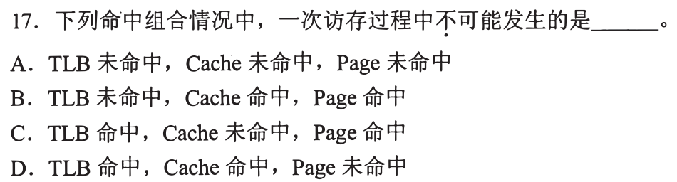
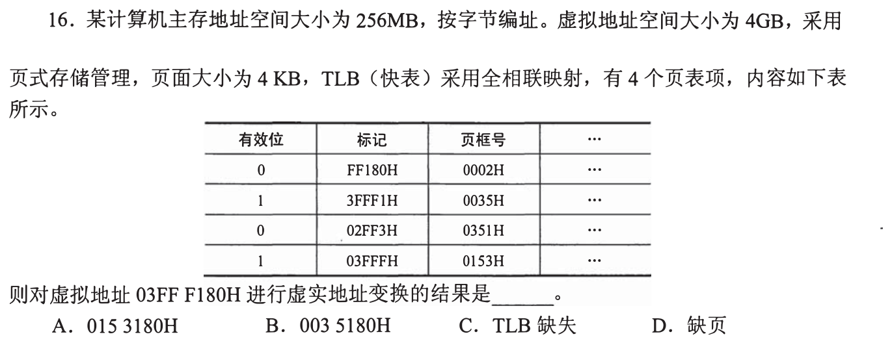
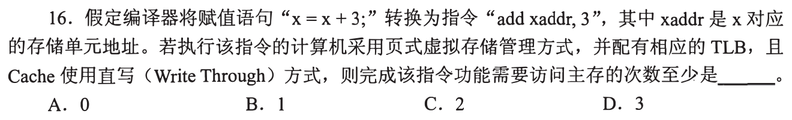
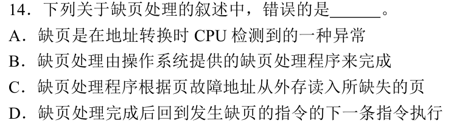
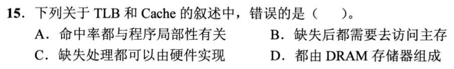
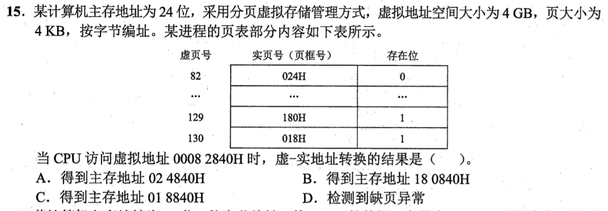
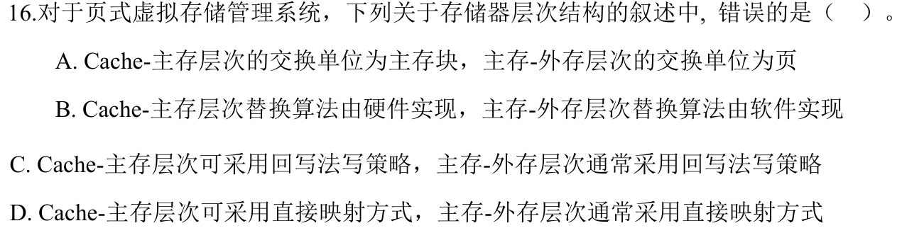
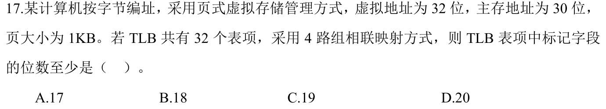
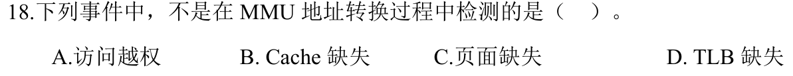

[« 0815-answer](0815-answer.md)　　[0817-answer »](0817-answer.md)

# 0816 Answer｜地址翻译链：虚拟地址怎样到达数据

> [原题 9 题](0816.md) · [0815 Cache](0815-answer.md) · [能力账本](answer-quality/learning-ledger.md)
>
> 一次虚拟地址访存，先将虚拟页号翻译成物理页框号，保留页内偏移；拿到物理地址后再访问 Cache。TLB、页表、Cache 各答一个问题。重复原题引用直接回链，避免每次从零讲。教学稿不是独立限时成绩。

<strong>9 题考场入口</strong>

| 题 | 第一笔 | 答案 |
| --- | --- | --- |
| [01](#q01) | TLB 命中说明页面映射当前有效 | D |
| [02](#q02) | 4KB 页保留末 12 位 `180H` | A |
| [03](#q03) | 直写确保一次主存写，读可由 Cache 命中 | B |
| [04](#q04) | 缺页处理后重执行原来出错的指令 | D |
| [05](#q05) | 0815-09：两者并非全用 DRAM | D |
| [06](#q06) | 虚页 130 在内存，页框 `018H` | C |
| [07](#q07) | 0815-12：虚页映射并非固定直映 | D |
| [08](#q08) | VPN 22 位，8 个 TLB 组扣 3 位 | C |
| [09](#q09) | MMU 翻译阶段尚未检查 Cache 是否命中 | B |

## 01｜2010-17：TLB 命中与 Page 缺失不能同时出现

TLB 是近期**有效页表映射**的快取。若 TLB 命中，已经能取得该页当前的物理页框号，意味着页面在主存；所以“TLB 命中、Cache 命中、Page 未命中”**不可能，选 D**。Cache 可因为相应数据块不在其中而缺失，即使页已在主存；TLB 也可因对应表项没缓存而缺失，即使页在主存。

三层“命中”分别指向什么

TLB 命中问“翻译记录在快表里吗”；Page 命中问“目标虚拟页在主存吗”；Cache 命中问“相应数据块在高速缓存里吗”。B 是 TLB 未命中、Page 命中：映射没缓存于快表，但可查页表取得，数据块也可仍在 Cache；C 是 TLB 命中、Page 命中、Cache 未命中：已有有效翻译，但相应数据块没缓存。两者均可发生；页未在内存时，可先经历 TLB 未命中与 Cache 未命中，A 也可发生。失效的 TLB 条目应在页面被换出时一致地作废，否则会给出过期物理页框。

## 02｜2013-16：TLB 有效位、虚页标记、页内偏移依次核

页大小 4KB，虚拟地址 `03FFF180H` 的低 12 位是 `180H`，虚页号为 `03FFFH`。TLB 表中标记 `03FFFH` 的一行**有效位为 1**、页框号 `0153H`，所以翻译成功，拼回页内偏移得 **`0153180H`，选 A**。不要看到表中某行无效就宣布这次 TLB 缺失：必须比中**该虚页号**并检查同一行的有效位。

页框号换掉，页内偏移不动

地址拆作 `03FFF | 180`；表项把虚页 `03FFF` 映到物理页框 `0153`；物理地址是 `0153 | 180`。另一个有效项 `3FFF1H` 的数字很相似，但不是 `03FFFH`；对错一个十六进制位就会选到不相干页。总主存 256MB 也不改变这个表项的匹配过程。

## 03｜2015-16：问“至少访问几次主存”，直写给出保底一次

`x=x+3` 至少要先取得旧 x、再写回新 x。若 TLB 与 Cache 均命中，地址翻译不必读主存页表，读 x 可由 Cache 完成；但题设 Cache **直写 Write Through**，写新 x 时还要同步写主存，故最少 **1 次，选 B**。关键是“至少”让我们选最有利的命中路径，再看哪一步无论如何无法省去。

为什么 0 与 2 都看似可能

只想“全命中”会误选 0，漏掉直写强制向主存写；只想“读一次、写一次”会误选 2，忽略旧 x 的读取可由 Cache 命中。若改成回写策略，当前写可能只改 Cache 并置脏位；若 TLB/Cache 缺失，实际主存访问次数还会增加，但题目求的是下界。

## 04｜2019-14：缺页后重做触发缺页的那条指令

缺页在地址翻译时被发现，处理程序从外存调入所缺的页、更新页表，然后回到**发生缺页的原指令重新执行**。若跳到下一条，原指令本该读/写的数据就从未完成，故错误的是 **D**。其他选项分别描述缺页异常、操作系统处理和按页装入。

与一般“执行完后再往下走”分开

发生缺页的访存尚未完成，CPU不能把该指令当成已经退休。操作系统让该页可用后，处理器重新翻译并继续/重试故障指令；具体处理器可在内部精确异常点恢复，考试上要掌握的是不能直接跳过它。缺页不是数据 Cache 没有该块的同义词：前者可能需要外存调页，后者通常先到主存取块。

## 05｜2020-15：沿用上一节点的 TLB/Cache 比较题

本题与 [0815-09](0815-answer.md#q09) 为同一道原题。立即可用的裁决是：TLB 保存地址转换、Cache 保存数据块，二者为快速访问通常不是**都由 DRAM 组成**，**选 D**。这里新增的位置感是：TLB 查询属于翻译阶段，Cache 查询属于翻译完成后的数据访问阶段。

只需多画这条责任线

`虚拟地址 → TLB／页表 → 物理地址 → Cache／主存`。发生 TLB 缺失不能直接宣布缺页，发生 Cache 缺失也不能直接宣布虚拟页不在内存。若 0815-09 的介质判断已会做，本题只需把两个缓存放回正确阶段。

## 06｜2022-15：页表存在位决定能否拼物理地址

4KB 页大小取虚拟地址 `00082840H` 的末 12 位 `840H` 为页内偏移，剩下 `0x82=130` 为虚页号。页表中虚页 130 的存在位为 1、页框号 `018H`；拼接成物理地址 **`018840H`，选 C**。虚页 82 的存在位为 0 是干扰项，它是**十进制 82**，不能把十六进制 `0x82` 当它。

这题最值得写在纸上的一步

`0x82=8×16+2=130`。先把表头的页号进制与虚拟地址中的十六进制页号对齐，然后才查存在位。若误读到表中“82”那一行，会选缺页 D；若拿页框 `180H` 或 `024H` 拼接，会落到另一个页的地址。页内偏移 `840H` 无论翻译到哪个页框都保持不变。

## 07｜2024-16：页式存储题已在 0815 建立

这与 [0815-12](0815-answer.md#q12) 是同一道题：Cache 与主存可用直接映射，但虚拟页号经页表定位物理页框，通常可放入不同页框，故“主存—外存通常直接映射”的说法错误，**选 D**。在本节点给它加一层用途：页表查询是 TLB 缺失后的翻译路径之一。

会答 D 还不够的迁移检查

若虚拟页 A 今天在物理框 5，换出再换入后可能在框 9；页表项更新即可，虚拟地址本身不变。固定直接映射不允许这种自由放置。若只记“Cache 用直接映射，页不行”而解释不了页表为何需要记录页框号，请回到上一节点的展开层。

## 08｜2024-17：TLB 的 tag 来自虚页号减组索引位

虚拟地址 32 位，页 1KB=`2¹⁰`，低 **10 位页内偏移**，虚页号剩 22 位。TLB 32 个表项、4 路组相联，有 **8 组**，用虚页号低 3 位选组，tag 剩 `22−3=19` 位，**选 C**。主存地址只有 30 位影响物理页框号宽度，不改变虚拟页 tag 的位数。

沿用 0815-11 的字段式，但对象换成虚页

Cache 的 `tag=主存地址位数−块内偏移−Cache组号`；TLB 则是 `tag=虚拟地址位数−页内偏移−TLB组号`。把“块”换成“页”，把 32 位物理/主存地址换成 32 位虚拟地址，计算结构相似，所查对象却不同。若用 30 减 10 减 3 得 17，会误把物理地址宽度放进虚拟页标记。

## 09｜2024-18：MMU 翻译阶段看权限、页表、TLB，不看数据 Cache

题目问**不是在 MMU 地址转换过程中检测**。TLB 缺失、页面缺失与访问越权都可能在翻译/权限检查时被识别；**Cache 缺失**要等取得可用物理地址后，在数据/指令缓存查询时才知道，故 **选 B**。首笔把事件各自安在访问路径哪一段，不背四个异常名称。

把“缺失”分成四个问题

TLB 缺失：快表无翻译记录；页面缺失：页表表明页不在主存；访问越权：当前访问不满足该页权限；Cache 缺失：翻译后数据块不在高速缓存。前两者不必然相互推出，Cache 缺失也不意味着缺页。MMU 先提供翻译及保护条件，缓存命中判断是后续路径。

## 0816 收束｜一条路径三种失败

虚拟页号先查 TLB，必要时查页表；若页不在主存，处理缺页并重试原指令；得到物理页框号后，和原页内偏移拼出物理地址，才去查 Cache。熟练阶段要能看到题干中的“TLB 命中”“页表存在位”“直写”“Cache 缺失”就立刻定位它们各自改变哪一步，而不是把所有未命中混成一次访存失败。

[« 0815-answer](0815-answer.md)　　[0817-answer »](0817-answer.md)
