[« 0816-answer](0816-answer.md)　　[0818-answer »](0818-answer.md)

# 0817 Answer｜指令取数：格式、寻址与有效地址

> [原题 13 题](0817.md) · [0816 地址翻译](0816-answer.md) · [能力账本](answer-quality/learning-ledger.md)
>
> 0816 已能区分“虚拟页号、物理页框、页内偏移”；本节点先停在**指令给出的形式地址如何形成有效地址、再怎样取操作数**。地址字段有时不是地址而是立即数或寄存器号。已在 0813、0812 完整讲过的原题只回链。

<strong>13 题考场速查</strong>

| 题 | 第一笔 | 答案 |
| --- | --- | --- |
| [01](#q01) | PC 取完两字节变 `2002H`，再加 06H | C |
| [02](#q02) | 间接寻址需再访存，不是寄存器+偏移 | A |
| [03](#q03) | 0813-02 原题：无借位且非零 | C |
| [04](#q04) | EA=R+D=`3000H`，取 M[EA] | D |
| [05](#q05) | 32−8−4−4=16 位有符号位移 | A |
| [06](#q06) | 先 R[I]+D，再以该处内容为 EA | C |
| [07](#q07) | 下标顺序访问用变址寄存器 | D |
| [08](#q08) | 29 个三址占 29 个 5 位前缀，其余可扩展 | A |
| [09](#q09) | `(2100H−2000H)/8=32`，进本轮前尚未加一 | B |
| [10](#q10) | 0812-17 原题：补码位移符号扩展，再大端找低字节 | D |
| [11](#q11) | 6 位操作码+2 位寻址方式，留 8 位地址 | A |
| [12](#q12) | 二址前缀余 4，扣 254 个一址，再扩 6 位 | D |
| [13](#q13) | 寄存器装值还是地址，由寻址方式解释 | A |

## 01｜2009-16：相对转移的基准是取完本条后的 PC

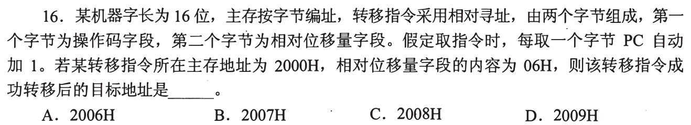

指令起始地址 `2000H`，由操作码和位移量两个字节组成。每取一个字节 PC 加一，所以取完整条后 PC 已到 **`2002H`**；相对位移 `06H` 加在这个基准上，目标 **`2008H`，选 C**。第一笔是写取指过程的 PC：`2000→2001→2002`，别从指令首址直接加 6。

为什么选 A、B、D 看起来也合理

A 的 `2006` 忘了整条指令占 2 字节；B 的 `2007` 只计入其中 1 字节；D 的 `2009` 又多算 1。相对寻址要看题目定义 PC 自动增加何时发生、位移的单位是否为字节；本题明确每取一个字节加 1，消除了这两处歧义。

## 02｜2011-16：寄存器加形式地址，与访存取指针分开

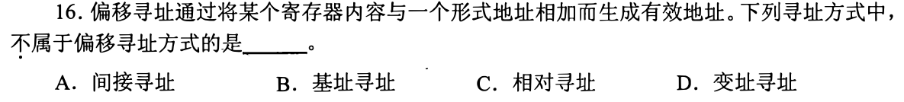

题干定义偏移寻址为“某寄存器内容 + 形式地址”。基址、相对（PC 为寄存器）与变址都可写成 `EA=寄存器值+D`；**间接寻址**则要先按形式地址访问存储器，让那里的**内容**给出有效地址，故不属于，**选 A**。先把各方式翻译成“相加”还是“取内容”，不背四个名称。

多一对括号就多一次访存

以 D 为指令内字段，基址是 `Rbase+D`，相对是 `PC+D`，变址是 `Rindex+D`；间接是 `M[D]`。若最终还要取操作数，通常再做 `M[EA]`。分清“算出 EA”和“从 EA 取数”两阶段，下题才不会把地址 3000H 与操作数 4000H 混淆。

## 03｜2011-17：重复的无符号条件转移题

这与 [0813-02](0813-answer.md#q02) 是同一道原题。无符号“大于”需要减法**无借位 CF=0**，且**不相等 ZF=0**；选项 C 的横线覆盖整个 `CF+ZF`，即 `¬(CF∨ZF)=1`，**选 C**。本节点只增加用途：条件转移的目标地址在判定跳转条件成立后才会被选用。

条件与目标是两回事

CF、ZF 是执行前一比较/减法留下的状态；相对位移或目标地址字段决定一旦跳转向哪里。可以会算目标地址却把比较条件看错，也可以条件判对却用错 PC 基准，考试上两笔要分别检查。

## 04｜2013-17：变址先求地址，再从该地址取数

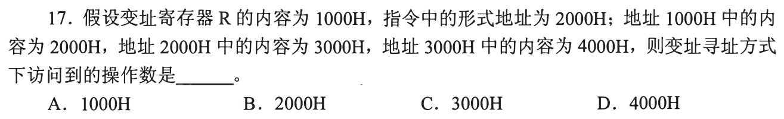

变址寄存器 `R=1000H`，形式地址 `D=2000H`，所以**有效地址 `EA=3000H`**；题问“访问到的操作数”，还要读 `M[3000H]=4000H`，**选 D**。`1000H` 和 `2000H` 处的内容虽然给出，根本没沿这条路径访问，属于干扰。

三个层级写成两行

`EA=R+D=1000H+2000H=3000H`；`操作数=M[EA]=M[3000H]=4000H`。若题改问“有效地址”，答案会是 C；若把 `M[1000H]` 再拿去相加，就把变址寄存器**内容**误作寄存器所指内存的内容。

## 05｜2014-17：固定指令先扣字段，再看位移的补码范围

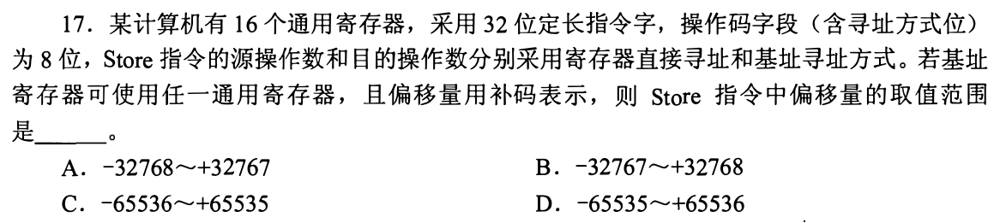

32 位 Store 指令已有 8 位操作码（含方式位）。16 个通用寄存器需各 4 位，源操作数寄存器一份，基址寄存器再一份，剩 `32−8−4−4=16` 位给位移。16 位补码范围 **`−32768…+32767`，选 A**。这问的是位移字段的可编码范围，不是完整有效地址可能覆盖的范围。

两个寄存器字段为何不能只扣一次

源寄存器编号告诉 Store 把哪个寄存器的值写出去；基址寄存器编号告诉它把写操作放在哪个地址附近。即便源和基址有时碰巧选同一个通用寄存器，编码中仍有两个独立字段。16 位补码负端比正端多 1，承接 0812-21 的范围计算。

## 06｜2016-17：“先变址后间址”按顺序加括号

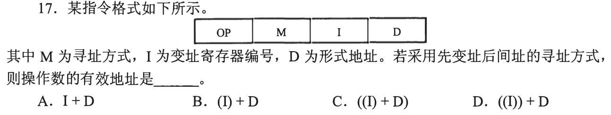

I 是寄存器**编号**，`(I)` 表示该寄存器里的变址值。先变址得 `R[I]+D`；后间接再访问这个地址处的内存，得到有效地址 **`M[R[I]+D]`，即图中 `((I)+D)`，选 C**。A 把寄存器编号本身与 D 相加；B 到变址结果就停了；D 先把寄存器当内存地址做了错误的间接。

拿一个具体值检查括号顺序

若寄存器编号 I=2、R[2]=1000H、D=20H，且 `M[1020H]=3000H`，先变址到 1020H，再间址得到 EA=3000H。题问有效地址时停在 3000H；若再问操作数，才取 M[3000H]。这里每加一层括号都是实实在在的一次取内容。

## 07｜2017-15：下标顺序走数组，让寄存器持有变化量

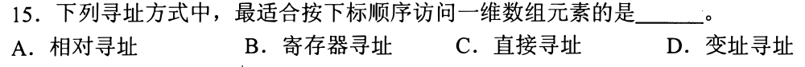

一维数组基址固定，循环下标逐步变化。令指令中的 D 保留数组起点、变址寄存器保存随循环改变的偏移，地址可按 `EA=D+Rindex` 逐项生成，所以**变址寻址，选 D**。直接寻址要为不同元素改变指令内地址；寄存器寻址取寄存器本身的值，不说明从数组内存取数。

与基址相加公式相同，为什么名称不同

两者都能写成寄存器加形式地址；此题强调**下标在循环里改变**，把变化的下标/字节偏移放进变址寄存器是最自然的用途。基址寄存器更常用来给一片区域/段提供基点，而指令字段作为相对位移。公式相同不意味着用途判断也不用看题干的动态量。

## 08｜2017-16：少一个地址字段，可让操作码继续扩展

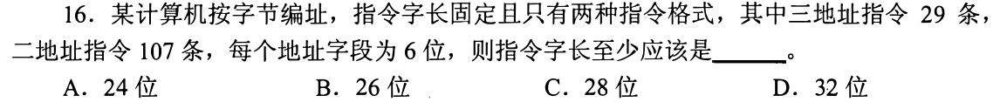

三地址每个地址字段 6 位，先占 `3×6=18` 位；29 条三地址指令至少要 5 位操作码，合计 **23 位**。5 位前缀共 32 种，留 3 个前缀作二地址扩展；借空出的一个 6 位字段，每个前缀可区分 64 条，足够 107 条二地址。指令按字节定长，23 位向上取整为 **24 位，选 A**。

为何不能简单为 29+107=136 条分配同样长的操作码

若统一操作码至少 8 位，三地址格式需 `8+18=26` 位，会选到 32。扩展编码利用格式差异：三地址用短前缀，留下部分短前缀作“这是一条二地址指令”的入口，再用本来属于第三地址的位继续细分。判断 24 位够不够，必须同时检查两格式的编码数量，不能只满足 29 条。

## 09｜2018-18：自动加一发生在“取完元素”之后

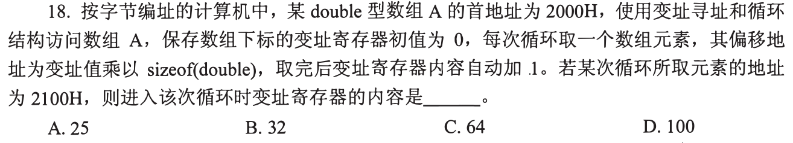

double 每项 8B，首址 `2000H`；本轮读到的地址 `2100H` 与首址差 `100H=256B`，所以**取这个元素时**变址寄存器内容是 `256/8=32`，**选 B**。题说“取完后自动加 1”，故下一轮才是 33，不能提前给本轮加一。

先后顺序比总循环次数更重要

第 0 轮取 A[0]，地址 2000H，随后变址值变成 1；第 32 轮进入时值为 32，取 A[32] 的地址为 2100H，随后才变 33。题没有要求计算循环已运行多少次或数组长度，只问“进入这次循环时”的寄存器值。

## 10｜2019-15：同一基址、大端原题沿用 0812

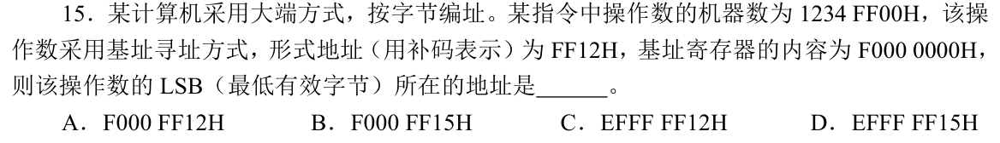

这是 [0812-17](0812-answer.md#q17) 的重复引用：形式地址 `FF12H` 用 16 位补码表示，为 −238，符号扩展后加基址 `F0000000H`，操作数首址为 `EFFFFF12H`；大端四字节 `12 34 FF 00` 的最低有效字节在首址+3，即 **`EFFFFF15H`，选 D**。原图 C、D 的高位为 `EFFF`；零扩展位移会落入 A/B 的干扰地址。

本节点额外检查哪一步

基址寻址形成的是**操作数首地址**；随后端序才决定这个操作数的 LSB 在其中哪个字节地址。算 EA 与找 LSB 是两次定位，不能把“最低有效字节”误当基址寻址的目标地址本身。

## 11｜2020-16：单地址格式扣固定字段后，直接地址无符号

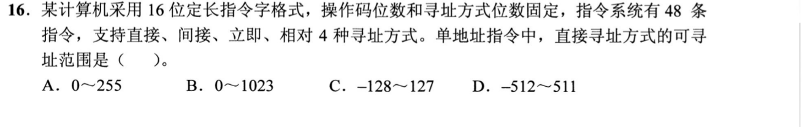

48 条指令至少用 6 位操作码；4 种寻址方式需 2 位方式码。16 位固定指令剩 `16−6−2=8` 位地址字段。**直接寻址**把字段当无符号地址，范围 `0…2⁸−1=0…255`，**选 A**。相对方式可能把同一字段当有符号位移，但题专问直接可寻址范围，别拿补码 -128…127 来答。

指令系统总条数决定哪一段宽度

`2⁵=32` 不够编码 48 种操作，`2⁶=64` 足够，故操作码至少 6 位；4 种方式需要 `2²=4`。两段扣完后，余下的 8 位在不同方式下意义不同。基址、相对或间接可能借寄存器/内存扩大最终有效地址范围，不能由这 8 位直接概括。

## 12｜2022-19：扩展操作码逐层扣掉占用的前缀

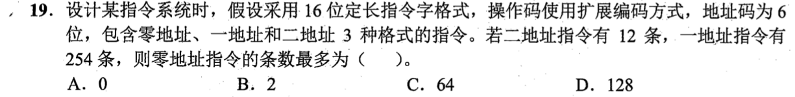

16 位指令、每个地址 6 位。二地址格式操作码先有 `16−12=4` 位，共 16 个前缀；其中 12 个给二地址指令，余 **4 个前缀**留给一地址扩展。一地址只用 6 位地址，空出的 6 位每个前缀可再细分 64 种，可形成 `4×64=256` 种一地址编码；已用 254 种，还剩 **2 个可继续扩展的前缀**。零地址不再需要那 6 位地址字段，每个前缀又能分 64 种，故最多 **`2×64=128` 条零地址指令，选 D**。

为什么不能把“零地址空出 6+6 位”就直接算 4096

零地址仍必须避开已经分配给二地址与一地址指令的前缀。能扩展的入口只有那 4 个未分给二地址的短前缀，在下一层 256 个位置中又有 254 个已分给一地址。编码树里已用路径不能再复用；剩余的 2 个**一地址层前缀**各自还能延伸 6 位，不应把“前缀数 2”直接当成最终零地址指令数。

## 13｜2023-17：寄存器内容是值还是地址，由寻址方式决定

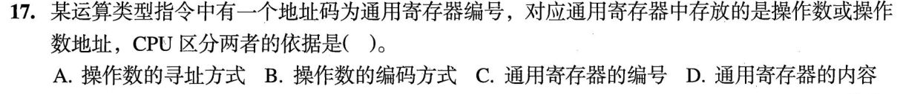

同一个通用寄存器可以直接放**操作数**，也可以放**操作数所在内存地址**。CPU 如何解释，取决于指令规定的**操作数寻址方式，选 A**：寄存器直接取 R 内值，寄存器间接把 R 内值作为地址再访存。寄存器编号只定位哪个寄存器，编号本身不决定取值后是否再访存。

用一份寄存器值看两条路径

假设 R3 内容为 `1000H`：寄存器寻址把 `1000H` 当操作数；寄存器间接寻址先把 `1000H` 当有效地址，再读 `M[1000H]` 作为操作数。寄存器没换、内容没换，变的是指令对这份内容的解释。承接 0812 的“位模式的解释权”，这里由寻址方式决定地址层级。

## 0817 收束｜三问压缩寻址长篇

题干给的字段 D 是立即数、寄存器号、位移还是地址？求 EA 前需不需要加 PC/基址/变址？求出 EA 后，题目要的是**EA 本身**还是 `M[EA]` 的操作数？先回答这三问，再处理位宽与端序。扩展操作码题则另画编码树、逐层扣已占用的前缀。可解释答案只表示“会解”，熟练还要遮答案做不同数据和不同问法。

[« 0816-answer](0816-answer.md)　　[0818-answer »](0818-answer.md)
