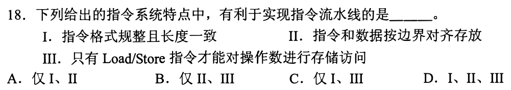
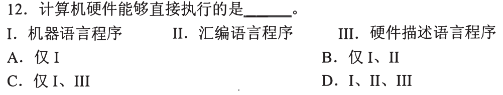
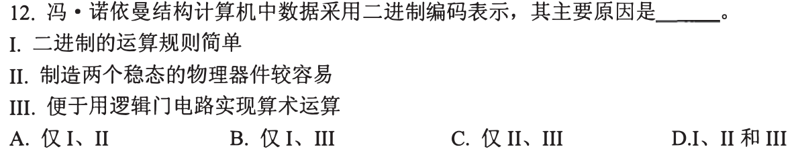
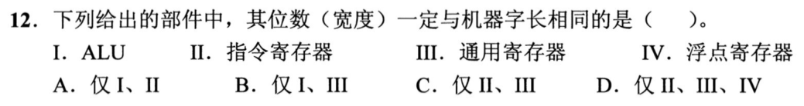
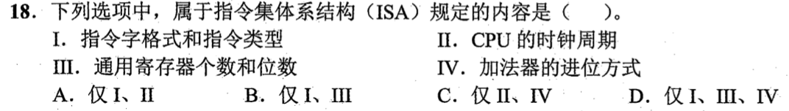
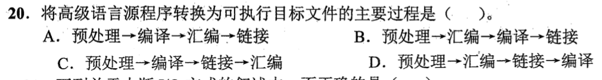
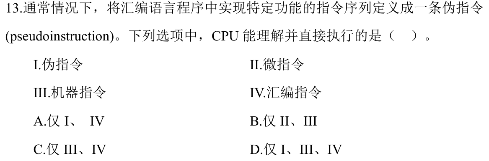

[« 0817-answer](0817-answer.md)　　[0819-answer »](0819-answer.md)

# 0818 Answer｜程序层级：从源程序到 CPU 真正执行的对象

> [原题 14 题](0818.md) · [0817 指令格式](0817-answer.md) · [能力账本](answer-quality/learning-ledger.md)
>
> 0817 已在机器指令里拆字段；本节点问更外层的“程序怎样变成指令”和更内层的“控制器怎样执行”。先辨对象属于**源语言、汇编、机器 ISA，还是微结构**，再裁决选项。重复的扩展编码题直接回链。

<strong>14 题考场入口</strong>

| 题 | 第一笔 | 答案 |
| --- | --- | --- |
| [01](#q01) | RISC 常用硬连线控制 | A |
| [02](#q02) | 程序通过分支等指令影响 PC，不直接触及 MAR/MDR/IR | B |
| [03](#q03) | 规整指令、对齐、Load/Store 均便于流水 | D |
| [04](#q04) | 硬件取指直接执行机器语言 | A |
| [05](#q05) | 高级语言到机器级目标代码是编译 | C |
| [06](#q06) | 二进制简化规则、双稳态、门电路 | D |
| [07](#q07) | 数据可以在主存，不都在指令里 | C |
| [08](#q08) | ALU 与通用寄存器宽度跟机器字长 | B |
| [09](#q09) | 基址寄存器与状态标志对汇编可见 | D |
| [10](#q10) | ISA 定格式与寄存器，不定物理进位方式 | B |
| [11](#q11) | 预处理→编译→汇编→链接 | A |
| [12](#q12) | CPU 执行机器指令，微控制器执行微指令 | B |
| [13](#q13) | 定长指令格式属 ISA | B |
| [14](#q14) | RISC 规则格式利于流水，C 反说 | C |

## 01｜2009-17：RISC 简化译码，控制器多用硬连线

题问**错误**。RISC 通常指令种类和寻址方式较少、格式规整，寄存器较多，多数简单指令便于在流水线中较快执行；B、C、D 描述这些倾向。A 说它“普遍采用微程序控制器”与典型 RISC 设计不符；**硬连线控制更常见，选 A**。先确认它问的是控制器实现，不把 RISC/CISC 当绝对禁止某技术的标签。

为何指令精简会影响控制方式

规整且较少的机器指令，译码后的控制关系容易用组合/时序逻辑直接生成；复杂指令若拆成多步微操作，微程序实现往往更方便。这里说的是考试中的典型设计倾向，不是每一颗现代处理器都必须按此分类。碰到“普遍”一词，核它指向的典型方向即可。

## 02｜2010-18：汇编员可见的是程序执行状态的一部分

四项里 **PC 程序计数器，选 B**。它保存下一条（或当前取指阶段有关的）机器指令地址，汇编程序可通过跳转、调用等指令改变控制流。MAR/MDR 是主存接口传地址/数据的内部寄存器，IR 保持当前指令供译码，通常不是汇编程序直接可访问的寄存器。

“可见”不等于总有一条普通 MOV PC 指令

可见是 ISA 程序能感知或影响其语义，例如分支目标、相对寻址的 PC 基准；具体指令集是否允许通用寄存器式读写 PC 是另一回事。MAR/MDR/IR 即便真实存在，也属于实现取指、访存的硬件路径，不作为程序员要在汇编中编号的普通对象。

## 03｜2011-18：流水线要各阶段工作尽量规整

I 指令格式规整且长度一致，使取指/译码边界容易预测；II 指令和数据按边界对齐，减少跨界访存；III 仅 Load/Store 访存，使其他运算指令多在寄存器间完成、流水级职责清楚。三项都利于流水实现，**选 D**。别把“利于”误读为“没有这些条件就绝不能流水”。

三项分别缓解什么难点

变长指令让取指难确定下一条起点；非对齐数据可能跨多个访存单元；任何算术都任意访存会使执行阶段耗时、资源需求不齐。规整格式、对齐和 Load/Store 分工分别减轻这些问题，但依然可能有数据、控制等流水冒险，本题只问是否有利。

## 04｜2015-12：能直接交给 CPU 的是机器指令序列

机器语言程序由 CPU 规定的机器指令编码组成，可直接取指、译码、执行，故 **仅 I，选 A**。汇编源程序要先由汇编器翻成机器码；硬件描述语言程序描述电路结构，需综合/实现，不是作为该 CPU 的程序逐条执行。先问“交给取指单元的字节是什么”，就能排除名称里也有“程序”的干扰。

汇编与机器码的关系

`add r1,r2` 这样的助记形式便于人读，最终要编码成 ISA 机器指令。汇编伪指令甚至可能扩成多条机器指令或只在汇编期起作用；不能因为汇编看起来接近机器，就说 CPU 直接理解汇编文本。

## 05｜2016-12：源程序到目标代码，先认输入输出

输入是**高级语言源程序**，输出是**机器级目标代码文件**；承担这一步的是**编译程序，选 C**。汇编器的输入通常是汇编语言；链接程序把目标模块和库结合、处理符号/重定位；解释程序通常逐步解释执行，不以产生该目标文件为本题定义的产物。

别把完整构建流程压成一个词

一个工程可能先编译成汇编或目标文件，再链接成可执行文件；题目明确问从高级语言源到机器级目标文件的一环。辨认输入、输出比背“编译、链接、解释”各自的口号快。若题改问多个目标文件和库的符号如何合成，才转到链接。

## 06｜2018-12：二进制为何适合物理电路

题给三点各指一个层面：二进制运算规则简单；两个稳定状态的器件较易区分 0/1；逻辑门便于实现二值逻辑与算术组合。因此 **I、II、III 均是主要原因，选 D**。不必把“规则简单”理解成二进制让所有程序算法都更简单，它说的是硬件基本运算与状态识别。

把抽象规则接到真实电路

进位与逻辑运算可用有限的门电路组合；电路用高低电平等两种稳定区间表达位，抗小范围扰动比需要稳定区分许多电平更容易。三点不是互相排斥的替代答案：规则、器件、实现方式分别解释同一个设计选择。

## 07｜2019-12：指令字段给地址，数据不必全嵌在指令中

冯·诺依曼体系里，程序通过 CPU 执行指令实现功能，指令与数据都以二进制形式存放，执行前通常装入存储器。C 声称“数据都在指令中直接给出”错误：0817 已见形式地址指向寄存器或主存里的操作数，因此 **选 C**。抓“都”并拿一条 Load/Store 反例就能排除。

立即数只是多种取数方式中的一种

如 `add R1,#3` 的 3 可直接在指令字段；`load R1,[R2]` 的数据则来自寄存器 R2 给出的内存地址。若所有数据都塞进指令，指令长度会随数据膨胀，也无法方便访问运行时改变的数据。指令和数据形式都可为二进制，并不要求数据物理上与指令在同一字段。

## 08｜2020-12：机器字长与运算器、通用寄存器相连

“**一定**与机器字长相同”按题目定义指 **ALU 的基本运算宽度和通用寄存器宽度，I、III，选 B**。IR 的宽度跟指令编码长度有关，可能与字长不同；浮点寄存器跟浮点格式有关，也可能更宽。先问每个部件一次处理的是普通数据、机器指令，还是浮点数据。

为什么不要仅凭名字里有“寄存器”同判

通用寄存器常与整数数据通路匹配，ALU 处理相应的基本字长；IR 要容纳取到的指令，ISA 可以规定不同长度；浮点寄存器要配合单/双精度等格式。现实 ISA 也存在多宽度寄存器和运算模式，统考此题的“一定”是在课程所用机器字长抽象下区分对象，不应外推为所有硬件设计无例外。

## 09｜2021-17：程序员看见基址与状态，不操纵微指令寄存器

I 指令寄存器 IR、II 微指令寄存器属于取指与控制器内部实现；III 基址寄存器参与寻址，IV 标志/状态寄存器的条件位用于分支等程序语义。因此汇编语言程序员可见 **III、IV，选 D**。承接 02 的“可见”判断，不能因为寄存器都在 CPU 里就都列入 ISA 界面。

与 0817 条件转移、基址寻址直接接上

`EA=Rbase+D` 依赖基址寄存器内容，条件跳转依赖状态标志；程序可安排这些操作的语义。IR/MIR 则分别临时容纳正在译码的机器指令/微指令，具体如何实现可变而不改变外部程序的功能。看得见的是架构承诺的行为，不必等于可以像普通数据寄存器那样任意 MOV。

## 10｜2022-18：ISA 规定可见接口，不规定加法器内部进位电路

I 指令格式和类型、III 通用寄存器的数量和位数，直接影响机器码与程序可用资源，属于 ISA；II CPU 时钟周期与 IV **加法器的进位方式**属于硬件实现选择，分别可因工艺/时序和行波/超前进位电路而变。故 **仅 I、III，选 B**。题目的“进位方式”不是进位标志 CF 的程序可见语义，不能偷换成“加法是否产生进位”。

同一加法机器指令可换一套内部进位网络

`ADD` 的编码、寄存器编号与结果语义不变，硬件可以用不同速度和面积的进位传播电路计算相同结果。程序通常看不到内部每一位的进位信号怎样被送到下一位；它可能看到最终的进位标志，但那是**标志位语义**，不是选项 IV 所说的“加法器的进位方式”。这个词语边界决定 B 与 D。

## 11｜2022-20：从源文件到可执行文件依次处理四种对象

先展开头文件、宏和条件编译，得到预处理后的源程序；编译器把它转成汇编代码；汇编器把汇编代码转成机器级目标文件；链接器合并目标模块和库，处理符号与重定位，得到可执行目标文件。因此顺序是 **预处理→编译→汇编→链接，选 A**。这题是构建流程，不是上一节点 2022-19 的扩展操作码题，不能照搬 128 条零地址指令的结论。

用每一步的输入输出排除颠倒顺序

汇编器需要先拿到编译生成的汇编代码，不能在编译之前先汇编，所以 B、D 错；链接器需要机器级目标模块，不能在汇编生成目标文件之前先链接，所以 C 错。真实工具链可以把部分步骤集成在同一个命令中，但各步骤处理的对象与先后关系仍可据此判断。

## 12｜2024-13：伪指令归汇编器，微指令归控制器

CPU 可直接执行 ISA 的**机器指令 III**；在微程序控制器中，控制存储器的**微指令 II**也由相应硬件解释执行，故 **II、III，选 B**。伪指令 I 是汇编器识别并展开/处理的写法，汇编指令文本 IV 需先汇编编码，不能把这些文本直接交给 CPU 取指。

同一个“执行”跨两个层级

程序层看到机器指令，内部控制层可用若干微指令产生控制信号完成该机器指令。微指令不是汇编员可直接混在应用程序里调用的普通 ISA 指令；伪指令也不是 CPU 中增添的新硬件操作。题干特意定义 pseudo instruction，提醒先检查它由谁解释。

## 13｜2025-16：定长指令字是 ISA 格式约定

ISA 规定指令有哪些格式以及编码长度，所以“是否采用定长指令字格式”属于 ISA 内容，**选 B**。阵列乘法器、微程序控制器、单总线数据通路都是实现这套可见指令的微结构选择，可以在保持相同 ISA 的前提下改变。第一笔找“程序/编译器能否从机器码中辨认这个约定”。

一个 ISA、多种内部实现

同样的指令编码可以在低端实现中多周期执行，也能在另一种实现里用流水线、不同乘法器或控制电路执行。反过来若把定长指令改为另一种编码格式，已编译的机器码边界与解码会变化，程序兼容性受影响，故它是架构契约。

## 14｜2025-17：RISC 的规整路径有利于流水

题问**错误**。RISC 多用硬连线控制与 Load/Store 风格，参数常经寄存器传递；这些使取指、译码和执行阶段更规整。C 说“难以采用流水线数据通路实现微架构”反向描述了常见优势，**选 C**。与 01、03 对照：不是靠记两道 RISC 题的字母，而是看指令格式与每级操作是否可预测。

“易流水”不等于“不会发生冒险”

固定/规整格式与寄存器运算让阶段较清晰，适合流水化；程序依旧可能存在数据相关、分支转移和资源冲突，仍需转发、停顿或预测等机制。C 的“难以采用”否定的是整体设计倾向，不能因为流水线有冒险就把它判对。

## 0818 收束｜先找接口边界，再说执行者

高级语言由编译器转成目标代码，汇编文本由汇编器编码，CPU 执行机器指令；微程序控制器内部可执行微指令。ISA 规定程序能看见的指令格式、寄存器和运算语义，内部控制器、乘法器与数据通路属于实现选择。考场先找选项处在哪一层，便能用几秒筛掉多数干扰；独立熟练度仍需遮答案限时复做验收。

[« 0817-answer](0817-answer.md)　　[0819-answer »](0819-answer.md)
