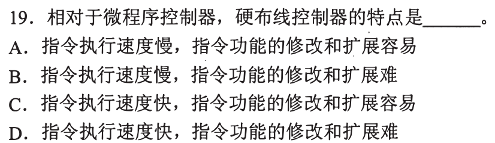
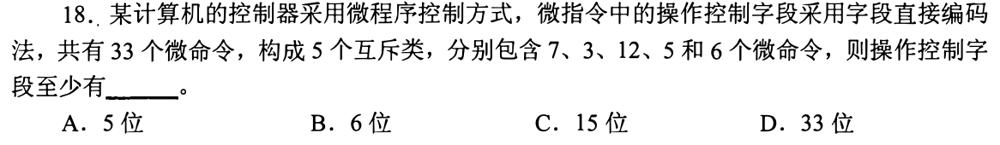
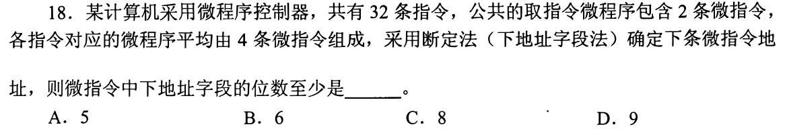
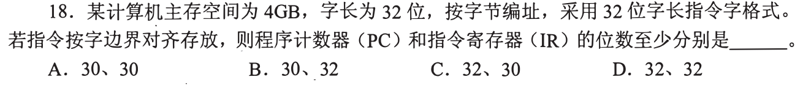
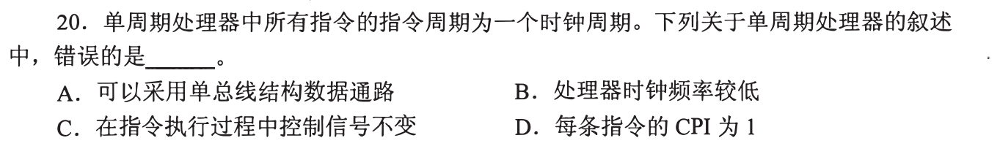
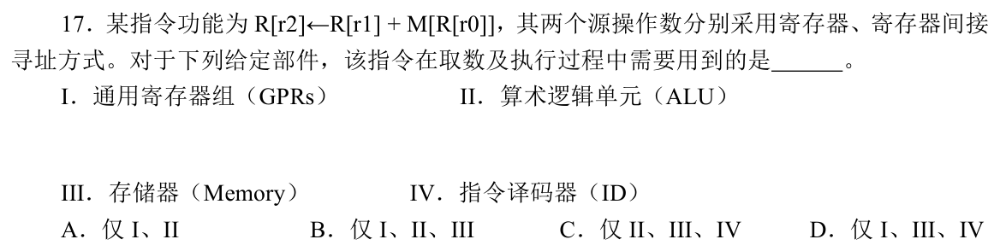
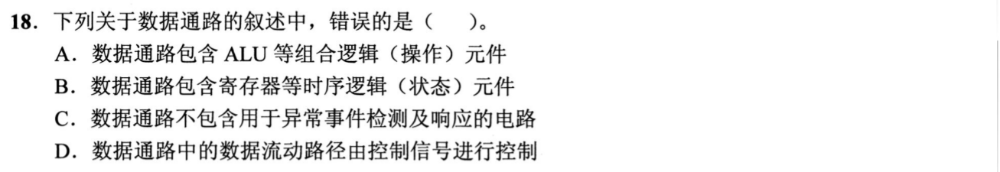
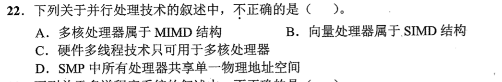
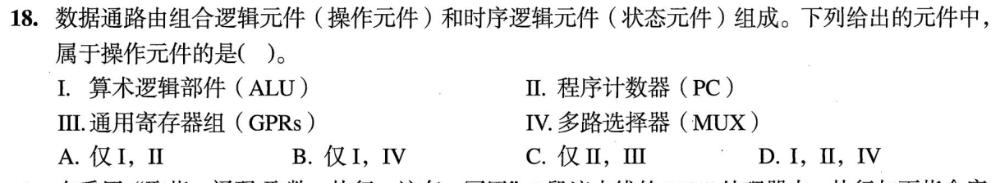
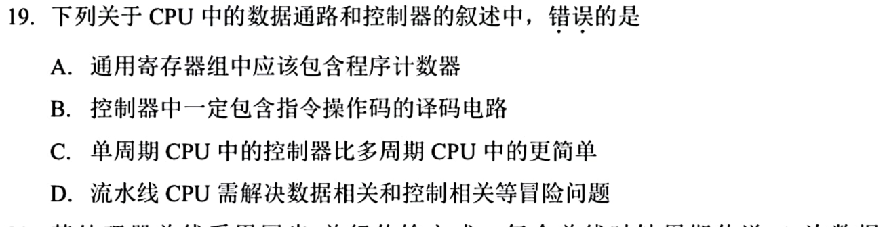

[« 0818-answer](0818-answer.md)　　[0820-answer »](0820-answer.md)

# 0819 Answer｜数据通路：状态元件、操作元件与控制信号

> [原题 12 题](0819.md) · [0818 ISA 与控制](0818-answer.md) · [能力账本](answer-quality/learning-ledger.md)
>
> 上一节点区分 ISA 可见接口与内部实现；本节点走进内部：**寄存器保存状态，ALU/MUX 组合产生结果，控制器让路径在合适时刻工作**。微程序和硬连线是产生控制信号的不同方法。重复 PC 可见题直接回链。

<strong>12 题考场速查</strong>

| 题 | 第一笔 | 答案 |
| --- | --- | --- |
| [01](#q01) | 硬连线快，改功能需改电路 | D |
| [02](#q02) | 0818-02：PC 对汇编语义可见 | B |
| [03](#q03) | NOP 仍取指，PC 等寄存器会变 | C |
| [04](#q04) | 每互斥组各取上整 log₂，和为 15 | C |
| [05](#q05) | 32×4+共用 2 条，至少 8 位微地址 | C |
| [06](#q06) | PC 只需 2³⁰ 个对齐指令位置，IR 32 位 | B |
| [07](#q07) | 单总线需分时传送，无法一周期完成全部微操作 | A |
| [08](#q08) | 取数、加、写回用 GPR/ALU/Memory | B |
| [09](#q09) | 数据通路可有异常检测/响应电路 | C |
| [10](#q10) | 硬件多线程也可在单核 | C |
| [11](#q11) | ALU/MUX 操作，PC/GPR 保存状态 | B |
| [12](#q12) | PC 是特殊寄存器，不在通用寄存器组 | A |

## 01｜2009-19：硬连线快，改控制逻辑难

硬连线控制把指令译码、时序状态等连成电路直接产生控制信号，通常比按微指令序列读取控制存储器快；但要修改/扩展指令功能，可能需改硬件逻辑，灵活性较低。因此 **快、难，选 D**。题问“相对微程序”的典型取舍，别把微程序易于调整误赠给硬连线。

两种方式都在控制同一条数据通路

同一个“让寄存器把值送进 ALU、把结果写回”的控制动作，可由硬连线逻辑组合得出，也可由微指令里的控制字段指定。改变的是控制信号来源，不是机器程序突然换一种 ISA。流水线和复杂实现可能融合多种方法，本题只比较课程中的基本典型。

## 02｜2010-18：PC 可见原题回链

与 [0818-02](0818-answer.md#q02) 同题：汇编程序能通过转移和相对寻址感知/影响 PC，**选 B**；MAR/MDR/IR 属硬件内部路径。本节点只增加：PC 虽是数据通路里的**状态元件**，并不等于它在通用寄存器组中，12 将专门裁决这点。

程序员可见与存储位置分开

PC 是专用的程序控制状态，决定下一条取指地址；通用寄存器组通常装一般操作数、地址等。一个寄存器可对程序语义可见，却仍不是“通用寄存器组的一个普通条目”。

## 03｜2011-19：NOP 不改普通操作数，仍会推动 PC

题设无 Cache/预取且处于开中断状态。每条指令要取指访问内存，指令周期至少一个时钟周期；每条执行结束可能响应外部中断。C 声称空操作指令周期里“任何寄存器内容都不会改变”是错的：**取完 NOP，PC 已指向下一条**，IR 也可载入这条 NOP，**选 C**。

空操作“空”的范围

NOP 不执行额外的显式算术或数据写回，但 CPU 仍要取、译这条指令并推进控制流。若把“无操作数效果”扩成“整台机器无状态变化”，就会忘记 PC、IR 和可能的时序/中断状态。问所有寄存器时，只需找到 PC 一个反例。

## 04｜2012-18：互斥组内编码，组与组同时给控制

33 个微命令分成大小 `7,3,12,5,6` 的 **5 个互斥组**。每组一次只选其中一个命令，需位数分别为 `⌈log₂7⌉=3`、`⌈log₂3⌉=2`、`⌈log₂12⌉=4`、`⌈log₂5⌉=3`、`⌈log₂6⌉=3`，共 **15 位，选 C**。不要对总共 33 个命令只取 `⌈log₂33⌉=6`：那只许所有组总共发一条，而组间可以并行发令。

组内互斥、组间并行分别改变计数

同一组可用二进制字段表示一个被选微命令，组之间要各自有字段，微指令里可同时控制若干不冲突动作。具体编码常还需一个“不发此组命令”的码位，题目给出的选项按每组数量直接取位数；本组大小均非 2 的整数幂，预留空码也仍在上述位数内。

## 05｜2014-18：断定法微地址字段能指出全部微指令

32 条机器指令各自微程序平均 4 条，另有共用取指微程序 2 条，按题给平均数计算微指令总量 `32×4+2=130`。下地址字段要能编号至少 130 个位置：`2⁷=128` 不够，`2⁸=256` 足够，故 **8 位，选 C**。先算需要编号的微指令位置，再取对数；不是只用 32 条机器指令取 5 位。

为什么“共用”只加一次

每条机器指令都会经历取指，但同一段取指微程序可共享，控制存储器里只放这两条一次。若把它为每条机器指令重复存 32 份，会虚增容量；这里即使多算也可能落到相同位数，但算式应尊重共享。断定法用微指令里的下地址字段指定后继微地址。

## 06｜2016-18：对齐让 PC 可省两位，IR 仍须放整条指令

4GB 按字节编址共有 `2³²` 个字节地址，指令 32 位=4 字节且按字边界对齐，指令首地址只可能为 `0,4,8,…`，共有 `2³²/4=2³⁰` 个位置。因此若 PC 存**指令位置编号**，至少 **30 位**即可；IR 要容纳完整 32 位指令，至少 **32 位，选 B**。

与 0817-01 的“PC 每字节加一”并不矛盾

0817-01 明确设 PC 保存字节地址并每取一字节加 1；本题问“至少位数”，又给定每条指令固定 4B 且对齐，允许 PC 内部存去掉恒为零的低 2 位的位置编号，送主存时补回 `00₂`。若实现选择保存完整字节地址，也可用 32 位，但不是这里的最小值。

## 07｜2016-20：单周期不能用一条总线分时搬完全部数据

单周期处理器要求一条指令的取指、取数、执行及写回在一个时钟周期内完成。单总线结构让多次数据传送共用同一条总线，需要分时安排多个微操作，不能满足这种单周期数据通路，所以 **A 错，选 A**。B 正确：周期必须覆盖最慢指令的完整路径，时钟频率通常较低；C 正确：对同一条指令，组合控制信号在该周期内保持相应设置，不能把“不同指令需要不同信号”当成“本条指令内要分阶段切换”；D 正确：每条指令恰用一拍，CPI=1。

区分 CPI=1 与时钟频率高

一条指令一个周期，却要把取操作数、ALU、可能访存、写回等路径容入同一个周期；周期时长由最慢指令路径约束，频率可能较低。CPI=1 是“每条指令经历多少周期”，频率是“一秒有多少周期”，两个数字不能互相代替。

## 08｜2019-17：取数与执行需要寄存器、ALU、存储器

指令 `R[r2]←R[r1]+M[R[r0]]`：先从通用寄存器取 `r0` 的间接地址和 `r1` 的操作数，再从存储器读该地址的数据，ALU 相加，结果写回通用寄存器 `r2`。因此取数及执行用 **I、II、III，选 B**。题问这两个阶段的功能部件，不把前面**译码阶段**的指令译码器 IV 强行计入。

沿箭头追一遍数据

`R[r0] → Memory 地址`，`M[R[r0]]` 与 `R[r1]` 分别进 ALU 两端，`ALU 和 → R[r2]`。每个箭头都对应一个被选部件。译码器先辨明指令类别、字段，产生控制意图，但取数/执行时真正搬运和处理数值的是这三类部件。

## 09｜2021-18：数据通路也参与异常检测与响应

ALU、MUX 等组合元件与寄存器等时序元件共同构成数据通路；数据如何流由控制信号决定。C 宣称数据通路**不包含**异常事件检测与响应相关电路过于绝对，例如算术溢出检测、地址错误相关状态也沿数据路径产生并参与响应，故 **错误选 C**。别把“控制器决定动作”误推为“所有异常检测都只能在控制器里”。

数据与控制的边界不是一刀切的物理盒子

ALU 的计算同时可产生溢出/零等状态，地址形成也可触发检查，状态位随后影响控制。控制器接收这些信号并决定下一步，但检测电路可属于数据通路的运算与状态部分。做题先找 C 的绝对否定“**不包含**”，用一个具体溢出信号反驳即可。

## 10｜2022-22：硬件多线程不限于多核

多核各核可执行不同指令流，属 MIMD；向量处理器同一指令操作多数据，属 SIMD；SMP 处理器共享统一物理地址空间。C 说硬件多线程**只可用于多核处理器**错误：单核也可在硬件里保存多个线程状态，并在不同周期或执行资源间切换/交错，**选 C**。

“同时存在多个线程状态”不要求多个核

一个核也能有多个硬件上下文，遇到等待或借助并行执行单元时调度不同线程；多核只是另一层并行结构。SIMD 的“一个指令、多份数据”和硬件多线程的“多个线程状态”也不是同义词，按 Flynn 分类和线程实现分别判断。

## 11｜2023-18：ALU/MUX 是操作元件，PC/GPR 是状态元件

ALU 用输入组合出算术/逻辑结果，多路选择器 MUX 根据选择信号把一路输入送到输出，属于**组合逻辑操作元件 I、IV，选 B**。PC 与通用寄存器组在时钟边沿前后保存数值，属于时序逻辑状态元件。判断第一笔是“输入变了输出随即组合变化，还是能在时钟间保存旧值”。

MUX 不做加法，也仍是操作元件

操作元件不只指 ALU 算术；MUX 在数据通路里实施“从哪条来源取值”的选择，是一个实际组合操作。寄存器也可能带加一/装载控制，但其核心角色是存状态；PC+4 中的加法器是操作元件，PC 本身仍是状态元件。

## 12｜2025-19：PC 是专用状态，不在 GPR 组中

题问**错误**。控制器需译码指令操作码，单周期控制常比多周期控制简单，流水 CPU 要解决数据与控制相关。A 称“通用寄存器组中应该包含程序计数器”错误：PC 是专门保存取指位置的**专用寄存器**，可接入数据通路却不因此属于 GPR 组，**选 A**。与 02 的“PC 程序员可见”并不冲突。

三个集合别混用

“在 CPU 里”“属于数据通路状态元件”“属于通用寄存器组”是不同范围。PC 可以在前两个范围内，同时不属于第三个；GPR 组主要提供指令可编码选择的一般操作数寄存器。即便某些 ISA 允许特殊方式读写 PC，也不能推成所有实现都应把它放进 GPR 组。

## 0819 收束｜沿一次指令看三种角色

寄存器提供和保存状态，ALU/MUX 计算或选路，控制器给出写使能、源选择等信号；微地址或硬连线决定这些信号如何产生。解题时先问对象是状态、组合操作，还是控制来源；遇到“总是、不包含、只可”则用一个真实路径反例检查。下一节点再把一条指令拆成连续微操作，不从 CPU 全章重讲。

[« 0818-answer](0818-answer.md)　　[0820-answer »](0820-answer.md)
