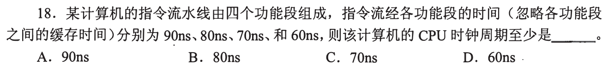
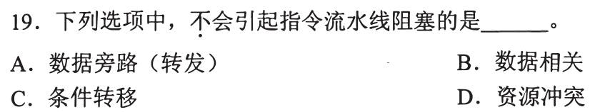
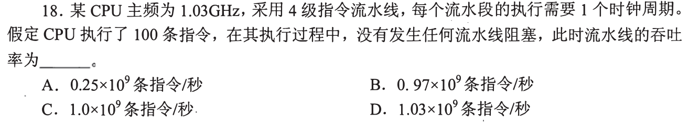
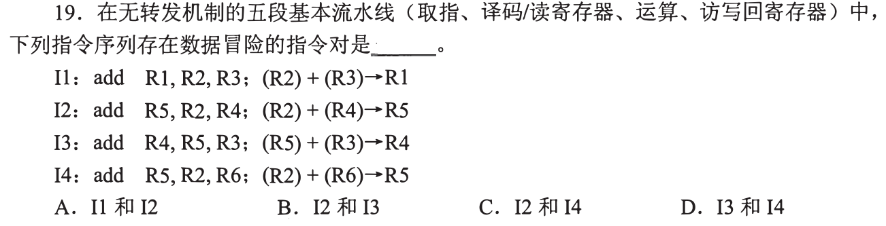
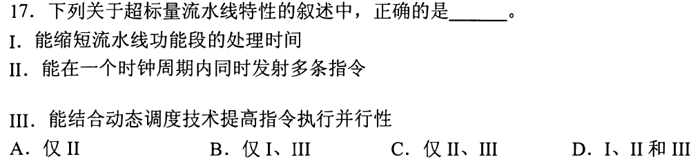
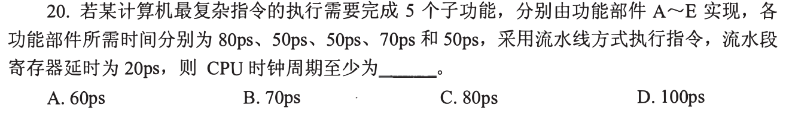
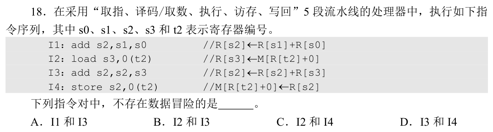
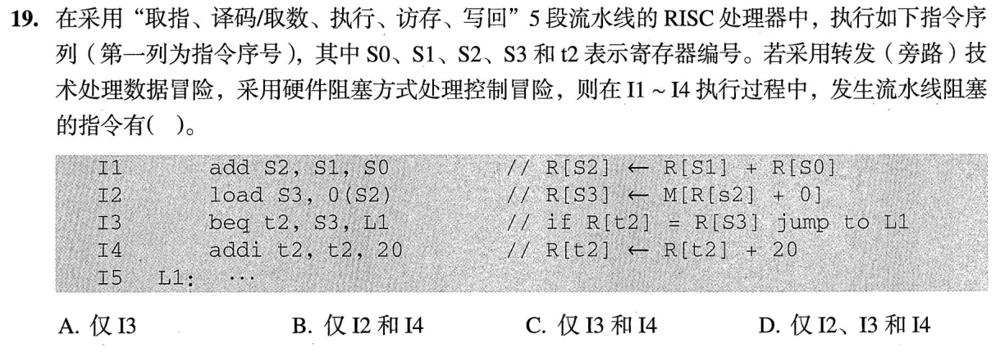
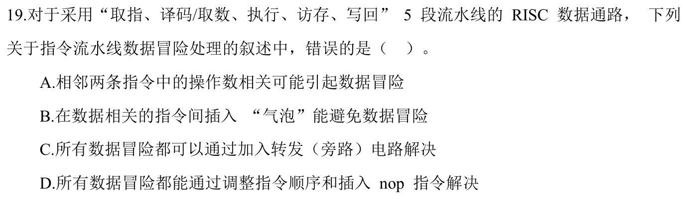

[« 0819-answer](0819-answer.md)　　[0821-answer »](0821-answer.md)

# 0820 Answer｜流水线：结果何时产生，下一条何时需要

> [原题 14 题](0820.md) · [0819 数据通路](0819-answer.md) · [能力账本](answer-quality/learning-ledger.md)
>
> 0819 已知道 ALU、存储器、寄存器和控制部件各做什么。本节点给它们加**时间轴**：最慢流水段决定周期，数据产生时刻与下一条需要时刻决定能否旁路，分支结果决定后续取指能否保留。重复的原题回链，不重复整章。

<strong>14 题考场入口</strong>

| 题 | 第一笔 | 答案 |
| --- | --- | --- |
| [01](#q01) | 最大阶段 90ns | A |
| [02](#q02) | 转发是化解相关的办法 | A |
| [03](#q03) | 0818-03 原题：三项均利于流水 | D |
| [04](#q04) | 100 条四段需 103 周期 | C |
| [05](#q05) | I2 写 R5，I3 随即读 R5 | B |
| [06](#q06) | 超标量多发射，配合动态调度 | C |
| [07](#q07) | 数据通路不包含生成控制信号的控制部件 | A |
| [08](#q08) | 最慢 80ps + 寄存器 20ps | D |
| [09](#q09) | I2 与 I4 无直接读写相关 | C |
| [10](#q10) | 单周期与稳态单发射基本流水 CPI=1 | B |
| [11](#q11) | load 后立即用 + 分支，I3/I4 阻塞 | C |
| [12](#q12) | load-use 不能只靠旁路消除 | C |
| [13](#q13) | Cache 缺失停顿会改变程序 CPI | B |
| [14](#q14) | 0819-12 原题：PC 非 GPR 必含 | A |

## 01｜2009-18：最慢段卡住整条流水的节拍

四段分别为 90、80、70、60ns。流水线各段同一个时钟节拍，必须让**最慢的 90ns 阶段**完成，忽略段间寄存器时间时周期至少 **90ns，选 A**。总和 300ns 接近单条指令穿越全部段的工作量，不是相邻指令能进入流水的节拍。

为什么其他三段的空余时间不能借给最慢段

每个周期各段处理不同指令，段间寄存器在同一节拍边界传递结果；快段不能在本周期将余下 10、20、30ns 直接送给另一个段。现实还要加寄存器建立/传输等开销，08 就会补这一项。

## 02｜2010-19：转发是处理数据相关的技术，不是阻塞来源

数据相关、条件转移、共享资源冲突都可能让后续指令等待。**数据旁路/转发**把已产生的结果送到后续所需输入，是减少阻塞的办法，所以题问“不会引起阻塞”应 **选 A**。关键分清“问题”与“针对问题安装的通路”。

转发不是万能：先看值是否已经出现

若前条 ALU 结果已经在执行段末产生，下一条可旁路取得；若前条 load 必须到访存段末才读回数据，紧跟的指令在其执行段开始时可能仍拿不到，仍需气泡。题目只问转发机制本身不会制造冒险，不保证所有数据冒险被消除。

## 03｜2011-18：重复的规整指令、对齐与 Load/Store 题

与 [0818-03](0818-answer.md#q03) 相同：指令格式规整、指令/数据对齐和仅 Load/Store 访存都利于划分稳定的流水阶段，**I、II、III 全部成立，选 D**。本节点只新增：这些条件降低阶段时间与资源的不确定性，却仍需具体处理相关与分支。

利于流水不是保证无停顿

Load/Store 的规则路径让执行更容易分段，但 load 后立刻消费结果依旧可能产生数据冒险；对齐减少跨界访存，却不消除 Cache 缺失。将“结构便于流水”与“执行中是否有阻塞”分开。

## 04｜2013-18：有限条数的吞吐率先计装满、排空

四级流水，无阻塞时 100 条指令共需 `4+(100−1)=103` 个时钟周期，而不是 100 或 400。频率 1.03GHz，耗时 `103/(1.03×10⁹)=10⁻⁷s`；吞吐率 `100/10⁻⁷=1.0×10⁹` 条/秒，**选 C**。稳态极限接近 1.03G，但有限的 100 条还付了最初装入流水的 3 拍。

为何不是 0.25G 或 1.03G

0.25G 把一条指令的 4 个阶段当成不可重叠串行；实际流水可每拍进入下一条。1.03G 则直接拿频率当整个有限批次的完成速率，漏掉装填与排空。先画第一条完成于第 4 拍、以后每拍一条，就得到 103 拍。

## 05｜2016-19：读写寄存器列表找真正的 RAW

I2 `add R5,R2,R4` 写 R5；紧接 I3 `add R4,R5,R3` 读 R5，是**先写后读 RAW**，无转发的五段流水中 I3 可能在寄存器写回前读到旧值，**选 B**。I1/I2 都读 R2 不构成依赖；I2/I4 都写 R5 是同一目的地，但顺序五段流水不会因此产生本题所问的数据冒险。

看寄存器名字前先标角色

| 指令 | 读 | 写 |
| --- | --- | --- |
| I1 | R2,R3 | R1 |
| I2 | R2,R4 | R5 |
| I3 | R5,R3 | R4 |
| I4 | R2,R6 | R5 |

只有 I2 的写集与后继 I3 的读集相交。不要把 R4 在 I2 被读、I3 被写当成先写后读；方向反了，而且按序执行的流水通常不会让后者提前破坏前者所读的值。

## 06｜2017-17：超标量是多发射，非缩短单段时间

超标量处理器可在同一时钟周期发射多条指令（II），可结合动态调度增加可并行执行的指令（III）；它不自动**缩短各功能段本身的处理时间**（I）。故 **仅 II、III，选 C**。把“每周期能同时处理几条”与“每条在一段需多少时间”分开，便可排除 I。

多发射的保底画法

基本单发射每拍最多启动一条，超标量有多条并行通路或功能部件可在同拍启动多条；若依赖关系、分支或资源不够，实际吞吐仍可能低于理论宽度。动态调度帮助发现独立指令，不让同一 ALU 操作凭空变快。

## 07｜2017-19：控制器给信号，数据通路按信号流动

数据通路包括 ALU、通用寄存器组、取指部件等组合与时序逻辑；其数据流方向由控制信号指定。A 却把**生成控制信号的控制部件**也说成数据通路包含的部件，混了职责，故 **错误选 A**。上一节点已区分“让哪条路径打开”的控制来源与“实际搬运数据”的元件。

与异常检测电路题不矛盾

0819-09 说数据通路可包含由数据运算产生的溢出等检测电路；这不等于它包含整个负责译码并生成控制信号的控制器。边界看部件当前职责：产生运算状态可在数据路径，决定各寄存器写使能及 MUX 选择的是控制。

## 08｜2018-20：阶段最慢时间还要加流水寄存器延迟

五个功能部件需时 `80,50,50,70,50ps`，最慢是 80ps；每段之间的流水寄存器延时 20ps，时钟周期至少 **`80+20=100ps`，选 D**。与 01 的差别恰是 01 明说忽略段间寄存器，不能机械地只取最大阶段时间。

为何不是所有部件时间相加再加寄存器

流水线各级并行处理不同指令，周期由最慢级的组合工作加本级寄存器开销限制。五级延迟总和影响单条指令延迟，但后续指令可重叠，因此吞吐节拍不是 `80+50+50+70+50+…`。

## 09｜2019-18：只找真正的生产者与消费者

I1 写 s2，I3 读 s2；I2 `load` 写 s3，I3 读 s3；I3 写 s2，I4 `store` 读 s2。I2 和 I4 虽都使用基址寄存器 t2，I2 写的是 s3、I4 读的是 s2，没有彼此的生产/消费依赖，**不存在数据冒险，选 C**。不能见两个指令共享寄存器名字就算相关，读读共享是安全的。

把共享寄存器按读/写归类

| 对 | 交集 | 是否有 RAW |
| --- | --- | --- |
| I1→I3 | s2 先写后读 | 有 |
| I2→I3 | s3 先写后读 | 有，且可能需停顿 |
| I2→I4 | t2 均只读；s3 与 s2 不同 | 无 |
| I3→I4 | s2 先写后读 | 有 |

是否需要真正的气泡还要看结果何时产生及转发路径；本题只问是否**存在数据依赖造成冒险**。

## 10｜2020-17：CPI=1 的理想对象是单周期与单发射稳态流水

单周期 CPU 每条指令一个周期，理想 CPI=1（I）；基本单发射流水在稳定流动且无阻塞时每周期完成一条，理想 CPI 也为 1（III）。多周期 CPU 一条需多个周期（II 否）；超标量可一周期完成多条，理想 CPI 可小于 1（IV 不按 1 归类），故 **仅 I、III，选 B**。

CPI 与单条延迟为何不同

五段流水一条指令仍走五个阶段，但填满后可每拍退休一条，长程序的平均 CPI 接近 1；短程序还要付装填开销。超标量若每拍完成两条，平均 CPI=0.5。CPI 统计“周期/指令”，不是“每条指令跨了多少阶段”。

## 11｜2023-19：load-use 与分支控制分别造成阻塞

I1 的 ALU 结果 s2 可旁路给 I2 的 load 地址计算，I2 不必等它写回。I2 的 load 结果 s3 要到访存段末才出现，紧接 I3 `beq` 要用 s3 比较，**即使转发仍需等**，I3 有数据阻塞；分支由硬件阻塞处理控制冒险，下一条 I4 的取/执行需等目标确定，I4 也受阻塞。**I3、I4，选 C**。

两条时间线别合并

数据线：I1 加法在执行段产生 s2，可转发到 I2 执行段计算有效地址；I2 读主存在访存段末才得到 s3，I3 若太早进执行段就没有值。控制线：I3 比较后才能定继续 I4 还是跳 L1，题设采用**硬件阻塞**而非预测取错后冲刷，故 I4 等待。转发只搬已经出现的值，无法让访存提前完成。

## 12｜2024-19：所有冒险都能加气泡解决，旁路不能解决所有冒险

相邻指令的操作数相关可能形成 RAW；加气泡可让消费者推迟到生产者写完，调整无依赖指令或插 NOP 也可隔开。C 声称**所有**数据冒险都可仅靠旁路解决，反例就是 load-use：载入值在访存结束前不存在，紧随其后的执行阶段即便接旁路线也没有值可取，所以 **错误选 C**。

考试反例只需两个指令

`load R1,0(R2)`；`add R3,R1,R4`。第一条先完成内存读取才能把 R1 的新值送出，第二条紧邻时过早需要它。旁路可缩短等待，但仍常需一个停顿；若插入与 R1 无关的指令，才可利用时间差填满空隙。

## 13｜2025-18：Cache 缺失会让平均 CPI 变大

题问**错误**。不同指令可有不同 CPI；单周期时钟要覆盖最慢指令路径；流水时钟要覆盖最长阶段路径。B 说程序 CPI 与 Cache 缺失率无关不成立：取指或访存缺失可使流水等待更多周期，平均周期数随缺失频率和代价变化，**选 B**。

把频率和惩罚放进一个直觉式

程序平均 CPI 可粗写成理想 CPI 加上 `每指令缺失次数 × 每次额外等待周期` 等停顿项。若 Cache 缺失率升高且缺失代价不为零，等待通常增多。CPI 是“实际花的周期/指令”，不同于 CPU 时钟周期长度；一个变长，不一定另一个变长。

## 14｜2025-19：PC 不在 GPR 组，原题回链

这与 [0819-12](0819-answer.md#q12) 是同一题：PC 是专用的取指位置状态，A 说通用寄存器组**应该包含 PC**错误，**选 A**。放在流水节点的新增视角是：不同流水阶段持有/更新 PC 相关状态，也不把 PC 变成一般 GPR。

不要把流水寄存器也叫通用寄存器

流水段间寄存器保存指令字段、PC 相关值和阶段结果，服务于时序隔离；GPR 组是 ISA 机器指令通常可以编号访问的操作数寄存器集合。两者都保存位，但用途和可见性不同。

## 0820 收束｜先画“产生—需要”的两列时刻

流水时钟看最长阶段加段间开销；相关题看哪条写了什么、哪条何时要读，随后问值在那时是否已产生。若未产生，旁路无从转发，只能等待或用独立指令填空。控制冒险则问分支目标何时确定。把长推理压成这几笔，才有机会在考场一两分钟内稳做；独立限时复做仍需实际验收。

[« 0819-answer](0819-answer.md)　　[0821-answer »](0821-answer.md)
