[← 0820](0820.md) · [总索引](README.md) · [0822 →](0822.md)

# 0821｜性能方程：时间由多少工作和每步多慢共同决定

> 能力线 `22-performance` · 第 22/40 个节点 · 12 道真题引用
>
> [12 题讲解](0821-answer.md) · [闭卷复盘](../review/main.md#r0821)

## 故事梗概

主频、CPI、指令数和执行时间必须在同一方程中解释。优化通常只改变其中一部分，真正的速度提升要看变化能否传递到总时间。

这里的日期是链表节点，不是完成期限；是否前进，由这条能力线能否从题干恢复决定。

## 题单

### 01 · 2010-12

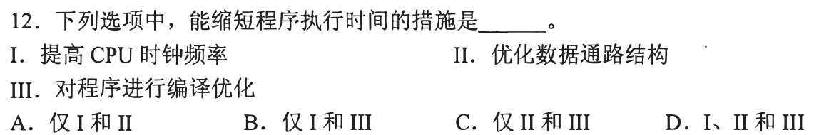

### 02 · 2011-12

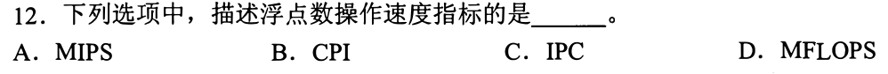

### 03 · 2012-12

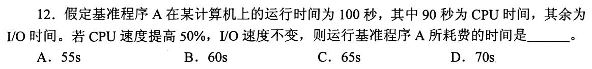

### 04 · 2013-12

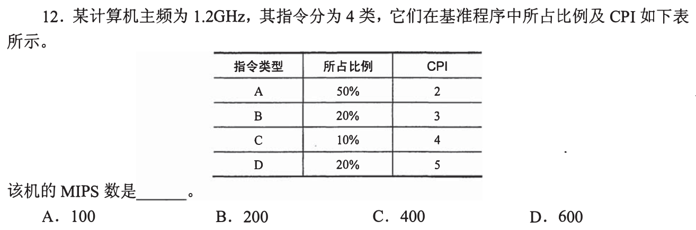

### 05 · 2014-12

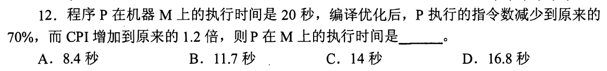

### 06 · 2017-12

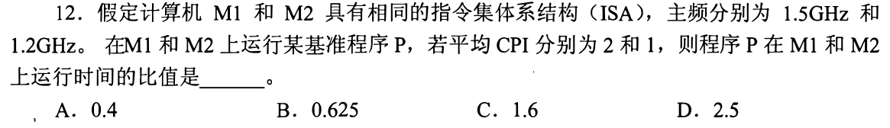

### 07 · 2019-16

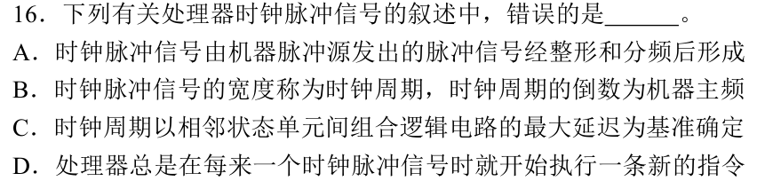

### 08 · 2020-17

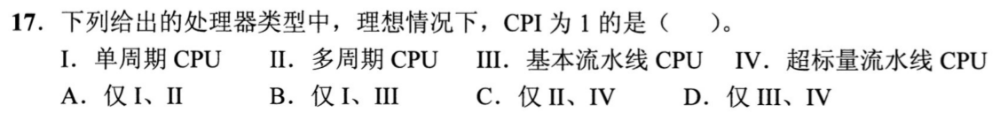

### 09 · 2021-12

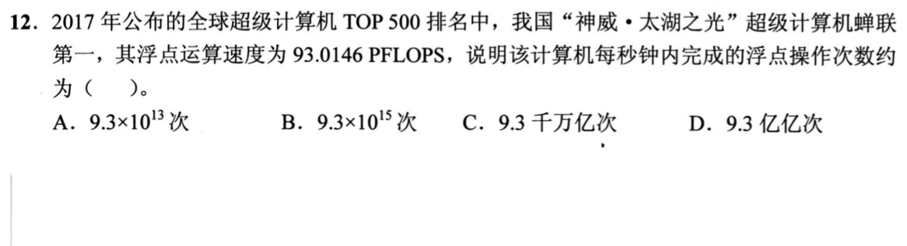

### 10 · 2022-12

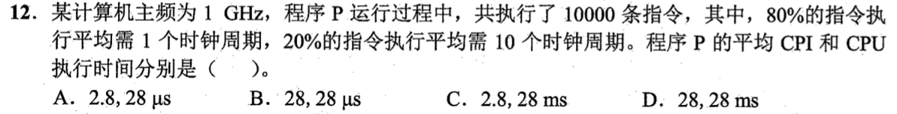

### 11 · 2023-12

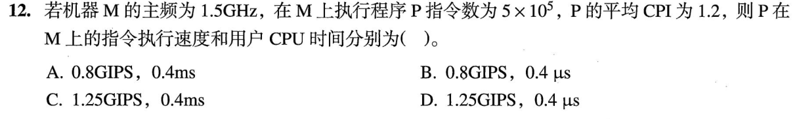

### 12 · 2025-18

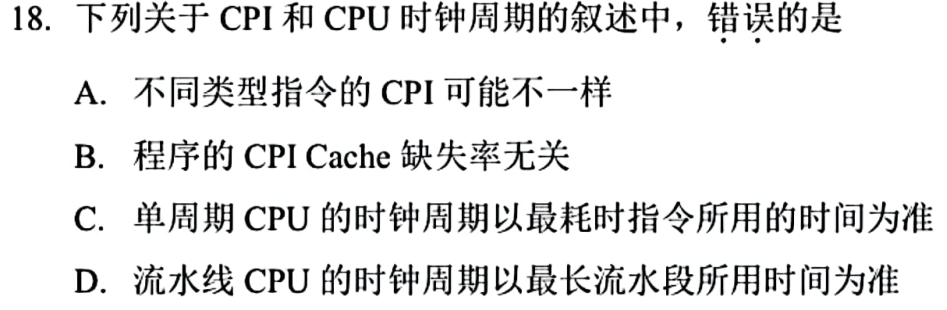

[← 0820](0820.md) · [总索引](README.md) · [0822 →](0822.md)
