[« 0821-answer](0821-answer.md)　　[0823-answer »](0823-answer.md)

# 0822 Answer｜传输时间：宽度、频率、事务与瓶颈

> [原题 18 题](0822.md) · [0821 性能方程](0821-answer.md) · [能力账本](answer-quality/learning-ledger.md)
>
> 上一节点用“工作量÷速度”算 CPU 时间；总线也一样，但要先问**一次传了多少有效数据、整个事务占几拍**。地址、等待、握手和读写方向都可能使有效带宽低于物理峰值。每题只展开自己的瓶颈，末尾可遮住答案速练。

<strong>18 题考场入口</strong>

| 题 | 第一笔 | 答案 |
| --- | --- | --- |
| [01](#q01) | 4B/2拍×10MHz | B |
| [02](#q02) | 排除 CRT/RAM/MIPS 等非总线名 | D |
| [03](#q03) | 像素×24位×85Hz，再除 50% | D |
| [04](#q04) | 握手信号是控制信息 | C |
| [05](#q05) | 地址 1 拍 + 128/32=4 拍数据 | C |
| [06](#q06) | USB 是串行，不同位同时并传的说法错 | D |
| [07](#q07) | 4B×双沿×66MHz | C |
| [08](#q08) | 一个首址后连续多个数据是突发 | C |
| [09](#q09) | 同步时钟不能由各设备各自提供 | C |
| [10](#q10) | 并行不必然比串行更快 | A |
| [11](#q11) | PCIe×16 是多条串行通道 | D |
| [12](#q12) | 宽度、频率、突发可增速，复用线不直接增速 | B |
| [13](#q13) | 1333 MT/s×8B×3 通道 | B |
| [14](#q14) | 2.4G×2B 有效载荷×双沿×双向 | C |
| [15](#q15) | 一次握手传一**份数据**，不限定一位 | C |
| [16](#q16) | 无突发：4 次独立地址+准备+数据 | D |
| [17](#q17) | 最大传输率：64位×双沿×420MHz | B |
| [18](#q18) | 1333 MT/s 已是传输次数，乘 8B | A |

## 01｜2009-20：先算一次传输究竟占几个时钟

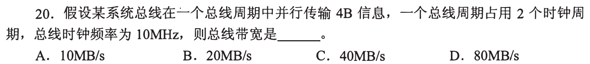

一个总线周期传 **4B**，这个总线周期又占 **2 个时钟周期**。10MHz 每秒有 10M 个时钟，但只能完成 5M 个总线周期，因此带宽 `5M×4B=20MB/s`，**选 B**。直接算 `10M×4B=40MB/s` 会漏掉“两拍才传一次”。

把单位带入同一个分式

`4 B/总线周期 × 1 总线周期/2 时钟周期 × 10⁷ 时钟周期/s=2×10⁷ B/s`。频率给的是**总线时钟**而非每秒总线事务数；按单位逐项消去能挡住看见“10MHz、4B”就相乘的路线。

## 02｜2010-20：先排除非总线缩写

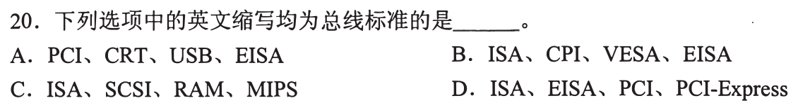

题问四个都属于总线标准的一组。ISA、EISA、PCI、PCI Express 都是总线/互连标准，**选 D**。其他组混入 CRT（显示器技术）、RAM（存储器）、MIPS（处理性能指标），即使其中某些缩写也是总线也不满足“均为”。第一笔找组里最明显的非总线项，不必逐个背完四组。

为何这题不适合展开各总线代际史

选项裁决只需分清对象类别。PCI Express 虽采用高速串行链路、技术形态不同于旧并行 PCI，仍属计算机互连标准；MIPS 此处指每秒百万指令，不是同类总线。记“每组找一个反例”的动作比背全名划算。

## 03｜2010-22：屏幕每秒位数只占总带宽一半

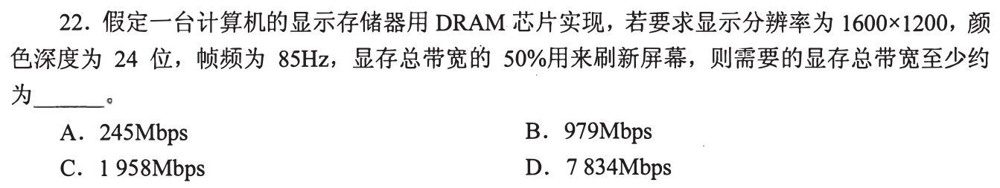

一帧有 `1600×1200` 像素，每像素 24 位，每秒 85 帧，刷新消耗 `1600×1200×24×85=3,916,800,000bit/s≈3917Mbps`。这只允许用显存总带宽的 **50%**，故总带宽至少约 `3917/0.5=7834Mbps`，**选 D**。题要 Mbps，别把 24 位先误当 24 字节。

50% 应该乘还是除

若总带宽为 B，刷新消耗 `0.5B`，所以 `B=刷新需求/0.5`。把 3917 再乘 0.5 会得到更小的总带宽，连屏幕自身所需的数据都传不完。题目只估计最低总带宽，未要求把消隐等额外开销加入。

## 04｜2011-20：握手属于控制线，不是数据线

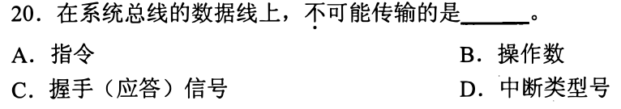

数据线传指令、操作数及可作为数据值的中断类型号；握手/应答信号表示“准备好了、已收到”等**控制状态**，应走控制线，故在数据线上**不可能传的是 C**。不要把“总线传过该信号”和“在数据线传”混成一件事。

中断类型号为何可在数据线上

类型号是一个数值，用来告诉 CPU 请求对应哪一中断向量/处理程序；其触发、确认等时序信号属于控制。一次总线事务可能同时使用地址线、数据线和控制线，问具体线时先看信息是数值载荷还是操作/时序命令。

## 05｜2012-19：突发减少重复地址，不让数据拍消失

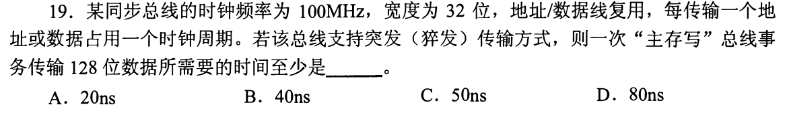

100MHz 的时钟每拍 10ns；地址/数据线复用，首地址占 **1 拍**。总线每数据拍宽 32 位，写 128 位需 **4 拍**；突发模式让后续连续数据无需再逐字送地址，总计 `1+4=5` 拍，即 **50ns，选 C**。

没有突发时可能发生什么

若四个数据单元分别完整发起事务，地址可能也要为各单元重复传，至少多出若干地址拍。这里题明确一次“主存写”支持突发，地址只送一次。20ns 不够传完四份 32 位数据；40ns 漏了首地址拍。

## 06｜2012-20：USB 的串行不表示慢，也不表示同时两位并行

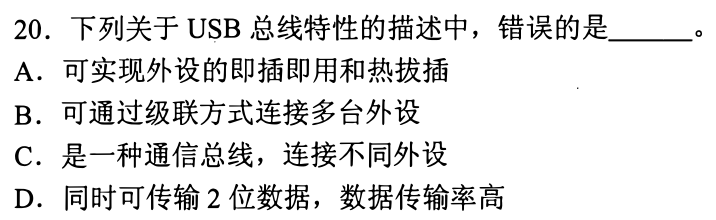

USB 支持热插拔、即插即用，可级联多台设备，是通用串行总线。D 声称它“**同时传输 2 位数据**”作为并行宽度是错误的，**选 D**。名称里的 Serial 先裁决传输方式；速度高低不能从“串行”二字直接推出。

物理差分信号和数据并行位数别混

一对差分线可用两个相反电平可靠承载同一串行信息，并不是同一时刻发两位独立数据。USB 的版本与速率可不同，本题不需要背具体 Mbps；只需挡住把“两根信号线”误作“并行传两位”的跳步。

## 07｜2014-19：双沿各传一次，最大每拍两份数据

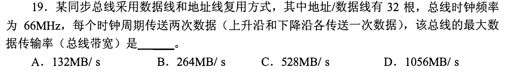

32 根地址/数据复用线在传数据时一次给 **32 位=4B**，每个 66MHz 时钟周期的上升沿、下降沿各传一次，即每拍 8B。最大速率 `66M×8B=528MB/s`，**选 C**。题问最大数据传输率，按连续数据阶段算峰值；若问完整事务有效率，需另计地址/等待。

复用线为什么在这里没额外除二

“地址/数据线复用”意味着不同时段发地址或数据，确实可能让实际事务有地址开销；但“最大带宽”按能够连续传数据时的物理上限。不能因为复用就固定把速率减半，也不能忘了双沿而只得 264MB/s。

## 08｜2014-20：给一次首地址、连续多份数据叫突发

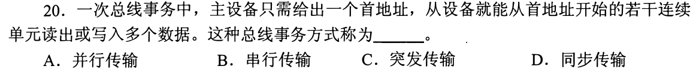

主设备只送一个首地址，从设备从此地址连续读写多个单元，描述的是**突发传输，选 C**。并行/串行回答“数据位如何在导线上排列”，同步回答“时钟/握手如何配合”，都不直接回答“一次事务送几个相邻数据”。

与 05 的时间计算接上

突发能把地址/命令开销分摊给多个连续数据；若每份数据独立发地址，会多付重复事务开销。突发不意味着一拍同时发完全部数据，实际仍受总线宽度与每拍传输次数限制。

## 09｜2015-19：同步总线需要共同基准时钟

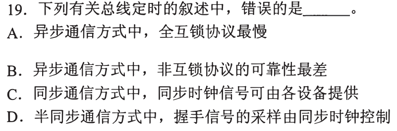

异步全互锁要等待双方握手完成，通常较慢；非互锁省去确认，可靠性较弱；半同步的握手信号可按同步时钟采样。C 说同步通信的**同步时钟信号可由各设备分别提供**，会失去共同时间基准，故 **错误选 C**。抓“同步”需要共享时序这一个不可缺条件。

握手与时钟分别解决什么

异步设备用请求/应答决定何时可继续，不要求全局固定节拍；同步设备按共同节拍规定信号何时有效。半同步把等待/应答并入共同节拍。每个设备若各自自由振荡、相位和频率不受约束，就不能把这些时钟直接当一个同步总线的共同基准。

## 10｜2016-21：并行线多，不等于必定更快

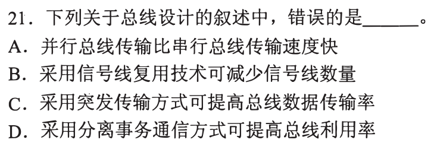

题问错误。线复用可少用线，突发可提高有效数据率，分离事务可让等待期间总线被别的事务利用。A 宣称**并行总线传输一定比串行快**不成立：高速串行可用更高频、差分信号和多条独立通道，实际带宽看宽度、每秒传输次数、编码与开销，**选 A**。

用带宽式拆“快”的含糊说法

理想速率约为 `每次有效数据量×每秒传输次数`；并行增宽可能受线间偏斜、同步与距离限制，串行虽每条链路一次较少位，却可能跑得更快并聚合通道。题目没有给数值比较，绝对说“一定”缺条件。

## 11｜2017-20：PCIe×16 是多条串行 lane

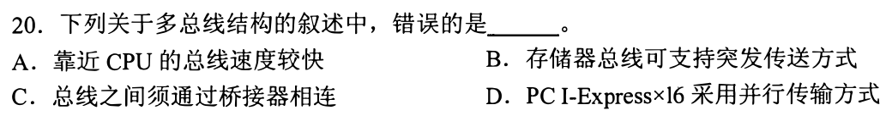

多总线靠近 CPU 的通常更快，存储器总线可支持突发，总线间可通过桥接器连接。D 说 PCI Express ×16 “采用并行传输方式”错误：它由 **16 条串行 lane 聚合**，**选 D**。多 lane 同时工作可带来高总吞吐，却不把每条 lane 改成传统多位并行总线。

×16 与 16 位并行不是同一维度

×16 指链路由 16 条独立高速通道构成，每条通道串行传输，接收端组合吞吐。并行总线一般让多位数据共享同一节拍作为一个宽字传；从“有 16 条”直接推出“单次并行 16 位”偷换了通道数与单 lane 传输方式。

## 12｜2018-21：宽、快、突发改善数据率，复用线主省引脚

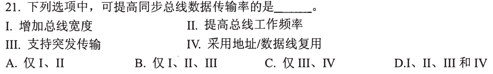

总线宽度增大，一次可传更多位；频率提高，每秒机会更多；突发把地址开销摊给连续数据，均能提高同步总线的数据传输率。地址/数据线复用主要减少引脚/导线，反而可能占用数据时段发地址，不是提升传输率的手段。故 **I、II、III，选 B**。

别把突发当增加物理峰值

突发通常提高**完整事务的有效率**，未必改变连续数据阶段物理峰值；宽度与频率则可直接提高理想峰值。题目笼统说数据传输率，三者均可帮助；复用线主要减成本，这一项不能凭“技术听起来先进”选上。

## 13｜2019-19：三通道把单通道字节率乘三

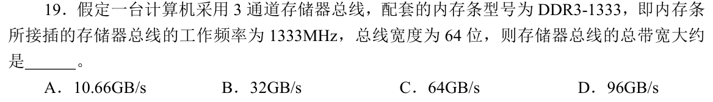

型号 `DDR3-1333` 的 1333 表示约 **1333 MT/s 的有效传输率**。按这一口径，每通道宽 64 位=8B，三通道带宽为 `1333×10⁶×8×3=31.992×10⁹B/s≈32GB/s`，**选 B**。题图把这个有效传输率称作“工作频率 1333MHz”，单位与术语不严谨；不能据此教成 DDR 的物理时钟和传输率总是相同。

型号传输率与物理时钟必须分开

DDR 每个物理时钟周期传两次数据。若 1333MHz 真指物理时钟，则三通道应为 `1333×10⁶×2×8×3≈64GB/s`，对应 C；这与题给 DDR3-1333 型号的有效传输率口径不同。按型号及常见命题口径取 B，同时保留题干术语混用的说明。只有明确把 1333 当成 MT/s 后，再乘二才是重复计数。[Kingston 对 MHz 与 MT/s 的说明](https://www.kingston.com/en/blog/pc-performance/mts-vs-mhz)也区分时钟周期数与数据传输次数。

## 14｜2020-19：全双工加的是两个方向的有效吞吐

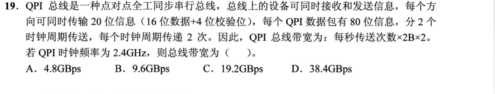

每个方向同时传 20 位，其中 **16 位有效数据+4 位校验**，因此有效载荷每次是 `2B`，不是 20/8B。2.4GHz、每拍传 2 次、双向同时工作，合计 `2.4G×2B×2×2=19.2GB/s`，**选 C**。先扣校验，再乘每拍次数，最后因题要总带宽而乘双向。

四个因子的实际含义

`2.4×10⁹ 拍/s`；`2 次/拍/方向`；`2B/次有效载荷`；`2 个方向`。题里 80 位一个包、分两拍传，说明每拍两次、每次每方向 16 位有效载荷，与上述乘积一致。只算单向是 9.6GB/s；连校验位也当数据会高估。

## 15｜2021-19：握手一次不等于只换一位

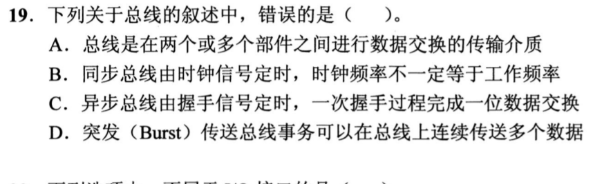

总线在部件间交换信息；同步总线的时钟频率与有效工作频率不一定相等；突发一次事务可连续传多个数据。C 却说异步总线“一次握手过程完成**一位**数据交换”，握手针对**一次数据传输单元/事务**，该单元可有多位，故 **错误选 C**。与 09 的时序对照，不把握手个数直接当位数。

用 32 位异步总线做反例

若一次异步请求/应答确认一份 32 位数据已稳定并被接收，这一握手传了 32 位而不是 1 位。具体位宽由数据线决定，握手负责双方速度协调。把“串行传一位”错套给“异步握手”是两种独立维度的混淆。

## 16｜2023-20：无突发，四个 64 位单元各有完整事务

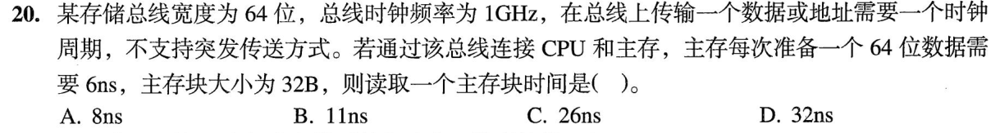

总线 1GHz，每拍 1ns；一个 64 位数据单元的独立读取需要地址传输 1ns、主存准备 6ns、数据传输 1ns，共 **8ns**。主存块 32B 包含 4 个 64 位单元，**不支持突发**，四次都付这三段成本，`4×8=32ns`，**选 D**。若只发一次地址会得 29ns，既违背“无突发”，也不在选项。

先把块拆成总线一次能传的份数

`32B/(64/8 B)=4`。题称传一个地址或数据占一拍，主存准备每个 64 位数据需 6ns；每份应有自己的地址、准备和返回。若支持突发，后续连续数据可能不重复地址，这道题正用“无突发”要求你付四次地址开销。

## 17｜2024-20：最大带宽用数据阶段的峰值

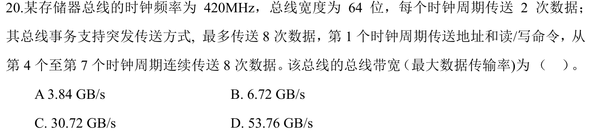

题问“总线带宽（最大数据传输率）”。总线宽 64 位，即每次 8B；时钟 420MHz，上、下沿各传一次，因此 **`420×10⁶×2×8=6.72×10⁹B/s=6.72GB/s`，选 B**。地址、等待拍会降低一笔完整事务的平均有效率，但不改变这里问的最大传输率。

7 拍事务平均值为什么不能替代最大带宽

一次突发传 8 份、共 64B，若从地址命令到结束共计 7 拍，其平均有效率为 `64B/7拍×420M拍/s=3.84GB/s`，对应 A。该数回答的是包括等待开销的事务平均率；本题明确限定“最大数据传输率”，应取连续数据传输阶段的双沿峰值 B。

## 18｜2025-20：1333 MT/s 已经包含 quadpumped 四次传输

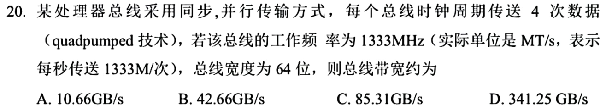

题特意说明“工作频率 1333MHz（**实际单位 MT/s，表示每秒 1333M 次传送**）”。这已经是传输次数，不要再乘四。一次 64 位=8B，带宽 `1333M次/s×8B/次≈10.66GB/s`，**选 A**。quadpumped 解释这个传输率怎样由较低基准时钟形成，并不是额外乘因子。

与 07 的双沿乘二究竟哪里不同

07 给的是 66MHz**时钟周期**，又说每周期两沿传输，需乘二；本题直接把给定数解释为 **MT/s 传输次数**，四次/周期已内含其中。考场先给数字标单位：`MHz 拍/s` 还是 `MT/s 次/s`，再决定是否乘每拍传输次数。

## 0822 收束｜总线题先选分母

峰值带宽看连续数据相位 `宽度×每秒传输次数`；完整事务有效率要把地址、等待、握手摊进时间分母。突发通常省重复地址，全双工要看题问单向还是双向，编码/校验位先扣成有效载荷。以 05、16、17、18 四题遮答案限时复做，能说清每一拍去哪，才算会解；能迅速选对哪个分母，才接近考场熟练。
