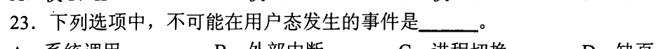
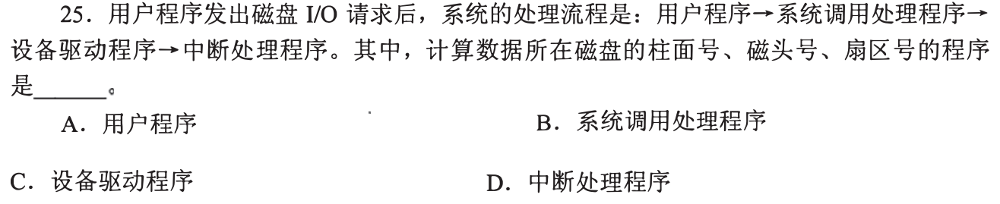
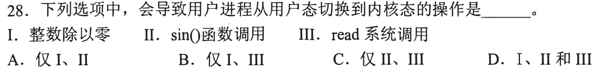
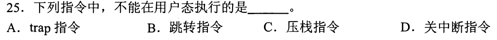
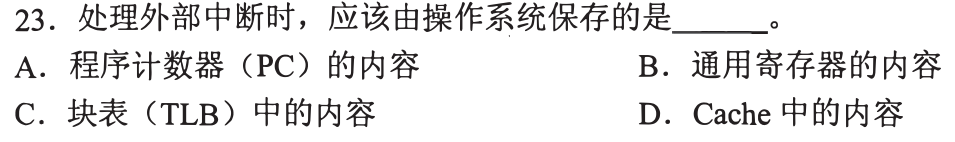
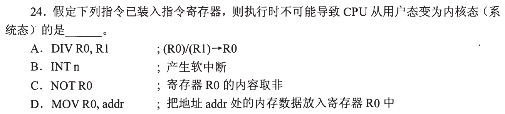
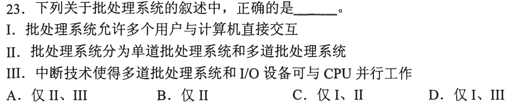
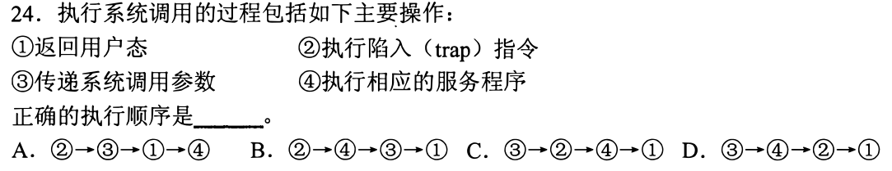
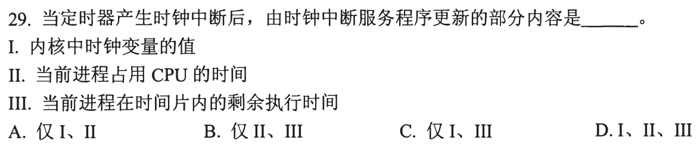

# 0824 Answer｜系统边界：应用如何进入内核

> [原题 25 题](0824.md) · [0823 I/O 路径](0823-answer.md) · [能力账本](answer-quality/learning-ledger.md)
>
> 已会区分 I/O 发起与完成；现在沿着一条执行时间线问：**谁触发、触发时在哪个态、谁来处理**。当前核准 01—10，后续题承接这些动作。

<strong>已核准题目的考场入口</strong>

| 题 | 第一笔 | 答案 |
| --- | --- | --- |
| [01](#q01) | 题问应用获得 OS 服务的接口 | A |
| [02](#q02) | “用户态发生”看触发时刻，切换过程由内核完成 | C |
| [03](#q03) | 逻辑位置转物理磁盘位置交给驱动 | C |
| [04](#q04) | 除零异常与 read 陷入，sin 普通库函数 | B |
| [05](#q05) | 关中断是特权操作 | D |
| [06](#q06) | 硬件存断点，OS 保存通用寄存器 | B |
| [07](#q07) | 普通寄存器取非不会触发陷入 | C |
| [08](#q08) | 批处理不直接交互，多道靠中断并行 | A |
| [09](#q09) | 先参数，再 trap，再服务，再返回 | C |
| [10](#q10) | 时钟中断更新时钟、CPU 时间、时间片 | D |

## 01｜2010-23：接口先问应用怎样请求 OS 服务

题目问“操作系统**提供给应用程序**的接口”。应用要读文件等受保护服务，可以发出**系统调用，选 A**。中断是外部或内部事件引出的控制转移，不是应用主动请求服务的接口；库函数是应用层可调用代码，其中有些会进一步发系统调用，但库函数整体不能等同 OS 的接口。第一笔圈出“提供给应用程序”，不要只看“程序可能调用什么”。

可复用的两层关系

`应用代码 → 库函数（可能有） → 系统调用 → 内核服务`。例如纯计算的库函数无需入内核，读文件的库函数可能封装系统调用。后题只需判断这条边界有没有跨过。

## 02｜2012-23：事件在哪个态发生，不等于后续在哪个态处理

原裁图截掉选项下缘；核对整份原卷，四项是系统调用、外部中断、进程切换、缺页。系统调用指令可以从用户态发出；用户程序运行时可遇到外部中断，也可在访问地址时触发缺页。**进程切换**需要内核保存/恢复进程上下文并调度，不能作为用户态执行的动作，**选 C**。第一笔把“触发/发起”和“处理/切换”分开。

为什么缺页与中断没有被排除

“用户态发生”说的是事件到达或故障被检测时 CPU 原来正在执行用户程序；之后处理程序会切到内核态。若理解为“整段中断处理都在用户态”，会误排外部中断和缺页。这与 0823 的缺页是内部异常、设备完成是外部中断可同时成立。

## 03｜2013-25：先把逻辑地址翻成设备能操作的位置

题已经给出 `用户程序→系统调用处理程序→设备驱动程序→中断处理程序`。问的是**计算磁盘柱面、磁头、扇区号**，这是把较高层请求变成设备具体定位参数，属于**设备驱动程序，选 C**。用户提出逻辑读写；系统调用负责进入内核、核验和分派；中断处理程序在设备完成后收尾，时机已晚。第一笔在题目的流程中定位“发命令之前须知道的位置”。

与上一题的接缝

用户态发起系统调用并不让用户程序直接控制磁盘；入内核后，驱动才处理设备差异。读题若问“谁把设备相关参数交给控制器”，通常先定位驱动；若问“完成后谁接到通知”，才定位中断处理。

## 04｜2013-28：看是否需要陷入，而不是看函数名

逐项在“用户程序正在执行”处画边界：整数除零触发同步异常，必须转入内核异常处理；`read` 是系统调用，主动陷入内核；普通 `sin()` 数学库调用可在用户态完成，不因“函数调用”三字自动切态。所以 **仅 I、III，选 B**。第一笔先问“谁有权处理这个事件”，再看是否跨越用户/内核边界。

不要把上一题的“库函数”背成一律不切态

`sin()` 这一项没有受保护的文件、设备等服务需求，普通实现可直接计算；有些库函数可能封装系统调用。判据是其实际执行是否要求内核服务，而非名称是否带括号。

## 05｜2014-25：用户态能执行普通指令，关中断必须受保护

跳转、压栈只是当前程序的控制与栈操作；`trap` 是用户程序主动陷入内核的指令，可以在用户态发起。**关中断**会改变 CPU 对外部事件的响应，若任意用户程序都能执行，就能长期阻止系统接管，所以它是特权指令，**选 D**。第一笔问该动作是否改变整个机器的受保护控制状态。

“能执行 trap”不等于“能执行内核服务代码”

用户执行陷入指令后，硬件切换特权级、转到内核指定入口；具体服务在内核态完成。它和用户直接执行关中断、控制硬件不是同一权限。

## 01—05 收束

慢练时每题先画“用户运行 → 事件触发/主动请求 → 内核处理 → 返回”。考场压缩为三问：**问接口？系统调用；问触发时刻？可在用户态；问受保护动作或设备具体控制？内核/驱动。**这五题提供判断工具，不代表已经独立计时熟练；盖住答案重做并在 1—2 分钟内说出排除理由，才标记为考场可用。

## 06｜2015-23：处理中断前，谁保存哪一种现场

题问“**由操作系统保存**”。中断入口的 PC/断点是控制转移所必需，通常由硬件中断响应保存；中断处理程序要使用原进程的**通用寄存器**，需由 OS 软件保存并在结束时恢复，**选 B**。TLB 与 Cache 不是每次外部中断都整份保存的通用寄存器现场。第一笔圈出“由 OS”，避免把“需要保存的状态”全交给一个执行者。

从 0823 的关中断、存断点继续

硬件必须先让中断服务程序能安全开始：保存可返回的控制状态并转到入口。服务程序才有机会按实际使用保存通用寄存器。架构细节可能不同，但本题四项的归属裁决只依赖“PC 控制转移硬件先管，通用寄存器软件保护”。

## 07｜2015-24：判断“不能切态”要逐条找陷入可能

`DIV` 若除数为零会有异常；`INT n` 明确产生软中断；从内存地址 `addr` 取数的 `MOV` 可能触发缺页或访存异常。`NOT R0` 仅把已在寄存器中的位取反，在题目通常执行条件下没有系统服务或可能访存故障，**选 C**。第一笔把选项分成“算术异常、显式陷入、访存异常、纯寄存器运算”，不必推测每条指令必然切态。

“可能”与“必然”两道门槛

除法不总是除零，访存不总是缺页；题问**不可能**导致切态，找到一种合理触发情形就能排除 A、D。`INT` 本身就是主动进入处理程序。纯寄存器 `NOT` 不访问待翻译的内存地址，减少了误判点。

## 08｜2016-23：批处理的多道，与人机交互分开

批处理作业提交后成批处理，不意味着多个用户与计算机**直接交互**，故 I 错。既有单道也有多道批处理，II 对；多道时一个作业等待 I/O，中断通知完成，CPU 可运行另一作业，使设备与 CPU 并行，III 对。**仅 II、III，选 A**。第一笔区分“同时装入多个作业”和“用户在线交互”两个维度。

III 为什么不是 CPU 同时执行两份程序

并行的是 CPU 运行另一个就绪作业与 I/O 设备执行请求；单核 CPU 不因中断技术同时执行两份指令流。中断让 CPU 不必持续轮询等待并能在设备完成时获知结果。

## 09｜2017-24：系统调用的四步按因果排序

服务程序得先拿到参数，用户程序先传递 **③**；随后执行 `trap` **②** 跨入内核；内核执行服务 **④**；最后返回用户态 **①**。顺序 **③→②→④→①，选 C**。第一笔抓“服务程序需要参数”与“返回必须在服务后”两条约束，就能直接排除其他排列。

参数何时真正被内核读取

用户程序可先将参数放在约定的寄存器或内存位置，然后执行陷入指令；内核入口再按照约定取用。这里的③是调用方的“传递/准备”，与内核进入后的参数验证不冲突。

## 10｜2018-29：一次时钟中断可以更新三个不同计时量

定时器发时钟中断，内核可累计系统时钟变量 **I**；把这一滴答计入当前进程已用 CPU 时间 **II**；若实行时间片调度，还要扣当前进程剩余时间片 **III**，到零再调度。三项都可能由时钟中断服务程序更新，**选 D**。第一笔问三个量各自是“系统累计、进程累计、进程倒计时”中的哪一个，不要因为方向有增有减就排掉一项。

与进程切换的先后

时钟中断本身在当前用户程序执行时到达；中断服务例程更新计时和检查时间片；若时间片用完，后续调度与进程切换在内核中发生。这与 02 题“进程切换不能在用户态执行”一致。

## 06—10 收束

做边界题先标主语：**硬件入口保存控制状态；OS 保存软件现场；用户程序准备参数并 trap；驱动处理设备具体差异；时钟中断在内核更新计时。**熟练度仍待用户盖答案限时重做确认。
