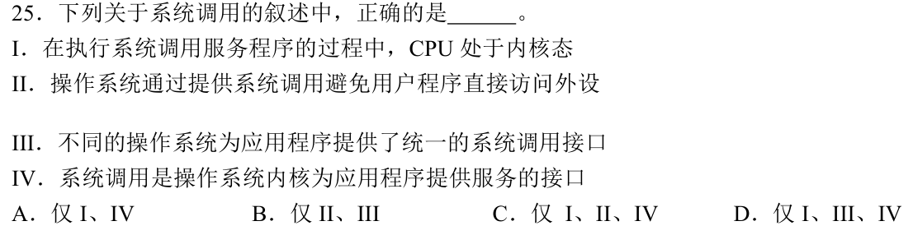
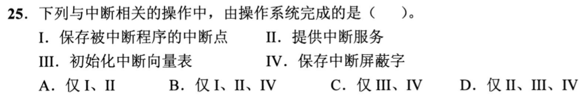
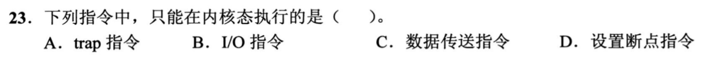
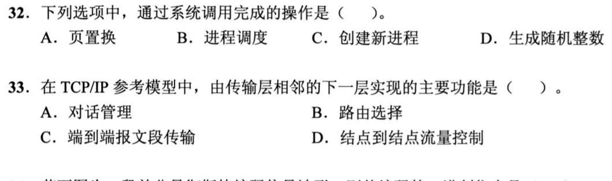
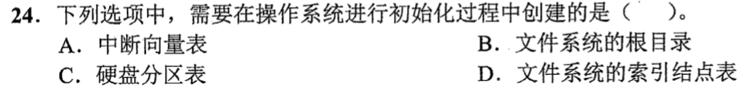
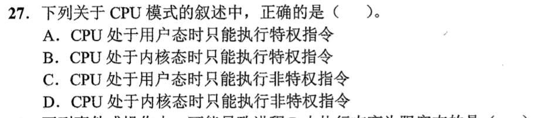
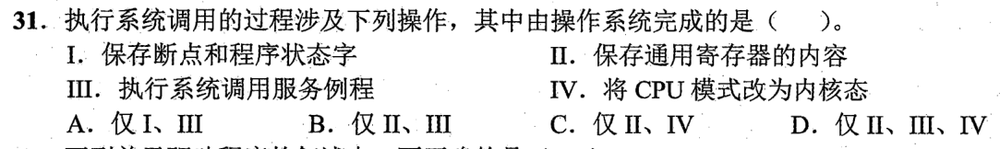
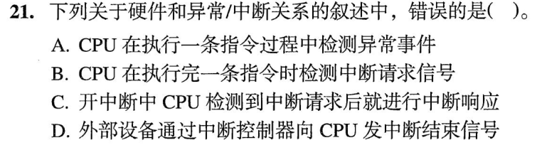
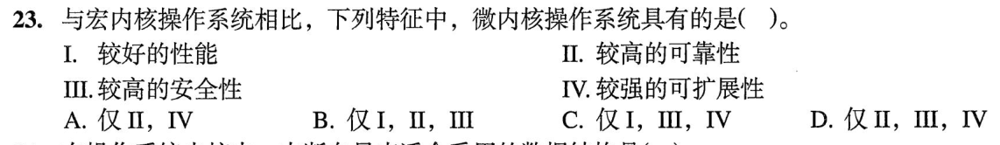

# 0824 Answer｜系统边界：应用如何进入内核

> [原题 25 题](0824.md) · [0823 I/O 路径](0823-answer.md) · [能力账本](answer-quality/learning-ledger.md)
>
> 已会区分 I/O 发起与完成；现在沿着一条执行时间线问：**谁触发、触发时在哪个态、谁来处理**。当前核准 01—20，后续题承接这些动作。

<strong>已核准题目的考场入口</strong>

| 题 | 第一笔 | 答案 |
| --- | --- | --- |
| [01](#q01) | 题问应用获得 OS 服务的接口 | A |
| [02](#q02) | “用户态发生”看触发时刻，切换过程由内核完成 | C |
| [03](#q03) | 逻辑位置转物理磁盘位置交给驱动 | C |
| [04](#q04) | 除零异常与 read 陷入，sin 普通库函数 | B |
| [05](#q05) | 关中断是特权操作 | D |
| [06](#q06) | 硬件存断点，OS 保存通用寄存器 | B |
| [07](#q07) | 普通寄存器取非不会触发陷入 | C |
| [08](#q08) | 批处理不直接交互，多道靠中断并行 | A |
| [09](#q09) | 先参数，再 trap，再服务，再返回 | C |
| [10](#q10) | 时钟中断更新时钟、CPU 时间、时间片 | D |
| [11](#q11) | 调用在内核，接口各 OS 不统一 | C |
| [12](#q12) | trap 是内部主动陷入，非外部中断 | A |
| [13](#q13) | 断点硬件保存，服务/向量表/屏蔽字由 OS | D |
| [14](#q14) | I/O 指令须特权态 | B |
| [15](#q15) | 应用可请求创建进程 | C |
| [16](#q16) | 中断向量表须在 OS 初始化时可用 | A |
| [17](#q17) | 用户态只执行非特权指令 | C |
| [18](#q18) | 硬件保存断点、切态；OS 保存 GPR 并服务 | B |
| [19](#q19) | 检测请求不等于当即响应 | C |
| [20](#q20) | 微内核利可靠、安全、扩展，额外通信损性能 | D |

## 01｜2010-23：接口先问应用怎样请求 OS 服务

题目问“操作系统**提供给应用程序**的接口”。应用要读文件等受保护服务，可以发出**系统调用，选 A**。中断是外部或内部事件引出的控制转移，不是应用主动请求服务的接口；库函数是应用层可调用代码，其中有些会进一步发系统调用，但库函数整体不能等同 OS 的接口。第一笔圈出“提供给应用程序”，不要只看“程序可能调用什么”。

可复用的两层关系

`应用代码 → 库函数（可能有） → 系统调用 → 内核服务`。例如纯计算的库函数无需入内核，读文件的库函数可能封装系统调用。后题只需判断这条边界有没有跨过。

## 02｜2012-23：事件在哪个态发生，不等于后续在哪个态处理

原裁图截掉选项下缘；核对整份原卷，四项是系统调用、外部中断、进程切换、缺页。系统调用指令可以从用户态发出；用户程序运行时可遇到外部中断，也可在访问地址时触发缺页。**进程切换**需要内核保存/恢复进程上下文并调度，不能作为用户态执行的动作，**选 C**。第一笔把“触发/发起”和“处理/切换”分开。

为什么缺页与中断没有被排除

“用户态发生”说的是事件到达或故障被检测时 CPU 原来正在执行用户程序；之后处理程序会切到内核态。若理解为“整段中断处理都在用户态”，会误排外部中断和缺页。这与 0823 的缺页是内部异常、设备完成是外部中断可同时成立。

## 03｜2013-25：先把逻辑地址翻成设备能操作的位置

题已经给出 `用户程序→系统调用处理程序→设备驱动程序→中断处理程序`。问的是**计算磁盘柱面、磁头、扇区号**，这是把较高层请求变成设备具体定位参数，属于**设备驱动程序，选 C**。用户提出逻辑读写；系统调用负责进入内核、核验和分派；中断处理程序在设备完成后收尾，时机已晚。第一笔在题目的流程中定位“发命令之前须知道的位置”。

与上一题的接缝

用户态发起系统调用并不让用户程序直接控制磁盘；入内核后，驱动才处理设备差异。读题若问“谁把设备相关参数交给控制器”，通常先定位驱动；若问“完成后谁接到通知”，才定位中断处理。

## 04｜2013-28：看是否需要陷入，而不是看函数名

逐项在“用户程序正在执行”处画边界：整数除零触发同步异常，必须转入内核异常处理；`read` 是系统调用，主动陷入内核；普通 `sin()` 数学库调用可在用户态完成，不因“函数调用”三字自动切态。所以 **仅 I、III，选 B**。第一笔先问“谁有权处理这个事件”，再看是否跨越用户/内核边界。

不要把上一题的“库函数”背成一律不切态

`sin()` 这一项没有受保护的文件、设备等服务需求，普通实现可直接计算；有些库函数可能封装系统调用。判据是其实际执行是否要求内核服务，而非名称是否带括号。

## 05｜2014-25：用户态能执行普通指令，关中断必须受保护

跳转、压栈只是当前程序的控制与栈操作；`trap` 是用户程序主动陷入内核的指令，可以在用户态发起。**关中断**会改变 CPU 对外部事件的响应，若任意用户程序都能执行，就能长期阻止系统接管，所以它是特权指令，**选 D**。第一笔问该动作是否改变整个机器的受保护控制状态。

“能执行 trap”不等于“能执行内核服务代码”

用户执行陷入指令后，硬件切换特权级、转到内核指定入口；具体服务在内核态完成。它和用户直接执行关中断、控制硬件不是同一权限。

## 01—05 收束

慢练时每题先画“用户运行 → 事件触发/主动请求 → 内核处理 → 返回”。考场压缩为三问：**问接口？系统调用；问触发时刻？可在用户态；问受保护动作或设备具体控制？内核/驱动。**这五题提供判断工具，不代表已经独立计时熟练；盖住答案重做并在 1—2 分钟内说出排除理由，才标记为考场可用。

## 06｜2015-23：处理中断前，谁保存哪一种现场

题问“**由操作系统保存**”。中断入口的 PC/断点是控制转移所必需，通常由硬件中断响应保存；中断处理程序要使用原进程的**通用寄存器**，需由 OS 软件保存并在结束时恢复，**选 B**。TLB 与 Cache 不是每次外部中断都整份保存的通用寄存器现场。第一笔圈出“由 OS”，避免把“需要保存的状态”全交给一个执行者。

从 0823 的关中断、存断点继续

硬件必须先让中断服务程序能安全开始：保存可返回的控制状态并转到入口。服务程序才有机会按实际使用保存通用寄存器。架构细节可能不同，但本题四项的归属裁决只依赖“PC 控制转移硬件先管，通用寄存器软件保护”。

## 07｜2015-24：判断“不能切态”要逐条找陷入可能

`DIV` 若除数为零会有异常；`INT n` 明确产生软中断；从内存地址 `addr` 取数的 `MOV` 可能触发缺页或访存异常。`NOT R0` 仅把已在寄存器中的位取反，在题目通常执行条件下没有系统服务或可能访存故障，**选 C**。第一笔把选项分成“算术异常、显式陷入、访存异常、纯寄存器运算”，不必推测每条指令必然切态。

“可能”与“必然”两道门槛

除法不总是除零，访存不总是缺页；题问**不可能**导致切态，找到一种合理触发情形就能排除 A、D。`INT` 本身就是主动进入处理程序。纯寄存器 `NOT` 不访问待翻译的内存地址，减少了误判点。

## 08｜2016-23：批处理的多道，与人机交互分开

批处理作业提交后成批处理，不意味着多个用户与计算机**直接交互**，故 I 错。既有单道也有多道批处理，II 对；多道时一个作业等待 I/O，中断通知完成，CPU 可运行另一作业，使设备与 CPU 并行，III 对。**仅 II、III，选 A**。第一笔区分“同时装入多个作业”和“用户在线交互”两个维度。

III 为什么不是 CPU 同时执行两份程序

并行的是 CPU 运行另一个就绪作业与 I/O 设备执行请求；单核 CPU 不因中断技术同时执行两份指令流。中断让 CPU 不必持续轮询等待并能在设备完成时获知结果。

## 09｜2017-24：系统调用的四步按因果排序

服务程序得先拿到参数，用户程序先传递 **③**；随后执行 `trap` **②** 跨入内核；内核执行服务 **④**；最后返回用户态 **①**。顺序 **③→②→④→①，选 C**。第一笔抓“服务程序需要参数”与“返回必须在服务后”两条约束，就能直接排除其他排列。

参数何时真正被内核读取

用户程序可先将参数放在约定的寄存器或内存位置，然后执行陷入指令；内核入口再按照约定取用。这里的③是调用方的“传递/准备”，与内核进入后的参数验证不冲突。

## 10｜2018-29：一次时钟中断可以更新三个不同计时量

定时器发时钟中断，内核可累计系统时钟变量 **I**；把这一滴答计入当前进程已用 CPU 时间 **II**；若实行时间片调度，还要扣当前进程剩余时间片 **III**，到零再调度。三项都可能由时钟中断服务程序更新，**选 D**。第一笔问三个量各自是“系统累计、进程累计、进程倒计时”中的哪一个，不要因为方向有增有减就排掉一项。

与进程切换的先后

时钟中断本身在当前用户程序执行时到达；中断服务例程更新计时和检查时间片；若时间片用完，后续调度与进程切换在内核中发生。这与 02 题“进程切换不能在用户态执行”一致。

## 06—10 收束

做边界题先标主语：**硬件入口保存控制状态；OS 保存软件现场；用户程序准备参数并 trap；驱动处理设备具体差异；时钟中断在内核更新计时。**熟练度仍待用户盖答案限时重做确认。

## 11｜2019-25：系统调用同时有执行态、保护目的和接口范围

服务程序在内核态执行，I 对；应用经受控入口取得 OS 服务，避免直接访问外设，II 对；不同 OS 的系统调用编号、参数与接口未必统一，III 错；它正是内核向应用提供服务的接口，IV 对。**仅 I、II、IV，选 C**。第一笔把四句分别归到“执行位置、保护边界、跨系统一致性、接口定义”，别让“统一接口”听起来好就默认成立。

统一在哪里

同一操作系统提供约定的调用入口和参数规范，应用可按约定请求服务；“不同操作系统”之间不能从这个事实推出一套统一的系统调用接口。某些高级库会屏蔽差别，但它不是题句所说的内核系统调用接口完全统一。

## 12｜2020-18：trap 的“软”不能误读成外部中断

题问**错误**。trap 由正在执行的程序中陷阱指令主动触发，是同步的内部异常机制；A 称其“一类外部中断事件”，**选 A**。断点、单步可借它转入调试处理，随后进入内核对应程序；这种陷阱正常返回到陷阱指令后续位置。第一笔问事件源来自本条指令，还是独立外设。

返回位置要看异常类型

此题 D 描述普通 trap 的后续指令；0823 的缺页 fault 修复后要重试故障指令。不能把所有异常统一背成“返回下一条”。

## 13｜2020-25：中断响应与内核管理分工

题问**由操作系统完成**。被打断程序的断点需要硬件在响应入口保存，否则服务程序还没运行就无处返回，I 不算。OS 提供中断服务例程 II，初始化中断向量表 III，管理需要保存/恢复的中断屏蔽状态 IV。**仅 II、III、IV，选 D**。第一笔按时间切：服务程序开始前的硬件必需动作，和 OS 已装载的处理逻辑。

与 06 的通用现场对应

硬件先保护断点、切换入口；OS 的处理程序再保护使用的通用寄存器及其他软件现场。屏蔽字的具体硬件表示和保存细节随机器而异，题目是在“操作系统提供和管理中断服务”层次考分工，不要推导成每种 CPU 的固定微操作序列。

## 14｜2021-23：区分“用户发请求”与“用户直接做 I/O”

I/O 指令访问设备寄存器和控制接口，是受保护硬件操作，只能在内核态执行，**选 B**。用户可以执行 `trap` 主动请求内核服务，可以做普通数据传送，也可以按调试机制设置断点；这些不等于用户可以直接下达 I/O 指令。第一笔找“是否直接控制设备”。

从 03 的驱动继续

应用发系统调用，内核驱动才对设备接口发具体 I/O 命令。若允许用户程序直接执行设备控制指令，OS 就无法统一验证资源与隔离进程。

## 15｜2021-32：用户能够请求的服务与内核内部动作

题问“**通过系统调用完成**”：应用需要启动新程序或并发任务时，可请求 OS **创建新进程，选 C**。页置换由缺页/内存管理内部决定，进程调度由内核选择下一个运行者；生成随机整数通常在库或用户程序计算（实现可另有差别），不是此题典型 OS 进程管理服务。第一笔问“是否由应用主动提出受保护资源操作”。

防止把所有内核工作都称系统调用

系统调用是用户主动进入内核的接口；缺页导致的页置换与时钟中断后的调度也由内核完成，但入口分别是异常和中断。归类要看**为何进入内核**，不是最终是否执行了 OS 代码。

## 16｜2022-24：系统启动时须先有中断入口映射

OS 初始化阶段需要建立**中断向量表，选 A**，使中断/异常到来时能找到处理程序入口。文件系统根目录、索引结点表、硬盘分区表关乎存储布局，可在磁盘文件系统创建或已有分区信息中存在，不能一概说由这次 OS 初始化过程创建。第一笔问“系统运行期间一有中断就必须能查到什么”。

“创建”与“读取已有结构”

引导或挂载文件系统时可能读取磁盘现有分区表与根目录；那不等于 OS 每次初始化都在磁盘重新创建这些结构。中断向量表是当前运行实例所需的入口映射。

## 17｜2022-27：特权是指令属性，不是内核态只能用特权指令

用户态不允许特权指令，但可以执行非特权指令，**选 C**。内核态既能执行特权指令，也能执行普通算术、数据传送等非特权指令，因此 B、D 的“只能”错误；A 方向相反。第一笔写两格：用户态允许普通；内核态允许普通和特权。

与 05、14 的连续判断

`trap` 由用户态发起，`关中断` 与直接 I/O 属特权操作；进入内核后服务程序也需运行普通指令以计算、复制数据。不要把“内核拥有特权”误推为“内核只能执行特权”。

## 18｜2022-31：一次系统调用分出硬件入口和软件服务

发出陷入指令后，硬件自动保存断点及程序状态字 I，并把 CPU 切换至内核态 IV；内核的软件入口保存其需要的通用寄存器 II，再执行系统调用服务例程 III。因此“由操作系统完成”是 **II、III，选 B**。第一笔在步骤前标 `硬件自动` 或 `内核程序`，无需背死四项的文字顺序。

为什么 13 与本题能互相验证

13 已确认中断断点在软件服务开始之前由硬件保存；本题换成系统调用陷入，进入内核的必要控制状态同样不能等软件开始才处理。不同机器的具体保存集合可变，此题按其给定分类裁决。

## 19｜2023-21：看到请求后，仍要等到可响应的边界

题问**错误**。异常可以在一条指令执行中被检测 A 对；外部中断请求通常在指令结束边界检测 B 对；外设通过中断控制器通知 CPU 有操作完成等事件 D 对。C 说“开中断且检测到请求后**就**进行响应”，漏掉中断优先级、当前屏蔽状态与可响应时机等条件，**选 C**。第一笔给“请求→检测→判定可响应→响应”四步，不能把“检测”直接写成“已服务”。

“中断结束信号”在本题语境

D 指外设完成操作后向中断控制器报告，再把中断请求送 CPU；不要把它硬解释成 CPU 对中断控制器发的 EOI 硬件确认命令。选项 C 的“就”才是本题要质疑的无条件立即响应。

## 20｜2023-23：微内核把部分服务放在可隔离的进程

相较宏内核，微内核把核心机制保留在小内核中，其他服务可分离，通常提高故障隔离与可靠性 II、安全性 III、扩展或替换服务的便利 IV；跨边界通信增多，通常不能把**更好性能 I** 当一般优势。**仅 II、III、IV，选 D**。第一笔把“隔离的好处”和“消息通信的成本”各写一边，避免四个好处全选。

与系统调用边界的联系

应用请求仍要经过受控入口，微内核内部服务可再经消息往返用户空间服务进程；边界多了，隔离增强，同时会付出切换与通信成本。具体实现可优化性能，本题比较的是常见架构取舍，不是保证每个实现的基准分数。

## 11—20 收束

慢练时按“触发者→硬件入口→内核软件→返回”四栏放每个动词。考场只在选项的主语或时刻改变时重新判断；17、18 把权限与执行者连起来，19 防止把请求当响应。未做独立计时测验前仍只算讲解覆盖。
