[← 0825](0825.md) · [总索引](README.md) · [0827 →](0827.md)

# 0826｜并发约束：把交错执行压成可证明的顺序

> 能力线 `27-sync` · 第 27/40 个节点 · 15 道真题引用
>
> [15 题讲解](0826-answer.md) · [闭卷复盘](../review/main.md#r0826)

## 故事梗概

同步题不是背PV模板，而是找共享状态、允许关系和禁止关系。信号量、管程和软件互斥算法都在限制可能的交错，使安全性和推进性同时成立。

这里的日期是链表节点，不是完成期限；是否前进，由这条能力线能否从题干恢复决定。

## 题单

### 01 · 2010-25

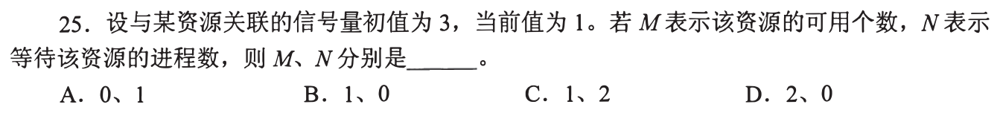

### 02 · 2010-27

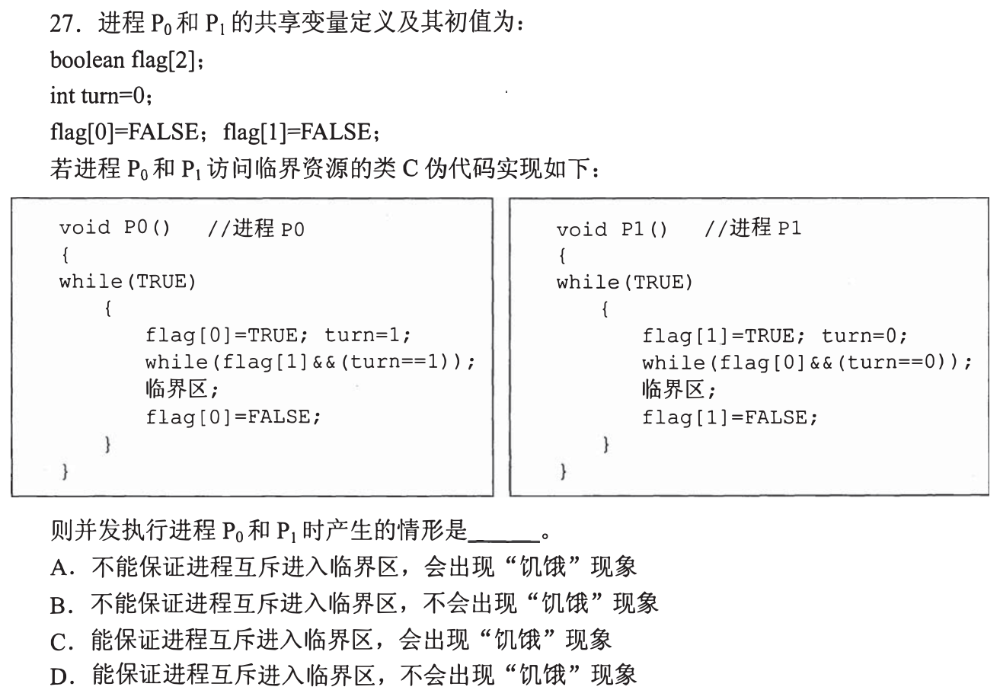

### 03 · 2011-32

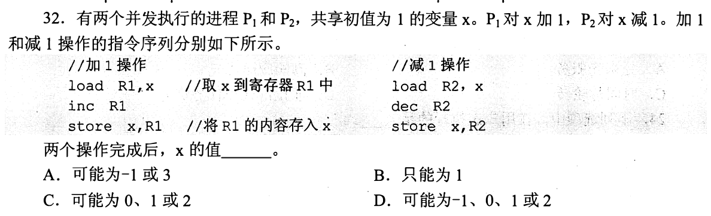

### 04 · 2012-30

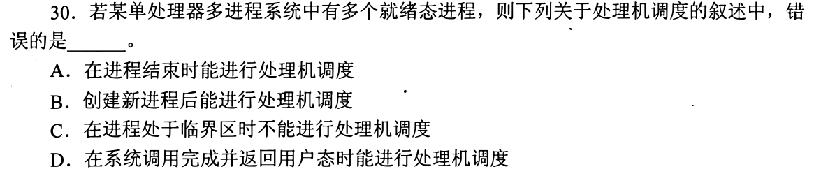

### 05 · 2014-24

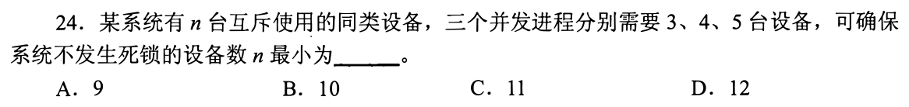

### 06 · 2016-27

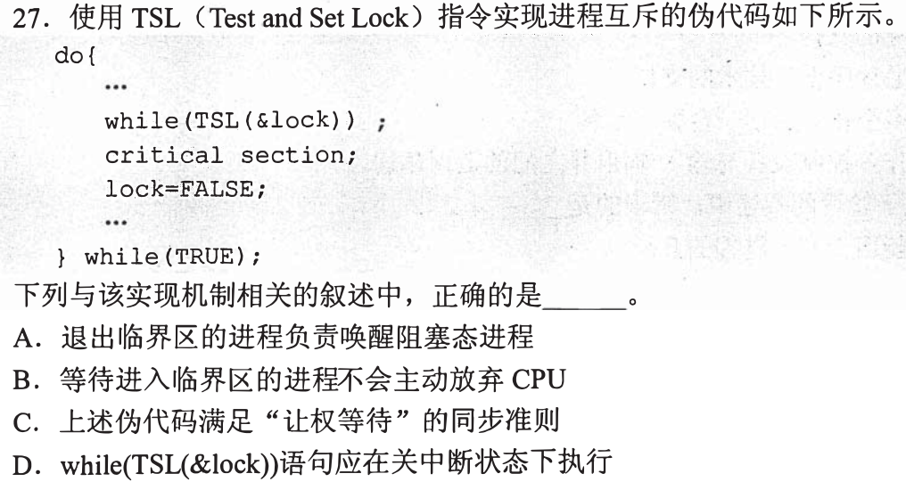

### 07 · 2016-30

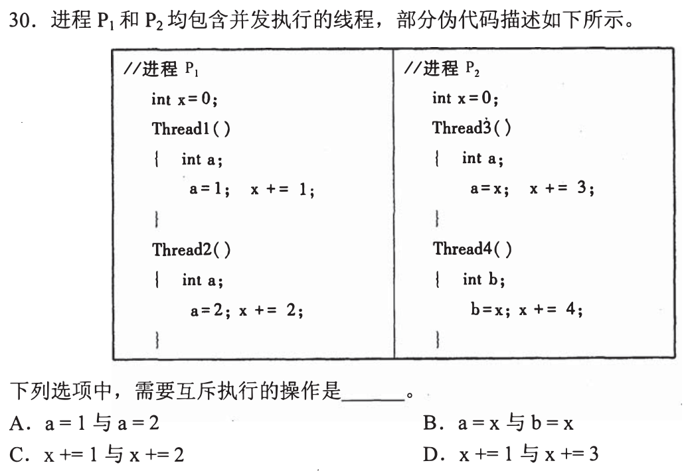

### 08 · 2016-32

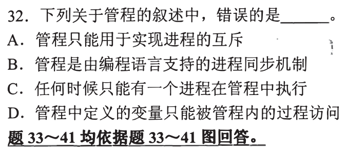

### 09 · 2018-28

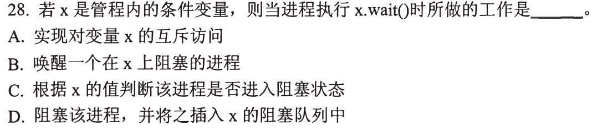

### 10 · 2018-32

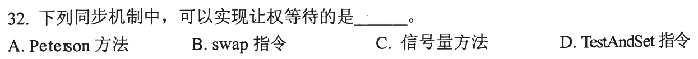

### 11 · 2019-24

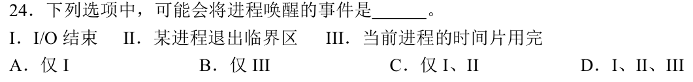

### 12 · 2020-32

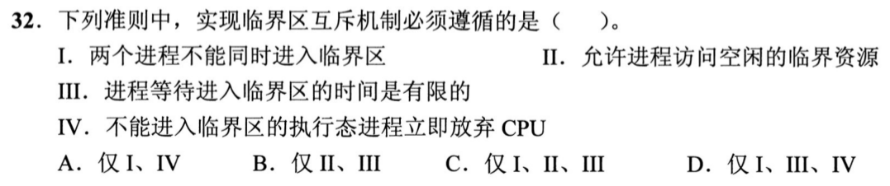

### 13 · 2024-28

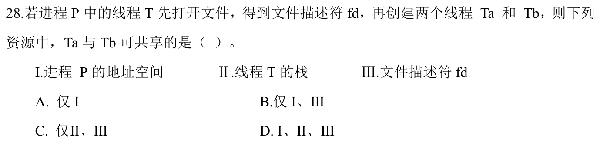

### 14 · 2024-30

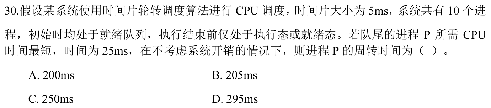

### 15 · 2025-27

[← 0825](0825.md) · [总索引](README.md) · [0827 →](0827.md)
