[« 0826-answer](0826-answer.md)　　[0828-answer »](0828-answer.md)

# 0827 Answer｜资源闭环：死锁、避免与检测

> [原题 13 题](0827.md) · [0826 并发约束](0826-answer.md) · [能力账本](answer-quality/learning-ledger.md)
>
> 上一节点已用“人人差一份”求保证不死锁的资源数。本节点反过来问：当前能否找到一个完成者、释放资源后能否继续。13 题均已核准。

<strong>13 题考场入口</strong>

| 题 | 第一笔 | 答案 |
| --- | --- | --- |
| [01](#q01) | 8 台刚可让四人各占 2、各缺 1 | C |
| [02](#q02) | 先 P1、P4，之后 R2 仍只 2，无序列 | D |
| [03](#q03) | 初始余量 (2,3,3)，从 P3→P4 开始 | D |
| [04](#q04) | 进程分资源、线程调度，用户线程可自管 | A |
| [05](#q05) | 安全态必无当前死锁；不安全不等于已死锁 | B |
| [06](#q06) | 避免需最大需求，检测不需；避免拒绝危险请求 | B |
| [07](#q07) | LRU 留最后出现的 5、4、8、2；淘汰 2 | A |
| [08](#q08) | 三种两两资源需求构成最小三进程环 | C |
| [09](#q09) | 仅 P3 可先结束且未归还资源，仍无后继 | A |
| [10](#q10) | 剥夺可解除，预防保无死锁；银行家不是检测器 | B |
| [11](#q11) | 可用 (1,0)，P2→P1→P3 | B |
| [12](#q12) | n 人各占一份后再给一份，至少 n+1 | C |
| [13](#q13) | 先 P0 后 P1/P2 两种顺序 | B |

## 01｜2009-25：问“可能死锁”就先构造最小反例

每进程最多需 3 台，要使一个进程“卡在最后一台”，它可先占 2 台并再请求 1 台。8 台打印机能分成 **4 个进程各占 2 台**、每人仍差 1 台，此时零空闲，四人可互等，故最小 **K=4，选 C**。K=3 时最多各占 2 共 6，仍余 2，至少能让一个人拿最后一台、完成并归还。

与 0826-05 的题问方向相反

那里给三个进程最大需求 3、4、5，求**保证不死锁**的最小 n，是 `Σ(max−1)+1=10`；本题给 n=8 和每人最大 3，求**可能死锁**的最小人数，找 `K×(3−1)≥8`，最小 K=4。先辨“构造一例”还是“排除所有反例”。

## 02｜2011-27：安全序列不是看起来能开头，还须能完成所有人

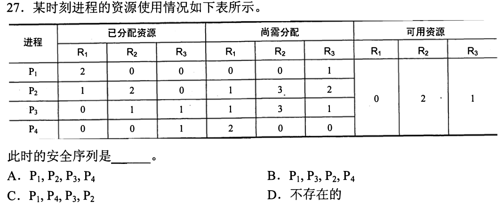

当前可用 `(R1,R2,R3)=(0,2,1)`。P1 尚需 `(0,0,1)`，可完成并归还已占 `(2,0,0)`，变 `(2,2,1)`；P4 尚需 `(2,0,0)`，可完成归还 `(0,0,1)`，变 `(2,2,2)`。剩下 P2 需 `(1,3,2)`、P3 需 `(1,3,1)`，都缺 R2 的第三份，**不存在完整安全序列，选 D**。第一笔总是比较 `Need≤Available`，完成后加的是**已分配资源**。

为何选项 C 前两步正确仍不能选

P1→P4 是可执行前缀，但执行完两者后 R2 仍只有 2；P1、P4 本来都没占 R2，归还不了 R2。表格中“尚需分配”不是“完成后会归还”这一列，混淆这两列最容易把局部前缀误判为安全序列。

## 03｜2012-27：先从资源总量减已分配，逐项验证一个序列

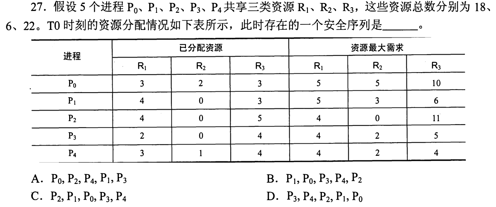

初始已分配合计 `(16,3,19)`，总量 `(18,6,22)`，所以可用 **`(2,3,3)`**。P3 还需最大需求减已分配 `(2,2,1)`，可完成后归还 `(2,0,4)`，得 `(4,3,7)`；P4 需 `(1,1,0)`，归还 `(3,1,4)`，得 `(7,4,11)`；P2 需 `(0,0,6)`，得 `(11,4,16)`；P1 需 `(1,3,3)`，得 `(15,4,19)`；P0 需 `(2,3,7)` 也可完成。序列 **P3→P4→P2→P1→P0，选 D**。第一笔先算可用，不要直接比较最大需求。

每轮的两种向量不要相加错

对一个能完成的进程，先检查 **尚需 Need≤当前 Work**；假设它拿到尚需并运行完毕，会归还它原先分配加上刚拿到的资源，净效果是 `新 Work=旧 Work+原 Allocation`。不能只把 Need 加到可用，也不能把最大需求整份加到可用。

## 04｜2012-31：进程承载资源，线程承载可调度的执行流

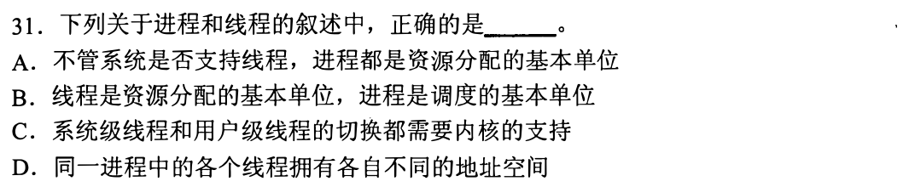

题问**正确**。不论 OS 是否直接支持内核线程，进程仍是资源分配的基本单位，**选 A**。B 反把单位颠倒；用户级线程切换可由用户线程库完成，不一定每次需内核支持，C 错；同一进程线程共享地址空间，D 错。第一笔把“谁拥有地址空间/文件”与“谁被安排执行”分两列，沿用 0825-07、17。

为什么放在死锁能力线

死锁资源归属可落在进程或线程活动上，题里仍先要分清进程拥有资源、线程在共享资源上并发执行。不要见到“线程”便让每条线程拥有独立进程地址空间。

## 05｜2013-32：安全是存在完成路线，不安全是找不到保证

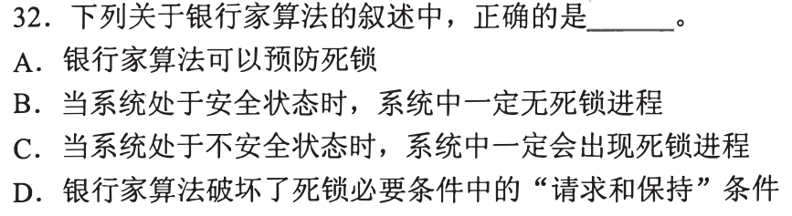

银行家算法在新请求后试探安全序列，拒绝会让系统落入不安全态的分配。处于**安全态**说明存在一条让所有进程顺利结束的顺序，因此当前一定无死锁，**选 B**。不安全仅说明不能保证，总体仍可能在以后恰好顺利完成，C 的“一定死锁”错。A 把“避免”叫作“预防”的机制分类混了；D 并未禁止进程持有一部分资源时再申请其他资源。

三种状态的蕴含方向

`安全 ⇒ 未死锁`；`已死锁 ⇒ 不安全`；反过来 `不安全 ⇏ 已死锁`。银行家在分配**之前**预演避免危险路径，未通过不是宣告此刻已有死锁。把“当前事实”和“将来某条不利申请路径的风险”分开。

## 01—05 收束

前五题建立两种动作：求可能性，构造人人差一份；求安全性，写 `可用→谁的尚需≤可用→归还其原分配→新可用`，直到全完成或卡住。只完成前几位不能叫安全序列。下文继续覆盖其余八题；独立解题速度需要盖答案实测。

## 06｜2015-26：避免死锁是在分配前检查将来，检测是在分配后找现实

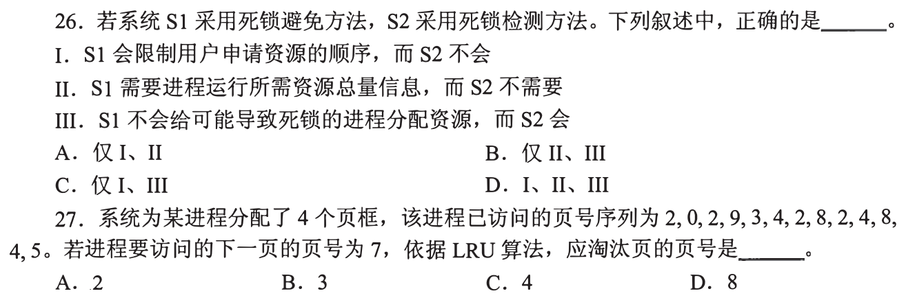

S1 用银行家式**避免**，需要知道每进程最大需求等信息以试算安全状态；S2 做**检测**，可从当前分配与请求关系找死锁而不必预知全过程最大需求，II 对。避免拒绝会使系统不安全的分配；检测允许先发生可能导致死锁的分配，事后再发现并处理，III 对。I 把避免说成“限制申请顺序”，算法约束的是**批准某次申请能否保持安全**，不固定用户申请顺序，错。**仅 II、III，选 B**。

读题只抓决策时刻

避免：每次拟分配先算安全性，危险则暂缓。检测：资源已经分配，周期性识别当前有无无法推进的闭环。预防则通过规则破坏必要条件，属于另一类手段。三者不必用同一套已知信息。

## 07｜2015-27：LRU 从右往左找当前驻留的四个不同页

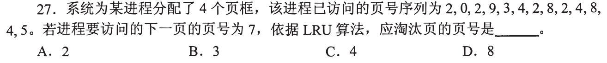

访问序列 `2,0,2,9,3,4,2,8,2,4,8,4,5`，4 页框；下次访问 7 不在内存。由右向左找最近的**不同**页是 `5、4、8、2`，其中最久未使用的是 **2，选 A**。第一笔只从尾部找四个不同页，不要把多次重复访问算成多个页框。

LRU 当前驻留页核对

题图按第 27 题的独立边界截取，不需要借用前一题。到尾部时页框实际含 `{2,8,4,5}`，四者最后使用位置分别较早到较晚为 2、8、4、5，所以淘汰 2。

## 08｜2016-25：先找持有与请求能否形成最小闭环

P1 需 R1、R2；P2 需 R2、R3；P3 需 R1、R3。可构造 P1 持 R1 等 R2，P2 持 R2 等 R3，P3 持 R3 等 R1，三者形成环并阻塞。任取两者，它们共享的资源至多一个，另一方无法同时持有对方还需要的另一种资源来形成双向等待；只申请 R2 的 P4 也不能成为持另一种资源再等待的环节。因此死锁进程数至少 **3，选 C**。第一笔把每人的两种需求当作“可持一等一”的两条边。

为什么 P4 不会凑出两进程死锁

P4 只要 R2，若还没拿到它便没有题中其他资源可握着等待；若拿到了 R2，就已满足其这项需求，可以完成释放。死锁是彼此握有对方所需、同时不能继续；“在队列中阻塞”不自动属于死锁环。

## 09｜2018-26：允许 P3 完成也不等于整系统安全

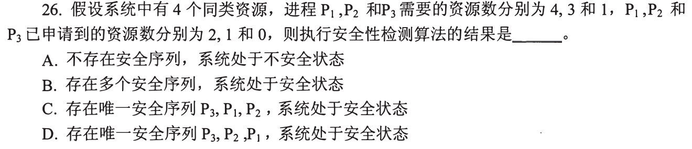

总计 4 份，已给 P1 两份、P2 一份、P3 零份，可用 **1**。P1 尚需 2，P2 尚需 2，只有 P3 尚需 1 能先完成；但 P3 原先占 **0**，完成归还后可用仍为 1，P1/P2 仍各缺 2，没有完整安全序列，**选 A（不安全）**。第一笔检查唯一可完成者能归还多少，而不只看它能不能完成。

不安全尚不是现实死锁判定

当前 P3 可获最后一份运行完成，系统尚未必已陷入互等；只是从给定最大需求与已分配出发，无法保证所有进程在最坏后续申请下完成。与 05 的“不安全不必然当前死锁”一致。

## 10｜2019-30：预防、检测与恢复不要混成同一动作

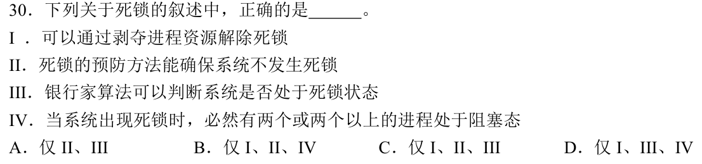

题问正确组合。发生死锁后可剥夺部分进程资源以恢复，I 对；预防通过破坏死锁必要条件可确保不发生，II 对；银行家是**避免**，判断拟分配后是否仍安全，并非检测系统**已死锁**的算法，III 错；经典的多进程互等死锁中至少两个进程因等待而阻塞，IV 对。**I、II、IV，选 B**。第一笔给每句话标“事前规则、分配前试算、事后检测、死后恢复”。

别把“安全性检查”改名为“死锁检测”

银行家得到“不安全”也不能推出已死锁（05、09 已演过）；真要检测当前死锁须看现有资源/请求是否有进程可推进。I 是死锁发生后的恢复手段；预防是事前消除某一必要条件。

## 11｜2020-27：两类资源先算各自可用，不能合成一个总数

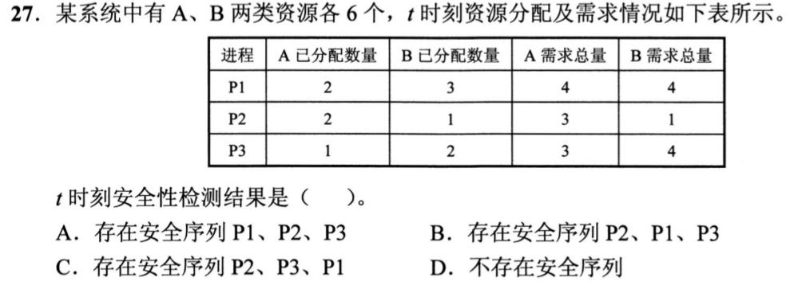

A、B 各 6，已分配 A=`2+2+1=5`、B=`3+1+2=6`，可用 **`(1,0)`**。表中请求总量减已分配：P1 尚需 `(2,1)`、P2 `(1,0)`、P3 `(2,2)`。先 P2 完成归还 `(2,1)` → 可用 `(3,1)`；P1 完成归还 `(2,3)` → `(5,4)`；P3 可完成。**P2→P1→P3，选 B**。第一笔把 A、B 分成两列，不要因 1+0 总数够就跨种类借用。

题表的“请求总量”怎样读

数值 4、4 等是该进程累计最大请求量；检查目前还缺多少，须先减它已经分到手的资源。P2 已获 B=1 且总需 B=1，故它现在不需 B，唯一可作为开头。

## 12｜2021-31：每人都差一份时 n 份可死锁，再加一份破局

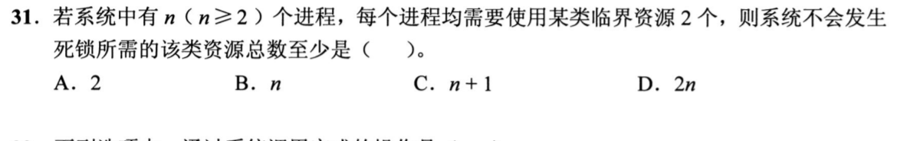

n 个进程每人最多需 2 份同类临界资源。若只有 **n** 份，可每人先占 1 份，再都请求第二份，空闲为零、无人能完成。加到 **n+1**，在每人各持 1 的最坏局面仍有一份可交给某人，使其完成并归还两份，随后其他人也能推进。至少 **n+1，选 C**。第一笔把 0826-05 的 `Σ(max−1)+1` 代入 n 个最大需求 2。

“不会发生”要求反证与充分性都交代

n 份的分配构成反例说明不够；n+1 份说明在全部人都不能完成的假设下，每人最多只持一份，合计最多 n，必有一份空闲可让某人完成，与“全部不能完成”矛盾。

## 13｜2022-26：数安全序列先找必经开头，再数分支

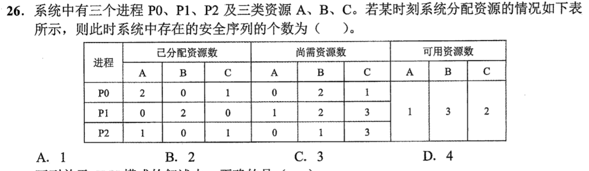

当前可用 `(A,B,C)=(1,3,2)`。P0 尚需 `(0,2,1)`，能先完成、归还 `(2,0,1)` 后可用 `(3,3,3)`；P1 尚需 `(1,2,3)`、P2 尚需 `(0,1,3)`，起初都缺第三类 C，故开头**只能 P0**。随后 P1、P2 都可完成，先后顺序有 **P0→P1→P2、P0→P2→P1** 两种，**选 B（2）**。第一笔先看哪个进程能起步，再看归还后出现几个分支。

不能把“两个后继都可选”误计为四个

第一步只有 P0；余下两者排列是 `2!=2`。P1 先归还 `(0,2,0)` 或 P2 先归还 `(1,0,1)`，另一者之后都能完成；没有其他首位选择，也无需重复计算同一序列。

## 13 题收束：保底与考场压缩

遇到资源表先算各类可用；每轮只做 `尚需≤可用？`，完成就把**原已分配**加回。若无人能开头或中途卡住，写明缺哪一类资源，不凭“有几个进程能先结束”猜安全。可能死锁题则构造人人差最后一份；避免、检测、恢复分别落在分配前、分配后、死锁后。熟练时只记录资源向量和可选分支，1—2 分钟内完成小表；若题目太难，至少先排掉把不安全等同已死锁的选项。

本节点 13/13 是讲解文稿覆盖，独立计时正确和熟练度待本人重做检验。
