[« 0827-answer](0827-answer.md)　　[0829-answer »](0829-answer.md)

# 0828 Answer｜内存边界：分配、回收与保护

> [原题 12 题](0828.md) · [0827 资源闭环](0827-answer.md) · [能力账本](answer-quality/learning-ledger.md)
>
> 上一节点先核资源能否推进；本节点先核地址是否在允许边界，再动手分配或翻译。12 题均已核准。

<strong>12 题考场入口</strong>

| 题 | 第一笔 | 答案 |
| --- | --- | --- |
| [01](#q01) | 分区的基址/界限阻止跨越 | A |
| [02](#q02) | 32 位减 8 位段号，段内 24 位 | C |
| [03](#q03) | 释放 15 与尾部 10 分开，最佳适应先切 10 | B |
| [04](#q04) | 增 TLB 和常驻页表减少翻译访问 | C |
| [05](#q05) | 段内 400≥段长 300，先报越界 | D |
| [06](#q06) | 合并为 380KB 后重排；链首 80KB | B |
| [07](#q07) | 4 类用户各有 5 种权限位 | D |
| [08](#q08) | 共享物理段不要求各进程段号相同 | B |
| [09](#q09) | 最佳适应常留下很小孔 | C |
| [10](#q10) | 索引分配允许随机定位并可增块 | A |
| [11](#q11) | 虚拟页号可不同，物理页框同一份 | C |
| [12](#q12) | 伙伴系统只合并同阶伙伴 | A |

## 01｜2009-26：分区保护首先阻止地址越过本分区

分区分配为进程给出可访问的起点与范围；CPU 用基址/界限等机制检查访问是否落在自己的分区，主要保护是**界地址保护，选 A**。代码、数据和栈当然都应受保护，但题问分区方式的**主要措施**，应先找分区边界。第一笔把某逻辑位移与分区长度比较，而非先讨论内容类型。

保护发生在访问之前

若位移越界，不能仅把起始地址加上去得到物理地址；先做界限比较，合法才平移。这个动作将在 05 的段式题复用。

## 02｜2009-27：段号与段内位移平分的是地址位数，不是段长

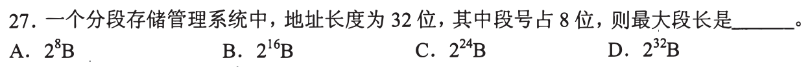

逻辑地址总 32 位，段号占 8 位，剩余 **24 位**表示段内位移，最大可表示 `2^24` 个字节位置，最大段长 **`2^24 B`，选 C**。第一笔写 `段内位数=总位数−段号位数=24`。8 位段号决定最多有多少编号，不是每段长度。

与 01 的边界校验接上

24 位只给出编码的理论最大位移范围；每个段表项还可能记录本段实际长度，更短的段仍须按实际段长检查越界。不能把“地址字段能写到”当作“该进程的段实际都分到了”。

## 03｜2010-28：最佳适应先选最小够用孔，再看最终最大孔

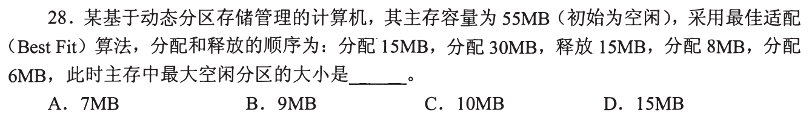

55MB 空闲先分 15，再分 30，布局为 `[占15][占30][空10]`。释放前 15 后，空闲孔大小为 **15、10**，中间 30 仍隔开两孔。最佳适应分 8 时选 10，剩 2；再分 6 时选 15，剩 **9**。最终空闲孔为 2 与 9，最大 **9MB，选 B**。第一笔按物理相邻画孔，不可把释放 15 与尾部 10 合并。

为何“总空闲 11”不是答案

最终两孔 `2+9=11` 但不连续；题问**最大空闲分区**，不是总空闲容量。最佳适应每次重新从当前全部空闲孔中找最小可容纳者，不能仅按旧顺序继续切。

## 04｜2014-28：地址转换瓶颈问页表项去哪找

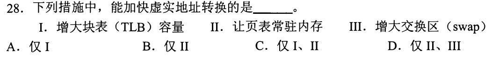

TLB 命中可快速拿到页表映射，增大其容量 I 可能提高命中率；页表常驻内存 II 避免页表自身再从外存取回，均可加快虚实地址转换。增大 swap 空间 III 只扩展换出位置，并不让每次翻译更快。**仅 I、II，选 C**。第一笔把路径写为 `查 TLB → 未中查内存页表`，看措施缩短哪一段。

这不是“增任何存储空间都变快”

TLB 容量增大也可能伴随硬件命中时间取舍，但此题问能加快转换的常用措施；swap 是外存支持页换入换出，距离每次地址翻译的快速路径更远。

## 05｜2016-28：段表先验范围，合法后才加基址

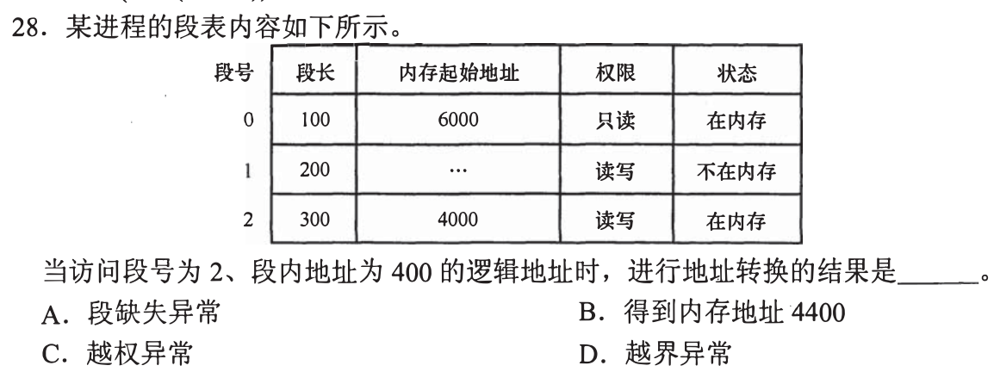

段 2 在内存、基址 4000、段长 300；请求段内位移 **400**，已不满足 `0≤位移<300`，立即报**越界异常，选 D**。不可先算 `4000+400=4400` 再选 B；本段不是不在内存，也没给出写只读段的操作。第一笔按“段号有效→段存在→权限→位移在段长内→基址加位移”逐关检查。

干扰项各偷换了哪一列

段缺失 A 需状态为不在内存，本题段 2 明明在；越权 C 需操作与权限冲突，本题未给写入；4400 B 用对了加法，却跳过更早的边界判定。无效地址不应被翻译成看似正常的物理地址。

## 06｜2017-25：释放时只合并地址相接的空闲孔

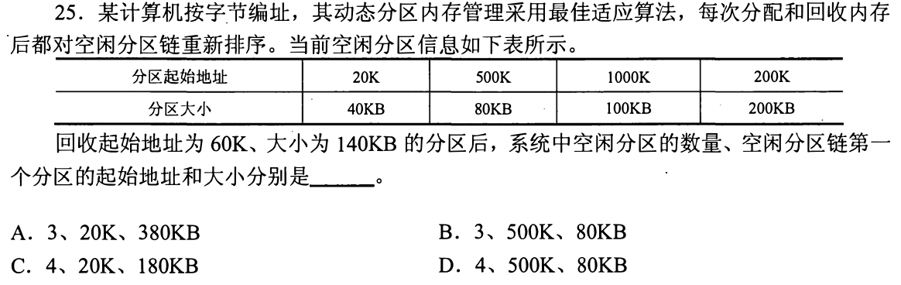

按起始地址与大小标区间：空闲 `[20K,60K)` 大小 40KB、`[200K,400K)` 大小 200KB，另有 `[500K,580K)` 80KB、`[1000K,1100K)` 100KB。释放 `[60K,200K)` 大小 140KB，恰好连接前两块，合成 **`[20K,400K)`、380KB**；另两块不邻接，合并后共 **3 个**空闲分区。重新按最佳适应的大小递增排序，80KB 的 `(500K,80KB)` 最先，故 **3 个、链首 500K/80KB，选 B**。第一笔先按物理地址合并，再按容量重排，不可把最大孔当链首。

先合并后重排，两步不能倒置

合并结果是三孔 `(20K,380KB)、(500K,80KB)、(1000K,100KB)`；若最佳适应空闲链按大小递增，顺序为 80、100、380KB，所以首项 `(500K,80KB)`。这道题的主要陷阱正是“数对 3 个、合并大小对 380，却没再排序”，会误选 A。核对题目最后问的是链首，不是合并后最大孔。

## 01—06 收束

遇地址先校验边界再平移，遇空闲孔先按物理地址合并，再按算法规定的链表顺序重排。具体题中“总容量”“最大孔”“链首”是三个不同答案对象。前六题建立上述入口；后六题继续检验，独立限时通关待本人验证。

## 07｜2017-30：每类用户独立记录五种权限

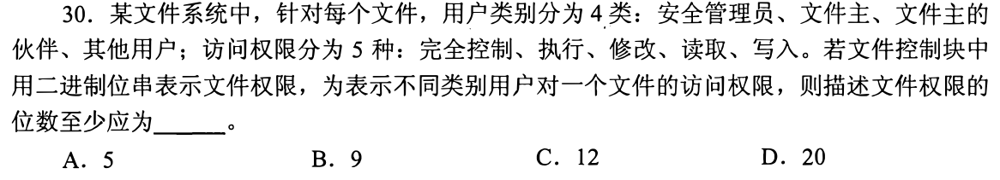

四类用户，各要表达完全控制、执行、修改、读取、写入这五种权限的有/无。每类至少 **5 位**，四类合计 `4×5=20` 位，**选 D**。第一笔写“用户类别 × 每类独立权限项”；不要只数五种操作，也不要把五项误当互斥的五选一。

为什么不是每类用三位编码五种状态

权限可组合，例如某用户可读且可执行但不可写；五个独立开关有 `2^5` 种集合，必须 5 位才能表示全部组合。若题说每类恰选**一种**等级，才考虑编码；这里是访问权限位串。

## 08｜2019-28：共享的是物理段，进程内段号可各自编排

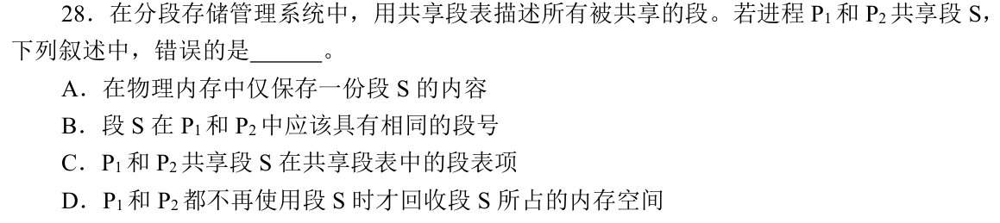

共享段 S 在物理内存保留一份内容，两个进程的共享段表项可指向它，直到双方都不再使用才回收，A/C/D 对。B 说 S 在 P1 与 P2 **应该有相同段号**，但段号是每个进程自己逻辑地址空间中的索引；一个进程编号 2，另一个编号 5，也可指向同一物理段，**选 B**。第一笔分开“本进程逻辑索引”与“共享物理对象”。

与 02 的段号位数接合

02 的 8 位段号决定单个进程能编多少段，并不保证各进程同号代表同一内容；真正的共享发生在各自表项所指的物理段和引用计数。不要从“内容相同”推出“虚拟名字相同”。

## 09｜2019-32：最佳适应的局部节省可能制造最多小孔

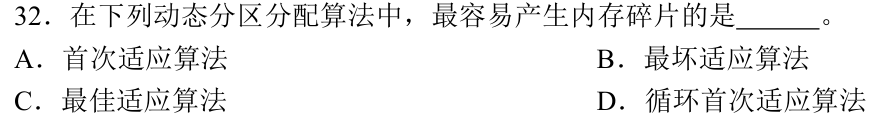

题问动态分区中**最容易产生碎片**的策略。最佳适应每次选刚够的最小孔，若仍有剩余便留下很小的尾部孔，后续请求难以利用，**选 C**。首次适应和循环首次适应按链表位置找首个够用孔；最坏适应切最大孔，通常保留较大剩余。第一笔看每次切完剩余孔大小，不只看眼前是否“最省”。

不是说每次最佳适应都更差

具体请求序列可能使任一策略表现好坏变化；此题比较一般碎片倾向。03 已演出分成 2MB 与 9MB 两个孔：总空闲够某些大请求，单个孔却可能不够，即外部碎片问题。

## 10｜2020-24：随机访问要能直接定位第 k 块

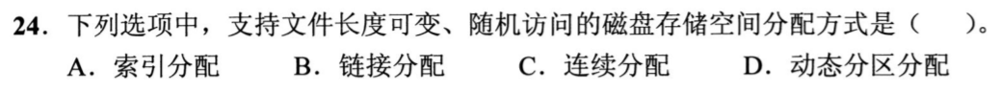

索引分配用索引表把文件逻辑块号直接映射到磁盘块，文件增长时可增加数据块与适当索引项，且能随机访问第 k 块，**选 A**。链式分配可增长，但通常要沿链走到第 k 块；连续分配可随机访问，但增长容易受后继连续空间限制。D 动态分区是内存分配术语，不是这里的磁盘文件分配。第一笔同时检验“可增长”和“能随机定位”。

“随机”看复杂度而非是否最终能找到

沿链逐块走当然最终也可能到达第 k 块，但不能按块号直接查到位置；索引表可先按逻辑号查映射。大文件可能用多级索引，仍比必须顺链扫描更符合随机访问。

## 11｜2023-30：共享物理页不要求两进程虚拟页号一致

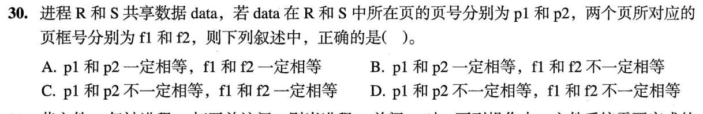

R、S 共享数据，两个虚拟地址空间可把这份数据安排在不同虚拟页号 `p1、p2`，故 **p1 不一定相等**；既然共享的是同一份物理页，两份页表映射到同一页框，**f1=f2，选 C**。第一笔画 `R:p1→f` 与 `S:p2→f`，不把虚拟地址相等当作共享的必要条件。

与 08 的同一映射结构

08 是两个进程的不同段号都指向同一物理段；本题换成不同虚拟页号都指向同一物理页框。逻辑编号由各自地址空间决定，物理对象由共享映射决定。若发生写时复制，写后会分成两个页框，那时已不是题设同一共享数据页的映射状态。

## 12｜2024-27：伙伴算法只把同阶、配对的两块合并

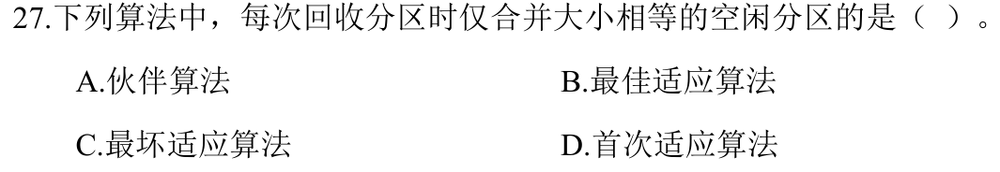

伙伴系统把空闲内存分成 2 的幂大小块；一块释放时，只有它的**同阶伙伴**也空闲，才合并成上一阶，逐层重复。因此每次回收时仅合并**大小相等**且互为伙伴的空闲分区，**选 A**。第一笔检验“大小相等 + 是同一次二分形成的一对”，不是看到两块任意相邻就合并。

与 06 的合并规则对照

普通动态分区可把物理相邻的任意大小空闲孔合并；伙伴系统保留幂次结构，即便相邻，若不属于同阶配对也不能立即合并。二者都在回收后整理空闲空间，但可合并条件不同。

## 12 题收束：边界、映射与物理孔三条短路线

读地址先问位移是否在实际界限内，再做加法；读共享先画各进程逻辑编号到**同一物理对象**的箭头；读分配/回收先画物理区间、合并规则、算法排序，最后才回答“最大孔”或“链首”。这些是做不出整题时至少能排除一两项的保底。考场加速保留每一步唯一会改变答案的边界和位置，目标 1—2 分钟。此页 12/12 讲解覆盖；独立限时熟练仍待实际重做。

[« 0827-answer](0827-answer.md)　　[0829-answer »](0829-answer.md)
