[« 0828-answer](0828-answer.md)　　[0830-answer »](0830-answer.md)

# 0829 Answer｜页面驻留：置换、工作集与缺页代价

> [原题 22 题](0829.md) · [0828 内存边界](0828-answer.md) · [能力账本](answer-quality/learning-ledger.md)
>
> 已会区分虚拟页号、物理页框和边界；现在沿一条访存路径判断页表、驻留、缺页与置换。22 题均已核准。

<strong>22 题考场入口</strong>

| 题 | 第一笔 | 答案 |
| --- | --- | --- |
| [01](#q01) | 每页放 512 个 2B 表项，目录需 128 项 | B |
| [02](#q02) | 缺页会改页表、磁盘 I/O、分配页框 | D |
| [03](#q03) | 抖动因驻留集不足，降并发度 | A |
| [04](#q04) | 中断必须保存 PSW，普通调用未必 | B |
| [05](#q05) | 缺页可能置换页并分配页框，越界是另一异常 | B |
| [06](#q06) | FIFO 不满足栈性质，可有 Belady 异常 | A |
| [07](#q07) | 多级页表减每次所需连续空间 | D |
| [08](#q08) | 字节 1234 直接，307400 双级间接 | B |
| [09](#q09) | 类别顺序 (0,0)、(0,1)、(1,0)、(1,1) | A |
| [10](#q10) | t 前六次为 6、0、3、2、3、2 | A |
| [11](#q11) | 初装不算置换，后有五次 LRU 淘汰 | C |
| [12](#q12) | 缺页率、盘 I/O、内存与处理 CPU 均入平均 | D |
| [13](#q13) | 页2缺失，优先换干净页3，框60H | C |
| [14](#q14) | 页表基址寄存器存一级页表物理起点 | B |
| [15](#q15) | 若有空框不必淘汰旧页 | A |
| [16](#q16) | 页缓冲队列长短主要影响处理代价 | D |
| [17](#q17) | 16GB/4KB=2^22 页框，位图 512KB | C |
| [18](#q18) | 虚拟空间大小由虚拟地址位数决定 | D |
| [19](#q19) | 切进程恢复 PC、SP、页表基址 | D |
| [20](#q20) | 3 框初有 0/1/2，后缺页六次 | B |
| [21](#q21) | 最小页框由寻址方式所需同时驻留页决定 | D |
| [22](#q22) | 文件页关联磁盘块，映射进虚拟空间并可共享 | D |

## 01｜2010-29：先算一页页表能容纳多少项，再算目录覆盖几页

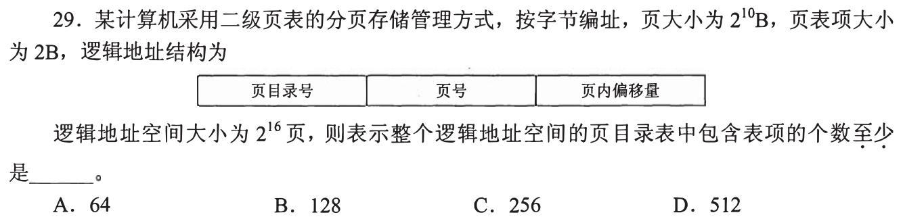

页大小 `2^10B`，表项 2B，一页二级页表可放 `2^10/2=2^9=512` 项，覆盖 512 个虚拟页。总逻辑空间 `2^16` 页，页目录需至少 `2^16/2^9=2^7=128` 项，**选 B**。第一笔不要被“二级”误导成直接把虚拟页数除 2；除的是每张二级页表的容量。

位段也能交叉校验

页内偏移 10 位；页号共 16 位；二级页表索引用 9 位，目录索引用 7 位。所以页目录有 `2^7` 个槽位。

## 02｜2011-28：缺页处理是一段可改变多个层次的流程

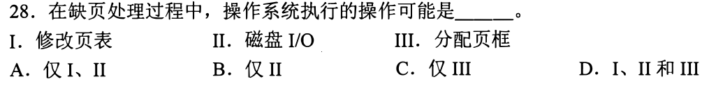

缺页后 OS 可能找空闲页框或选择牺牲页（分配页框 III），按需从磁盘读页甚至写回脏页（磁盘 I/O II），再改页表的页框号、存在位等（修改页表 I）。三项均可能，**选 D**。第一笔写“从哪里找空框→页从哪来→映射怎样更新”，而非把缺页等同一条磁盘读命令。

“可能”不等于每次都有三种耗时

可能已有可用页框而无需置换；缺页也可能是非法地址，直接异常终止。题问处理过程中 OS **可能**执行的动作，三者各有合法场景。后题算有效访问时间时须分清条件和发生概率。

## 03｜2011-29：抖动是太多进程争太少驻留页

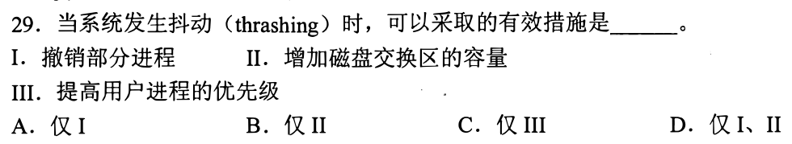

系统频繁换入换出，CPU 时间被缺页处理吃掉；撤销/挂起部分进程，减少同时在内存竞争的进程数，使留下者得到足够页框，**仅 I 有效，选 A**。加大 swap 容量 II 让外存能装更多页，却不增加当前内存驻留集；提高用户进程优先级 III 也不补足物理页框。第一笔问措施有没有改善“运行进程的工作集能否驻留”。

与 0825-24 的进程数边界

增加并发度一开始可填满 CPU 等 I/O 的空档，但超过内存承受的工作集总量会缺页激增，利用率反降。撤销部分进程是减负，不是说减少作业总量永远更好。

## 04｜2012-24：中断要恢复被打断指令的机器状态

中断可能在被打断程序无预期的位置发生；恢复时必须保留原 CPU 状态与条件标志等**程序状态字 PSW，选 B**。普通子程序调用按调用约定保存返回地址与需用寄存器，不一定保存整个 PSW。第一笔问这段控制转移是“调用方主动按协议调用”，还是“随时被外部事件打断”。

不要把 PC 和 PSW 混为一项

子程序要知道返回点，通常也保存 PC/返回地址，所以 A 不是“中断保存而子程序一定不需”的区别。通用寄存器可能由调用约定保存或由中断软件保存；PSW 才包含中断返回所需的原模式/标志等完整处理器状态。

## 05｜2013-30：缺页处理不等于越界异常处理

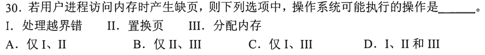

本题已给出访问发生**缺页异常**：目标虚拟页合法，但不驻留内存。处理时可能进行页面置换 II，并为目标页分配页框 III；越界错误属于访问不合法的另一类异常，不能据此加入 I。故 **仅 II、III，选 B**。有空闲页框时无需置换，所以这里说“可能”，并非每次缺页都要换出旧页。

先区分访问非法与合法页不驻留

检查地址范围和权限用于判断访问是否合法；合法页缺失才进入调页路径。不能因为某些真实系统把多种硬件故障统一交给同一处理入口，就把教材题中越界异常与缺页异常的概念合并。

## 06｜2014-30：Belady 异常看页框增加时驻留集是否仍包含旧集

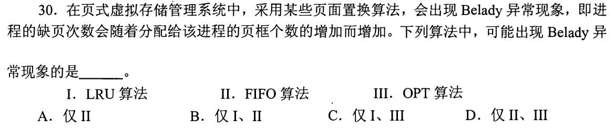

FIFO 按进入内存先后淘汰，给更多页框时替换顺序可能变化，出现“页框增多反而缺页更多”的 Belady 异常，**仅 II，选 A**。LRU 与 OPT 对同一访问前缀具有栈性质：多页框驻留集合包含少页框集合，因此不会出现这种反常。第一笔别只背名称，先问算法是否以当前访问局部性/未来最优保持嵌套。

为什么 FIFO 不必保持嵌套

FIFO 不更新最近使用次序：常用页只因入得早也会被淘汰。改变页框数会改变排队位置与后续逐出顺序；原先少框集中的页可能不在多框集中。LRU 的最近使用栈和 OPT 的最佳未来选择则满足包含关系。

## 07｜2014-32：多级页表节省的是页表所需的连续空间

把大页表拆成按需分配的多个小页表，页目录只指向现有页表页，不必为整张页表找到一块巨大的**连续内存空间，选 D**。多一级查找通常不会直接加快转换 A；缺页次数主要由数据/指令页驻留和访问模式决定 B；表项的基本字段并不因分级必然缩小 C。第一笔问“结构改变了哪个分配约束”。

与 01 的页目录计算接合

01 算目录槽位数；只有实际使用到的部分虚拟页范围才须配下级页表页。代价是页表层级增加，TLB 未命中时可能多次访存；收益是按需存表和较小连续块。

## 08｜2015-29：文件偏移先除块大小，再走该块的索引层级

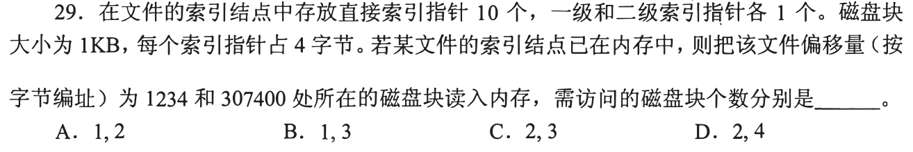

索引结点已在内存，10 个直接指针各对应 1KB 文件块；每索引块可放 `1024/4=256` 个指针。偏移 1234 在**第 1 号块**（从 0 起），落直接指针，需读目标数据块 **1 次**。偏移 307400 的块号 `⌊307400/1024⌋=300`；直接覆盖块 0—9，一级覆盖 10—265，块 300 落二级间接，需读一级索引块、二级索引块、数据块 **3 次**，**选 B（1、3）**。第一笔先算块号，再标覆盖区间。

为何不再为 inode 加一次磁盘读

题已说文件索引结点在内存；随机读偏移 1234 只需从 inode 的直接指针取盘块号，再读数据。二级间接要额外走两级索引块。

## 01—08 收束

页表题数**一页能容多少项**；缺页题分**地址是否合法、页面是否驻留、是否需置换**；抖动题看留下进程的工作集能否装下；索引题先把字节偏移变块号。首八题用这些入口延续 0828 的映射线，文稿覆盖不代表本人计时熟练。

## 09｜2016-26：改进 CLOCK 的四类优先级

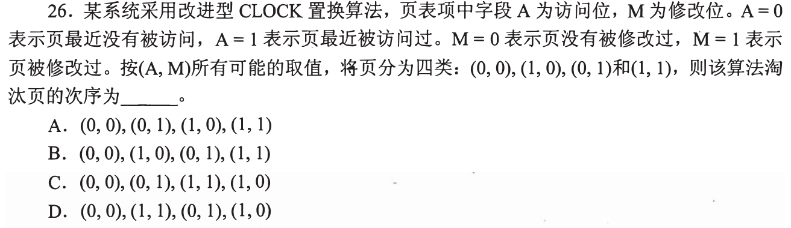

`A=0` 表示最近未访问，`M=0` 表示未修改。四类淘汰优先级为 **`(0,0)→(0,1)→(1,0)→(1,1)`，选 A**：先考虑最近未访问的两类，同等访问状态下再优先无需写回的干净页。不能把所有干净页一律排在脏页之前。

类别优先级与扫描动作分开

改进 CLOCK 结合访问位和修改位；扫描可清访问位，让页面在下一轮变成未访问类。具体环形队列的扫描过程要按题给指针和更新规则模拟，而本题问的是四类页面的标准优先级，不是当前指针最先经过哪一页。

## 10｜2016-29：工作集只看 t 前的固定窗口，重复页算一次

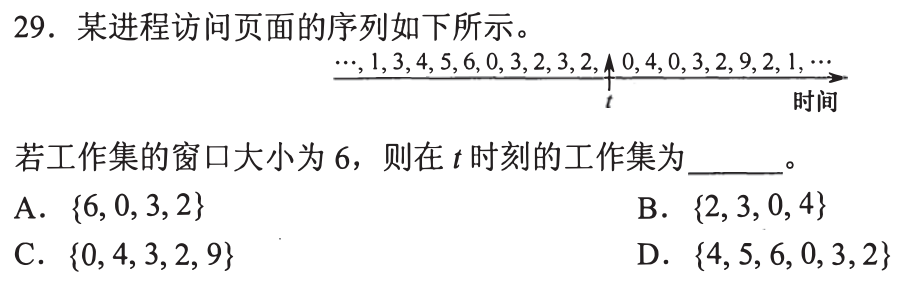

箭头 t 前紧邻的六次访问是 `6,0,3,2,3,2`；取不同页得到 **`{6,0,3,2}`，选 A**。第一笔先从 t 往左数**六次访问**，再去重；不能往右偷看未来的 0、4 等，也不能先去重再向左补够六个不同页。

为何集合只有四项

窗口长度是访问次数，不是不同页面数；3 与 2 在六次内各重复一次，所以六次访问仅涉及四页。窗口向前滑动时旧访问移出、新访问进入，工作集会变化。

## 11｜2019-29：先填四框，满后才数“置换”

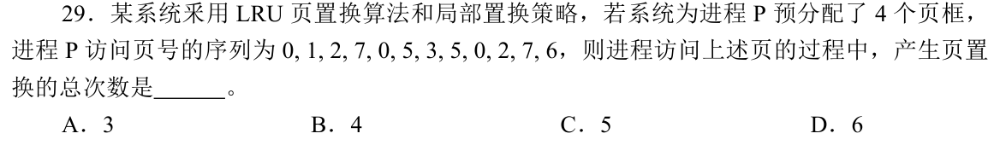

前四次 `0,1,2,7` 填满四个空框，**缺页但不置换**。后续 `0` 命中；`5` 淘汰 1，`3` 淘汰 2，`5、0` 命中；`2` 淘汰 7，`7` 淘汰 3，`6` 淘汰 5，共 **5 次置换，选 C**。第一笔写四框中当前最近使用顺序，遇已驻留页也要更新它的位置。

快速核对表

| 访问 | 5 | 3 | 2 | 7 | 6 |
| --- | --- | --- | --- | --- | --- |
| 被淘汰的最久未用页 | 1 | 2 | 7 | 3 | 5 |

后半只有这五个访问发生“满框缺页”；初装的四页和命中页都不算页置换。若题问缺页次数，则还须计最初四次，两种计数不能混用。

## 12｜2020-28：有效访问时间是各条路径耗时乘各自概率

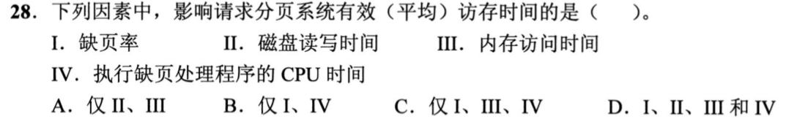

缺页率 I 决定慢路径多常发生；该路径可能要磁盘读写 II 与 CPU 执行缺页处理 IV；正常路径和故障处理还包含内存访问 III。四者都能影响平均访存时间，**选 D**。第一笔写 `E=(1−p)×正常访问时间+p×缺页路径时间`，再问每个因素进了哪一项。

别把“磁盘交换区容量”和“磁盘读写时间”混同

0829-03 的“增加 swap 容量”不直接解决抖动；这里是一次实际换页读写花多久，直接进入缺页路径耗时。同是磁盘字样，题目问的因果位置不同。

## 13｜2021-28：先拆页号和偏移，缺页后找替换框

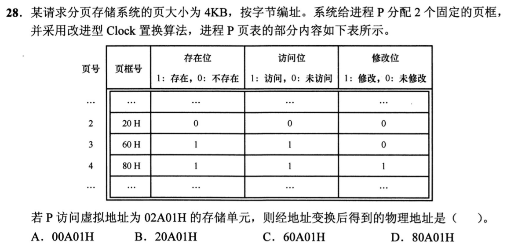

4KB 页即偏移 12 位；虚拟地址 `02A01H` 是**页 2 + 页内 A01H**。页 2 不在内存；两个已驻留页中页 3 `(A,M)=(1,0)` 干净，页 4 `(1,1)` 脏，按改进 CLOCK 的类别优先淘汰页 3，复用其页框 **60H**。物理地址 `60H × 1000H + A01H = 60A01H`，**选 C**。第一笔先把低三位十六进制数保留为偏移。

页表项里“20H”不能直接用于翻译

页 2 的存在位为 0，表内旧页框值 20H 不代表当前可直接访问；须缺页、置换并改页表后才能得到新框。若径直拼成 20A01H，会把无效映射当真。访问位、修改位只用于选牺牲页，不改变偏移。

## 14｜2021-29：页表基址寄存器保存的是 CPU 要访问的物理入口

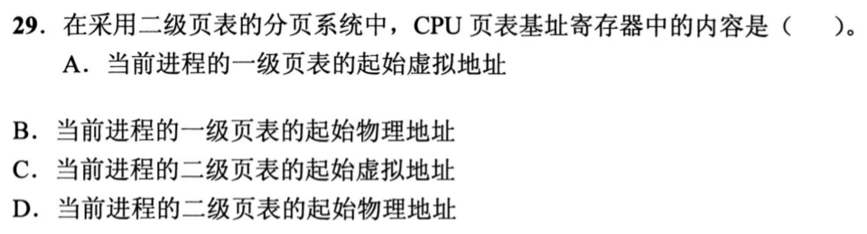

二级页表翻译先找当前进程的**一级页表**，CPU 的页表基址寄存器必须给出该表在内存中的**物理起始地址，选 B**。二级页表可能有多张，由一级表项再定位，不能在基址寄存器里放某一张二级页表地址。第一笔画 `寄存器→一级表物理地址→二级表→页框`。

为什么不能用虚拟地址指向翻译入口

若页表基址自身还要靠同一个页表翻译，就先要有页表基址才能翻译它，形成循环。硬件拿到的是可直接用于访问一级页表的物理入口；进程切换时更换当前进程对应基址。

## 15｜2022-29：缺页要调入目标页，未必需要牺牲旧页

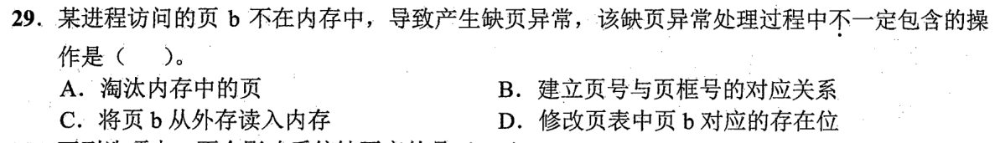

题问**不一定包含**。若进程仍有空闲页框，缺页处理可直接装入 b，建立页号到页框的对应关系 B、从外存读入 b C、修改存在位 D，而无需淘汰已在内存的页，**选 A**。第一笔看“已分配页框是否全部占满”，不能把缺页与置换画等号。

与 02、11 的“可能/必然”分开

02 问**可能**执行，置换可以发生；本题问**不一定**包含，有一个空框反例就够。11 也已区分首次装入的缺页与满框后的置换次数。掌握这三个问法可少背很多模板。

## 16｜2022-30：缺页率看驻留与访问，缓冲队列长短主要看代价

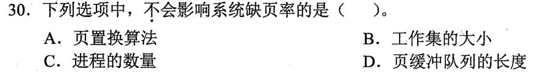

置换算法、工作集大小、并发进程数都能改变访问时目标页是否驻留，A/B/C 会影响缺页率。页缓冲队列长短主要改变被换出页的写回/再利用等**缺页处理效率**，不直接决定给定驻留集上的页面访问是否命中，**选 D**。第一笔问这个因素改变“会不会缺页”的概率，还是“缺页后花多久”。

模型边界

不同系统的页缓冲策略可能间接改变重用，题按请求分页的标准分类把页缓冲队列列为降低缺页处理开销的措施。此题与 12 的平均时间区分：一种因素可影响时间但不作为缺页**率**的主要决定量。

## 09—16 收束

置换题先分**初装/满框替换**，再追访问次序；工作集只看过去窗口；物理地址保留页内偏移，缺页页表的旧框号不可直接用。平均时间里分概率与路径耗时，不能把“更快处理缺页”直接当作“更少缺页”。

## 17｜2023-25：位图按物理页框个数数位，不按字节直接数

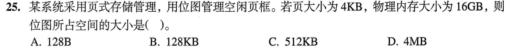

16GB=`2^34B`，页大小 4KB=`2^12B`，物理页框数 `2^34/2^12=2^22`。位图每框一位，需 `2^22` 位，即 `2^19B=512KB`，**选 C**。第一笔写“总字节÷每框字节→框数→除 8 得位图字节”，别跳过最后的 bit 到 byte。

为什么不是位图覆盖虚拟地址数

题说用位图管理**空闲页框**，对象是物理内存里的可分配框。进程虚拟空间可远大于物理内存，不能把虚拟页数拿来建这张物理空闲位图。

## 18｜2023-28：虚拟地址空间上限先看地址编码位数

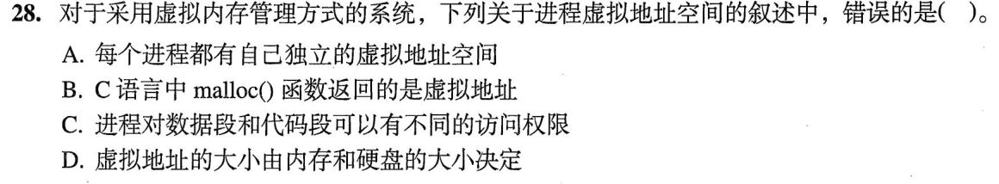

A 进程有独立虚拟空间，B `malloc` 给程序的是可在该空间使用的虚拟指针，C 代码段与数据段可设置不同权限，均对。D 说虚拟地址空间大小由**内存和硬盘的大小决定**，却忽略 CPU/系统虚拟地址位数所规定的可编码范围，**选 D**。第一笔分“地址能表示多大”和“实际可驻留/可后备多少”。

与 0825-08 的容量措辞

实际可用虚拟存储还受外存与系统实现约束，但仅拿物理内存与硬盘容量无法决定地址空间上限；例如同样硬件容量下 32 位与更宽虚拟地址架构可编码范围不同。题问的是单进程虚拟地址空间，不能用物理容量直接替代。

## 19｜2024-25：换进程须同时恢复执行位置、栈和映射根

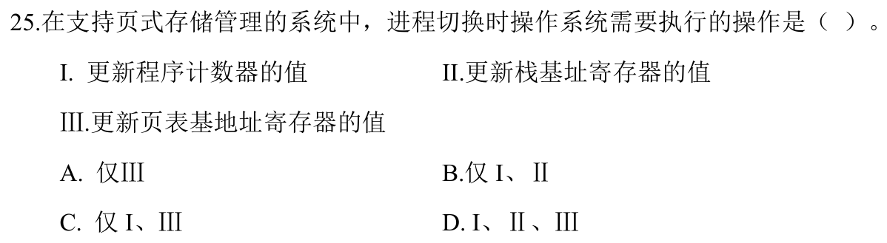

新进程接管 CPU，要有它下一条指令 PC I、自己的调用栈顶 SP II、把虚拟地址翻译到**该进程**物理页的页表基址 III。三者都要更新，**选 D**。第一笔问若某寄存器仍留旧进程的值会怎样：错指令、错栈或错地址空间。

接回 0824-24 的对比

内核中断向量表基址可全系统共用，普通进程切换不必换；页表基址按进程地址空间更换。两道题相似地问“哪个寄存器换”，但主语不同：进程私有执行/映射现场都要换，系统级共用入口不必。

## 20｜2025-26：已装入 0、1、2，后续只数新缺页

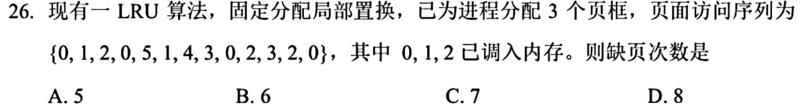

3 框起初已有 0、1、2。前四访问 `0,1,2,0` 均命中；随后按 LRU：5 换 1、1 换 2、4 换 0、3 换 5、0 换 1、2 换 4；末尾 `3,2,0` 命中。共有 **6 次缺页，选 B**。第一笔写初始驻留集和已知最近顺序，再逐访更新；不要把起始三页再计一次缺页。

用只记录“缺页时淘汰谁”的加速表

| 目标页 | 5 | 1 | 4 | 3 | 0 | 2 |
| --- | --- | --- | --- | --- | --- | --- |
| 被淘汰页 | 1 | 2 | 0 | 5 | 1 | 4 |

访问已驻留页时虽不填一行，也要更新最近使用顺序；若漏了前面的第 4 次访问 0，第一次牺牲者可能算错。

## 21｜2025-27：最低页框门槛由一条指令的访存方式决定

这题在 [0826-15](0826-answer.md#q15) 已建立动作：进程最少须有足够页框，让最复杂的合法指令取指并取其寻址所需操作数页面时能推进；题问决定这一**最低可运行页框数**的指标，**指令系统支持的寻址方式，选 D**。第一笔数一条指令可能同时涉及哪些页。代码长、虚拟/物理地址空间大小不直接回答这个门槛。

和“为了少缺页应给多少框”分开

最小值只保证指令可完成；实际性能要看工作集，往往需要更多框。这正是 03 的抖动与 10 的工作集讨论。后题不用把“最少可运行”误当“最佳驻留集”。

## 22｜2025-30：内存映射文件把文件内容接入进程虚拟空间

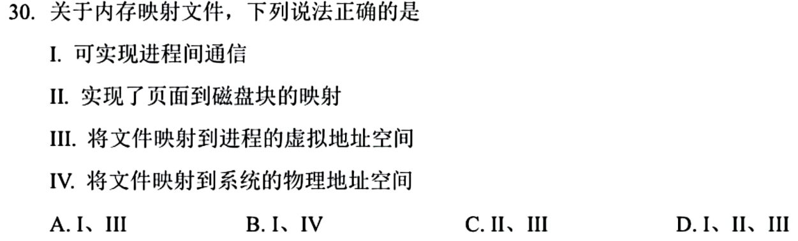

内存映射文件让文件的部分内容映射到进程**虚拟地址空间**，进程可像访问内存那样访问；多个进程映射同一共享文件区域也可实现通信，I、III 对。II 也对：映射区域的虚拟页面与文件中的磁盘块建立后备对应，缺页时才能按文件位置取回内容。IV 说直接把文件映射到系统物理地址空间则错；物理页框由内核按需管理。**I、II、III，选 D**。第一笔画“进程虚拟页↔文件块”的后备关系，再问物理页是否必须预先驻留。

共享文件与同一物理页的关系

进程可在各自虚拟地址用不同页号映射同一文件页；映射关系还须记下页对应文件哪一段/磁盘块，页缺失时才能从文件取回。驻留时可能指同一物理页框，和 0828-11 的共享页逻辑一致。磁盘后备、虚拟地址映射、物理驻留是三层，不可因 IV 错而把 II 也排掉。

## 22 题收束：保底与加速

先判断对象是虚拟地址、页表、物理页框、磁盘文件还是替换队列。缺页时依次过**合法性→驻留性→是否有空框→置换与写回→更新映射→重试**；计算题只记录改变驻留集/最近次序的访问。即使完整序列暂算不完，至少可排掉“初装算置换”“缺页必淘汰”“旧页框号直接当新地址”“swap 容量自动降缺页率”等错误路线。加速目标是在 1—2 分钟用状态表和关键分支做出同类题；22/22 只是文稿覆盖，仍要本人盖答案限时重做。

[« 0828-answer](0828-answer.md)　　[0830-answer »](0830-answer.md)
