[« 0829-answer](0829-answer.md)　　[0831-answer »](0831-answer.md)

# 0830 Answer｜文件路径：名字、索引、数据块与共享

> [原题 32 题](0830.md) · [0829 页面驻留](0829-answer.md) · [能力账本](answer-quality/learning-ledger.md)
>
> 已会区分页表映射与数据块索引；文件题从“名字找到 inode/目录项，再由文件偏移到物理块”追踪。32 题均已核准。

<strong>32 题考场入口</strong>

| 题 | 第一笔 | 答案 |
| --- | --- | --- |
| [01](#q01) | 随机访问且易扩展需索引结构 | B |
| [02](#q02) | 文件访问权限存于文件控制块 | A |
| [03](#q03) | 软链接自有计数 1，硬链接剩一入口计数 1 | B |
| [04](#q04) | 4＋2×64＋64² 块，共 1057KB | C |
| [05](#q05) | 当前目录缩短相对路径检索 | C |
| [06](#q06) | 编译将符号地址形成逻辑地址 | B |
| [07](#q07) | 单缓冲 1550μs，双缓冲 1100μs | B |
| [08](#q08) | 给一块盘分区不能减少机械寻道 | B |
| [09](#q09) | 删除文件不能删它所在整目录 | A |
| [10](#q10) | CD-ROM 视频快随机播放选连续布局 | A |
| [11](#q11) | inode 总数不决定某文件最大长度 | A |
| [12](#q12) | 首次打开须读文件控制块 | B |
| [13](#q13) | 直接块读1次，双级间接读3次 | B |
| [14](#q14) | 固定分配与全局置换不相容 | C |
| [15](#q15) | 位409612→字节51201→盘块82偏1 | C |
| [16](#q16) | 文件按1KB簇分配，1026B占两簇2048B | D |
| [17](#q17) | 逻辑格式化建根目录与空闲块结构 | B |
| [18](#q18) | 硬链接共 inode；独立打开偏移可不同 | B |
| [19](#q19) | 预读、连续簇、延迟写、高速缓存均助访问 | D |
| [20](#q20) | 位图/空闲链/FAT 可管空闲块，inode 管文件 | B |
| [21](#q21) | 0x20501225 拆高10位 081H、次10位101H | A |
| [22](#q22) | 同一文件属性由系统共享表项管理 | B |
| [23](#q23) | 设备独立使换硬件后应用不必改 | D |
| [24](#q24) | 4B inode 号最多区分 2^32 个对象 | B |
| [25](#q25) | 删文件不必删除快捷方式 | A |
| [26](#q26) | 最后关闭可释放内存 inode，不删盘上 inode | B |
| [27](#q27) | 位图按磁盘总块数固定长度 | A |
| [28](#q28) | open(path) 需按文件名查目录 | A |
| [29](#q29) | VFS 提供跨文件系统统一接口 | C |
| [30](#q30) | 权限信息在 inode，不在目录项 | C |
| [31](#q31) | FAT 标识磁盘块占用/空闲 | C |
| [32](#q32) | 文件系统为两类设备确定逻辑块大小 | B |

## 01｜2009-28：两个条件一起检验文件块结构

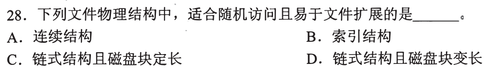

题同时要**随机访问**第 k 块和**易扩展**。索引结构可从索引表按逻辑块号定位物理块，增加文件块时添加索引，**选 B**。连续结构随机定位快但尾部扩展受连续空间限制；链式结构易增块却要逐结点走到第 k 块，不擅随机访问。第一笔把两个需求并排，逐项淘汰只满足一个的方案。

与 0828-10 的同题型

之前问磁盘空间分配，答案同是索引分配；这次措辞为“文件物理结构”。把概念挪到新选项中仍先看访问和增长的动作，不重新背一遍定义。

## 02｜2009-30：文件访问控制信息属于文件控制块

题问文件访问控制信息的合理存放位置。访问权限等属性针对具体文件，应存于其**文件控制块，选 A**。文件分配表主要记录盘块分配及链接，用户口令表用于验证用户身份，系统注册表不是文件权限的通用存放位置。第一笔分清“这个用户是谁”和“这个文件允许谁访问”。

别把相邻的磁盘调度题讲解套进来

2009-29 才是 SCAN 磁盘请求排序题，本题 2009-30 是文件访问控制。核对题号后，沿“文件名→文件控制块→访问权限”判断，与 [0831-01](0831-answer.md#q01) 的调度路线分开。

## 03｜2009-31：软链接是另一文件，硬链接共享原 inode 计数

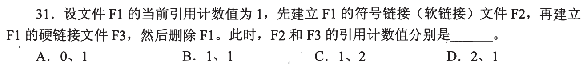

F1 原硬链接计数 1；创建 F2 **符号链接**是独立文件，自己的计数为 1，不增加 F1 的硬链接计数。创建 F3 **硬链接**使原 inode 计数变 2；删 F1 目录项后，原 inode 仍被 F3 指向，计数降回 **1**。故 F2、F3 分别 **1、1，选 B**。第一笔分“链接文件本身计数”和“目标 inode 共有几个硬入口”。

删目标名后软链接可能悬空

F2 存储指向 F1 的路径名，删除 F1 后该路径可能无法解析，但 F2 目录项自身并未被删除，引用计数仍为 1。F3 与原 F1 共用 inode，删 F1 名仍能通过 F3 访问内容。

## 04｜2010-30：三级容量数块数，再乘数据块大小

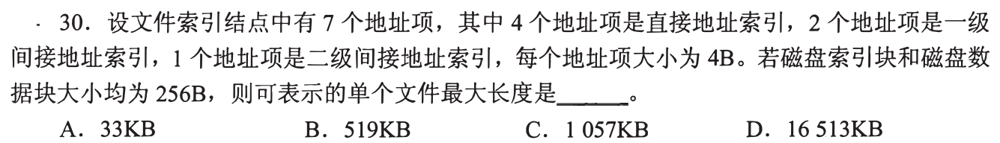

本题每盘块 256B、索引项 4B，一索引块容纳 **64 个指针**。四个直接项覆盖 4 块，两项一级间接覆盖 `2×64=128` 块，一项二级间接覆盖 `64²=4096` 块；合计 `4228` 个数据块，乘 256B 得 `1,082,368B=1057KB`，**选 C**。第一笔分开“每层多少指针”和“各层各有几个入口”。

索引块本身不算文件的数据长度

索引块占磁盘空间，但题问**可表示的单个文件最大长度**，算的是能指向多少数据块。若把二级间接误写成 64 而不是 `64×64`，会严重低估容量；若把索引块也算文件数据会高估。

## 05｜2010-31：当前工作目录给相对路径一个起点

设当前工作目录后，用户可用相对于该目录的短文件名/路径，不用每次从根目录逐层检索，主要目的是**加快文件的检索速度，选 C**。它不改变文件本身磁盘块布局或数据读写速度，A/B/D 的空间与 I/O 效果不是主要目的。第一笔问“这个目录状态改变的是名字解析哪一步”。

绝对路径与相对路径

绝对路径从根开始，当前目录只决定相对路径的起点；若反复访问同一目录下文件，少走共同前缀。具体系统还可能有目录缓存，但题的直接因果是路径检索范围缩短。

## 06｜2011-30：编译先形成逻辑地址，运行时再转换

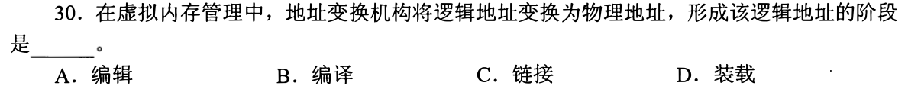

题问“形成该逻辑地址的阶段”，**选 B（编译）**。编译把源程序的符号引用转为目标模块中的逻辑地址（相对地址）；链接随后组合目标模块并调整地址布局，装载准备运行。地址变换机构在运行时把逻辑地址转换成物理地址，这不是题目所问的逻辑地址形成步骤。

形成、调整、转换不是同一个动词

不能因链接确定最终可执行文件布局，就说此前没有逻辑地址。目标模块在编译阶段已经使用相对地址，链接可以重定位这些地址；硬件转换则是逻辑→物理。依题目动词定位阶段，而不是只记最后一次布局调整。

## 07｜2011-31：单缓冲在复制后可读下一块，双缓冲可更早预读

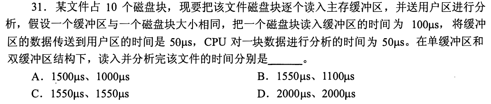

每块磁盘读 100μs、缓冲复制 50μs、CPU 分析 50μs，共 10 块。单缓冲：第一块读 100 后复制 50，随后下一块读 100 可与第一块分析 50 重叠；每块节拍 `100+50=150`，最后再加分析 50，`10×150+50=**1550μs**`。双缓冲让下一块磁盘读在另一缓冲与上一块复制+分析 `50+50=100` 同时进行，第一块读 100 后每块节拍 100，总 `100+10×100=**1100μs**`，**选 B**。第一笔画设备读、缓冲复制、分析三段谁占同一缓冲。

双缓冲末尾为何多一个 100

第 1 块先读 100；处理这块的复制与分析共 100，同时设备把第 2 块读入另一缓冲；如此流水，最后第 10 块读完后仍需复制和分析 100。因此 `100+10×100=1100`，不能只用 `10×100=1000`。

## 08｜2012-32：同一物理磁盘分区不会让磁头走得更快

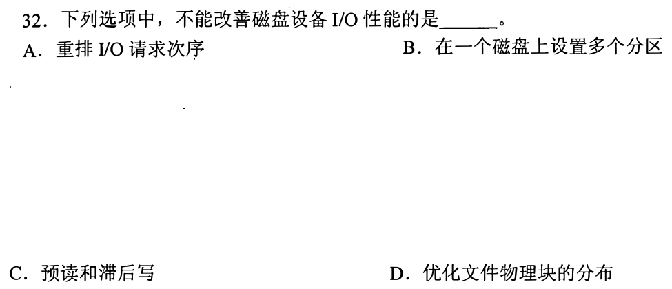

重排 I/O 请求可减少寻道，预读/滞后写可合并或隐藏 I/O，优化文件物理块分布也能提升局部性。把**一块磁盘划成多个分区**只改变逻辑管理边界，不改变磁头移动、旋转和传输硬件能力，不能据此改善 I/O 性能，**选 B**。第一笔问操作是否让一次 I/O 少寻道、少等待或少请求。

分区本身与布局优化不是同一步

在分区里另外安排连续块、按负载布置数据，可能有性能变化；那是额外的物理布局决策，不是“设置多个分区”这个动作自动产生。题的“不能改善”按选项措施本身判断。

## 01—08 收束

文件路径先问名字从哪开始找、inode/链接指向谁、偏移由哪级索引定位块；磁盘性能再问是否真的改变机械请求路径。索引容量数**数据块指针**，缓冲流水画资源占用线。仓库若原题裁图错位，按原卷核验并显式标明，不能凭错误图猜答案。

## 09｜2013-23：删文件只移相关目录项，不能顺手删整个目录

用户删除某文件时，OS 会移除与**该文件**关联的目录项，可能释放其文件控制块及缓存；但其所在目录还可能有许多其他文件，不能因删一个文件就**删除该目录，选 A**。第一笔问操作对象是“目录里的这个入口”还是“容纳许多入口的目录本身”。

资源回收可能受打开与硬链接限制

题的“可能执行”允许 OS 在无其他引用时释放控制块/缓存；若还有打开句柄或硬链接，实际回收可推迟。A 是对象层级错误，删除文件本身并不要求也不允许无条件删除其父目录。

## 10｜2013-24：只读光盘适合把视频数据连续排布

视频文件在 CD-ROM 上一旦写定，很少需要增长；连续分配让顺序播放跨块少跳转，按起始块号加相对块号也能快速定位随机片段，**选 A**。链式结构要沿链定位，索引结构要额外查索引；本题优先播放性能，没提出可动态扩展。第一笔用“只读固定大小”和“快定位”两条条件，不把 01 的易扩展条件强加给此题。

为何两题同有随机访问却答案不同

01 同时要求随机访问**且易于扩展**，连续分配因增长受限淘汰；这里已刻在只读介质，文件增长不是需求，连续结构的直接定位与顺序布局优势便可使用。需求不同，算法无需统一选项。

## 11｜2013-26：最大文件长度看每个 inode 能指向多少数据块

单个文件可用的直接指针数、间接索引级数及每块能存多少地址项，连同文件块大小，共同决定最多能寻址多少数据。文件系统里有多少个**索引结点总数**只限制最多建立多少文件/对象，不改变一个 inode 的指针结构，**选 A**。第一笔问变量是“单个 inode 内部的扇出”还是“全系统有多少 inode”。

与 04 的容量公式复用

04 用 `4+2×64+64²` 数一个 inode 指得出的数据块；把全盘 inode 从一万个加到两万个，该式并不变。若每块更大或索引项更多，单文件容量才会变。

## 12｜2014-29：首次打开先取得文件元数据，不必立刻读内容

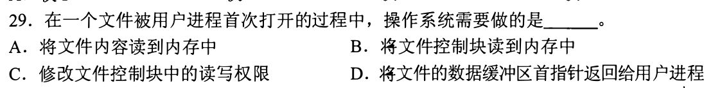

首次打开文件，OS 需通过目录找到文件控制信息，建立打开文件表项并把**文件控制块/索引结点读入内存，选 B**。文件内容 A 可等 read 时再读；读写权限 C 应检查而非擅自修改；当前偏移指针保存在内核的打开文件状态，不是把数据缓冲区首指针 D 返给用户。第一笔区分“打开元数据”和“读取数据”。

与 03 的目录项、inode 相接

路径解析找到目录项，再定位文件控制信息；打开成功得到文件描述符/句柄，后续读写由它找到打开文件表。第一次 open 不意味着把整个文件装入内存，尤其大文件不能这样做。

## 13｜2015-29：inode 在内存，数据偏移先落块号再数层级

这题在 [0829-08](0829-answer.md#q08) 已算过：每索引块 `1024/4=256` 指针，偏移 1234 落直接块 1，读数据块 **1 次**；偏移 307400 落文件块号 300，越过直接 0—9 和一级 10—265，走两层间接索引后再读数据，共 **3 次，选 B**。第一笔只保留 `偏移÷1KB→逻辑块号→直接/一级/二级`。

文件索引与页面置换分开核算

本题只用文件索引条件计算读盘次数；下一题研究页面分配和置换，两题判断对象不同。

## 14｜2015-30：固定页框数却允许全局逐出会改变份额

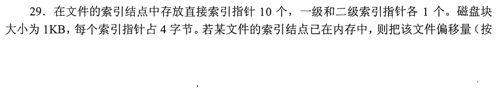

请求分页中，局部置换只在本进程已分配的页框中替换，能配**固定分配**；可变分配可与局部或全局置换配合。固定分配若实行**全局置换**，可从其他进程拿框，实际分配份额便变化，与固定矛盾，故不能组合的是 **C**。第一笔问“被替换的页框能从其他进程拿吗”。

固定与可变谈的是分给谁多少框

局部/全局谈的是选择牺牲页的范围。全局范围允许一个进程因缺页取得另一进程的框，通常改变各自驻留集大小；若题已规定每进程固定份额，这种组合不成立。核验的是页框份额是否保持固定，与文件索引层级无关。

## 15｜2015-31：位图的位号、字节号、所在磁盘块分三次除

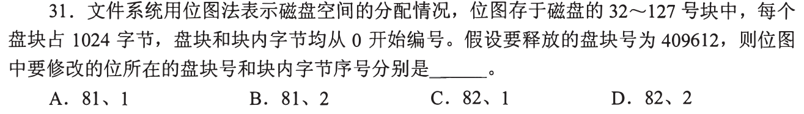

释放盘块号 409612，对应位图第 **409612 位**（从 0 起），落字节 `⌊409612/8⌋=51201`，该字节在位图中的块号 `⌊51201/1024⌋=50`，位图从盘块 32 开始，故物理盘块 **82**；块内字节序号 `51201 mod 1024=1`，**选 C（82、1）**。第一笔连写 `位÷8→字节；字节÷1024→位图块和块内位置`。

末尾余数 4 用在哪里

`409612 mod 8=4` 是目标位在这个字节中的位序号，题问的是**块内字节序号**，所以答案第二项是 1 而不是 4。也不能把位图从 32 开始忘掉，直接答第 50 盘块。

## 16｜2017-26：磁盘分配按簇向上取整

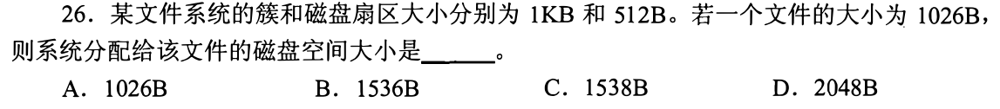

文件 1026B，磁盘扇区 512B，`⌈1026/1024⌉=2` 个簇，实际占磁盘 **`2×1024=2048B`，选 D**。磁盘扇区 512B 是底层读写单位；文件系统分配单位是题设的 **1KB 簇**。第一笔圈“系统分配给文件”，用簇而非扇区向上取整。

两级单位为何同时给

磁盘底层扇区 512B，但文件系统按 1KB **簇**分配文件空间；一个 1026B 文件刚超过一簇，必须占两簇，即 2048B。1536B 是“把字节向上凑到三个扇区”的结果，题特意给出簇大小是为了挡掉这条看似合理路线。

## 09—16 收束

先确认题问对象层级：目录 vs 文件目录项、inode 的全局数量 vs 单文件索引扇出、扇区 vs 文件系统分配簇。文件打开先定位元数据；访问偏移才读数据；位图先把位号转字节。数值题保底先写单位，最常见错项是用较小底层单位替代题设分配单位。

## 17｜2017-29：逻辑格式化建立文件系统内部结构

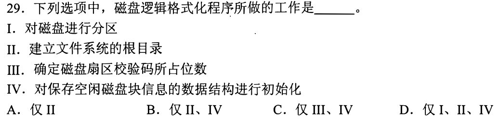

逻辑格式化在已划出的分区上创建文件系统的**根目录 II**，初始化记录空闲盘块的位图/FAT 等结构 **IV**；磁盘**分区 I** 是更早的划分，扇区校验码/低层物理布局 **III** 属物理格式化范畴。**仅 II、IV，选 B**。第一笔给动作标“物理格式化→分区→逻辑格式化（文件系统结构）”所处层次。

为什么初始化空闲块结构是必要的

新文件系统得知道哪些块可分配，根目录也得成为路径解析起点；否则无法安全创建文件。把磁盘划成两个分区只是容器划界，不替每个分区建立目录或空闲表。

## 18｜2017-31：同一 inode 的元数据共享，两次独立打开各有偏移

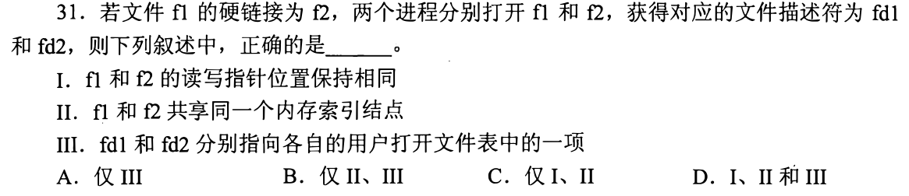

硬链接 f1/f2 是同一文件的两个名字，共享一个内存索引结点 II；两个进程分别调用 open 得到 fd1/fd2，各指自己的用户打开文件表项 III。各次打开维护的读写位置**不必相同**，I 错，故 **II、III，选 B**。第一笔画 `f1/f2→同一 inode` 与 `fd1/fd2→各自打开状态` 两层。

不要把“同一数据内容”推成“同一文件偏移”

两个进程可分别从开头和中部读同一文件，读取行为当然不必同步。若复制同一个已打开描述符可能共享打开文件描述与偏移，那是另一种场景；本题明确分别打开两个硬链接名。

## 19｜2018-31：四种优化分别压不同的 I/O 成本

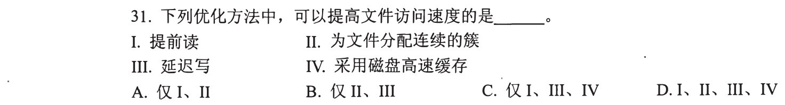

提前读 I 隐藏未来等待；连续簇 II 减少跨块寻道；延迟写 III 合并/避开短时间反复写；磁盘高速缓存 IV 让命中请求不必访问盘。四者均可提高文件访问速度，**选 D**。第一笔不要把“写入延迟”误读成“每次访问一定变慢”，要看总体 I/O 请求数量和前台响应。

措施不保证任一负载都获益

错误预读可能浪费带宽，写缓存要考虑一致性；题问“可以提高”而非在所有工作负载无条件改善。只需各找一个合理的获益场景即可接受四项。

## 20｜2019-26：空闲空间管理找的是“哪些块还能分配”

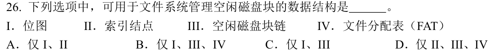

位图 I 按位标空闲/占用，空闲盘块链 III 串空闲块，FAT IV 可用表中状态/链接信息管理盘块分配，三者可承担空闲块管理；索引结点 II 记录**某个文件**的元数据与数据块位置，不是全盘空闲块结构。**I、III、IV，选 B**。第一笔问这个结构面向“整盘可用池”还是“单文件索引”。

为什么 FAT 同时像链又能管空闲

FAT 表项可存下一块编号或空闲标记，扫描/维护表便知道可分配块；它也帮助沿文件链找到后续块。一个结构兼有文件分配与空闲管理用途，不等于 inode 也自然具备全盘空闲表作用。

## 21｜2019-31：十位页目录号、十位页号按位切，不按十六进制整位切

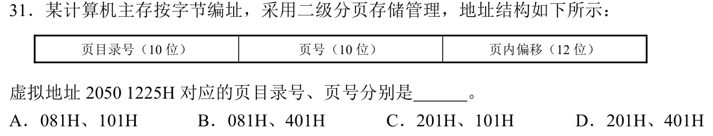

地址 `2050 1225H` 共 32 位，低 12 位页内偏移 `225H`；剩 20 位拆高 10 位目录号与次 10 位页号。算 `(地址>>22)=081H`，`(地址>>12)&3FFH=101H`，故 **081H、101H，选 A**。第一笔先剥去低 12 位，再每 10 位切一次；十六进制每位只有 4 位，不能凭四位字符直接拆成两半。

低 12 位为何是 225H

低三位十六进制正好 12 bit，`1225H` 末三位是 `225H`。中间页号在位 12—21，必须掩码 `3FFH` 留 10 位；若直接把右侧四位 `1225H` 看成页号，会把偏移也卷进去。

## 22｜2020-23：共享同一文件的属性，不强迫各进程同一种打开方式

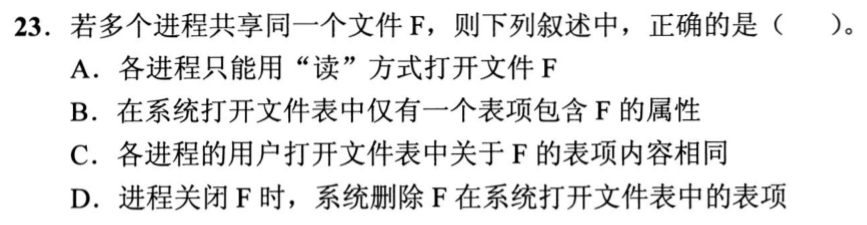

多个进程可按各自权限以读或写方式打开 F，A 错；每个进程的用户打开文件表项可有不同 fd/读写位置，因此 C 的“内容相同”错；关闭一个句柄不意味着别人都已关闭，D 错。系统打开文件表可保留 **一个与 F 关联的共享表项/属性信息，选 B**，并记录打开引用。第一笔区分“全系统共享文件身份/属性”和“进程私有的 fd 与打开状态”。

与 18 的偏移区分

18 的各次独立打开可有各自偏移；本题 B 用“仅一个表项包含 F 的属性”考文件公共元数据不必为每个进程复制。具体 OS 的打开文件描述组织可更复杂，题的抽象层次是系统级共享项与用户级各自表项。

## 23｜2020-30：设备独立的目标是替换硬件时维持应用接口

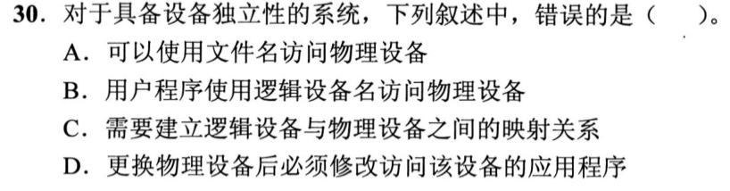

应用通过设备文件名/逻辑设备名访问，OS 维护逻辑设备到物理设备的映射，A/B/C 是设备独立性的做法。D 说更换物理设备后**必须修改应用程序**，恰好违背抽象的目的，**选 D**。第一笔问应用依赖的是稳定的逻辑名还是具体硬件编号。

映射改变放在驱动与 OS 管理层

换设备可能需要装驱动、重新配置映射，应用可继续使用同一逻辑设备接口。设备行为若根本改变，应用可能另作适配；题说的物理设备更换本身不必然要求改程序。

## 24｜2020-31：4 字节 inode 号是文件数量的直接上限

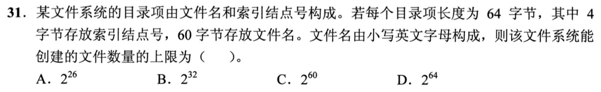

每目录项给索引结点号 **4B=32 位**，至多编号 `2^32` 个 inode/文件对象，**选 B**。文件名可用 60 个小写字母位，可能组合数远大于此；64B 是一条目录项长度，不是可建文件数 `2^64`。第一笔找“全系统文件身份唯一标识”能取多少值，而非把文件名字符数当上限。

实际可创建数一般更小

物理空间、文件系统预留 inode、目录容量等会先形成其他限制；题问给定结构的**上界**，32 位 inode 编号给出硬上限。不同目录可有同名文件，不能以文件名组合数作为全系统文件数上限。

## 17—24 收束

逻辑格式化建立目录和空闲表；打开路径把系统级文件身份与每进程句柄分层；空闲块结构管理全盘池，inode 管单文件；磁盘优化逐项问是否减少请求/寻道/前台等待。位段题照 0829 的分段取位，不凭视觉把十六进制字符当固定字段。

## 25｜2021-30：删原文件并不强制删指向它的快捷方式

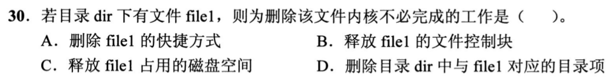

删除 file1 时要去掉 dir 中对应目录项，最后引用消失时可释放 FCB 与数据块；但指向它的**快捷方式/符号链接**是另一个独立目录项，可能继续存在并成为悬空链接，内核不必自动查遍全盘删除，**选 A**。第一笔沿 03 的软链接区分“目标内容”和“指向目标的另一文件”。

“不必”与“绝不”不同

用户或文件管理工具可以额外清理失效快捷方式；题问内核为删除目标文件**必须**完成的工作。自动遍历所有软链接既无必要又可能昂贵。硬链接计数与打开句柄可能影响真正回收时机。

## 26｜2023-31：最后关闭文件释放打开期内存状态，不删持久文件

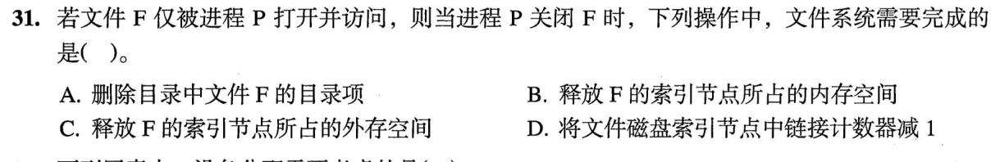

F 仅由进程 P 打开，P 关闭后系统可把打开期缓存的**内存索引结点/打开表信息释放，选 B**。close 不是 unlink：不删除目录项 A，也不释放磁盘 inode C；硬链接计数 D 只随创建/删除目录硬链接变化，不因关闭文件减 1。第一笔把 `close` 与 `unlink` 写成不同动作。

与 12 的打开路径反向

首次 open 将文件元数据带入内存并建打开状态；最后 close 可释放该状态。磁盘上文件仍可在下次 open 再找到，故目录项和持久 inode 必须保留。

## 27｜2024-26：位图长度取决于总块数，不随空闲比例伸缩

位图给磁盘**每个块固定一位**，无论现在空闲 10 块还是 1000 块，位图都覆盖整个盘的块号空间，大小与**当前空闲块数量无关，选 A**。空闲表、成组链接、空闲链都按当前空闲块组织记录，其占用可随空闲数量变化。第一笔问结构是“为所有可能块预留位置”还是“只列出现有空闲者”。

总容量仍会影响位图大小

说与当前**空闲数量**无关，不是与磁盘总容量无关；总块数翻倍，固定一位每块的位图也大约翻倍。若把这两个数量混同，会误以为位图任何时候大小都不变。

## 28｜2024-29：按名字打开先走目录，按 fd 读写已有入口

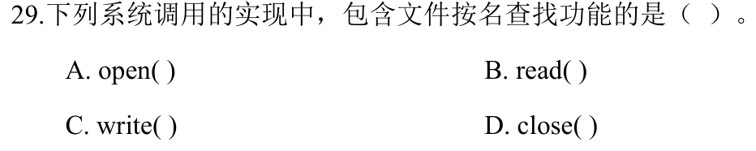

`open(path)` 参数含文件路径/名，OS 必须解析目录找到目标，**选 A**。`read/write/close` 通常拿已经打开得到的 fd，在进程打开文件表查状态，不再从文件名重新查目录。第一笔看调用参数是“名字路径”还是“已解析好的描述符”。

与 12 的首次 open 对照

首次打开需目录解析与 FCB；拿到 fd 后后续操作凭表项定位文件与当前偏移。若文件系统特殊路径操作另需名字，属于别的调用，不改变这四项标准语义。

## 29｜2025-28：VFS 是不同文件系统之上的统一调用界面

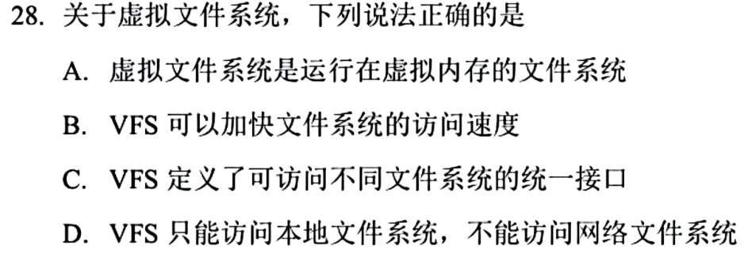

虚拟文件系统 VFS 定义通用文件操作接口，适配不同底层文件系统，**选 C**。它不是“跑在虚拟内存里的文件系统”A；有抽象层不保证必然加快访问 B；还可接网络文件系统，并非只访问本地 D。第一笔把 `应用 open/read → VFS 接口 → 具体文件系统` 写出来。

抽象解决兼容问题，不直接保证性能

缓存等实现可提升性能，但题问 VFS 的确定特性是统一路径与操作接口。不要因为“虚拟”一词联想到虚拟内存，也不要用“多一层/少一层”猜速度。

## 30｜2025-29：目录项放名字与 inode 号，权限由 inode 承载

新建文件 F 要初始化 inode A，并在目录中新增目录项 D、写入其 inode 号 B；题设目录项结构是“文件名+索引结点号”，**不在目录文件中写访问权限信息，选 C**。权限等元数据存于 inode。第一笔先读题给的目录项字段，选项若要求写没有的字段可直接排除。

为什么文件名和权限不必放同一个位置

多个硬链接名可指向同一 inode，权限作为文件对象属性共享；若每个目录项另存权限，会出现同一文件多个名字的属性不一致问题。目录的作用是名字→对象编号映射。

## 31｜2025-31：FAT 表项能标文件链也能标空闲块

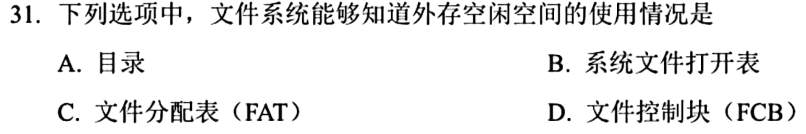

FAT 给各簇/盘块留表项，表项可记录下一块或空闲/结束状态，能知道外存空间使用情况，**选 C**。目录回答名字映射，系统打开文件表回答当前打开状态，单文件 FCB 回答文件元数据，都不是覆盖整个外存分配状态的结构。第一笔问“有没有每个磁盘分配单元的一格”。

与 20 的空闲结构对应

20 已把 FAT 与位图/空闲链归入全盘块管理；本题换成从四个结构中单选。FAT 同时服务文件块链接，不能因名字有“文件分配”就忽略其空闲标记。

## 32｜2025-32：文件系统可选逻辑块大小，不能改变硬盘机械特性

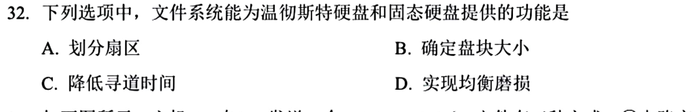

文件系统格式化时可为温彻斯特硬盘或 SSD 确定文件系统**逻辑盘块/分配块大小，选 B**。划分分区 A 通常先于在分区上建文件系统；降低寻道时间 C 是机械磁头相关，SSD 无该寻道；均衡磨损 D 是闪存控制/管理问题，机械盘无闪存擦写寿命。第一笔找对两类介质都适用且属于文件系统层的动作。

物理扇区大小与文件系统块大小

设备的物理扇区/页面粒度由硬件给出，文件系统可在其上选逻辑块或簇大小以管理文件。16 已演过扇区 512B、文件系统簇 1KB；两者不能混成同一个分配单位。

## 32 题收束：两遍三片的使用路线

第一遍慢练依次追 `目录名→目录项→inode/打开表→逻辑偏移→索引/FAT→数据块→设备 I/O`，每题只定位题目问的是哪一个对象或成本。第二遍盖答案后用首笔表把 32 题按名字、身份、块位置、空闲结构、读写流水分类；第三遍限时 1—2 分钟还原关键数值与错项依据。做不出来时至少先排“close 等于删除”“扇区等于簇”“同名/硬链接等于同一打开偏移”“分区自动减寻道”的路线。

本节点 32/32 是教学文稿覆盖，105+ 目标仍须以后用独立限时题目成绩验证，不用我写完来推断已经通关。
