[← 0830](0830.md) · [总索引](README.md) · [0901 →](0901.md)

# 0831｜设备服务：缓冲、磁盘与请求调度

> 能力线 `32-device` · 第 32/40 个节点 · 28 道真题引用
>
> [28/28 讲解](0831-answer.md) · [闭卷复盘](../review/main.md#r0831)

## 故事梗概

设备管理把应用请求转成驱动、控制器和物理设备能够执行的操作。缓冲解决速率差，磁盘调度改变寻道路径，设备命名与分配决定请求最终交给谁。

这里的日期是链表节点，不是完成期限；是否前进，由这条能力线能否从题干恢复决定。

## 题单

### 01 · 2009-29

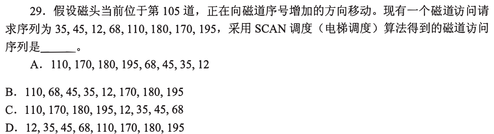

### 02 · 2009-32

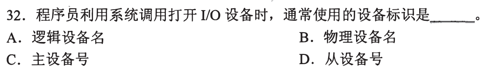

### 03 · 2010-32

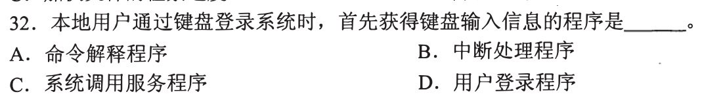

### 04 · 2012-26

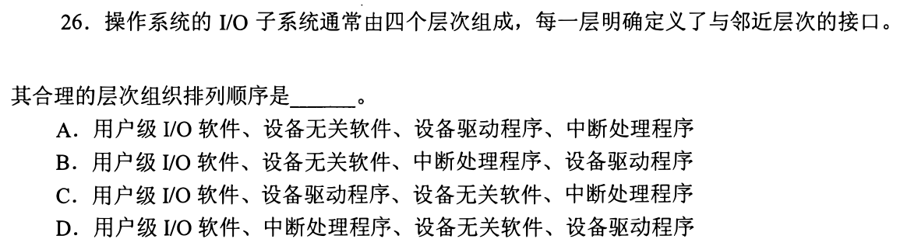

### 05 · 2012-28

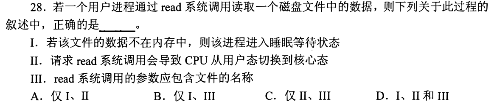

### 06 · 2012-29

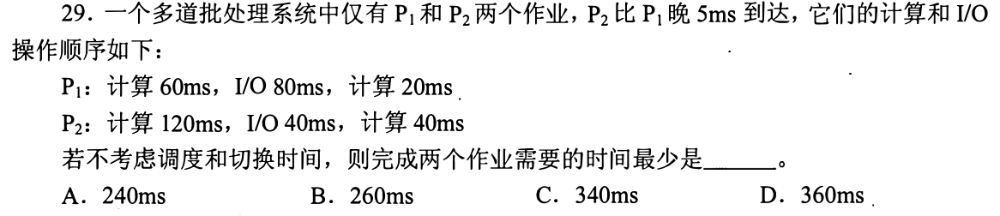

### 07 · 2013-20

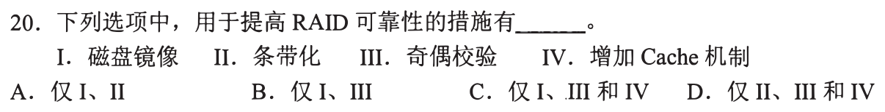

### 08 · 2013-21

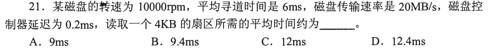

### 09 · 2013-29

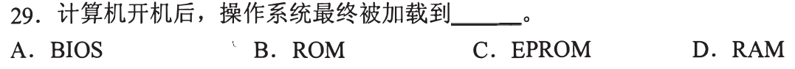

### 10 · 2013-31

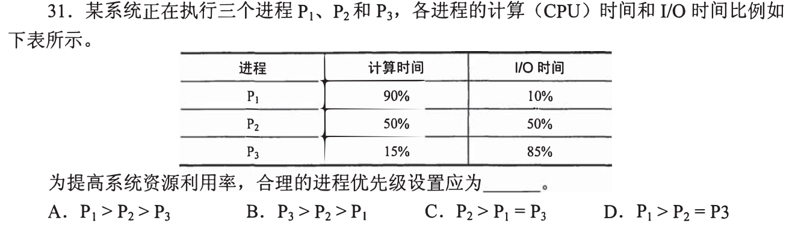

### 11 · 2014-26

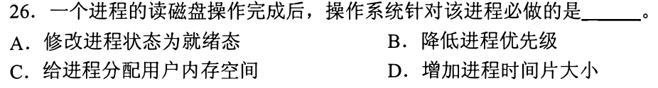

### 12 · 2014-27

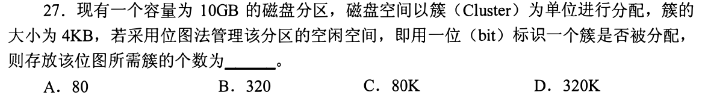

### 13 · 2014-31

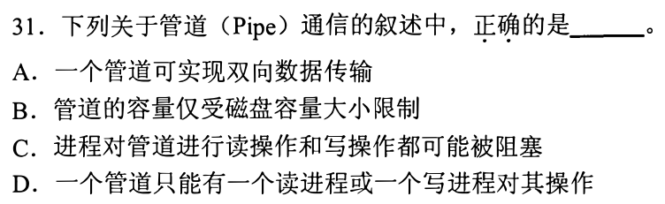

### 14 · 2015-20

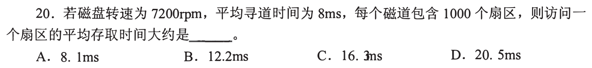

### 15 · 2015-28

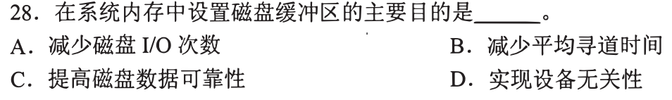

### 16 · 2015-32

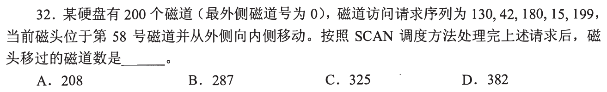

### 17 · 2016-24

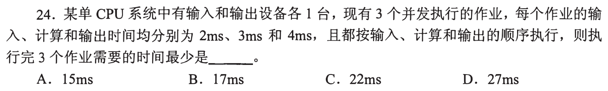

### 18 · 2016-31

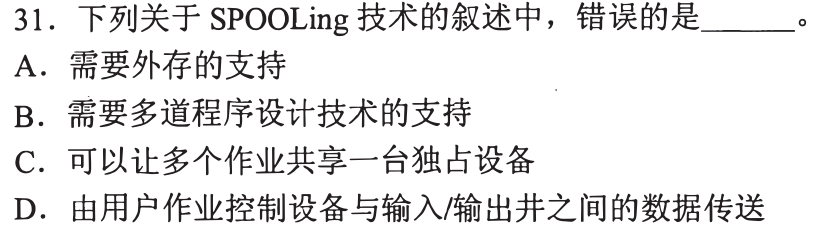

### 19 · 2017-28

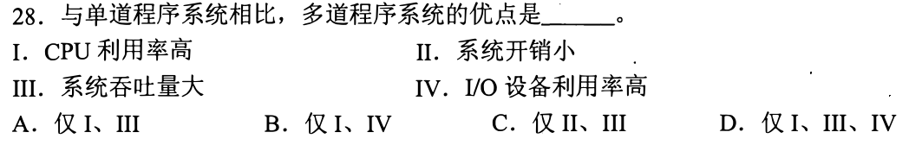

### 20 · 2017-32

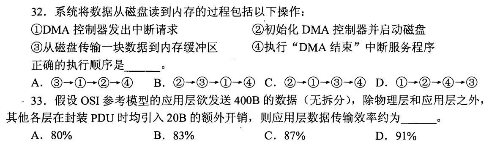

### 21 · 2018-27

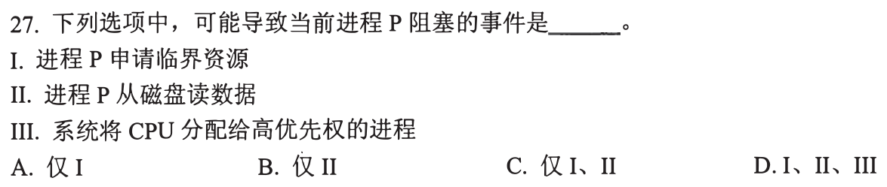

### 22 · 2018-30

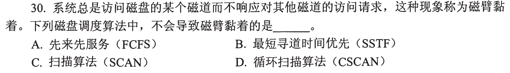

### 23 · 2019-20

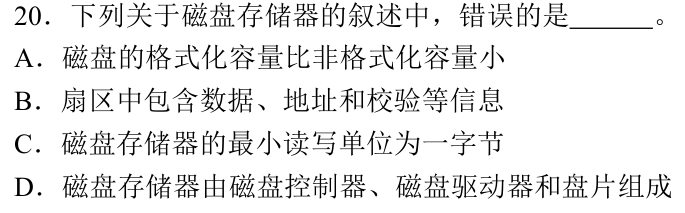

### 24 · 2021-26

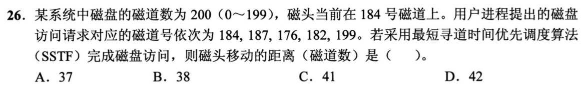

### 25 · 2022-32

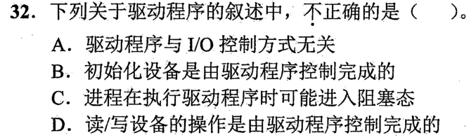

### 26 · 2023-32

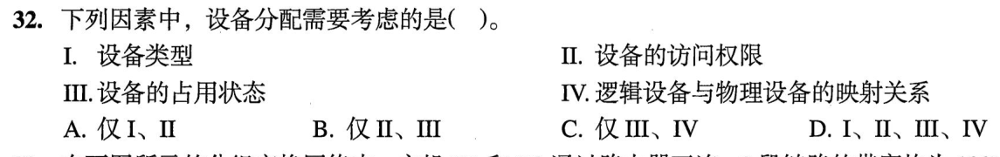

### 27 · 2024-31

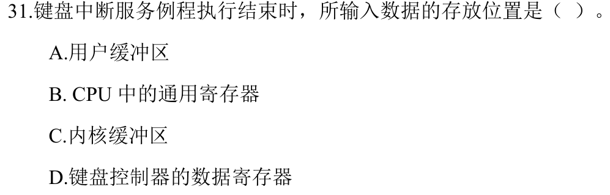

### 28 · 2024-32

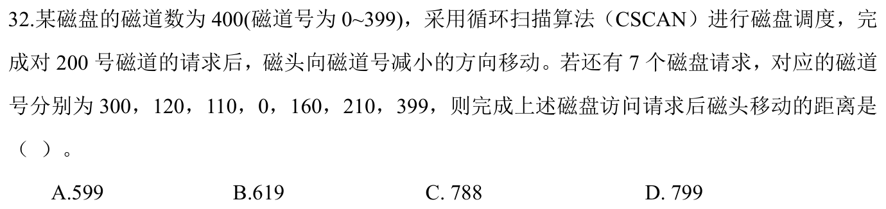

[← 0830](0830.md) · [总索引](README.md) · [0901 →](0901.md)
