[« 0831-answer](0831-answer.md)　　[0902-answer »](0902-answer.md)

# 0901 Answer｜分层路径：从端系统到逐跳转发

> [原题 18 题](0901.md) · [0831 设备服务](0831-answer.md) · [能力账本](answer-quality/learning-ledger.md)
>
> 从设备服务边界前进到网络路径，先分清端到端与逐跳。18 题原题核准；文稿覆盖不等于独立限时通关。

<strong>考场入口（01—08）</strong>

| 题 | 第一笔 | 答案 |
| --- | --- | --- |
| [01](#q01) | 端到端首次出现在传输层 | B |
| [02](#q02) | 体系结构说功能/协议，不规定内部实现 | C |
| [03](#q03) | 1000包、3段链路：1002个发送时隙 | C |
| [04](#q04) | IP网络层尽力而为、无连接 | A |
| [05](#q05) | ICMP直接依附IP承载 | B |
| [06](#q06) | 事件先后是过程特性 | C |
| [07](#q07) | 以太网MAC不建连接、不保证可靠 | A |
| [08](#q08) | 应用层下面相邻层是表示层 | B |
| [09](#q09) | 整报文两段串行；分组流水 | D |
| [10](#q10) | 会话层的直接下层是传输层 | C |
| [11](#q11) | 路由器3、交换机2、集线器1 | C |
| [12](#q12) | 5层各20B，400/500=80% | A |
| [13](#q13) | 自下第5层是会话层 | C |
| [14](#q14) | 图只示交互先后，属时序 | C |
| [15](#q15) | 传输层下邻互联网层负责路由 | B |
| [16](#q16) | 1000包两段，另加两次传播 | D |
| [17](#q17) | 端点10Mb/s限制所有路径 | B |
| [18](#q18) | 整报文串行＞分组流水＞电路 | B |

## 01｜2009-33：把“端到端”标在两台主机的进程间

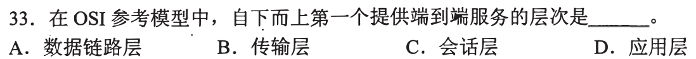

OSI 自下而上第一个向上提供**端到端**服务的是**传输层，选 B**。数据链路层只管相邻结点的帧，传输层服务于两端进程。第一笔圈“第一个”，再排掉更高的会话与应用层。

端点与服务层次

网络层负责跨网络的主机到主机路径；教材用传输层描述端到端的进程通信服务。不要把某一跳的成功传输等同整个路径的交付。

## 02｜2010-33：协议行为是公开约定，内部代码不在体系结构里

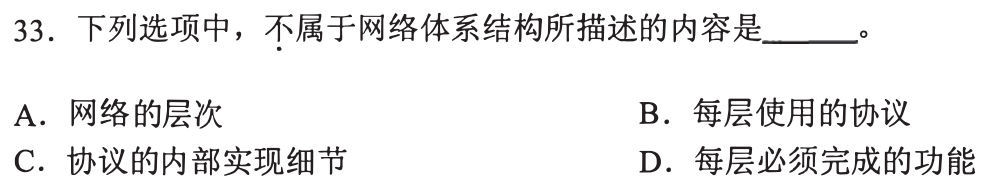

体系结构描述层次、每层功能与所用协议；**协议的内部实现细节不属于它，选 C**。第一笔问对端必须知道什么才能互通：报文与交互约定要知道，厂商的数据结构/代码不必知道。

接回设备无关接口

相同协议可以换实现而维持互通，和前一天逻辑设备名隔离硬件替换类似。A/B/D 是抽象层次与功能要求，C 属可替换机制。

## 03｜2010-34：存储转发流水线补最后一包跨后两段的时间

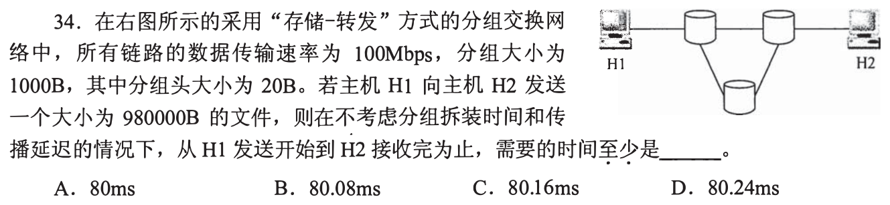

每包载荷 `1000−20=980B`，980000B 恰好 **1000 包**；100Mbps 每发一包 `1000×8/10^8=0.08ms`。H1→左上→右上→H2 是 **3 段链路**。第一包要3时隙，后面每时隙到一包，全部收到需 `(1000+3−1)×0.08=80.16ms`，**选 C**。第一笔先数包、数最短路的段数。

为什么不把整份文件乘三

左上转发第1包时，H1 已能发第2包，不同链路流水重叠。下方中继绕路多一段，题问“至少”取三段；题设忽略传播与拆分，不另加它们。

## 04｜2011-33：IP 是无连接、不可靠的数据报服务

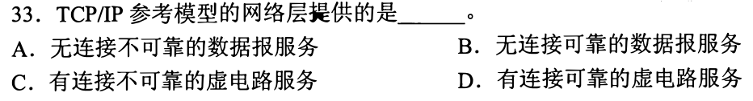

TCP/IP 网络层的 IP 每份数据报独立转发，不建立端到端虚电路，也不保证送达，**选 A**。第一笔把“网络层 IP”与上层 TCP 的可靠有连接服务分开。

不可靠的精确意思

路由器仍尽力路由与转发，但可能丢失、重复、乱序；某包成功抵达不代表层本身承诺可靠。可靠性可由端系统中的传输层补足。

## 05｜2012-33：ICMP 直接装在 IP 数据报里

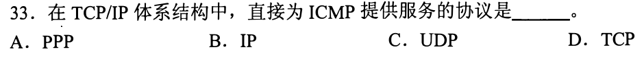

ICMP 的差错报告/诊断报文由 **IP 直接承载，选 B**。UDP/TCP 属传输层，PPP 属链路层，都不是题问的直接承载者。第一笔只画相邻封装：`IP首部｜ICMP报文`。

ping 是应用，ICMP 仍非 UDP

发起诊断的程序位于应用侧，不意味着其 ICMP 报文经过 UDP 或 TCP。向下最终可以有 PPP 帧，但问“直接”时不能跨层。

## 06｜2012-34：“事件发生顺序”是过程特性

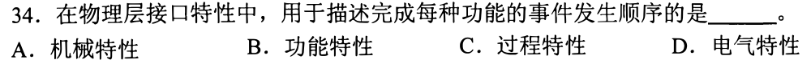

物理层接口描述各功能的事件先后、时序，归**过程特性，选 C**。第一笔圈“顺序”：机械看接头引脚，电气看电压，功能看各线作用，过程看何时动作。

防止只看“功能”二字

题干说“完成每种功能的事件发生顺序”，分类依据是顺序，而非所执行功能的名称。四特性对应连接形态、电平、用途、时序。

## 07｜2012-35：MAC 的校验不构成可靠交付承诺

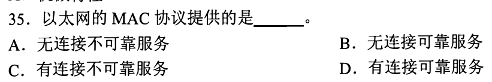

以太网 MAC 发帧前不建连接，错误帧可丢弃而无该层的确认重传保证，因此**无连接、不可靠，选 A**。第一笔锁定“MAC”层，不把 TCP 的可靠性借给它。

发现错误与恢复错误

帧校验序列能帮助发现坏帧；保证可靠还需要确认、重发等动作。其他层后来补救不改变 MAC 本身的服务性质。

## 08｜2013-34：应用层正下方的表示层做格式转换

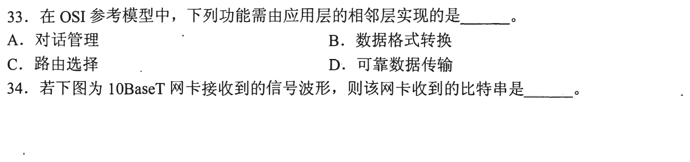

OSI 从上到下应用→**表示**→会话→传输→网络→链路→物理。应用层相邻层实现的数据格式转换属于**表示层，选 B**。第一笔只向下走一格；会话管理、路由与可靠传输各有别层。

裁图范围与现实实现

图下半出现第34题波形题，不属于这里引用的第33题。现实 TCP/IP 应用可能合并表示/会话功能；本题明确问 OSI 七层职责。

## 09｜2013-35：整报文等全部到齐，分组可前后重叠

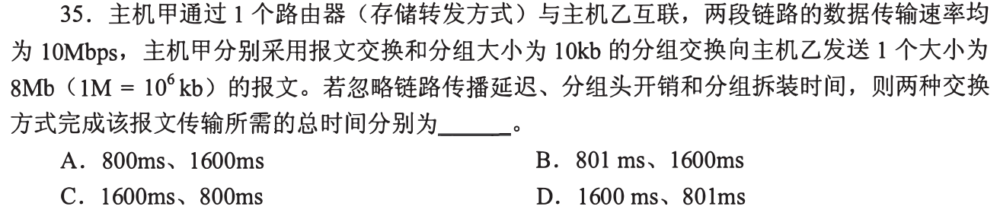

8Mb 在 10Mbps 链路发送一次需 **800ms**。报文交换的路由器先收完整报文再发下一段，合 **1600ms**；**10kb** 分组每个发送需 `1ms`，`8Mb/10kb=800` 包，两段流水需 `(800+1)×1=801ms`。依次是 **1600ms、801ms，选 D**。第一笔在原图上圈好 `10kb`，别误看成 `1kb`。

为什么多出1ms

第一包需两段各1ms；后续799包因链路流水，每隔1ms到达一包，共801ms。这里 8Mb=8000kb，分组大小是10kb；单位与分组大小两处都要读准。

## 10｜2014-33：会话层直接使用传输层服务

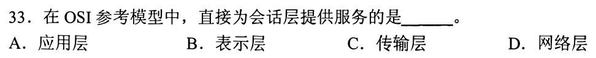

OSI 顶部是应用→表示→会话→**传输**，故直接为会话层提供服务的是**传输层，选 C**。第一笔从会话向下只挪一层，不跳到网络层。承接 08 的“应用的下邻是表示”，再向下两格即可。

直接服务与最终经由

会话的数据最终也会经过网络与物理链路，但“直接”指相邻层的服务接口；应用层则在会话层之上，不是提供者。

## 11｜2016-33：按设备看懂的最高地址给层号

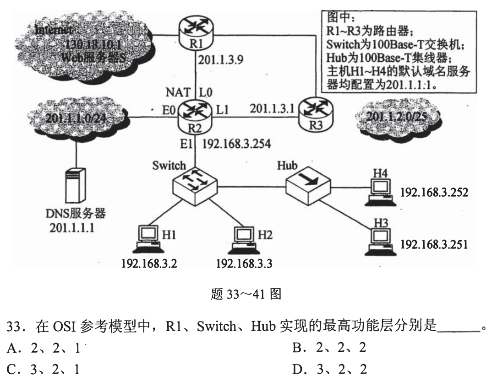

路由器 R1 看 IP 地址、选下一跳，最高到**网络层3**；交换机看 MAC 帧，最高到**数据链路层2**；Hub 只再生比特信号，**物理层1**。`3、2、1`，**选 C**。第一笔问设备凭哪种地址/信号决定动作。

“最高”并非只运行这一层

路由器也要接收物理信号和链路帧，交换机也有物理端口；最高功能层才是题目分类依据。普通以太网交换机与三层交换设备需按题设称谓和实现区分。

## 12｜2017-33：七层里排除头尾，数五份开销

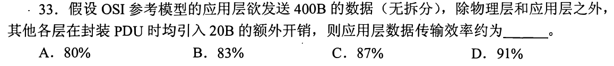

OSI 七层去掉应用与物理，还有表示、会话、传输、网络、链路 **5 层**各加 20B，总 `400+5×20=500B`；应用数据效率 `400/500=80%`，**选 A**。第一笔不要误把“其余各层”算六或七层。

定义为何取应用数据/链路PDU

题说无拆分，故一次装入同一个最终帧的数据部分；物理层不再加题设 20B。只问应用数据在传输总量的占比，不能把每层中间 PDU 的大小累加当线路上传的多份数据。

## 13｜2019-33：自下数第五层是会话

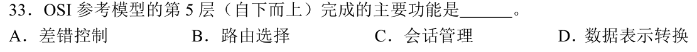

自下依次物理1、链路2、网络3、传输4、**会话5**；会话管理，**选 C**。第一笔先写 1—5 层名，再连功能。差错控制可分层出现，路由属网络层，表示转换属表示层，不凭单一关键词“网络”乱选。

与 08、10 复用同一排列

应用7→表示6→会话5→传输4，三个题只改变问的位置或直接相邻层。学一次序列即可，后面不必重背整章。

## 14｜2020-33：图上箭头的先后只说明时序

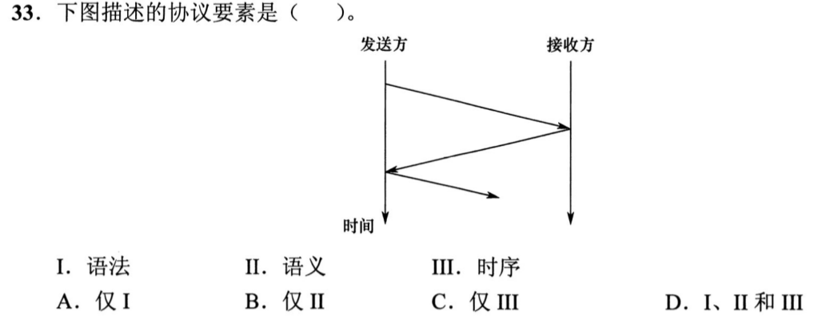

原裁图只有题干和选项，缺发送方/接收方的往返箭头。查看[2020原卷第25页](../past_papers/2020年计算机408统考真题.pdf)后，图只给两方随时间向下的三次交互方向与先后，未标报文格式或含义。因此仅 **III 时序，选 C**。第一笔问能否从图读出字段如何编码或动作表示什么；读不出就别选语法/语义。

三个协议要素的判据

语法规定格式，语义规定字段/动作的意义，时序规定何时发送及先后。图中箭头有方向和顺序，但没有标帧结构与控制意义。该题原裁图需要修复，原卷链接供核验。

## 15｜2021-33：TCP/IP 传输层下方的网络层选路

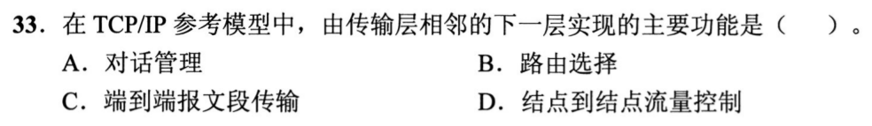

传输层相邻的下层是互联网层/IP 网络层，主要功能有**路由选择，选 B**。第一笔定位“下邻”再找职责；会话管理在上层应用相关功能，端到端报文段传输属传输层，结点到结点流控可由链路机制处理。

与 04 合并

04 题问 IP 提供什么服务，15 题问它做什么动作：尽力转发数据报时要决定下一跳。服务承诺与内部转发功能是两种问法。

## 16｜2023-33：流水发送时间再加两段传播时延

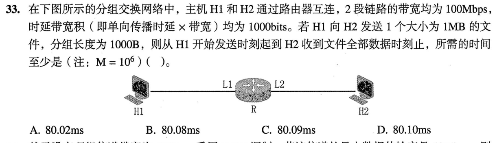

1MB=`10^6 B`，每包1000B，共1000包；100Mbps 发送一包 `0.08ms`，两段存储转发共 `(1000+1)×0.08=80.08ms`。各段时延带宽积1000bits，传播时延 `1000/10^8s=0.01ms`；两段再加0.02ms，总 **80.10ms，选 D**。第一笔把时延带宽积除带宽，恢复每段传播时间。

与 03 的唯一新量

03 忽略传播；这里明给 BDP，须对两段各加一次。BDP 是链路上在途比特数，不是又一个分组大小，也不改变存储转发的包数。

## 17｜2024-33：最快内部路径也要过两端 10Mb/s

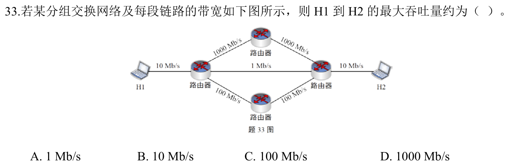

H1 入网链路与 H2 出网链路均 **10Mb/s**。即使中途走两条 1000Mb/s 的上方链路，整个端到端路径吞吐不超过入口/出口的 10Mb/s，且可达到，**选 B**。第一笔沿一条可行路径取最小链路速率，再从多路径中取最大。

为什么不是图中1Mb/s或1000Mb/s

中间直线1Mb/s 是可避开的路径；上方1000Mb/s不消除端点10Mb/s瓶颈。多个并行路径也共享相同端点链路，不能把中间带宽相加就超过端口速率。

## 18｜2025-33：整报文等待最长，分组流水居中

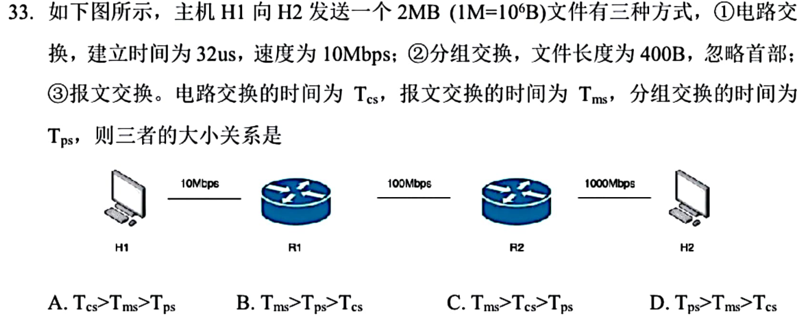

2MB 经首段10Mbps 序列化需 **1.6s**。报文交换在两台路由器各等完整报文，再分别经100/1000Mbps发，`1.6+0.16+0.016=1.776s`。分组交换5000个400B包，首段每包0.32ms，尾包还跨后两段各0.032/0.0032ms，约 **1.6000352s**。电路交换先建路32μs，再以首段瓶颈连续传，约 **1.600032s**（忽略其他时延）。所以 **Tms＞Tps＞Tcs，选 B**。第一笔先比三者都绕不开的首段1.6s，再比附加的整报文串行/末包流水/建路。

两者仅相差微秒，不可只靠直觉

分组首包后，后续高速段可与首段并行；最后一包从 R1 到 R2 再到 H2 要0.0352ms。电路建路额外0.032ms，所以按题设忽略传播/首部，电路略快于分组。若把整份文件在每段都串行，那算的是报文交换，不是分组交换。

## 01—18 收束

端到端与逐跳先标端点；协议规定互通行为，内部实现可替换。存储转发先数包与链路段，再加题目明确给的传播、建路或首部成本；路径吞吐受沿路最小带宽限制。18/18 已讲，限时熟练度待测。
