[« 0901-answer](0901-answer.md)　　[0903-answer »](0903-answer.md)

# 0902 Answer｜信号与速率：码元、带宽与纠错距离

> [原题 14 题](0902.md) · [0901 分层路径](0901-answer.md) · [能力账本](answer-quality/learning-ledger.md)
>
> 已会按路径求传输时间；本组回到一条物理信道，先判断一次码元承载多少比特、再判断限制来自无噪声带宽还是噪声。14/14 原题核准；限时独立作答待测。

<strong>考场入口</strong>

| 题 | 第一笔 | 答案 |
| --- | --- | --- |
| [01](#q01) | 4相×4幅=16状态；2W=6k码元/s | B |
| [02](#q02) | 四相每码元2bit，2400/2 | B |
| [03](#q03) | 位中跳变读曼彻斯特波形 | A |
| [04](#q04) | 传播速度不决定每秒多少比特 | D |
| [05](#q05) | 编码1按电平、编码2每位中跳变 | A |
| [06](#q06) | 香农8k×log₂1001≈80k，取一半 | C |
| [07](#q07) | 30dB≈10bit/Hz；2log₂M≥10 | D |
| [08](#q08) | 物理地址不属物理接口四特性 | C |
| [09](#q09) | 虚电路不必逐条预留带宽 | B |
| [10](#q10) | 差分曼彻斯特看位开始处有无跳变 | A |
| [11](#q11) | 2×200k×log₂4=800kb/s | C |
| [12](#q12) | 48M/(2×4M)=6bit，64状态 | C |
| [13](#q13) | 两频率表示0/1是FSK | C |
| [14](#q14) | 最小码距4，检3纠1 | C |

## 01｜2009-34：QAM 状态数先乘，再取对数

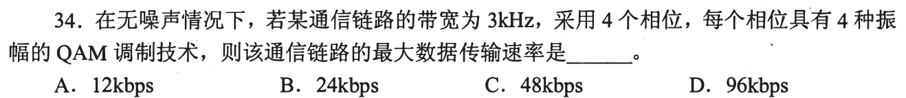

4 个相位、每相位 4 种幅度，共 **16 种可区分状态**，每码元 `log₂16=4bit`；无噪声 3kHz 信道奈奎斯特上限为 `2×3k=6k` 码元/s，因此 `6k×4=24kbps`，**选 B**。第一笔写“相位×幅度”，不要把4+4当8。

两个乘法的对象不同

状态组合数是4×4；每个状态编码的位数是取 log₂，最终比特率才乘码元率。若有信噪比，还要与香农界比较；本题明确无噪声，只用带宽与状态数。

## 02｜2011-34：已知比特率，反求码元率

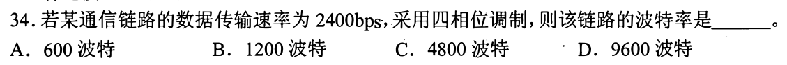

四相位提供 `log₂4=2bit/码元`，2400bps 对应 `2400/2=1200` 波特，**选 B**。第一笔确认 bps 数的是比特，波特数的是码元，二者只在每码元1bit时相等。

承接01的逆运算

01 用码元率×每码元位数得到比特率；这里把比特率除以每码元位数。相位是信号状态，不直接等于比特数。

## 03｜2013-34：曼彻斯特每位中间必有跳变

虚线之间一格是一个比特；看**每格正中**电平跃迁方向，按题用10BaseT 的约定，低→高记0、高→低记1，依次为 `0011 0110`，**选 A**。第一笔只标八个格子的中点，不把格子边界处额外跳变多算一位。

读波形时先确定约定

曼彻斯特的位中跳变兼带时钟，边界也可能为衔接下一位而跳。不同资料会画相反的0/1电平约定，考试需用具体以太网约定和给定选项核对；相邻的第33题属于表示层职责，不能混用题号。

## 04｜2014-35：传播速度影响延迟，不决定数据率

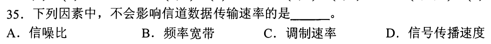

题问**不会影响信道数据传输速率**：信噪比限制可辨信息，频率带宽限制码元快慢，调制速率是信号状态变化快慢；**传播速度 D**决定信号在一段距离上要走多久，不直接改变每秒能注入多少比特。第一笔分“链路上同时在途多久”和“发送端每秒发送多少”。

接回0901的BDP

传播时延=距离/传播速度；时延带宽积=传播时延×比特率。比特率与传播速度在这个乘积中是不同量，不能见“速度”就选成传输速率。

## 05｜2015-34：第一条按电平，第二条每位中间跳变

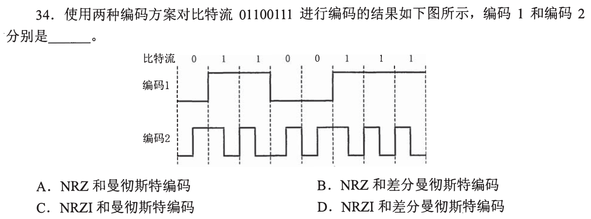

编码1 对 `01100111` 呈低、高、高、低、低、高、高、高，直接用电平代表位，是 **NRZ**；编码2 每个比特格子中间都有跃迁，是**曼彻斯特编码**。组合 **选 A**。第一笔用连续两个1：编码1中间不跳，故不是“逢1翻转”的 NRZI。

与差分曼彻斯特的判别位置不同

普通曼彻斯特用**位中跳变方向**表0/1；差分曼彻斯特的位中也必跳，却用**位开始边界有无额外跳变**表0/1。下一道波形题应先问测哪里。

## 06｜2016-34：给30dB就先用香农上限

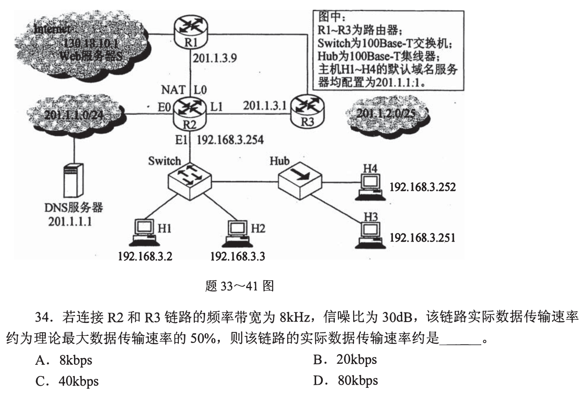

`30dB=10log₁₀(S/N)`，所以信噪比约1000。香农容量 `8kHz×log₂(1+1000)≈8k×10=80kbps`；实际为50%，约 **40kbps，选 C**。第一笔把 dB 换成线性 S/N，不能直接把30放进对数。

共用拓扑定位链路，数值代入香农公式

题图上方是第33—41题共用拓扑，题干在下方；它用来定位 R2—R3 链路。本题速率计算只需题干给定的 8kHz、30dB、50%，无需把其他链路参数或 NAT 功能代入。题没给离散电平数，不能擅用奈奎斯特的 log₂M 来代替香农。

## 07｜2017-34：令奈奎斯特上限追上香农上限

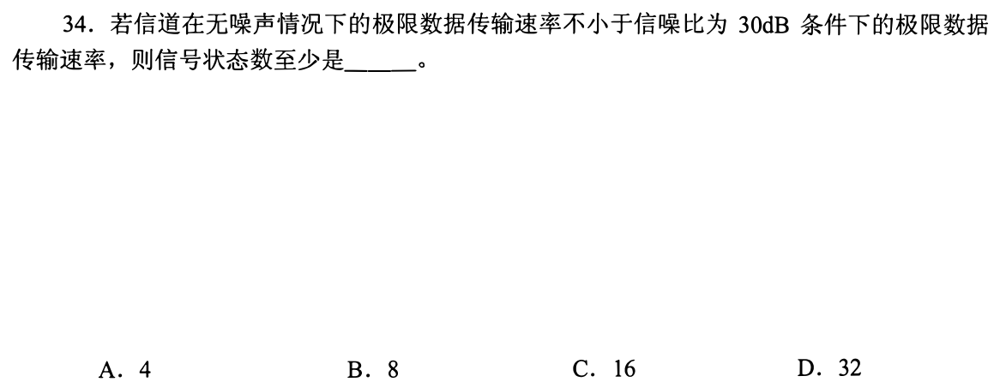

同带宽 W 下，无噪声极限 `2Wlog₂M`，30dB 时噪声极限约 `Wlog₂(1001)≈10W`。要求前者不小于后者：`2log₂M≥10`，所以 `M≥2⁵=32`，**选 D**。第一笔看 W 两侧会抵消，题不用给具体带宽。

“无噪声极限不小于有噪声极限”不是实际信道无噪

这是比较两种上界，找最少信号状态数；实际系统即便采用32状态，也不能无条件达到香农容量，编码与实现有损耗。

## 08｜2018-34：物理接口规定形状、引脚、电平和时序

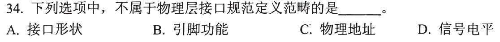

接口形状是机械特性，引脚功能是功能特性，信号电平是电气特性；**物理地址 C**是链路层标识，不是物理层接口规范范畴。第一笔把“物理”二字从“地址”前拿走，问它用来识别谁：网卡 MAC 地址而非插头电平。

承接0901-06

接口还有过程特性，规定事件顺序。本题四选一“ 不属于”，三个选项都能落入上述物理接口特性，只有地址跨到链路层。

## 09｜2020-34：虚电路要建状态，不必逐条预留带宽

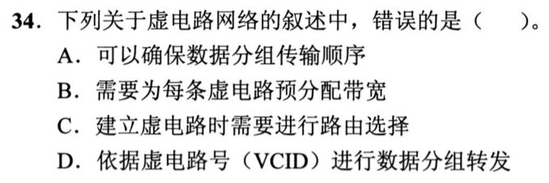

题问**错误**：虚电路建立时选路，传送时按 VCID 转发，同一连接的分组沿既定路线可保序；**并非每条虚电路都必须预分配带宽，选 B**。第一笔区分“预先建立转发状态”和“预先独占容量”。

与0901-04 的IP数据报对照

无连接 IP 数据报逐份找下一跳；虚电路预建逻辑路径。但虚电路可统计复用，是否保证带宽取决于服务机制，不是虚电路定义的必然条件。

## 10｜2021-34：差分曼彻斯特看边界，位中只做时钟

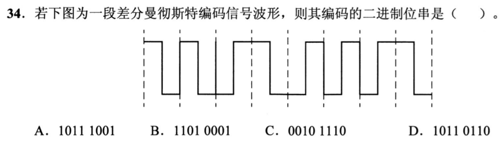

图的每一位中间都有跳变。按差分曼彻斯特常用约定，**位开始有跳变记0，无跳变记1**；依次读得 `1011 1001`，**选 A**。第一笔在各虚线处标“跳/不跳”，不拿位中高低电平套普通曼彻斯特。

首位的参照与选项验证

首位开始前没有给上一位电平，首位需用图所采约定/选项定位；第2至第8位的边界模式可直接读成 `0、1、1、1、0、0、1`，只有 A 的尾七位吻合。若忘记差分约定，先凭尾七位排除其他选项。

## 11｜2022-34：四幅度 ASK 每码元 2bit

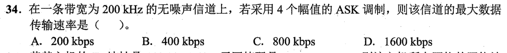

无噪声 200kHz 信道，最多 `2W=400k` 码元/s；四种幅度每码元 `log₂4=2bit`，数据率 `400k×2=800kbps`，**选 C**。第一笔只数幅度状态，别把 ASK 的4幅度当4bit。

回到01的通式

无噪声且 M 种离散信号状态：`Rmax=2Wlog₂M`。01 的QAM状态来自相位×幅度，11 的ASK只有幅度；区别是 M 怎么数。

## 12｜2023-34：由目标数据率反推 QAM 阶数

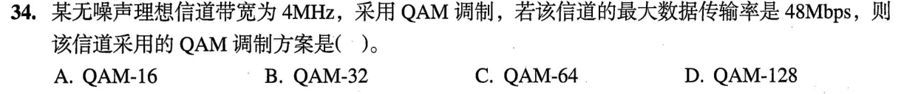

4MHz 无噪声信道奈奎斯特码元率最多8M波特。要48Mbps，每码元须 `48/8=6bit`，即 `2⁶=64` 种状态，**QAM-64，选 C**。第一笔先求每码元几bit，再把它指数化为调制状态数。

QAM后缀不是每码元位数

QAM-64 是64种星座点，每点携带6bit；若误把“64”当64bit/码元，量纲立刻不合。本题是11公式的逆题。

## 13｜2024-34：两个频率承载0/1是频移键控

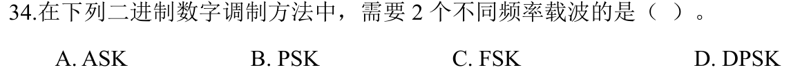

用两个不同**频率**的载波分别表示二进制状态，是 **FSK，选 C**。ASK 变幅度，PSK 变相位，DPSK 看相位差。第一笔圈题目明确变化的物理量，不从英文缩写反猜。

给09之前的调制题补完整对照

幅度 Amplitude、频率 Frequency、相位 Phase；QAM 将正交振幅分量组合成多状态。知道变量即足以选本题，无需推导载波波形。

## 14｜2025-34：最小码距决定保底检错和纠错

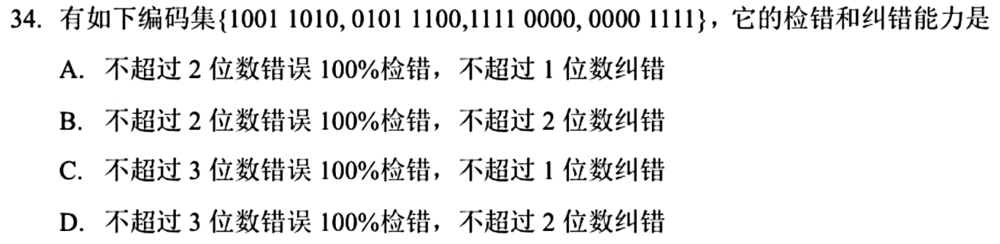

四个8位码字两两比较，不同位置数分别为 `4、4、4、4、4、8`，故最小汉明距离 **d=4**。可保证检出至多 `d−1=3` 位错误，唯一纠正至多 `⌊(d−1)/2⌋=1` 位错误，**选 C**。第一笔先找最接近的一对码字，不用把所有错误模式逐一枚举。

为何检3不等于纠3

出错3位不会变成另一合法码字，所以能发现；但它可能离另一个码字更近，无法确定原来是哪一个。纠错要求半径为 t 的各码字邻域不相交，即 `2t<d`。这里 d=4 时 t只能为1。

## 14题收束

先辨比特/码元/秒与信号状态数，再选奈奎斯特或香农；波形图看位中还是边界，别让熟悉的电平形状替代编码定义。码距题找最近码字并分开检错、纠错。文稿已覆盖14题，考场一两分钟的反应仍需遮住解释计时验证。

[« 0901-answer](0901-answer.md)　　[0903-answer »](0903-answer.md)
