[« 0902-answer](0902-answer.md)　　[0904-answer »](0904-answer.md)

# 0903 Answer｜链路可靠性：帧与重传状态

> [原题 19 题](0903.md) · [0902 信号与速率](0902-answer.md) · [能力账本](answer-quality/learning-ledger.md)
>
> 物理层能检错不等于保证交付；这里把帧编号、确认、计时器与窗口画成发送/接收双方状态。19/19 原题核准；限时独立作答待测。

<strong>考场入口（01—19）</strong>

| 题 | 第一笔 | 答案 |
| --- | --- | --- |
| [01](#q01) | GBN ACK3累计确认0—3，重发4—7 | C |
| [02](#q02) | SR各帧独立确认，仅重发超时0、2 | B |
| [03](#q03) | 128B短帧需窗口11，序号至少4bit | B |
| [04](#q04) | IP校验首部不保证不丢，I II IV | C |
| [05](#q05) | 2^r≥8+r+1，r=4 | C |
| [06](#q06) | 连续五个1后插0，逐位扫描 | A |
| [07](#q07) | 1000×0.08ms /100.08ms≈80% | C |
| [08](#q08) | CDMA每4位与A码相乘求和/4 | B |
| [09](#q09) | 目标80%需窗口8，GBN序号至少4bit | B |
| [10](#q10) | Hub广播H3，交换机定向H2 | D |
| [11](#q11) | 去AP帧：接收AP、发送H、目标R | B |
| [12](#q12) | 预约靠RTS/CTS交换 | D |
| [13](#q13) | 停等利用率T/(T+2Tp)=40% | D |
| [14](#q14) | 3bit空间8，发窗5则收窗≤3 | B |
| [15](#q15) | 数据、双向传播、长ACK各计时 | D |
| [16](#q16) | 相邻结点流控归数据链路层 | B |
| [17](#q17) | GBN窗≤7，SR双方同窗≤4 | B |
| [18](#q18) | CRC模2除10011，只有D余0 | D |
| [19](#q19) | ACK0腾F4；F1超时只补F1 | D |

## 01｜2009-35：GBN 的 ACK3 一次覆盖 0—3

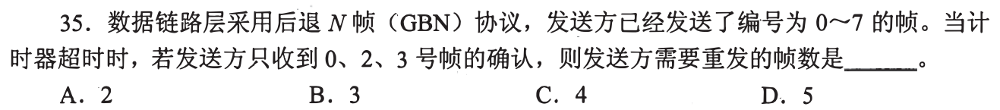

发送0—7后，即使单独的 ACK1 丢了，**GBN 的累计确认 ACK3**已表明0、1、2、3都被正确收下；超时从最早未确认4回退重发至7，共**4帧，选 C**。第一笔把“收到哪些 ACK”翻成“最早未确认序号”。

为什么不能只重发4

GBN 接收窗口通常为1，丢帧后的后续帧不会被缓存为独立已确认结果；发送方按最早超时帧起重发整个未确认窗口。若使用SR才按单帧计时与独立确认。

## 02｜2011-35：SR 已确认1，不陪0、2重发

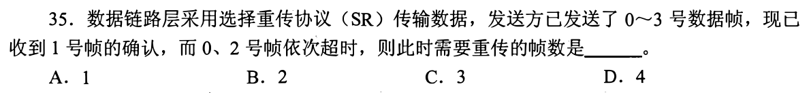

SR 对每帧分别计时与确认；0、2 超时就只重发**0、2**，1 已获确认不重发，3 尚未被说成超时也不重发。共**2帧，选 B**。第一笔列四格：0超时、1确认、2超时、3未超时。

与01同样的帧序列却不共用答案

GBN 的累计确认推进一个左边界；SR 的 ACK1 只说明帧1本身已收，接收方可以缓存乱序帧。不同协议决定“缺口之后”是否被迫重送。

## 03｜2012-36：窗口应覆盖允许范围内最短帧的确认周期

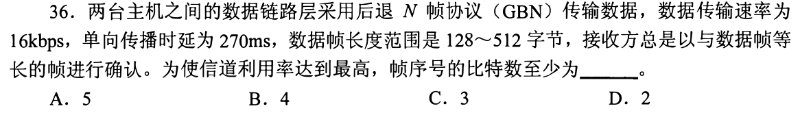

数据帧长度可在 128—512B 之间，要求信道利用率达到最高，不能只挑最长帧计算。128B 帧在 16kbps 上发送 `64ms`，同长 ACK 也需 `64ms`，往返传播 `540ms`。首帧从开始发送到收到确认为 `64+540+64=668ms`，要持续发送需窗口至少 `⌈668/64⌉=11` 帧。GBN 要求 `2^k−1≥11`，因此 **k 至少 4，选 B**。

为什么最长帧算出的 3 位不够

512B 帧发送 256ms，确认周期 1052ms，只需 5 帧窗口，3 位序号可满足；但窗口 7 在 128B 帧时只能连续发 448ms，尚未等到 668ms 的首 ACK 就会停发。长度范围内最短帧对应最大的窗口需求，必须用它保证题设最高利用率。

## 04｜2012-37：IP首部校验不承诺不丢包

路由器可运行路由协议维护路由表 **I**，拥塞时可合理丢弃分组 **II**，按目的IP和路由表选输出线路 **IV**。IP 首部差错校验只能发现部分首部错误，**不能确保分组不丢 III**。仅 I、II、IV，**选 C**。第一笔把“检查过”与“保证送达”拆开。

为什么放进链路可靠性节点

前一题在链路上用ACK/重传提供一定可靠性，IP层仍可因拥塞丢包；各层机制不能自动等同端到端交付。选项III正是把校验当成可靠传输。

## 05｜2013-15：海明码纠一位需区分所有出错位置

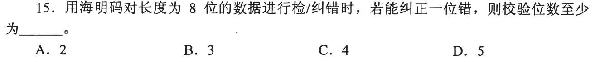

8位数据加 r 个校验位，一位错可发生在 `8+r` 个位置，另有“无错”，需 `2^r≥8+r+1`。r=3 时 `8<12` 不够；r=4 时 `16≥13`，至少**4位，选 C**。第一笔把校验位自身出错的位置也计入。

接回0902-14的码距

纠一位需要不同合法码字的半径1错误集合不相交；海明码用综合症定位错误位置。公式数的是不同综合症状态，不是简单地把8位数据除以某常数。

## 06｜2013-37：HDLC 每遇五个连续1就插一个0

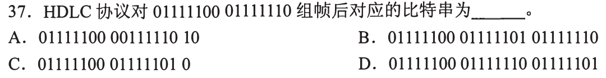

对数据串 `01111100 01111110` 连续扫描，发送方每遇连续五个1插0，得到 `011111000011111010`，按选项分组显示为 **`01111100 00111110 10`，选 A**。第一笔去掉题中空格，当一条连续比特流处理。

插入0不属于原始数据

接收方在帧内见五个1后去掉随后0，可恢复原串；此举避免数据里的长串1与帧定界标志混淆。不要把人为显示的8位分组空格当作新的独立帧边界。

## 07｜2014-36：窗口1000装不满100ms往返传播

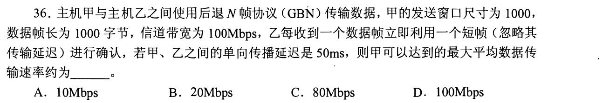

一帧1000B/100Mbps 发送 `0.08ms`，窗口1000帧连续发送需 **80ms**；短ACK可忽略传输时延，首ACK最早在首帧发完加双向传播100ms，即约 **100.08ms** 返回。窗口会停一段，平均吞吐约 `1000×8000bit/0.10008s≈80Mbps`，**选 C**。第一笔比较“窗口能持续发送多久”与“ACK回来多久”。

上限不能直接等于100Mbps

带宽够快但传播距离使窗口填满后等待确认；要接近100Mbps，窗口还需覆盖在途带宽时延积。1000不是序号空间，它在题中直接给出为发送窗口大小。

## 08｜2014-37：CDMA 解码用目标码片点积

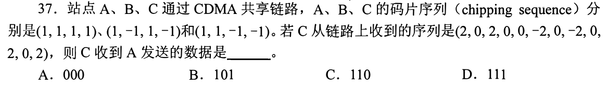

A 的码片 `(1,1,1,1)`。C 听到的12个数每4个一组，与A逐项乘后除4，三组得到 `+1、−1、+1`，对应 **101，选 B**。第一笔先按码片长度4分组，再做与目标站码的相关运算。

为什么别的站会消掉

B、C 的码片与 A 正交，点积为0；叠加信号与A做内积时只留下A的符号正负。若不除4，结果是±4，符号仍能判位，但数值不是解码后的±1。

## 09｜2015-35：目标利用率先求窗口，再求序号位数

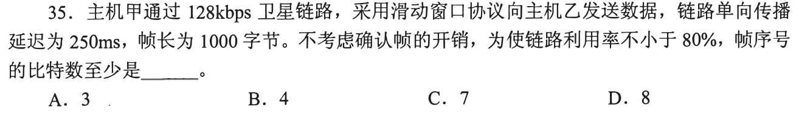

每帧1000B/128kbps 发送 **62.5ms**；往返传播 **500ms**，短ACK忽略，单帧周期 `562.5ms=9` 个发送时隙。要 ≥80%，窗口至少 `⌈0.8×9⌉=8` 帧。GBN 的发送窗口上限 `2^k−1`，3bit最多7，不够；**4bit，选 B**。第一笔把利用率条件写成 `W/9≥0.8`。

题只写“滑动窗口”时的序号约束

按通常连续ARQ/GBN的发送窗口不得占满整个模序号空间，否则新旧帧无法区分。若另给SR，还须用发送/接收窗口之和不超过序号空间；本题没有独立SR说明，取发送窗口≤2^k−1 的常用上界。3bit即使能写八个序号，也不能让窗口同时占八个。

## 10｜2016-35：集线器复制信号，交换机只转目标端口

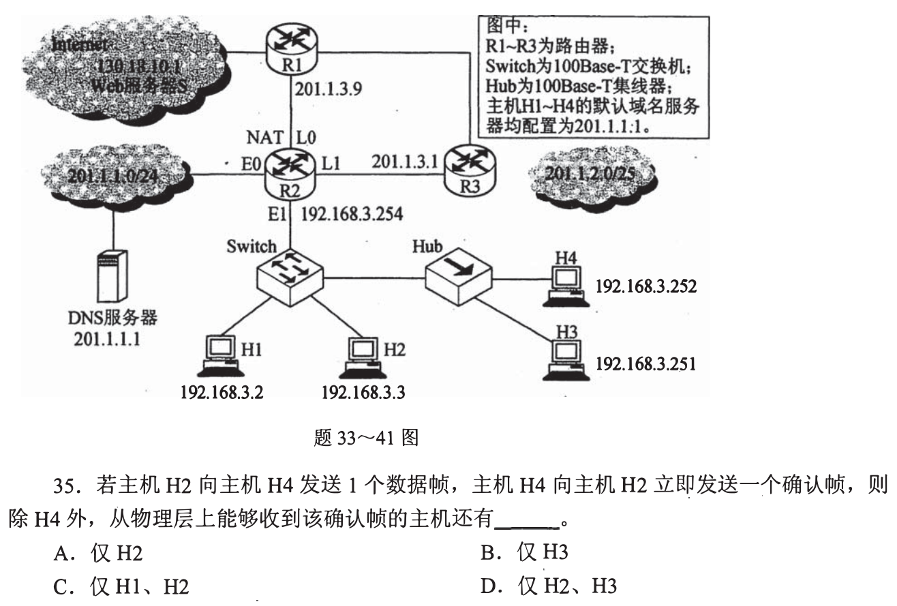

H4 发送给 H2 的确认帧先经过与 H3 共用的 Hub：物理层会复制到 H3；再到交换机，交换机按 H2 的 MAC 所在端口转发给 H2，H1 不收该信号。因此除 H4 外，**H2、H3，选 D**。第一笔画 H4→Hub→Switch→H2，并给 Hub 的另一端 H3 画一条复制支路。

题图跨题共用

当前题图上方已完整带有第33—41题共用拓扑；同年[2016-34](../bank/2016/q34.png)也引用此图：H1/H2 接交换机，H3/H4 接集线器。题问“从物理层上能够收到”，H3 即使因MAC地址不匹配丢帧，也已经收到电信号。

## 11｜2017-35：无线帧的接收点与最终目标可能不同

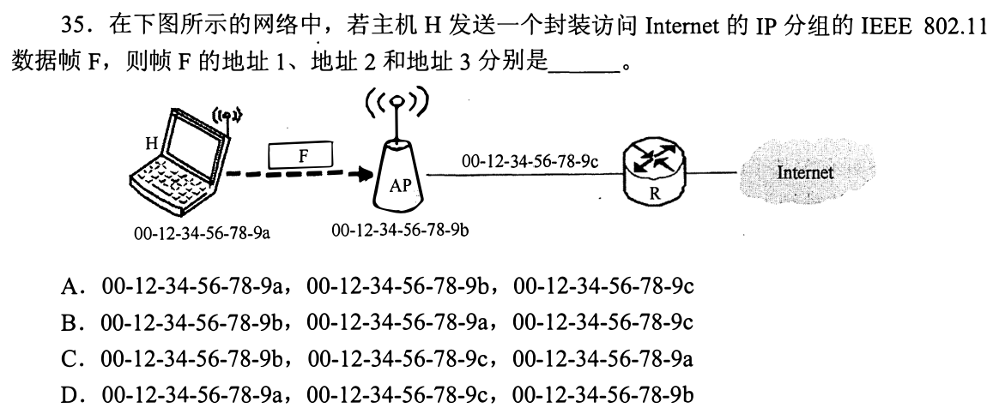

H 向 Internet 经 AP 发 IEEE 802.11 数据帧；当前无线链路的**接收者地址1是 AP 的 b**，**发送者地址2是 H 的 a**，**原始目的地址3是下一跳路由器 R 的 c**，**选 B**。第一笔画 H→AP→R，分别圈“这一跳谁收”和“跨过AP后给谁”。

三地址各有不同职责

AP 是桥接点，帧还得知道转出无线网后目的MAC。不能因为图上最终去 Internet 就把远端网站MAC写成地址3；该局域网内下一跳是 R。先判断 To DS 方向，再套接收、发送、目的。

## 12｜2018-35：CSMA/CA 的可选预约是 RTS/CTS

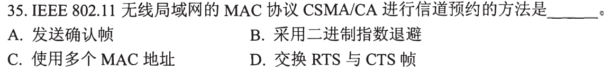

无线站点先发 **RTS 请求发送**，目标回复 **CTS 允许发送**，邻站可据持续时间暂避，因而用于信道预约，**选 D**。第一笔找请求/许可的成对控制帧，不把数据之后的ACK当预约。

另三项各在什么阶段

ACK 是成功接收后的确认；二进制指数退避用于竞争失败后的随机等待；多个MAC地址是帧的寻址结构。它们可在802.11中出现，但不是题问的“预约方法”。

## 13｜2018-36：停等40%反推数据帧发送时间

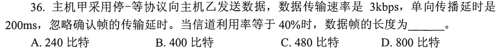

单向传播200ms，往返400ms，忽略ACK发送。停等利用率 `U=T/(T+400ms)=0.4`，解得 `T=266.67ms`。3kbps×0.26667s≈**800比特，选 D**。第一笔把有用发送时间放分子，把等ACK往返传播放分母。

不能拿200ms直接作周期

数据帧从甲传乙走200ms，确认从乙返甲再走200ms；停等下一帧要等确认返回。传播时延与帧发送时延可重叠在不同位置，但从发送首帧开始至可再发的一轮合为 T+2Tp。

## 14｜2019-35：发送窗口5侵占8个序号，SR接收窗口最多3

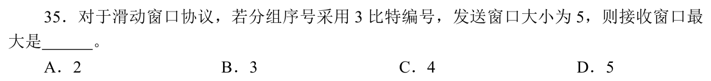

3bit序号只有 `2³=8` 个值。选择重传若发送窗口5，为免旧帧重传与下一轮新帧混淆，`W_s+W_r≤8`，故接收窗口至多 **3，选 B**。第一笔先写序号模8，再从总空间中扣发送窗口。

“SR双方各最大一半”不是这题的条件

只有要求发送窗与接收窗相等时，二者各至多4；题明确发送窗是5，接收窗就不能再取4。接收方缓存乱序帧需要独立序号空间。

## 15｜2020-36：停等长ACK不能当作瞬时确认

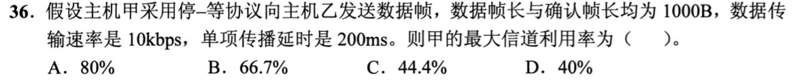

1000B、10kbps，数据帧发送 `8000/10000=0.8s`；确认帧也 **0.8s**；单向传播0.2s，两程0.4s。一轮总 `0.8+0.4+0.8=2.0s`，有用发送0.8s，利用率 **40%，选 D**。第一笔按题干读确认帧长度，不能沿用13的“忽略ACK”。

重用公式时要改分母

13 的短ACK周期 `T_d+2T_p`；这里周期 `T_d+2T_p+T_ack`。题不同不是方法矛盾，而是明确开销不同。若忽略长ACK会算成66.7%干扰项。

## 16｜2022-33：相邻结点流控在链路层

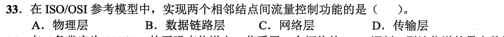

ISO/OSI 中两个**相邻结点**之间的流量控制属**数据链路层，选 B**；传输层处理端系统之间的端到端流控。第一笔标“相邻”还是“端到端”，与0901-01同一端点定位动作。

为何不是物理层

物理层传比特与规定接口特性，不处理帧序号、缓冲接收能力、确认等链路控制状态。不同层可以都谈流控，但管辖范围不同。

## 17｜2023-35：同样3bit序号，GBN可比等窗SR放更多未确认帧

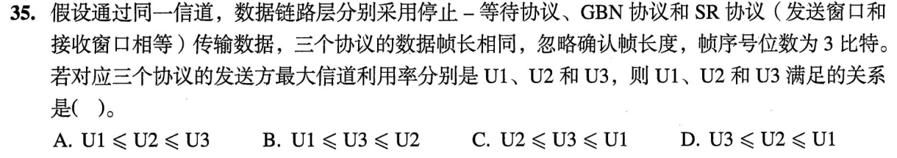

停等发送窗1，GBN最多 `2³−1=7`；SR题设收发窗口相等，`W_s+W_r≤8`，故双方最多各4。忽略ACK长度且同样数据帧，窗口越大，上限利用率不降，于是 **U1≤U3≤U2，选 B**。第一笔先求三个允许窗口 `1、7、4`，再排效率。

是“≤”而非一定严格小于

忽略 ACK 发送时间时，停等利用率为 `1/(1+2T_p/T_d)`；只要传播时延 `T_p>0`，就严格小于100%，不能把“很短”说成“完全没有等待”。较短传播下，GBN 与 SR 的窗口可能都已足够使利用率达到100%，于是 `U3=U2`；若传播也为0，三者才都可为100%。SR的选择重传在有错误时可少重发，但题没给差错过程，问无错误条件下最大利用率，不能仅凭名称判SR更高。

## 18｜2023-37：CRC只判余数为零，不能证明绝对无错

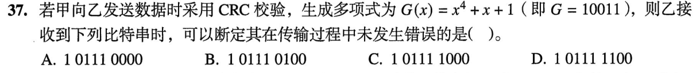

生成多项式 `G=10011`（5位，4阶），对四个候选完整比特串分别做模2除法，余数依次是 `1100、1000、0100、0000`，因此可判**未检出错误**的是 **D：101111100，选 D**。第一笔只做异或长除法，余0才是合法码字形式。

“可以断定未发生错误”的考试语义边界

严格说 CRC 余0 只能断定“校验通过”，不能排除某些不可检错的错误模式；本题在给定选项中以余0选D。若题问是否有数学意义的绝对无错保证，CRC不能作此承诺。比对余数比肉眼看1的个数可靠。

## 19｜2024-37：SR 的独立确认腾一格，超时只补一帧

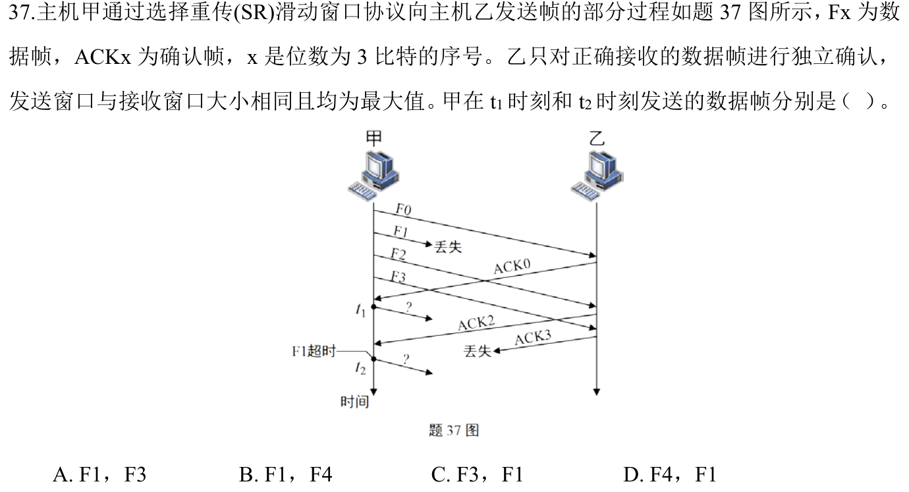

3bit 序号，SR 收发等窗最大各4；起初发F0—F3。t1 收到 **ACK0**，发送窗口空出一格，可发 **F4**，尽管F1丢失；t2 明示**F1超时**，SR仅重发 **F1**。组合 **F4、F1，选 D**。第一笔在窗口四格上划掉独立已确认的0，另给F1保留计时器。

图里的ACK2与丢失ACK3

ACK2 证明F2到达，但不替代ACK1；ACK3 在返程丢失，发送方仍认为F3未获确认。即使t1先发F4，也不能因为ACK2跳过F1；t2是F1自己的超时，而非GBN式从F1重发整个尾巴。

## 01—19 收束

确认语义决定重传范围；窗口数先由发送时间与往返时间算，再由序号空间限制。MAC地址要分当前无线接收点与跨AP目的；CRC余零只表示校验通过。19/19 已讲，独立限时表现待验。

[« 0902-answer](0902-answer.md)　　[0904-answer »](0904-answer.md)
