[« 0903-answer](0903-answer.md)　　[0905-answer »](0905-answer.md)

# 0904 Answer｜局域网转发：一帧经过介质、Hub与交换机

> [原题 21 题](0904.md) · [0903 链路可靠性](0903-answer.md) · [能力账本](answer-quality/learning-ledger.md)
>
> 已会按链路层地址与确认状态追踪帧；本组再问共享介质中谁能看到信号、交换机何时学习与跨网何时换帧。21题逐项讲解；第14题原卷题面与选项不一致，独立限时待测。

<strong>考场入口（01—21）</strong>

| 题 | 第一笔 | 答案 |
| --- | --- | --- |
| [01](#q01) | 交换机看目的MAC | A |
| [02](#q02) | 最小帧少800bit，最大单程传播少0.4μs | D |
| [03](#q03) | 广播域由路由器隔开 | D |
| [04](#q04) | CSMA/CA收正确帧发ACK | D |
| [05](#q05) | ARP由下一跳IP找MAC | A |
| [06](#q06) | CSMA先听后发仍可冲突 | B |
| [07](#q07) | 读到6B目的MAC后可直通 | B |
| [08](#q08) | 未知c泛洪2/3；回a已学端口1 | B |
| [09](#q09) | 无线不能边发边检测冲突 | B |
| [10](#q10) | 交换机是多端口网桥 | A |
| [11](#q11) | 2.56μs单程预算扣Hub1.535μs | B |
| [12](#q12) | H1去网关MAC51，H2收到源网关MAC61 | D |
| [13](#q13) | 100BaseT 的T是双绞线 | A |
| [14](#q14) | 128B/10Mb/s/2=51.2μs；选项无匹配 | 异常 |
| [15](#q15) | 四个Hub各一冲突域，路由两侧广播域 | C |
| [16](#q16) | DIFS等待长于SIFS | A |
| [17](#q17) | 控制器到交换机的南向接口 | B |
| [18](#q18) | 第4次冲突，最多15个51.2μs槽 | C |
| [19](#q19) | H4属VLAN1，不学VLAN3的H6 | D |
| [20](#q20) | CTS后NAV=28+296+28+2μs | B |
| [21](#q21) | 第11次冲突指数封顶10，1023槽 | C |

## 01｜2009-36：交换机用目的物理地址决定出口

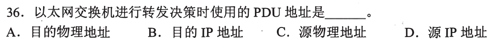

以太网交换机查帧的**目的MAC/物理地址，选 A**，结合MAC转发表确定输出端口。源MAC用于学习“这台设备在哪个入端口”，不是此帧的出口查询键；IP目的地用于路由层。第一笔在帧上分目的与源。

未知目的时仍有动作

若尚未学到目的MAC，交换机除入端口外泛洪，见08；这一例外不改变转发决策所依据的地址字段。MAC叫物理地址不意味着物理层处理它。

## 02｜2009-37：最小帧缩短，最远站距也要缩短

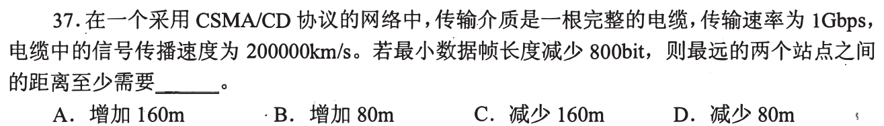

CSMA/CD 要保证发送最短帧期间仍能听见最远端冲突，即 `T_min≥2d/v`。最小帧少800bit、速率1Gbps，发送时间少 **0.8μs**；单向允许传播少0.4μs，传播速率 `2×10⁸m/s`，距离少 **80m，选 D**。第一笔写双向传播，避免把0.8μs全用在单向距离。

从时序看为什么要一往一返

甲刚开始发时，信号走到最远乙；乙在听见甲前也发，冲突还需传播回甲，甲必须尚在发送才可检测。最小帧长度与最长网络直径因此联动。

## 03｜2010-38：要抑制广播风暴，须隔开广播域

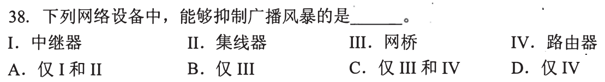

中继器、集线器只复制信号；普通网桥/交换机也会在同一广播域泛洪广播帧。**路由器 IV 隔开广播域，选 D**。第一笔问广播帧是否会跨过这个设备到另一个网络。

网桥对广播帧的细节

网桥可能用生成树避免二层环路导致的广播帧无限循环，但它本身仍转发广播，不能作为本题一般意义下的广播域隔离设备。路由器默认不跨网转发二层广播；抑制广播风暴在此指限制其传播范围。

## 04｜2011-36：无线CSMA/CA用接收确认

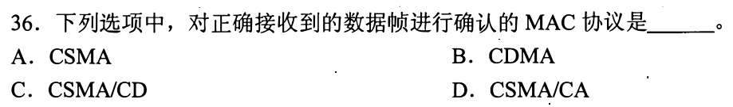

无线环境难以边发边可靠侦测冲突，CSMA/CA 采用避免竞争并由接收方对正确数据帧回**ACK，选 D**。CSMA/CD 的CD是冲突检测，不是正确接收确认；CDMA是码分多址。第一笔找“收到正确帧后谁回话”。

与0903-12的RTS/CTS前后位置

RTS/CTS可选地在数据前预约，ACK在数据后确认；两者不能互换。即使发送方没有检测到碰撞，也不能由此推断接收方已正确收到。

## 05｜2012-38：ARP把下一跳IP翻成链路目的MAC

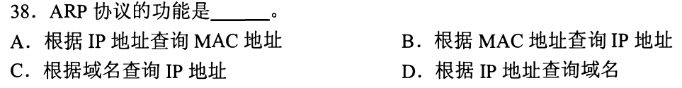

ARP 查询**给定IP地址对应的MAC地址，选 A**。同网段目的地就查目的主机IP；跨网目的地则查下一跳网关IP对应MAC，帧才能在当前链路上发出。第一笔区别“IP分组最终去谁”与“这一跳帧交给谁”。

与DNS的方向别混

DNS域名→IP，ARP IP→MAC；反向映射与域名解析不是此题ARP的基本功能。即便已有ARP缓存，逻辑映射方向仍相同。

## 06｜2013-36：先监听不保证同时开始者互不冲突

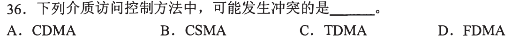

CSMA 是载波侦听多路访问，两站可能都在对方信号尚未传播到时认为介质空闲并发出帧，因此**可能发生冲突，选 B**。TDMA/FDMA预分时隙/频带，CDMA用不同码分离。第一笔画两端传播延迟，而不是把“侦听”当全局同步。

接02的最大传播边界

冲突窗口取决于远端信号到达多久；CSMA/CD加检测与重发，CSMA/CA以避免与确认应对无线场景。它们都是在普通CSMA会冲突的事实基础上加机制。

## 07｜2013-38：直通交换至少看完目的MAC六字节

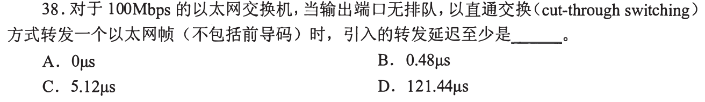

不包括前导码的以太网帧一开头就是 **6B目的MAC地址**；直通转发要先知道出口，至少接收48bit。在100Mbps 上耗 `48/10⁸s=0.48μs`，**选 B**。第一笔在帧格式上找作转发表查询的最早字段。

为何不是整帧时间

存储转发先收完整帧并可校验FCS；直通方式在目的MAC到手后即可开始转发，可能转出后来证实有错的帧。题说输出无排队，排除等端口的时间。

## 08｜2014-34：先学习源a，再对未知目标c泛洪

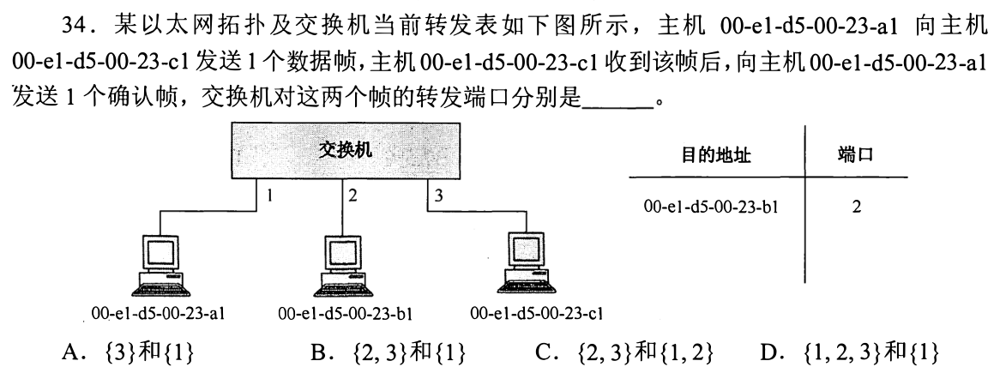

表里只知b→端口2。a从端口1发往c，交换机学 **a→1**；c目的未知，就从除入端口1外的 **{2,3}** 泛洪。c从端口3回ACK给a，已知a→1，只送 **{1}**。组合 **选 B**。第一笔按每帧“入端口学源→查目的→发出口”顺序走。

同一交换机表随帧变化

第一帧之后表已增加a→1；第二帧来到时又会学c→3。因此不能把初始表当永不变，亦不能因图上c在端口3就假定第一帧发送前交换机已知它。

## 09｜2015-36：无线适用CA，难以使用CD

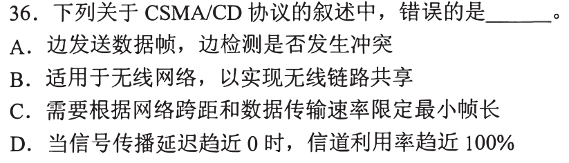

题问**错误**项：CSMA/CD 一边发一边检测冲突，主要用于共享式有线以太网；无线发送功率和接收信号强弱差异使此检测不可靠，无线通常采用CSMA/CA，因此 **B 错，选 B**。第一笔把CD与CA的末尾词读全。

其余选项的边界

A 描述CD；C 是最小帧与往返传播限制；D 在传播延迟趋0的理想条件下竞争损耗趋小，利用率可趋近100%，不等于现实中任何负载都恒为100%。

## 10｜2015-37：交换机是多端口网桥

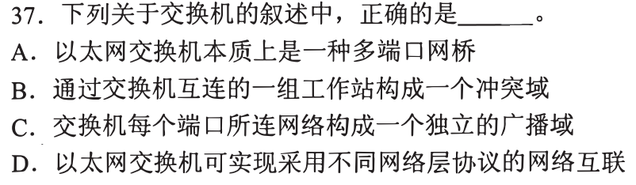

普通以太网交换机本质是**多端口网桥，选 A**。每端口可成为独立冲突域，同一VLAN/默认配置仍可能共享广播域；不同网络层协议互联靠路由等三层设备。第一笔分冲突域和广播域。

为何B、C看似互相相反

B“所有端口一个冲突域”错，因为交换端口分隔共享介质；C“每端口独立广播域”也错，广播帧可在所属VLAN内传播。会隔冲突不等于会隔广播。

## 11｜2016-36：64B最短帧，扣去Hub转发耗时

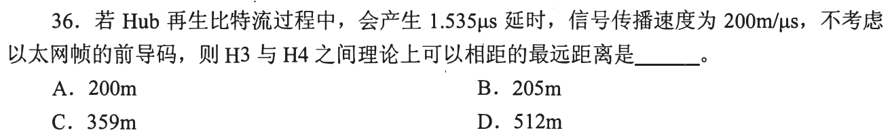

100Base-T 速率100Mbps，最短帧64B（不计前导码）发送需 `512/100M=5.12μs`，最大单程总延迟 **2.56μs**。Hub再生延迟 **1.535μs**，留给H3到H4之间信号传播 `1.025μs`；乘 `200m/μs` 得 **205m，选 B**。第一笔画碰撞往返并取半，再扣中继延迟。

为何Hub延迟只在单程扣一次

H3和H4均接同一Hub，信号单向从一端到另一端只经Hub一次；往返相当于传播和Hub延迟各两次。式子 `5.12≥2×(d/200+1.535)` 与单程预算等价。

## 12｜2018-37：IP跨路由器保持目标，MAC逐跳重写

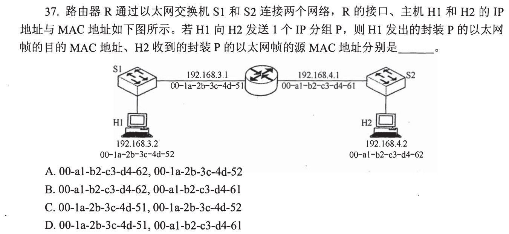

H1 `192.168.3.2` 到H2 `192.168.4.2` 跨子网：H1 首帧交默认网关左接口 MAC **…51**；路由器重新封装后，从右接口 MAC **…61** 发给 H2，因此 H2 所收帧的源MAC为…61，组合 **选 D**。第一笔在路由器两侧各画一张帧，不把最终H2的…62当首帧目的。

地址寿命

IP目的地址仍是H2的192.168.4.2，路由器按它选路径；链路帧只负责当前一跳。交换机S1/S2转发帧通常不替换源/目的MAC，替换发生在路由接口重新封装时。

## 13｜2019-34：100BaseT 名称中的 T 指双绞线

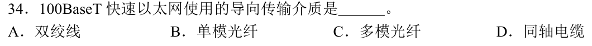

100BaseT 快速以太网的传输介质是**双绞线，选 A**。第一笔拆名称：100为100Mb/s，Base为基带，T为Twisted pair。光纤/同轴为其他介质规范。

读标准名只用到本题所需字段

具体双绞线类别与每种100Base-T子型的线对配置另有差别；题只问四种介质，不需展开布线参数。

## 14｜2019-36：先用最小帧的发送时长约束往返传播

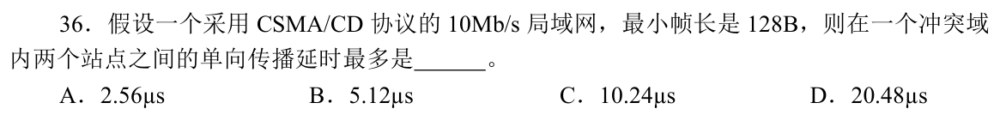

原题及[2019原卷第5页](../past_papers/2019年计算机408统考真题.pdf)均写 **10Mb/s、最小帧128B**。按 CSMA/CD 碰撞检测条件 `2Tp≤Tframe`，`Tframe=128×8/10⁷s=102.4μs`，所以单程 `Tp≤51.2μs`。然而选项是 **2.56、5.12、10.24、20.48μs**，**没有51.2μs**。第一笔依字节→比特→发送时间→除2计算；此题不能把不匹配的选项当已核准答案。

在卷面只能选时怎样保底

若必须涂卡，选项最大20.48μs 也满足“最多不超过51.2μs”，但它不是理论上的最大值，不能严谨地选为唯一正确。常见错误有把128B当128bit、漏双程或把10Mb/s误作100Mb/s；这些也无法同时还原原题全部数字。先保留争议并以题面公式为准，等待可靠勘误。

## 15｜2020-35：每个Hub一冲突域，路由器两侧两广播域

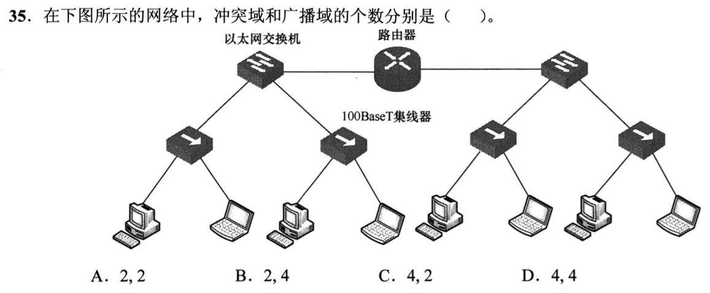

图中左右各两个集线器，每个Hub下两台主机共享介质，合 **4个冲突域**；交换机分隔它们，路由器把左右网络隔成 **2个广播域**，**选 C（4，2）**。第一笔先数Hub共享段，再在路由器处切开广播路径。

交换机端口与Hub段如何一起数

Hub连接其两台主机和交换机的那个端口属于同一冲突域，不是每台主机各一个；交换机至路由器的独立点对点链路在严格逐段统计时也各是一段。题设选项按四个共享Hub段给出冲突域数；若把连接路由器的交换端口另计，可能出现6的口径，需明确图题的统计范围。这里按试题预设四个终端共享段回答。

## 16｜2020-37：争用前等DIFS，已获预约的响应等SIFS

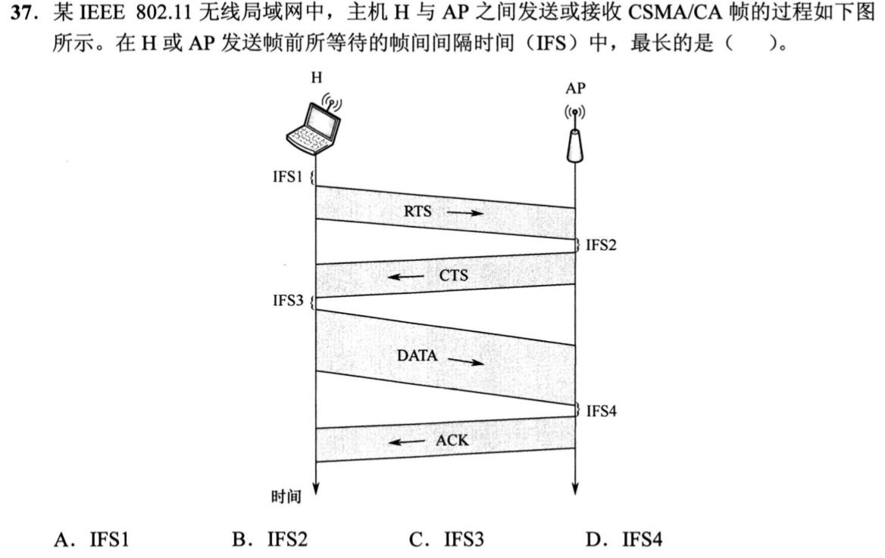

当前完整图显示 IFS1 在 H 发 RTS 前；新争用要等 **DIFS** 再退避，通常比 CTS/DATA/ACK 间的 **SIFS** 长，因此最长是 **IFS1，选 A**。第一笔把“开始争介质”与“预约会话内即时响应”区分。

图中四段

IFS2 在 RTS→CTS，IFS3 在 CTS→DATA，IFS4 在 DATA→ACK，均为短响应间隔；IFS1 在最初RTS前，需给已在进行的交换优先权。图中 IFS1 标记位于最上方发 RTS 之前，按这一位置判断。

## 17｜2022-37：SDN 控制器下发流表走南向接口

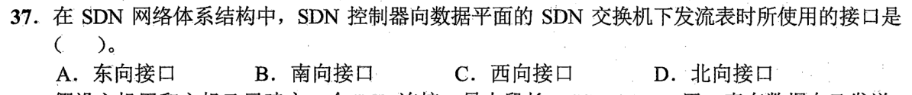

控制器在控制平面，交换机在数据平面；控制器向交换机下发流表用**南向接口，选 B**。第一笔在上下层画控制器→交换机的箭头。北向接口连接控制器与上层应用。

方向不是数据包方向

“南向”是架构图上控制层到基础设施层的接口称谓，不等于用户数据由北向南发。东/西向多用于控制器之间或横向协调，题里没有。

## 18｜2023-36：第4次冲突退避最多15个争用槽

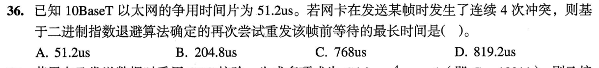

连续4次冲突，二进制指数退避在第4次从 `0…2⁴−1=15` 个槽中选；10BaseT 槽时51.2μs，最大等待 `15×51.2=768μs`，**选 C**。第一笔指数的 k 来自当前冲突次数，再减1得到最大随机整数。

不把前四次的等待全加进来

题问“再次尝试重发该帧前等待的最长时间”，这里求当前第4次冲突后的退避上限；已发生的前三次等待不属于这一次随机等待。若问累计历时，才需把各轮退避、发送与传播一并考虑。

## 19｜2024-35：VLAN先按端口分组，IP同前三段也不跨广播域

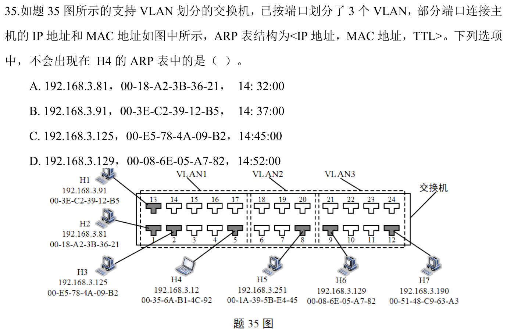

H4 接 VLAN1 端口5；H1、H2、H3 也在 VLAN1，H5 在 VLAN2，H6/H7 在 VLAN3。H4 的 ARP 表可出现同VLAN主机的IP/MAC，但**H6 `192.168.3.129` 的条目不会由VLAN1的ARP广播学到，选 D**。第一笔看端口所属VLAN，不被所有主机同为 `192.168.3.*` 的外观误导。

为何其余三项只是“可能”出现

H2/H1/H3的ARP响应能到H4所在广播域，缓存条目还取决于曾否通信与TTL；题问“不可能”，因此不必证明它们一定已在表中。没有三层转发设备或特别配置，VLAN3的H6不在H4直接ARP范围内。

## 20｜2024-36：听见CTS后预约的是剩余交换时间

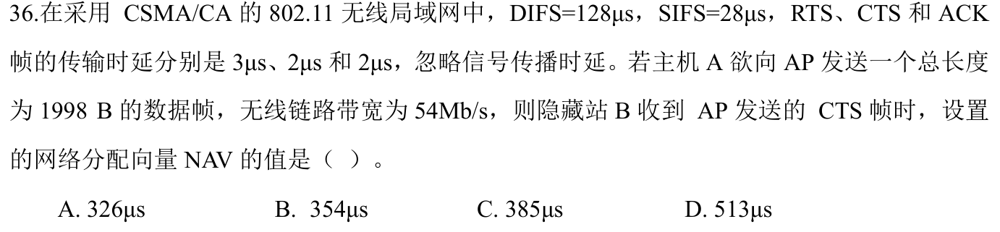

B 收到 AP 的 CTS 时，RTS与CTS自身已发完，不再计入剩余NAV。还要 `SIFS 28μs + DATA(1998×8/54Mb/s)=296μs + SIFS 28μs + ACK 2μs`，总 **354μs，选 B**。第一笔从“收到CTS这一刻”画右侧时间轴，DIFS发生在之前。

若选326μs漏了哪一段

`296+28+2=326μs` 只算DATA后等待ACK，漏CTS到DATA前的SIFS。无线预约让隐藏站B安静到ACK结束，这两段短间隔都受保护；无需加已过去的RTS/CTS传输。

## 21｜2025-35：碰撞次数过10后指数不再增大

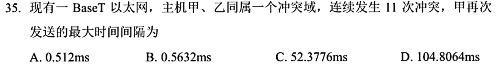

二进制指数退避取 `k=min(碰撞次数,10)`；连续11次冲突时 k仍是10，最大随机数 `2¹⁰−1=1023` 个槽。10BaseT 一个槽51.2μs，最大间隔 `1023×51.2μs=52.3776ms`，**选 C**。第一笔先封顶指数，再乘槽时。

与18的差别只有封顶

第4次用15槽，第11次不能用2047槽。若继续碰撞到标准规定重试上限，发送方报告失败；本题问第11次后下一次尝试，尚未进入失败终止判断。

## 01—21 收束

共享介质画往返传播时间，交换机按“入端口学源→查目的→未知泛洪”，路由器跨网重新封装链路帧；VLAN改变广播可达范围，无线预约按收到CTS之后的剩余时间计。21题已讲，其中第14题原题数字与选项不相容，未给伪答案。独立限时表现待验。
