[← 0904](0904.md) · [总索引](README.md) · [0906 →](0906.md)

# 0905｜网络地址：子网、分片与可达范围

> 能力线 `37-ip-address` · 第 37/40 个节点 · 17 道真题引用
>
> [17/17 讲解](0905-answer.md) · [闭卷复盘](../review/main.md#r0905)

## 故事梗概

IP地址题先确定前缀和主机部分，再讨论一个分组在MTU、分片或地址转换条件下怎样继续前进。近年变化主要是把IPv4计算扩展到IPv6和复杂拓扑。

这里的日期是链表节点，不是完成期限；是否前进，由这条能力线能否从题干恢复决定。

## 题单

### 01 · 2010-37

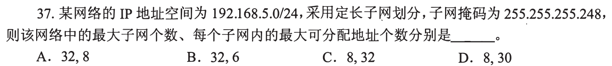

### 02 · 2011-37

### 03 · 2011-38

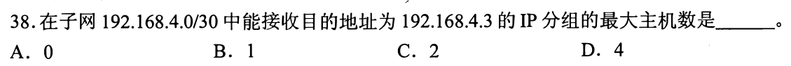

### 04 · 2012-38

### 05 · 2012-39

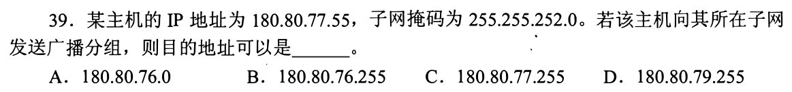

### 06 · 2016-39

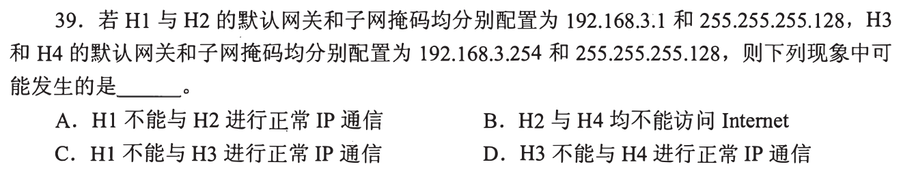

### 07 · 2017-36

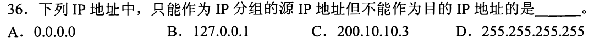

### 08 · 2017-38

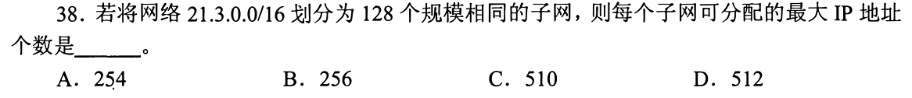

### 09 · 2019-37

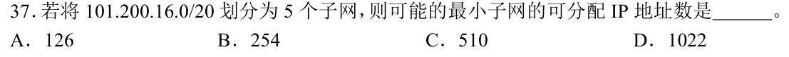

### 10 · 2021-35

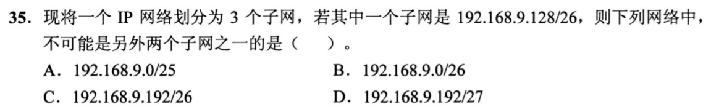

### 11 · 2022-35

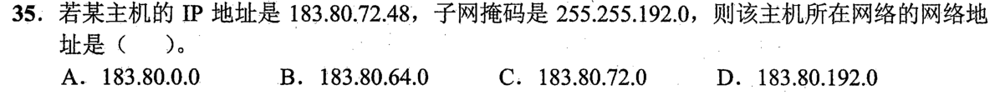

### 12 · 2022-36

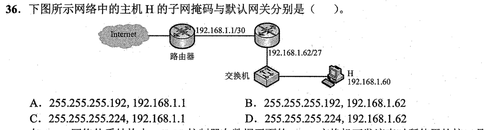

### 13 · 2023-38

### 14 · 2023-39

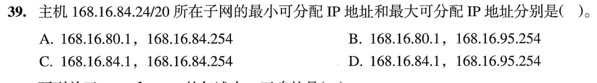

### 15 · 2023-40

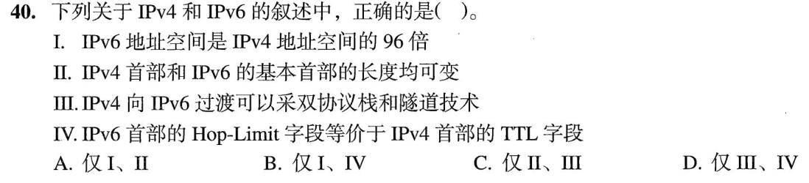

### 16 · 2024-35

### 17 · 2025-36

[← 0904](0904.md) · [总索引](README.md) · [0906 →](0906.md)
