[← 0905](0905.md) · [总索引](README.md) · [0907 →](0907.md)

# 0906｜控制转发路径：ARP、路由协议与下一跳

> 能力线 `38-routing` · 第 38/40 个节点 · 18 道真题引用
>
> [18/18 讲解](0906-answer.md) · [闭卷复盘](../review/main.md#r0906)

## 故事梗概

数据平面按表转发，控制平面负责形成这些表。ARP、ICMP、DHCP、NAT、RIP、OSPF和BGP位于不同位置，能力线要求判断当前缺少的是地址、下一跳还是路由知识。

这里的日期是链表节点，不是完成期限；是否前进，由这条能力线能否从题干恢复决定。

## 题单

### 01 · 2010-35

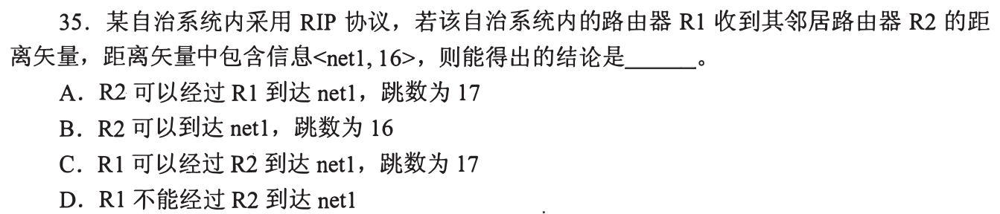

### 02 · 2010-36

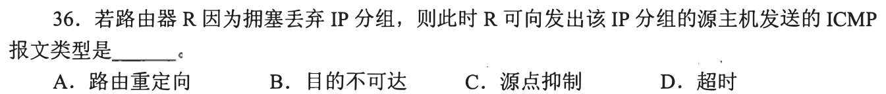

### 03 · 2011-37

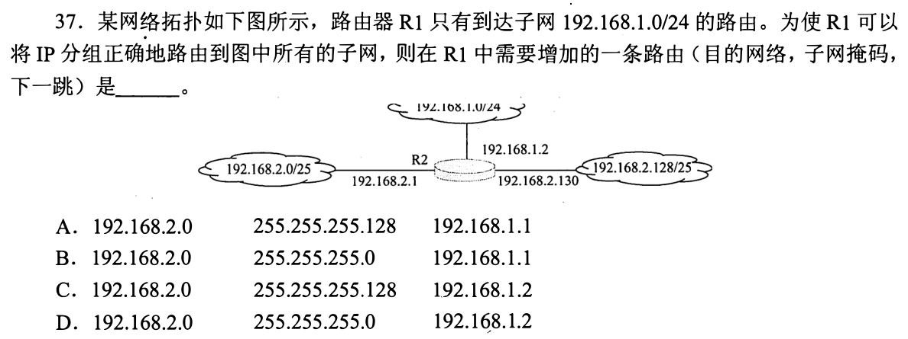

### 04 · 2012-37

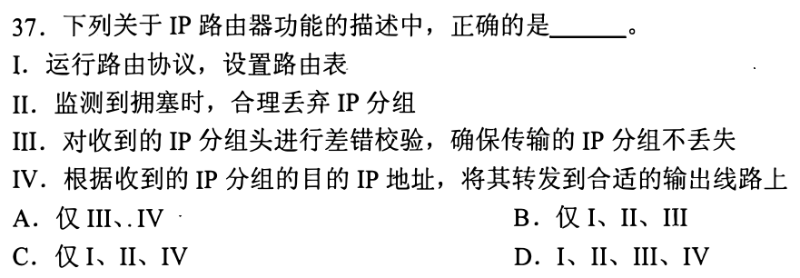

### 05 · 2012-38

### 06 · 2013-33

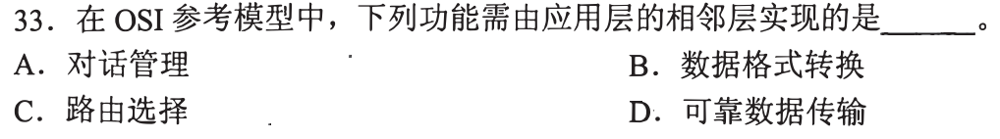

### 07 · 2013-35

### 08 · 2014-34

### 09 · 2015-38

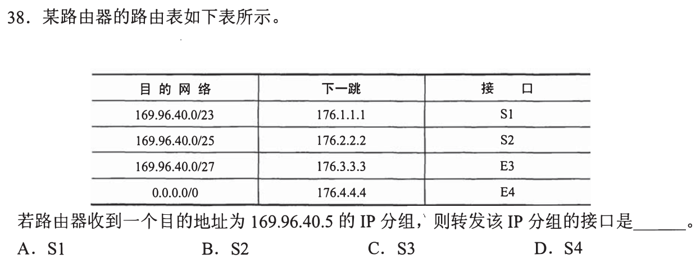

### 10 · 2016-37

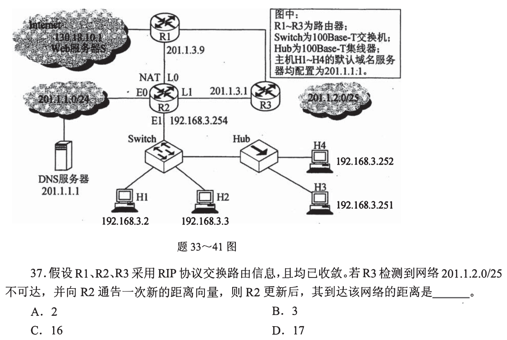

### 11 · 2017-37

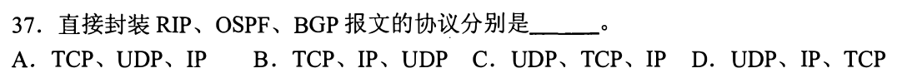

### 12 · 2018-38

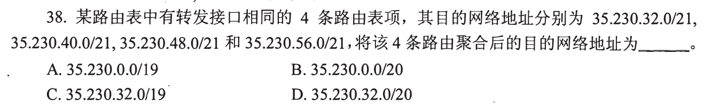

### 13 · 2021-36

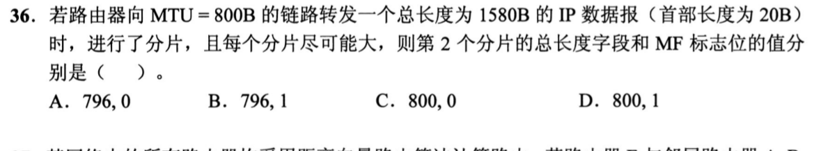

### 14 · 2021-37

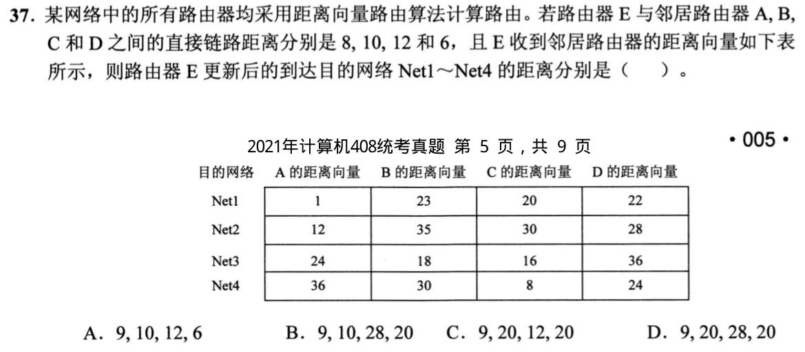

### 15 · 2023-38

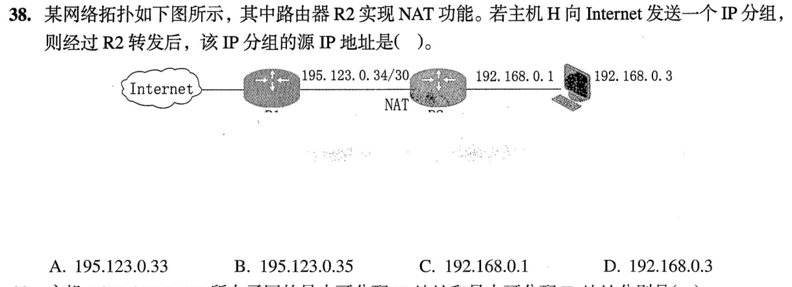

### 16 · 2024-35

### 17 · 2025-36

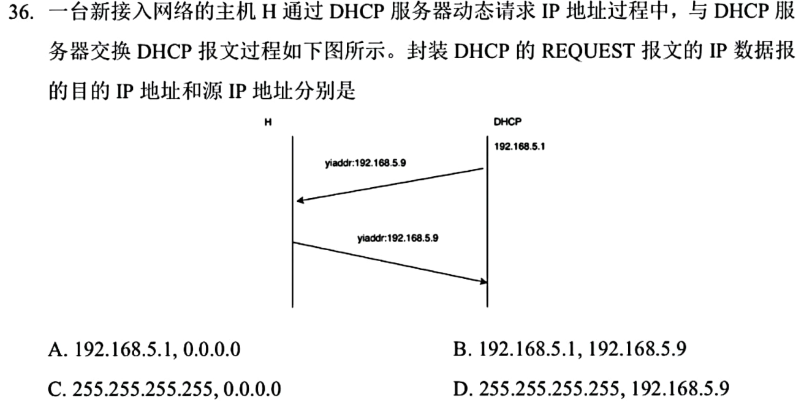

### 18 · 2025-37

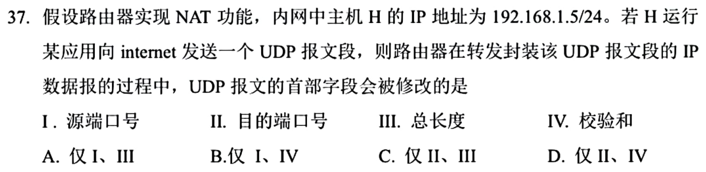

[← 0905](0905.md) · [总索引](README.md) · [0907 →](0907.md)

