[« 0906-answer](0906-answer.md)　　[0908-answer »](0908-answer.md)

# 0907 Answer｜端到端状态：TCP字节序号与双窗口

> [原题 24 题](0907.md) · [0906 路由路径](0906-answer.md) · [能力账本](answer-quality/learning-ledger.md)
>
> 分组抵达终端之后，TCP按字节累计确认；可发多少同时受拥塞窗口与接收窗口约束。24/24原题核准，独立限时待验。

<strong>考场入口（01—24）</strong>

| 题 | 第一笔 | 答案 |
| --- | --- | --- |
| [01](#q01) | 首字节200+300+500=1000 | D |
| [02](#q02) | 超时阈值8：1→2→4→8→9 | C |
| [03](#q03) | rwnd2000减仍未确认1000 | A |
| [04](#q04) | SYN占1，SYN+ACK应ack11221 | C |
| [05](#q05) | 第三段900，缺第二段起点500 | B |
| [06](#q06) | 自己下一序号2046，对方下一2013 | B |
| [07](#q07) | cwnd到12KB，但发送窗=min(12,10) | A |
| [08](#q08) | UDP无连接且按端口复分 | B |
| [09](#q09) | 四RTT累计15KB，rwnd剩1KB | A |
| [10](#q10) | 1→2→4→8→16→32，5RTT | A |
| [11](#q11) | UDP分用看目的端口 | B |
| [12](#q12) | 第三个重复ACK100到t3触发快重传 | C |
| [13](#q13) | 第三握手确认乙SYN占1：2047 | D |
| [14](#q14) | 最长按线性8→32需24RTT | D |
| [15](#q15) | SYN占1，数据1001—5000共4000 | C |
| [16](#q16) | 主动方收到对端FIN并发ACK进TIME_WAIT | B |
| [17](#q17) | 12/(12+8)、12/(12+20) | D |
| [18](#q18) | ACK501窗到1000，已发至700 | C |
| [19](#q19) | 超时16→1，8为阈值，再线性至16 | C |
| [20](#q20) | 主动方2MSL，服务方收到末ACK | D |
| [21](#q21) | 建连+1/2段两轮+挥手+2MSL | D |
| [22](#q22) | 回卷相加1F7C，取反E083 | C |
| [23](#q23) | ACK一段cwnd到3000，余两段 | A |
| [24](#q24) | UDP一RTT，TCP建连再一RTT | B |

## 01｜2009-38：TCP ACK 指向下一期待的字节

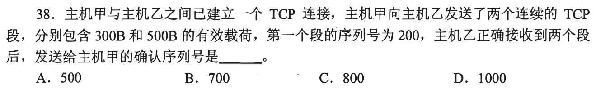

第1段从字节序号200起有300B，占200—499；第2段连续500B占500—999。乙均正确接收后下一期待序号是 **1000，选 D**。第一笔画字节区间，不按TCP段个数加1。

与链路帧序号的区别

0903的GBN/SR按帧编号确认；TCP的seq/ack按**字节**计。纯ACK不消耗数据字节序号，SYN/FIN另各占一个序号。

## 02｜2009-39：超时后阈值减半，再从1慢启动

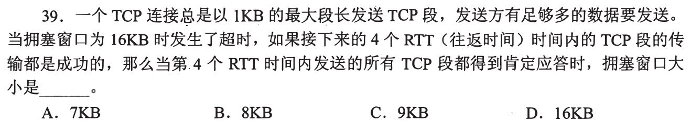

超时前cwnd16KB，设ssthresh为8KB，cwnd重置1KB。每RTT成功确认后：**2、4、8、9KB**，第4个RTT之后为**9KB，选 C**。第一笔写阈值8；达到阈值后拥塞避免每RTT加一个MSS，而不是再翻倍到16。

把时间点放在确认之后

题说“第4个RTT时间内发送的所有段都得到肯定应答时”，因此计完第4轮的更新。若停在8，漏从阈值进入线性增长；若回16，则错误继续指数增长。

## 03｜2010-39：接收窗口给的是未确认数据的剩余容量

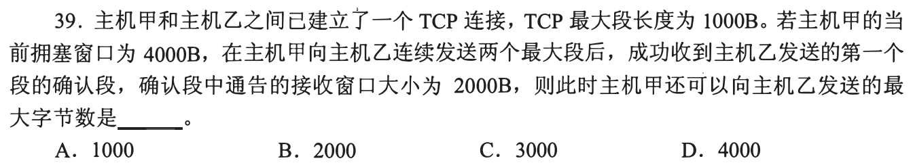

甲cwnd4000B，先发两个1000B段；仅第一个获ACK，因此仍有第二段 **1000B在途**。乙通告rwnd2000B，可再放 `2000−1000=1000B`；拥塞窗侧还够，不构成更小限制。最多**1000B，选 A**。第一笔分“总可在途窗口”和“已经占据但尚未确认”。

窗口右边缘不能从ACK点直接再数2000

rwnd2000以新的确认点为基准；已发的第二段仍占其中1000B，即使它可能已经到达乙，只要甲尚未收到其ACK仍不能假定腾出空间。发窗口=min(cwnd,rwnd)，还须扣当前在途。

## 04｜2011-39：SYN消耗一个序号，乙回SYN+ACK

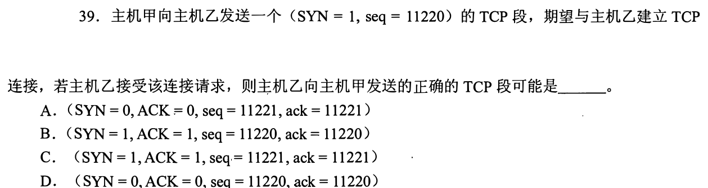

甲发 `SYN=1, seq=11220`，乙接受时回`SYN=1, ACK=1`，确认号应为下一期待 **11221**；乙自己的初始序号由乙选择，选项中**`seq=11221, ack=11221`可成立，选 C**。第一笔只从甲SYN推ACK，别误以为双方初始序号必须一样。

“可能”二字的用途

乙碰巧选择11221作为自己的ISN是允许的；不能从甲ISN推出乙ISN，只能判ACK必须11221且SYN+ACK标志正确。A/D标志不对，B确认号未加SYN的一位。

## 05｜2011-40：收到第三段也不能跨缺口累计确认

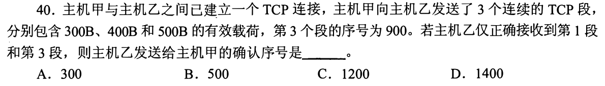

第三段序号900且长度500，所以第二段400B从 **500** 开始，第一段300B从 **200** 开始。乙收到第一段和第三段，缺少500—899，下一连续期待序号仍为 **500，选 B**。第一笔从已知第三段向前倒推第二段起点。

为何不答1400

1400是三段都完整连续接收后下一序号；第三段即使被缓存，缺口未补时累计ACK不能跨越它。与0903的SR独立确认不同，TCP的累计ACK表达左边连续字节边界。

## 06｜2013-39：seq用对方ACK，ack用对方seq加长度

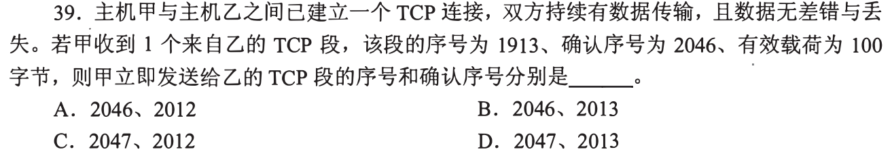

甲收到乙段 `seq=1913, ack=2046, payload=100B`，乙已经期待甲下一字节 **2046**，甲立即发段用 `seq=2046`；甲对乙数据的下一期待是 `1913+100=2013`，用 `ack=2013`，**选 B**。第一笔左右分栏：自己的seq取对方ACK，自己的ACK按对方数据长度推进。

没有数据的纯确认不再加一

题说持续有数据但“立即发送”未给甲此刻额外发出数据长度，上一ACK已说明甲的下一序号。SYN/FIN才单独占一号；普通ACK标志本身不耗序号。

## 07｜2014-38：到阈值4KB后每RTT只加1KB

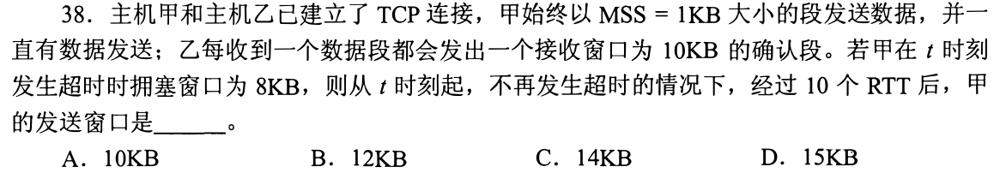

超时cwnd8KB，阈值改为4KB，cwnd置1KB。按教材“拥塞避免每RTT增1MSS”的轮次近似，十个RTT后cwnd依次为 `2、4、5、6、7、8、9、10、11、12KB`；乙每次通告rwnd10KB，**发送窗口=min(12,10)=10KB，选 A**。第一笔把“拥塞窗口成长结果”与“最终发送窗口”写成两个变量。

接收窗与发送窗措辞容易冲突

12KB是上述轮次近似下的拥塞窗口，不是题问的发送窗口；若按逐ACK增量精算，接收窗限制会使实际增长略有差异，但达到10KB之后有效发送窗口仍被rwnd限制为10KB。接收方持续通告10KB，最终取两者较小值。若只做慢启动算到12而直接涂卡，会落入故意设置的B干扰项。

## 08｜2014-39：UDP用端口复用，校验不保证可靠

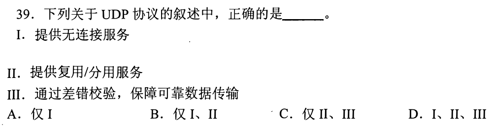

UDP提供**无连接服务 I**，端口可供应用复用/分用 **II**；差错校验能发现错误却不提供确认重传、可靠交付，**III错**，仅 I、II，**选 B**。第一笔把“检测错误”与“可靠恢复”分开，接回0903-18的CRC边界。

本节点为何有UDP题

TCP的窗口、重传是端到端可靠状态；对比UDP可看出这些不是传输层所有协议共有的承诺。不同应用可自行补可靠机制，但UDP本身不保证。

## 09｜2015-39：cwnd增长不等于接收方能继续缓存

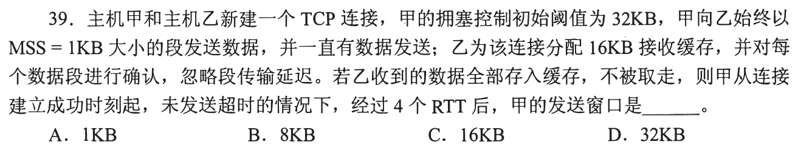

新连接慢启动，MSS1KB，四个RTT发送并确认的数据量依次 **1、2、4、8KB**，总15KB。乙16KB缓存“不被取走”，余1KB接收窗口；虽然cwnd此时到16KB，有效发送窗口 `min(16,1)=1KB`，**选 A**。第一笔同时记“网络敢发多少”和“接收方还装得下多少”。

与07的术语对照

本题乙缓存占用使rwnd降到1KB；07乙每次通告固定10KB。两题都取 `min(cwnd,rwnd)`，不能把“cwnd=发送窗口”无条件套用。

## 10｜2017-39：初始1MSS每RTT翻倍五次到32

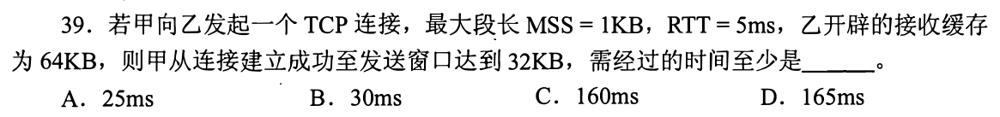

连接建立后从cwnd=1KB慢启动，按每RTT全收确认：`1→2→4→8→16→32KB`，需 **5RTT×5ms=25ms，选 A**。乙接收缓存64KB不先构成瓶颈。第一笔写指数阶梯，再数箭头而不是数写出的六个状态。

最快是模型条件

忽略发送、传播细节和阈值限制时，每轮均有足够段获确认，才能按题意翻倍。若从建立连接前计三次握手时间会另加，题明确从连接建立成功起。

## 11｜2018-39：UDP分用看目的端口

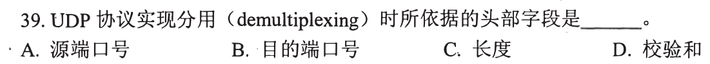

收到UDP报文后，主机按**目的端口号**把负载交给本机相应套接字/应用，**选 B**。源端口指回信目标，长度与校验和各有别的职责。第一笔站在接收主机上问“送给我哪个程序”。

套接字可能还看本地IP等

具体操作系统可结合本地IP地址等元组区分绑定；本题四选一问UDP首部字段，目的端口是分用的直接关键。与0906-18的NAT改源端口不矛盾。

## 12｜2019-38：三个重复ACK到了t3，先于t4超时

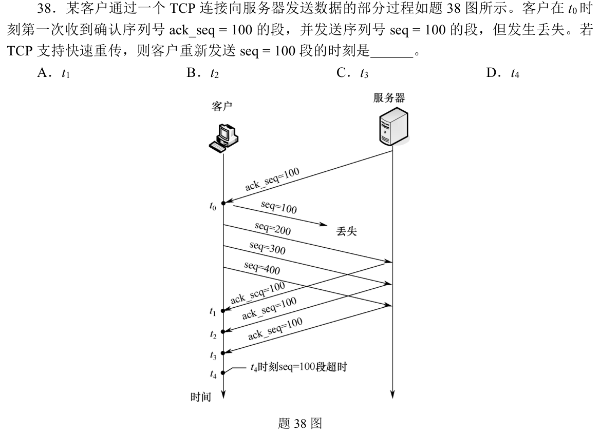

seq100段丢失，后续200、300、400到达服务端，分别让服务端重复回复 **ACK100**；客户端原先在t0收到的ACK100是基准确认，后续重复的第1、2、3次分别在 **t1、t2、t3** 到。支持快速重传，**t3重发seq100，选 C**，无需等t4计时器。

不要把首次ACK算成重复一次

“三次重复ACK”是同一确认号在原确认之后又到三次；图清楚显示 t0 已有一次ACK100。若把t0算进三个，会错误提前到t2。

## 13｜2019-39：第三握手确认乙SYN占的一个序号

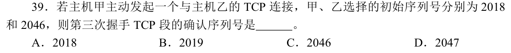

甲ISN2018，乙ISN2046；第三次握手由甲确认乙的SYN，SYN占一个序号，所以甲发的ACK确认号为 **2046+1=2047，选 D**。第一笔只找被确认方乙的初始序号，不用甲的2018求此确认号。

三握手最短状态线

甲SYN(seq2018)→乙SYN+ACK(seq2046,ack2019)→甲ACK(seq2019,ack2047)。各自的序号空间独立，只用ACK确认对方。

## 14｜2020-38：问最长增长时间，按拥塞避免每RTT加一

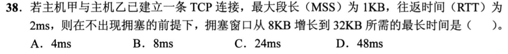

从cwnd8KB到32KB共需增加24个MSS。未给慢启动阈值，且问**不拥塞前提下的最长时间**，最慢可在拥塞避免阶段每RTT只增1KB，需 `24RTT×2ms=48ms`，**选 D**。第一笔圈“最长”，别只用8→16→32两次倍增得到最短4ms。

为什么不是从1KB重启

题没说超时或丢包，只给起点8KB；不能擅自把cwnd置1。不同阈值对应指数/线性组合，所问上界由纯线性增长给出。

## 15｜2020-39：FIN的序号是全部数据之后的下一个

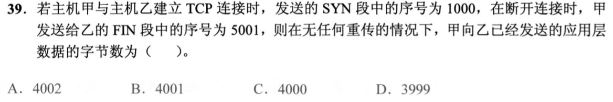

甲SYN的seq1000占一个位置，首个应用数据字节从**1001**开始；FIN的seq5001，表示之前数据已占至**5000**。数据长度 `5001−1001=4000B`，**选 C**。第一笔画 `SYN1000｜数据1001…5000｜FIN5001`。

两个控制标记各占一个序号

FIN本身也会占一个序号，但题问FIN发送**之前**甲已发送的应用数据，所以不把FIN算进去。仅用5001−1000=4001会把SYN混入数据。

## 16｜2021-38：主动关闭者收到对方FIN，发ACK后进TIME_WAIT

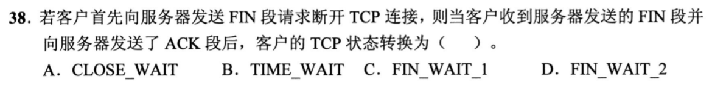

客户端先发FIN，是主动关闭者；收到服务器FIN并回ACK后进入 **TIME_WAIT，选 B**，等待2MSL再CLOSED。第一笔找“谁先发FIN”，主动方与被动方的状态迁移不同。

三个近邻状态定位

主动方发FIN后FIN_WAIT_1；收对自己的FIN的ACK后FIN_WAIT_2；再收到对端FIN并确认后TIME_WAIT。被动方收到FIN通常进入CLOSE_WAIT。题已走到最后一个动作。

## 17｜2021-39：有效载荷效率只数该传输层头部

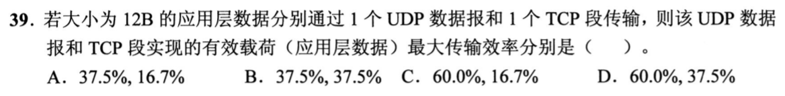

应用数据12B，UDP最小首部8B，效率 `12/(12+8)=60%`；TCP最小首部20B，`12/(12+20)=37.5%`，**选 D**。第一笔定义分母为“应用数据+本层首部”，题未要求把IP/链路头一起计入。

最大效率的限定

TCP可以有选项字段使首部更长，最小20B给最大效率；UDP首部固定8B。若并入IP头部，两者比例不同且都不在选项中。

## 18｜2021-40：ACK未推进左边界，窗口右边界仍是1000

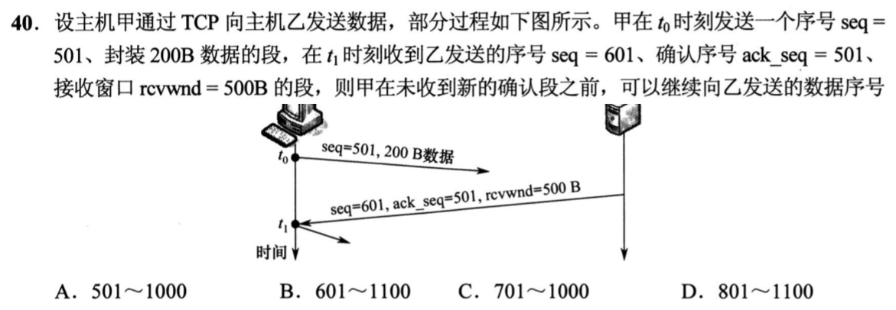

甲先发 `seq501`的200B，覆盖501—700。乙回`ack501,rcvwnd500`，说明**仍期待501**，窗口覆盖501—1000；甲已发至700，若未收到新ACK，仍可继续发 **701—1000，选 C**。第一笔算窗口右边界 `ACK+rwnd−1`，再扣已发范围。

为何ACK501没有确认那200B

乙这次ACK没有从501向前推进，可能数据尚未按序收到或这段确认先前生成；甲仍不能把501—700当已确认，却可在允许窗口里使用剩余300B。图中乙段的seq601属反方向，不能拿来算甲的窗口。

## 19｜2022-38：超时16后到阈值8，再走8轮线性

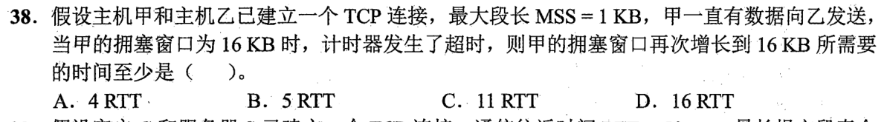

超时前cwnd16KB，ssthresh降至8KB，cwnd置1KB。成功三轮到 `2、4、8KB`，之后每RTT增1KB，8→16还要8轮，共 **11RTT，选 C**。第一笔把指数段和线性段分开计数。

“再次增长到16”指确认后的状态

在阈值处结束慢启动，随后经历9、10、…、16这八个新状态。若一直翻倍会误选4RTT。

## 20｜2022-39：主动方关连接仍等2MSL，被动方等末ACK

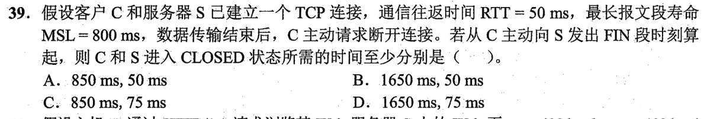

客户端C在t0发FIN，RTT50ms、单程25ms。最快服务器S在t25收到FIN，立即回ACK并发FIN；C在t50收到FIN并回最终ACK，进入TIME_WAIT，`2MSL=1600ms`后 **t1650ms** CLOSED；S在t75收到最终ACK即 CLOSED。组合 **1650ms、75ms，选 D**。

服务方为何不是50ms

在t50，最终ACK才由C发出，还要传播25ms到S。主动方的TIME_WAIT从确认对方FIN的时刻t50开始，不从自己的第一个FIN发出时刻t0开始。

## 21｜2024-38：从发SYN开始计，发完数据再进2MSL

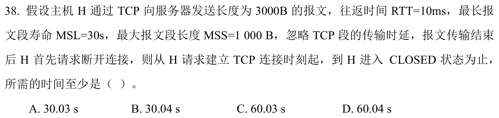

RTT10ms，H发SYN后 **t10ms** 建连；慢启动MSS1000B，先发1段，t20收到确认，再发2段，到**t30ms**确认3000B发完；H发FIN，最快对端FIN返回在**t40ms**，H回ACK并进入TIME_WAIT。`2MSL=60s`，总 **60.04s，选 D**。第一笔分建立1RTT、传数据2RTT、挥手到TIME_WAIT1RTT、等待60s。

题说忽略段发送时延

可把纯ACK与下一批数据/FIN尽快衔接；不能把3000B一次发完，初始拥塞窗口只有1 MSS。TIME_WAIT必须经历两倍最大报文寿命，不能只等1 MSL。

## 22｜2024-39：UDP校验和先回卷加，再按位取反

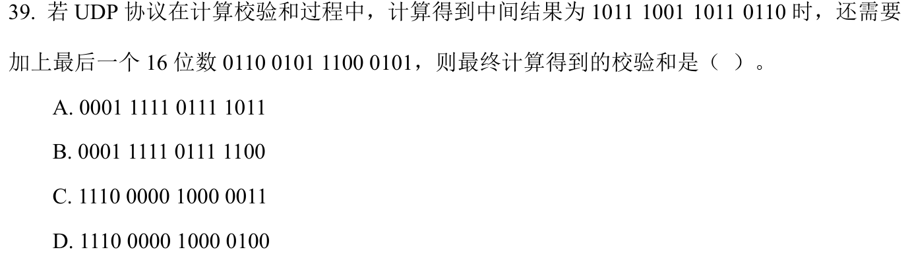

中间和 `1011 1001 1011 0110`=`B9B6H`，最后一字 `0110 0101 1100 0101`=`65C5H`。相加 `11F7BH`，最高进位回卷到低16位得到 `1F7CH`；取反为 **`E083H=1110 0000 1000 0011`，选 C**。第一笔做16位反码加法，不能截断最高进位。

手算复核

`B9B6+65C5=11F7B`，低16位`1F7B`再加进位1得到`1F7C`，反码`E083`。若直接截断再取反，会差1而落入另一干扰项。

## 23｜2025-38：新ACK只确认第一段，第二段仍占窗口

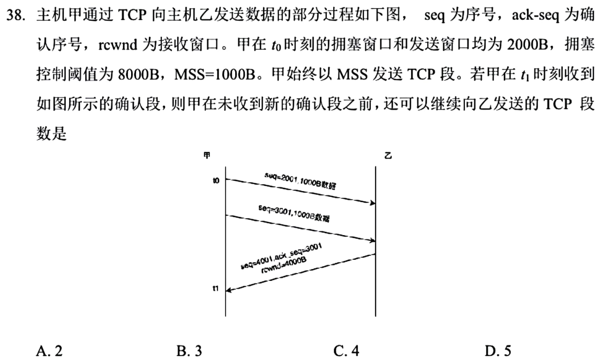

t0 cwnd与有效发送窗均2000B，甲发seq2001、3001两段。t1乙回 `ack3001,rcvwnd4000`，只确认第一段，第二段仍1000B在途；一段获确认使cwnd从2000增至**3000B**，有效窗=min(3000,4000)=3000B，扣未确认1000B，还可发 **2个1000B段，选 A**。第一笔分别更新拥塞窗、接收窗和在途量。

为什么不是3或4

4KB是乙能接收的容量，不是甲拥塞窗；甲当前总在途不得超3KB，其中已发的seq3001仍占1KB。若错误把ACK3001视为两段都确认，会多算一个可发送段。

## 24｜2025-39：一次查询UDP一往返，TCP先建连接

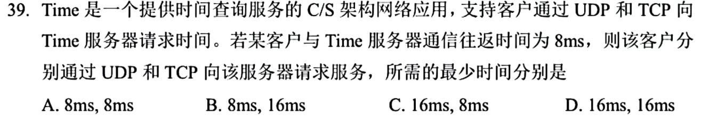

一次请求与回复在UDP上最少 **1RTT=8ms**；TCP在未建连接时先三次握手需1RTT，再请求/回复1RTT，最少 **16ms，选 B**。第一笔确认题目问“请求服务”且TCP连接尚未建立，别把建连往返漏掉。

实现层面的更快组合

这里按题设通常的TCP建连后再发应用请求计算；实际协议/实现可有连接复用或把数据与握手组合的机制，题没提供这些条件。若已有持久TCP连接，则查询可以只需一往返，但这不是本题起点。

## 01—24 收束

字节流ACK指下一期待，SYN/FIN各占1；超时重置拥塞窗口，三重复ACK提前重传；实际发送窗口取拥塞与接收窗口较小者，再扣未确认在途。24/24已讲，限时熟练度待验。

[« 0906-answer](0906-answer.md)　　[0908-answer »](0908-answer.md)
