[« 0907-answer](0907-answer.md)　　[0914-answer »](0914-answer.md)

# 0908 Answer｜一次应用会话的路径

> [原题 17 题](0908.md) · [0907 的 TCP 状态](0907-answer.md) · [能力账本](answer-quality/learning-ledger.md)
>
> 先问谁向谁请求、走哪条连接，再数往返或判断协议。17/17 已核对原卷；独立限时仍待练习。

<strong>考场入口：先做哪一笔</strong>

| 题 | 第一笔 | 结论 |
| --- | --- | --- |
| 01 | FTP 命令走控制连接 | A |
| 02 | 全递归：主机问本地一次，本地向上问一次 | A |
| 03 | 发件和转发 SMTP，收件 POP3 | D |
| 04 | SMTP 的两条发送边及 7 位 ASCII | A |
| 05 | 浏览网页从不用 SMTP 发邮件 | D |
| 06 | POP3 可靠传输用 TCP | D |
| 07 | `Connection: Close` 说明不复用连接 | C |
| 08 | NAT 改源为 R2 公网，目的保持 Web IP | D |
| 09 | 命中缓存 0；未命中依次根、com、xyz.com、abc.xyz.com 共 4 | C |
| 10 | FTP 数据连接不固定连客户端 20 端口 | C |
| 11 | DNS 可用无连接 UDP | B |
| 12 | ASCII 文本可直接用 SMTP | D |
| 13 | C/S 的客户端不能由模型推出彼此直接通信 | B |
| 14 | DNS 0—3 RTT；TCP+HTTP 2 RTT | D（20ms、50ms） |
| 15 | 建连 1，HTML 1，图像慢启动两轮 2 RTT | B（40ms） |
| 16 | 8 个对象各 TCP+HTTP 两轮 | D（16 RTT） |
| 17 | POP3 收信且一连接收多封 | B |

## 01｜2009-40：FTP 命令占哪条连接

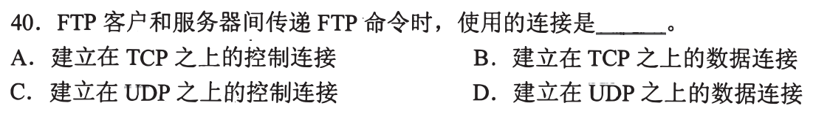

先把会话画成“登录、命令”和“文件内容”两条流。命令由始终保持的 **TCP 控制连接**传，选 **A**；数据连接只为具体文件或目录内容建立。记忆端口前先认流的职责。

迁移：同一会话为何有两条连接
控制连接在多次传输之间继续接收指令；数据连接可每次传完关闭。它们都是 TCP，但不能因看到“文件”就把所有报文都放到数据连接。

## 02｜2010-40：全递归时每一级只向上请求一次

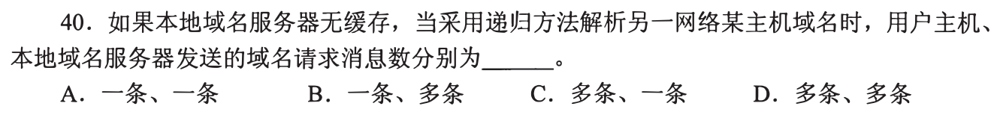

题明确采用**递归方法**解析。本地主机向本地 DNS 发一条请求；本地 DNS 向上一级服务器也发一条递归请求，由上一级继续代查并返回最终答案。因此用户主机、本地 DNS 的请求数分别 **一条、一条，选 A**。不能把现实中常见的“主机递归、本地向其他服务器迭代”替换进本题。

请求数与整个链的服务器数分开

递归的答复者承担继续查询义务，所以本地 DNS 无需自己逐个问根、顶级和权威服务器。若题规定本地采用迭代，才会向多台服务器发送请求，对应另一组数量；这里以题目给定方法为准。

## 03｜2012-40：邮件沿边选协议

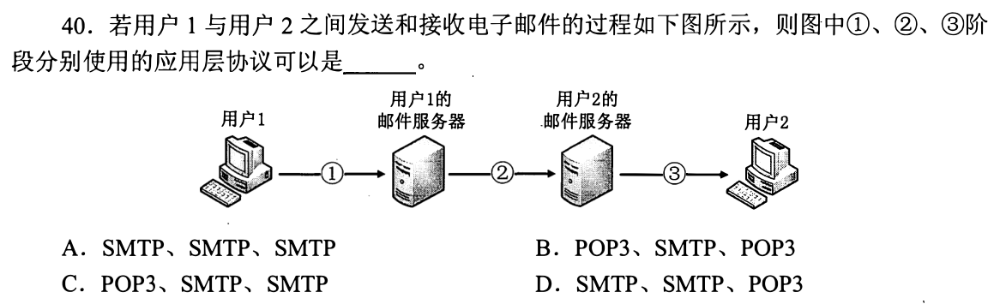

沿图逐边读：用户代理把邮件提交给服务器1用 **SMTP**；服务器1转交服务器2仍用 **SMTP**；用户2从邮箱取邮件用 **POP3**，依次对应 **D**。第一笔是画箭头方向，“发送到邮箱”和“从邮箱读取”不同。

保底排除
即使忘了各端口，也可用 POP3 的“收信”职责先定位末边，再用 SMTP 的“发件/服务器转发”定位前两边。

## 04｜2013-40：SMTP 能做哪些动作

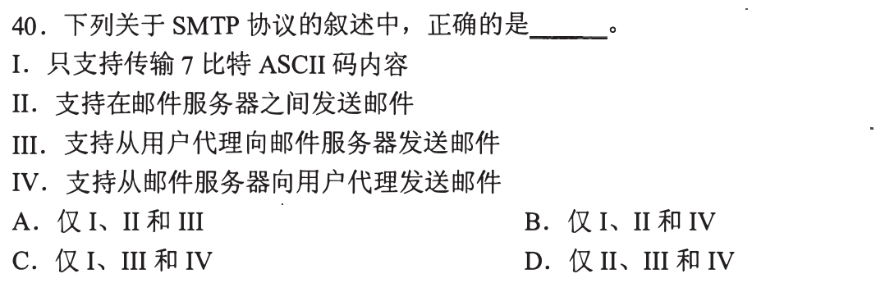

逐条判断：经典 SMTP 报文传输要求 7 位 ASCII（I）；用户代理向邮件服务器提交、邮件服务器间转发（II、III）都属于发送（题中组合 **A**）。服务器给用户代理“取信”不是 SMTP 的常规职责。

7 位与附件
图像等非 ASCII 内容需编码为可传的文本形式；不要因此误判“现代邮件不能带图片”，题考的是原生 SMTP 的承载规则。

## 05｜2014-40：Web 浏览会触碰的层

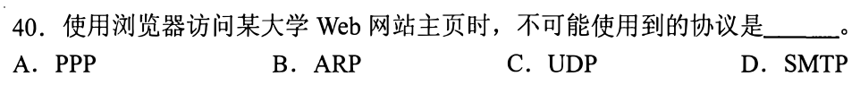

把动作限定为浏览器访问 Web：局域网可能先 ARP，链路可能 PPP，DNS 查询可能 UDP；**SMTP**处理邮件发送，访问网页不需要它，选 **D**。遇到“不会使用”，先排过程里必经或可能经的协议，不把协议都当成浏览器直接调用。

注意“可能”与“必然”
缓存、链路类型会影响 ARP/PPP/UDP 是否实际发生；题目在给定候选中问无关协议，SMTP 与浏览 Web 的业务路径不相干。

## 06｜2015-33：POP3 选运输协议

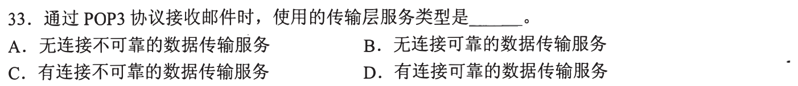

问的是 POP3 **采用的运输层协议**，取邮件会话用可靠的 TCP，选 **D**。承接03：POP3 是应用层“收信”协议，TCP 是其下方承载连接，两层不要互相替代。

## 07｜2015-40：从实际请求头读会话意图

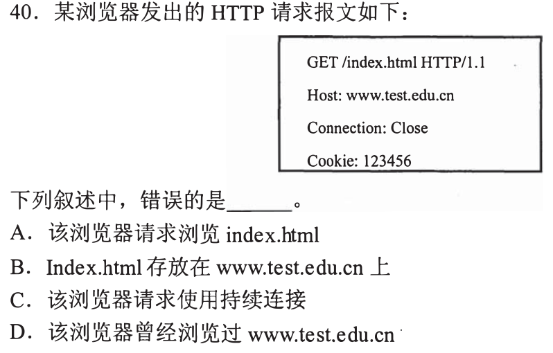

先读原报文而不是回忆 HTTP/1.1 的默认值：`GET /index.html` 给出资源路径，`Host` 给出主机名，`Cookie` 是客户端带给服务器的状态标识；`Connection: Close` 明说响应后关闭，所以“使用持续连接”错误，选 **C**。

为何默认持续连接不救 C
默认规则让位于本次请求的显式 `Close`；遇到实际首部，证据优先于协议通常设置。

## 08｜2016-38：NAT 出口只改哪一端

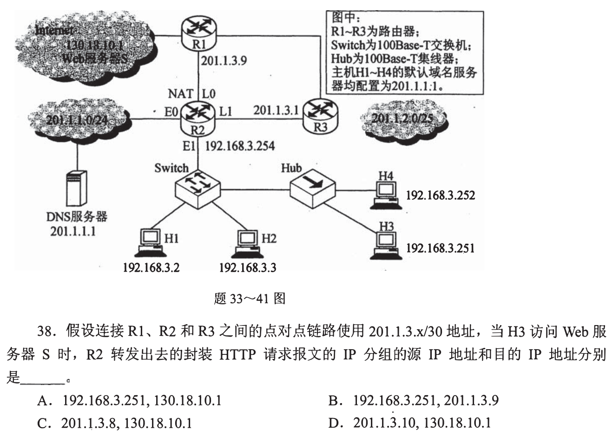

沿[2016-34 的拓扑](../bank/2016/q34.png)追 H3→Web：经过 R2 的 NAT 出公网时，**源**从私网地址换成 R2 的 `201.1.3.10`；**目的**仍是 Web `130.18.10.1`，选 **D**。第一笔圈住报文流向，别把返回包或下一跳当目的 IP。

承接 0905 的 NAT
对外服务器要能把响应发回公网地址，因此出口报文用 NAT 的公网源；转发下一跳的 MAC 可以改变，IP 目的地址仍指最终服务器。

## 09｜2016-40：DNS 次数取决于缓存与询问边数

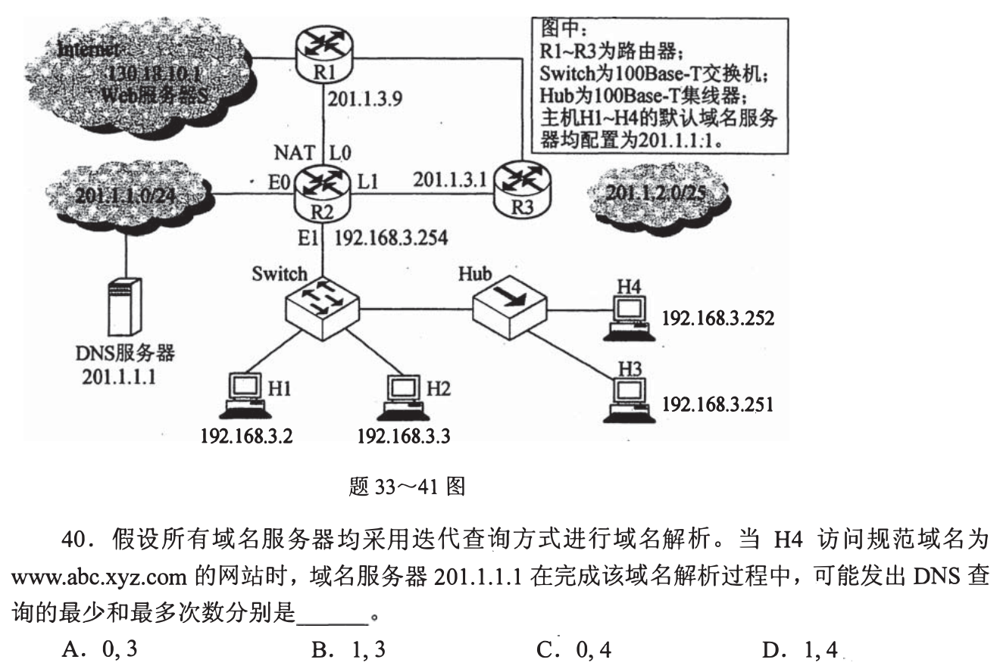

本地 DNS 已有结果时，不向其他 DNS 发问，最少 **0** 次。全未命中时依次问根、`com`、`xyz.com`、`abc.xyz.com` 的服务器，最多 **4** 次，选 **C**。别把主机向本地 DNS 的一次算到“本地向其他”里。

边界词训练
“最少”允许缓存；“最多”按域名层级和迭代链数，权威服务器答最终主机记录，不再向 `www` 这个主机问 DNS。

## 10｜2017-40：FTP 的 20 端口属于谁

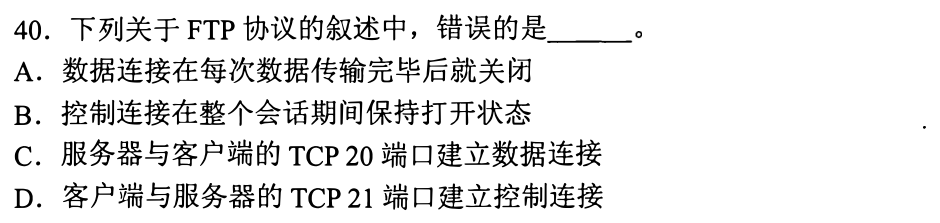

核对主语：客户端连接服务器的 TCP 21 端口建立控制连接，控制连接维持；一轮文件传送的数据连接可关闭。题中 C 把数据连接说成与**客户端的 TCP 20 端口**建立，是错误说法，选 **C**。主动 FTP 的 20 是服务器侧数据端口，客户端端口并非固定 20；被动方式服务器数据端口也不固定为 20。

避免端口口诀误伤
“FTP 控制21、数据20”只概括经典主动方式服务器的端口，不能推出两端都是这些端口，也不能覆盖被动方式。

## 11｜2018-33：谁能走无连接的运输服务

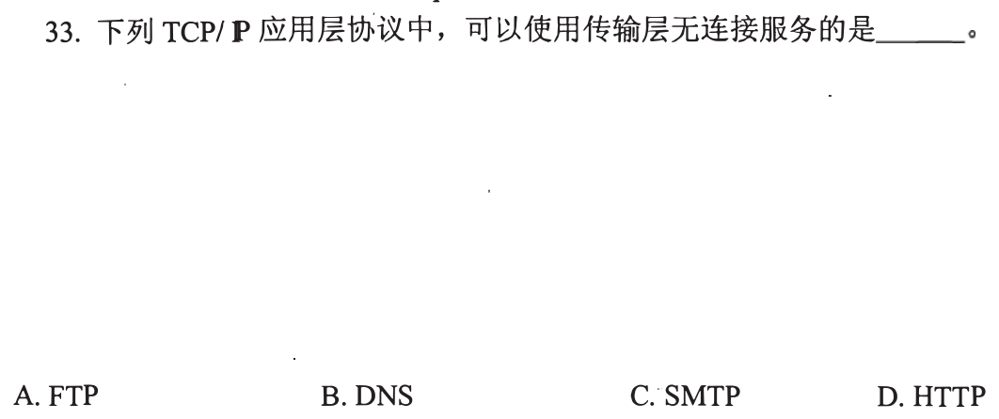

将候选应用映射到运输层：DNS 查询常用 UDP，可使用无连接服务，选 **B**。承接06：应用协议与运输方式要逐层对齐，不能因应用有请求响应就认定必须建 TCP 连接。

适用边界
DNS 也可用 TCP，题眼是“可以使用”，不是“只能使用”。

## 12｜2018-40：哪种邮件内容可直接送 SMTP

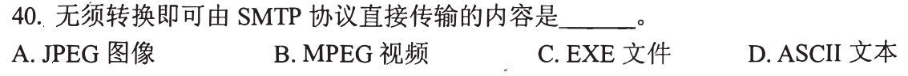

承接04的 7 位 ASCII：ASCII 文本已符合原生 SMTP 可传的字符形式，**无需转换**，选 **D**。图片、音视频或非 ASCII 文本若要放进邮件正文/附件需编码等处理。

## 13｜2019-40：C/S 中谁直接与谁通信

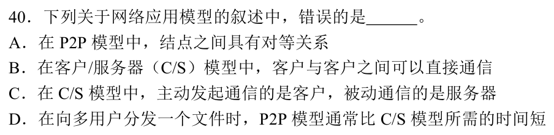

把 C/S 画成客户端↔服务器；服务端长期运行、客户端主动发请求，服务提供可集中管理。选项 **B**称客户端之间可直接通信，不能由 C/S 模型支持。用户之间可以借服务器间接交流，但那不是两个客户端的直接 C/S 通信。A 的 P2P 结点对等、C 的客户端主动/服务器被动是两种模型的基本关系；D 说P2P分发通常更快，是利用接收者继续上传、增加分发容量的典型优势，并非任意负载下无条件更快。

## 14｜2020-40：把 DNS 与 Web 两段 RTT 分账

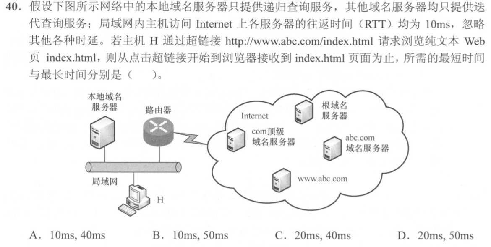

题给每次往返 10ms，忽略其他时延。主机先问本地 DNS；缓存命中，解析对外往返可为 **0 RTT**，随后 TCP 建连 **1 RTT**、发 HTTP 请求收到页面 **1 RTT**，最短 **20ms**。全未命中，本地按迭代问根、`com`、`abc.com`，另 **3 RTT**，总 **50ms**，选 **D**。

为何不把本地查询算 10ms
题中的 10ms 特指局域网主机与 Internet 各服务器；本地 DNS 和 H 同处局域网，题又要求忽略其他时延。HTML 为纯文本，没有嵌入对象要再请求。

## 15｜2022-40：跨页条件决定图像传几轮

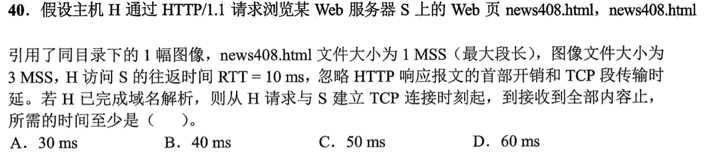

题面完整条件：HTML 引一幅同目录图像；HTML 大小 1 MSS、图像 3 MSS；RTT 10ms，忽略首部与传输时延，DNS 已解析。先 TCP 建连 1 RTT，取 HTML 1 RTT；服务器初始拥塞窗口按题目的教材模型取1 MSS；发送HTML的1 MSS并获确认后，窗口已增至2 MSS。随后请求图像，先发2 MSS，确认后再发余下1 MSS，共2 RTT。合计 **4 RTT=40ms，选 B**。

跨页信息与时间线
当前题图已包括 3 MSS、RTT 与选项，应先读全这些条件。时间线是建连 [0,1]、HTML [1,2]、图像前两段 [2,3]、余一段 [3,4] RTT；响应头时延和发送时延按题设忽略。若按不同初始拥塞窗口的现代实现猜图像一次到齐，会偏离这道原卷的考试模型。

## 16｜2024-40：HTTP/1.0 非持续且不能并行

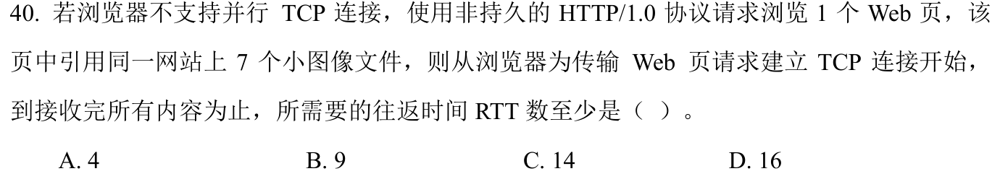

先数对象：HTML 1 个，加同站图像 7 个，共 **8**。每个对象需新 TCP 建连 1 RTT、请求响应 1 RTT；浏览器不能并行，8 组串行，最少 **16 RTT，选 D**。已从“建立 TCP 连接开始”计时，无需额外 DNS。

三条信息各挡一个捷径
非持续挡连接复用；不支持并行挡同时请求七幅图；“7 个小图像”意味着主页之外仍有七次对象传输。若只数七个或只给一条连接计时，都会漏轮次。

## 17｜2025-40：POP3 的收取与连接复用

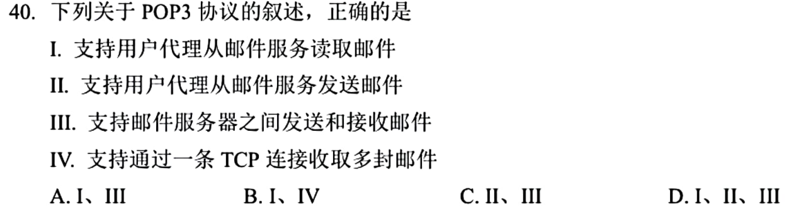

逐条套“用户代理从服务器读取”：I 正确；从服务器发信与服务器间传信由 SMTP 等负责，II、III 错；一条 TCP 会话可读取多封邮件，IV 正确。因此 **I、IV，选 B**。即使忘记 IV，先用收发方向排除其他组合。

回到 03 与 06
03 用边的方向分 SMTP/POP3；06 确认 POP3 承载于 TCP；本题把两步合起来：连接不是“一封邮件一个 TCP”的单位。

## 两次练习的目标

第一次不看入口表，能把 DNS 查询、连接、对象请求逐段写出来；第二次按题眼直接找到第一笔，并用一个排错条件检查选项。讲解覆盖不等于已经会做或已达到考场速度，需独立限时复做确认。

[« 0907-answer](0907-answer.md)　　[0914-answer »](0914-answer.md)
