[« 0908-answer](0908-answer.md)　　[0915-answer »](0915-answer.md)

# 0914 Answer｜线性结构：扫描时保留什么状态

> [11 道完整原题](0914.md) · [选择题前置](0731-answer.md) · [能力账本](answer-quality/learning-ledger.md)
>
> 每题先找不可回头的证据：长度差、值域、已有顺序、当前最优状态。这里的“完成”只表示讲解已核原题，不代表已限时独立完成。

<details><summary><strong>考场起手（先做一遍再展开题解）</strong></summary>

| 题 | 第一步 | 可保留的分数 |
| --- | --- | --- |
| 01 | 快指针先走 k 个真实结点 | 两指针间隔不变 |
| 02 | 把目标写为后段、前段，尝试三次翻转 | O(n) 时间、O(1) 空间 |
| 03 | 公共尾部节点“地址相同”，先对齐剩余长度 | 比字符相等更强 |
| 04 | 候选数遇异值抵消，最后重新计数 | 超半数才输出 |
| 05 | `abs(data)` 在 0..n，标记首次见过 | 前驱链接后才释放 |
| 06 | 答案只可能在 1..n+1，准备 n+2 个标记 | 不受负数/重复干扰 |
| 07 | 分前后两段，反转后段再交错 | 奇数中点只留一次 |
| 08 | 空间可复用但不缩，链式队列加闲置节点池 | 头尾更新 O(1) |
| 09 | 距离等于两倍极差，移动当前最小 | O(总长度)、O(1) |
| 10 | 始终只保存最小十个，用十元素大根堆 | O(n log 10) |
| 11 | 固定 A[i] 时，后缀最大/最小择一 | O(n)、O(1)额外 |

</details>

<a id="q01"></a>
## 01｜2009-42：只给头指针，怎样找倒数第 k 个

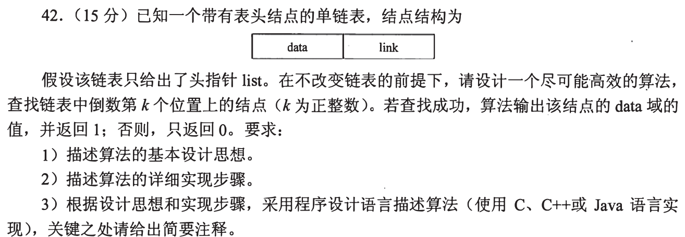

**（1）思路。** 倒数位置要等走到尾才知道；先让快指针比慢指针领先 **k 个数据结点**。随后同速前进，快指针到 `NULL` 时慢指针指向目标。头结点不计入位置。

**（2）步骤和代码。** 从 `list->link` 出发先走 k 次，途中为 `NULL` 就失败；慢指针从首数据结点出发，快指针与慢指针同速到尾，输出慢指针值并返回 1。这里用与题图等价的结点定义说明指针操作：

```c
typedef struct Node { int data; struct Node *link; } Node;
int kthFromEnd(const Node *list, int k) {
    if (!list || k <= 0) return 0;
    const Node *fast = list->link, *slow = list->link;
    for (int i = 0; i < k; ++i) {
        if (!fast) return 0;             // 不足 k 个数据结点
        fast = fast->link;
    }
    while (fast) { fast = fast->link; slow = slow->link; }
    printf("%d\n", slow->data);
    return 1;
}
```

**（3）代价。** `O(n)` 时间、`O(1)` 额外空间，不修改链表。`k=n` 时快指针恰好为 `NULL`、慢指针仍在首结点，合法。

<details open><summary>为什么不先数长度再从头走</summary>两遍也是 `O(n)`，能解题；双指针只扫一次。别从表头结点算 k，否则所有结果差一位。若忘记精确偏移，先用 3 个数据结点、k=1 和 k=3 手走一次。</details>

<a id="q02"></a>
## 02｜2010-42：原地循环左移 p 位

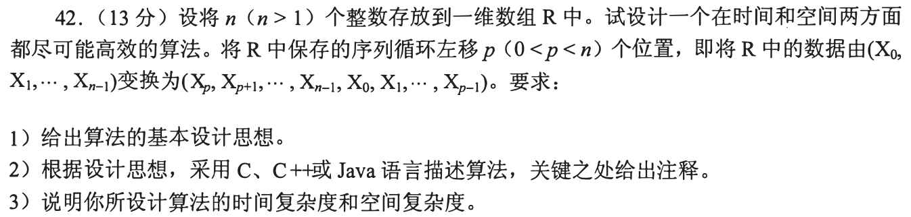

**（1）思路。** 目标由 `R[0..p-1]` 接 `R[p..n-1]` 变为后段接前段。分别反转前段、后段，再反转整个数组：两段内部方向各被翻转两次，位置却对调。

**（2）代码。**

```c
void reverse(int R[], int l, int r) {
    while (l < r) { int t = R[l]; R[l++] = R[r]; R[r--] = t; }
}
void leftRotate(int R[], int n, int p) {
    reverse(R, 0, p - 1);
    reverse(R, p, n - 1);
    reverse(R, 0, n - 1);
}
```

**（3）代价。** 三次线性翻转总 `O(n)` 时间、`O(1)` 额外空间。题给 `0<p<n`，空段无须另行处理；若推广任意 p，先做 `p%=n`。

<details open><summary>用四个符号验证</summary>`[a,b | c,d]` → `[b,a | d,c]` → `[c,d | a,b]`。只反转整段会倒置段内顺序；用额外同长数组虽容易但不满足空间尽可能高效。</details>

<a id="q03"></a>
## 03｜2012-42：共享后缀的第一个相同节点

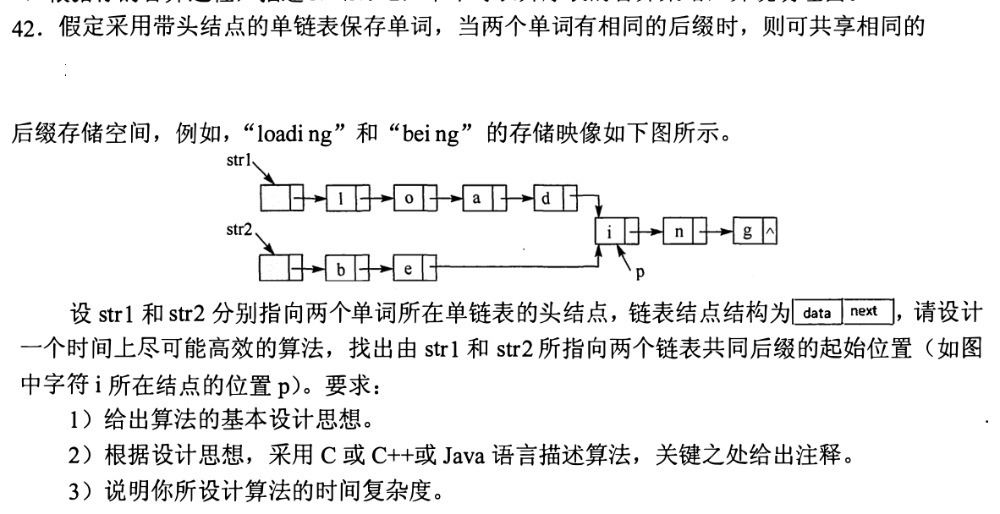

**（1）思路。** 真正“共享存储”意味着两个指针最终指向**同一个结点地址**，不只是字符相同。先量两条表从头结点之后到 `NULL` 的长度；长的一条先走差值，再同步走，首次指针相等就是共同后缀起点。

**（2）代码。**

```c
typedef struct Node { char data; struct Node *next; } Node;
int length(const Node *p) { int n=0; while (p) { ++n; p=p->next; } return n; }
const Node *commonStart(const Node *str1, const Node *str2) {
    const Node *a=str1->next, *b=str2->next; // 两者均为头结点
    int m=length(a), n=length(b);
    while (m>n) { a=a->next; --m; }
    while (n>m) { b=b->next; --n; }
    while (a && a!=b) { a=a->next; b=b->next; }
    return a; // 没有共同后缀时为 NULL
}
```

**（3）代价。** 两次长度扫描加一次同步扫描，`O(m+n)` 时间、`O(1)` 额外空间。只有尾部合流才能共享：单链表分叉后无法从一个结点产生两种后继。

<details open><summary>保底与反例</summary>两条链各有字母 `i` 并不证明共享；必须比较地址。若忘了长度对齐，也可让两个指针分别走“自己的链＋对方的链”，最终同速相遇；注意 `NULL` 的处理。</details>

<a id="q04"></a>
## 04｜2013-41：超过半数的元素

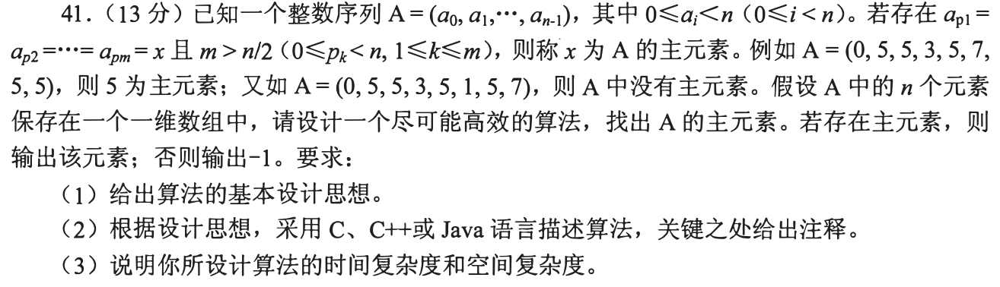

**（1）思路。** 把不同值成对抵消；若某值超过一半，抵消后它必能留下作为候选。但“候选”不是存在性证明，必须再扫一次计数。

**（2）代码。**

```c
int majority(const int A[], int n) {
    int cand=0, votes=0;
    for (int i=0; i<n; ++i) {
        if (votes==0) { cand=A[i]; votes=1; }
        else if (A[i]==cand) ++votes;
        else --votes;
    }
    int count=0;
    for (int i=0; i<n; ++i) if (A[i]==cand) ++count;
    return count>n/2 ? cand : -1;
}
```

**（3）代价。** `O(n)` 时间、`O(1)` 空间。值域 `0≤a_i<n` 也允许开计数数组，但会多用 `O(n)` 空间；此法不依赖值域。

<details open><summary>为什么第二遍不可省</summary>例如 `(0,5,5,3,5,1,5,7)` 消去后也可能留下候选 5，却只有四次，未超过 `8/2`。检查 `>n/2` 而非 `>=`。</details>

<a id="q05"></a>
## 05｜2015-41：按绝对值去重，保留第一次

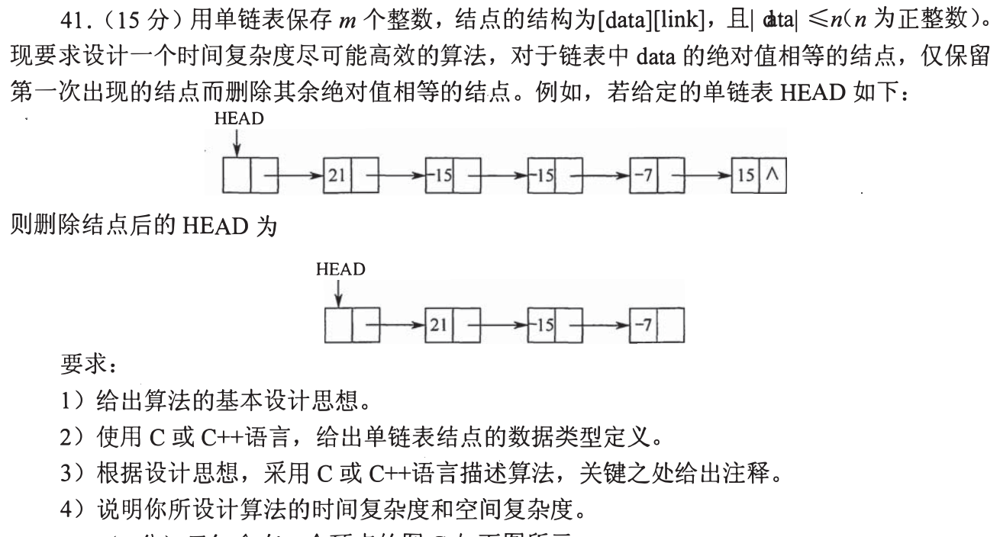

**（1）思路。** `|data|≤n` 是直接标记值域的证据。顺着原链走时第一次看到 `v` 就标记，后续同绝对值结点由前驱跨过并释放。先改链接再释放，不能继续读被释放结点。

**（2）类型与代码。**

```c
typedef struct Node { int data; struct Node *link; } Node;
void dedupAbs(Node *head, int n) {
    unsigned char *seen=calloc((size_t)n+1, 1);
    if (!seen) return;                    // 实际工程须报告分配失败
    Node *prev=head, *p=head->link;
    while (p) {
        int v=p->data<0 ? -p->data : p->data;
        if (!seen[v]) { seen[v]=1; prev=p; p=p->link; }
        else {
            Node *dead=p;
            prev->link=p->link; p=prev->link;
            free(dead);
        }
    }
    free(seen);
}
```

**（3）代价。** `O(m+n)` 时间（初始化 `n+1` 个标记、扫描 m 个结点），`O(n)` 额外空间。若把标记初始化成本按题目值域计，不能只写 `O(m)`。

<details open><summary>为什么 21、-15、-15、-7、15 留下 21、-15、-7</summary>首次绝对值 15 对应第二个结点；后续 -15 和 15 都删。保存结点的原始正负号不改。若只按原数据做标记，会把正负看成不同组。</details>

<a id="q06"></a>
## 06｜2018-41：未出现的最小正整数

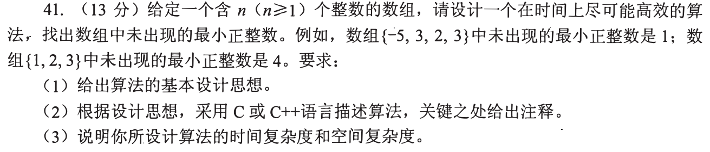

**（1）思路。** n 个数组元素最多占据 n 个不同的正整数，所以 `1..n+1` 必有缺口。负数、0、大于 n 的数均不能阻挡最小缺口。只标记 `[1,n]`，由 1 起找第一个没被标的数。

**（2）代码。**

```c
int firstMissing(const int A[], int n) {
    unsigned char *seen=calloc((size_t)n+1, 1);
    if (!seen) return -1;                 // 此 -1 是资源失败，不是题目答案
    for (int i=0; i<n; ++i)
        if (A[i]>0 && A[i]<=n) seen[A[i]]=1;
    int x=1;
    while (x<=n && seen[x]) ++x;
    free(seen);
    return x;
}
```

**（3）代价。** `O(n)` 时间、`O(n)` 额外空间；若允许改动原数组，还能把值映射回自身下标做到 `O(1)` 额外空间，但交换时须防重复导致死循环。题只要求尽可能快，用标记法可靠且线性。

<details open><summary>最常见漏项</summary>`[1,2,3]` 应返回 4，所以不能仅找 1 到 n 中的空位；`[-5,3,2,3]` 从 1 起检验，不应输出 4。</details>

<a id="q07"></a>
## 07｜2019-41：首尾交错重排单链表

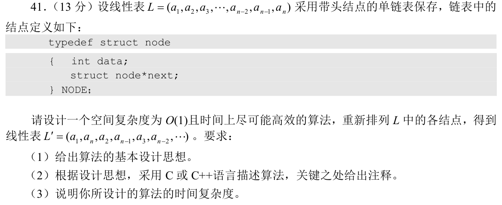

**（1）思路。** 目标 `a1,an,a2,a(n-1),...`：先用快慢指针把前半和后半分开，反转后半，再两链交替摘结点插接。地址变化而数据不搬运。

**（2）代码。**

```c
typedef struct Node { int data; struct Node *next; } Node;
void rearrange(Node *head) {
    Node *slow=head->next, *fast=head->next;
    if (!slow) return;
    while (fast->next && fast->next->next) {
        slow=slow->next; fast=fast->next->next;
    }
    Node *p=slow->next, *rev=NULL;
    slow->next=NULL;                       // 先截断，奇数时中点在前段
    while (p) { Node *t=p->next; p->next=rev; rev=p; p=t; }
    p=head->next;
    while (rev) {
        Node *a=p->next, *b=rev->next;
        p->next=rev; rev->next=a;
        p=a; rev=b;
    }
}
```

**（3）代价。** 线性找中点、反转和合并，`O(n)` 时间、`O(1)` 额外空间。

<details open><summary>用奇偶长验断点</summary>五结点前半 `a1,a2,a3`，后半 `a4,a5`→`a5,a4`，合并 `a1,a5,a2,a4,a3`；四结点前半 `a1,a2`，后半 `a3,a4`，合并 `a1,a4,a2,a3`。如果不先 `slow->next=NULL`，可能形成环。</details>

<a id="q08"></a>
## 08｜2019-42：空间只增不减的常数时间队列

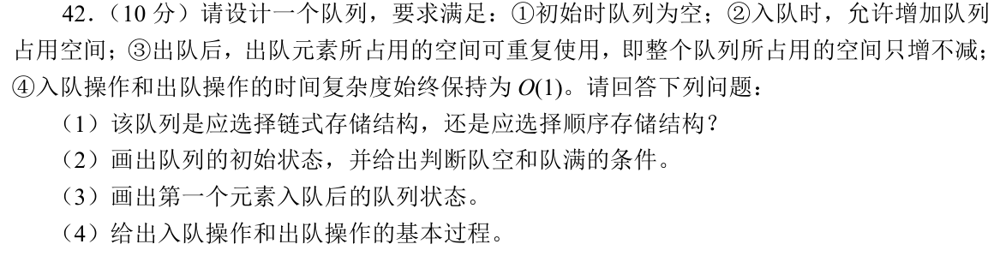

**（1）选择。** 选**链式存储**。动态数组扩容要搬运已有元素，会令某次入队 `O(n)`，违背“始终 O(1)”；链式队列可逐结点增长，再把出队节点放入可复用的闲置链，所占空间不缩。

**（2）初态与空满。** 带一个固定头结点：`front=rear=head`，`freeList=NULL`；`front->next==NULL` 表示队空。链式结构无预设容量；内存分配失败且闲置池为空才无法继续入队，这不是固定长度的“队满”。

**（3）首元素入队。** 取得节点 `p` 并写值，令 `p->next=NULL; rear->next=p; rear=p`，此时 `front=head`、`front->next==rear==p`。

**（4）入队/出队过程。** 入队先从 `freeList` 摘结点，池空再分配；接到 `rear->next` 并更新 `rear`。出队先判空，摘 `front->next` 并保存数据；若该结点原是 `rear`，令 `rear=front`；把摘下节点挂进 `freeList`。每次只改有限指针，时间 `O(1)`；已分配节点在池中复用，空间占用不因出队而减少。

<details open><summary>“数组还是链表”为什么取决于始终两字</summary>循环数组用尽时可扩容，平均或摊还可很快，但触发扩容的那一次要复制元素。题目明确每次操作始终 O(1)，因此不能用摊还 O(1) 充数。若通常链表出队后立即 `free`，占用会减少，需把节点保存在闲置池。</details>

<a id="q09"></a>
## 09｜2020-41：三个升序数组找最接近三元组

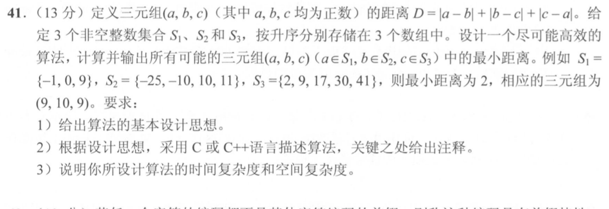

**（1）思路。** 将三个数排序后，中间数到两端的差之和等于两端之差，所以 `D=2(max−min)`。三个指针分别从数组首部起步；记录当前三元组的距离和值；每次只推进**当前最小元素所在数组**，直到某数组穷尽。

**（2）代码。**

```c
#include <limits.h>
#include <stdlib.h>
typedef struct { int a,b,c; long long d; } Best;
Best closest3(const int A[],int n,const int B[],int m,const int C[],int k) {
    int i=0,j=0,t=0;
    Best best={0,0,0,LLONG_MAX};
    while (i<n && j<m && t<k) {
        int a=A[i], b=B[j], c=C[t];
        int lo=a<b ? (a<c?a:c) : (b<c?b:c);
        int hi=a>b ? (a>c?a:c) : (b>c?b:c);
        long long d=2LL*((long long)hi-lo);
        if (d<best.d) best=(Best){a,b,c,d};
        if (lo==a) ++i;
        else if (lo==b) ++j;
        else ++t;
    }
    return best;
}
```

**（3）代价。** 三个指针最多推进 `n+m+k` 次，`O(n+m+k)` 时间、`O(1)` 额外空间。样例取 `(9,10,9)`，`D=2`。若值相等，任选一个当前最小者推进即可。

<details open><summary>为什么只能移动最小者</summary>最大值不变时，推进最大者只会使最大值不小；推进中间者也不会缩小当前极差。要有机会改善距离，必须让当前最小值变大。循环终止后仍可能有其他组合，但其耗尽数组的元素只能不大于当前最小值，无法改善已比较过的下界。</details>

<a id="q10"></a>
## 10｜2022-42：十个最小数，不必排序十万个数

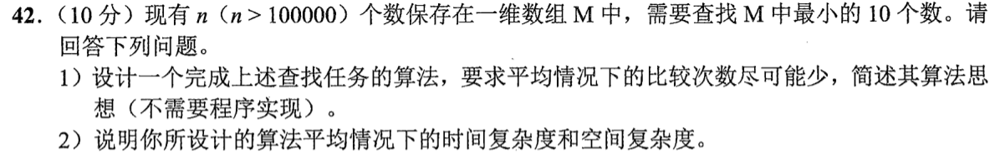

**（1）算法。** 扫描前十个元素，建一个大小 10 的**大根堆**。堆顶是当前保留的十个数里最大的。对后续元素 `x`，若 `x>=堆顶`，它不可能进当前最小十个；若 `x<堆顶`，用 `x` 替换堆顶并向下调整。扫完堆内就是十个最小值，重复值按出现次数计。

**（2）复杂度。** 建十元素堆为常数，后续 `n−10` 次每次比较堆顶，至多再沿高度 `log 10` 调整，平均/最坏时间 `O(n log 10)`，因 10 固定也可写 `O(n)`；额外只存 10 个数，`O(10)=O(1)`。不要求排序输出，若需有序，最后排这十个即可。

<details open><summary>保底路线与比较次数</summary>完整排序 `O(n log n)` 也能得答案但做了无关比较；用十个槽的有序表每次插入需要最多十次移动。大根堆让大多数后续数仅与堆顶比较一次，符合题目“平均比较次数尽可能少”的意图。</details>

<a id="q11"></a>
## 11｜2025-41：固定左端，右端乘积最大

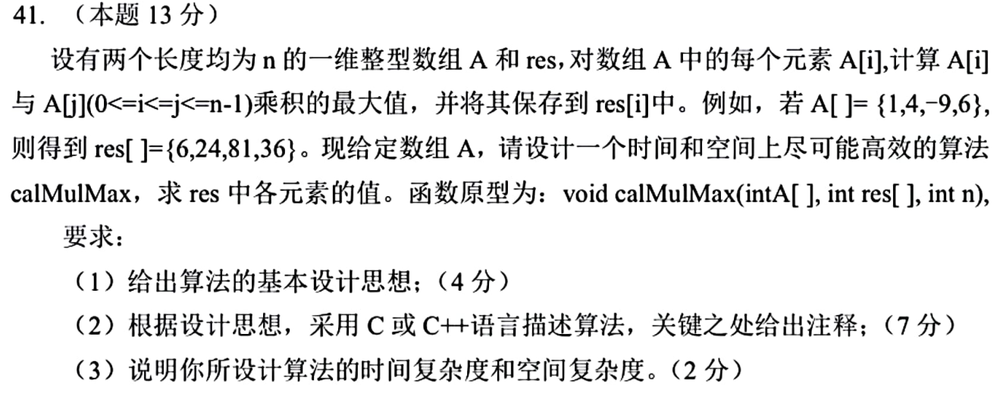

**（1）思路。** 对固定 `A[i]`，若为正，选择后缀 `A[i..n-1]` 的最大值；若为负，选择后缀最小值；若为零，答案为零。从右向左扫描，先把 `A[i]` 纳入后缀最大/最小，再算 `res[i]`，因此 j=i 合法且不会漏。

**（2）代码。**

```c
void calMulMax(const int A[], int res[], int n) {
    int mn=A[n-1], mx=A[n-1];
    for (int i=n-1; i>=0; --i) {
        if (A[i]<mn) mn=A[i];
        if (A[i]>mx) mx=A[i];
        res[i]=A[i]*(A[i]>=0 ? mx : mn);
    }
}
```

**（3）代价。** 扫一次为 `O(n)` 时间，除题目要求的输出数组 `res` 外额外 `O(1)` 空间。题给 `int` 函数原型；若乘积可超过 `int` 范围，需与调用方约定更宽结果类型，不能靠中间转型后再写回 `int` 消除溢出。

<details open><summary>为什么只留最大还不够</summary>例 `A[i]=-9`，右侧有 `-9` 与 `6`：最大乘积是 `81`，取后缀最大 6 只得 -54。样例 `[1,4,-9,6]` 从右向左更新极值得 `[6,24,81,36]`。一开始不能让后缀不含 `A[i]`，因为允许 `i=j`。</details>

## 练习闭环

首次阅读先做题，卡住才展开对应折叠区；第二次遮住代码，独立写出不变量、边界和复杂度。大题按“能写出的步骤分—完整正确—限时稳定”分别记录，当前只完成讲解，未替用户登记通关。
