[← 0908 选择题终点](0908.md) · [总索引](README.md) · [0915 →](0915.md)

# 0914｜线性结构：一次扫描中完成筛选、重排与最值维护

> 大题线 `W01-linear-transform` · 第 01/19 个节点 · 11 道完整真题引用
>
> 选择题前置线：`01-growth`、`02-layout`

## 归类依据

这些题的共同难点不是语法，而是怎样避免反复回头。利用值域、单调性、双指针、局部状态或辅助标记，把删除、重排、集合相交与区间最值收束到一次或少数几次扫描。

这一节点以完整作答为单位。公共题干、全部小问、代码或计算过程必须在同一次作答中收口；再次出现的接口题只检查它与当前机制的连接，不重复抄题。

## 题单

### 01 · 2009-42

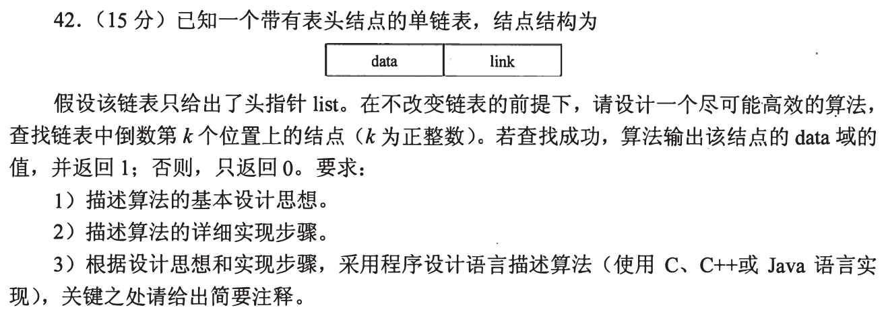

### 02 · 2010-42

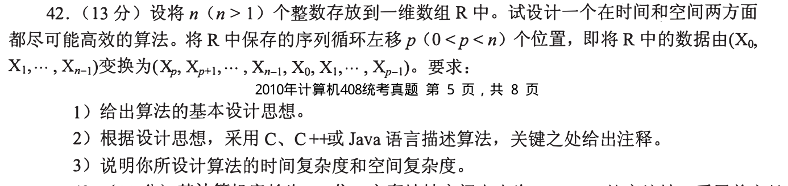

### 03 · 2012-42

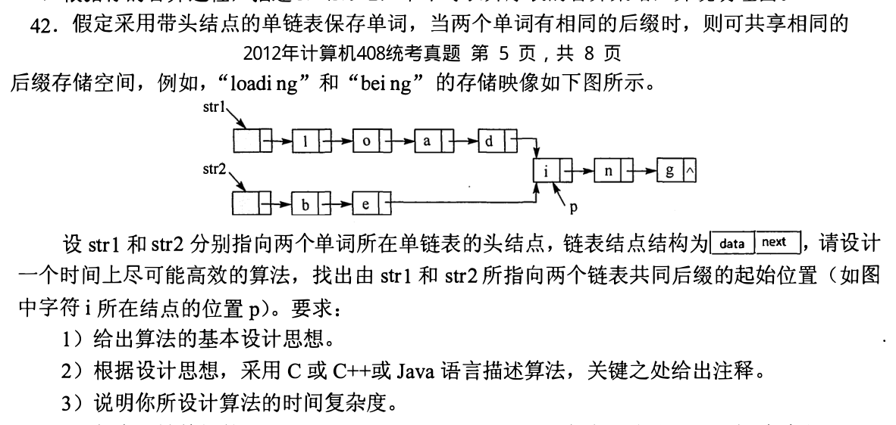

### 04 · 2013-41

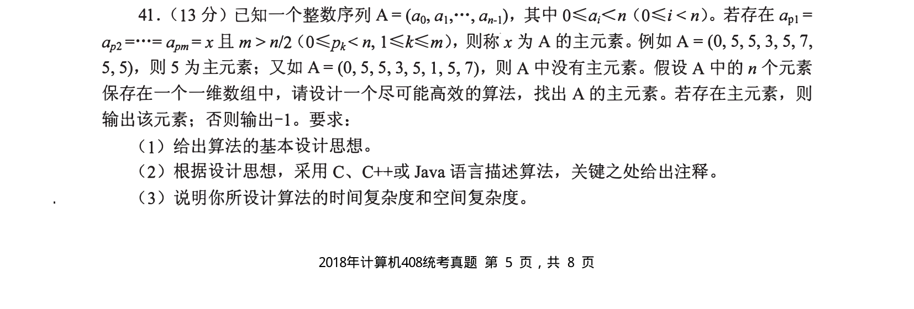

### 05 · 2015-41

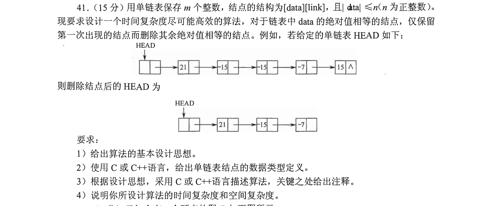

### 06 · 2018-41

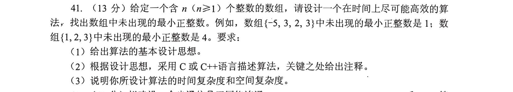

### 07 · 2019-41

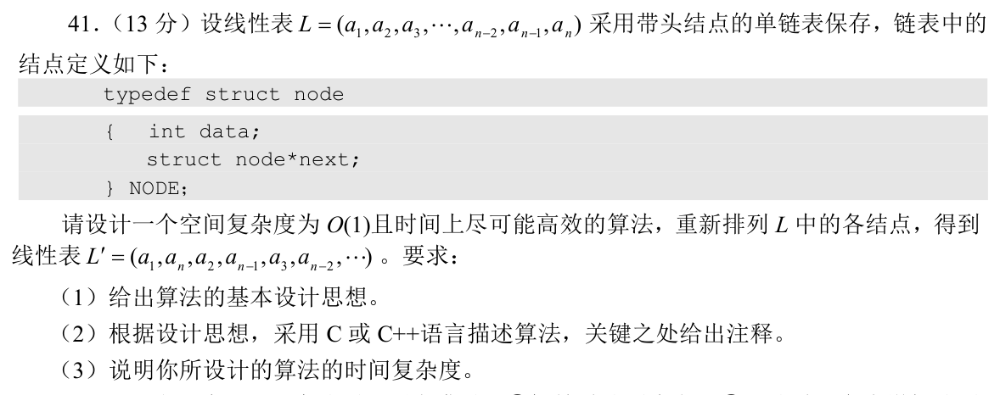

### 08 · 2019-42

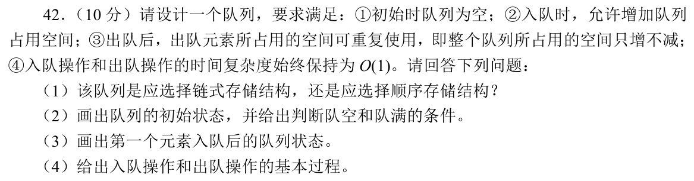

### 09 · 2020-41

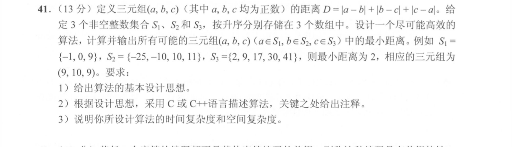

### 10 · 2022-42

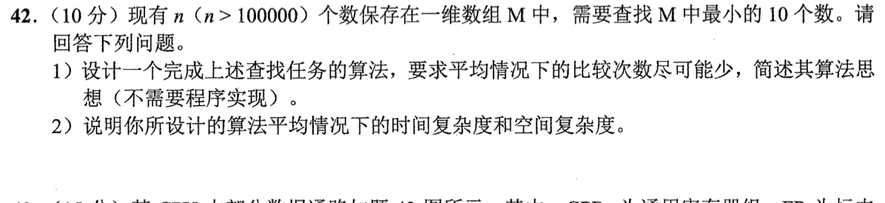

### 11 · 2025-41

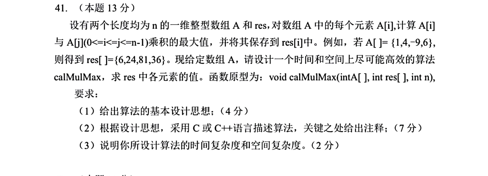

[← 0908 选择题终点](0908.md) · [总索引](README.md) · [0915 →](0915.md)
