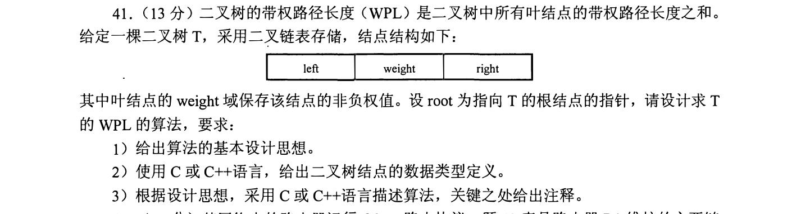
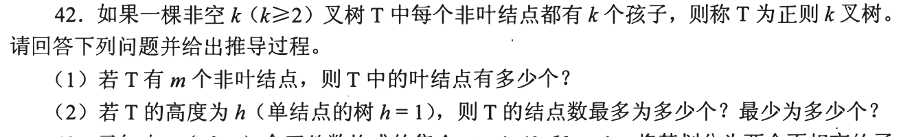
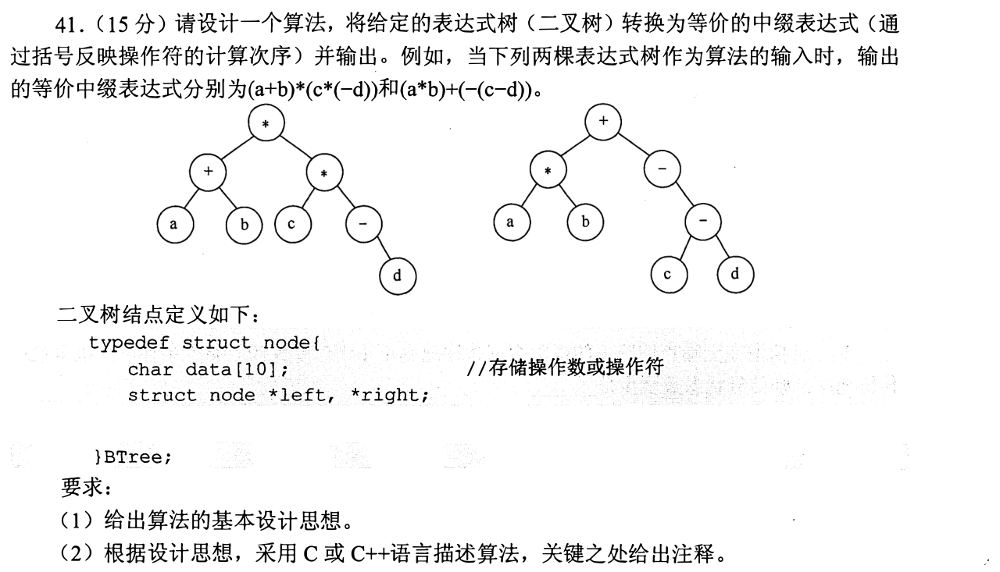
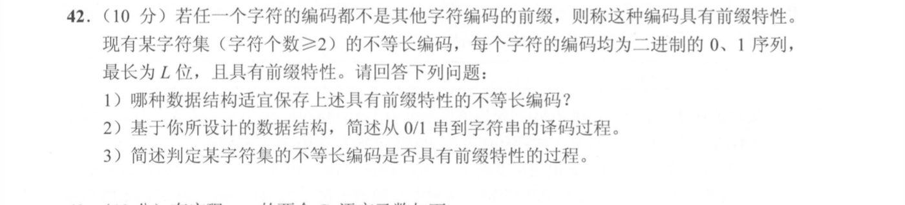
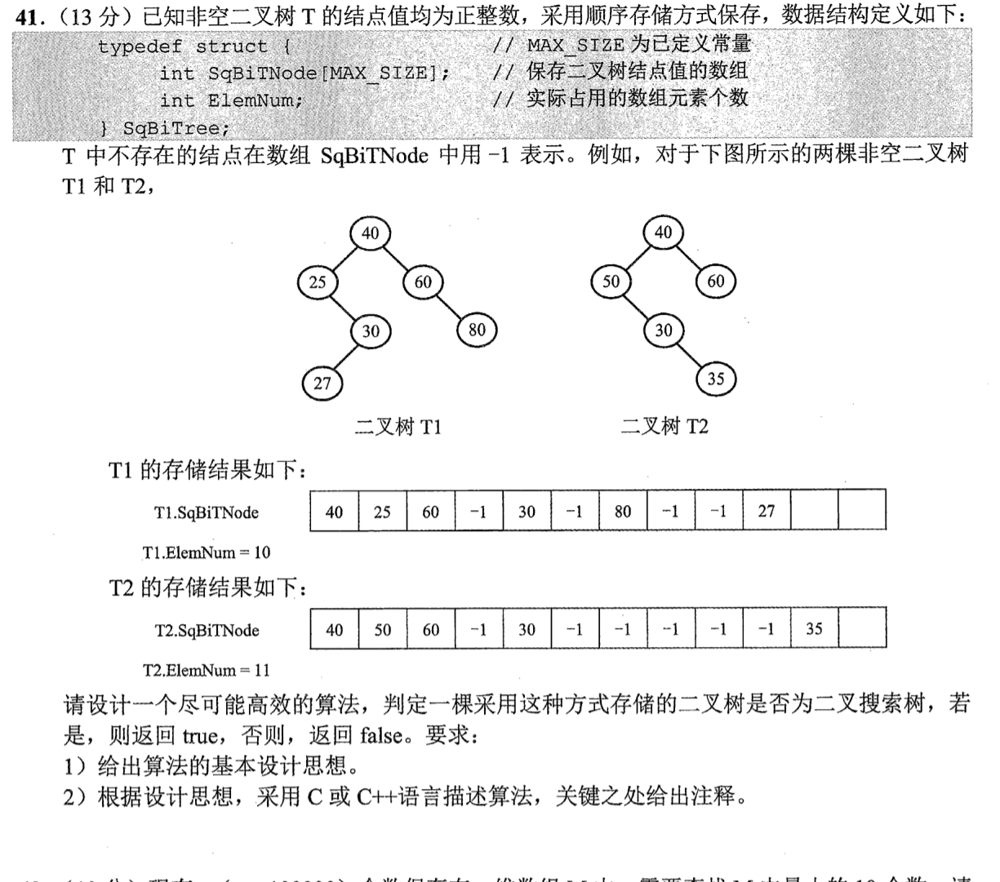

[← 0914](0914.md) · [总索引](README.md) · [0916 →](0916.md)

# 0915｜树的递归含义：路径、编码、表达式与存储形态

> 大题线 `W02-tree-recursion` · 第 02/19 个节点 · 5 道完整真题引用
>
> 选择题前置线：`04-tree-shape`、`05-huffman`、`06-search-tree`

## 归类依据

树题需要同时守住结构递归和题目语义：路径上的累计量、前缀边界、表达式括号、结点层次以及顺序存储空位，都必须在一次遍历中保持不变量。

这一节点以完整作答为单位。公共题干、全部小问、代码或计算过程必须在同一次作答中收口；再次出现的接口题只检查它与当前机制的连接，不重复抄题。

## 题单

### 01 · 2014-41

### 02 · 2016-42

### 03 · 2017-41

### 04 · 2020-42

### 05 · 2022-41

[← 0914](0914.md) · [总索引](README.md) · [0916 →](0916.md)
