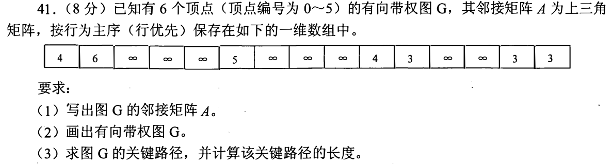
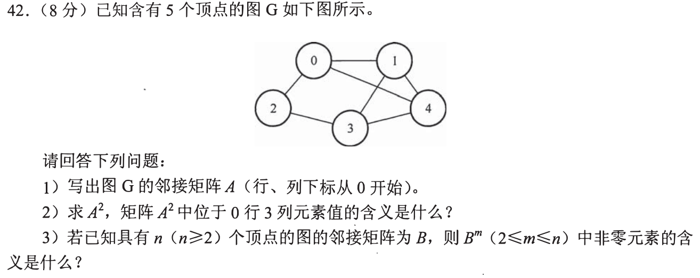
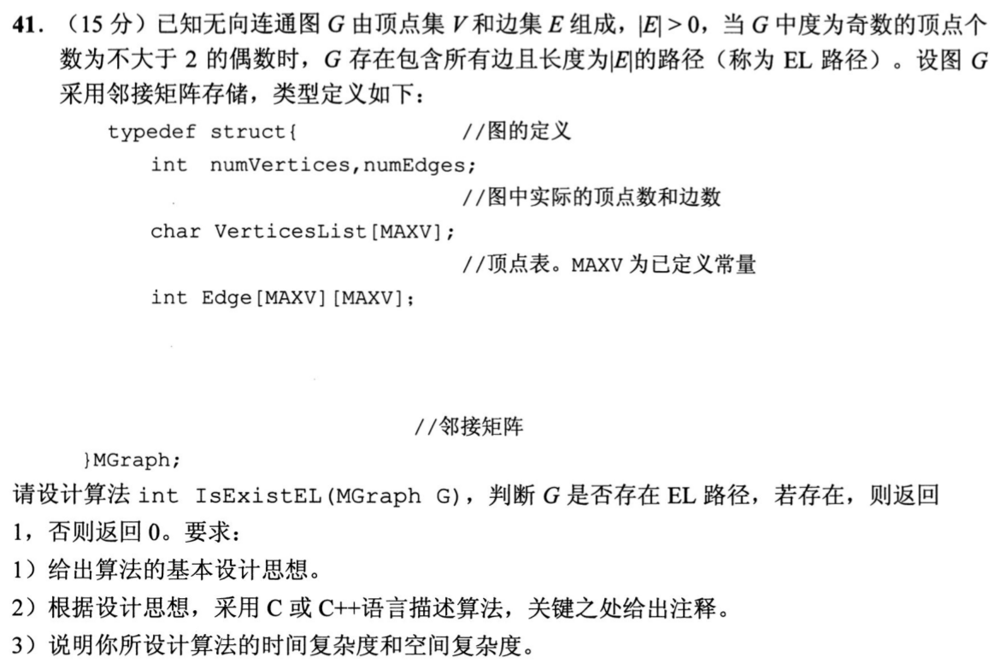
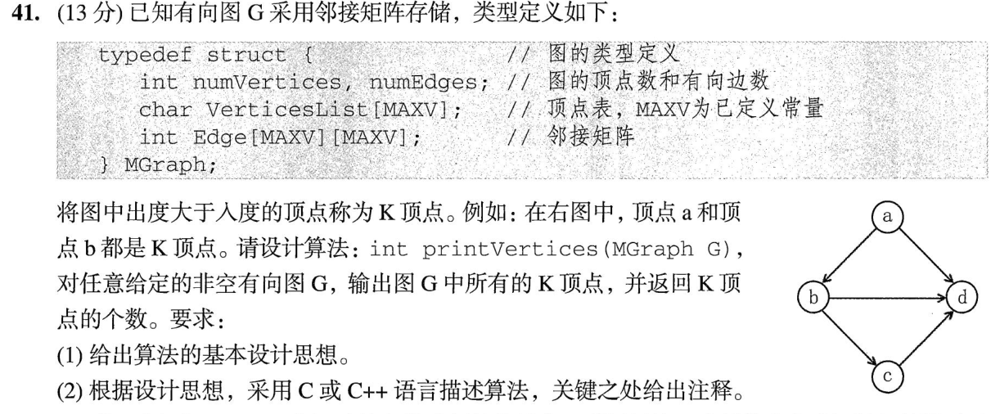
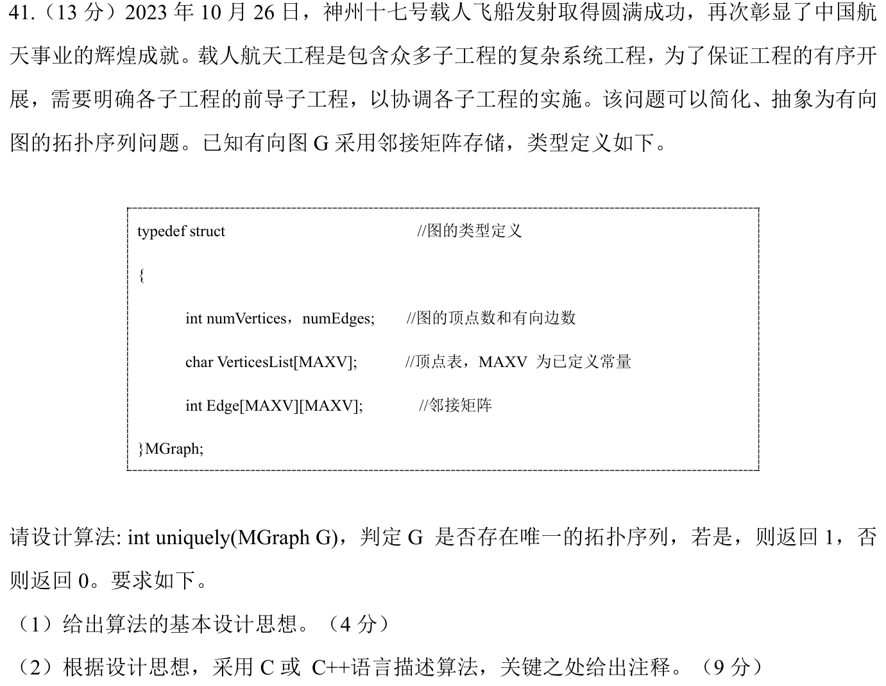

[« 0915-answer](0915-answer.md)　　[0917-answer »](0917-answer.md)

# 0916 Answer｜邻接矩阵怎样提供全局结论

> [原题 5 道](0916.md) · [0915 树的递归](0915-answer.md) · [能力账本](answer-quality/learning-ledger.md)
>
> 先说明矩阵元素代表什么，再把局部计数接成路径、度数或拓扑序；讲解完成，限时独立作答未验。

<details><summary><strong>考场入口</strong></summary>

| 题 | 第一笔 | 结论/检查 |
| --- | --- | --- |
| 01 | 上三角按行补回 `(i,j)` 权值 | 最长 0→1→2→3→5，长度16 |
| 02 | 图上列出每个顶点的邻居 | `A²[0][3]=3` 是长2的步行数 |
| 03 | 逐行数度数奇偶 | 连通图奇度点 0 或 2 个 |
| 04 | 每行求出度、每列求入度 | 出度 > 入度就输出 |
| 05 | 每轮统计当前入度为0的顶点数 | 始终恰一才唯一 |

</details>

<a id="q01"></a>
## 01｜2011-41：上三角还原有向图与关键路径



**（1）矩阵。** 六顶点上三角按行优先依次是 0 行的五格、1 行四格、2 行三格、3 行两格、4 行一格。对角线取 0，反向不存在的有向边取 `∞`：

| 行\列 | 0 | 1 | 2 | 3 | 4 | 5 |
| --- | ---: | ---: | ---: | ---: | ---: | ---: |
| 0 | 0 | 4 | 6 | ∞ | ∞ | ∞ |
| 1 | ∞ | 0 | 5 | ∞ | ∞ | ∞ |
| 2 | ∞ | ∞ | 0 | 4 | 3 | ∞ |
| 3 | ∞ | ∞ | ∞ | 0 | ∞ | 3 |
| 4 | ∞ | ∞ | ∞ | ∞ | 0 | 3 |
| 5 | ∞ | ∞ | ∞ | ∞ | ∞ | 0 |

**（2）图。** 边表即可准确绘图：`0→1(4)、0→2(6)、1→2(5)、2→3(4)、2→4(3)、3→5(3)、4→5(3)`。这里的括号是权，不是顶点号。

**（3）关键路径。** 从源0按拓扑次序累计最早发生时刻：`ve=[0,4,9,13,12,16]`；从汇5逆推最迟时刻：`vl=[0,4,9,13,13,16]`。零时差的关键边为 `0→1、1→2、2→3、3→5`，关键路径 **0→1→2→3→5**，长度 `4+5+4+3=16`。注意 `0→2→3→5=13`，不能见 6 比 4 大就只选 0→2。

<details open><summary>如何从 ve/vl 检查每条边</summary>边 `(u,v)` 的最早开工是 `ve[u]`，最迟开工是 `vl[v]−w(u,v)`，二者相等才关键。`2→4` 的最早9、最迟10，不关键；若只看入度/出度，无法判工期。</details>

<a id="q02"></a>
## 02｜2015-42：邻接矩阵平方数的是两步走法



**（1）矩阵。** 无向图的七条边为 `01,02,04,13,14,23,34`，故 A 对称、对角为 0：

```text
0 1 1 0 1
1 0 0 1 1
1 0 0 1 0
0 1 1 0 1
1 1 0 1 0
```

**（2）平方。** 依 `A²[i][j]=Σ_k A[i][k]A[k][j]` 得

```text
3 1 0 3 1
1 3 2 1 2
0 2 2 0 2
3 1 0 3 1
1 2 2 1 3
```

`A²[0][3]=3`：0 到 3 的长为 2 的**步行**有三条，分别经顶点 1、2、4。题问的是这个矩阵元素的意义，不能说成“最短距离为3”。

**（3）一般 B^m。** 非零表示存在从对应行顶点到列顶点、恰好 m 条边的步行；数值在普通矩阵乘法下是这类步行的条数。可重复顶点/边，故不保证是简单路径。对角非零表示可以走 m 步返回。

<details open><summary>为什么要说“恰好 m”</summary>乘一次矩阵多拼一条边；`B^m` 本身不表示“不超过 m”。若问可达性需检查某些不同幂或使用传递闭包。无向图 0→1→0 两步使对角线出现非零。</details>

<a id="q03"></a>
## 03｜2021-41：EL 路径由奇度顶点决定



**（1）思路。** 题已保证无向图连通且至少一条边，不需重新证明连通。每经过中间顶点，进入、离开的边配成对；只有路线起终点可留一个奇数。奇度点数为 **0** 时有欧拉回路，为 **2** 时有欧拉通路；其余不能一笔走完所有边。

**（2）代码。**

```c
typedef struct {
    int numVertices,numEdges;
    char VerticesList[MAXV];
    int Edge[MAXV][MAXV];
} MGraph;
int IsExistEL(MGraph G) {
    int odd=0;
    for (int i=0; i<G.numVertices; ++i) {
        int degree=0;
        for (int j=0; j<G.numVertices; ++j)
            if (G.Edge[i][j]) ++degree;
        if (degree%2) ++odd;
    }
    return odd==0 || odd==2;
}
```

**（3）代价。** 邻接矩阵扫 `V²` 格，`O(V²)` 时间、`O(1)` 额外空间。题明确无向连通、边数>0；若脱离题设，多连通分量时仅数奇度不够。

<details open><summary>保底拿分</summary>先写“通路中途每到一点必须再离开，使用边成双”，即可推出内部点偶度；例一个链的两个端点奇度，可一笔从一端走到另一端。不要把“含所有边”的 EL 路径误写成必须访问每个顶点恰好一次。</details>

<a id="q04"></a>
## 04｜2023-41：K 顶点是行和大于列和



**（1）思路。** 有向邻接矩阵 `Edge[i][j]` 表示 `i→j`，行求和得到 i 的出度，列求和得到 i 的入度。两个数直接比，不要把“谁指向谁”的方向倒过来。

**（2）代码。**

```c
typedef struct {
    int numVertices,numEdges;
    char VerticesList[MAXV];
    int Edge[MAXV][MAXV];
} MGraph;
int printVertices(MGraph G) {
    int count=0, n=G.numVertices;
    for (int i=0; i<n; ++i) {
        int out=0,in=0;
        for (int j=0; j<n; ++j) {
            if (G.Edge[i][j]) ++out;
            if (G.Edge[j][i]) ++in;
        }
        if (out>in) { printf("%c ",G.VerticesList[i]); ++count; }
    }
    return count;
}
```

图中 a 出2入0、b 出2入1，是 K；c 出1入1，不是 K；d 出0入3，不是。复杂度 `O(V²)` 时间、`O(1)` 额外空间。

<details open><summary>图的故事信息如何处理</summary>航天工程背景只说明“前导”是有向先后关系，算法要用的条件仅是邻接矩阵、出度>入度。若矩阵有自环，行列各贡献 1，仍可正常比较。</details>

<a id="q05"></a>
## 05｜2024-41：拓扑序唯一需要每一轮只有一个入口



**（1）思路。** 用 Kahn 算法剥去入度为0的顶点。某轮出现 **两个及以上** 入度0顶点，则这两者互无先后约束，先后互换便给出不同拓扑序；若没有，则有环、无拓扑序。只有连续 n 轮都**恰有一个**可选顶点，才存在唯一拓扑序。

**（2）代码。** 邻接矩阵下 `O(V²)` 足够：

```c
typedef struct {
    int numVertices,numEdges;
    char VerticesList[MAXV];
    int Edge[MAXV][MAXV];
} MGraph;
int uniquely(MGraph G) {
    int n=G.numVertices, indeg[MAXV]={0}, used[MAXV]={0};
    for (int u=0; u<n; ++u)
        for (int v=0; v<n; ++v)
            if (G.Edge[u][v]) ++indeg[v];
    for (int step=0; step<n; ++step) {
        int choice=-1, count=0;
        for (int v=0; v<n; ++v)
            if (!used[v] && indeg[v]==0) { choice=v; ++count; }
        if (count!=1) return 0;       // 0: 有环；>1: 顺序不唯一
        used[choice]=1;
        for (int v=0; v<n; ++v)
            if (G.Edge[choice][v]) --indeg[v];
    }
    return 1;
}
```

预扫矩阵及 n 轮线性扫描共 `O(V²)` 时间，`O(V)` 额外空间。若每轮只有一个候选，就没有可供分歧的交换；如果早期分叉，后来即使合流也已经产生不同的拓扑序。

<details open><summary>保底路线：分别处理 0、1、2 个</summary>没有可选顶点但还有未删顶点，必在环中，拓扑序不存在；一个则被迫选；两个可以交换当轮顺序，至少两种。不要把“算法随意挑了一个”当成唯一性的证明。</details>

## 练习方式

把五题混合计时：先遮住答案，只写“矩阵元素/行/列/当前入度为0”这类实际可读的证据，再完成推导。特别复做 01 的 15 个上三角格与 02 的 `A²[0][3]`，这两处一个漏位会把后续正确方法建立在错误输入上。
