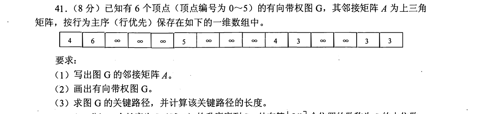
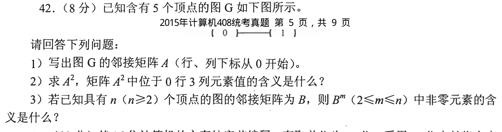
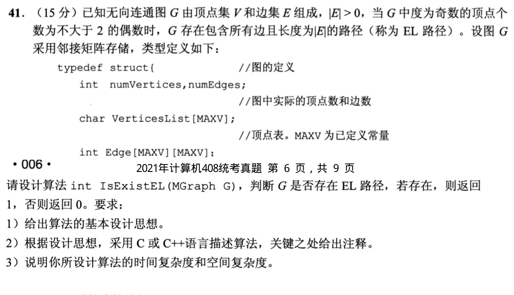
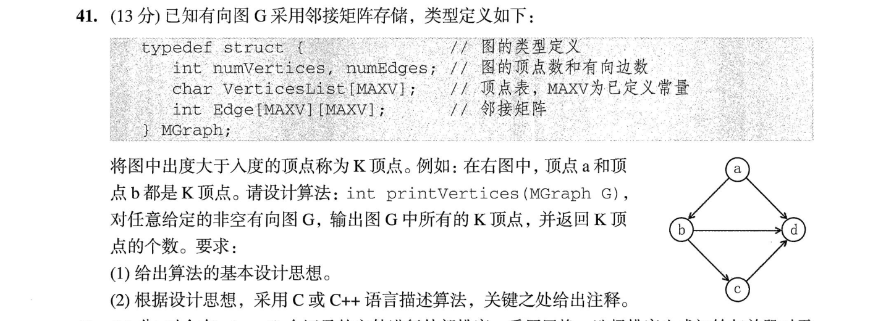
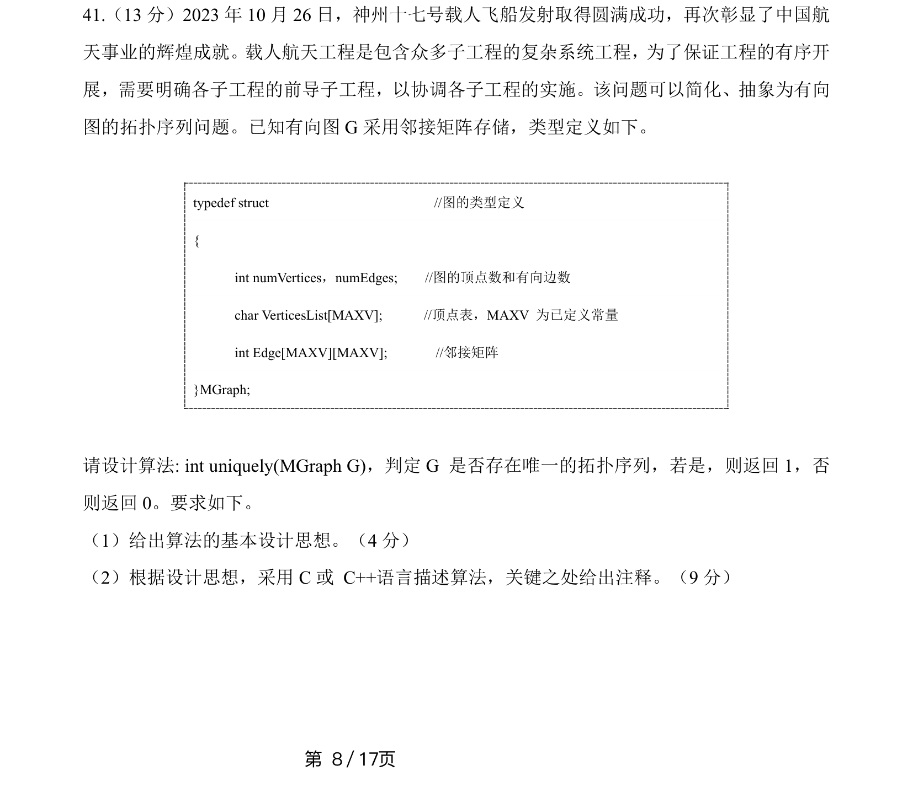

[← 0915](0915.md) · [总索引](README.md) · [0917 →](0917.md)

# 0916｜图的结构判定：从邻接信息恢复全局性质

> 大题线 `W03-graph-structure` · 第 03/19 个节点 · 5 道完整真题引用
>
> 选择题前置线：`07-graph-model`、`08-graph-path`

## 归类依据

这一组训练把局部邻接关系变成全局结论，包括关节点、度数、路径约束、距离条件和拓扑序唯一性。关键是明确遍历过程中记录什么，以及局部记录为什么足以支持最终判断。

这一节点以完整作答为单位。公共题干、全部小问、代码或计算过程必须在同一次作答中收口；再次出现的接口题只检查它与当前机制的连接，不重复抄题。

## 题单

### 01 · 2011-41

### 02 · 2015-42

### 03 · 2021-41

### 04 · 2023-41

### 05 · 2024-41

[← 0915](0915.md) · [总索引](README.md) · [0917 →](0917.md)
