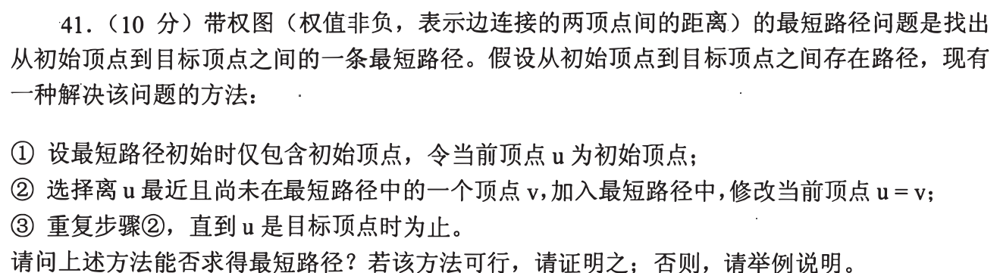
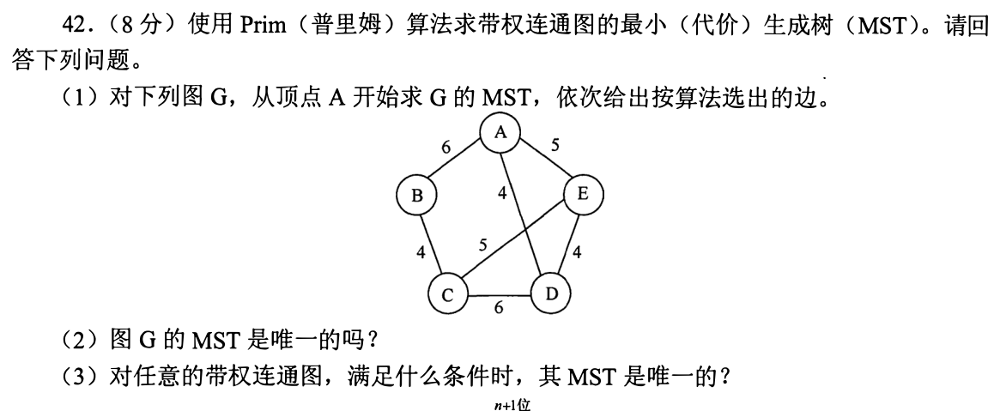
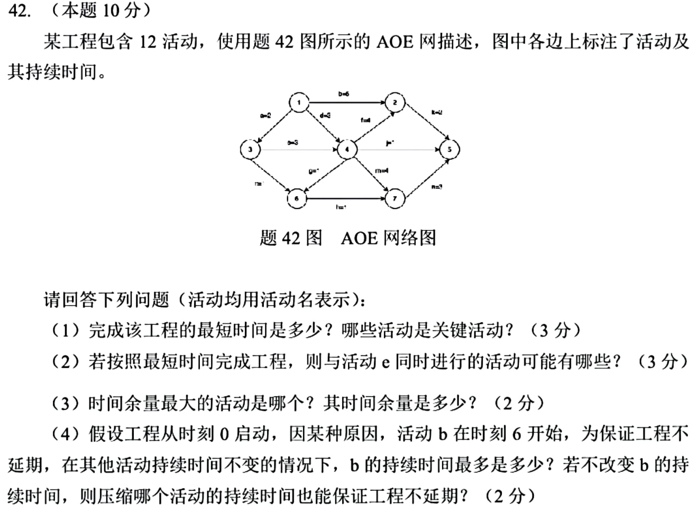

[« 0916-answer](0916-answer.md)　　[0918-answer »](0918-answer.md)

# 0917 Answer｜局部选择何时能保证全局最优

> [原题 3 道](0917.md) · [0916 图的结构](0916-answer.md) · [能力账本](answer-quality/learning-ledger.md)
>
> 三道题的“选最小/最长”不能互相借用：最短路要维护所有未定终点距离，生成树只跨已选集合的割，关键路径看整个工程工期。讲解完成，独立限时未验。

<strong>考场入口</strong>

| 题 | 第一笔 | 结论 |
| --- | --- | --- |
| 01 | 造一条“先近后贵、先远后便宜”的反例 | 当前点的最近邻不保证最短路 |
| 02 | 从 A 只在跨割边里取最轻 | AD4、DE4、EC5、CB4；权17且唯一 |
| 03 | 先前推事件最早，再后推最迟 | 工期12；关键 a,e,m,n |

## 01｜2009-41：最近邻贪心为什么会误入歧途

题中算法每次只看**当前顶点 u 到未进入路径的顶点的单条边权**，然后立刻把该顶点定入路径。反例：起点 S 连 A 权1、连 B 权2，A 到终点 T 权100，B 到 T 权2；其他边不存在、各权非负。从 S 它选 A，因为 `1<2`，接着只能去 T，总长101；实际路径 S→B→T 只长4。因此**不可行**。

与 Dijkstra 的差在哪里
Dijkstra 比较的是“从源点到各未定顶点的当前累计最短距离”，且从选出的顶点松弛邻边；本题只从刚走到的 u 看下一条边，并放弃回头考虑 S→B 的机会。非负权保证 Dijkstra 的已定最短距离正确，并不能保证任意一条近邻路正确。保底写出四个顶点、两条完整路线的总和即可证明不可行。

## 02｜2017-42：Prim 选择的是跨割边

**（1）从 A 开始。** 取 `A—D(4)`；已选 `{A,D}` 的出边里取 `D—E(4)`；已选 `{A,D,E}` 到 C 的最轻边是 `E—C(5)`，到 B 最轻 A—B(6)，故取 `E—C(5)`；最后取 `C—B(4)`。生成树总权 **17**。

**（2）图 G 唯一吗？** 是。割 `{A}` 的唯一最轻边是 AD4；割 `{E}` 的唯一最轻边是 DE4；割 `{B}` 的唯一最轻边是 BC4；割 `{B,C}` 的跨割边为 BA6、CD6、CE5，唯一最轻为 CE5。这四条边都由割性质强制进入任何 MST，且已构成生成树，因此唯一。也可按 Kruskal 验证：三个权4边 AD、DE、BC 全纳入，再以唯一可用权5跨两分量的 EC 连接；AE5 两端已在同一分量，不能替代。四边被强制，故 MST 唯一。

**（3）一般条件。** **各边权互不相同**是 MST 唯一的充分条件，但不是必要条件；本图有重复 4、5、6 仍唯一。更精确地说，对任意不在某棵 MST 内的边 e，若它的权严格大于把 e 加入树所形成环上的最大树边权，则该 MST 唯一；一旦同权可替换就存在另一棵。考场上若只记得充分条件，至少写清“充分非必要”，不把本图重复权直接判不唯一。

Prim 的集合边界
每一步只能在“已选顶点集合与未选集合之间”的边里选最轻；图上全局最小边可能连接两个尚未选的顶点，不是当前 Prim 的下一步。图的 AE5 与 EC5 同权，但 AE 连接的点已经被 AD+DE 连上，不能构成相同的四边树。

## 03｜2025-42：AOE 活动的时间余量

原图活动边按起点→终点记为：`a:1→3(2), b:1→2(5), d:1→4(3), e:3→4(3), c:3→6(2), f:4→2(4), g:4→6(1), h:6→7(1), j:4→5(1), m:4→7(4), k:2→5(2), n:7→5(3)`。先读清方向；背景叙事不参与算工期。

**（1）工期与关键活动。** 顺边取最大，事件1、3、4、2、6、7、5的最早时刻依次为 `0,2,5,9,6,9,12`；从终点倒推最迟时刻对应为 `0,2,5,10,8,9,12`。最短可完成时间 **12**；零余量的链 `1→3→4→7→5`，即 **a、e、m、n**。

**（2）与 e 同时进行。** e 最早在 **2—5** 运行。`b` 可在0开始持续到5，`d` 可安排在0—3，`c` 可在事件3后从2开始；三者均可与 e 有时间交集，答 **b、c、d**。“同时进行”是可能重叠，不是必须同起同止。

**（3）最大时间余量。** 活动 `(u,v,w)` 的可推迟量为 `vl[v]−ve[u]−w`。`j:4→5(1)` 得 `12−5−1=6`，是最大余量，答 **j、6**。只按持续时间短选 j 没有依据；要看它的终点最迟和起点最早。

**（4）b 延到时刻6。** 走 `b→k` 到终点所需 `6+t_b+2≤12`，故 b 最长 **4**；若仍维持原时长5，须把 **k** 从2压至1（压缩至少1），使这条支路不超过12。压关键链上的活动虽能改变总工期定义，却没有直接修复被延迟的 `b→k` 支路，选 k 才对应瓶颈。

从一张表而非四套算法做完四问
先前推 `ve`：事件4必须等 `max(1→4 的3, 1→3→4 的2+3)=5`；事件2必须等 `max(b 的5, 事件4+f 的5+4)=9`；终点等最慢的 `7→5` 达12。再后推 `vl`：终点12，事件7最迟9，事件4因 m4 最迟5，事件3因 e3 最迟2。关键活动要求最早开工 `ve[u]` 与最迟开工 `vl[v]−w` 相等。这张表也直接给出 j 的6单位余量和 b 延迟后的支路约束。

## 复做检查

遮住表重新写出三个动作：01 的两条完整路径总长、02 每一步的已选集合、03 事件4为何取 max 而不是简单相加。只有独立写出并在时间内完成，才登记熟练，不由讲解完成自动推断考试分数。
