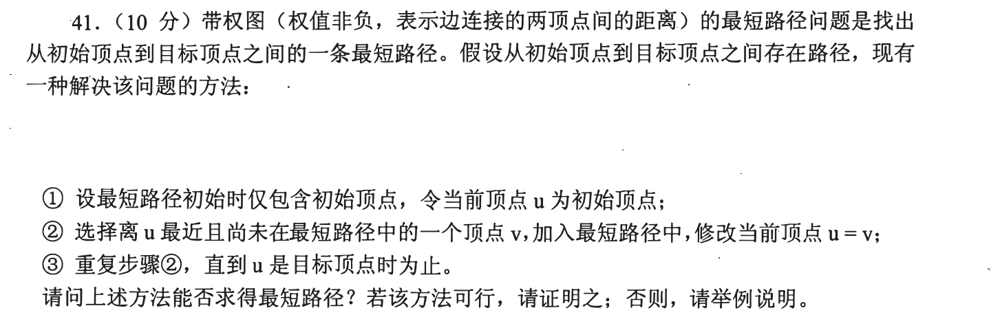
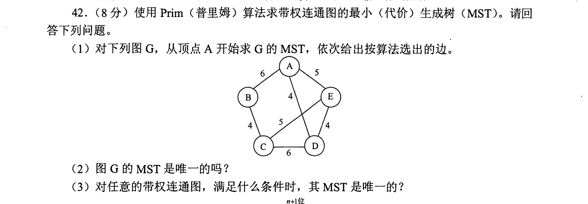
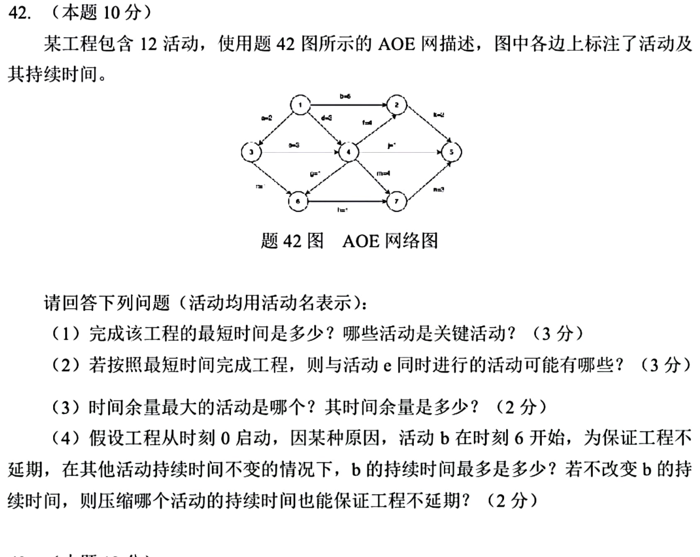

[← 0916](0916.md) · [总索引](README.md) · [0918 →](0918.md)

# 0917｜图上的最优推进：最短路、生成树与关键路径

> 大题线 `W04-graph-optimization` · 第 04/19 个节点 · 3 道完整真题引用
>
> 选择题前置线：`08-graph-path`

## 归类依据

最短路、最小生成树和 AOE 网表面不同，核心都是在全局约束下选择下一步仍可能进入最优解的顶点、边或活动。作答必须把选择规则、并列情况与最优性依据说完整。

这一节点以完整作答为单位。公共题干、全部小问、代码或计算过程必须在同一次作答中收口；再次出现的接口题只检查它与当前机制的连接，不重复抄题。

## 题单

### 01 · 2009-41

### 02 · 2017-42

### 03 · 2025-42

[← 0916](0916.md) · [总索引](README.md) · [0918 →](0918.md)
