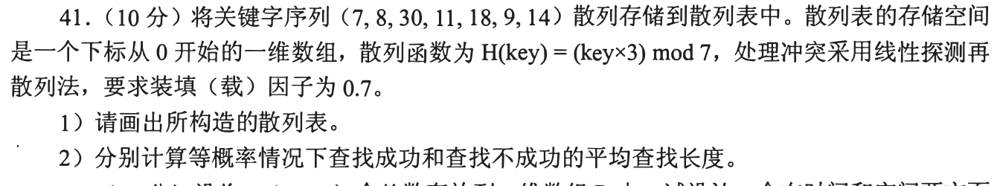
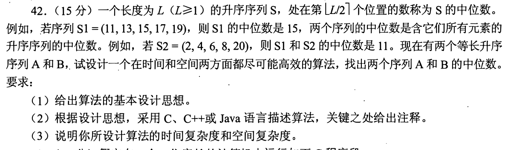
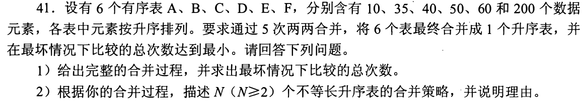
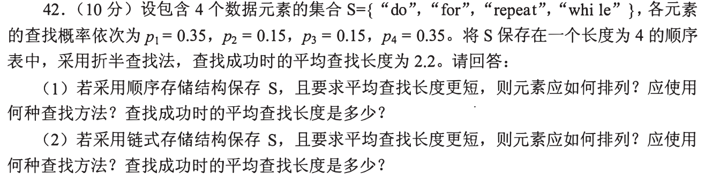
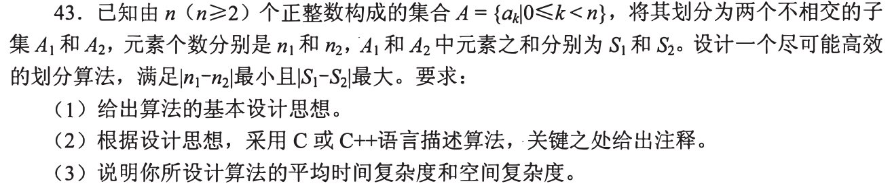
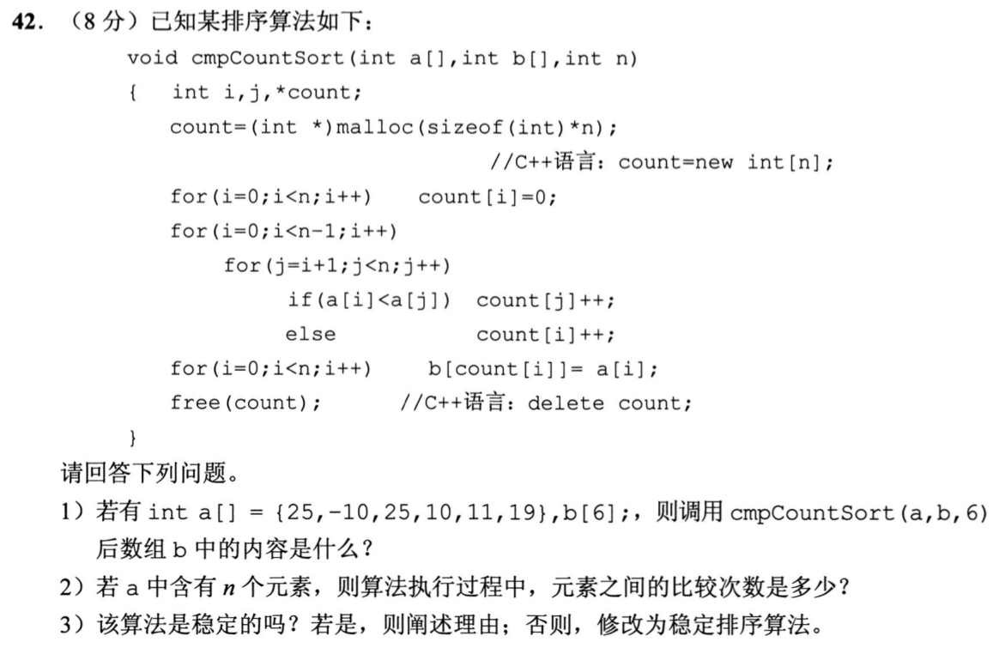
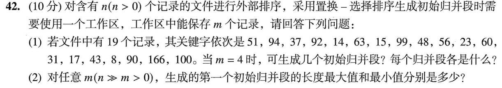
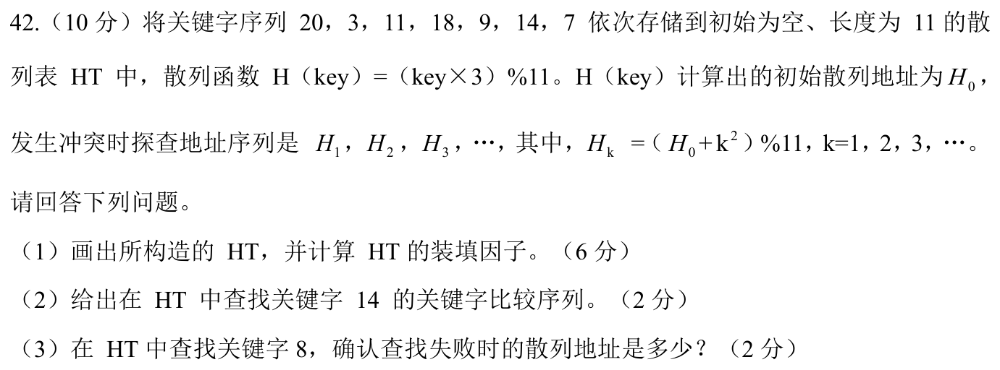

[« 0917-answer](0917-answer.md)　　[0919-answer »](0919-answer.md)

# 0918 Answer｜查找与排序要先确定在数什么

> [原题 8 道](0918.md) · [0914 扫描状态](0914-answer.md) · [能力账本](answer-quality/learning-ledger.md)
>
> 同是查找与排序，散列表数探测格，顺序查找数元素比较，外排序数归并段，快速选择数划分。题解已核原题；限时独立未验。

<details><summary><strong>考场起手</strong></summary>

| 题 | 第一笔 | 结果 |
| --- | --- | --- |
| 01 | 7 项、装填因子 0.7 ⇒ 10 格，线性探测模 10 | 成功 12/7；失败 18/7 |
| 02 | 两列等长且升序，目标是合并后的第 L 个 | 对半丢不可能部分 |
| 03 | 每次合并最坏比较为两表总长减1 | 825 次 |
| 04 | 依查找概率从高到低摆放 | 顺序查找 2.1 |
| 05 | 最小数量差，先按中位值把小/大分开 | 平均 O(n) |
| 06 | 比较对给较大者记名次，遇相等看原次序 | 原代码不稳定 |
| 07 | 内存 4 个，输出最小并冻结不合格的新数 | 三段，首段长 6 |
| 08 | `H0` 后按 `+k² mod 11` 查 | 14 比较3、18、14；8 在7失败 |

</details>

<a id="q01"></a>
## 01｜2010-41：散列地址与探测范围是两个数

<div style="max-width:100%; max-height:min(90vh, 72em); overflow:auto;">

</div>

**（1）构表。** 7 个关键字、装填因子0.7，所以表长 **10**；初址 `H(key)=3key mod 7` 只落在 `0..6`，发生碰撞后线性探测遍历**10格**，不能在7处折返。顺序插入的探测次数：7→0(1), 8→3(1), 30→6(1), 11→5(1), 18→5→6→7(3), 9→6→7→8(3), 14→0→1(2)。

| 下标 | 0 | 1 | 2 | 3 | 4 | 5 | 6 | 7 | 8 | 9 |
| --- | --- | --- | --- | --- | --- | --- | --- | --- | --- | --- |
| 键 | 7 | 14 | 空 | 8 | 空 | 11 | 30 | 18 | 9 | 空 |

**（2）平均查找长度。** 等概率成功 `ASL_s=(1+1+1+1+3+3+2)/7=12/7`。失败的可能**初址仅 0..6**，各从初址走到首个空格（包括该空格）的比较/探测长度依次为 `3,2,1,2,1,5,4`，所以 `ASL_f=18/7`。若从0到9十个格平均就是24/10，那是另一种“初始地址在整个表内均匀”的模型，与本题 `mod 7` 不同。

<details open><summary>最容易把两个模数混用</summary>散列函数模7决定起步概率，线性探测按物理表长10绕回。查找失败必须看到第一个空格才敢停止，所以空格也计一次。等概率是关键字或初址等概率，并非“表中每一格都作为失败初址”。</details>

<a id="q02"></a>
## 02｜2011-42：两个等长有序数组的下中位数

<div style="max-width:100%; max-height:min(90vh, 72em); overflow:auto;">

</div>

**（1）思路。** 两列各长 L，合并后共 2L 个，题定义的中位数是**第 L 个**（从1数），不是两中央数的均值。取两个当前等长候选区间的中点，比较 `A[m1]`、`B[m2]`：较小中点所在数组的左半段不可能是最终第 L 个，较大中点所在数组的右半段也不可能是；等长成对舍弃。偶数长度时舍弃的两侧需包含恰好相同数量。

**（2）代码。**

```c
int lowerMedian(const int A[], const int B[], int n) {
    int s1=0,d1=n-1,s2=0,d2=n-1;
    while (s1<d1) {
        int m1=(s1+d1)/2, m2=(s2+d2)/2;
        int len=d1-s1+1;
        if (A[m1]==B[m2]) return A[m1];
        if (A[m1]<B[m2]) {
            s1=m1+(len%2==0); d2=m2;
        } else {
            d1=m1; s2=m2+(len%2==0);
        }
    }
    return A[s1]<B[s2] ? A[s1] : B[s2];
}
```

**（3）代价。** 每轮候选规模近乎减半，`O(log L)` 时间、`O(1)` 空间。例 `S1=(11,13,15,17,19), S2=(2,4,6,8,20)` 得 11。

<details open><summary>偶数区间为何 +1</summary>若当前长度为4，中点下标相对起点为1，较小数组必须舍弃 `s..m` 共2项；较大数组保留 `s..m` 共2项。若长度为5，中点为2，较小数组保留中点起的3项，较大数组留到中点的3项。直接在两边都 `m+1` 会把可能答案扔掉。</details>

<a id="q03"></a>
## 03｜2012-41：多路合并总比较次数按树权算

<div style="max-width:100%; max-height:min(90vh, 72em); overflow:auto;">

</div>

**（1）五次合并。** 两个有序表最坏需要 `m+n−1` 次关键字比较；每次取当前两个最短表：`10+35→45` 用44次，`40+45→85` 用84次，`50+60→110` 用109次，`85+110→195` 用194次，`195+200→395` 用394次。总 **44+84+109+194+394=825 次**。若只把中间表长度相加是830，再减去五次合并各1，得到825。

**（2）一般策略与理由。** 反复合并当前两个最短表，直到只剩一个；这等价于带权路径长度最小的合并树。某个原始表的元素每经过一层就再次参与比较，长表应靠近根少重复参与；最小两表可放在最深处并先合并，再把它们视为一个表继续做相同决定。若忘了严格比较公式，先列出五个合并结果并写 `每次 m+n−1`，可以稳拿过程分。

<details open><summary>为什么表长相加不是比较数</summary>最坏时两个表交替出最小元素，直到一表最后一个元素尚未与另一表比较才结束；总共输出 m+n 个元素，最后一个不需比较，所以是 m+n−1。总输出表长395不等于比较总数，各层重复搬入元素。</details>

<a id="q04"></a>
## 04｜2013-42：提高成功查找的期望，先让高概率位置便宜

<div style="max-width:100%; max-height:min(90vh, 72em); overflow:auto;">

</div>

给定四个概率 `do=.35, for=.15, repeat=.15, while=.35`。原按字典序的折半查找成功 ASL 为题给的 **2.2**，它是基线。

**（1）顺序表。** 若目标是成功时尽可能少比较，不再保持字典序，按频率高到低排，如 `do, while, for, repeat`（两个同概率键可对换），从首位起**顺序查找**；期望 `.35×1+.35×2+.15×3+.15×4=2.1`。

**（2）链表。** 同样按概率降序链接 `do→while→for→repeat`，从头顺序查找，成功 ASL 仍为 **2.1**。链表不能直接跳到中间位置做折半；把 .35 的键放在远处反而花更多比较。若采用带表头结点，表头不存目标、不计关键字比较次数。

<details open><summary>为何这里两种结构给相同数字</summary>问题给的是固定成功概率和静态顺序，比较成本按访问第1、2、3、4个关键字计，两种结构的顺序扫描具有相同访问次数。链表在动态访问后自调整是另一个模型，题目没有提供访问序列，不能虚构更低期望。</details>

<a id="q05"></a>
## 05｜2016-43：按中位值划分比完整排序便宜

<div style="max-width:100%; max-height:min(90vh, 72em); overflow:auto;">

</div>

**（1）思路。** `|n1−n2|` 最小要求两组数量分别为 `floor(n/2)` 和 `ceil(n/2)`。元素均为正数，为使 `|S1−S2|` 最大，把最小的 `k=floor(n/2)` 个放在小组，余下大的放大组。若把小值与大值交换到反边，差值只会减小。无需把各组内部排好序，只要把第 k 小元素划到边界。

**（2）代码。** 使用随机枢轴快速选择（数组可原地重排）：

```c
#include <stdlib.h>
void swap(int *a,int *b) { int t=*a;*a=*b;*b=t; }
long long splitMaxDiff(int A[],int n) {
    int k=n/2,l=0,r=n-1;
    while (l<=r) {
        int x=A[l+rand()%(r-l+1)];
        int lt=l,i=l,gt=r;
        while (i<=gt) {
            if (A[i]<x) swap(&A[i++],&A[lt++]);
            else if (A[i]>x) swap(&A[i],&A[gt--]);
            else ++i;
        }
        /* [l,lt) < x， [lt,gt] == x， (gt,r] > x */
        if (k-1<lt) r=lt-1;
        else if (k-1>gt) l=gt+1;
        else break;
    }
    long long small=0,large=0;
    for (int i=0;i<k;++i) small+=A[i];
    for (int i=k;i<n;++i) large+=A[i];
    return large-small;
}
```

**（3）代价。** 随机枢轴平均 `O(n)` 时间、`O(1)` 额外空间，最坏 `O(n²)`；若要求最坏线性，需用更复杂的确定性选枢轴。三路划分一次跳过全部等于枢轴的元素，避免重复值使普通二路划分逐个缩小；重复值允许分布在两侧，不改变最大差值。此函数返回最大差；划分的两个集合分别保存在 `A[0..k-1]` 与剩余部分。

<details open><summary>为什么不能先任意平分再计算</summary>数量均衡只是第一个约束；例 `(1,2,100,101)`，把1和100放同组会让差缩小。排序法 `O(n log n)` 能做出答案，是忘记线性选择时可写出的保底路线，但不满足尽可能高效。</details>

<a id="q06"></a>
## 06｜2021-42：比较计数排序的相等分支

<div style="max-width:100%; max-height:min(90vh, 72em); overflow:auto;">

</div>

**（1）输出。** 对每对 `(i,j)`，较大元素的计数加1；相等时原代码走 `else`，令**较早**元素的计数加1，所以两个25的原次序倒转。`b=[-10,10,11,19,25,25]`，仅看数值无法看出这次交换。**（2）比较次数**恰是所有无序元素对数 `n(n−1)/2`，本例15次。

**（3）稳定性。** 原算法**不稳定**；想让相同键保持原顺序，相等时应使**后出现**者名次更大，把判断改为 `if (a[i] <= a[j]) count[j]++; else count[i]++;`。赋值 `b[count[i]]=a[i]` 前各计数给出互异的 `0..n−1`，改动后先出现的相等键得到较小位置。原代码为 C 语言，末尾 `free(count)` 合理；题图附的 C++ 提示若用 `new int[n]`，对应释放应为 `delete[] count`。

<details open><summary>用带标签的 25 验稳定性</summary>令两个25分别为 `25甲`、`25乙`，`i<j` 相等时旧代码给甲加一，因此乙排甲前；修正后给乙加一，甲留在前。不能只看最终整数数组一样就断定稳定。</details>

<a id="q07"></a>
## 07｜2023-42：置换选择的冻结边界

<div style="max-width:100%; max-height:min(90vh, 72em); overflow:auto;">

</div>

**（1）m=4。** 工作区先装前四数，当前活跃数里反复输出最小；读入的新数若不小于刚输出的数，可继续参加本段，否则冻结到下一段。按题给19个数生成三个初始归并段：

```text
R1: 37, 51, 63, 92, 94, 99
R2: 14, 15, 23, 31, 48, 56, 60, 90, 166
R3: 8, 17, 43, 100
```

首段6个数超过工作区容量4，因为每输出一个合格数就可读入一个替代；冻结键仍留在工作区但不参加本段选择。

**（2）任意 m、n≫m。** 第一段最短 **m**（之后读入的都比当前输出小，立刻冻结），最长 **n**（整个输入已非降序，持续替换并输出直到结束）。这里的极值说的是**第一段**，不代表平均段长；段长分布取决于输入顺序。

<details open><summary>用一轮辨“冻结”</summary>首批 `51,94,37,92` 输出37，再读14；14比37小，放进冻结区，不能立刻输出到已开始的非降序段。若把14直接拿去和51比大小，会错误让首段倒退。</details>

<a id="q08"></a>
## 08｜2024-42：平方探测会重复访问某些格

<div style="max-width:100%; max-height:min(90vh, 72em); overflow:auto;">

</div>

**（1）依次插入。** 表长11，`H0=3key mod 11`，冲突后依 `Hk=(H0+k²) mod 11`。20→5，3→9，11→0，18→10，9 初址5碰撞、`k=1`到6，14 初址9碰撞、`k=1`到10再到`k=2`的2，7 初址10碰撞、到0再到3。

| 下标 | 0 | 1 | 2 | 3 | 4 | 5 | 6 | 7 | 8 | 9 | 10 |
| --- | --- | --- | --- | --- | --- | --- | --- | --- | --- | --- | --- | --- |
| 键 | 11 | 空 | 14 | 7 | 空 | 20 | 9 | 空 | 空 | 3 | 18 |

装填因子 **7/11**。**（2）查找14** 比较序列 `3→18→14`，即地址9、10、2。**（3）查找8** 初址2，依次检查地址 **2、3、6、0、7**，7为空，确认失败；不能因为某格在别的探测链上是空的就提早停。

<details open><summary>为何不说下一格是初址+1</summary>本题不是线性探测；增量是平方 `1,4,9,16...` 并模11。`k=5` 与前面某些位置可能重复，探测不保证访问全部11格；这次失败在首次空格7处已经成立。</details>

## 训练节点

第一次复做只打开原图：在每题旁写清楚“比较/探测/搬运/分组”的单位；第二次限时混排 01 与 08，检验能否分辨 `mod7` 与 `mod11` 的初址范围，以及各题自己的探测方式。大题部分分可从步骤和边界拿到，不把阅读量记为实际得分。
