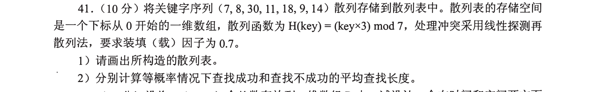
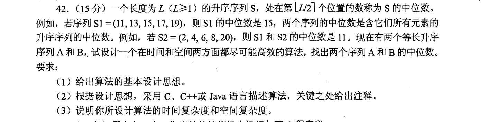
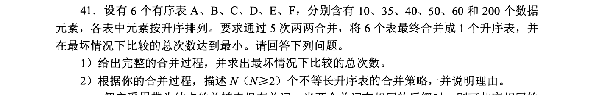
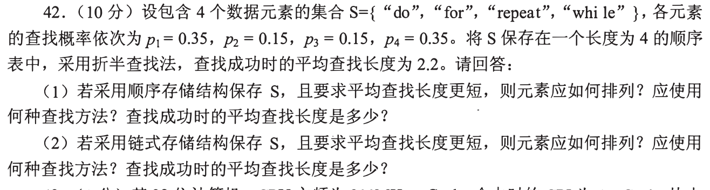
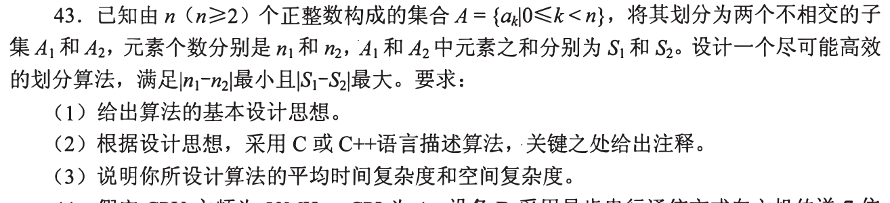
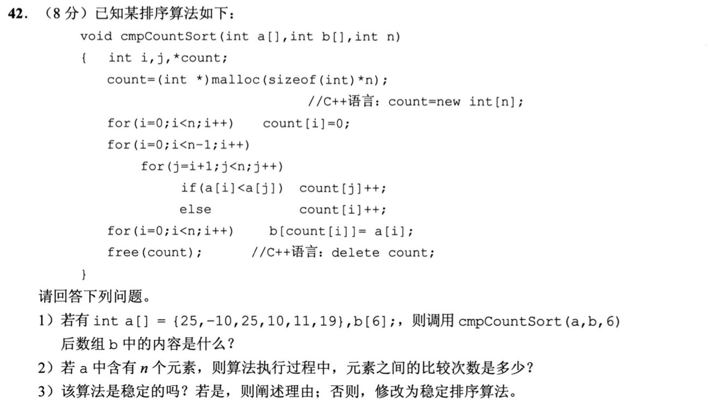
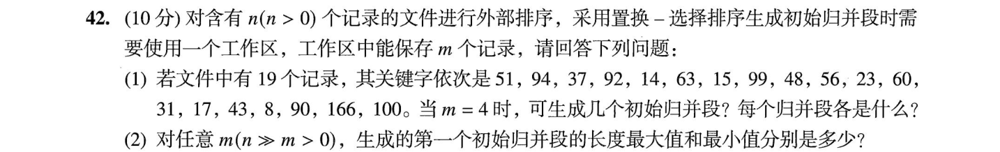
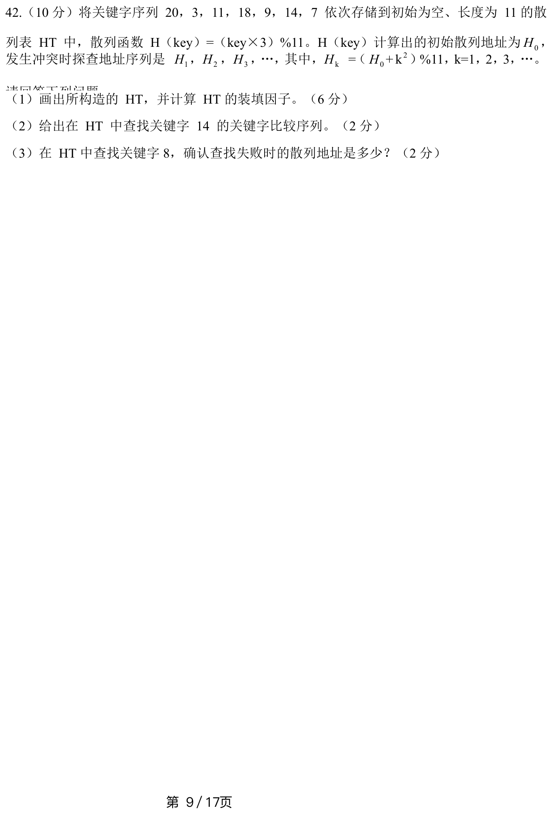

[← 0917](0917.md) · [总索引](README.md) · [0919 →](0919.md)

# 0918｜查找与排序：让分布、权重和内存边界决定代价

> 大题线 `W05-search-sort` · 第 05/19 个节点 · 8 道完整真题引用
>
> 选择题前置线：`09-search-hash`、`11-sort`、`12-external-sort`

## 归类依据

这组把平均查找长度、有序序列中位数、多路归并、带权顺序、集合分割、计数排序、置换选择和散列放在一起。共同动作是先识别输入分布与可用空间，再决定查找落点或下一批有序结果怎样产生。

这一节点以完整作答为单位。公共题干、全部小问、代码或计算过程必须在同一次作答中收口；再次出现的接口题只检查它与当前机制的连接，不重复抄题。

## 题单

### 01 · 2010-41

### 02 · 2011-42

### 03 · 2012-41

### 04 · 2013-42

### 05 · 2016-43

### 06 · 2021-42

### 07 · 2023-42

### 08 · 2024-42

[← 0917](0917.md) · [总索引](README.md) · [0919 →](0919.md)
