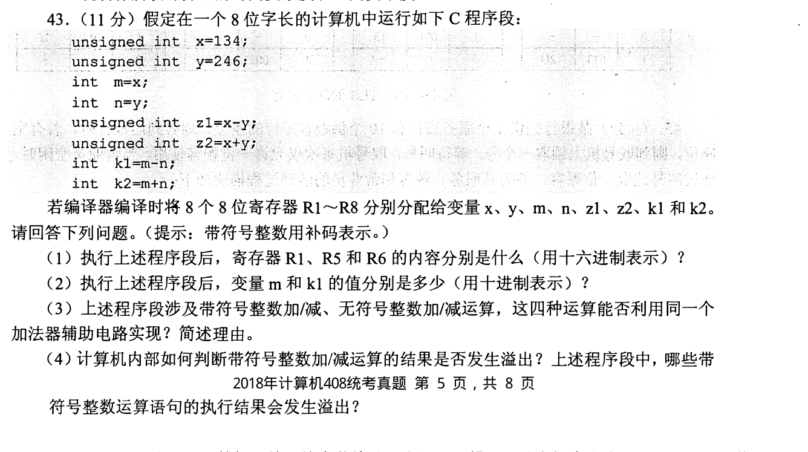
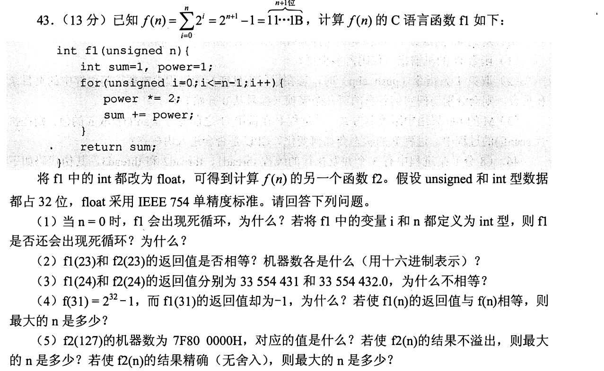
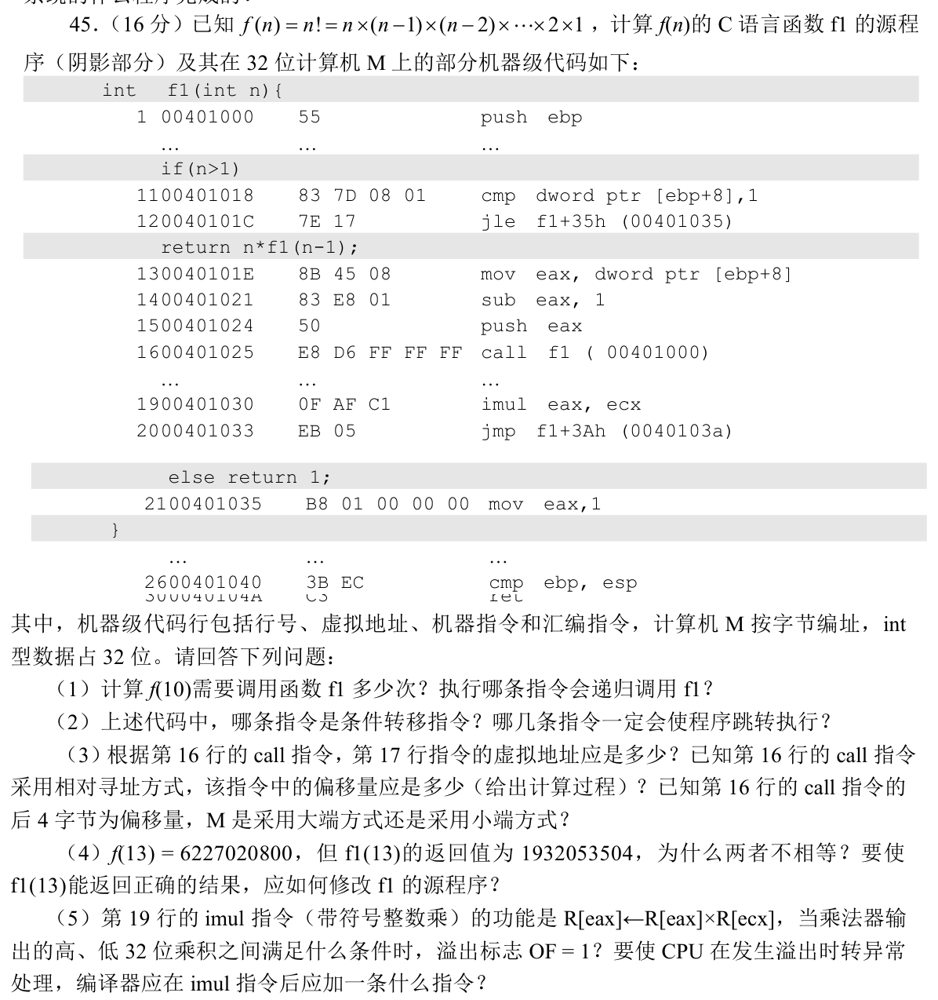
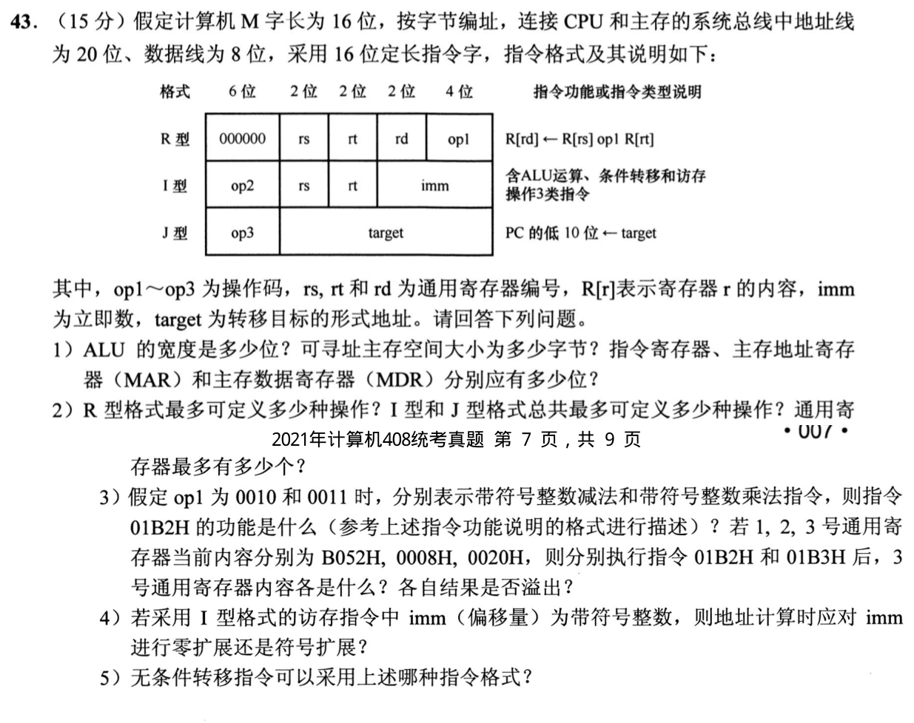
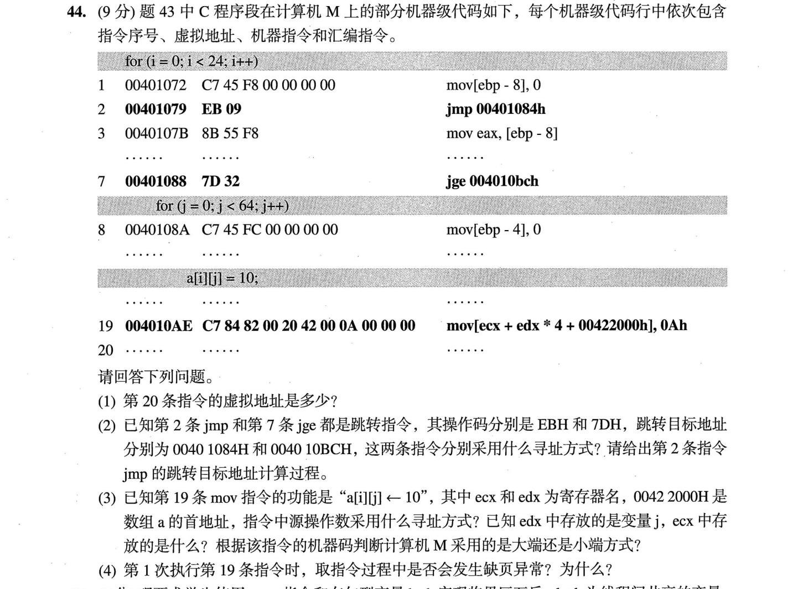
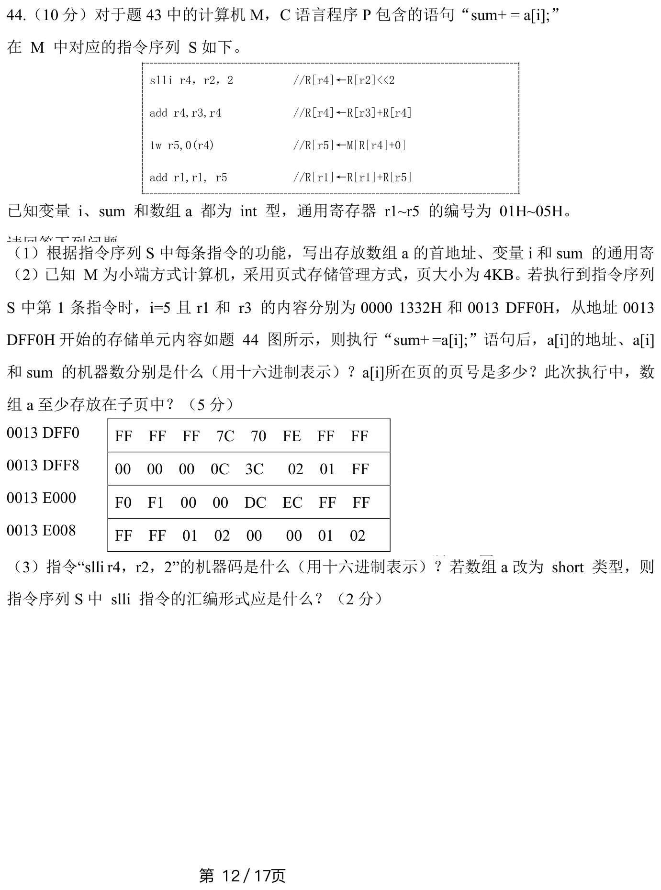

[← 0918](0918.md) · [总索引](README.md) · [0920 →](0920.md)

# 0919｜表示到汇编：同一位模式在类型、指令与调用中怎样解释

> 大题线 `W06-representation-assembly` · 第 06/19 个节点 · 7 道完整真题引用
>
> 选择题前置线：`13-number`、`14-arithmetic`、`19-isa`

## 归类依据

高级语言值、补码、寄存器、机器指令和栈帧属于不同解释层。这里要求沿执行顺序追踪位模式和地址，判断溢出、分支、调用以及数组访问最终落到什么机器状态。

这一节点以完整作答为单位。公共题干、全部小问、代码或计算过程必须在同一次作答中收口；再次出现的接口题只检查它与当前机制的连接，不重复抄题。

## 题单

### 01 · 2011-43

### 02 · 2017-43

### 03 · 2019-45

### 04 · 2021-43

### 05 · 2023-44

### 06 · 2024-44

### 07 · 2025-44

[← 0918](0918.md) · [总索引](README.md) · [0920 →](0920.md)
