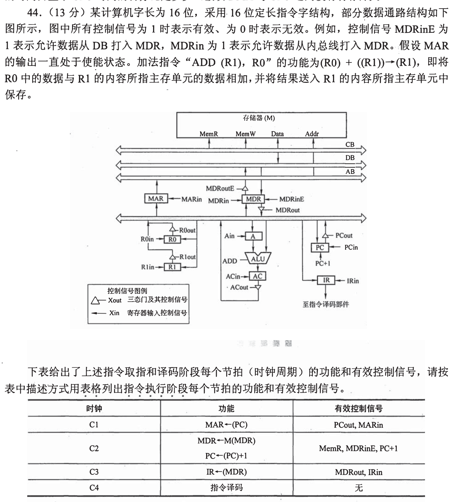
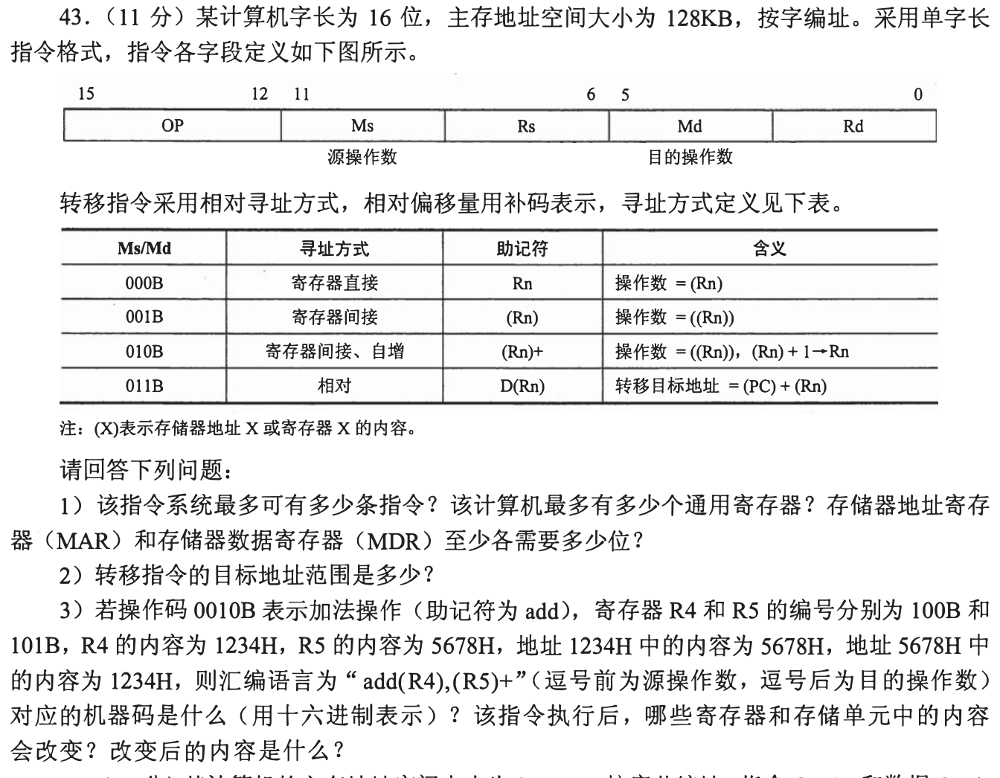
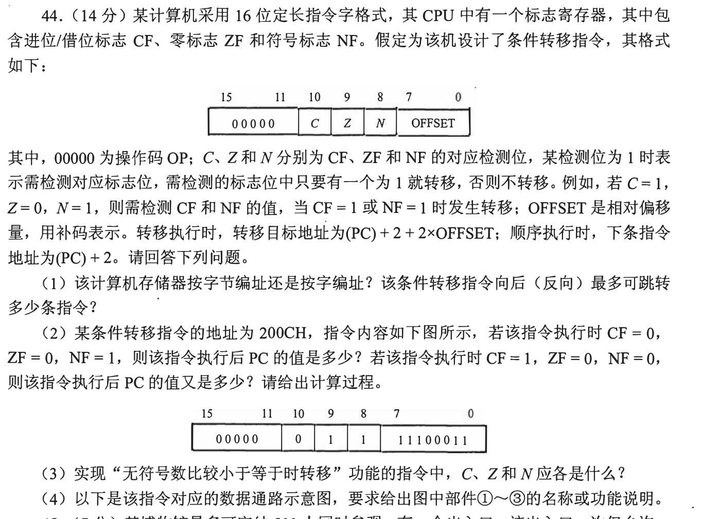
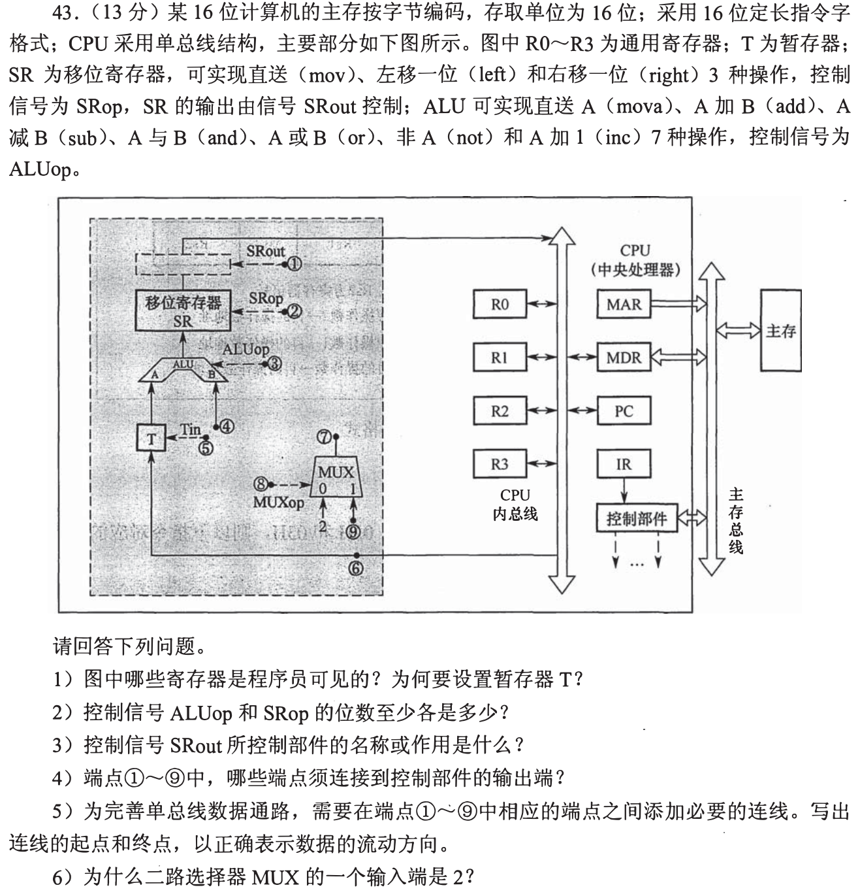
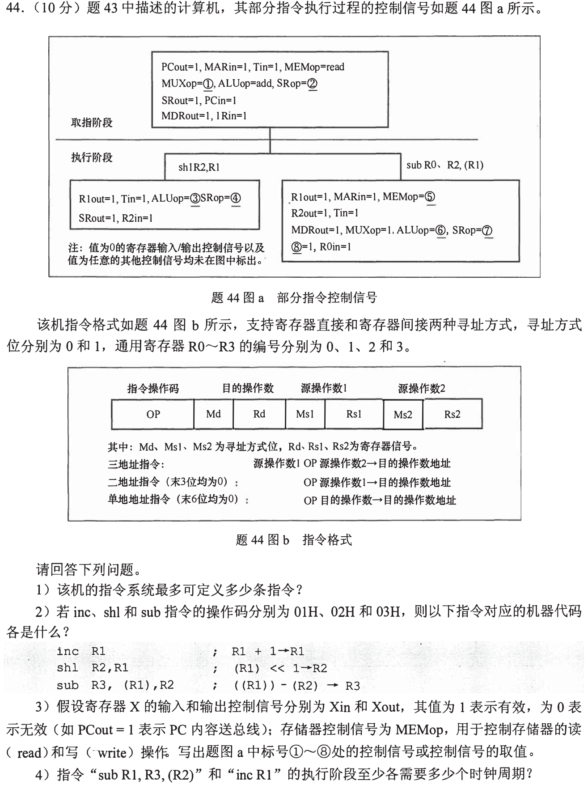
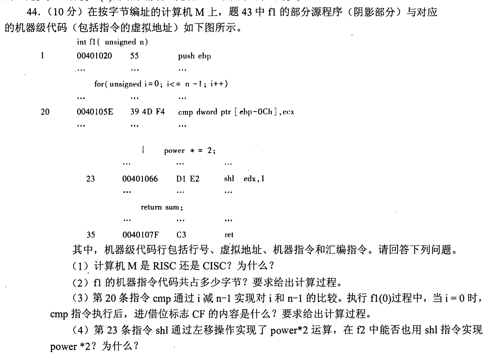
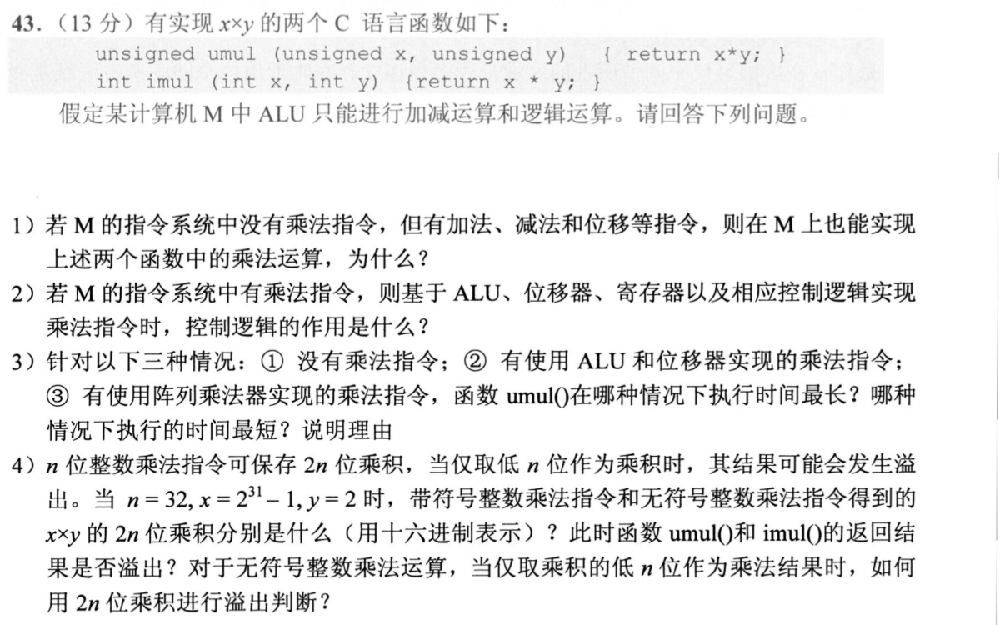
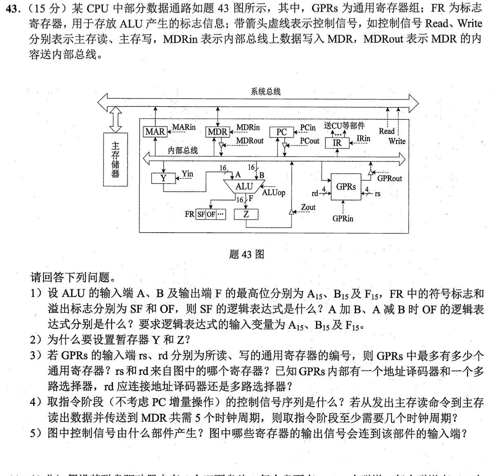
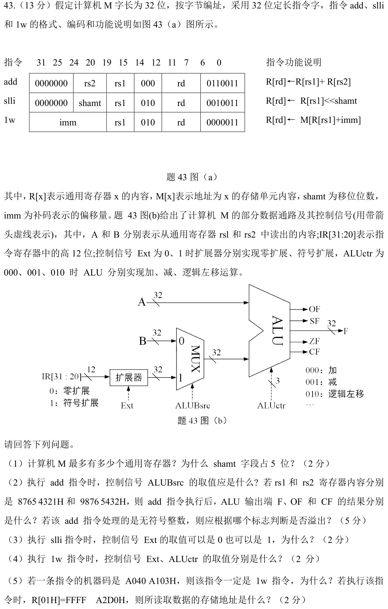

[« 0919-answer](0919-answer.md)　　[0921-answer »](0921-answer.md)

# 0920 Answer｜让数据通路实际走起来

> [原题 9 道](0920.md) · [0919 的位型与指令](0919-answer.md) · [能力账本](answer-quality/learning-ledger.md)
>
> 每个控制信号都要落实成“谁把值送到哪条线、谁在时钟边沿接住”。本文完成原题讲解；用户独立限时未验。

<strong>考场入口</strong>

| 题 | 第一笔 | 边界 |
| --- | --- | --- |
| 01 | R1 出地址至 MAR，读回 MDR，再与 R0 经 ALU 相加 | 内总线一拍只能一个发送者 |
| 02 | 指令拆 4/3/3/3/3 位，主存按字编址 | OP16种、寄存器8个 |
| 03 | `OFFSET=11100011B=−29` | 先判标志，再 `PC+2+2×OFFSET` |
| 04 | 顺 SR 的输入/输出跟线 | ALUop 3位、SRop 2位 |
| 05 | 对照 04 的 ALU、SR、MUX 控制 | 先判操作数数目再编码 |
| 06 | 最后一条 ret 后是函数末址 | 机器码占 96B |
| 07 | 低32位相同不等于 signed/unsigned 都不溢出 | signed 乘积低32位为 −2，unsigned 4294967294 |
| 08 | A/B/F 最高位写 OF 逻辑 | 取指至少 7 拍 |
| 09 | 图上字段逐项对位 | lw 的 12位偏移需符号扩展 |

## 01｜2009-44：微操作表中谁在驱动总线

题给的 C1—C4 完成取指：`PCout,MARin`；`MemR,MDRinE,PC+1`；`MDRout,IRin`；译码。题表 C2 把存储器访问写作 `M(MDR)`，与地址由 MAR 输出的图不合，按数据通路应读 **M(MAR)**。

执行 `ADD (R1),R0` 时，结果写回 **R1 指向的内存**，不是写入 R1。可按下面五拍收口：

| 拍 | 微操作 | 有效信号 |
| --- | --- | --- |
| C5 | `MAR←R1` | R1out, MARin |
| C6 | `MDR←M(MAR)`，同时 `A←R0` | MemR, MDRinE, R0out, Ain |
| C7 | `AC←A+MDR` | MDRout, ADD, ACin |
| C8 | `MDR←AC` | ACout, MDRin |
| C9 | `M(MAR)←MDR` | MDRoutE, MemW |

C6 的内总线 R0→A 与主存数据总线→MDR 是不同路径，可并行；C7 的 MDR→内总线与 ALU 计算在同拍。图中 MAR 输出常使能，故 C9 不必再给地址发控制信号。

避免三种“写回”混淆
R1 存的是地址，MAR 锁存地址；MDR 暂存内存来的操作数，之后再暂存写回结果；AC 才是 ALU 输出缓冲。不能 C7 同时让 R0 和 MDR 都驱动同一内总线，故先把 R0 存进 A。C2 的印刷式子不应使内存地址源改成 MDR。

## 02｜2010-43：位段、相对寻址与自增目的操作数

**（1）格式。** 16位分成 `OP(4)|Ms(3)|Rs(3)|Md(3)|Rd(3)`，最多 **16 条操作码**、**8 个通用寄存器**。128KB **按16位字编址**，有 `128KB/2B=65536` 个字地址，**MAR 至少16位**；一次访存16位，**MDR 至少16位**。地址计数单位是字，不能直接把字节容量当地址个数。

**（2）相对转移。** `D(Rn)` 把16位寄存器中的补码偏移加到 PC，偏移可为 **−32768 到 +32767**（按题设寄存器内容作为偏移），即目标在 `PC−32768..PC+32767` 与实际主存地址范围的交集；它不是17位全空间任意跳。

**（3）编码与状态。** `add (R4),(R5)+` 对应 `OP=0010,Ms=001,Rs=100,Md=010,Rd=101`，机器码 **2315H**。源值 `M[1234H]=5678H`；目的地址为 R5 原值 `5678H`，该单元原值 `1234H`，相加得 **68ACH** 写回 `M[5678H]`；R5 自增到 **5679H**，R4 仍 `1234H`。自增属于目的寻址副作用，不能把 R5 加到67xx 或把结果存到新地址。

一口气解码的保底法
先在十六位纸条上按 4/3/3/3/3 分格，再将寄存器号4、5填入；对 `(R5)+` 先保存旧地址再做访问，最后寄存器+1。题按字寻址访问单位，但寄存器自增量由题的寻址表明确写 `Rn+1`。

## 03｜2013-44：分支检测位与相对位移

**（1）编址与距离。** 单条指令16位，顺序 PC 加2，说明**按字节编址**。8位有符号 OFFSET 范围 −128..127，以指令为单位再乘2：向后最多128条，向前最多127条（分别256B与254B）。

**（2）条件与 PC。** 图中 `C=0,Z=1,N=1,OFFSET=11100011B=−29`，需检测 Z/N，任一为1即转移：从 `200CH+2+2×(−29)=1FD4H`。若 `CF=1,ZF=0,NF=0`，所检查的 Z/N 都是0，顺序执行，新 PC **200EH**。不是见 CF=1 就转移，C 位本次未被勾选。

**（3）无符号小于等于。** 比较后的 `CF=1` 表示无符号借位即小于，`ZF=1` 表示相等，因此检测位应 **C=1,Z=1,N=0**，两者逻辑或。此条件不使用 signed 结果的 NF。

**（4）图中①—③。** ①是**指令寄存器 IR**，向各位字段提供控制检测位和位移；②是**左移一位部件**，把符号扩展的 OFFSET 乘2；③是**加法器**，把这个位移与 `PC+2` 合成转移地址。条件检测用三个“与”门各自选 C/Z/N，再由“或”门汇总；多路选择器在 `PC+2` 与③的地址间选一个写回 PC。先分“条件成立否”和“目标地址多少”，能在图中的某个门辨不清时仍保住主要分。

为何前后距离不对称
8位补码的最小负值−128有一个额外的幅度，而最大正值只有127；相对基点是当前指令后的 `PC+2`，所以谈“后退128条”时仍需先加顺序两字节再乘偏移。

## 04｜2015-43：单总线数据通路的九个端点

**（1）可见寄存器与 T。** 程序员可显式使用 **R0—R3、PC**（IR、MAR、MDR、T、SR 等为执行部件）；T 锁存单总线上的一个操作数，下一拍另一操作数才可上总线与 T 同送 ALU，避免同拍双驱动。

**（2）信号位数。** ALU 七种操作最少 `ceil(log₂7)=3` 位；SR 的直送、左移、右移三种最少 `ceil(log₂3)=2` 位。**（3）SRout** 控制 SR 到总线的三态输出门，使 SR 的结果在合适拍上总线，不是 SR 的移位操作码。

**（4）哪些端点接控制部件输出。** 控制信号端点为 **① SRout、② SRop、③ ALUop、⑤ Tin、⑧ MUXop**；④、⑥、⑦、⑨承载数据。**（5）补全数据线。** 应补 **⑥→⑨**（内总线送入 MUX 的1号输入）和 **⑦→④**（MUX 输出送入 ALU 的 B 输入）。T→ALU 的 A 输入和 ALU→SR 在原图中已有连线，不属于这两条待补线；箭头按源到目的画。**（6）MUX 的0号输入固定数2**供16位指令、按字节编址时 `PC+2`；1号输入取总线值供一般运算。

两个控制问题的分界
“SR做哪种移位”由 SRop 决定；“SR是否把结果送到公共总线”由 SRout 决定。若将它们合并为一个信号，可能一边左移一边错误占总线。T 让第一操作数跨拍保留，正是单总线不能同时送两数的补救。

## 05｜2015-44：在上一题的数据通路上读微指令

**（1）最大指令数。** 16位指令有三个寻址位 `Md,Ms1,Ms2` 及三个2位寄存器号 `Rd,Rs1,Rs2`，剩余 **7位 OP**，最多 **128种操作码**。短操作数指令的空位不另算一套独立 OP。

**（2）编码。** 格式从高到低为 `OP7|Md1|Rd2|Ms1 1|Rs1 2|Ms2 1|Rs2 2`，直接方式0、间接方式1，缺省字段0：`inc R1` 为 **0240H**；`shl R2,R1`（题给语义 `(R1)<<1→R2`）为 **04A8H**；`sub R3,(R1),R2` 为 **06EAH**。读汇编后的括号语义再填方式位，不能只看逗号数。

**（3）图 a 空格。** 取指时 MUX 需常数2使 PC+2，故 **①=0、②=mov**；`shl` 先直送源到 SR 再左移，故 **③=mova、④=left**。`sub R0,R2,(R1)` 的首步按 R1 读内存，**⑤=read**；第二路 R2 已入 T，MDR 上总线作另一路，故 **⑥=sub、⑦=mov、⑧=SRout** 后送 R0。

**（4）最少拍数。** `inc R1` 可先由 R1 经 ALU 增1入 SR，再由 SR 写 R1，执行阶段至少 **2拍**。`sub R1,R3,(R2)` 需先 R2→MAR，再主存读→MDR（期间可将 R3→T），再 MDR 与 T 经 ALU 入 SR，最后 SR→R1，至少 **4拍**。取指另算，不与执行拍数混同。

从信号串还原操作
看第一个发送者 R1out/MARin，先判断它在提供**地址**；MemR 后 MDRout 才是内存数据；T 中已有 R2，ALU sub 的两输入有顺序，最后 SRout 到 R0。可以先恢复数据轨迹，再填空格，而不是背八个信号名。

## 06｜2017-44：机器码长度、CF 与浮点乘法

**（1）CISC。** 有 `push ebp`、内存参与比较的 `cmp dword ptr [ebp−0Ch],ecx` 等复杂/变长指令，是 **CISC** 的典型 x86 风格。**（2）代码长度。** 第一条从 `00401020H` 开始，末条 `ret` 在 `0040107FH` 占1字节，函数机器码区间到下一地址 `00401080H`，共 **60H=96字节**。

**（3）f1(0) 的 CF。** 承接[0919-02](0919-answer.md#q02)：`unsigned n−1=FFFFFFFFH`。第20条比较 `i−(n−1)`，i=0，小于无符号 `FFFFFFFFH`，减法需借位，**CF=1**。与“0减−1等于1”这种 signed 心算不同，cmp 的位运算结果与无符号借位标志要分开。

**（4）f2 不能照搬 shl。** f1 的 `power` 是 int，左移一位等同乘2（在可表示范围的位级模型内）；f2 改用 float，IEEE754 的存储由符号/阶码/尾数构成，直接左移编码不是数学乘2。浮点乘2应按浮点运算/阶码规则，不能照抄整数 `shl`。

区分“总字节”和“指令数”
用最后一条结束的下一地址减第一条起址，可跨过题中省略的中间指令；不是数可见五行。CF 表示无符号借位，OF 是有符号溢出，别用一旗回答所有比较。

## 07｜2020-43：乘法全宽结果相同，溢出解释不同

**（1）无乘法指令也能算。** 用加法和移位逐位做移位累加乘法，或重复加法；补码 signed 可先处理符号/取绝对值再施符号。**（2）有乘法指令时**控制逻辑控制部分积寄存器、位移次数、ALU 加减与状态计数，反复执行到乘积完成，不能把“ALU只会加减”误判为CPU不能乘。

**（3）快慢。** 无乘法指令的软件循环通常最慢；用 ALU+移位器实现的迭代乘法居中；阵列乘法器可并行形成并压缩部分积，通常最快。比较针对题给三种实现的典型结构，不把时钟频率差异臆加进题。

**（4）数值和标志。** `x=2^31−1=7FFFFFFFH,y=2`，64位乘积在 signed、unsigned 两种解释下均为 **00000000FFFFFFFEH**（两个正操作数）；低32位 `FFFFFFFEH`。`umul` 作为 unsigned 结果 **4294967294** 在 `0..2^32−1` 内，无溢出；`imul` 作为 signed 结果解释为 **−2**，数学乘积4294967294超 signed32，溢出。unsigned 乘法若高32位**非0**则仅低32位不足以表示，应判溢出；signed 则检查高半是否为低半符号位的全0/全1扩展。

不要见64位高半为0就说都安全
unsigned 最大为 `FFFFFFFFH`，低半 `FFFFFFFEH` 合法；signed 最大仅 `7FFFFFFFH`，同一低半被读作−2。承接 0919：结果位相同，解释和溢出判据不同。

## 08｜2022-43：控制信号与 OF 的布尔判据

**（1）标志。** `SF=F15`。加法 `OF=¬(A15⊕B15)∧(A15⊕F15)`；减法 `OF=(A15⊕B15)∧(A15⊕F15)`。前者同号相加变号，后者异号相减变成与被减数异号。

**（2）Y/Z 的必要性。** Y 锁存总线来的一个 ALU 输入，Z 锁存结果，避免单总线同拍同时提供两个操作数/读回结果。**（3）寄存器组。** rs、rd各4位，可选最多 **16个 GPR**；字段来自 IR。题图只有一个地址译码器和一个选择器：写地址 rd 接**译码器**以使能目标寄存器，读地址 rs 接**多路选择器**以选出一个寄存器内容送总线。

**（4）取指。** 不考虑 PC 增量时 `PCout,MARin` 需一拍；从发主存读命令到数据入 MDR 共5拍；`MDRout,IRin` 再一拍，至少 **7拍**。不能把主存5拍与总线寄存器转送一概算一拍。

**（5）信号来源。** 控制信号由**控制器/控制单元 CU**发出；IR 的指令位与 FR 的条件标志连到 CU 输入，用于译码与条件判定。PC 提供地址至内部总线，不因为它重要就说它的输出是每条微控制信号的直接输入。

乘积项怎么从语言得到
加法溢出要“输入同号”与“输出异号”同时成立，写成两个布尔条件相与；减法将第二项改成“被减数与减数异号”。先说文字再写异或式，可在忘记公式时重建。

## 09｜2024-43：图给的自定义编码，不猜现成 ISA

**（1）寄存器和移位。** 各寄存器号字段5位，可寻址最多 **32** 个；32位字逻辑左移可取位数0..31，需 **5位 shamt**。

**（2）add。** ALUBsrc=**0** 选寄存器B。`87654321H+98765432H=1 1FDB9753H`，低32位输出 **1FDB9753H**、两负数位型相加得正号输出故 **OF=1**、第33位进位故 **CF=1**。若按 unsigned 解释，只用 CF 判断是否溢出。

**（3）slli 的 Ext。** shamt 只有5位，最高位31以下，**零扩展与符号扩展相同**，因此 Ext=0/1 均不影响结果。**（4）lw。** `imm` 为12位补码位移，**Ext=1** 符号扩展；ALU 算基址加位移，**ALUctr=000**。

**（5）给定机器码。** `A040A103H` 低7位为 `0000011` 确认 lw；`rs1=01H`、`imm=A04H` 作为12位负数为−`5FCH`。`R[01H]=FFFFA2D0H`，地址 `FFFFA2D0H−5FCH=FFFF9CD4H`。不能把 A04H 当正数直接加；本题自定义字段的图在首部，先取字段再算地址。

移位和访存的两种“扩展”
移位量5位最大31，最高位在第4位即便为1，也不应作为有符号负数；图中的12位扩展线对 shamt 可任选，是因实际有效移位字段高位补0。访存的位移可为负，才必须保留符号。

## 训练闭环

遮住控制信号表，拿 01 的五拍和 05 的微指令图相互解释；再混排 02/03/09 的位段解码。检查是否真的能从图指出数据来源、目标与时钟边沿，不能把“读完题解”登记为操作熟练。

[« 0919-answer](0919-answer.md)　　[0921-answer »](0921-answer.md)
