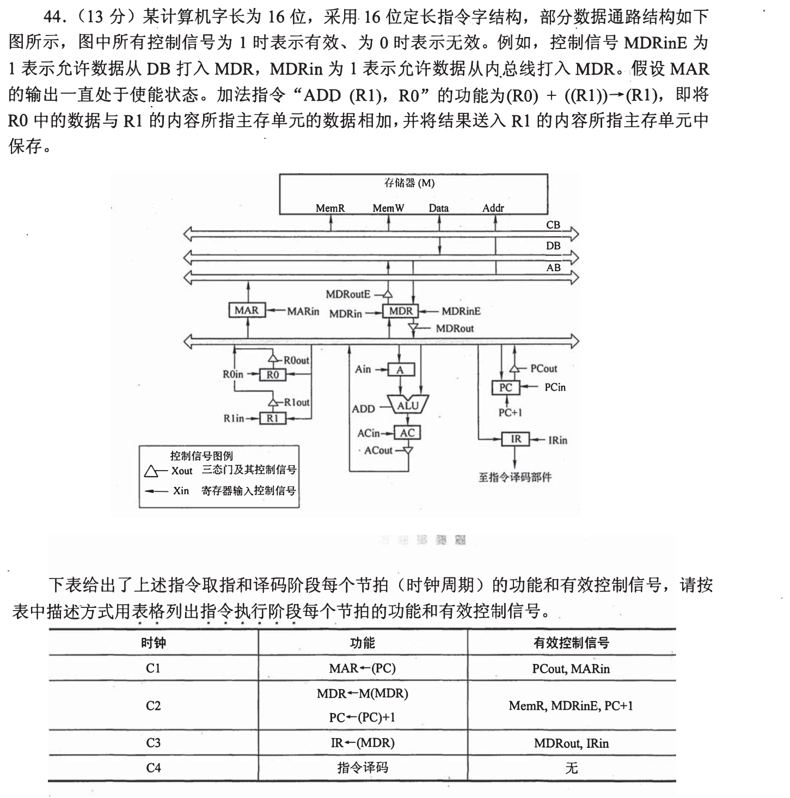
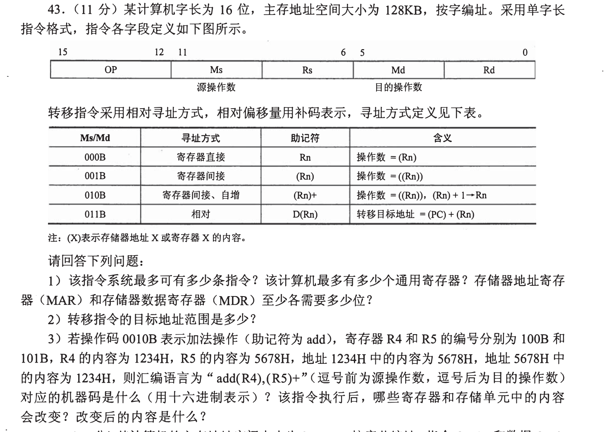
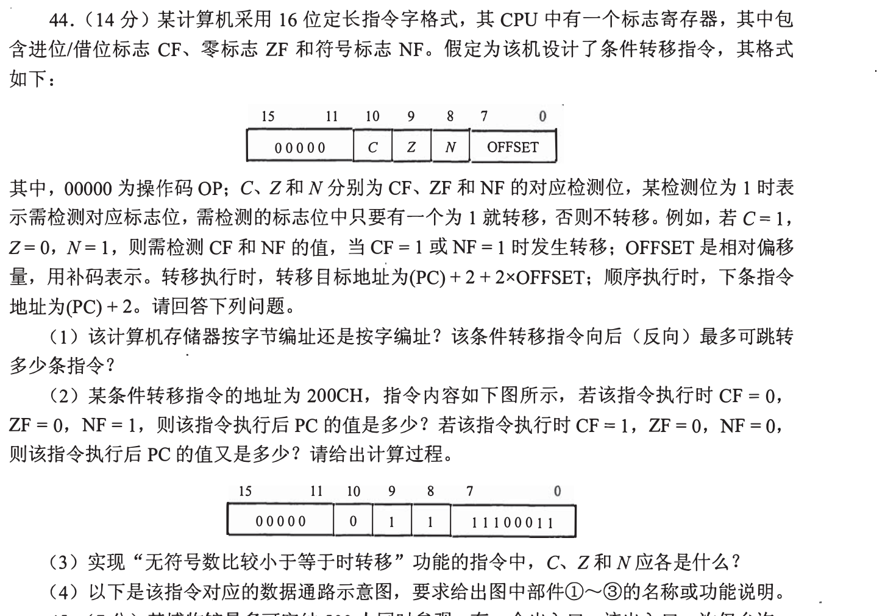
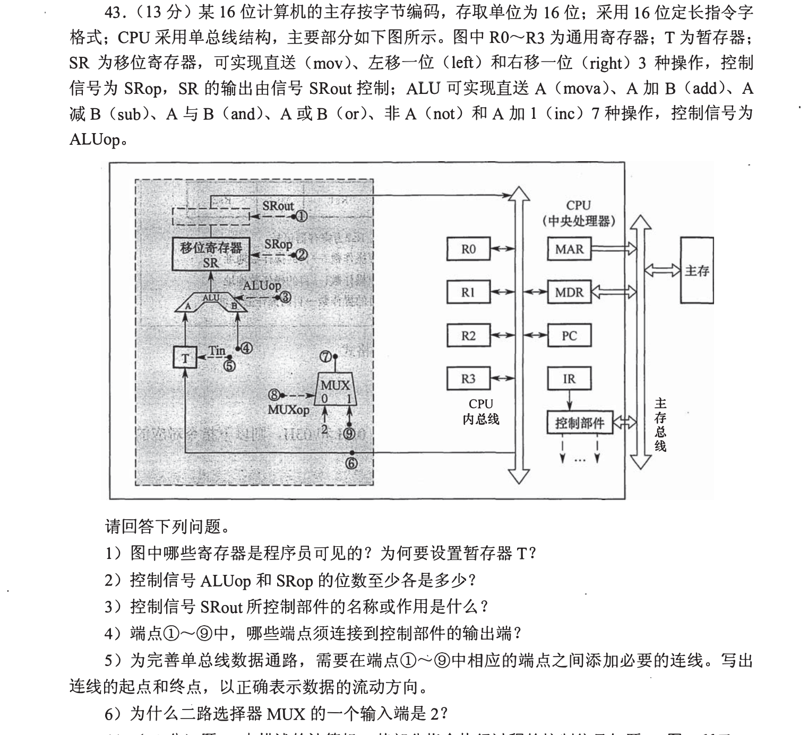
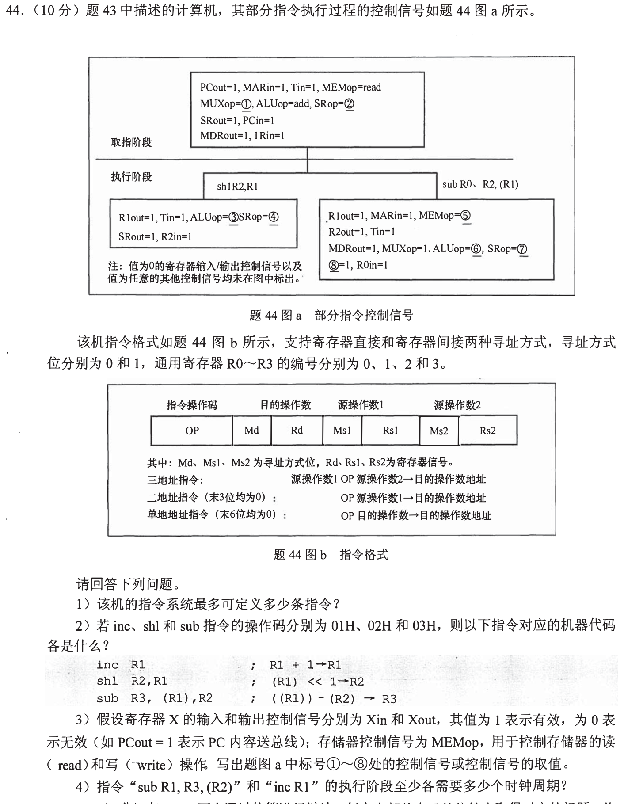
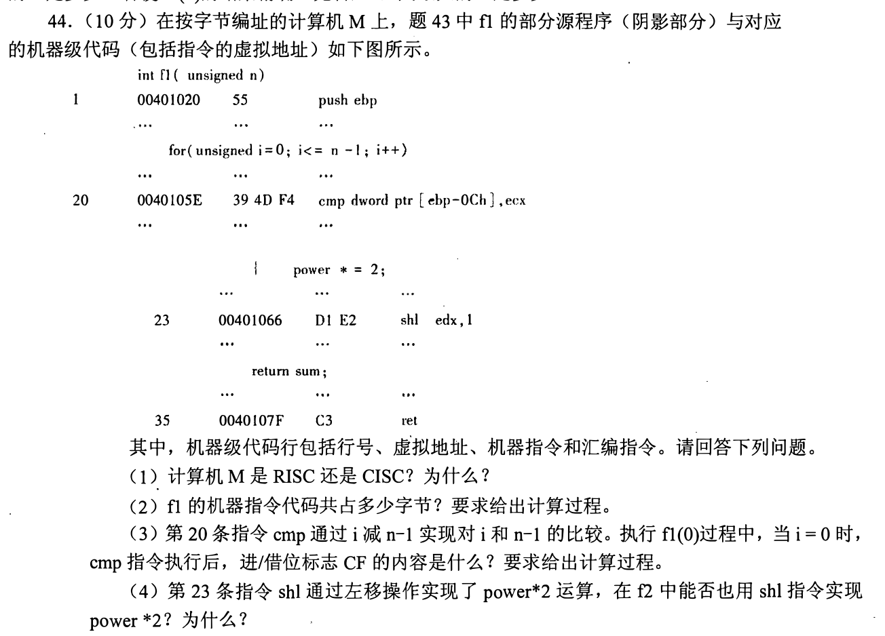
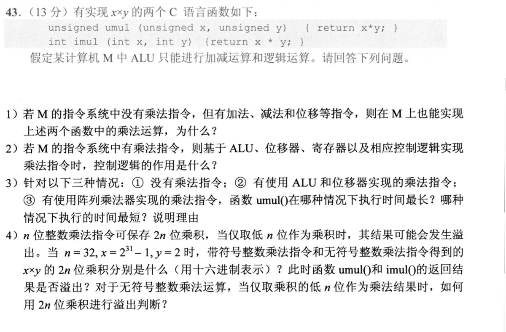
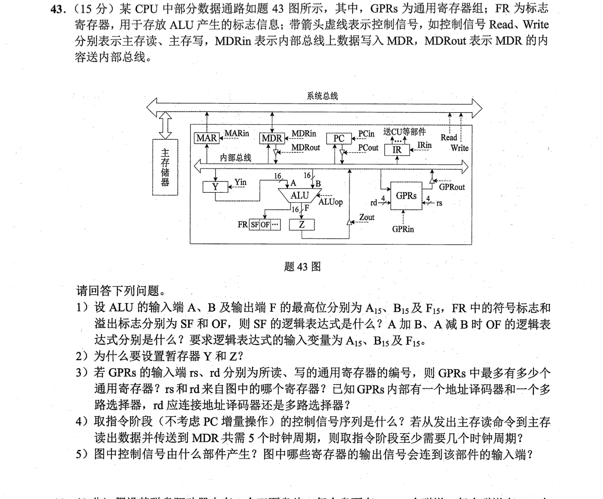
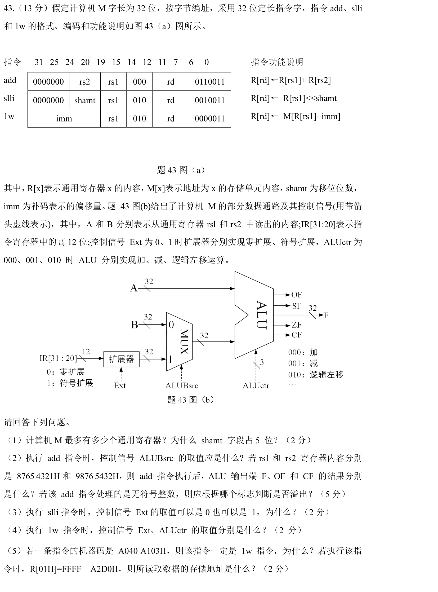

[← 0919](0919.md) · [总索引](README.md) · [0921 →](0921.md)

# 0920｜指令落到数据通路：寄存器、部件与控制信号协同

> 大题线 `W07-datapath-control` · 第 07/19 个节点 · 9 道完整真题引用
>
> 选择题前置线：`18-instruction-address`、`20-datapath`

## 归类依据

题面可能给指令格式、微操作表或局部数据通路，但解题动作一致：逐拍确定数据从哪里来、经过哪个部件、写回哪里，并据此补全控制信号和指令行为。

这一节点以完整作答为单位。公共题干、全部小问、代码或计算过程必须在同一次作答中收口；再次出现的接口题只检查它与当前机制的连接，不重复抄题。

## 题单

### 01 · 2009-44

### 02 · 2010-43

### 03 · 2013-44

### 04 · 2015-43

### 05 · 2015-44

### 06 · 2017-44

### 07 · 2020-43

### 08 · 2022-43

### 09 · 2024-43

[← 0919](0919.md) · [总索引](README.md) · [0921 →](0921.md)
